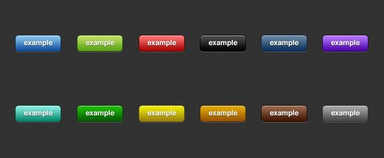
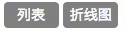
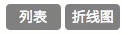

<!--more-->

最近在AngularJS2中要实现一个按钮切换的效果，我采用三目表达式和ng-class的方式来实现了这一效果，比较简单粗暴。

首先，我的项目的XX.Component.ts中的template有个button标签：

```html
<button type="submit">列表</button>
<button type="submit">折线图</button>
```

创建XX.Component.css，为标签添加简单的样式（我只是举个例子，这个样式的定义还可以再优化一下）：

```css
.active {
  color: #fff;
  border: 1px solid transparent;
  border-radius: 4px;
  background-color: #0086FD;
  padding: 5px;
  outline: none;
  width: 55px;
}

.btn-lt {
  color: #fff;
  border: 1px solid transparent;
  border-radius: 4px;
  background-color: gray;
  padding: 5px;
  outline: none;
  width: 55px;
}
```

然后我需要实现的效果是：加载完页面后，两个按钮都是灰色的，当你点击其中一个按钮时，按钮变成蓝色。

为了实现这个效果，我引入了begin和blue两个变量，分别控制起始状态和点击时的状态。当blue为true且begin===1时按钮变蓝色；当blue为false时或者begin！= 1时按钮变灰色。代码如下：

```html
<button [class]="begin === 1 && blue?'active':'btn-lt'" type="submit"  (click)="blue=true;begin=1">列表</button>
<button [class]="begin === 1 && !blue?'active':'btn-lt'" type="submit"  (click)="blue=false;begin=1">折线图</button>
```

完成后的效果如下：



这个方法还可以组合出其他不同的效果，比如说点击后当前按钮变灰：

```html
<button [class]="begin === 1 && blue?'active':'btn-lt'" type="submit"  (click)="blue=false;begin=1">列表</button>
<button [class]="begin === 1 && !blue?'active':'btn-lt'" type="submit"  (click)="blue=true;begin=1">折线图</button>
```
完成后的效果如下：



比如把begin去掉，可以实现加载完成后有一个按钮处于激活状态，这里我就不做gif了，可以自己尝试一下。
