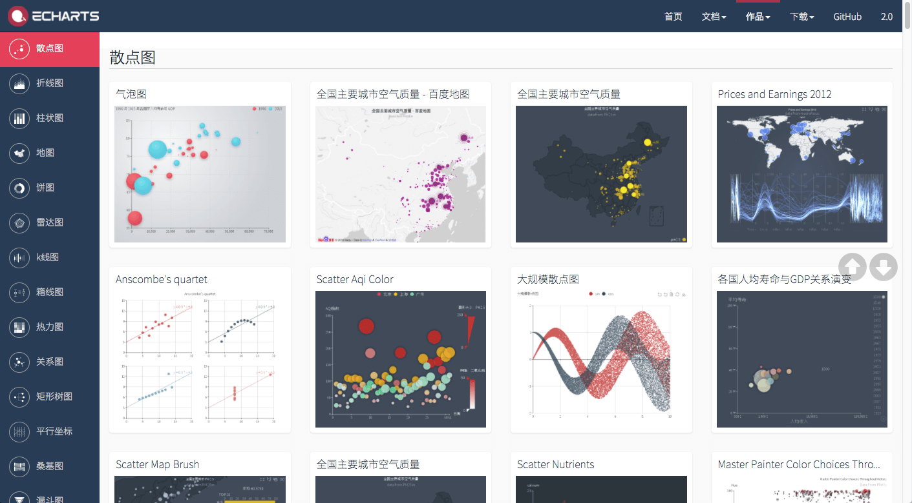
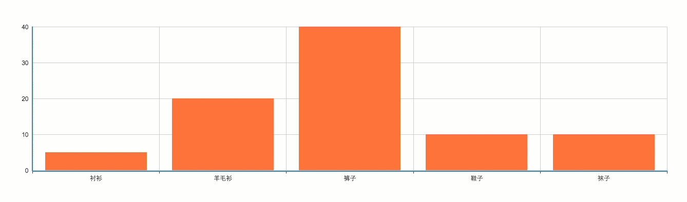
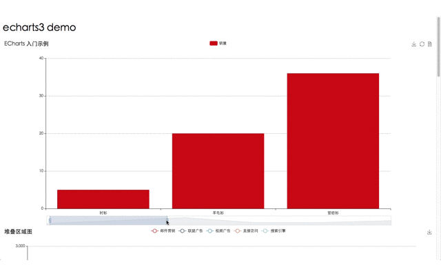

<!--more-->

这周项目上写了一个基于Angular2.0的Echarts3组件，踩了好几个坑，也算有一点使用心得了。

## Echarts是什么鬼

> ECharts 是指 Enterprise Charts（商业产品图表库），提供商业产品常用图表库，底层基于 [ZRender](http://ecomfe.github.io/zrender/)，创建了坐标系，图例，提示，工具箱等基础组件，并在此上构建出折线图（区域图）、柱状图（条状图）、散点图（气泡图）、K线图、饼图（环形图）、地图、力导向布局图，同时支持任意维度的堆积和多图表混合展现。

Echarts提供了多种图表展示方式：



Echarts提供了包括值域漫游、大规模散点图、数据动态添加、数据区域漫游、图例开关、动态类型切换等在内的多种数据操作方式。Echarts升级到3.0后，增加了对移动端的支持，而且体积更小，实乃数据分析必备良药。

## Echarts正确打开方式

首先来看官方案例：

```html
<!DOCTYPE html>
<html>
<head>
    <meta charset="utf-8">
    <title>ECharts</title>
    <!-- 引入 echarts.js -->
    <script src="echarts.min.js"></script>
</head>
<body>
    <!-- 为ECharts准备一个具备大小（宽高）的Dom -->
    <div id="main" style="width: 600px;height:400px;"></div>
    <script type="text/javascript">
        // 基于准备好的dom，初始化echarts实例
        var myChart = echarts.init(document.getElementById('main'));

        // 指定图表的配置项和数据
        var option = {
            title: {
                text: 'ECharts 入门示例'
            },
            tooltip: {},
            legend: {
                data:['销量']
            },
            xAxis: {
                data: ["衬衫","羊毛衫","雪纺衫","裤子","高跟鞋","袜子"]
            },
            yAxis: {},
            series: [{
                name: '销量',
                type: 'bar',
                data: [5, 20, 36, 10, 10, 20]
            }]
        };

        // 使用刚指定的配置项和数据显示图表。
        myChart.setOption(option);
    </script>
</body>
</html>
```



怎么样，是不是觉得很好玩，当然这只是最基本的数据展示功能，下面我们来玩一个进阶一点的Demo。

```HTML
<!DOCTYPE html>
<html>

<head>
    <meta charset="gb2312">
    <title>echarts3</title>
</head>

<body>
    <h1>echarts3 demo</h1>
    <!--定义有大小的DOM容器-->
    <div id="barChart" style="width: 100%;height:600px;"></div>
    <div id="lineChart" style="width: 100%;height:600px;"></div>
    <div id="radarChart" style="width: 100%;height:600px;"></div>
    <div id="pieChart" style="width: 100%;height:600px;"></div>
    <div id="dotChart" style="width: 100%;height:600px;"></div>

    <!--导入js代码-->
    <script type="text/javascript" src='./jquery.js'></script>
    <script type="text/javascript" src='./echarts.js'></script>
    <script type="text/javascript">

    //界面最先运行这个代码块
    $(document).ready(function() {
        initBarEcharts();
        initLineEcharts();
        initRadarEcharts();
        initPieEcharts();
        initDotEcharts();
    });

    //初始化柱状图
    function initBarEcharts() {
        var myChart = echarts.init(document.getElementById('barChart'));
        // 指定图表的配置项和数据
        var option = {
            title: {
                text: 'ECharts 入门示例'
            },
          dataZoom: {
            	type: 'slider',
            	show: true,
            	start: 1,
            	end: 35
            },
            tooltip: {},
            toolbox: {
                show: true,
                feature: {
                    saveAsImage: {
                        show: true,
                        type: 'jpeg',
                    },
                    restore: {
                        show: true,
                    },
                    dataView: {
                        show: true,
                    },
                    magicType: {
                        show: true,
                    }
                },
            },
            legend: {
                data: ['销量']
            },
            xAxis: {
                //x轴数据，数组形式
                data: ["衬衫", "羊毛衫", "雪纺衫", "裤子", "高跟鞋", "袜子"]
            },
            yAxis: {},
            series: [{
                name: '销量',
                type: 'bar',
                data: [5, 20, 36, 10, 10, 20]
            }]
        };

        // 使用刚指定的配置项和数据显示图表。
        myChart.setOption(option);
    }

    //初始化折线图图
    function initLineEcharts() {
        var myChart = echarts.init(document.getElementById('lineChart'));
        // 指定图表的配置项和数据
        option = {
            title: {
                text: '堆叠区域图'
            },
            tooltip: {
                trigger: 'axis'
            },
          
            legend: {
                data: ['邮件营销', '联盟广告', '视频广告', '直接访问', '搜索引擎']
            },
            toolbox: {
                feature: {
                    saveAsImage: {}
                }
            },
            grid: {
                left: '3%',
                right: '4%',
                bottom: '3%',
                containLabel: true
            },
            xAxis: [{
                type: 'category',
                boundaryGap: false,
                data: ['周一', '周二', '周三', '周四', '周五', '周六', '周日']
            }],
            yAxis: [{
                type: 'value'
            }],
            series: [{
                name: '邮件营销',
                type: 'line',
                stack: '总量',
                areaStyle: {
                    normal: {}
                },
                data: [120, 132, 101, 134, 90, 230, 210]
            }, {
                name: '联盟广告',
                type: 'line',
                stack: '总量',
                areaStyle: {
                    normal: {}
                },
                data: [220, 182, 191, 234, 290, 330, 310]
            }, {
                name: '视频广告',
                type: 'line',
                stack: '总量',
                areaStyle: {
                    normal: {}
                },
                data: [150, 232, 201, 154, 190, 330, 410]
            }, {
                name: '直接访问',
                type: 'line',
                stack: '总量',
                areaStyle: {
                    normal: {}
                },
                data: [320, 332, 301, 334, 390, 330, 320]
            }, {
                name: '搜索引擎',
                type: 'line',
                stack: '总量',
                label: {
                    normal: {
                        show: true,
                        position: 'top'
                    }
                },
                areaStyle: {
                    normal: {}
                },
                data: [820, 932, 901, 934, 1290, 1330, 1320]
            }]
        };


        // 使用刚指定的配置项和数据显示图表。
        myChart.setOption(option);
    }

    //初始化雷达图
    function initRadarEcharts() {
        var myChart = echarts.init(document.getElementById('radarChart'));
        // 指定图表的配置项和数据
        option = {
            title: {
                text: '基础雷达图'
            },
            tooltip: {},
            legend: {
                data: ['预算分配（Allocated Budget）', '实际开销（Actual Spending）']
            },
            radar: {
                // shape: 'circle',
                indicator: [{
                    name: '销售（sales）',
                    max: 6500
                }, {
                    name: '管理（Administration）',
                    max: 16000
                }, {
                    name: '信息技术（Information Techology）',
                    max: 30000
                }, {
                    name: '客服（Customer Support）',
                    max: 38000
                }, {
                    name: '研发（Development）',
                    max: 52000
                }, {
                    name: '市场（Marketing）',
                    max: 25000
                }]
            },
            series: [{
                name: '预算 vs 开销（Budget vs spending）',
                type: 'radar',
                // areaStyle: {normal: {}},
                data: [{
                    value: [4300, 10000, 28000, 35000, 50000, 19000],
                    name: '预算分配（Allocated Budget）'
                }, {
                    value: [5000, 14000, 28000, 31000, 42000, 21000],
                    name: '实际开销（Actual Spending）'
                }]
            }]
        };

        // 使用刚指定的配置项和数据显示图表。
        myChart.setOption(option);
    }

    //初始化饼图
    function initPieEcharts() {
        var myChart = echarts.init(document.getElementById('pieChart'));
        // 指定图表的配置项和数据
        option = {
            backgroundColor: '#2c343c',

            title: {
                text: 'Customized Pie',
                left: 'center',
                top: 20,
                textStyle: {
                    color: '#ccc'
                }
            },

            tooltip: {
                trigger: 'item',
                formatter: "{a} <br/>{b} : {c} ({d}%)"
            },

            visualMap: {
                show: false,
                min: 80,
                max: 600,
                inRange: {
                    colorLightness: [0, 1]
                }
            },
            series: [{
                name: '访问来源',
                type: 'pie',
                radius: '55%',
                center: ['50%', '50%'],
                data: [{
                    value: 335,
                    name: '直接访问'
                }, {
                    value: 310,
                    name: '邮件营销'
                }, {
                    value: 274,
                    name: '联盟广告'
                }, {
                    value: 235,
                    name: '视频广告'
                }, {
                    value: 400,
                    name: '搜索引擎'
                }].sort(function(a, b) {
                    return a.value - b.value
                }),
                roseType: 'angle',
                label: {
                    normal: {
                        textStyle: {
                            color: 'rgba(255, 255, 255, 0.3)'
                        }
                    }
                },
                labelLine: {
                    normal: {
                        lineStyle: {
                            color: 'rgba(255, 255, 255, 0.3)'
                        },
                        smooth: 0.2,
                        length: 10,
                        length2: 20
                    }
                },
                itemStyle: {
                    normal: {
                        color: '#c23531',
                        shadowBlur: 200,
                        shadowColor: 'rgba(0, 0, 0, 0.5)'
                    }
                }
            }]
        };

        // 使用刚指定的配置项和数据显示图表。
        myChart.setOption(option);
    }

    //初始化散点图
    function initDotEcharts() {
        var myChart = echarts.init(document.getElementById('dotChart'));
        // 指定图表的配置项和数据

        var data = [
            [
                [28604, 77, 17096869, 'Australia', 1990],
                [31163, 77.4, 27662440, 'Canada', 1990],
                [1516, 68, 1154605773, 'China', 1990],
                [13670, 74.7, 10582082, 'Cuba', 1990],
                [28599, 75, 4986705, 'Finland', 1990],
                [29476, 77.1, 56943299, 'France', 1990],
                [31476, 75.4, 78958237, 'Germany', 1990],
                [28666, 78.1, 254830, 'Iceland', 1990],
                [1777, 57.7, 870601776, 'India', 1990],
                [29550, 79.1, 122249285, 'Japan', 1990],
                [2076, 67.9, 20194354, 'North Korea', 1990],
                [12087, 72, 42972254, 'South Korea', 1990],
                [24021, 75.4, 3397534, 'New Zealand', 1990],
                [43296, 76.8, 4240375, 'Norway', 1990],
                [10088, 70.8, 38195258, 'Poland', 1990],
                [19349, 69.6, 147568552, 'Russia', 1990],
                [10670, 67.3, 53994605, 'Turkey', 1990],
                [26424, 75.7, 57110117, 'United Kingdom', 1990],
                [37062, 75.4, 252847810, 'United States', 1990]
            ],
            [
                [44056, 81.8, 23968973, 'Australia', 2015],
                [43294, 81.7, 35939927, 'Canada', 2015],
                [13334, 76.9, 1376048943, 'China', 2015],
                [21291, 78.5, 11389562, 'Cuba', 2015],
                [38923, 80.8, 5503457, 'Finland', 2015],
                [37599, 81.9, 64395345, 'France', 2015],
                [44053, 81.1, 80688545, 'Germany', 2015],
                [42182, 82.8, 329425, 'Iceland', 2015],
                [5903, 66.8, 1311050527, 'India', 2015],
                [36162, 83.5, 126573481, 'Japan', 2015],
                [1390, 71.4, 25155317, 'North Korea', 2015],
                [34644, 80.7, 50293439, 'South Korea', 2015],
                [34186, 80.6, 4528526, 'New Zealand', 2015],
                [64304, 81.6, 5210967, 'Norway', 2015],
                [24787, 77.3, 38611794, 'Poland', 2015],
                [23038, 73.13, 143456918, 'Russia', 2015],
                [19360, 76.5, 78665830, 'Turkey', 2015],
                [38225, 81.4, 64715810, 'United Kingdom', 2015],
                [53354, 79.1, 321773631, 'United States', 2015]
            ]
        ];

        option = {
            backgroundColor: new echarts.graphic.RadialGradient(0.3, 0.3, 0.8, [{
                offset: 0,
                color: '#f7f8fa'
            }, {
                offset: 1,
                color: '#cdd0d5'
            }]),
            title: {
                text: '1990 与 2015 年各国家人均寿命与 GDP'
            },
            legend: {
                right: 10,
                data: ['1990', '2015']
            },
            xAxis: {
                splitLine: {
                    lineStyle: {
                        type: 'dashed'
                    }
                }
            },
            yAxis: {
                splitLine: {
                    lineStyle: {
                        type: 'dashed'
                    }
                },
                scale: true
            },
            series: [{
                name: '1990',
                data: data[0],
                type: 'scatter',
                symbolSize: function(data) {
                    return Math.sqrt(data[2]) / 5e2;
                },
                label: {
                    emphasis: {
                        show: true,
                        formatter: function(param) {
                            return param.data[3];
                        },
                        position: 'top'
                    }
                },
                itemStyle: {
                    normal: {
                        shadowBlur: 10,
                        shadowColor: 'rgba(120, 36, 50, 0.5)',
                        shadowOffsetY: 5,
                        color: new echarts.graphic.RadialGradient(0.4, 0.3, 1, [{
                            offset: 0,
                            color: 'rgb(251, 118, 123)'
                        }, {
                            offset: 1,
                            color: 'rgb(204, 46, 72)'
                        }])
                    }
                }
            }, {
                name: '2015',
                data: data[1],
                type: 'scatter',
                symbolSize: function(data) {
                    return Math.sqrt(data[2]) / 5e2;
                },
                label: {
                    emphasis: {
                        show: true,
                        formatter: function(param) {
                            return param.data[3];
                        },
                        position: 'top'
                    }
                },
                itemStyle: {
                    normal: {
                        shadowBlur: 10,
                        shadowColor: 'rgba(25, 100, 150, 0.5)',
                        shadowOffsetY: 5,
                        color: new echarts.graphic.RadialGradient(0.4, 0.3, 1, [{
                            offset: 0,
                            color: 'rgb(129, 227, 238)'
                        }, {
                            offset: 1,
                            color: 'rgb(25, 183, 207)'
                        }])
                    }
                }
            }]
        };

        // 使用刚指定的配置项和数据显示图表。
        myChart.setOption(option);
    }
    </script>
</body>

</html>
```



## Echarts与Angular2.0

我做组件的时候定义了`ky-line`标签，通过`<ky-line [data]="myoption"></ky-line>`里的data属性来传递option的数据，这样拿到后端的数据后，往myoption里面push数据，并通过`ky-line`标签，把数据传递给Echarts中的option，这样就可以实现给echarts动态写入数据。不过要注意的是，给echarts中动态增加数据的时候，首先要搞清楚json对象和json数组的概念，不然容易出错。


