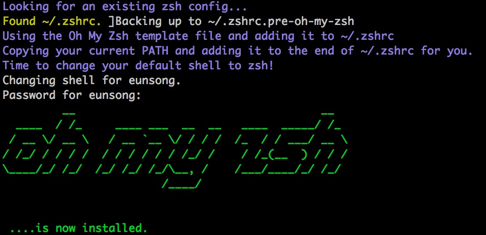
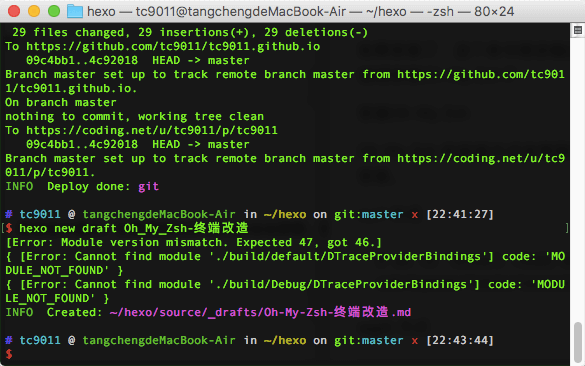

<!--more-->

周末的时候无意中看到一篇文章[终极 Shell](https://zhuanlan.zhihu.com/p/19556676?columnSlug=mactalk)，介绍的就是今天讲的主角Oh My Zsh 。

## 什么是Oh My Zsh

> Oh My Zsh是一款社区驱动的命令行工具，正如它的主页上说的，Oh My Zsh 是一种生活方式。它基于zsh命令行，提供了主题配置，插件机制，已经内置的便捷操作。给我们一种全新的方式使用命令行。

> Oh My Zsh这个名字听起来就很有意思，它是基于zsh命令行的一个扩展工具集，提供了丰富的扩展功能。

> Oh My Zsh只是一个对zsh命令行环境的配置包装框架，但它不提供命令行窗口，更不是一个独立的APP。

> 更详细介绍可到官网了解，Oh My Zsh官网：http://ohmyz.sh

## 安装Oh My Zsh

前提条件：必须已安装ZSH

我们可以在命令行中输入这个命令来查看我们的电脑上是否安装了zsh命令行

```
$ zsh --version
```

如果安装了，这个命令就会输出zsh当前的版本号。确定 zsh 已经安装后，我们就可以继续安装Oh My Zsh了。

安装Oh My Zsh

Oh My Zsh 的安装方式非常简单，可以通过`curl`或`wget`的方式，用一条命令即可安装。

curl 方式

```
$ sh -c "$(curl -fsSL https://raw.github.com/robbyrussell/oh-my-zsh/master/tools/install.sh)"
```

wget 方式

```
$ sh -c "$(wget https://raw.github.com/robbyrussell/oh-my-zsh/master/tools/install.sh -O -)"
```

安装过程中输出如下

```
Cloning Oh My Zsh...
Cloning into '/root/.oh-my-zsh'...
remote: Counting objects: 712, done.
remote: Compressing objects: 100% (584/584), done.
remote: Total 712 (delta 15), reused 522 (delta 4), pack-reused 0
Receiving objects: 100% (712/712), 443.58 KiB | 27.00 KiB/s, done.
Resolving deltas: 100% (15/15), done.
Checking connectivity... done.
Looking for an existing zsh config...
Using the Oh My Zsh template file and adding it to ~/.zshrc
Copying your current PATH and adding it to the end of ~/.zshrc for you.
Time to change your default shell to zsh!
        __                                     __
 ____  / /_     ____ ___  __  __   ____  _____/ /_
/ __ \/ __ \   / __ `__ \/ / / /  /_  / / ___/ __ \
/ /_/ / / / /  / / / / / / /_/ /    / /_(__  ) / / /
\____/_/ /_/  /_/ /_/ /_/\__, /    /___/____/_/ /_/
                       /____/                       ....is now installed!

Please look over the ~/.zshrc file to select plugins, themes, and options.
p.s. Follow us at https://twitter.com/ohmyzsh.
p.p.s. Get stickers and t-shirts at http://shop.planetargon.com.
```

到这里，Oh My Zsh 就安装成功了。

## 设置主题

安装完毕后，我们就可以使用了，咱们先来简单配置一下。
Oh My Zsh 提供了很多主题风格，我们可以根据自己的喜好，设置主题风格，主题的配置在 ~/.zshrc 文件中可以看到，用一个自己熟悉的编辑器打开这个文件，可以找到这一项：

```
ZSH_THEME="robbyrussel"
```

可以看到，我们默认使用的主题叫做`robbyrussel`。 

Oh My Zsh默认自带了一些默认主题，存放在`~/.oh-my-zsh/themes`目录中。我们可以查看这些主题

```
$ ls ~/.oh-my-zsh/themes

3den.zsh-theme                essembeh.zsh-theme            junkfood.zsh-theme            rgm.zsh-theme
Soliah.zsh-theme              evan.zsh-theme                kafeitu.zsh-theme             risto.zsh-theme
adben.zsh-theme               example.zsh-theme             kardan.zsh-theme              rixius.zsh-theme
af-magic.zsh-theme            fino-time.zsh-theme           kennethreitz.zsh-theme        rkj-repos.zsh-theme
afowler.zsh-theme             fino.zsh-theme                kiwi.zsh-theme                rkj.zsh-theme
agnoster.zsh-theme            fishy.zsh-theme               kolo.zsh-theme                robbyrussell.zsh-theme
alanpeabody.zsh-theme         flazz.zsh-theme               kphoen.zsh-theme              sammy.zsh-theme
amuse.zsh-theme               fletcherm.zsh-theme           lambda.zsh-theme              simonoff.zsh-theme
apple.zsh-theme               fox.zsh-theme                 linuxonly.zsh-theme           simple.zsh-theme
arrow.zsh-theme               frisk.zsh-theme               lukerandall.zsh-theme         skaro.zsh-theme
....
```

这么多的主题可以满足你的各种偏好了，我们只需在`./zshrc`文件中配置需要的主题即可，比如我们想用`lambda.zsh-theme`这个主题，我们只要这样配置

```
ZSH_THEME=lambda
```

**请注意好多教程上这边都有`""`，但是请把双引号去掉，不然可能安装不成功，这也算是一个小坑**。

然后保存这个文件文件，再打开一个新的命令行窗口即可看到效果了。那么这么多的主题如何快速找到哪些是我们喜欢的呢，我们还可以这样设置

```
ZSH_THEME="random"
```

我们将主题设置为随机，这样在我们每次打开命令行窗口的时候，都会随机在默认主题中选择一个。这样我们如果觉得当前的主题比较喜欢，可以直接使用 echo 命令输出当前主题的名称

```
$ echo $ZSH_THEME
```

然后再将他设置到配置文件中即可。

我使用的ys这款主题，该有的信息都能展示出来，界面如下：



## 启用插件

Oh My Zsh 默认自带了一些默认主题，存放在`~/.oh-my-zsh/plugins`目录中。我们可以查看这些插件

```
plugins=(git)
```

如需启用更多插件，可加入需启用插件的名称。如下

```
plugins=(git wd web-search history history-substring-search)
```

## 更新

设置自动更新oh-my-zsh

默认情况下，当oh-my-zsh有更新时，都会给你提示。如果希望让oh-my-zsh自动更新，在~/.zshrc 中添加下面这句

```
DISABLE_UPDATE_PROMPT=true
```

要手动更新，可以执行

```
$ upgrade_oh_my_zsh
```

## 卸载

直接在终端中，运行`uninstall_oh_my_zsh`既可以卸载。
