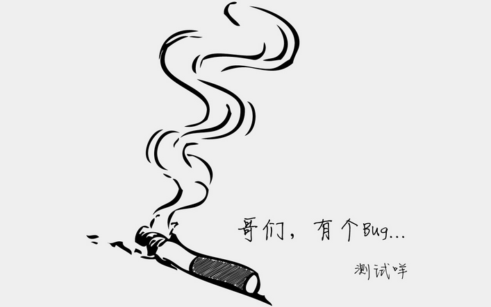

<!--more-->

刚刚生成了一篇文章， `hexo g` 时会报错， 错误信息大致如下：

```javascript
FATAL Something's wrong. Maybe you can find the solution here: http://hexo.io/docs/troubleshooting.html
Template render error: (unknown path) [Line 128, Column 48]
unexpected token: .
```

估计是文章的原因，试了一下，把文章移除后一切又正常了，但是就是不知道文章中哪里出错了。

网上搜了好久，发现了这篇文章：[hexo 在遇到 “}}” 符号时出现解析报错](https://icewing.cc/hexo-bug-of-quot.html)。

> 查找资料发现有人遇到和我类似的问题，但报的是 `unexpected token: }}的错误。搜索一下我那篇文章，果然有好几处带有 }} 符号。尝试着把几处符号删除，果然正常了。看来问题真的出在 }}上面。

> 直接说解决方案吧，参考别人的解决方法是在 }}中间加一个空格，但因为我的是有部分教程含义的文章，所以并不想这样误导人。于是去 github 上找解决方案。

> github 上给出的方法是在需要显示 }}符号的地方加上 
>
> ```typescript
> 
> ```
>
>  标签，标记这部分不需要解析。例如文章中可能会出现 `{ { something } }` 的片段，写成
>
> ```typescript
> {{ something }}
> ```
>
> 就可以了。

> 虽然有点麻烦，但也算临时解决了这个问题，这是个已知 bug ，希望后续的版本能修复吧，毕竟使用太多 hexo 专属的标签对博客以后的迁移、改版什么的来说还是很麻烦的。

但是

````typescript

````

 标签在代码块中会显示出来，前一篇文章的代码块中的}}符号我就用空格隔开了。
