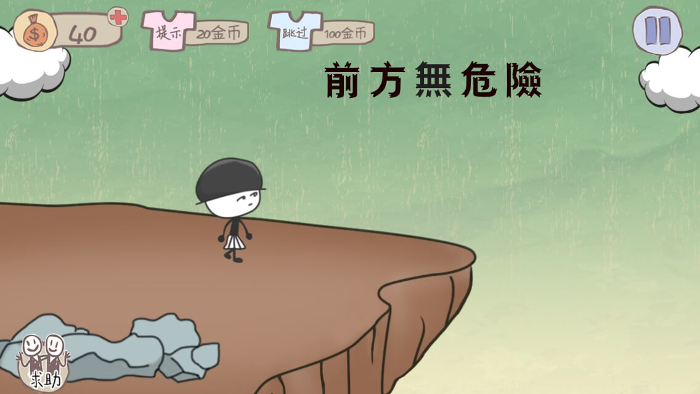
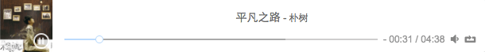
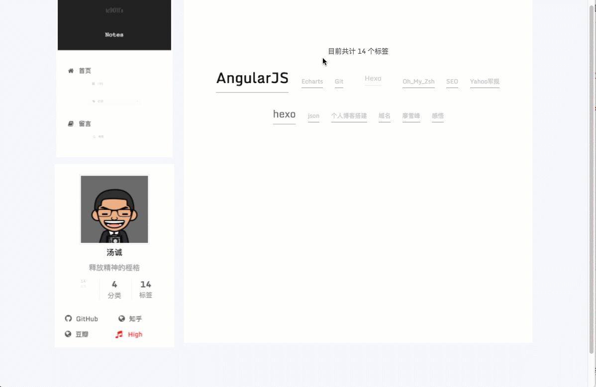
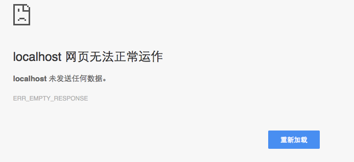

<!--more-->

## hexo添加音乐需要几个步骤？

添加音乐当然可以用其他网站的外链，但是一般外链是`<iframe>`，这个影响网站的SEO，逼格也不够高。

下面我就隆重介绍一款html5音乐播放器：**[Aplayer](https://github.com/DIYgod/APlayer)**。把Aplayer加入hexo需要用到[hexo-tag-aplayer](https://github.com/grzhan/hexo-tag-aplayer#upstream-issue)插件。

切换到hexo目录，运行：

```shell
npm install hexo-tag-aplayer@2.0.1
```

这里直接运行`npm install hexo-tag-aplayer`只会安装2.0.0，这个版本会出现以下错误：

```shell
FATAL Cannot find module '/Users/hechao/Documents/TechBlog/CniceToUpp/node_modules/hexo-tag-aplayer'
Error: Cannot find module '/Users/hechao/Documents/TechBlog/CniceToUpp/node_modules/hexo-tag-aplayer'
```

作者给出来解决方案是用2.0.1版本，[FATAL Cannot find module解决办法](https://github.com/grzhan/hexo-tag-aplayer/issues/11)。

安装完成后，在需要添加音乐的地方加上：

```scss
{% aplayer "平凡之路" "朴树" "https://xxx.com/%E5%B9%B3%E5%87%A1%E4%B9%8B%E8%B7%AF.mp3" "https://xxx.com/1.jpg" "autoplay" %}
```

就会出现你想要的音乐啦，这里我把音乐和专辑封面添加到七牛上，加载速度嗖嗖的。



如果你想加入歌单，把上面的代码换成下面代码就行，参数的用法可以参照插件的使用说明。

```scss
{"narrow": false,"autoplay": true,"showlrc": 3,"mode": "random","music": [{"title": "平凡之路","author": "朴树","url": "http://xxx.com/%E5%B9%B3%E5%87%A1%E4%B9%8B%E8%B7%AF.mp3","pic": "https://xxx.com/1.jpg","lrc": "http://og9ocpmwk.bkt.clouddn.com/%E5%B9%B3%E5%87%A1%E4%B9%8B%E8%B7%AF.txt"},{"title": "野子","author": "苏运莹","url": "http://xxx.com/01%20%E9%87%8E%E5%AD%90.m4a","pic": "http://xxxx.com/%E9%87%8E%E5%AD%90.jpg","lrc":"https://xxx.com/%E9%87%8E%E5%AD%90.txt"}]}
```

当然，Aplayer的作者还有一款html5的视频播放器，叫[Dplayer](https://github.com/DIYgod/DPlayer)，对应有一款hexo的插件，叫[hexo-tag-dplayer](https://github.com/NextMoe/hexo-tag-dplayer)，有需求的可以去看看，用法都差不多。

## 一起high一下

这个功能是我在[Hexo high一下小功能](http://www.jianshu.com/p/748622c7bb20)上看到的，觉得很有意思，于是就引进来，改造了一下。

首先是重新封装了一个high.js文件，代码中注释的地方可下载下来放到七牛，加快国内访问速度：

```javascript
function shake() {
    function c() {
        var e = document.createElement("link");
        e.setAttribute("type", "text/css");
        e.setAttribute("rel", "stylesheet");
        e.setAttribute("href", f);
        e.setAttribute("class", l);
        document.body.appendChild(e)
    }
 
    function h() {
        var e = document.getElementsByClassName(l);
        for (var t = 0; t < e.length; t++) {
            document.body.removeChild(e[t])
        }
    }
 
    function p() {
        var e = document.createElement("div");
        e.setAttribute("class", a);
        document.body.appendChild(e);
        setTimeout(function() {
            document.body.removeChild(e)
        }, 100)
    }
 
    function d(e) {
        return {
            height : e.offsetHeight,
            width : e.offsetWidth
        }
    }
 
    function v(i) {
        var s = d(i);
        return s.height > e && s.height < n && s.width > t && s.width < r
    }
 
    function m(e) {
        var t = e;
        var n = 0;
        while (!!t) {
            n += t.offsetTop;
            t = t.offsetParent
        }
        return n
    }
 
    function g() {
        var e = document.documentElement;
        if (!!window.innerWidth) {
            return window.innerHeight
        } else if (e && !isNaN(e.clientHeight)) {
            return e.clientHeight
        }
        return 0
    }
 
    function y() {
        if (window.pageYOffset) {
            return window.pageYOffset
        }
        return Math.max(document.documentElement.scrollTop, document.body.scrollTop)
    }
 
    function E(e) {
        var t = m(e);
        return t >= w && t <= b + w
    }
 
    function S() {
        var e = document.createElement("audio");
        e.setAttribute("class", l);
        e.src = i;
        e.loop = false;
        e.addEventListener("canplay", function() {
            setTimeout(function() {
                x(k)
            }, 500);
            setTimeout(function() {
                N();
                p();
                for (var e = 0; e < O.length; e++) {
                    T(O[e])
                }
            }, 15500)
        }, true);
        e.addEventListener("ended", function() {
            N();
            h()
        }, true);
        e.innerHTML = " <p>If you are reading this, it is because your browser does not support the audio element. We recommend that you get a new browser.</p> <p>";
        document.body.appendChild(e);
        e.play()
    }
 
    function x(e) {
        e.className += " " + s + " " + o
    }
 
    function T(e) {
        e.className += " " + s + " " + u[Math.floor(Math.random() * u.length)]
    }
 
    function N() {
        var e = document.getElementsByClassName(s);
        var t = new RegExp("\\b" + s + "\\b");
        for (var n = 0; n < e.length; ) {
            e[n].className = e[n].className.replace(t, "")
        }
    }
 
    var e = 30;
    var t = 30;
    var n = 350;
    var r = 350;
    var i = "http://o9w8f1xrl.bkt.clouddn.com/highqilai/harlem-shake.mp3";	//可下载下来放到七牛，加快国内访问速度
    var s = "mw-harlem_shake_me";
    var o = "im_first";
    var u = ["im_drunk", "im_baked", "im_trippin", "im_blown"];
    var a = "mw-strobe_light";
    var f = "http://o9w8f1xrl.bkt.clouddn.com/highqilai/harlem-shake-style.css";//可下载下来放到七牛，加快国内访问速度
    var l = "mw_added_css";
    var b = g();
    var w = y();
    var C = document.getElementsByTagName("*");
    var k = null;
    for (var L = 0; L < C.length; L++) {
        var A = C[L];
        if (v(A)) {
            if (E(A)) {
                k = A;
                break
            }
        }
    }
    if (A === null) {
        console.warn("Could not find a node of the right size. Please try a different page.");
        return
    }
    c();
    S();
    var O = [];
    for (var L = 0; L < C.length; L++) {
        var A = C[L];
        if (v(A)) {
            O.push(A)
        }
    }
}
```

把这个文件保存在七牛上，在themes—>next—>layout—>_partials—>head.swig中加入这样一段代码，引入high.js文件(src里的内容请替换成自己的外链)：

```html
<script type="text/javascript" src="https://xxx.com/high.js"></script>
```

然后在themes—>next—>layout—>_macro—>sidebar.swig中加入注释包围中的代码：

```html
<div class="links-of-author motion-element">
          
            
              <span class="links-of-author-item">
                <a href="{{ link }}" target="_blank" title="{{ name }}">
                  
                    <i class="fa fa-fw fa-{{ theme.social_icons[name] | default('globe') | lower }}"></i>
                  
                  {{ name }}
                </a>
              </span>
            
  <!--以下是加入关于high一下的代码-->
            <span class="links-of-author-item"><a title="小high一下~" style="underline: none;color:red" rel="alternate" class="mw-harlem_shake_slow wobble shake" href="javascript:shake()"><i class="fa fa-music"></i> &nbsp;&nbsp;High</a></span>
  <!--以上是加入关于high一下的代码-->
          
        </div>
```

style中我用了红色，这样显眼一点，不喜欢的话可以改掉。

接下来点击high这个按钮，会出现一下效果：



## 大坑

当我吭哧吭哧的弄完后，突然发现我运行`hexo g`命令后，出现下面两行提示后就不动了~

```shell
INFO  Start processing
INFO  Files loaded in 3.9 s
```

我用了各种方法，包括版本回退，好像都没用。于是我就尝试切换到hexo默认主题，结果又可以`hexo g`，估计是next主题出问题了，于是我重新下了next主题，把我的配置都重新弄了一遍，结果好了~~，不过页脚的地方与之前博客不同，少了"power by hexo"这几个字眼。

更新next后遇到的第一个问题是，不显示文章发表时间了，github上的解答是这样的,[文章标题下的发表时间不见了](https://github.com/iissnan/hexo-theme-next/issues/1300),在主题配置文件里面加上下面的配置，然后就出来了。

```yaml
# Post meta display settings
post_meta:
  created_at: true
  updated_at: false
  categories: true
```

第二个问题，我`hexo s`成功后，登陆localhost:4000，发现出现下面的提示：



原因是，我开了shadowsocks的全局模式，切换到自动代理模式，就可以显示网页了。


