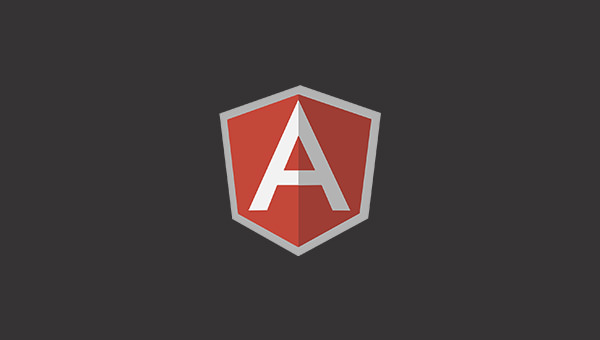
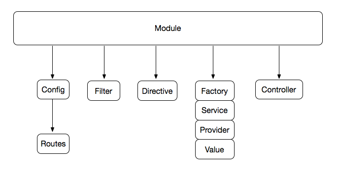
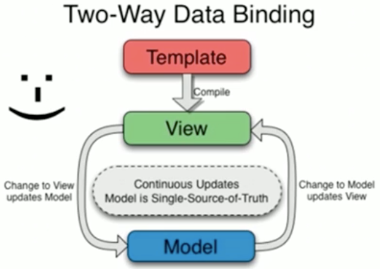
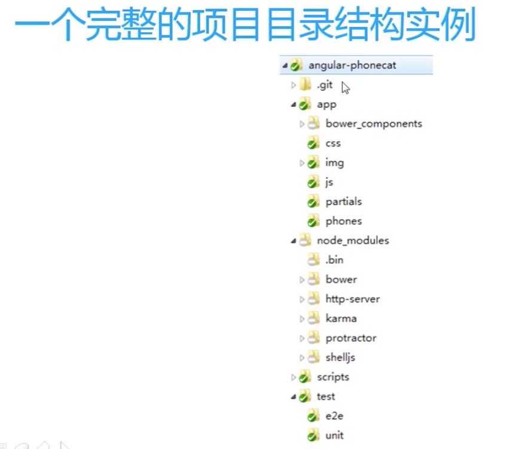
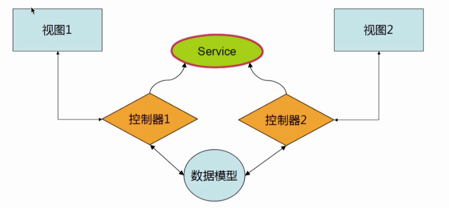
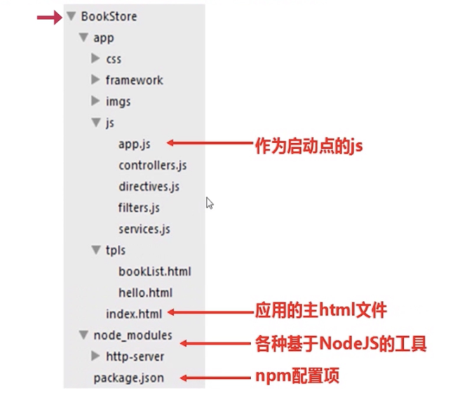
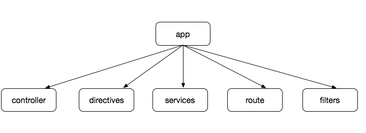
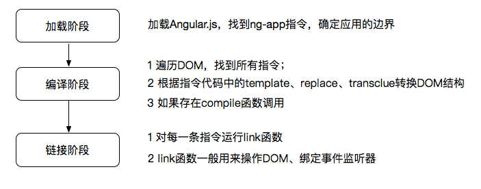
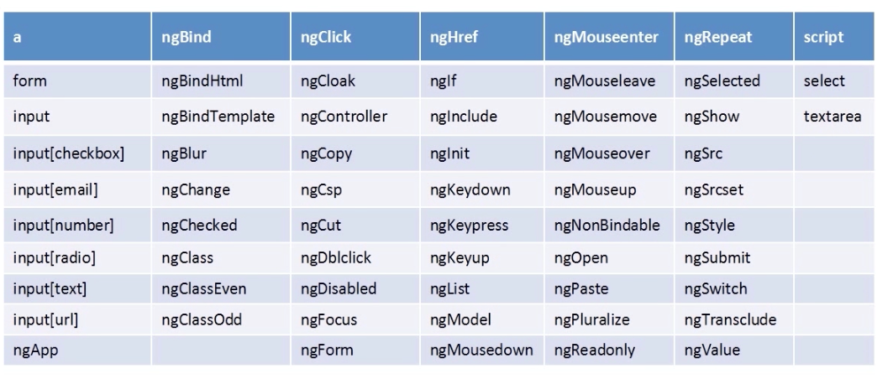
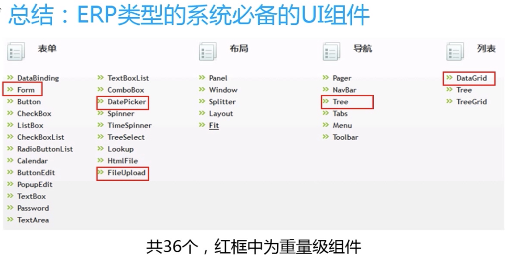

<!--more-->

## 快速上手

### Angular核心特征--MVC

MVC:model,view,controller

Model：数据模型层

view：视图层、负责展示

Controller：业务逻辑与控制逻辑

MVC是一种架构模式，是三种设计模式的合体，故没有把它当做一种设计模式。

> GoF (Gang of Four，四人组， 《Design Patterns: Elements of Reusable Object-Oriented Software》/《设计模式》一书的作者：Erich Gamma、Richard Helm、Ralph Johnson、John Vlissides)并没有把MVC提及为一种设计模式，而是把它当做“一组用于构建用户界面的类集合”。**在他们看来，它其实是其它三个经典的设计模式的演变：观察者模式(Observer)(Pub/Sub), 策略模式(Strategy)和组合模式(Composite)**。根据MVC在框架中的实现不同可能还会用到工厂模式(Factory)和装饰器(Decorator)模式。我在另一本免费的书“JavaScript Design Patterns For Beginners”中讲述了这些模式，如果你有兴趣可以阅读更多信息。
>
> 正如我们所讨论的，models表示应用的数据，而views处理屏幕上展现给用户的内容。为此，MVC在核心通讯上基于推送/订阅模型(惊讶的是 在很多关于MVC的文章中并没有提及到)。当一个model变化时它对应用其它模块发出更新通知(“publishes”)，订阅者 (subscriber)——通常是一个Controller，然后更新对应的view。观察者——这种自然的观察关系促进了多个view关联到同一个 model。
>
> 对于感兴趣的开发人员想更多的了解解耦性的MVC(根据不同的实现)，这种模式的目标之一就是在一个主题和它的观察者之间建立一对多的关系。当这个 主题改变的时候，它的观察者也会得到更新。Views和controllers的关系稍微有点不同。Controllers帮助views对不同用户的输 入做不同的响应，是一个非常好的策略模式列子。

### Angular核心2--模块化

html代码：

```html
<!DOCTYPE html>
<html ng-app="HellloAngular">
<head>
    <meta charset="UTF-8">
    <title>Title</title>
</head>
<body>
<div ng-controller="helloAngular">      <!--控制器-->
    <p>{ { greeting.text} },Angular</p>
</div>
</body>
<script src="angular.min.js"></script>
<script src="HelloAngular_MVC.js"></script>
</html>
```

JS代码：

```javascript
var myModule = angular.module("HellloAngular", []); //创建模块

myModule.controller("helloAngular", ['$scope',      //创建控制器，并注入$scope
    function HelloAngular($scope) {
        $scope.greeting = {
            text: 'Hello'
        };
    }
]);

```

只有把模块创建出来以后，才能调用模块下面的方法。

```html
<html ng-app="moduleName">
```



### Angular核心特征3--指令系统

指令系统可以自定义标签：

```javascript
var myMoudle=angular.module("MyMoudle",[]);

myMoudle.directive("hello",function () {
    return {
        restrict: 'E',
        template: '<div>Hi everyone!</div>',    //模板，替换了<hello>
        replace: true
    }
});
```

```html
<!DOCTYPE html>
<html ng-app="MyMoudle">	<!--ng-app相当于java中的main方法，表示从ng-app开始下面所有内容归angularjs管理-->
<head>
    <meta charset="UTF-8">
    <title>Title</title>
</head>
<body>
<hello></hello>
</body>
<script src="angular.min.js"></script>
<script src="Hello.js"></script>
</html>
```

### Angular核心特征4--双向数据绑定



数据更新View自动更新，view更新数据也跟着更新。

只用一个html文件实现输入的文字立刻出现在下方。（第一次看到时第一反应是，这货是黑科技~）

```html
<!DOCTYPE html>
<html lang="en" ng-app>
<head>
    <meta charset="UTF-8">
    <title>Title</title>
</head>
<body>
<div>
    <input ng-model="greeting.text"/>  <!--生成数据模型-->
    <p>{ { greeting.text} },AngularJS</p>  <!--双括号在Angular中表示取值-->
</div>
</body>
<script src="angular.min.js"></script>
</html>
```

### 开发、调试、测试工具

* 代码编辑工具：sublime、webstorm
* 断点调试工具：chrome插件batarang
* 版本管理工具：git、git小乌龟
* 代码合并和混淆工具：grunt
* 依赖管理工具：bower
* 单元测试工具：karma、jasmine
* 集成测试工具：protractor（专为AngularJS定制的测试工具）



1. app放源代码
2. test下面分集成测试e2e和单元测试unit两个目录

## 基本概念和用法

### MVC

> MVC只是手段，终极目标是模块化和复用

AngularJS中Controller的实现方式



> * 不要试图去复用Controller，一个控制器一般只负责一小块视图
> * 不要在Controller中操作DOM，这不是控制器的职责
> * 不要在Controller里面做数据格式化，ng有很好用的表单控件
> * 不要在Controller里面做数据过滤操作，ng有$filter服务
> * 一般来说，Controller是不会互相调用的，控制器之间的交互会通过事件进行

利用Directive实现View的复用。

AngularJS的MVC是借助于$scope实现的:

* $scope是一个POJO（Plain Old JavaScript Object）
* $scope提供了一些工具方法$watch()/$apply()
* $scope是表达式的执行环境（或者叫作用域）
* $scope是一个树形结构，与DOM标签平行
* 子$scope对象会继承父$scope上的属性和方法
* 每一个angular应用只有一个根$scope对象（一般位于ng-app上）
* $scope可以传播事件，类似DOM事件，可以向上也可以向下
* $scope不仅是MVC的基础，也是后面实现双向数据绑定的基础
* 可以用angular.element($0).scope()进行调试

### 路由、模块、依赖注入



使用ngRoute进行视图之间的路由：

```javascript
  //创建模块，并指定模块依赖
var bookStoresApp = angular.module('bookStoreApp',[
  'ngRoute','ngAnimate','bookStoreCtrls','bookStoreFilters',
  'bookStoreServices','bookStoreDirectives'
]);
bookStoreApp.config(function($routePrivider){
  //根据url后缀的不同，加载不同的模板，并且用不同的控制器控制
  $routePrivider.when('/hello',{   
    templateUrl: 'tpls/hello.html',
    controller: 'HelloCtrl'
  }).when('/list',{
    templateUrl: 'tpls/booklist.html',
    controller: 'BookListCtrl'
  }).otherwise({
    redirectTo: '/hello'
  })
});
```

ng官方推荐的模块切分方式：



* 任何一个ng应用都是由控制器、指令、服务、路由、过滤器、等有限的模块类型构成
* 控制器、指令、服务、过滤器分别放在一个模块里面（可借助与Grunt合并）
* 用一个总的app模块作为入口点，它依赖其他所有模块

### 双向数据绑定

举个栗子：

```html
<!DOCTYPE html>
<html lang="en" ng-app="UserInfoModule">
<head>
    <meta charset="UTF-8">
    <title>Title</title>
    <link rel="stylesheet" href="http://cdn.bootcss.com/bootstrap/3.3.0/css/bootstrap.min.css">
    <script src="angular-1.3.0.js"></script>
    <script src="Form.js"></script>
</head>
<body>
<div class="panel panel-primary">
    <div class="panel-heading">
        <div class="panel-title">双向数据绑定</div>
    </div>
    <div class="panel-body">
        <div class="row">
            <div class="col-md-12">
                <form class="form-horizontal" role="form" ng-controller="UserInfoCtrl"> <!--controller-->
                    <div class="form-group">
                        <label class="col-md-2 control-label">
                            邮箱：
                        </label>
                        <div class="col-md-10">
                            <input ng-model="userInfo.email" placeholder="推荐使用126邮箱" type="email" class="form-control"><!--调用userInfo中的email值-->
                        </div>
                    </div>
                    <div class="form-group">
                        <label class="col-md-2  control-label">
                            密码：
                        </label>
                        <div class="col-md-10">
                            <input ng-model="userInfo.password" type="password" class="form-control" placeholder="只能是数字、字母及下划线">	<!--调用userInfo中的password值-->
                        </div>
                    </div>
                    <div class="form-group">
                        <div class="col-md-offset-2 col-md-10">
                            <div class="checkbox">
                                <label>
                                    <input type="checkbox" ng-model="userInfo.autoLogin">自动登录  <!--调用userInfo中的checkbox值-->
                                </label>
                            </div>
                        </div>
                    </div>
                    <div class="form-group">
                        <div class="col-md-offset-2 col-md-10">
                            <button class="btn btn-default" ng-click="getFormData()">获取form表单的值</button>
                            <button class="btn btn-default" ng-click="setFormData()">设置form表单的值</button>
                            <button class="btn btn-default" ng-click="restFormData()">重置form表单的值</button>
                        </div>
                    </div>
                </form>
            </div>
        </div>
    </div>
</div>
</body>
</html>
```

```javascript
var userInfoModule = angular.module('UserInfoModule', []);

userInfoModule.controller('UserInfoCtrl', ['$scope', function ($scope) {
  //初始化userInfo数据
    $scope.userInfo = {
        email: '111@126.com',
        password: '112231',
        autoLogin: true
    };
  //获取表单中的数据
    $scope.getFormData = function () {
        console.log($scope.userInfo);
    };
  //设置表单中的数据
    $scope.setFormData = function () {
        $scope.userInfo = {
            email: 'dddd@126.com',
            password: '11111',
            autoLogin: false
        }
    };
  //重置表单数据
    $scope.restFormData = function () {
        $scope.userInfo = {
            email: '111@126.com',
            password: '112231',
            autoLogin: true
        };
    }
}]);
```

`ng-class`可以做一些样式控制，比如

`<div ng-class='{error:isError,warning:isWaring}'>{ { messageText} }</div>`

`ng-show='menuState.show'`可以通过`$scope.menuState={show:false};`控制显示或者隐藏，show的值为false时隐藏，true时显示。通过`ng-hide=""`也可以达到同样的效果。

### 路由

可以用[UI-Router](https://ui-router.github.io/)来代替Angular自带的router功能。

前端路由的基本原理：

* 哈希# 	点击后不会跳转，相当于设置了锚点，只在页内跳转
* HTML5中新的historyAPI     通过js代码修改浏览器地址栏中的地址，会在浏览器中留下历史记录，但是页面不会跳转
* 路由的核心是给应用定义“状态”
* 使用路由机制会影响到应用的整体编码方式（需要预先定义好状态）
* 考虑兼容性问题和“优雅降级”

### 指令

```html
<!DOCTYPE html>
<html ng-app="MyMoudle">
<head>
    <meta charset="UTF-8">
    <title>Title</title>
</head>
<body>
<hello></hello>
</body>
<script src="../Demo4-TwowayDataBinding/angular.min.js"></script>
<script src="Hello.js"></script>
</html>
```

```javascript
var myMoudle=angular.module("MyMoudle",[]);

myMoudle.directive("hello",function () {
    return {
        restrict: 'E',		
        template: '<div>Hi everyone!</div>',    //模板，替换了<hello>
        replace: true
    }
});
```

`restrict`表示匹配模式，共有AEMC四个选项:

A表示属性,`<div hello>`，是默认的匹配模式

E表示元素,`<hello>`，

M表示注释,`	<!-- directive:hello -->	<div></div>`，(注意注释中的空格)

C表示CSS的样式类,`<div class='hello'>`

A和E两种匹配模式比较常用，当需要创建带有自己的模板的指令时，使用元素名称的方式创建指令；当需要为已有的HTML标签增加功能时，使用属性的方式创建指令。

`template`表示模板，这里可以用templateURL来实现（需要导入templateUrl.js），即`templateUrl: 'hello.html'`把已有的模板写在单独的html文件中。`templateCache`可以让模板不仅在一个地方使用，还可以在其他地方使用，Angular会把模板缓存起来，以便后续使用。

```javascript
var myModule=angular.module('MyModule',[]);

//run方法表示注射器加载完所有的模块时，此方法执行一次
myModule.run(function($templateCache){
  $templateCache.put("hello.html","<div>Hello everyone</div>")
});
myModule.directive("hello",function($templateCache){
  return{
    restrict: 'AECM',
    template: $templateCache.get("hello.html"),
    replace:true
  }
})
```


`replace`表示标签里面嵌套的内容被模板全部替换

`transclude`表示保留标签里面的内容:

```javascript
var myModule=angular.module('MyModule',[]);
myModule.directive("hello",function(){
  return{
    restrict: "AE",
    transclude: true,
    template: "<div>Hello everyone!<div ng-transclude></div></div>"
  }
})
```

`ng-transclude`表示原来标签里面嵌套的内容放在此处。

#### 指令执行的机制



1. compile函数用来对模板自身进行转换，而link函数负责在模型和视图之间进行动态关联；
2. 作用域在链接阶段才会被绑定到编译之后的link函数上；
3. compile函数仅仅在编译阶段运行一次，而对于指令的每一个实例，link函数都会执行一次；
4. compile函数可以返回prelink和postlink函数，而link函数只会返回postlink函数；
5. 如果需要修改DOM结构，应该在postlink中来做这件事情，而如果在prelink中做这件事情会导致错误；
6. 大多数时候我们只要编写link函数即可

#### 指令和控制器之间的交互

```html
<!DOCTYPE html>
<html lang="en" ng-app="MyMoudle">
<head>
    <meta charset="UTF-8">
    <title>Title</title>
</head>
<body>
    <div ng-controller="Myctrl">
        <loader>滑动加载</loader>
    </div>
</body>
<script src="angular-1.3.0.js"></script>
<script src="Directive.js"></script>
</html>
```

```javascript
var myModule=angular.module("MyModule",[]);

myModule.controller("MyCtrl",["$scope",function ($scope) {
    $scope.loadData=function () {
        console.log("加载数据中");
    }
}]);

myModule.directive("loader",function () {
    return{
        restrict: "AE",
        link: function (scope,element,attrs) {       //用link来实现监听事件
            element.bind("mouseenter",function () {
                // scope.loadData();    //第一种写法
                scope.$apply('loadData()');  //第二种写法
            })
        }
    }
});

```

若需要根据不同的控制器调用不同的方法，需要用到指令上定义的属性。

```html
<!DOCTYPE html>
<html lang="en" ng-app="MyMoudle">
<head>
    <meta charset="UTF-8">
    <title>Title</title>
</head>
<body>
    <div ng-controller="Myctrl">
        <loader howToLoad="loadData()">滑动加载</loader>
    </div>
    <div ng-controller="Myctrl2">
        <loader howToLoad="loadData2()">滑动加载</loader>
    </div>
</body>
<script src="angular-1.3.0.js"></script>
<script src="Directive.js"></script>
</html>
```

```javascript
var myModule=angular.module("MyMoudle",[]);

myModule.controller("Myctrl",["$scope",function ($scope) {
    $scope.loadData=function () {
        console.log("加载数据中");
    }
}]);

myModule.controller("Myctrl2",["$scope",function ($scope) {
    $scope.loadData2=function () {
        console.log("加载数据中。。。");
    }
}]);

myModule.directive("loader",function () {
    return{
        restrict: "AE",
        link: function (scope,element,attrs) {       
            element.bind("mouseenter",function (event) {
                //前面howtoload是按驼峰法则写的，但这边需要写成小写，这是一个坑，要注意。还有howtoload不要写成函数调用形式。
                scope.$apply(attrs.howtoload);
            });
        }
    }
});

```

上述代码实现了指令的复用，指令load通过howtoload属性实现了与控制器的交互，通过不同的控制器控制不同的属性，实现load输出的不同，可以简单的理解为标签load通过自身的howtoload属性，调用不同的控制器，实现不同的输出。

#### 指令之间的交互

```html
<!DOCTYPE html>
<html lang="en" ng-app="MyMoudle">
<head>
    <meta charset="UTF-8">
    <title>Title</title>
    <link rel="stylesheet" href="http://lib.sinaapp.com/js/bootstrap/3.0.0/css/bootstrap.css">
    <script src="angular-1.3.0.js"></script>
    <script src="superman.js"></script>
</head>
<body>
<div class="row">
    <div class="col-md-3">
        <superman strength>动感超人-力量</superman>
    </div>
</div>
<div class="row">
    <div class="col-md-3">
        <superman speed strength>动感超人2-力量+敏捷</superman>
    </div>
</div>
<div class="row">
    <div class="col-md-3">
        <superman light speed strength>动感超人3-力量+敏捷+发光</superman>
    </div>
</div>
</body>
</html>
```

```javascript
var myMoudle = angular.module("MyMoudle", []);

myMoudle.directive("superman", function () {
    return {
        scope: {},  //创建独立的作用域
        restrict: "AE",
        controller: function ($scope) {     /*指令内部的controller，用来暴露一组public的方法给外面调用*/
            $scope.abilities = [];
            this.addStrength = function () {
                $scope.abilities.push("strength");
            };
            this.addSpeed = function () {
                $scope.abilities.push("speed");
            };
            this.addLight = function () {
                $scope.abilities.push("light");
            };
        },
        //link是用来处理指令内部的事物（绑定事件等），controller是暴露方法给外面调用
        link: function (scope, element, attrs) {
            element.addClass('btn btn-primary');
            element.bind("mouseenter", function () {
                console.log(scope.abilities);
            });
        }
    }
});

myMoudle.directive("strength", function () {
    return {
        //require表示指令依赖于Superman
        require: '^superman',
        //Angular处理的时候会把supermanCtrl注入link中，这样就可以调用superman的addStrength()函数
        link: function (scope, element, attrs, supermanCtrl) {
            supermanCtrl.addStrength();
        }
    }
});

myMoudle.directive("speed", function () {
    return {
        require: '^superman',
        link: function (scope, element, attrs, supermanCtrl) {
            supermanCtrl.addSpeed();
        }
    }
});

myMoudle.directive("light", function () {
    return {
        require: '^superman',
        link: function (scope, element, attrs, supermanCtrl) {
            supermanCtrl.addLight();
        }
    }
});
```

指令之间的交互方式是通过指令内部controller暴露出来的方法，来给外部调用。

若没有独立scope，scope之间会相互影响。

scope的绑定策略：

* @:把当前属性作为字符串传递。你还可以绑定来自外层scope的值，在属性值中插入`{ { } }`即可

  ```html
  <!DOCTYPE html>
  <html lang="en" ng-app="MyMoudle">
  <head>
      <meta charset="UTF-8">
      <title>Title</title>
      <link rel="stylesheet" href="http://lib.sinaapp.com/js/bootstrap/3.0.0/css/bootstrap.css">
  </head>
  <body>
  <div ng-controller="Myctrl">
      <drink flavor="{ { ctrlFlavor} }"></drink>
  </div>
  </body>
  <script src="angular-1.3.0.js"></script>
  <script src="scopeAT.js"></script>
  </html>
  ```

  ```javascript
  var myModule=angular.module("MyMoudle",[]);
  myModule.controller("Myctrl",["$scope",function ($scope) {
      $scope.ctrlFlavor="bb";
  }]);
  myModule.directive("drink",function () {
      return{
          restrict: 'AE',
          template: '<div>{ { flavor} }</div>',
          scope: {            
            //作用等价于下面的link,获取控制器中的flavor
            flavor: '@'
          }/*,
          link: function (scope,element,attrs) {
              scope.flavor=attrs.flavor;
          }*/
      }
  });
  ```

* =：与父scope中的属性进行双向绑定

  ```html
  <!DOCTYPE html>
  <html lang="en" ng-app="MyMoudle">
  <head>
      <meta charset="UTF-8">
      <title>Title</title>
      <link rel="stylesheet" href="http://lib.sinaapp.com/js/bootstrap/3.0.0/css/bootstrap.css">
  </head>
  <body>
  <div ng-controller="Myctrl">
      Ctrl:
      <br>
      <input type="text" ng-model="ctrlFlavor">
      <br>
      Directive:
      <br>
      <drink flavor="ctrlFlavor"></drink>
  </div>
  </body>
  <script src="angular-1.3.0.js"></script>
  <script src="scope-equal.js"></script>
  </html>
  ```

  ```javascript
  var myModule=angular.module("MyMoudle",[]);
  myModule.controller("Myctrl",["$scope",function ($scope) {
      $scope.ctrlFlavor="bb";
  }]);
  myModule.directive("drink",function () {
      return{
          restrict: 'AE',
          template: '<input type="text" ng-model="flavor"/>',
        //控制器和指令中的内容同步
          scope: {
              flavor: '='
          }
      }
  });
  ```

  ​

* &：传递一个来自父scope的函数，稍后调用

```html
<!DOCTYPE html>
<html lang="en" ng-app="MyMoudle">
<head>
    <meta charset="UTF-8">
    <title>Title</title>
    <link rel="stylesheet" href="http://lib.sinaapp.com/js/bootstrap/3.0.0/css/bootstrap.css">
</head>
<body>
<div ng-controller="Myctrl">
    <greeting greet="sayHello(name)"></greeting>
    <greeting greet="sayHello(name)"></greeting>
    <greeting greet="sayHello(name)"></greeting>
</div>
</body>
<script src="angular-1.3.0.js"></script>
<script src="scope-and.js"></script>
</html>
```

```javascript
var myModule=angular.module("MyMoudle",[]);
myModule.controller("Myctrl",["$scope",function ($scope) {
    $scope.sayHello=function (name) {
        alert("Hello"+name);
    }
}]);
myModule.directive("greeting",function () {
    return{
        restrict: 'AE',
        template: '<input type="text" ng-model="userName"/><br>'+'<button class="btn btn-default" ng-click="greet({name:userName})">Greeting</button><br>',//这边的name绑定到上面的userName
        scope: {
            greet: '&'
        }
    }
});
```

#### AngularJS内置的指令



* form指令
  * html原生form表单是不能嵌套的，而Angular封装之后的form可以嵌套；
  * Angular为form扩展了自动校验、防止重复提交等功能；
  * Angular对input元素的type进行了扩展，一共提供了以下10种类型：text、number、url、email、radio、checkbox、hidden、button、submit、reset；
  * Angular为表单内置了4种CSS样式：ng-valid、ng-invalid、ng-pristine、ng-dirty；
  * 内置校验器：require、minlength、maxlength。

```html
<!DOCTYPE html>
<html lang="en" ng-app="MyMoudle">
<head>
    <meta charset="UTF-8">
    <title>Title</title>
    <script src="angular-1.3.0.js"></script>
    <script src="form.js"></script>
</head>
<body>
<form name="myForm" ng-submit="save()" ng-controller="TestFormModule">
    <input type="text" name="userName" ng-model="user.userName" required/>  <!--required表示自动校验-->
    <input type="password" name="password" ng-model="user.password" required/>
    <input type="submit" ng-disabled="myForm.$invalid"/>    <!--绑定到$invalid的属性上-->
</form>
</body>
</html>
```

```javascript
var appModule=angular.module('MyMoudle',[]);
appModule.controller('TestFormModule',function ($scope) {
   $scope.user={
       userName: 'aaaaa',
       password: ''
   } ;
   $scope.save=function () {
       alert("保存数据");
   }
});
```

* expander指令

expander指令是自定义指令


```html
<!DOCTYPE html>
<html lang="en" ng-app="MyMoudle">
<head>
    <meta charset="UTF-8">
    <title>Title</title>
    <script src="angular-1.3.0.js"></script>
    <script src="expander.js"></script>
</head>
<body>
<div ng-controller="SomeController">
    <expander class="expander" expander-title="title">
        { { text} }
    </expander>
</div>
</body>
</html>
```

```javascript
var appModule = angular.module('MyMoudle', []);

appModule.directive('expander', function () {
    return {
        restrict: 'AE',
        replace: true,
        transclude: true,
        scope: {
            title: '=expanderTitle'
        },
        template: '<div>' + '<div class="title" ng-click="toggle()">{ { title} }</div>' + '<div class="body" ng-show="showMe" ng-transclude></div>' + '</div>',
        /*ng-show决定了是否显示*/
        link: function (scope, element, attrs) {
            scope.showMe = false;
            scope.toggle = function () {
                scope.showMe = !scope.showMe;
            }
        }
    }
});

appModule.controller('SomeController', function ($scope) {
    $scope.title = '点击展开';
    $scope.text = '这里是内部内容';
});
```

* according指令

封装一个比较复杂的according指令


```html
<!DOCTYPE html>
<html lang="en" ng-app="MyMoudle">
<head>
    <meta charset="UTF-8">
    <title>Title</title>
    <script src="angular-1.3.0.js"></script>
    <script src="according.js"></script>
</head>
<body ng-controller="SomeController">
<div>
    <according>
        <expander class="expander" expander-title="expander.title" ng-repeat="expander in expanders">
            { { expander.text} }
        </expander>
    </according>
</div>
</body>
</html>
```

```javascript
var appModule = angular.module('MyMoudle', []);

appModule.directive('according',function () {
    return{
        restrict: 'AE',
        replace: true,
        transclude: true,
        template: '<div ng-transclude></div>',
        controller: function () {
            var expanders=[];
            this.gotOpened=function (selectedExpander) {
                angular.forEach(expanders,function (expander) {
                    if (selectedExpander != expander){
                        expander.showMe=false;
                    }
                })
            };
            this.addExpander=function (expander) {
                expanders.push(expander);
            }
        }
    }
});

appModule.directive('expander', function () {
    return {
        restrict: 'AE',
        replace: true,
        transclude: true,
        require: '^?according',
        scope: {
            title: '=expanderTitle'
        },
        template: '<div>' + '<div class="title" ng-click="toggle()">{ { title} }</div>' + '<div class="body" ng-show="showMe" ng-transclude></div>' + '</div>',
        /*ng-show决定了是否显示*/
        link: function (scope, element, attrs,accordingController) {
            scope.showMe = false;
            accordingController.addExpander(scope);
            scope.toggle = function () {
                scope.showMe = !scope.showMe;
                accordingController.gotOpened(scope);
            }
        }
    }
});

appModule.controller('SomeController', function ($scope) {
    $scope.expanders=[{
       title: 'Click me to expander',
        text: 'Hi'
    },{
        title: 'Click this',
        text: 'Yes'
    },{
        title: 'Test',
        text: 'test'
    }];
});
```


[angular-ui](http://angular-ui.github.io/)提供了现成的指令库，可直接使用。


以miniui为例子



### Service与Provider

#### 使用$HTTP服务

类似Ajax

```html
<!DOCTYPE html>
<html lang="en" ng-app="MyMoudle">
<head>
    <meta charset="UTF-8">
    <title>Title</title>
    <script src="../Demo6-service/angular-1.3.0.js"></script>
    <script src="http.js"></script>
</head>
<body>
<div ng-controller="LoadDataCtrl">
    <ul>
        <li ng-repeat="user in users">
            { { user.name} }
        </li>
    </ul>
</div>
</body>
</html>
```

```javascript
var myModule=angular.module('MyMoudle',[]);

myModule.controller('LoadDataCtrl',['$scope','$http',function ($scope,$http) {
    $http({
        method: 'GET',
        url: 'data.json'
    }).success(function (data,status,header,config) {
        console.log("success");
        console.log(data);
        $scope.users=data;
    }).error(function (data,status,header,config) {
        console.log("error");
    })
}]);
```

#### Service的特性

1. Service都是单例的
2. Service由$injector负责实例化,不需要new
3. Service在整个应用的生命周期中存在，可以用来共享数据
4. 在需要使用的地方利用依赖注入机制注入Service
5. 自定义的Service需要写在内置的Service后面
6. 内置Service的命名以$符号开头，自定义的Service应该避免

```html
<!DOCTYPE html>
<html lang="en" ng-app="MyMoudle">
<head>
    <meta charset="UTF-8">
    <title>Title</title>
    <link rel="stylesheet" href="http://lib.sinaapp.com/js/bootstrap/3.0.0/css/bootstrap.css">
    <script src="../Demo6-service/angular-1.3.0.js"></script>
    <script src="MyService1.js"></script>
</head>
<body>
<div ng-controller="LoadDataCtrl">
    <label>用户名</label>
    <input type="text" ng-model="username" placeholder="请输入用户名"/>
    <pre ng-show="username">{ { users} }</pre>
</div>
</body>
</html>
```

```javascript
var myModule=angular.module('MyMoudle',[]);

myModule.factory('userListService',['$http',function ($http) {
    var doRequest=function (username,path) {
        return $http({
            method: 'GET',
            url: 'users.jon'
        });
    }
    return {
        userList: function (username) {
            return doRequest(username,'userList');
        }
    };
}]);

//自定义的服务放在最后
myModule.controller('serviceController',['$scope','$timeout','userListService',function ($scope,$timeout,userListService) {
    var timeout;    //防止频繁向后台请求，导致页面抖动，350ms不按键就传输数据
    $scope.$watch('username',function (newUserName) {
        if (newUserName){
            if(timeout){
                $timeout.cancel(timeout);
            }
            timeout=$timeout(function () {
                userListService.userList(newUserName).success(function (data,status) {
                    $scope.users=data;
                });
            },300);
        }
    });
}]);
```

Service、Provide、Factory本质都是Provider

Provider模式是“策略模式”+“抽象工厂模式”的混合体

#### 使用$filter服务

* $filter是用来进行数据格式化的专用服务

```html
<!DOCTYPE html>
<html lang="en" ng-app="MyMoudle">
<head>
    <meta charset="UTF-8">
    <title>Title</title>
    <script src="../Demo6-service/angular-1.3.0.js"></script>
    <script src="filter.js"></script>
</head>
<body>
<!--利用内置的filter把毫秒转化成日期-->
{ {  1304375948024 | date } }
<br>
{ {  1304375948024 | date:"MM/dd/yyyy@h:mma"} }
<br>
{ {  1304375948024 | date:"yyyy-MM-dd hh:mm:ss"} }
<br>
</body>
</html>
```

```javascript
var myModule=angular.module('MyMoudle',[]);
```

* AngularJS内置了9个filter：currency（用来格式化货币），date（用来格式化日期），json，limitTo，lowercase，number，oderBy（排序），uppercase
* filter可以嵌套使用（用管道符号|分隔）
* filter是可以传递参数的
* 用户可以定义自己的filter

#### 其他常用的Service

内置的共有24个

$compile：编译服务

$filter：数据格式化工具，内置8个

$interval

$timeout

$locale：用来做国际化

$location：监控浏览器地址栏中的变化

$log：提供日志

$parse

$http：封装了Ajax

