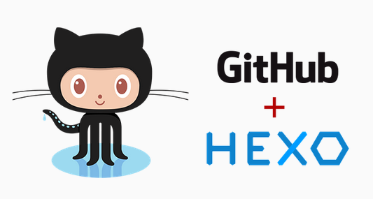

花了两天终于把基于Github和Hexo的个人博客搭建好了，期间踩了不少坑，在此作为第一篇正式博文记录一下。

<!-- more -->

## Hexo

这里还是要说一下Hexo，它是一款基于Node.js的静态博客框架，可以换不同主题，自定义各种样式，个人觉得还是蛮不错的（因为你只用过这一个，呵呵）。

Hexo特性： 

- Hexo基于Node.js，支持多进程，几百篇文章也可以秒生成。 
- 支持GitHub Flavored Markdown和所有Octopress的插件。 
- Hexo支持EJS、Swig和Stylus。通过插件支持Haml、Jade和Less。

<a rel="external nofollow">[Hexo官网](https://hexo.io/zh-cn/)</a> ，官网也是基于Github构件的网站。

## 配置环境及安装

Git的安装就跳过了，比较简单。下面说一下Node.js安装。

可以去<a rel="external nofollow">[node.js](http://npm.taobao.org/mirrors/node/latest/)</a>

Git和Node.js安装完了就可以用npm安装Hexo，在mac的终端内输入下面的命令：

```
	$ npm install -g hexo-cli
```

然后Hexo就安装完成啦。安装好后，需要对Hexo初始化，在终端中挨个执行下面的命令，其中<folder>用指定的文件夹路径代替，一定要cd，不要问我为什么，都是血的教训：

```
 $ hexo init <folder>
	$ cd <folder>
	$ npm install
```

至此，所有的安装工作都完成，撒花~

完成后，目录如下：

```
.
├── _config.yml
├── package.json
├── scaffolds
├── source
|   ├── _drafts
|   └── _posts
└── themes
```


## 建站及部署

安装完成后就可以通过下面的命令生成静态页面

`hexo g`

然后启用本地服务

`hexo s`

进入浏览器输入`http://localhost:4000`

就可以看到网站的效果，当然刚开始是默认样式。

下面我们就把网站部署到Github（此处我当你已经弄好github的ssh了）

登陆Github后创建一个名字为your_name.github.io（your_name替换成你的用户名）的仓库；

然后打开hexo下面的_config.yml，翻到最后面，

将下面的信息补充完整（your_name都换成你自己的用户名），注意Hexo 5.0以后type应该写成git而不是github，这又是一处血的教训（姚明脸）。

```yaml:
 type: git
  repository: https://github.com/your_name/your_name.github.io
  branch: master
```

  然后分别执行以下命令部署本地博客到github

```
hexo g
hexo d
```

然后在浏览器里面输入your_name.github.io就可以访问你自己的博客啦！

## NexT主题安装

Hexo有好多主题，经过筛选，我选择了<a rel="external nofollow">[NexT](http://theme-next.iissnan.com/)</a>，点击链接可以去官网看看，安装教程写的蛮详细的，我就不多说了。这里说一下一些要注意的地方吧，毕竟我踩的坑还是蛮多的，呵呵。

swiftype按照教程生成key后，那个框是不能下拉的，但是你的key却在你看不见的最底下，用command+A，然后command+C复制出来就行，key就是那一串大写字母，不要单引号，`swiftype_key:`后面记得加空格。

用LeanCloud来统计文章阅读次数，我是参考了这篇文章——>><a rel="external nofollow">[最简便的方法搭建Hexo+Github博客,基于Next主题](http://blog.csdn.net/tx874828503/article/details/51577815)</a>，记的在修改主题配置文件_config.yml时候，一定要把下面enable设置为true。

```
leancloud_visitors:
 enable: true
  app_id: ytnok33cvEchgidigtb0WumC-gzGzoHsz #<AppID>
  app_key: SrcG8cy1VhONurWBoEBGGHML #<AppKEY>
```

设置网站图标Favicon，用<a rel="external nofollow">[比特虫](http://www.bitbug.net/)</a>把图制作好后，上传到云存储空间（我用的是七牛），获取图片的网址，然后打开主题配置文件_config.yml，找到favicon字段，将图片网址粘贴在后面，即可。

其他东西跟着教程做起来都还好。


