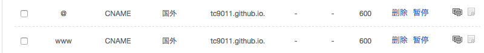
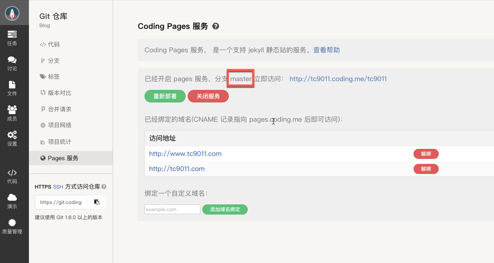
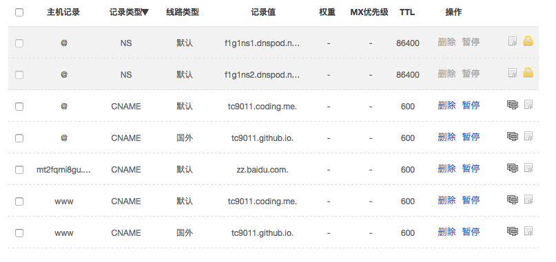
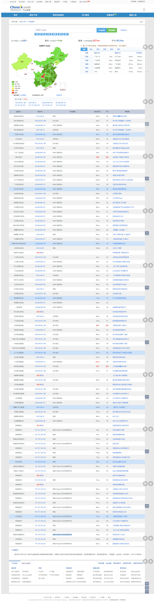

<!--more-->

双十一大家都在买买买的时候，有一个小码农也不甘寂寞，默默地在Namecheap上买了一个域名，完成了双十一的剁手之旅。

剁手之旅参照了[新版Namecheap注册域名详细教程](http://www.itbulu.com/new-nc-dns.html)，还是比较简单的。不过我的域名解析用的是DNSPOD，没有用Namecheap的域名解析，这样国内的用coding访问，国外用github访问，可以加快网站访问速度。

Github的设置比较简单，在/hexo/source中添加一个CNAME文件，注意不需要后缀名，里面内容就写`tc9011.com`，不要写www。然后去github page上绑定一下域名，DNS解析的话我是这样设置的：



下面说一下新版的coding绑定域名的问题，我发现这是一个大坑啊~~

我直接访问`tc9011.github.io`地址会跳转到`tc9011.com`,
我直接访问`tc9011.coding.me`发现不会跳转到`tc9011.com`这个域名，原因我搜了一下，答案如下：

> github只能绑定一个域名，所以访问`tengj.github.io`时，github的服务器知道要往`tengj.top`跳转。coding可以绑定多个域名，当绑定多个域名时，访问`tengj.coding.me,coding`的服务器不知道要往哪里跳转，所以干脆就不跳转了。但是当绑定一个时，为什么不跳转，可能是coding觉得麻烦，就不跳转了。这些都是coding定的，我们没办法改变。

> 你先想一个问题：那么多人都要在`github`上搞博客，还要自定义域名。github哪来这么多ip给你们用？所以办法就是仅仅提供一个ip，这样必然导致这个服务器上发着所有人的博客文件，那么如何区分特定的域名应该展示谁的博客呢？答案就是在仓库里面新建一个CNAME文件，里面写上你博客想用的域名，github的服务器会根据当前http请求的Host头部（即域名），查找对应的包含相同的CNAME内容的目录，从而显示其中的页面。这就是为什么要在仓库里面创建一个CNAME原因。

> 不过，事情还没完，一个ip的问题是世界各地不同地点的访问速度不同，有些地方可能很慢，所以需要一组ip来分担一下。最早github好像只有2个ip，后来ip变多了。再后来，github支持域名解析的时候，通过alias来。比如在域名商那边设置成`www.tengj.com ---> tengj.github.io`，由于github无法控制你如何配置域名和ip的关系，但他可以控制`tengj.github.io`的最终ip解析，所以`github`推荐大家使用`alias`解析，可以为博主提供就近ip访问。这就是你在域名商那边配置`CNAME`或者`alias`的原理。这里的`CNAME`跟上面提到的`CNAME`作用不同，不是一个概念，不要混淆。

还有就是coding.me的现在是指向国外的，不像以前是指向国内的，我也是醉了~

要把博客同步到coding，首先要在coding里面新建一个与你Global Key（也就是个性后缀）一样的项目，然后修改博客根目录下面的_config.yml文件中的deploy如下（注意缩进）：


和github一样配置ssh，过程就不详细说了，比较简单。比较重要的是，在source/需要创建一个空白文件，至于原因，是因为 coding.net需要这个文件来作为以静态文件部署的标志。就是说看到这个Staticfile就知道按照静态文件来发布。

```yaml
cd source/
touch Staticfile  #名字必须是Staticfile
```

接下来在coding pages服务中绑定域名，注意分支一定要写master。



最后去DNSPOD上设置一下域名解析：



然后检测一下域名解析是否正确，国内解析到coding，国外解析到github，后面国外的解析很多是解析到美国 Fastly公司CDN网络节点，这个就是github的解析，所以国内的解析估计就是coding了，虽然也是指向国外，ORZ。



