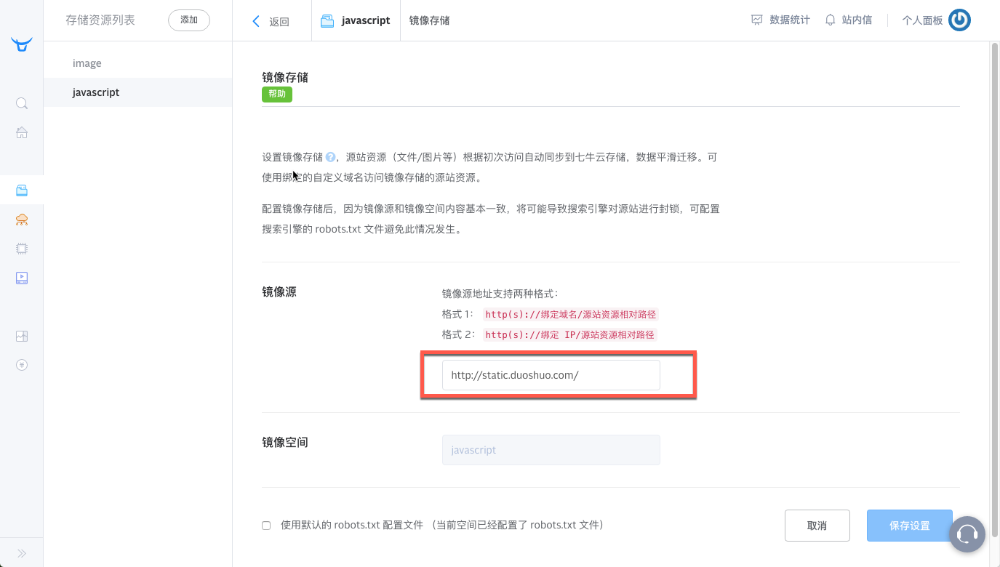
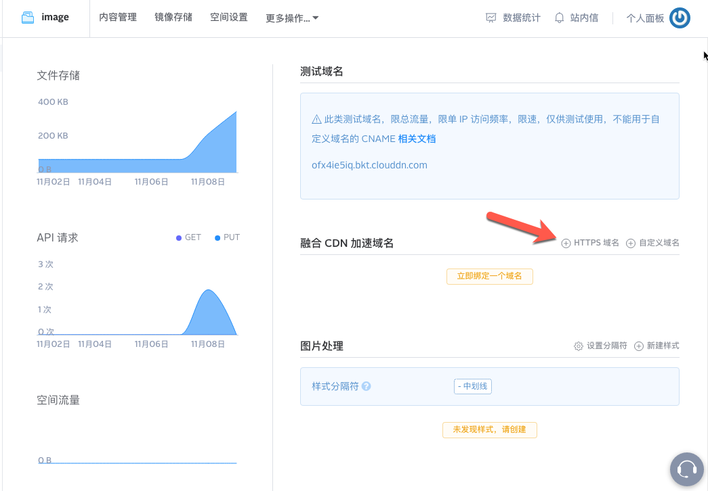

前几天参加了一场面试，面试时展示我的博客时，发生了一个比较尴尬的事情：博客打开页面空白，此时我内心是崩溃的，明明昨天晚上还好好的。。。

回来后我就开始着手对我的博客进行bug调试和优化。

<!--more-->

## CSS JS 404导致博客页面空白

首先解决这个问题，，在上网简单搜索了一下，导致这个结果的原因应该是：

> GitHub Pages 过滤掉了 `source/vendors` 目录的访问，所以next主题下的source下的vendors目录不能够被访问到，所以就出现了本地`hexo s`能够正常访问，但是deploy到github就是一片空白，按f12，可以看到大量来自`source/vendors`的css和js提示404

<a rel="external nofollow">[参考回答](https://github.com/hexojs/hexo/issues/2238)</a>

解决方案正如github里面说说的：

> 找到解决方案了。。 @BBBOND @monsterLin @SpadeRoy 根据作者的提示 @iissnan ，首先修改source/vendors为source/lib，然后修改_config.yml， 将 _internal: vendors修改为_internal:lib 然后修改next底下所有引用source/vendors路径为source/lib。这些地方可以通过文件查找找出来。主要集中在这几个文件中。1. Hexo\themes\next.bowerrc 2. Hexo\themes\next.gitignore 3. Hexo\themes\next.javascript_ignore 4. Hexo\themes\next\bower.json 。修改完毕后，刷新重新g一遍就ok啦。

然而我觉得这个太麻烦了，毕竟要改很多东西，既然新版本已经修复这个问题了，那我就重新安装吧。安装前先把文件先备份了一下，然后就按照<a rel="external nofollow">[Next官网](http://theme-next.iissnan.com/getting-started.html)</a>的说明，使用git来clone最新版本（之前我是下载安装）。

在终端窗口下，用cd定位到Hexo站点目录，然后clone，具体代码如下：

`$ cd your-hexo-site`
`$ git clone https://github.com/iissnan/hexo-theme-next themes/next`

cd后面的“your-hexo-site”改成你自己的hexo路径。

安装完了把主题目录下的\_config.yml文件替换成更新前的文件，其中的_internal: vendors修改为_internal:lib （大概在347行的地方），然后这个bug就可以解决了。

## 使用google字体影响网页加载效率

对网页加载进行分析后，发现有三个东西影响网页加载效率：

* 首先是Swiftype 搜索，这个是因为墙的原因，但是我又不想替换成localsearch，所以这个问题就先略过；
* 第二个是不蒜子统计，本来想替换成腾讯分析，但是貌似需要先给博客买个域名，然后腾讯分析才能识别，不然光是tc9011.github.io是识别不到的，这个涉及到购买域名，域名解析等问题，所以我暂时忍一下（其实是没钱了T^T）；
* ~~最后一个就是google字体，其实国内可以通过360cdn来访问。具体方法如下：~~

~~找到\themes\next\layout_partials\head\external-fonts.swig文件，把里面的`fonts.googleapis.com` 改成` fonts.useso.com`~~

<strong style="color:red">实践证明，改过后速度更慢了，于是我又改回了`fonts.googleapis.com`，ORZ</strong>


## 添加留言本页面

之前添加了多说评论，无意中看到别人家的博客中有留言本功能，于是我也想整一个。其实方法也是蛮简单的。

### 1、添加留言本page

先cd到博客根目录，然后运行：

`hexo new page guestbook`

### 2、在留言本页面中添加多说代码

进入到博客的`source`目录，里面会多了一个`gusetbook`文件夹，里面有一个`index.md`文件，打开该文件添加以下代码：

`<div class="ds-recent-visitors" data-num-items="28" data-avatar-size="42" id="ds-recent-visitors"></div>`

然后登陆自己多说站点，进入设置->自定义CSS，添加

```javascript
#ds-reset .ds-avatar img,
#ds-recent-visitors .ds-avatar img {
    width: 54px;
    height: 54px;     /*设置头像长宽*/
    border-radius: 27px;     /*设置头像圆角效果*/
    -webkit-border-radius: 27px;     /*圆角效果：兼容webkit*/
    -moz-border-radius: 27px;
    box-shadow: inset 0 -1px 0 #3333sf;     /*设置头像阴影效果*/
    -webkit-box-shadow: inset 0 -1px 0 #3333sf;
}

#ds-recent-visitors .ds-avatar {
    float: left
}
/*隐藏多说版权*/
#ds-thread #ds-reset .ds-powered-by {
    display: none;
}
```

### 3、菜单中设置留言本

找到`NexT`主题设置的`_config.yml`文件里面的`menu`项

```
menu:
  home: /
  #about: /about
  archives: /archives
  tags: /tags
  categories: /categories
  guestbook: /guestbook
```

在`menu_icons`下为留言本设定图标：

```html
menu_icons:
  enable: true
#KeyMapsToMenuItemKey: NameOfTheIconFromFontAwesome
  home: home
  about: user
  categories: th
  tags: tags
  archives: archive
  commonweal: heartbeat
  search: search
  guestbook: book
```

我用的是 book 这个图标，如果想要设定为其他图标，请访问：<a rel="external nofollow">[Font Awesome Icons](http://fontawesome.io/icons/)</a>，找到喜欢的图标，记录下图标后的关键字再填写到 menu_icons 下。

### 4、添加多语言文件的值

因为这里使用的是中文，找到`languages`文件夹里面的`zh-Hans.yml`文件，`menu`子项中添加留言：

```
menu:
  home: 首页
  archives: 归档
  categories: 分类
  tags: 标签
  about: 关于
  search: 搜索
  commonweal: 公益404
  guestbook: 留言
```

## SEO优化

### 1、添加robots.txt

可以参考我的robots.txt，代码如下

```
# hexo robots.txt
User-agent: *
Allow: /
Allow: /archives/

Disallow: /vendors/
Disallow: /js/
Disallow: /css/
Disallow: /fonts/
Disallow: /vendors/
Disallow: /fancybox/

Sitemap: https://tc9011.github.io/sitemap.xml
Sitemap: https://tc9011.github.io/baidusitemap.xml
```

把robots.txt放在你的hexo站点的`source`文件下即可。

### 2、添加sitemap网站地图

之前学了SEO，尝试也给自己网站做一下SEO，具体方法如下：

1. 安装hexo的<a rel="external nofollow">[sitemap](http://www.arao.me/tags/sitemap/)</a>网站地图生成插件

   ```
   npm install hexo-generator-sitemap --save
   npm install hexo-generator-baidu-sitemap --save
   ```

2. 在你的<a rel="external nofollow">[hexo](http://www.arao.me/tags/hexo/)</a>站点的`_config.yml`添加下面的代码

   ```
   # hexo sitemap网站地图
   sitemap:
   path: sitemap.xml
   ```

3. 配置成功后，hexo编译时会在hexo站点根目录生成sitemap.xml和baidusitemap.xml
   其中sitemap.xml适合提交给谷歌搜素引擎，baidusitemap.xml适合提交百度搜索引擎。
   ​

### 3、给非友情链接的出站链接添加“nofollow”标签

以hexo的NexT主题为例，需要修改两处

1. 找到footer.swig,路径在`your-hexo-site\themes\next\layout\_partials`，将下面代码

```html
{{ __('footer.powered', '<a class="theme-link" href="http://hexo.io">Hexo</a>') }}
```

改成

```html
{{ __('footer.powered', '<a class="theme-link" href="http://hexo.io" rel="external nofollow">Hexo</a>') }}
```

将下面代码

```html
<a class="theme-link" href="https://github.com/iissnan/hexo-theme-next">
```

改成

```html
<a class="theme-link" href="https://github.com/iissnan/hexo-theme-next" rel="external nofollow">
```

2. 修改`sidebar.swig`文件，路径在`your-hexo-site\themes\next\layout\_macro`，将下面代码

```html
<a href="{{ link }}" target="_blank">{{ name }}</a>
```

改成

```html
<a href="{{ link }}" target="_blank" rel="external nofollow">{{ name }}</a>
```

将下面代码

```html
<a href="http://creativecommons.org/licenses/{{ theme.creative_commons }}/4.0" class="cc-opacity" target="_blank">
```

改成

```html
<a href="http://creativecommons.org/licenses/{{ theme.creative_commons }}/4.0" class="cc-opacity" target="_blank" rel="external nofollow">
```

这是根据<a rel="external nofollow">[动动手指，不限于NexT主题的Hexo优化（SEO篇](http://www.arao.me/2015/hexo-next-theme-optimize-seo/)</a>来进行优化的，优化过程中发现，还是需要有自己的域名，不然百度抓不到你的数据，哎~等工作了一定要买一个域名（奋斗脸）。


## 多说评论不稳定，加载速度慢优化

加载多说的时候，因为对方服务器的原因，很不稳定，经常刷不出多说评论，所以决定优化一下，<a rel="external nofollow">[多说评论不稳定，加载速度慢优化方法](http://www.arao.me/2015/make-duoshuo-faster-qiniu-cdn/)</a>，主要参考这篇文章进行了优化，具体方法：

1. 在七牛镜像储存中，镜像源地址填写`http://static.duoshuo.com`，然后保存。



加速成功后，可以通过七牛提供的空间访问域名访问到多说镜像网站，例如我的默认域名是`http://og9ocpmwk.bkt.clouddn.com/`，直接可以链接到多说的镜像网站。

2. 下载<a rel="external nofollow">[多说核心脚本embed.js](http://static.duoshuo.com/embed.js)</a>，需要更改一处地方代码，

   ```javascript
   function n(e){j.theme=e,"none"!=e&&o.injectStylesheet(j.STATIC_URL+"/styles/embed"+(e?"."+e+".css?"+R[e]:"."+short_name)+".css")}
   ```

   上面代码应该是调用多说样式`embed.xxx.css`，我们需要修改成我们七牛镜像的多说样式，只需把`j.STATIC_URL`更改成七牛空间访问域名，例如我修改成`"http://xxx.com"`。更改后另存为`dsembed.js`（重命名主要防止与七牛镜像中的embed.js冲突）。最后上传到七牛空间里。现在你可以通过地址`/dsembed.js`访问经过七牛CDN加速后的多说核心脚本。

3. 把多说默认引入`static.duoshuo.com`域名下的`embed.js`更改成七牛空间更改后的`dsembed.js`即可。

   这里以多说通用代码为例，

   ```javascript
   <!-- 多说评论框 start -->
   	<div class="ds-thread" data-thread-key="请将此处替换成文章在你的站点中的ID" data-title="请替换成文章的标题" data-url="请替换成文章的网址"></div>
   <!-- 多说评论框 end -->
   <!-- 多说公共JS代码 start (一个网页只需插入一次) -->
   <script type="text/javascript">
   var duoshuoQuery = {short_name:"araolin"};
   	(function() {
   		var ds = document.createElement('script');
   		ds.type = 'text/javascript';ds.async = true;
   		ds.src = (document.location.protocol == 'https:' ? 'https:' : 'http:') + '//static.duoshuo.com/embed.js';
   		ds.charset = 'UTF-8';
   		(document.getElementsByTagName('head')[0] 
   		 || document.getElementsByTagName('body')[0]).appendChild(ds);
   	})();
   	</script>
   <!-- 多说公共JS代码 end -->
   ```

   `embed.js`引入的代码是

   ```javascript
   ds.src = (document.location.protocol == 'https:' ? 'https:' : 'http:') + '//static.duoshuo.com/embed.js';
   ```

   这里需要更改成

   ```javascript
   ds.src = '这里是你的七牛空间embed.js的地址';
   ```

   以我的为例，我更改成了

   ```javascript
   ds.src = 'http://xxx.com/dsembed.js';
   ```

   如果你是hexo Next主题的话，需要更改的文件是`duoshuo.swig`，具体路径在`your-hexo-site\themes\next\layout\_scripts\comments`目录里。
   ​

   最后值的注意的是，因为我的网站是`https://tc9011.github.io`，上面的链接若写成http的话，也会加载不了多说评论。所以下面是针对https的一些修改：

   * 首先给七牛账户充值11块钱，不然这个功能木有办法用~
   * 进入存储资源列表，然后点击下图所示的https域名，七牛会自动生成一个域名；

   

   * 在内容管理里面选择刚刚生成的域名作为默认外链域名，记得保存。

   * 把内容管理里面的文件先全部删掉，把上面`dsembed.js`文件重命名一下，主要防止没有覆盖旧文件，比如我命名为`dembed.js`，再把文件中添加`http://xxx.com`的地方都改成新的外链地址，比如我的`https://xxxx.com`，然后保存，上传七牛。

   * 把`duoshuo.swig`中的src替换成新的域名。

     ```javascript
     ds.src = 'http://XXX.com/dembed.js';
     ```

     ​


## 最后

其实博客还有优化空间，比如有几个js加载速度简直是慢的令人发指，尝试了压缩代码，还是不行，感觉还是要把他们托管到其他地方，这个以后慢慢优化，可能以后买个域名，把博客同时托管到coding和github，国内访问coding，国外访问github，具体怎么操作，请听下回分解。

