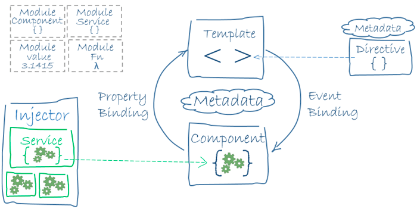
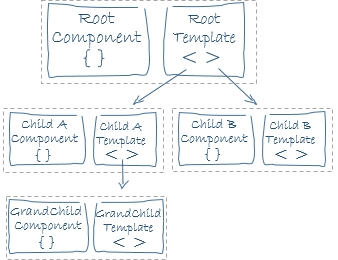
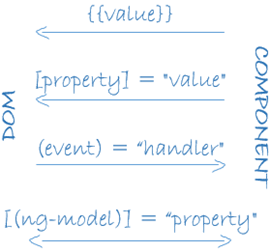
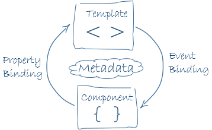
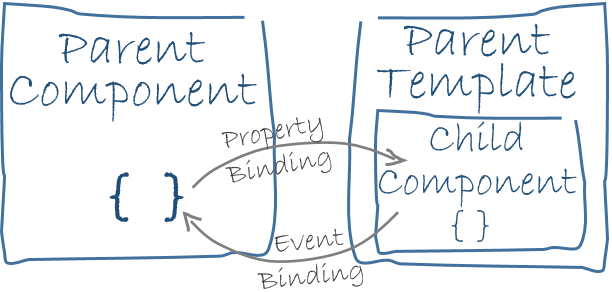
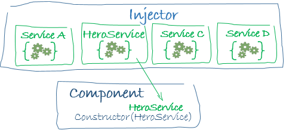

<!--more-->

## 模块

### `NgModule`

`NgModule`是一个装饰器函数，它接收一个用来描述模块属性的元数据对象。其中最重要的属性是：

- `declarations` - 声明**本模块**中拥有的**视图类**。 Angular 有三种视图类：**组件**、**指令**和**管道**。
- `exports` - declarations 的子集，**可用于其它模块的组件模板**（暴露出来供外部使用）。
- `imports` - 本模块声明的组件模板需要的类所在的其它模块（引入所需的其他模块的组件模板）。
- `providers` - 服务的创建者，并加入到全局服务列表中，可用于应用**任何部分**。
- `bootstrap` - 指定应用的主视图（称为根组件），它是所有其它视图的宿主。只有**根模块**才能设置`bootstrap`属性。

通过`main.ts`引导`AppModule`:

```typescript
import { platformBrowserDynamic } from '@angular/platform-browser-dynamic';
import { AppModule } from './app.module';

platformBrowserDynamic().bootstrapModule(AppModule);
```

### JavaScript模块

> JavaScript 也有自己的模块系统，用来管理一组 JavaScript 对象。 它与 Angular 的模块系统**完全不同且完全无关**。

> JavaScript 中，每个**文件**是一个模块，文件中定义的所有对象都从属于那个模块。 通过**`export`**关键字，模块可以把它的某些对象声明为公共的。 其它 JavaScript 模块可以使用**import 语句**来访问这些公共对象。

```javascript
import { NgModule }     from '@angular/core';
import { AppComponent } from './app.component';
```

```javascript
export class AppModule { }
```

### Angular模块库

Angular模块库是一组JavaScript模块，名字带有`@angular`前缀。用 JavaScript 的import语句导入。

## 组件

组件**控制**视图。在类中定义组件的应用逻辑。 应用可以通过生命周期钩子在组件生命周期的各个时间点上插入自己的操作，例如ngOnInit()`。

## 模板

模板**定义**组件的视图，以HTML形式存在。

模板除了可以使用典型的HTML元素，还可以使用Angular的模板语法，例如：`*ngFor`、`{{hero.name}}`、`(click)`、`[hero]`和`<hero-detail>`等。

`<hero-detail>`是`HeroDetailComponent`组件自定义的HTML标签，`HeroDetailComponent`是`HeroListComponent`的子组件。



## 元数据

用装饰器来附加元数据:

```typescript
@Component({
  moduleId: module.id,
  selector:    'hero-list',
  templateUrl: 'hero-list.component.html',
  providers:  [ HeroService ]
})
```

`@Component`的配置项包括：

- `moduleId`: 为与模块相关的 URL（例如`templateUrl`）提供基地址。（简单的理解为给url分配一个当前module的Id，便于区分）
- `selector`： CSS 选择器，它告诉 Angular 在**父级** HTML 中查找`<hero-list>`标签，创建并插入该组件。 例如，如果应用的 HTML 包含`<hero-list></hero-list>`， Angular 就会把`HeroListComponent`的一个实例插入到这个标签中。
- `templateUrl`：组件 HTML 模板的模块相对地址。
- `providers` - 组件所需服务的**依赖注入提供商**数组。 这是在告诉 Angular：该组件的构造函数需要一个`HeroService`服务，这样组件就可以从服务中获得英雄数据。

## 数据绑定

数据绑定的语法有以下四种形式。每种形式都有一个方向 —— 绑定到 DOM 、绑定自 DOM 以及双向绑定。



```html
<li>{{hero.name}}</li>
<hero-detail [hero]="selectedHero"></hero-detail>
<li (click)="selectHero(hero)"></li>
```

- `{{hero.name}}`**插值表达式**在`<li>`标签中显示组件的`hero.name`属性的值。
- `[hero]`**属性绑定**把父组件`HeroListComponent`的`selectedHero`的值传到子组件`HeroDetailComponent`的`hero`属性中。
- `(click)` **事件绑定**在用户点击英雄的名字时调用组件的`selectHero`方法。

**双向数据绑定**是重要的第四种绑定形式，它使用`ngModel`**指令**组合了属性绑定和事件绑定的功能。

```html
<input [(ngModel)]="hero.name">
```

在双向绑定中，数据属性值通过属性绑定从组件流到输入框。用户的修改通过事件绑定流回组件，把属性值设置为最新的值。

Angular 在每个 JavaScript 事件循环中处理**所有的**数据绑定，它会从组件树的根部开始，递归处理全部子组件。

双向绑定的应用：

1. 模板与对应组件的交互



1. 父组件与子组件的通讯



## 指令


指令是一个带有“指令元数据”的类。在 TypeScript 中，要通过`@Directive`装饰器把元数据附加到类上。Angular根据指令提供的操作对DOM进行转换。（严格来说组件就是一个指令）。

### 结构型指令

结构型指令通过在 DOM 中添加、移除和替换元素来修改布局。

```html
<li *ngFor="let hero of heroes"></li>
<hero-detail *ngIf="selectedHero"></hero-detail>
```

- `*ngFor`告诉 Angular 为`heroes`列表中的每个英雄生成一个`<li>`标签。
- `*ngIf`表示只有在选择的英雄存在时，才会包含`HeroDetail`组件。

### 属性型指令

属性型指令修改一个现有元素的外观或行为。在模板中，它们看起来就像是标准的 HTML 属性。例如：`ngModule`。

## 服务

服务是一个广义范畴，包括：值、函数，或应用所需的特性。

组件类应保持精简。**组件本身不从服务器获得数据、不进行验证输入，也不直接往控制台写日志**。 它们把这些任务委托给服务。

组件的任务就是提供用户体验，仅此而已。它介于视图（由模板渲染）和应用逻辑（通常包括**模型**的某些概念）之间。 设计良好的组件为数据绑定提供属性和方法，把其它琐事都委托给服务。

## 依赖注入

 Angular 使用依赖注入来提供新组件以及组件所需的服务。Angular 通过查看构造函数的参数类型得知组件需要哪些服务。

```typescript
constructor(private service: HeroService) { }
```

当 Angular 创建组件时，会首先为组件所需的服务请求一个**注入器 (injector)**。

注入器维护了一个服务实例的容器，存放着以前创建的实例。 如果所请求的服务实例不在容器中，注入器就会创建一个服务实例，并且添加到容器中，然后把这个服务返回给 Angular。 当所有请求的服务都被解析完并返回时，Angular 会以这些服务为参数去调用组件的构造函数。 这就是**依赖注入** 。(注入器将服务作为参数，注入到构造函数中)



当注入器没有服务时，通过provide创建并返回一个服务。

provide可以在根模块上添加provide以便任何地方使用服务的同一个实例，或者在`@component`元数据中添加provide以便在组件层中使用，把它注册在组件级表示该组件的每一个新实例都会有一个服务的新实例。

需要记住的关于依赖注入的要点是：

- 依赖注入渗透在整个 Angular 框架中，被到处使用。
- **注入器 (injector)** 是本机制的核心。
  - 注入器负责维护一个**容器**，用于存放它创建过的服务实例。
  - 注入器能使用**提供商**创建一个新的服务实例。
- **提供商**是一个用于创建服务的配方。
- 把**提供商**注册到注入器。


