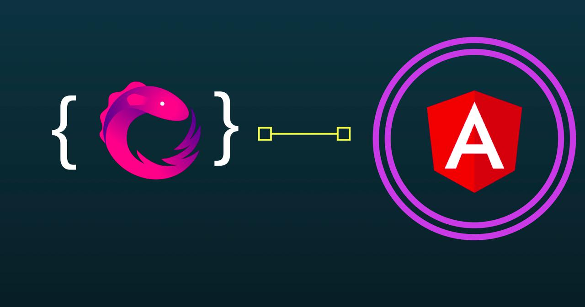

<!--more-->

# 最简化的部署方式

1. 把一切文件（部分文件可以通过cdn加载）从本地项目目录下复制到服务器目录下
2. 如果准备把该应用放在子目录下，就要编辑`index.html`，并适当设置`<base href>`。 比如，如果到`index.html`的URL是`www.mysite.com/my/app/`，就把*基地址*设置为`<base href="/my/app/">`（如果使用angular/cli，`index.html`不用变，`ng serve`后面加上`--base-href /my/app`）。如果是放在根路径下就不用动它。
3. 把服务器上缺失的文件重定向到`index.html`
4. 按后面的描述启用生产模式（可选）

## 从Web上加载npm包（SystemJS）

`node_modules`文件夹包含着在浏览器中运行应用时所需的代码。 运行应用时其实只需要其中很小的一部分。可以转而从网上下载所需的少量文件，加快页面加载速度。

1. 复制一份专用于部署的`index.html`，并把所有的`node_module`脚本替换成加载网上的版本。代码如下：

```html
<!-- Polyfills -->
<script src="https://unpkg.com/core-js/client/shim.min.js"></script>

<!-- Update these package versions as needed -->
<script src="https://unpkg.com/zone.js@0.8.4?main=browser"></script>
<script src="https://unpkg.com/systemjs@0.19.39/dist/system.src.js"></script>
```

1. 把`systemjs.config.js`脚本改为加载`systemjs.config.server.js`。

```html
<!-- This SystemJS configuration loads umd packages from the web -->
<script src="systemjs.config.server.js"></script>
```

```javascript
/**
 * System configuration for deployment without installing node_modules
 * Loads umd packages from the web instead
 * Adjust as necessary for your application needs.
 */
(function (global) {
  System.config({
    /*在标准的SystemJS配置中，npm路径指向node_modules/。 在服务器端的配置中，它指向https://unpkg.com（一个专门存放npm包的服务器）， 并从网上直接加载它们。*/
    paths: {
      'npm:': 'https://unpkg.com/' // path serves as alias
    },
    // map tells the System loader where to look for things
    map: {
      app: 'app', // location of transpiled app files
      // angular minimized umd bundles
      '@angular/core': 'npm:@angular/core/bundles/core.umd.min.js',
      '@angular/common': 'npm:@angular/common/bundles/common.umd.min.js',
      '@angular/compiler': 'npm:@angular/compiler/bundles/compiler.umd.min.js',
      '@angular/platform-browser': 'npm:@angular/platform-browser/bundles/platform-browser.umd.min.js',
      '@angular/platform-browser-dynamic': 'npm:@angular/platform-browser-dynamic/bundles/platform-browser-dynamic.umd.min.js',
      '@angular/http': 'npm:@angular/http/bundles/http.umd.min.js',
      '@angular/router': 'npm:@angular/router/bundles/router.umd.min.js',
      '@angular/router/upgrade': 'npm:@angular/router/bundles/router-upgrade.umd.min.js',
      '@angular/forms': 'npm:@angular/forms/bundles/forms.umd.min.js',
      '@angular/upgrade': 'npm:@angular/upgrade/bundles/upgrade.umd.min.js',
      '@angular/upgrade/static': 'npm:@angular/upgrade/bundles/upgrade-static.umd.min.js',
      // other libraries
      'rxjs':                      'npm:rxjs@5.0.1',
      'angular-in-memory-web-api': 'npm:angular-in-memory-web-api/bundles/in-memory-web-api.umd.js'
    },
    // packages tells the System loader how to load when no filename and/or no extension
    packages: {
      app: {
        main: './main.js',
        defaultExtension: 'js'
      },
      rxjs: {
        defaultExtension: 'js'
      }
    }
  });
  })(this);
```

1. 把 `systemjs.config.server.js`复制到`src/`文件夹。 这个版本会从网上加载Angular的*UMD*版本（和其它第三方包）。

# 为生产环境优化

减少请求数和体积的方法：

- 预编译（AOT）：预编译Angular的组件模板。
- 打捆（Bundle）：把这些模块串接成一个单独的捆文件（bundle）。
- 内联：把模板html和css拉到组件中。
- 最小化：移除不必要的空格、注释和可选令牌（Token）。
- 混淆：使用短的、无意义的变量名和函数名来重写代码。
- 消除死代码：移除未引用过的模块和未使用过的代码。
- 修剪库：移除未使用过的库，并把其它库裁剪到只剩下你需要的那些特性。
- 性能度量：集中精力做那些能产生可测量差异的优化。

## 预编译（AOT）

Angular的*预编译*器会在构建过程中预先编译应用的组件及其模板。

预编译过的应用启动更快，原因如下：

- 应用组件会立即执行，不需要客户端编译过程。
- 模板会被内嵌在组件中，因此不会再从客户端请求模板文件。
- 我们不用再下载Angular编译器模块，它本身太大了。
- 编译器会丢弃那些摇树优化（tree-shaking）工具能排除的代码。

## Webpack（与AOT）

如果用webpack，可以考虑使用官方的[ Angular预编译插件](https://github.com/angular/angular-cli/tree/master/packages/%40ngtools/webpack)来配置*Webpack*。 这个插件会转译TypeScript代码、独立打包延迟加载的`NgModules`，而且不用对源码做任何修改就能执行AOT编译。

## 使用rollup消除死代码

*摇树优化*是一种*消除死代码*的技术，它会从JavaScript模块中移除导出。 如果一个库导出了一些东西，但是应用代码没有导入过它，摇树工具就会从代码中移除它。

常用的摇树优化工具是[Rollup](http://rollupjs.org/)，一个带有插件的生态系统，可以完成打包、最小化和混淆。 要了解关于摇树优化和消除死代码技术的更多知识，参见[这个帖子](https://medium.com/@Rich_Harris/tree-shaking-versus-dead-code-elimination-d3765df85c80#.15ih9cyvl)，它的作者就是rollup之父Rich Harris。

## 修剪库

不要指望自动移除所有死代码。

手动移除不用的库，特别是`index.html`中不用的脚本。 为实际使用的那些库则努力选择更小的代用库。

有些库可以构建出只带所需特性的、自定义的、带皮肤的版本。另一些库则可以让你按需导入它的特性。 **RxJS**就是一个很好的例子，angular会单独导入`Observable`的操作符（operator），而不是导入整个库。

## 度量性能

[Chrome开发工具的网络性能页](https://developers.google.com/web/tools/chrome-devtools/network-performance/understanding-resource-timing)是开始学习度量性能的好地方。

[WebPageTest](https://www.webpagetest.org/)工具是另一个不错的选择，它能帮你验证你的部署是否成功了。

# Angular配置

## base标签

HTML中的[*<base href="..."/>*](https://angular.io/docs/ts/latest/guide/router.html#!#base-href)用于指定一个解析相对路径的基地址，如图片、脚本和样式表。 比如，指定`<base href="/my/app/">`时，浏览器就会把`some/place/foo.jpg`这样的URL解析成到`my/app/some/place/foo.jpg`的服务端请求。 在浏览期间，Angular路由器会使用*base href*作为组件、模板和模块文件的基地址。

当`base`标签没有正确配置时，该应用会加载失败，并且浏览器的控制台会对这些缺失的文件显示`404 - Not Found`错误。

## 启用生产模式

Angular应用默认运行在开发模式下，正如在浏览器控制台中看到的如下信息：

```html
Angular is running in the development mode. Call enableProdMode() to enable the production mode.
（Angular正运行在开发模式下。调用enableProdMode()来启用生产模式）
```

切换到生产模式可以通过禁用开发环境下特有的检查（比如双重变更检测周期）来让应用运行得更快。

要在远程运行时启用[生产模式](https://angular.cn/docs/ts/latest/api/core/index/enableProdMode-function.html)，请把下列代码添加到`main.ts`中。

```typescript
import { enableProdMode } from '@angular/core';

// Enable production mode unless running locally
if (!/localhost/.test(document.location.host)) {
  enableProdMode();
}
```

## 惰性加载

通过只加载应用启动时必须展示的那些应用模块，可以显著缩减启动时间。

配置Angular路由器可以延迟加载所有其它模块（以及与它们相关的代码），无论是[等应用启动](https://angular.cn/docs/ts/latest/guide/router.html#preloading)， 还是在需要时才[惰性加载](https://angular.cn/docs/ts/latest/guide/router.html#asynchronous-routing)。

不要立即导入惰性加载模块中的任何东西，这是一种常犯的错误。 我们本打算惰性加载一个模块，但可能无意中在根模块`AppModule`文件中使用一个JavaScript的`import`语句导入了它。 这样一来，该模块就被立即加载了。

# 服务端配置

带路由的应用必须以`index.html`作为后备页面。

如果应用使用Angular路由器，就必须配置服务器，让它对不存在的文件返回应用的宿主页(`index.html`)。

带路由的应用应该支持“深链接”。 所谓深链接就是指一个URL，它用于指定到应用内某个组件的路径。 比如，`http://www.mysite.com/heroes/42`就是一个到英雄详情页面的*深链接*，用于显示`id: 42`的英雄。当用户从运行中的客户端应用导航到这个URL时，Angular路由器会拦截这个URL，并且把它路由到正确的页面。

但是，当从邮件中点击链接或在浏览器地址栏中输入它或仅仅在英雄详情页刷新下浏览器时，所有这些操作都是由浏览器本身处理的，在应用的控制范围之外。 浏览器会直接向服务器请求那个URL，路由器没机会插手。

静态服务器会在收到对`http://www.mysite.com/`的请求时返回`index.html`，但是会拒绝对`http://www.mysite.com/heroes/42`的请求， 并返回一个`404 - Not Found`错误，除非，我们把它配置成转而返回`index.html`。

## 生产服务器

- [Apache](https://httpd.apache.org/)：在`.htaccess`文件中添加一个[重写规则](http://httpd.apache.org/docs/current/mod/mod_rewrite.html)， 代码如下（[出处](https://ngmilk.rocks/2015/03/09/angularjs-html5-mode-or-pretty-urls-on-apache-using-htaccess/)）：

```yaml
RewriteEngine On
# If an existing asset or directory is requested go to it as it is
RewriteCond %{DOCUMENT_ROOT}%{REQUEST_URI} -f [OR]
RewriteCond %{DOCUMENT_ROOT}%{REQUEST_URI} -d
RewriteRule ^ - [L]

# If the requested resource doesn't exist, use index.html
RewriteRule ^ /index.html
```

- [NGinx](http://nginx.org/)：使用`try_files`指向`index.html`，详细描述见[Web应用的前端控制器模式](https://www.nginx.com/resources/wiki/start/topics/tutorials/config_pitfalls/#front-controller-pattern-web-apps)。

```yaml
try_files $uri $uri/ /index.html;
```

- [IIS](https://www.iis.net/)：往`web.config`中添加一条重写规则，类似于[这里](http://stackoverflow.com/a/26152011/2116927)：

```html
<system.webServer>
  <rewrite>
    <rules>
      <rule name="Angular Routes" stopProcessing="true">
        <match url=".*" />
        <conditions logicalGrouping="MatchAll">
          <add input="{REQUEST_FILENAME}" matchType="IsFile" negate="true" />
          <add input="{REQUEST_FILENAME}" matchType="IsDirectory" negate="true" />
        </conditions>
        <action type="Rewrite" url="/src/" />
      </rule>
    </rules>
  </rewrite>
</system.webServer>
```

- [GitHub页面服务](https://pages.github.com/)：我们没办法[直接配置](https://github.com/isaacs/github/issues/408) Github的页面服务，但可以添加一个404页，只要把`index.html`复制到`404.html`就可以了。 它仍然会给出一个404响应，但是浏览器将会正确处理该页，并正常加载该应用。 使用[在主分支的`docs/`下启动服务](https://help.github.com/articles/configuring-a-publishing-source-for-github-pages/#publishing-your-github-pages-site-from-a-docs-folder-on-your-master-branch) 并[创建一个`.nojekyll`文件](https://www.bennadel.com/blog/3181-including-node-modules-and-vendors-folders-in-your-github-pages-site.htm)也是一个好办法。
- [Firebase主机服务](https://firebase.google.com/docs/hosting/)：添加一条[重写规则](https://firebase.google.com/docs/hosting/url-redirects-rewrites#section-rewrites)。

```yaml
"rewrites": [ {
  "source": "**",
  "destination": "/index.html"
} ]
```

## 请求来自另一个服务器的服务（CORS）

Angular开发者在向与该应用的宿主服务器不同域的服务器发起请求时，可能会遇到一种[*跨域资源共享（CORS）*](https://en.wikipedia.org/wiki/Cross-origin_resource_sharing)错误。 浏览器会阻止该请求，除非得到那台服务器的明确许可。

客户端应用对这种错误无能为力。 服务器必须配置成可以接受来自该应用的请求。 要了解如何对特定的服务器开启CORS，参见[enable-cors.org](http://enable-cors.org/server.html)。
