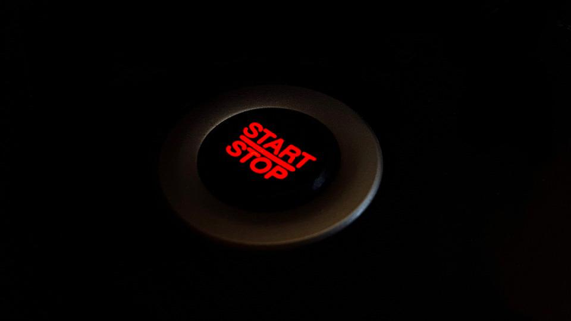
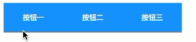
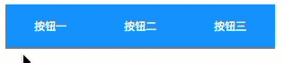
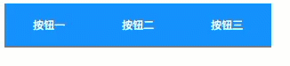

<!--more-->

之前在[AngularJS2中一种button切换效果的实现（一）](http://tc9011.com/2016/12/08/AngularJS2%E4%B8%AD%E4%B8%80%E7%A7%8Dbutton%E5%88%87%E6%8D%A2%E6%95%88%E6%9E%9C%E7%9A%84%E5%AE%9E%E7%8E%B0%EF%BC%88%E4%B8%80%EF%BC%89/)和[AngularJS2中一种button切换效果的实现（二）](http://tc9011.com/2017/01/11/AngularJS2%E4%B8%AD%E4%B8%80%E7%A7%8Dbutton%E5%88%87%E6%8D%A2%E6%95%88%E6%9E%9C%E7%9A%84%E5%AE%9E%E7%8E%B0%EF%BC%88%E4%BA%8C%EF%BC%89/)中实现了按钮的切换效果，但是方法比较low，这次我们使用Angular2的指令来实现。

## 指令实现hover效果

```typescript
import { Directive, ElementRef, HostListener, Input } from '@angular/core';

@Directive({
  selector: '[myHighlight]'
})

export class HighlightDirective {
  constructor(private el: ElementRef) { }

  @HostListener('mouseenter') onMouseEnter() {
    this.highlight('red');
  }

  @HostListener('mouseleave') onMouseLeave() {
    this.highlight(null);
  }

  private highlight(color: string) {
    this.el.nativeElement.style.backgroundColor = color;
  }
}
```

```html
<button myHighlight class="btn">按钮一</button>
<button myHighlight class="btn">按钮二</button>
<button myHighlight class="btn">按钮三</button>
```

```css
.btn{
  height: 50px;
  width: 100px;
  background-color: #3399ff;
  color: white;
  border: 0;
  outline: 0;
  cursor: hand;
}
```

hover的效果直接参考[Angular官网](https://angular.cn/docs/ts/latest/guide/attribute-directives.html)的代码。



## 指令实现click效果

```typescript
import { Directive, ElementRef, HostListener, Input } from '@angular/core';

@Directive({
  selector: '[myHighlight]'
})

export class HighlightDirective {
  constructor(private el: ElementRef) { }

  @HostListener('click') onMouseClick() {
    this.clickhighlight("black");
  }

  private clickhighlight(color: string) {
    let obj = this.el.nativeElement;
    let btns = obj.parentNode.children;
    
    //背景色全部重置
    for(let i=0; i<btns.length; i++){
      btns[i].style.backgroundColor = "#3399ff";
    }
    //设置当前点击对象的背景色
    obj.style.backgroundColor = color;
  }
}
```

```html
<div>
<button myHighlight class="btn">按钮一</button>
<button myHighlight class="btn">按钮二</button>
<button myHighlight class="btn">按钮三</button>
</div>
```

```css
.btn{
  height: 50px;
  width: 100px;
  background-color: #3399ff;
  color: white;
  border: 0;
  outline: 0;
  cursor: hand;
}
```

click效果仍然用`@HostListener`装饰器引用属性型指令的宿主元素，首先把所有button的背景颜色重置，然后再设置当前点击对象的背景颜色，这样就达到了点击后背景颜色变化的效果。



## 指令实现click加hover效果

```typescript
import { Directive, ElementRef, HostListener, Input } from '@angular/core';

@Directive({
  selector: '[myHighlight]'
})

export class HighlightDirective {
  constructor(private el: ElementRef) { }

  @HostListener('click') onMouseClick() {
    this.clickhighlight("black");
  }

  private clickhighlight(color: string) {
    let obj = this.el.nativeElement;
    let btns = obj.parentNode.children;
    
    //背景色全部重置
    for(let i=0; i<btns.length; i++){
      btns[i].style.backgroundColor = "#3399ff";
    }
    //设置当前点击对象的背景色
    obj.style.backgroundColor = color;
  }
}
```

```html
<div>
<button myHighlight class="btn">按钮一</button>
<button myHighlight class="btn">按钮二</button>
<button myHighlight class="btn">按钮三</button>
</div>
```

```css
.btn{
  height: 50px;
  width: 100px;
  background-color: #3399ff;
  color: white;
  border: 0;
  outline: 0;
  cursor: hand;
}

.btn:hover{
  background: black !important;
}

```

配合上文click效果，只要加上一行css代码就可以实现click和hover的组合效果，此处务必使用hover伪类，并用`!important`来提升样式的优先级，如果用`@HostListener`装饰器，mouseenter、mouseleave、click三者会打架：



