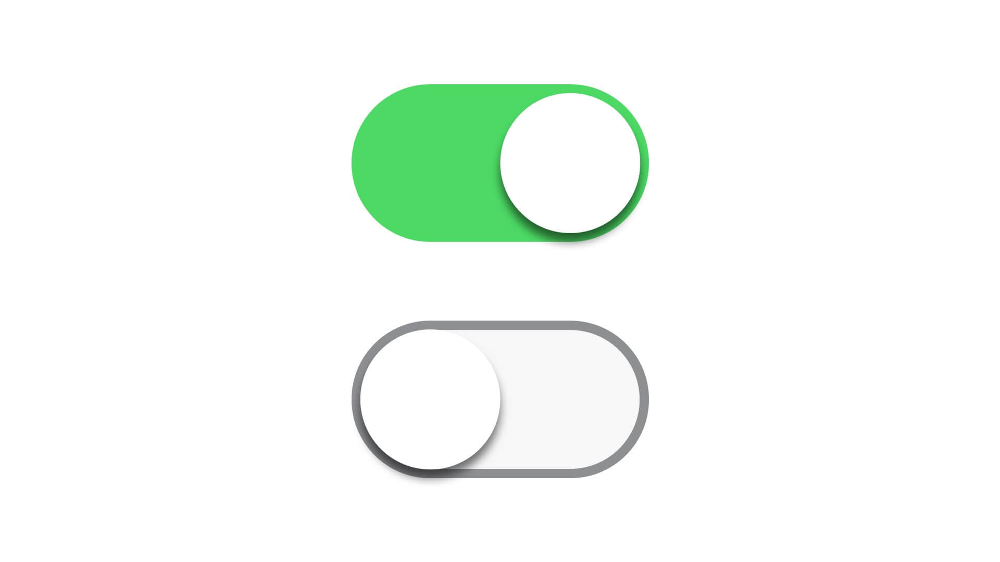

<!--more-->

之前用三目表达式和ng-class实现了按钮切换效果，似乎达到了我的预期，但是我觉得还有改进空间，网上找了一些资料，大概还有以下几种实现方式：

## 路由

```html
<button class="btn1" routerLink="component1" routerLinkActive="active" type="submit">btn1</button>
<button class="btn2" routerLink="component2" routerLinkActive="active" type="submit">btn2</button>
```

```css
.active {
  background-color: white;
}
```

将button切换的页面写成一个component，通过`routerLink`链接到对应的component并显示出来，`routerLinkActive`来控制路由链接激活后button的样式应用的class。

但是这个有局限性，适合button按下去后，整个页面会有大幅变化的应用场景，那么还有其他方法吗？答案是肯定的。

## [class]与(click)

还是通过ngclass和ngclick配合，不过方法和之前写的略有不同。

### 字符串数组形式

```html
<button [class]="{true:'btn1',false:'btn2'}[isChange]" (click)="isChange=true">btn1</button>
<button [class]="{false:'btn1',true:'btn2'}[isChange]" (click)="isChange=false" >btn2</button>
```

```css
.btn1{
  width: 120px;
  height: 43px;
  border: 1px solid #EEEEEE;
  background: white;
  border-bottom: none;
  text-align: center;
}

.btn2{
  border: 1px solid #EEEEEE;
  border-top: 2px solid #238FF9;
  width: 120px;
  height: 42px;
  background: white;
  border-bottom: none;
  text-align: center;
}
```

字符串数组形式是针对class简单变化，具有排斥性的变化，true是什么class，false是什么class。若要设置初识状态的class，可以在component中的构造函数中预先赋值。

### 对象key/value处理

```html
<button [class]="{'one':'btn1','two':'btn2','three':'btn3','four':'btn4'}[isChange]" (click)="isChange='one'">btn1</button>
  <button [class]="{'one':'btn1','two':'btn2','three':'btn3','four':'btn4'}[isChange]" (click)="isChange='two'">btn2</button>
  <button [class]="{'one':'btn1','two':'btn2','three':'btn3','four':'btn4'}[isChange]" (click)="isChange='three'">btn3</button>
  <button [class]="{'one':'btn1','two':'btn2','three':'btn3','four':'btn4'}[isChange]" (click)="isChange='four'">btn4</button>
```

这种方法可以对多个对象赋不同的class。或者可以实现多个button互斥性变化：

```html
<button [class]="{'one':'btn1','two':'btn2','three':'btn2','four':'btn2'}[isChange]" (click)="isChange='one'">btn1</button>
  <button [class]="{'one':'btn2','two':'btn1','three':'btn2','four':'btn2'}[isChange]" (click)="isChange='two'">btn2</button>
  <button [class]="{'one':'btn2','two':'btn2','three':'btn1','four':'btn2'}[isChange]" (click)="isChange='three'">btn3</button>
  <button [class]="{'one':'btn2','two':'btn2','three':'btn2','four':'btn1'}[isChange]" (click)="isChange='four'">btn4</button>
```


参考资料：

[angularJs的ng-class切换class](http://www.cnblogs.com/ruoqiang/p/5228338.html)

