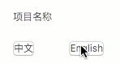
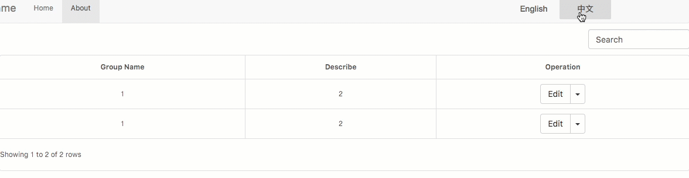

<!--more-->

前段时间，我们团队的项目要在国外演示，对所有相关项目进行了国际化改造。下面简单介绍一下[ngx-translate库](https://github.com/ngx-translate/core)在Angular5下的使用方法。

# 导入ngx-translate

运行下面命令安装`@ngx-translate/core`和`@ngx-translate/http-loader`：

```shell
npm install @ngx-translate/core --save
npm install @ngx-translate/http-loader --save
```

然后在根模块（一般是`app.module.ts`）下引入`TranslateModule`

```typescript
import { BrowserModule } from '@angular/platform-browser';
import { NgModule } from '@angular/core';
import {HttpClient} from "@angular/common/http";

import {TranslateLoader, TranslateModule} from "@ngx-translate/core";
import {TranslateHttpLoader} from "@ngx-translate/http-loader";
import { AppComponent } from './app.component';

// 为AOT准备
export function createTranslateLoader(http: HttpClient) {
  return new TranslateHttpLoader(http, './assets/i18n/', '.json');
}

@NgModule({
  imports: [
    BrowserModule,
    TranslateModule.forRoot({
      loader: {
        provide: TranslateLoader,
        useFactory: (createTranslateLoader),
        deps: [HttpClient]
      }
    })
  ],  
  declarations: [AppComponent],
  providers: [],
  bootstrap: [AppComponent]
})
export class AppModule { }
```

如果Angular版本小于4.3，可以使用`http-loader@0.1.0`，并用`@angular/http`中的`Http`代替`HttpClient`。

为了方便在其他模块下使用，在`sharedModule`下面导入`TranslateModule`：

```typescript
import { NgModule } from '@angular/core';
import { CommonModule } from '@angular/common';

import {TranslateModule} from "@ngx-translate/core";

const sharedModule = [
  CommonModule,
  TranslateModule
];

@NgModule({
  imports: sharedModule,
  declarations: [],
  exports: sharedModule
})
export class SharedModule { }
```

这样在其他模块下导入`sharedModule`就可以使用ngx-translate了。

# 使用ngx-translate

在`/assets/i18n/`目录下新建`en.json`和`zh.json`两个文件，如果用Angular-Cli新建的工程，默认会有这两个文件。这个目录下的json文件名会作为ngx-translate中的语言名称使用，比如`translate.use('zh')`中的`zh`就是`zh.json`的文件名，如果json文件改成`zh-CN`，相应代码中的也要更改为`translate.use('zh-CN')`。

## 翻译HTML中的内容

TypeScript：

```typescript
import { Component} from '@angular/core';
import {TranslateService} from '@ngx-translate/core';

@Component({
  selector: 'app-root',
  templateUrl: './app.component.html',
  styleUrls: ['./app.component.scss'],
})
export class AppComponent{
  constructor(public translate: TranslateService){
    translate.addLangs(['zh', 'en']);	// 增加语言
    translate.setDefaultLang('zh');		// 设置默认语言
    translate.use('zh');				// 启用语言
  }
  
  useEnglish() {
    this.translate.use('en');
  }

  useChinese() {
    this.translate.use('zh');
  }
}
```

HTML：

```html
<p>{{'projectname' | translate}}</p>
<button type="button" (click)="useChinese()">中文</button>
<button type="button" (click)="useEnglish()">English</button>
```



`TranslateService`仅需在要使用该服务的地方注入，在不需要的组件中，可以不注入，直接使用管道在HTMl翻译对应的内容。

在HTML中还可以使用属性指令来翻译：

```html
<div [translate]="'projectname'"></div>
```

## 翻译TypeScript中的内容

可以使用`TranslateService`中的`instant()`方法配合订阅`onLangChange`来实现。`onLangChange`是一个监听语言变化的`EventEmitter`，可以实现跨模块通讯，比如A模块中切换成英文，`onLangChange`会通知所有模块下语言都切换成英文，此时去B模块下，界面也是英文状态的。

TypeScript：

```typescript
import { Component, OnInit} from '@angular/core';
import {TranslateService, TranslationChangeEvent} from '@ngx-translate/core';

@Component({
  selector: 'app-root',
  templateUrl: './app.component.html',
  styleUrls: ['./app.component.scss'],
})
export class AppComponent implements OnInit {
  name: string;
  
  constructor(public translate: TranslateService){
    translate.addLangs(['zh', 'en']);	// 增加语言
    translate.setDefaultLang('zh');		// 设置默认语言
    translate.use('zh');				// 启用语言
  }
  
  ngOnInit() {
    this.translate.onLangChange.subscribe((event: TranslationChangeEvent) => {
      this.name =  this.translate.instant('projectname');
    });
  }
  
  useEnglish() {
    this.translate.use('en');
  }

  useChinese() {
    this.translate.use('zh');
  }
}
```

HTML：

```html
<p>{{name}}</p>
<button type="button" (click)="useChinese()">中文</button>
<button type="button" (click)="useEnglish()">English</button>
```

如果你的项目里面也使用了bootstrap-table，可以像下面这样去实现表格的国际化：

```typescript
import {Component, OnInit} from '@angular/core';
import {TranslateService, TranslationChangeEvent} from "@ngx-translate/core";

@Component({
  selector: 'app-root',
  templateUrl: './app.component.html',
  styleUrls: ['./app.component.scss']
})
export class AppComponent implements OnInit {
  window: any = window;
  rowData: any;
  isDropdownOpen: boolean;

  constructor(public translate: TranslateService) {
    const that = this;
    this.window.operateEvents = {
      'click .delete': function (e, value, row, index) {
        that.delete();
      },
      'click .modify': function (e, value, row, index) {
        that.modify();
      }
    };
  }

  ngOnInit() {
    this.rowData = [
      {
        'groupname': '1',
        'describe': '2'
      },
      {
        'groupname': '1',
        'describe': '2'
      }
    ];
    this.translate.onLangChange.subscribe((event: TranslationChangeEvent) => {
      $('#table').bootstrapTable('destroy');
      this.initTable();
    });
    this.initTable();	
  }


  initTable() {
    const gridOptions: any = {
      pagination: true,
      pageSize: 10,
      pageList: [10, 25, 50, 100],
      search: true,
      strictSearch: false,
      searchText: '',
      paginationDetailHAlign: 'left',
      paginationHAlign: 'right',
      clickToSelect: false,
      sortable: true,
    };


    if (this.translate.currentLang === 'zh') {
      $.extend($.fn.bootstrapTable.defaults, $.fn.bootstrapTable.locales['zh-CN']);
    } else {
      $.extend($.fn.bootstrapTable.defaults, $.fn.bootstrapTable.locales['en']);
    }

    $('#table').bootstrapTable($.extend(gridOptions, {
      data: this.rowData,
      columns: this.getColumns()
    }));

    $('#table').on('show.bs.dropdown', function () {
      this.isDropdownOpen = true;
    });

    $('#table').on('hide.bs.dropdown', function () {
      this.isDropdownOpen = false;
    });
  }

  getColumns() {
    const columnDefs: any = [
      {
        field: 'groupname',
        title: this.translate.instant('groupmanagement.groupname'),
        valign: 'middle',
        align: 'center',
        events: 'operateEvents',
      },
      {
        field: 'describe',
        title: this.translate.instant('groupmanagement.describe'),
        valign: 'middle',
        align: 'center',
        events: 'operateEvents',
      },
      {
        field: 'operate',
        title: this.translate.instant('common.operate'),
        align: 'center',
        valign: 'middle',
        events: 'operateEvents',
        formatter: (value, row, index) => {
          return `<div class="btn-group table-operate-float" style="position:relative;margin:0;">\
<button class="btn btn-default authority table-operate-btn floor-settings modify" style="margin:0;border-right: none;">${this.translate.instant('common.edit')}</button>\
    <button class="btn btn-default dropdown-toggle table-operate-btn" style="margin:0;" id="dropdownMenu" \
                         data-toggle="dropdown" ><span class="caret"></span>\
                      </button>\
    <ul class="dropdown-menu dropdown-menu-top table-operate-ulfont" role="menu" aria-labelledby="dropdownMenu1">\
                      <li role="presentation">\
                            <a href="javascript:void(0);" class="delete" data-toggle="modal" data-target="#delConfirmModal">${this.translate.instant('common.delete')}</a>\
                      </li>\
    </ul>\
    </div>`;
        }
      }
    ];
    return columnDefs;
  }

  delete() {
    console.log('delete');
  }

  modify() {
    console.log('modify');
  }

  useEnglish() {
    this.translate.use('en');
  }

  useChinese() {
    this.translate.use('zh');
  }
}
```

HTML：

```html
<table id="table"></table>
```



# 提取工具

国际化过程中需要维护`/assets/i18n/`下的所有json文件，每次提取`key`的时候会比较麻烦，此时可以使用ngx-translate提供的一个小工具：[ngx-translate-extract](https://github.com/biesbjerg/ngx-translate-extract)。

首先安装ngx-translate-extract：

```shell
npm install @biesbjerg/ngx-translate-extract --save-dev
```

然后在`package.json`的`scripts`中加上：

```json
"extract": "ngx-translate-extract --input ./src --output ./src/assets/i18n/*.json --clean --sort --format namespaced-json"
```

然后在终端中运行：

```shell
npm run extract 
```

这样就可以把HTML和TypeScript中所有的`key`都一起提取出来。

`extract`命令中：

`--clean`表示会清除`/assets/i18n/`下的json文件中未使用过的`key`；

`--sort`表示对json文件中的`key`进行按照字母顺序排序；

`--format namespaced-json`表示对json文件使用`namespaced-json`方式进行格式化。

# 结尾

ngx-translate使用起来还是比较方便，不过在做国际化过程中还会遇到其他很多问题，比如地图、地址选取、英文状态下样式变更等。关于国际化改造方案可以参考[淘宝前端国际化方案探索](http://taobaofed.org/blog/2016/03/21/internationalization/)和[组件库设计实战系列：国际化方案](https://juejin.im/post/59fd3a846fb9a04525777b16)两篇文章，还是比较有启发性的。

