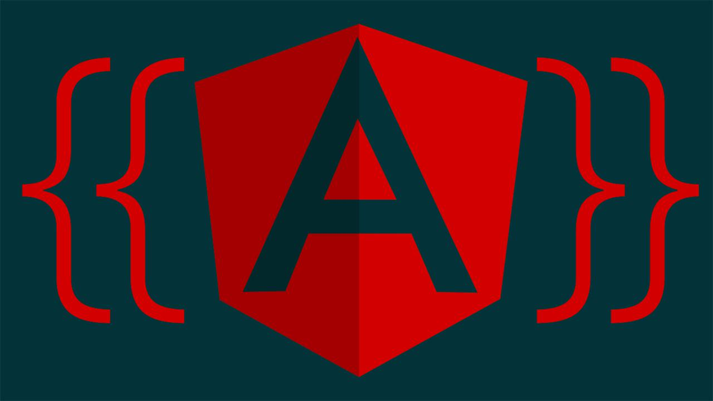
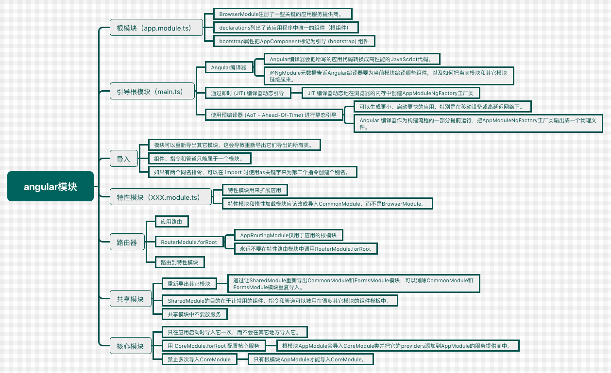

<!--more-->



## Angular模块化

Angular 模块是一个由`@NgModule`装饰器提供元数据的类，元数据包括：

- 声明哪些组件、指令、管道*属于*该模块。
- 公开某些类，以便其它的组件模板可以使用它们。
- 导入其它模块，从其它模块中获得*本*模块所需的组件、指令和管道。
- 在应用程序级提供服务，以便应用中的任何组件都能使用它。

## 应用的根模块

`BrowserModule`注册了一些关键的应用服务提供商。 它还包括了一些通用的指令，例如`NgIf`和`NgFor`，所以这些指令在该模块的任何组件模板中都是可用的。

`@NgModule.bootstrap`属性把这个`AppComponent`标记为*引导 (bootstrap) 组件*。 当 Angular 引导应用时，它会在 DOM 中渲染`AppComponent`，并把结果放进`index.html`的`<my-app>`元素标记内部。

## 引导根模块

### 通过即时 (JiT) 编译器动态引导

<p id="div-border-left-green">什么是Angular编译器？

*Angular编译器*会把我们所写的应用代码转换成高性能的JavaScript代码。 在编译过程中，`@NgModule`的元数据扮演了很重要的角色。

`@NgModule`元数据告诉*Angular编译器*要为当前模块编译哪些组件，以及如何把当前模块和其它模块链接起来。</p>

Angular 编译器在浏览器中编译并引导该应用:

```typescript
// The browser platform with a compiler
import { platformBrowserDynamic } from '@angular/platform-browser-dynamic';

// The app module
import { AppModule } from './app/app.module';

// 编译并运行模块
platformBrowserDynamic().bootstrapModule(AppModule);
```

### 使用预编译器 (AoT) 进行静态引导

静态方案可以生成更小、启动更快的应用，建议优先使用它，特别是在移动设备或高延迟网络下。

使用*静态*选项，Angular 编译器作为构建流程的一部分提前运行，生成一组类工厂。它们的核心就是`AppModuleNgFactory`。

引导预编译的`AppModuleNgFactory`的语法和动态引导`AppModule`类的方式很相似。

```typescript
// The browser platform without a compiler
import { platformBrowser } from '@angular/platform-browser';

// The app module factory produced by the static offline compiler
import { AppModuleNgFactory } from './app/app.module.ngfactory';

// Launch with the app module factory.
platformBrowser().bootstrapModuleFactory(AppModuleNgFactory);
```

由于整个应用都是预编译的，所以我们不用把 *Angular 编译器*一起发到浏览器中，也不用在浏览器中进行编译。

下载到浏览器中的应用代码比动态版本要小得多，并且能立即执行。引导的性能可以得到显著提升。

无论是 JiT 还是 AoT 编译器都会从同一份`AppModule`源码中生成一个`AppModuleNgFactory`类。 **JiT 编译器动态地在浏览器的内存中创建这个工厂类**。 **AoT 编译器把工厂输出成一个物理文件**，也就是我们在静态版本`main.ts`中导入的那个。

## 声明

自定义的组件和指令声明在模块的`declarations`中。

## 导入

`BrowserModule`导入了`CommonModule`并且[*重新导出*](https://angular.cn/docs/ts/latest/cookbook/ngmodule-faq.html#q-re-export)了它。 最终的效果是：只要导入`BrowserModule`就自动获得了`CommonModule`中的指令。

<p id="div-border-left-green">模块可以重新导出其它模块，这会导致重新导出它们导出的所有类。 纯服务类的模块不会导出任何可供其它模块使用的[可声明类](https://angular.cn/docs/ts/latest/cookbook/ngmodule-faq.html#q-declarable)，例如`HttpModule`</p>

<p id="div-border-left-red">组件、指令和管道*只能*属于一个模块。**永远不要再次声明属于其它模块的类。**</p>

如果有两个同名指令，只要在 import 时使用`as`关键字来为第二个指令创建个别名就可以了。

```typescript
import {
  HighlightDirective as ContactHighlightDirective
} from './contact/highlight.directive';
```

## 特性模块

### 特性模块

我们*引导*根模块来*启动*应用，但*导入*特性模块来*扩展*应用。特性模块可以对其它模块暴露或隐藏自己的实现。

几乎所有要在浏览器中使用的应用的**根模块**（`AppModule`）都应该从`@angular/platform-browser`中导入`BrowserModule`。

### 添加 *ContactModule*

`BrowserModule`还从`@angular/common`中重新导出了`CommonModule`，这意味着`AppModule`中的组件也同样可以访问那些每个应用都需要的Angular指令，如`NgIf`和`NgFor`。

在其它任何模块中都*不要导入*`BrowserModule`。 *特性模块*和*惰性加载模块*应该改成导入`CommonModule`。 它们需要通用的指令。它们不需要重新初始化全应用级的提供商。

## 通过路由器惰性加载模块

### 应用路由

惰性加载模块的位置是*字符串*而不是*类型*。 在本应用中，该字符串同时标记出了模块*文件*和模块*类*，两者用`#`分隔开。

```typescript
{ path: 'crisis', loadChildren: 'app/crisis/crisis.module#CrisisModule' },
{ path: 'heroes', loadChildren: 'app/hero/hero.module#HeroModule' }
```

### 路由到特性模块

当需要为根模块和特性模块分别提供不同的`导入`值时，**forRoot**和**forChild**是约定俗成的方法名。

## 共享模块

通过让`SharedModule`重新导出`CommonModule`和`FormsModule`模块，可以消除`CommonModule`和`FormsModule`模块重复导入。

<p id="div-border-left-red">不要在共享模块中把应用级单例添加到`providers`中。 否则如果一个惰性加载模块导入了此共享模块，就会导致它自己也生成一份此服务的实例。</p>

## 核心模块

把这些一次性的类收集到`CoreModule`中，并且隐藏它们的实现细节。 简化之后的根模块`AppModule`导入`CoreModule`来获取其能力。

## 用forRoot配置核心服务

模块的静态方法**forRoot**可以同时提供并配置服务。 它接收一个服务配置对象，并返回一个[ModuleWithProviders](https://angular.cn/docs/ts/latest/api/core/index/ModuleWithProviders-interface.html)。这个简单对象具有两个属性：

- `ngModule` - `CoreModule`类
- `providers` - 配置好的服务提供商

根模块`AppModule`会导入`CoreModule`类并把它的`providers`添加到`AppModule`的服务提供商中。

一个可选的、被注入的`UserServiceConfig`服务扩展核心的`UserService`服务。 如果有`UserServiceConfig`，`UserService`就会据此设置用户名。

```typescript
src/app/core/user.service.ts (constructor)

constructor(@Optional() config: UserServiceConfig) {
  if (config) { this._userName = config.userName; }
}
```

`CoreModule.forRoot`接收`UserServiceConfig`对象：

```typescript
src/app/core/core.module.ts (forRoot)

static forRoot(config: UserServiceConfig): ModuleWithProviders {
  return {
    ngModule: CoreModule,
    providers: [
      {provide: UserServiceConfig, useValue: config }
    ]
  };
}
```

在`AppModule`的`imports`*列表*中调用它:

```typescript
  imports: [
    BrowserModule,
    ContactModule,
    CoreModule.forRoot({userName: 'Miss Marple'}),
    AppRoutingModule
  ],
```

<p id="div-border-left-yellow">只在应用的根模块`AppModule`中调用`forRoot`。 如果在其它模块（特别是惰性加载模块）中调用它则违反了设计意图，并会导致运行时错误。

别忘了*导入*其返回结果，而且不要把它添加到`@NgModule`的其它任何列表中。</p>

## 禁止重复导入CoreModule

只有根模块`AppModule`才能导入`CoreModule`。 如果惰性加载模块导入了它，就会[出问题](https://angular.cn/docs/ts/latest/cookbook/ngmodule-faq.html#q-why-it-is-bad)。

如果我们错误的把`CoreModule`导入了一个惰性加载模块， `@SkipSelf`让 Angular 在其父注入器中查找`CoreModule`，这次，它的父注入器却是根注入器了。 当然，这次它找到了由根模块`AppModule`导入的实例。 该构造函数检测到存在`parentModule`，于是抛出一个错误。

```typescript
constructor (@Optional() @SkipSelf() parentModule: CoreModule) {
  if (parentModule) {
    throw new Error(
      'CoreModule is already loaded. Import it in the AppModule only');
  }
}
```

