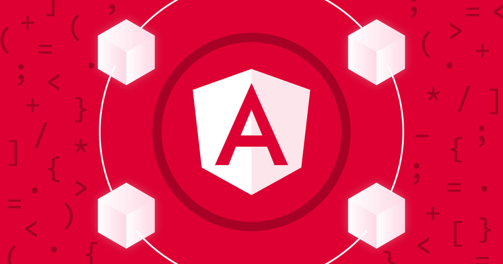
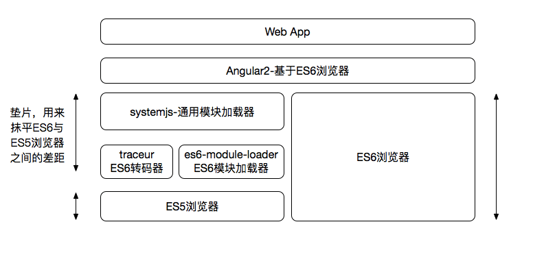
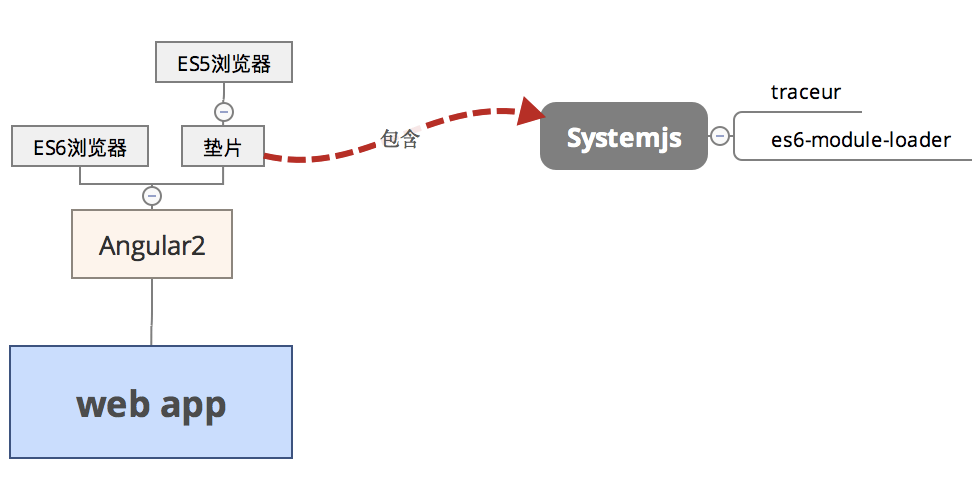
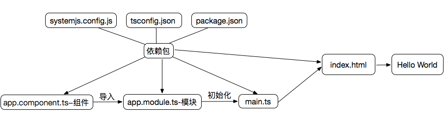
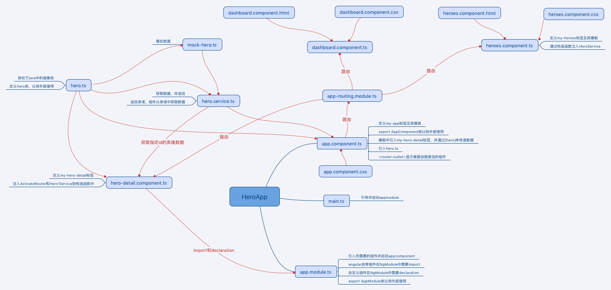

<!--more-->

## ES6工具链





- **systemjs** - 通用模块加载器，支持AMD、CommonJS、ES6等各种格式的JS模块加载
- **es6-module-loader** - ES6模块加载器，systemjs会自动加载这个模块
- **traceur** - ES6转码器，将ES6代码转换为当前浏览器支持的ES5代码。systemjs会自动加载 这个模块。

## Hello World



根据[官方文档](https://angular.cn/docs/ts/latest/quickstart.html)的快速起步，按照自己的理解画了上面的流程图（有不对的地方还请指正）。

* 包括Angular在内的Angular应用通过NgModules分成不同的代码块，需要哪个块，就import，这样可以减少文件体积。
* 每一个Angular应用都至少有一个模块和组件，组件通过与它相关的模板来控制屏幕上的一小块（视图View），main.ts负责初始化应用平台，进行应用引导。
* 为了方便测试组件，应用的引导应与组件或者模块分开，这样实现了MVM（model-view-whatever）

## Hero教程

官网的Hero教程是建立在quickstart上的，所以可以把quickstart直接拿过来用。

### 英雄编辑器

class中可以定义一些变量、方法甚至是构造函数（用于初始化），export出来的class可以被外部使用。

在Angular中`{{}}`用来取值。

一个ts文件中可以定义多个export class，但是官方不提倡。

`id:number`和`hero:Hero = {}`都是指定了变量的类型。

template中双引号改成反引号，可以写成多行形式。

表单输入双向绑定需要导入FormsModule模块，`@NgModule`中的import数组是应用中用到的外部模块列表。

用到Angular自带的模块，在import数组中声明；用到自定义的组件在declarations数组中声明。

### 主从结构

```javascript
const HEROES: Hero[] = [
  { id: 11, name: 'Mr. Nice' },
  { id: 12, name: 'Narco' },
  { id: 13, name: 'Bombasto' },
  { id: 14, name: 'Celeritas' },
  { id: 15, name: 'Magneta' },
  { id: 16, name: 'RubberMan' },
  { id: 17, name: 'Dynama' },
  { id: 18, name: 'Dr IQ' },
  { id: 19, name: 'Magma' },
  { id: 20, name: 'Tornado' }
];
```

这段代码中的const是ES6中定义变量的关键字，在ES6中， const 代表一个值的常量索引，变量名字在内存中的指针不能够改变，但是指向这个变量的值 可能 改变。例如：

```javascript
const names = [ ] ;
names . push ( “Jordan” ) ;
console . log ( names ) ;


const names = [ ] ;
names = [ ] ; // Error!
```


`*ngFor="let hero of heroes"`中`ngFor`的`*`前缀表示``及其子元素组成了一个主控模板。

`ngFor`指令在`AppComponent.heroes`属性返回的`heroes`数组上迭代，并输出此模板的实例。

引号中赋值给`ngFor`的那段文本表示“*从heroes数组中取出每个英雄，存入一个局部的hero变量，并让它在相应的模板实例中可用*”。


为一个组件指定样式时，它们的作用域将仅限于该组件。


`ngIf`指令为`false`则从 DOM 中移除整段 HTML。


`[class.selected]="hero === selectedHero"` 这个写法很有意思，`.`可以理解为css类选择器，在`class`上为`selected`类添加一个属性绑定（绑定了style中的`.selected`这个样式），当后面的表达式为true时，绑定这个样式，false时不绑定。而`[]`实现了从数据源(`hero === selectedHero`表达式)到`class`属性的单向数据流动。

### 多个组件

可以将需要多次引用的类单独写入一个ts文件中。


`<my-hero-detail [hero]="selectedHero"></my-hero-detail>`通过标签中的`[hero]="selectedHero"`可以在不同组件之间传递数据。在需要引用`hero`的地方，用`  @Input() hero: Hero;`来引入`hero`。

### 服务

当 TypeScript 看到`@Injectable()`装饰器时，就会记下本服务的元数据。 如果 Angular 需要往这个服务中注入其它依赖，就会使用这些元数据。


`HeroService`从`mock-heroes.ts`获取数据，并提供给其他组件使用。其他组件使用`HeroService`时，用构造函数定义一个私有属性，作为注入`HeroService`的靶点。

`providers`数组告诉 Angular，当它创建新的`AppComponent`组件时，也要创建一个`HeroService`的新实例。

可以把`HeroService`看做中转站，而`providers`数组告诉 Angular，这是中转站。中转站中记录着哪里的有元数据，并随时准备注入所需要的组件中。

`OnInit` 接口会在组件刚创建时、每次变化时，以及最终被销毁时被Angular调用。`OnInit` 接口中会有一个带有初始化逻辑的`ngOnInit`方法，可以用来初始化。


承诺，在有了结果时，它承诺会回调我们。 我们请求一个异步服务去做点什么，并且给它一个回调函数。 它会去做（在某个地方），一旦完成，它就会调用我们的回调函数，并通过参数把工作结果或者错误信息传给我们。


```javascript
getHeroes(): void {
  this.heroService.getHeroes().then(heroes => this.heroes = heroes);
}
```

这个方法基于承诺的，并在承诺的事情被解决时再行动。 一旦承诺的事情被成功解决，就会显示英雄数据。**then**方法把回调函数作为参数传给承诺对象。


### 路由

路由告诉路由器，当用户点击链接或者把 URL 粘贴到浏览器地址栏时，应该显示哪个视图。

路由定义包括以下部分：

- **path**: 路由器会用它来匹配浏览器地址栏中的地址，如`heroes`。
- **component**: 导航到此路由时，路由器需要创建的组件（`HeroesComponent`）。


路由有两种实现方式：

第一种是通过`RouterLink`指令，绑定到heroes的路由路径，在app.module.ts中指定了`'/heroes'`就是指向`HeroesComponent`的那个路由的路径，并且需要告诉路由把激活的组件显示在`<router-outlet>`里面。

```typescript
template: `
   <h1>{{title}}</h1>
   <a routerLink="/heroes">Heroes</a>
   <router-outlet></router-outlet>
 `
```

```typescript
@NgModule({
  imports: [
    BrowserModule,
    FormsModule,
    RouterModule.forRoot([
      {
        path: 'heroes',
        component: HeroesComponent
      }
    ])
  ],
  declarations: [
    AppComponent,
    HeroDetailComponent,
    HeroesComponent
  ],
  providers: [
    HeroService
  ],
  bootstrap: [ AppComponent ]
})
export class AppModule {
}
```

第二种是通过函数来实现，触发click事件后，调用gotoDetail函数，该函数将路由导航到detail的组件上。

```typescript
gotoDetail(): void {
  this.router.navigate(['/detail', this.selectedHero.id]);
}
```

```html
<button (click)="gotoDetail()">View Details</button>
```


浏览器启动时，在地址栏中使用的路径是`/`。如果要在应用启动的时候就显示仪表盘，而且希望在浏览器的地址栏看到一个好看的 URL，比如`/dashboard`，这就需要用到重定向：

```typescript
{
  path: '',
  redirectTo: '/dashboard',
  pathMatch: 'full'
},
```


设置`moduleId`属性到`module.id`后，才能使用templateUrl。


路径中的冒号 (:) 表示`:id`是一个占位符:

```typescript
{
  path: 'detail/:id',
  component: HeroDetailComponent
},
```

通过`[routerLink]`绑定了一个包含链接参数数组的表达式。 该数组有两个元素，目标路由和一个用来设置当前英雄的 id 值的**路由参数**。这两个元素与上面定义中的 **path** 和 **:id** 对应。

```html
<a *ngFor="let hero of heroes"  [routerLink]="['/detail', hero.id]"  class="col-1-4">
```


典型**路由模块**值得注意的有：

- 将路由抽出到一个变量中。你将来可能会导出它，而且它让**路由模块**模式更加明确。
- 添加`RouterModule.forRoot(routes)`到`imports`。
- 添加`RouterModule`到`exports`，这样关联模块的组件可以访问路由的声明，比如`RouterLink`和`RouterOutlet`。
- 无`declarations`！声明是关联模块的任务。
- 如果你有守卫服务，添加模块`providers`。


Angular路由器提供了`routerLinkActive`指令，我们可以用它来为匹配了活动路由的 HTML 导航元素自动添加一个 CSS 类。

```typescript
template: `
  <h1>{{title}}</h1>
  <nav>
    <a routerLink="/dashboard" routerLinkActive="active">Dashboard</a>
    <a routerLink="/heroes" routerLinkActive="active">Heroes</a>
  </nav>
  <router-outlet></router-outlet>
`,
```

```css
nav a.active {
  color: #039be5;
}
```


好不容易走到路由这步，我按照我的理解画了一个脑图：



### HTTP

#### 准备HTTP服务

`@angular/http`库中的`HttpModule`保存着这些 HTTP 相关服务提供商的全集。

#### 模拟web API

```typescript
// Imports for loading & configuring the in-memory web api
import { InMemoryWebApiModule } from 'angular-in-memory-web-api';
import { InMemoryDataService }  from './in-memory-data.service';
```

`InMemoryWebApiModule`将`Http`客户端默认的后端服务替换成了*内存 Web API*服务。

```typescript
InMemoryWebApiModule.forRoot(InMemoryDataService),
```

`forRoot`配置方法需要`InMemoryDataService`类实例，用来向内存数据库填充数据。

#### 英雄与HTTP

```typescript
  private heroesUrl = 'app/heroes';  // URL to web api

  constructor(private http: Http) { }

  getHeroes(): Promise<Hero[]> {
    return this.http.get(this.heroesUrl)
               .toPromise()
               .then(response => response.json().data as Hero[])
               .catch(this.handleError);
  }
```

##### HTTP承诺

Angular 的`http.get`返回一个**RxJS**的`Observable`对象。 *Observable（可观察对象）*是一个管理异步数据流的强力方式。 

```typescript
.toPromise()
```

利用`toPromise`操作符把`Observable`直接转换成`Promise`对象。Angular 的`Observable`并没有一个`toPromise`操作符，需要从 RxJS 库中导入它们。

```typescript
import 'rxjs/add/operator/toPromise';
```

##### 在*then* 回调中提取出数据

```typescript
.then(response => response.json().data as Hero[])
```

在 *promise* 的`then`回调中，调用 HTTP 的`Reponse`对象的`json`方法，以提取出其中的数据。

##### 错误处理

```typescript
.catch(this.handleError);
```

```typescript
private handleError(error: any): Promise<any> {
  console.error('An error occurred', error); // for demo purposes only
  return Promise.reject(error.message || error);
}
```

`catch`了服务器的失败信息，并把它们传给了错误处理器

#### 更新英雄详情

##### hero服务的update方法

```typescript
private headers = new Headers({'Content-Type': 'application/json'});

update(hero: Hero): Promise<Hero> {
  const url = `${this.heroesUrl}/${hero.id}`;
  return this.http
    .put(url, JSON.stringify(hero), {headers: this.headers})
    .toPromise()
    .then(() => hero)
    .catch(this.handleError);
}
```

通过一个编码在 URL 中的英雄 id 来告诉服务器应该更新哪个英雄。put 的 body 是该英雄的 JSON 字符串，它是通过调用`JSON.stringify`得到的。 并且在请求头中标记出的 body 的内容类型（`application/json`）。

#### 添加英雄

```typescript
<div>
  <label>Hero name:</label> <input #heroName />
  <button (click)="add(heroName.value); heroName.value=''">
    Add
  </button>
</div>

  add(name: string): void {
  name = name.trim();
  if (!name) { return; }
  this.heroService.create(name)
    .then(hero => {
      this.heroes.push(hero);
      this.selectedHero = null;
    });
}
```

当指定的名字不为空的时候，点击处理器就会委托 hero 服务来创建一个具有此名字的英雄， 并把这个新的英雄添加到数组中。

#### 删除一个英雄

```typescript
  <li *ngFor="let hero of heroes" (click)="onSelect(hero)"
      [class.selected]="hero === selectedHero">
    <span class="badge">{{hero.id}}</span>
    <span>{{hero.name}}</span>
    <button class="delete"
      (click)="delete(hero); $event.stopPropagation()">x</button>
  </li>
```

`delete`按钮的点击处理器应该阻止点击事件向上冒泡 ，否则它会选中我们要删除的这位英雄。

#### 可观察对象 (Observable)

一个*可观察对象*是一个事件流，我们可以用数组型操作符来处理它。

把`Observable`转换成了`Promise`通常是更好地选择，我们通常会要求`http.get`获取单块数据。只要接收到数据，就算完成。 使用承诺这种形式的结果是让调用方更容易写，并且承诺已经在 JavaScript 程序员中被广泛接受了。

##### 按名搜索

```typescript
import { Injectable }     from '@angular/core';
import { Http, Response } from '@angular/http';
import { Observable } from 'rxjs';
import { Hero }           from './hero';
@Injectable()
export class HeroSearchService {
  constructor(private http: Http) {}
  search(term: string): Observable<Hero[]> {
    return this.http
               .get(`app/heroes/?name=${term}`)
               .map((r: Response) => r.json().data as Hero[]);
  }
}
```

不再调用`toPromise`，而是直接返回*可观察对象*。

##### HeroSearchComponent

```html
<div id="search-component">
  <h4>Hero Search</h4>
  <input #searchBox id="search-box" (keyup)="search(searchBox.value)" />
  <div>
    <div *ngFor="let hero of heroes | async"
         (click)="gotoDetail(hero)" class="search-result" >
      {{hero.name}}
    </div>
  </div>
</div>
```

`heroes`属性现在是英雄列表的`Observable`对象，而不再只是英雄数组。 `*ngFor`不能用可观察对象做任何事，除非我们在它后面跟一个`async` pipe (`AsyncPipe`)。 这个`async`管道会订阅到这个可观察对象，并且为`*ngFor`生成一个英雄数组。

```typescript
import { Component, OnInit } from '@angular/core';
import { Router }            from '@angular/router';
import { Observable }        from 'rxjs/Observable';
import { Subject }           from 'rxjs/Subject';
import { HeroSearchService } from './hero-search.service';
import { Hero } from './hero';
@Component({
  moduleId: module.id,
  selector: 'hero-search',
  templateUrl: 'hero-search.component.html',
  styleUrls: [ 'hero-search.component.css' ],
  providers: [HeroSearchService]
})
export class HeroSearchComponent implements OnInit {
  heroes: Observable<Hero[]>;
  private searchTerms = new Subject<string>();
  constructor(
    private heroSearchService: HeroSearchService,
    private router: Router) {}
  // Push a search term into the observable stream.
  search(term: string): void {
    this.searchTerms.next(term);
  }
  ngOnInit(): void {
    this.heroes = this.searchTerms
      .debounceTime(300)        // wait for 300ms pause in events
      .distinctUntilChanged()   // ignore if next search term is same as previous
      .switchMap(term => term   // switch to new observable each time
        // return the http search observable
        ? this.heroSearchService.search(term)
        // or the observable of empty heroes if no search term
        : Observable.of<Hero[]>([]))
      .catch(error => {
        // TODO: real error handling
        console.log(error);
        return Observable.of<Hero[]>([]);
      });
  }
  gotoDetail(hero: Hero): void {
    let link = ['/detail', hero.id];
    this.router.navigate(link);
  }
}
```

###### 搜索词

```typescript
private searchTerms = new Subject<string>();

// Push a search term into the observable stream.
search(term: string): void {
  this.searchTerms.next(term);
}
```

`Subject`（主题）是一个*可观察的*事件流中的生产者。 `searchTerms`生成一个产生字符串的`Observable`，用作按名称搜索时的过滤条件。

每当调用`search`时都会调用`next`来把新的字符串放进该主题的*可观察*流中。

###### 初始化 **HEROES** 属性(**NGONINIT**)

```typescript
heroes: Observable<Hero[]>;

ngOnInit(): void {
  this.heroes = this.searchTerms
    .debounceTime(300)        // wait for 300ms pause in events
    .distinctUntilChanged()   // ignore if next search term is same as previous
    .switchMap(term => term   // switch to new observable each time
      // return the http search observable
      ? this.heroSearchService.search(term)
      // or the observable of empty heroes if no search term
      : Observable.of<Hero[]>([]))
    .catch(error => {
      // TODO: real error handling
      console.log(error);
      return Observable.of<Hero[]>([]);
    });
}
```

`Subject`也是一个`Observable`对象。 要把搜索词的流转换成`Hero`数组的流，并把结果赋值给`heroes`属性。

如果我们直接把每一次用户按键都直接传给`HeroSearchService`，就会发起一场 HTTP 请求风暴。我们不希望占用服务器资源，也不想耗光蜂窝移动网络的流量。

幸运的是，我们可以在字符串的`Observable`后面串联一些`Observable`操作符，来归并这些请求。 我们将对`HeroSearchService`发起更少的调用，并且仍然获得足够及时的响应。做法如下：

- 在传出最终字符串之前，`debounceTime(300)`将会等待，直到新增字符串的事件暂停了 300 毫秒。 我们实际发起请求的间隔永远不会小于 300ms。
- `distinctUntilChanged`确保只在过滤条件变化时才发送请求， 这样就不会重复请求同一个搜索词了。
- `switchMap`会为每个从`debounce`和`distinctUntilChanged`中通过的搜索词调用搜索服务。 它会取消并丢弃以前的搜索可观察对象，只保留最近的。

<p id="div-border-left-green">[switchMap操作符](https://github.com/Reactive-Extensions/RxJS/blob/master/doc/api/core/operators/flatmaplatest.md) (以前叫"flatMapLatest")是非常智能的。

每次符合条件的按键事件都会触发一次对`http`方法的调用。即使在发送每个请求前都有 300 毫秒的延迟， 我们仍然可能同时拥有多个在途的 HTTP 请求，并且它们返回的顺序未必就是发送时的顺序。

`switchMap`保留了原始的请求顺序，并且只返回最近一次 `http` 调用返回的可观察对象。 这是因为以前的调用都被取消或丢弃了。

如果搜索框为空，我们还可以短路掉这次`http`方法调用，并且直接返回一个包含空数组的可观察对象。

注意，*取消*`HeroSearchService`的可观察对象并不会实际中止 (abort) 一个未完成的 HTTP 请求， 除非服务支持这个特性，这个问题我们以后再讨论。 目前我们的做法只是丢弃不希望的结果。</p>

##### 导入RxJS操作符

```typescript
// Observable class extensions
import 'rxjs/add/observable/of';
import 'rxjs/add/observable/throw';

// Observable operators
import 'rxjs/add/operator/catch';
import 'rxjs/add/operator/debounceTime';
import 'rxjs/add/operator/distinctUntilChanged';
import 'rxjs/add/operator/do';
import 'rxjs/add/operator/filter';
import 'rxjs/add/operator/map';
import 'rxjs/add/operator/switchMap';
```

把整个应用中要用的那些 RxJS `Observable`扩展组合在一起，放在一个单独的 RxJS 导入文件中。我们在顶级的`AppModule`中导入`rxjs-extensions`就可以一次性加载它们。

```typescript
import './rxjs-extensions';
```


