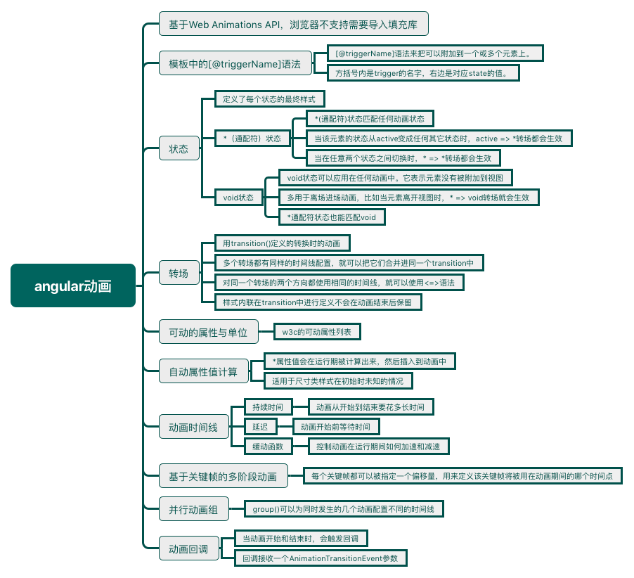

<!--more-->



<p style="border-left: 4px solid green; padding: 10px;">Angular动画是基于标准的[Web动画API(Web Animations API)](https://w3c.github.io/web-animations/)构建的，它们在[支持此API的浏览器中](http://caniuse.com/#feat=web-animation)会用原生方式工作。

至于其它浏览器，就需要一个填充库(polyfill)了。你可以[从这里获取`web-animations.min.js`](https://github.com/web-animations/web-animations-js)，并把它加入你的页面中。</p>

## 快速起步范例：在两个状态间转场

引入与动画相关的函数：

```typescript
import { Component,Input,trigger,state,style,transition,animate,group} from '@angular/core';
```

<p style="border-left: 4px solid red; padding: 10px;">在Angular刚刚发布的4.0版本中，动画已经从`@angular/core`中拆分出来。</p>

```typescript
  animations: [
    trigger('heroState', [
      state('inactive', style({
        backgroundColor: '#eee',
        transform: 'scale(1)'
      })),
      state('active',   style({
        backgroundColor: '#cfd8dc',
        transform: 'scale(1.1)'
      })),
      transition('inactive => active', animate('100ms ease-in')),
      transition('active => inactive', animate('100ms ease-out'))
    ])
  ]
```

```typescript
template: `
  <ul>
    <li *ngFor="let hero of heroes"
        [@heroState]="hero.state"	<!--方括号内是trigger的名字，右边是state对应state的值。-->
        (click)="hero.toggleState()">
      {{hero.name}}
    </li>
  </ul>
`,
```

定义的动画可以在模板中用`[@triggerName]`语法来把它附加到一个或多个元素上。然后把`@triggerName`属性(Attribute)的值设置成表达式`hero.state`。这个值应该或者是`inactive`或者是`active`。

## 状态与转场

Angular动画=**状态**+**状态之间的转场效果**。

状态表现为上面代码中`active`和`inactive`这两种状态，它定义了每个状态的最终样式。一旦元素转场到那个状态，该样式就会被应用到此元素上，**当它留在此状态时**，这些样式也会一直保持着。

转场表现为上面代码中用` transition()`定义的转换时的动画，每个转场都会控制一条在一组样式和下一组样式之间切换的时间线。

如果多个转场都有同样的时间线配置，就可以把它们合并进同一个`transition`定义中：

```typescript
transition('inactive => active, active => inactive，focus => infocus',
 animate('100ms ease-out'))
```

如果要对同一个转场的两个方向都使用相同的时间线（就像前面的例子中那样），就可以使用`<=>`这种简写语法：

```typescript
transition('inactive <=> active', animate('100ms ease-out'))
```

有时希望一些样式只在动画期间生效，但在结束后并不保留它们。这时可以把这些样式内联在`transition`中进行定义。只有定义在`state`中的样式在转场结束后才能保留。

```typescript
transition('inactive => active', [
  style({							//activey样式
    backgroundColor: '#cfd8dc',
    transform: 'scale(1.3)'
  }),
  animate('80ms ease-in', style({	//inactive样式
    backgroundColor: '#eee',
    transform: 'scale(1)'
  }))
]),
```

### *（通配符）状态

`*`(通配符)状态匹配**任何**动画状态。当定义那些不需要管当前处于什么状态的样式及转场时，这很有用。比如：

- 当该元素的状态从`active`变成任何其它状态时，`active => *`转场都会生效。
- 当在*任意*两个状态之间切换时，`* => *`转场都会生效。

### void状态

`void`状态可以应用在任何动画中。它表示元素**没有**被附加到视图。这种情况可能是由于它尚未被添加进来或者已经被移除了。 `void`状态在定义“进场”和“离场”的动画时会非常有用。

比如当一个元素离开视图时，`* => void`转场就会生效，而不管它在离场以前是什么状态。

`*`通配符状态也能匹配`void`。

## 例子：进场与离场

```typescript
animations: [
  trigger('flyInOut', [
    state('in', style({transform: 'translateX(0)'})),
    transition('void => *', [
      style({transform: 'translateX(-100%)'}),//void状态的style
      animate(100)
    ]),
    transition('* => void', [
      animate(100, style({transform: 'translateX(100%)'}))//void状态的style
    ])
  ])
]
```

没有一个单独的`state(void)`定义是因为希望在进场与离场时使用不一样的转换效果：元素从左侧进场，从右侧离开。

<p style="border-left: 4px solid yellow; padding: 10px;">这两个动画有自己的名字：

```typescript
transition(':enter', [ ... ]); // void => *
transition(':leave', [ ... ]); // * => void
```

</p>

## 范例：从不同的状态下进场和离场

- 非激活英雄进场：`void => inactive`
- 激活英雄进场：`void => active`
- 非激活英雄离场：`inactive => void`
- 激活英雄离场：`active => void`

```typescript
animations: [
  trigger('heroState', [
    state('inactive', style({transform: 'translateX(0) scale(1)'})),
    state('active',   style({transform: 'translateX(0) scale(1.1)'})),
    transition('inactive => active', animate('100ms ease-in')),
    transition('active => inactive', animate('100ms ease-out')),
    transition('void => inactive', [
      style({transform: 'translateX(-100%) scale(1)'}),
      animate(100)
    ]),
    transition('inactive => void', [
      animate(100, style({transform: 'translateX(100%) scale(1)'}))
    ]),
    transition('void => active', [
      style({transform: 'translateX(0) scale(0)'}),
      animate(200)
    ]),
    transition('active => void', [
      animate(200, style({transform: 'translateX(0) scale(0)'}))
    ])
  ])
]
```

## 可动的属性与单位

参见w3c的 [“可动”属性列表](https://www.w3.org/TR/css3-transitions/#animatable-properties)。在`style()`中可以定义多个属性，实现同一时间段多个动画。

## 自动属性值计算

`*`属性值会在运行期被计算出来，然后插入到这个动画中。适用于尺寸类样式在初始时未知的情况。

```typescript
animations: [
  trigger('shrinkOut', [
    state('in', style({height: '*'})),//取得该元素在离场前的高度
    transition('* => void', [	//此处的*表示通配符状态
      style({height: '*'}), 
      animate(250, style({height: 0})) //用动画转场到0高度
    ])
  ])
]
```

## 动画时间线

对每一个动画转场效果，有三种时间线属性可以调整：持续时间(duration)、延迟(delay)和缓动(easing)函数。它们被合并到了一个单独的**转场时间线字符串**。

### 持续时间

持续时间控制动画从开始到结束要花多长时间。

单独一个数字，默认单位是ms。用字符串可以定义单位。

### 延迟

延迟控制的是在动画已经触发但尚未真正开始转场之前要等待多久。它位于字符串中的持续时间后面。

### 缓动函数

[缓动函数](http://easings.net/)用于控制动画在运行期间如何加速和减速（可以参考《css揭秘》第八章对缓动函数的讲解）。

### 例子

```typescript
animations: [
  trigger('flyInOut', [
    state('in', style({opacity: 1, transform: 'translateX(0)'})),
    transition('void => *', [
      style({
        opacity: 0,
        transform: 'translateX(-100%)'
      }),
      animate('0.2s ease-in')
    ]),
    transition('* => void', [
      animate('0.2s 10 ease-out', style({
        opacity: 0,
        transform: 'translateX(100%)'
      }))
    ])
  ])
]
```

## 基于关键帧的多阶段动画

每个关键帧都可以被指定一个*偏移量*，用来定义该关键帧将被用在动画期间的哪个时间点。偏移量是一个介于0(表示动画起点)和1(表示动画终点)之间的相对值（百分比）。如果省略它们，偏移量会自动根据帧数平均分布出来。例如，三个未定义过偏移量的关键帧会分别获得偏移量：`0`、`0.5`和`1`。

```typescript
animations: [
  trigger('flyInOut', [
    state('in', style({transform: 'translateX(0)'})),
    transition('void => *', [
      animate(300, keyframes([
        style({opacity: 0, transform: 'translateX(-100%)', offset: 0}),
        style({opacity: 1, transform: 'translateX(15px)',  offset: 0.3}),
        style({opacity: 1, transform: 'translateX(0)',     offset: 1.0})
      ]))
    ]),
    transition('* => void', [
      animate(300, keyframes([
        style({opacity: 1, transform: 'translateX(0)',     offset: 0}),
        style({opacity: 1, transform: 'translateX(-15px)', offset: 0.7}),
        style({opacity: 0, transform: 'translateX(100%)',  offset: 1.0})
      ]))
    ])
  ])
]
```

## 并行动画组

`group()`可以为同时发生的几个动画配置不同的**时间线**。

下面代码中，同时在进场和离场时使用了`group()`，以便能让它们使用两种不同的时间线配置（一个动画组对元素的`transform`和`width`做动画，另一个组则对`opacity`做动画）。 它们被同时应用到同一个元素上，但又彼此独立运行：

```typescript
animations: [
  trigger('flyInOut', [
    state('in', style({width: 120, transform: 'translateX(0)', opacity: 1})),
    transition('void => *', [
      style({width: 10, transform: 'translateX(50px)', opacity: 0}),
      group([
        animate('0.3s 0.1s ease', style({
          transform: 'translateX(0)',
          width: 120
        })),
        animate('0.3s ease', style({
          opacity: 1
        }))
      ])
    ]),
    transition('* => void', [
      group([
        animate('0.3s ease', style({
          transform: 'translateX(50px)',
          width: 10
        })),
        animate('0.3s 0.2s ease', style({
          opacity: 0
        }))
      ])
    ])
  ])
]
```

## 动画回调

当动画开始和结束时，会触发一个回调。

对于例子中的这个关键帧，有一个叫做`@flyInOut`的`trigger`。在那里我们可以挂钩到那些回调，比如：

```typescript
import {
  Component,
  Input,
  trigger,
  state,
  style,
  animate,
  transition,
  keyframes,
  AnimationTransitionEvent
} from '@angular/core';

import { Heroes } from './hero.service';

@Component({
  moduleId: module.id,
  selector: 'hero-list-multistep',
  template: `
    <ul>
      <li *ngFor="let hero of heroes"
          (@flyInOut.start)="animationStarted($event)"
          (@flyInOut.done)="animationDone($event)"
          [@flyInOut]="'in'">
        {{hero.name}}
      </li>
    </ul>
  `,
  styleUrls: ['./hero-list.component.css'],
  animations: [
    trigger('flyInOut', [
      state('in', style({transform: 'translateX(0)'})),
      transition('void => *', [
        animate(300, keyframes([
          style({opacity: 0, transform: 'translateX(-100%)', offset: 0}),
          style({opacity: 1, transform: 'translateX(15px)',  offset: 0.3}),
          style({opacity: 1, transform: 'translateX(0)',     offset: 1.0})
        ]))
      ]),
      transition('* => void', [
        animate(300, keyframes([
          style({opacity: 1, transform: 'translateX(0)',     offset: 0}),
          style({opacity: 1, transform: 'translateX(-15px)', offset: 0.7}),
          style({opacity: 0, transform: 'translateX(100%)',  offset: 1.0})
        ]))
      ])
    ])
  ]
})
export class HeroListMultistepComponent {
  @Input() heroes: Heroes;

  animationStarted(event: AnimationTransitionEvent) {
    console.warn('Animation started: ', event);
  }

  animationDone(event: AnimationTransitionEvent) {
    console.warn('Animation done: ', event);
  }
}
```

这些回调接收一个`AnimationTransitionEvent`参数，它包含一些有用的属性，例如`fromState`，`toState`和`totalTime`。

无论动画是否实际执行过，那些回调都会触发。


