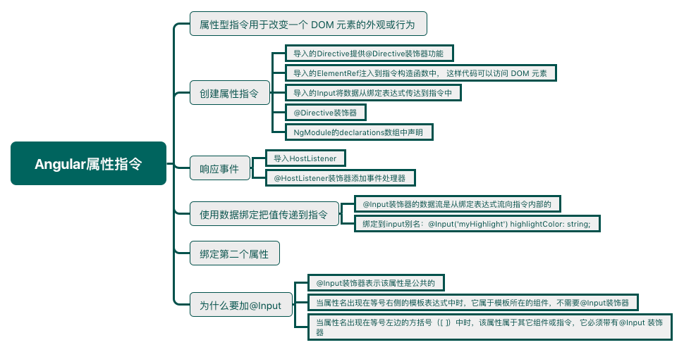

<!--more-->



**属性**型指令用于改变一个 DOM 元素的外观或行为。

## 指令概览

在 Angular 中有三种类型的指令：

1. 组件 — 拥有模板的指令
2. 结构型指令 — 通过添加和移除DOM元素改变DOM布局的指令，如`NgFor`和`NgIf`
3. 属性型指令 — 改变元素显示和行为的指令，例如`NgStyle`

## 创建一个简单的属性型指令

属性型指令至少需要一个带有`@Directive`装饰器的控制器类。该装饰器指定了一个用于标识属性的选择器。

### 编写指令代码

```typescript
import { Directive, ElementRef, Input } from '@angular/core';
@Directive({ selector: '[myHighlight]' })
export class HighlightDirective {
    constructor(el: ElementRef) {
       el.nativeElement.style.backgroundColor = 'yellow';
    }
}
```

- `Directive`提供`@Directive`装饰器功能。
- `ElementRef`注入到指令构造函数中。 这样代码可以访问 DOM 元素。
- `Input`将数据从绑定表达式传达到指令中。

`@Directive`装饰器需要一个 CSS 选择器，以便从模板中识别出关联到这个指令的 HTML。

Angular 会为每个匹配的元素创建一个指令控制器类的实例，并把 Angular 的`ElementRef`和`Renderer`注入进构造函数。 `ElementRef`是一个服务，它赋予我们通过它的`nativeElement`属性直接访问 DOM 元素的能力。[Renderer](https://angular.io/docs/ts/latest/api/core/index/Renderer2-class.html)服务允许通过代码设置元素的样式。

## 使用属性型指令

```html
<p myHighlight>Highlight me!</p>
```

添加了一个`import`语句来获得`Highlight`指令类，并把这个类添加到 `NgModule`元数据的`declarations`数组中:

```typescript
import { NgModule } from '@angular/core';
import { BrowserModule } from '@angular/platform-browser';
import { AppComponent } from './app.component';
import { HighlightDirective } from './highlight.directive';
@NgModule({
  imports: [ BrowserModule ],
  declarations: [
    AppComponent,
    HighlightDirective
  ],
  bootstrap: [ AppComponent ]
})
export class AppModule { }
```

## 响应用户引发的事件

<p id="div-border-left=red">可以通过标准的JavaScript方式手动给宿主 DOM 元素附加一个事件监听器。 但这种方法至少有三个问题：

1. 必须正确的书写事件监听器。
2. 当指令被销毁的时候，必须拆卸事件监听器，否则会导致内存泄露。
3. 必须直接和 DOM API 打交道，应该避免这样做。</p>

在Angular中需要用先引入`HostListener`，因为需要用到`HostListener`装饰器添加两个事件处理器，它们会在鼠标进入或离开时进行响应，这些处理器委托给了一个辅助方法，它用于为DOM元素设置颜色，就是你在构造器中声明和初始化过的`el`：

```typescript
import { Directive, ElementRef, HostListener, Input } from '@angular/core';
@Directive({
  selector: '[myHighlight]'
})
export class HighlightDirective {
  constructor(private el: ElementRef) { }
  @HostListener('mouseenter') onMouseEnter() {
    this.highlight('yellow');
  }
  @HostListener('mouseleave') onMouseLeave() {
    this.highlight(null);
  }
  private highlight(color: string) {
    this.el.nativeElement.style.backgroundColor = color;
  }
}
```

## 使用数据绑定向指令传递值

### 绑定到@Input属性

`@Input`装饰器的数据流是从绑定表达式流向指令内部的。

```typescript
@Input() myHighlight: string;
```

```html
<p [myHighlight]="color">Highlight me!</p>
```

```typescript
export class AppComponent {
  color = 'yellow';
}
```

### 绑定到*@Input*别名

可以随意命名该指令的属性，并且**给它指定一个用于绑定的别名**：

```typescript
@Input('myHighlight') highlightColor: string;
```

在指令内部，该属性叫`highlightColor`，在外部，当我们绑定到它时，它叫`myHighlight`。

## 绑定到第二个属性

把第二个名叫`defaultColor`的**输入**属性添加到`HighlightDirective`中：

```typescript
@Input() defaultColor: string;
```

修改该指令的`onMouseEnter`，让它首先尝试使用`highlightColor`进行高亮，然后用`defaultColor`，如果它们都没有指定，那就用红色作为后备。

```typescript
@HostListener('mouseenter') onMouseEnter() {
  this.highlight(this.highlightColor || this.defaultColor || 'red');
}
```

像组件一样，你也可以绑定到指令的很多属性，只要把它们依次写在模板中就行了:

```html
<p [myHighlight]="color" defaultColor="black">
  Highlight me too!
</p>
```

Angular之所以知道`defaultColor`绑定属于`HighlightDirective`，是因为已经通过`@Input`装饰器把它设置成了*公共*属性。

## 为什么要加@Input

`@Input`装饰器都告诉Angular，该属性是*公共的*，并且能被父组件绑定。 如果没有`@Input`，Angular就会拒绝绑定到该属性。

 Angular把组件的模板看做*从属于*该组件的。 组件和它的模板默认会相互信任。 这也就是意味着，组件自己的模板可以绑定到组件的*任意*属性，无论是否使用了`@Input`装饰器。

但组件或指令不应该盲目的信任其它组件或指令。 因此组件或指令的属性默认是不能被绑定的。 从Angular绑定机制的角度来看，它们是*私有*的，而当添加了`@Input`时，它们变成了*公共*的 只有这样，它们才能被其它组件或属性绑定。

可以根据属性名在绑定中出现的位置来判定是否要加`@Input`。

- 当属性名出现在等号**右侧**的模板表达式中时，它属于模板所在的组件，不需要`@Input`装饰器。
- 当属性名出现在等号**左边**的**方括号（[ ]）**中时，该属性属于*其它*组件或指令，它必须带有`@Input` 装饰器。
