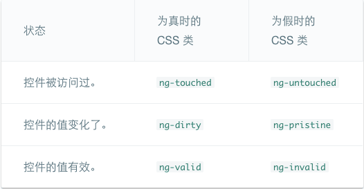

<!--more-->

## 根模块

### import数组

```typescript
import { NgModule }      from '@angular/core';
import { BrowserModule } from '@angular/platform-browser';	//必须要有
import { AppComponent }  from './app.component';

@NgModule({
  imports:      [ BrowserModule ],
  declarations: [ AppComponent ],
  bootstrap:    [ AppComponent ]
})
export class AppModule { }

```

Angular 模块的`imports`数组与文件顶部的`import`语句功能是不同的。

**JavaScript** 的`import`声明允许你访问在其他文件中**导出**的符号，这样你可以在**当前**文件引用它们。 它们与 Angular 毫无关系，Angular 对它们也一无所知。

**模块**的`imports`数组声明的组件模板需要的类所在的其它模块（引入所需的其他模块的组件模板），告诉 Angular 特定 Angular 模块的信息 — 用`@NgModule`装饰的类 — 应用需要它们来正常工作。

### declarations数组

声明**本模块**中拥有的**视图类**（**组件**、**指令**和**管道**）。

### bootstrap数组

引导根模块来启动应用，数组中的组件是插入到浏览器的**DOM**中的。

每个被引导的组件都是它自己的组件树的根。 插入一个被引导的组件通常触发一系列组件的创建并形成组件树。

### 在main.ts中引导

```typescript
import { platformBrowserDynamic } from '@angular/platform-browser-dynamic';
import { AppModule }              from './app.module';

platformBrowserDynamic().bootstrapModule(AppModule);
```

通过动态 (JiT) 编译创建浏览器平台来引导根模块。根模块调用组件，插入到组件选择器中。

## 显示数据

### 使用插值表达式显示组件属性

通过插值表达式 (interpolation) 来绑定属性名。要使用插值表达式，就把属性名包裹在双花括号里放进视图模板。

Angular 在`index.html`中查找一个`<my-app>`元素， 然后实例化一个`AppComponent`，并将其渲染到`<my-app>`标签中。不需要通过new来实例化`AppComponent`类。

通过构造函数来声明和初始化属性。

### 使用**ngFor**显示数组属性

`ngFor`用于显示一个“数组”， 但`ngFor`可以为任何可迭代的 (iterable)对象重复渲染条目。

**应用代码最好不要直接在组件内部直接定义数据**。用一个 TypeScript 类来为我们的组件描述**模型数据**并显示模型的属性。

```typescript
export class Hero {
  constructor(
    public id: number,
    public name: string) { }
}
```

```typescript
heroes = [
  new Hero(1, 'Windstorm'),
  new Hero(13, 'Bombasto'),
  new Hero(15, 'Magneta'),
  new Hero(20, 'Tornado')
];
myHero = this.heroes[0];
```

### 通过 NgIf 进行条件显示

`NgIf`中Angular 并不是在显示和隐藏这条消息，它是在从 DOM 中添加和移除这个段落元素。 

## 用户输入

### 绑定到用户输入事件

使用Angular 事件绑定机制来响应任何 DOM 事件。要绑定 DOM 事件，只要把 DOM 事件的名字包裹在圆括号中，然后用放在引号中的模板语句对它赋值就可以了。

### 通过 $event 对象取得用户输入（不推荐）

下面的代码监听`keyup`事件，并将整个事件载荷 (`$event`) 传递给组件的事件处理器。当用户按下并释放一个按键时，触发`keyup`事件，Angular 在`$event`变量提供一个相应的 DOM 事件对象，上面的代码将它作为参数传递给`onKey()`方法。

```typescript
template: `
  <input (keyup)="onKey($event)">
  <p>{ {values} }</p>
`
```

```typescript
export class KeyUpComponent_v1 {
  values = '';

  onKey(event:any) { // without type info
    this.values += event.target.value + ' | ';
  }
}
```

`$event`对象的属性取决于 DOM 事件的类型。所有标准 DOM 事件对象都有一个`target`属性， 引用**触发该事件的元素**。 在本例中，`target`是`<input>`元素， `value.target.value`返回该元素的当前内容。

`event.key`可以用来记录每次按键本身。


`$event`的类型是`KeyboardEvent`。 不是所有的元素都有`value`属性，所以它将`target`转换为输入元素。 `OnKey`方法更加清晰的表达了它期望从模板得到什么，以及它是如何解析事件的。

```typescript
export class KeyUpComponent_v1 {
  values = '';

  onKey(event: KeyboardEvent) { // with type info
    this.values += (<HTMLInputElement>event.target).value + ' | ';
  }
}
```

传入 *$event* 是靠不住的做法，反对把整个 DOM 事件传到方法中，因为这样组件会知道太多模板的信息。 只有当它知道更多它本不应了解的 HTML 实现细节时，它才能提取信息。 这就违反了模板（**用户看到的**）和组件（**应用如何处理用户数据**）之间的分离关注原则。(事件一定要定义类型)。

### 从一个模板引用变量中获得用户输入

使用 Angular 的**模板引用变量**。 这些变量提供了从模块中直接访问元素的能力。 在标识符前加上井号 (#) 就能声明一个模板引用变量。

```typescript
@Component({
  selector: 'loop-back',
  template: `
    <input #box (keyup)="0">	//(keyup)="0"可以当成将keyup事件初始化
    <p>{ {box.value} }</p>
  `
})
export class LoopbackComponent { }
```

这个模板引用变量名叫`box`，在`<input>`元素声明，它引用`<input>`元素本身。 代码使用`box`获得输入元素的`value`值，并通过插值表达式把它显示在`<p>`标签中。

这个模板完全是完全自包含的。它没有绑定到组件，组件也没做任何事情。

只有在应用做了些异步事件（如击键），Angular 才更新绑定（并最终影响到屏幕）。

本例代码将`keyup`事件绑定到了数字0，这是可能是最短的模板语句。 虽然这个语句不做什么，但它满足 Angular 的要求，所以 Angular 将更新屏幕。

```typescript
@Component({
  selector: 'key-up2',
  template: `
    <input #box (keyup)="onKey(box.value)">
    <p>{ {values} }</p>
  `
})
export class KeyUpComponent_v2 {
  values = '';
  onKey(value: string) {
    this.values += value + ' | ';
  }
}
```

组件代码从视图中获得了干净的数据值。再也不用了解`$event`变量及其结构了。

### 按键事件过滤（通过`key.enter`）

`(keyup)`事件处理器监听*每一次按键*。 有时只在意*回车*键，因为它标志着用户结束输入。 解决这个问题的一种方法是检查每个`$event.keyCode`，只有键值是*回车*键时才采取行动。

更简单的方法是：绑定到 Angular 的`keyup.enter` 模拟事件。 然后，只有当用户敲*回车*键时，Angular 才会调用事件处理器。

```typescript
@Component({
  selector: 'key-up3',
  template: `
    <input #box (keyup.enter)="onEnter(box.value)">
    <p>{ {value} }</p>
  `
})
export class KeyUpComponent_v3 {
  value = '';
  onEnter(value: string) { this.value = value; }
}
```

### 失去焦点事件 (blur)

```typescript
@Component({
  selector: 'key-up4',
  template: `
    <input #box
      (keyup.enter)="update(box.value)"
      (blur)="update(box.value)">	//监听失去焦点事件

    <p>{ {value} }</p>
  `
})
export class KeyUpComponent_v4 {
  value = '';
  update(value: string) { this.value = value; }
}
```

### 小结

```typescript
@Component({
  selector: 'little-tour',
  template: `
    <input #newHero
      (keyup.enter)="addHero(newHero.value)"
      (blur)="addHero(newHero.value); newHero.value='' ">

    <button (click)=addHero(newHero.value)>Add</button>

    <ul><li *ngFor="let hero of heroes">{ {hero} }</li></ul>
  `
})
export class LittleTourComponent {
  heroes = ['Windstorm', 'Bombasto', 'Magneta', 'Tornado'];
  addHero(newHero: string) {
    if (newHero) {
      this.heroes.push(newHero);
    }
  }
}
```

- **使用模板变量来引用元素** — `newHero`模板变量引用了`<input>`元素。 你可以在`<input>`的任何兄弟或子级元素中引用`newHero`。
- **传递数值，而非元素** — 获取输入框的值并将*它*传递给组件的`addHero`，而不要传递`newHero`。
- **保持模板语句简单** — `(blur)`事件被绑定到两个 JavaScript 语句。 第一句调用`addHero`。第二句`newHero.value=''`在添加新英雄到列表中后清除输入框。

## 表单

### 创建 Hero 模型类

```typescript
export class Hero {
  constructor(
    public id: number,
    public name: string,
    public power: string,
    public alterEgo?: string //?表示alterEgo是可选的，调用构造函数时可省略
  ) {  }
}
```

### 创建表单组件

```typescript
import { Component } from '@angular/core';
import { Hero }    from './hero';
@Component({
  moduleId: module.id,
  selector: 'hero-form',
  templateUrl: 'hero-form.component.html'
})
export class HeroFormComponent {
  powers = ['Really Smart', 'Super Flexible',
            'Super Hot', 'Weather Changer'];
  model = new Hero(18, 'Dr IQ', this.powers[0], 'Chuck Overstreet');
  submitted = false;
  onSubmit() { this.submitted = true; }
  // TODO: Remove this when we're done
  get diagnostic() { return JSON.stringify(this.model); }
}
```

### 创建初始 HTML 表单模板

```html
<div class="container">
    <h1>Hero Form</h1>
    <form>
      <div class="form-group">
        <label for="name">Name</label>
        <input type="text" class="form-control" id="name" required>
      </div>
      <div class="form-group">
        <label for="alterEgo">Alter Ego</label>
        <input type="text" class="form-control" id="alterEgo">
      </div>
      <button type="submit" class="btn btn-default">Submit</button>
    </form>
</div>
```

**Name** `<input>`控件具有 HTML5 的`required`属性。`container`、`form-group`、`form-control`和`btn`类来自 [Twitter Bootstrap](http://getbootstrap.com/css/)。

添加样式表。

1. 在应用的根目录下打开终端窗口，输入如下命令：

   ````shell
   npm install bootstrap --save
   ````

2. 打开`index.html`文件并且把下列链接添加到`<head>`中。

   ```html
   <link rel="stylesheet" href="https://unpkg.com/bootstrap@3.3.7/dist/css/bootstrap.min.css">
   ```

### 使用 **ngModel** 进行双向数据绑定

```html
<input type="text"  class="form-control" id="name"
       required
       [(ngModel)]="model.name" name="name">
  TODO: remove this: { {model.name} }
```

`<input>`标签还添加了`name`属性 (attribute)，并设置为 "name"，表示英雄的名字。 使用任何唯一的值都可以，但使用具有描述性的名字会更有帮助。 当在表单中使用`[(ngModel)]`时，必须要定义`name`属性。

```html
{ {diagnostic} }	<!--反映出诊断信息-->
<div class="form-group">
  <label for="name">Name</label>
  <input type="text" class="form-control" id="name"
         required
         [(ngModel)]="model.name" name="name">
</div>
<div class="form-group">
  <label for="alterEgo">Alter Ego</label>
  <input type="text"  class="form-control" id="alterEgo"
         [(ngModel)]="model.alterEgo" name="alterEgo">
</div>
<div class="form-group">
  <label for="power">Hero Power</label>
  <select class="form-control"  id="power"
          required
          [(ngModel)]="model.power" name="power">
    <option *ngFor="let pow of powers" [value]="pow">{ {pow} }</option>
  </select>
</div>
```

每个 input 元素都有`id`属性，`label`元素的`for`属性用它来匹配到对应的输入控件。

每个 input 元素都有`name`属性，Angular 表单用它注册控件。

在属性绑定中，值从模型中流动到屏幕上的目标属性 (property)。 通过把属性名括在方括号中来标记出目标属性，**[]**。 这是**从模型到视图**的单向数据绑定。

在事件绑定中，值从屏幕上的目标属性流动到模型。 通过把属性名括在圆括号中来标记出目标属性，**()**。 这是**从视图到模型**的反向单向数据绑定。

Angular 选择了组合标点 **[()]** 来标记出双向数据绑定和**双向数据流**。

```typescript
[(ngModel)] = 'model.name'   等同于
[ngModel]="model.name" name="name"  +
(ngModelChange)="model.name = $event" 
```

`ngModelChange`并不是`<input>`元素的事件。 它实际上是来自`NgModel`指令的事件属性。 当 Angular 在表单中看到[(x)]的绑定目标时， 它会期待这个`x`指令有一个名为`x`的输入属性，和一个名为`xChange`的输出属性。

### 通过 **ngModel** 跟踪修改状态与有效性验证

在**表单**中使用`ngModel`可以获得比仅使用双向数据绑定更多的控制权。

**NgModel** 指令不仅仅跟踪状态。它还使用特定的 Angular CSS 类来更新控件，以反映当前状态。 可以利用这些 CSS 类来修改控件的外观，显示或隐藏消息。



```html
<input type="text" class="form-control" id="name"
  required
  [(ngModel)]="model.name" name="name"
  #spy >
<br>TODO: remove this: { {spy.className} }
```

spy.className输出当前状态下的class。在表单中不同状态下，Angular会赋予特定的css类。

### 添加用于视觉反馈的自定义 CSS

```css
.ng-valid[required], .ng-valid.required  {
  border-left: 5px solid #42A948; /* green */
}

.ng-invalid:not(form)  {
  border-left: 5px solid #a94442; /* red */
}
```

这些样式的作用于两个 Angular 有效性类和 HTML 5 的 “required” 属性。

### 显示和隐藏验证错误信息

```html
        <label for="name">Name</label>
        <input type="text" class="form-control" id="name"
               required
               [(ngModel)]="model.name" name="name"
               #name="ngModel" >
        <div [hidden]="name.valid || name.pristine"
             class="alert alert-danger">
          Name is required
        </div>
```

模板引用变量可以访问模板中输入框的 Angular 控件。 这里，创建了名叫`name`的变量，并且赋值为 "ngModel"。把`name`设置为`ngModel`是因为`ngModel`指令的`exportAs`属性设置成了 “ngModel”。

`[hidden]`把属性`hidden`绑定到模板变量为`name`的属性。当控件是有效的 (valid) 或全新的 (pristine) 时，隐藏消息。 “全新的”意味着从它被显示在表单中开始，用户还从未修改过它的值（即页面一打开时，就隐藏提示信息）。

### 添加英雄及重置表单

更换了英雄**并不会重置控件的“全新”状态**，在调用`newHero()`方法后调用表单的`reset()`方法即可清除所有标记。

```html
<button type="button" class="btn btn-default" (click)="newHero(); heroForm.reset()">New Hero</button>
```

### 使用 **ngSubmit** 提交表单

```html
<form (ngSubmit)="onSubmit()" #heroForm="ngForm">
```

定义了模板变量`heroForm`，并初始化为`ngForm`。`heroForm`变量引用的是`NgForm`指令，它代表的是表单的**整体**。

`NgForm`指令为`form`元素扩充了额外的特性。 它持有通过`ngModel`指令和`name`属性为各个元素创建的那些控件，并且监视它们的属性变化，包括有效性。 它还有自己的`valid`属性，只有当*其中所有控件*都有效时，它才有效。

```html
<button type="submit" class="btn btn-default" [disabled]="!heroForm.form.valid">Submit</button>
```

通过`heroForm`变量把按钮的`disabled`属性绑定到表单的**整体有效性**。

### 切换两个表单区域

```html
  <div  [hidden]="submitted">
    <h1>Hero Form</h1>
    <form (ngSubmit)="onSubmit()" #heroForm="ngForm">

       <!-- ... all of the form ... -->

    </form>
  </div>
```

把`div`的`hidden`属性绑定到`HeroFormComponent.submitted`属性。主表单从一开始就是可见的，因为`submitted`属性是 false，直到提交了这个表单。

```html
<div [hidden]="!submitted">
  <h2>You submitted the following:</h2>
  <div class="row">
    <div class="col-xs-3">Name</div>
    <div class="col-xs-9  pull-left">{ { model.name } }</div>
  </div>
  <div class="row">
    <div class="col-xs-3">Alter Ego</div>
    <div class="col-xs-9 pull-left">{ { model.alterEgo } }</div>
  </div>
  <div class="row">
    <div class="col-xs-3">Power</div>
    <div class="col-xs-9 pull-left">{ { model.power } }</div>
  </div>
  <br>
  <button class="btn btn-default" (click)="submitted=false">Edit</button>
</div>
```

当表单处于已提交状态时，`submitted`属性是true，`hidden`属性为false，通过差值表达式把已填内容显示为只读内容。

## 依赖注入

### 为什么需要依赖注入？

依赖注入是一种编程模式，可以让类从外部源中获得它的依赖，而不必亲自创建它们。

一个对象不需要知道如何创建另外的对象，只需简单地请求想要什么，注入器就会交付给它们。

### Angular 依赖注入

在服务中暴露获取数据的方法，通过注册provider来配置注入器。provider为应用创建所需服务。

NgModule 中的provider是被注册到根注入器。这意味着在 NgModule 中注册的provider可以被整个应用访问。

在应用组件中注册的provider只在该组件及其子组件中可用。

构造函数参数类型中引入所需的服务。

构造函数参数类型、`@Component`装饰器和父级的`providers`信息合起来告诉 Angular 的注入器， 任何新建`HeroListComponent`的时候，注入一个`HeroService`的实例。

Angular DI 是一个分层的依赖注入系统，这意味着嵌套的注入器可以创建它们自己的服务实例。

设计一个适合依赖注入的类，可以让这个类更容易测试。 要有效的测试应用中的一部分，只需要在构造函数的参数中列出依赖。

```typescript
let expectedHeroes = [{name: 'A'}, {name: 'B'}]
let mockService = <HeroService> {getHeroes: () => expectedHeroes }

it('should have heroes when HeroListComponent created', () => {
  let hlc = new HeroListComponent(mockService);
  expect(hlc.heroes.length).toEqual(expectedHeroes.length);
});
```

当服务需要别的服务时，同样用**构造函数注入**模式添加所需服务。

**@Injectable()** 标识一个类可以被注入器实例化。 通常，在试图实例化没有被标识为`@Injectable()`的类时，注入器会报错。

每个服务类都添加`@Injectable()`，包括那些没有依赖严格来说并不需要它的。

`@Component`（和随后将会学到的`@Directive`和`@Pipe`一样）是 Injectable的子类型。

在运行时，注入器可以从编译后的 JavaScript 代码中读取类的元数据， 并使用构造函数的参数类型信息来决定注入什么。

总是使用`@Injectable()`的形式，不能只用`@Injectable`。 如果忘了括号，应用就会神不知鬼不觉的失败！

### 注入器的提供商们

提供商**提供**依赖值的一个具体的、运行时的版本。 注入器依靠**提供商**创建服务的实例，注入器再将服务的实例注入组件或其它服务。

必须为注入器注册一个服务的**提供商**，否则它不知道该如何创建该服务。

#### Provider类和 provide对象常量

`providers: [Logger]`这其实是用于注册提供商的简写表达式。 使用的是一个带有两个属性的*提供商*对象字面量：`[{ provide: Logger, useClass: Logger }]`。

第一个是令牌 (token)，它作为键值 (key) 使用，用于定位依赖值和注册提供商。

第二个是供应商定义对象。 可以把它看做是指导如何创建依赖值的*配方*。 

#### 备选的类提供商

某些时候，我们会请求一个不同的类来提供服务。 下列代码告诉注入器，当有人请求`Logger`时，返回`BetterLogger`。

```typescript
[{ provide: Logger, useClass: BetterLogger }]
```

#### 别名类提供商

```typescript
[ NewLogger,
  // Alias OldLogger w/ reference to NewLogger
  { provide: OldLogger, useExisting: NewLogger}]
```

使用`useExisting`选项指定别名，实现在同时存在新老类的情况下，使用老类名称的时候也能调用新类的功能。

#### 值提供商

有时，提供一个预先做好的对象会比请求注入器从类中创建它更容易。

```typescript
// An object in the shape of the logger service
let silentLogger = {
  logs: ['Silent logger says "Shhhhh!". Provided via "useValue"'],
  log: () => {}
};
```

可以通过`useValue`选项来注册提供商，它会让这个对象直接扮演 logger 的角色。

```typescript
[{ provide: Logger, useValue: silentLogger }]
```

#### 工厂提供商

有时，我们需要动态创建这个依赖值，因为它所需要的信息直到最后一刻才能确定。 也许这个信息会在浏览器的会话中不停地变化。还假设这个可注入的服务没法通过独立的源访问此信息。这种情况下使用**工厂提供商**。


构造函数带上一个布尔型的标志，来控制是否显示隐藏的英雄。

```typescript
constructor(							//服务中的构造函数
  private logger: Logger,
  private isAuthorized: boolean) { }

getHeroes() {
  let auth = this.isAuthorized ? 'authorized ' : 'unauthorized';
  this.logger.log(`Getting heroes for ${auth} user.`);
  return HEROES.filter(hero => this.isAuthorized || !hero.isSecret);
}
```

我们可以注入`Logger`，但是不能注入逻辑型的`isAuthorized`。 我们不得不通过通过工厂提供商创建这个`HeroService`的新实例。工厂提供商需要一个工厂方法：

```typescript
let heroServiceFactory = (logger: Logger, userService: UserService) => {
  return new HeroService(logger, userService.user.isAuthorized);
};
```

虽然`HeroService`不能访问`UserService`，但是工厂方法可以。同时把`Logger`和`UserService`注入到工厂提供商中，并且让注入器把它们传给工厂方法：

```typescript
export let heroServiceProvider =
  { provide: HeroService,
    useFactory: heroServiceFactory,
    deps: [Logger, UserService]
  };
```

`useFactory`字段告诉 Angular：这个提供商是一个工厂方法，它的实现是`heroServiceFactory`。

`deps`属性是提供商令牌数组。 `Logger`和`UserService`类作为它们自身类提供商的令牌。 注入器解析这些令牌，把相应的服务注入到工厂函数中相应的参数中去。

注意，我们在一个导出的变量中捕获了这个工厂提供商：`heroServiceProvider`。 这个额外的步骤让工厂提供商可被复用。 无论哪里需要，都可以使用这个变量注册`HeroService`。

### 依赖注入令牌

当向注入器注册提供商时，实际上是把这个提供商和一个 DI 令牌关联起来了。 注入器维护一个内部的*令牌-提供商*映射表，这个映射表会在请求依赖时被引用到。 令牌就是这个映射表中的键值。

在前面的所有例子中，依赖值都是一个类*实例*，并且类的*类型*作为它自己的查找键值。 在下面的代码中，`HeroService`类型作为令牌，直接从注入器中获取`HeroService` 实例：

```typescript
heroService: HeroService = this.injector.get(HeroService);
```

编写需要基于类的依赖注入的构造函数对我们来说是很幸运的。 只要定义一个`HeroService`类型的构造函数参数， Angular 就会知道把跟`HeroService`类令牌关联的服务注入进来：

```typescript
constructor(heroService: HeroService)
```

#### 非依赖类

注入的东西是一个字符串，函数或者对象时，需要定义和使用 **OpaqueToken**（不透明的令牌）。

```typescript
import { OpaqueToken } from '@angular/core';

export let APP_CONFIG = new OpaqueToken('app.config');
```

使用这个`OpaqueToken`对象注册依赖的提供商：

```typescript
providers: [{ provide: APP_CONFIG, useValue: HERO_DI_CONFIG }]
```

在`@Inject`装饰器的帮助下，这个配置对象可以注入到任何需要它的构造函数中：

```typescript
constructor(@Inject(APP_CONFIG) config: AppConfig) {
  this.title = config.title;
}
```

或者在 ngModule 中提供并注入这个配置对象，如`AppModule`。

```typescript
providers: [
  UserService,
  { provide: APP_CONFIG, useValue: HERO_DI_CONFIG }
],
```

### 可选依赖

`HeroService`*需要*一个`Logger`，但是如果想不提供 Logger 也能得到它，该怎么办呢？ 可以把构造函数的参数标记为`@Optional()`，告诉 Angular 该依赖是可选的：

```typescript
import { Optional } from '@angular/core';

constructor(@Optional() private logger: Logger) {
  if (this.logger) {
    this.logger.log(some_message);
  }
}
```

当使用`@Optional()`时，代码必须准备好如何处理空值。 如果其它的代码没有注册一个 logger，注入器会设置该`logger`的值为空 null。

## 模板语法

### 插值表达式

```html
<p>My current hero is { {currentHero.firstName} }</p>
```

插值表达式可以把计算后的字符串插入到 HTML 元素标签内的文本或对标签的属性进行赋值。

一般来说，括号间的素材是一个**模板表达式**，Angular 先**对它求值**，再把它**转换成字符串**。

### 模板表达式

模板**表达式**产生一个值。 Angular 执行这个表达式，并把它赋值给绑定目标的属性，这个绑定目标可能是 HTML 元素、组件或指令。

当我们写`{ {1 + 1} }`时，是往插值表达式的括号中放进了一个模板表达式。 在属性绑定中会再次看到模板表达式，它出现在`=`右侧的引号中，看起来像这样：`[property]="expression"`。

JavaScript中在Angular模板表达式中**禁止**的运算符：

- 赋值 (`=`, `+=`, `-=`, ...)
- `new`运算符
- 使用`;`或`,`的链式表达式
- 自增或自减操作符 (`++`和`--`)
- 不支持位运算`|`和`&`
- 具有新的模板表达式运算符，比如`|`和`?.`


模板表达式不能引用全局命名空间中的任何东西。 它们被局限于只能访问来自表达式上下文中的成员。

典型的*表达式上下文*就是这个**组件实例**，它是各种绑定值的来源。

通常，组件本身就是表达式的*上下文*，这种情况下，模板表达式会引用那个组件。

表达式的上下文可以包括组件之外的对象。 模板引用变量就是备选的上下文对象之一。


模板表达式要遵循：

- 没有可见的副作用。模板表达式除了目标属性的值以外，不应该改变应用的任何状态。
- 执行迅速。表达式应该快速结束，否则用户就会感到拖沓，特别是在较慢的设备上。 
- 非常简单。常规是属性名或方法调用。偶尔的逻辑取反 (`!`) 也还凑合。
- 幂等性。幂等的表达式应该总是返回*完全相同的东西*，直到某个依赖值发生改变。

### 模板语句

模板**语句**用来响应由绑定目标（如 HTML 元素、组件或指令）触发的**事件**。它出现在`=`号右侧的引号中，就像这样：`(event)="statement"`。它支持基本赋值 (`=`) 和表达式链 (`;`和`,`)。

然而，某些 JavaScript 语法仍然是不允许的：

- `new`运算符
- 自增和自减运算符：`++`和`--`
- 操作并赋值，例如`+=`和`-=`
- 位操作符`|`和`&`
- 模板表达式运算符

语句只能引用语句上下文中 —— 通常是正在绑定事件的那个**组件实例**。

在事件绑定语句中，经常会看到被保留的`$event`符号，它代表触发事件的“消息”或“有效载荷”。

### 绑定语法

```html
<button [disabled]="isUnchanged">Save</button>
```

一旦开始数据绑定，就不再跟 HTML attribute 打交道了。 这里不是设置 attribute，而是设置 DOM 元素、组件和指令的 property。

**attribute 是由 HTML 定义的。property 是由 DOM (Document Object Model) 定义的。**

- 少量 HTML attribute 和 property 之间有着 1:1 的映射，如`id`。
- 有些 HTML attribute 没有对应的 property，如`colspan`。
- 有些 DOM property 没有对应的 attribute，如`textContent`。
- 大量 HTML attribute看起来映射到了property…… 但却不像我们想的那样！

**attribute 初始化 DOM property，然后它们的任务就完成了。property 的值可以改变；attribute 的值不能改变。**

例如，当浏览器渲染``时，它将创建相应 DOM 节点， 其`value` property 被*初始化为* “Bob”。

当用户在输入框中输入 “Sally” 时，DOM 元素的`value` *property* 变成了 “Sally”。 但是这个 HTML `value` *attribute* 保持不变。如果我们读取 input 元素的 attribute，就会发现确实没变： `input.getAttribute('value') // 返回 "Bob"`。

HTML attribute `value`指定了**初始**值；DOM `value` property 是**当前**值。

**模板绑定是通过 property 和事件来工作的，而不是 attribute。**

在 Angular 的世界中，attribute 唯一的作用是用来初始化元素和指令的状态。 当进行数据绑定时，只是在与元素和指令的 property 和事件打交道，而 attribute 就完全靠边站了。 

### 属性绑定

当要把视图元素的属性 (property) 设置为模板表达式时，就要写模板的**属性 (property) 绑定**。

属性绑定是*单向数据绑定*，因为值的流动是单向的，从组件的数据属性流动到目标元素的属性。

不能使用属性绑定来从目标元素拉取值，也不能绑定到目标元素的属性来读取它。只能设置它。

也不能使用属性绑定来**调用**目标元素上的方法。

如果这个元素触发了事件，可以通过事件绑定来监听它们。

如果必须读取目标元素上的属性或调用它的某个方法，得用ViewChild 和 ContentChild。

包裹在方括号中的元素属性名标记着目标属性，比如：

```html

```

严格来说，Angular 正在匹配指令的输入属性的名字。 这个名字是指令的`inputs`数组中所列的名字，或者是带有`@Input()`装饰器的属性。 这些输入属性被映射为指令自己的属性。

表达式可能会调用具有副作用的属性或方法。但 Angular 没法知道这一点，也没法阻止我们。 一般建议是，只绑定数据属性和那些只返回值而不做其它事情的方法。

模板表达式应该返回目标属性所需类型的值。 

当下列条件满足时，**应该**省略括号：

- 目标属性接受字符串值。
- 字符串是个固定值，可以直接合并到模块中。
- 这个初始值永不改变。

下列这几对绑定做的事情完全相同：

```html
<p> is the <i>interpolated</i> image.</p>
<p> is the <i>property bound</i> image.</p>

<p><span>"{ {title} }" is the <i>interpolated</i> title.</span></p>
<p>"<span [innerHTML]="title"></span>" is the <i>property bound</i> title.</p>
```

实际上，在渲染视图之前，Angular 把这些插值表达式翻译成相应的属性绑定。

没有技术上的理由能决定哪种形式更好。 我们倾向于可读性，所以倾向于插值表达式。 建议建立代码风格规则，选择一种形式， 这样，既遵循了规则，又能让手头的任务做起来更自然。

不管是插值表达式还是属性绑定，都**不会**允许带有 script 标签的 HTML 泄漏到浏览器中。

```html
evilTitle = 'Template <script>alert("evil never sleeps")</script>Syntax';

<p><span>"{ {evilTitle} }" is the <i>interpolated</i> evil title.</span></p>

<p>"<span [innerHTML]="evilTitle"></span>" is the <i>property bound</i> evil title.</p>          <!--属性绑定把script中的内容忽略-->
```

插值表达式处理 script 标签与属性绑定有所不同，但是二者都只渲染没有危害的内容。

### attribute、class 和 style 绑定

可以通过**attribute 绑定**来直接设置 attribute 的值。

**当元素没有属性可绑的时候，就必须使用 attribute 绑定。**

 [ARIA](https://developer.mozilla.org/en-US/docs/Web/Accessibility/ARIA)， [SVG](https://developer.mozilla.org/en-US/docs/Web/SVG) 和 table 中的 colspan/rowspan 等 attribute， 它们是纯粹的 attribute，没有对应的property可供绑定。（[table合并单元格colspan和rowspan](http://blog.csdn.net/zlts000/article/details/50812578)）。

attribute 绑定的语法与property绑定类似。 但方括号中的部分不是元素的属性名，而是由**attr**前缀，一个点 (`.`) 和 attribute 的名字组成。 可以通过值为字符串的表达式来设置 attribute 的值。

```html
<table border=1>
  <!--  expression calculates colspan=2 -->
  <tr><td [attr.colspan]="1 + 1">One-Two</td></tr>

  <!-- ERROR: There is no `colspan` property to set!
    <tr><td colspan="{ {1 + 1} }">Three-Four</td></tr>
  -->

  <tr><td>Five</td><td>Six</td></tr>
</table>
```


CSS 类绑定绑定的语法与属性绑定类似。 但方括号中的部分不是元素的属性名，而是由**class**前缀，一个点 (`.`)和 CSS 类的名字组成， 其中后两部分是可选的。形如：`[class.class-name]`。

通过css类添加和移除类名的方法：

1 变量赋值

```html
<!-- reset/override all class names with a binding  -->
<div class="bad curly special"
     [class]="badCurly">Bad curly</div>
```

2 绑定到特定的类名

```html
<!-- toggle the "special" class on/off with a property -->
<div [class.special]="isSpecial">The class binding is special</div>

<!-- binding to `class.special` trumps the class attribute -->
<div class="special"
     [class.special]="!isSpecial">This one is not so special</div>
```

最好使用ngClass来管理多个类名。


通过**样式绑定**，可以设置内联样式。

样式绑定的语法与属性绑定类似。 但方括号中的部分不是元素的属性名，而由**style**前缀，一个点 (`.`)和 CSS 样式的属性名组成。 形如：`[style.style-property]`。

```html
<button [style.color] = "isSpecial ? 'red': 'green'">Red</button>
<button [style.background-color]="canSave ? 'cyan': 'grey'" >Save</button>
```

有些样式绑定中的样式带有单位。

```html
<button [style.font-size.em]="isSpecial ? 3 : 1" >Big</button>
<button [style.font-size.%]="!isSpecial ? 150 : 50" >Small</button>
```

最好用NgStyle来设置多个内联样式。

### 事件绑定

事件绑定语法由等号左侧带圆括号的**目标事件**和右侧引号中的模板语句组成。


在事件绑定中，Angular 会为目标事件设置事件处理器。当事件发生时，这个处理器会执行模板语句。 典型的模板语句通常涉及到响应事件执行动作的接收器，例如从 HTML 控件中取得值，并存入模型。

绑定会通过**名叫$event的事件对象**传递关于此事件的信息（包括数据值）。

事件对象的形态取决于目标事件。如果目标事件是原生 DOM 元素事件， `$event`就是 DOM事件对象，它有像`target`和`target.value`这样的属性。

```html
<input [value]="currentHero.firstName"
       (input)="currentHero.firstName=$event.target.value" >
<!--通过路径$event.target.value来获取更改后的值。-->
```


通常，指令使用 Angular EventEmitter来触发自定义事件。 指令创建一个`EventEmitter`实例，并且把它作为属性暴露出来。 指令调用`EventEmitter.emit(payload)`来触发事件，可以传入任何东西作为消息载荷。 父指令通过绑定到这个属性来监听事件，并通过`$event`对象来访问载荷。

```html
template: `
<div>
  
  <span [style.text-decoration]="lineThrough">
    { {prefix} } { {hero?.fullName} }
  </span>
  <button (click)="delete()">Delete</button>
</div>`
```

```typescript
// This component make a request but it can't actually delete a hero.
deleteRequest = new EventEmitter<Hero>();

delete() {
  this.deleteRequest.emit(this.hero);
}
//当用户点击删除时，组件会调用delete()方法，让EventEmitter发出一个Hero对象。
```

```html
<!--假设宿主的父组件绑定了HeroDetailComponent的deleteRequest事件。-->
<hero-detail (deleteRequest)="deleteHero($event)" [hero]="currentHero"></hero-detail>
<!--当deleteRequest事件触发时，Angular 调用父组件的deleteHero方法， 在$event变量中传入要删除的英雄（来自HeroDetail）。-->
```

### 双向数据绑定

Angular 提供一种特殊的*双向数据绑定*语法：**[(x)]**。 `[(x)]`语法结合了*属性绑定*的方括号`[x]`和*事件绑定*的圆括号`(x)`。双向绑定语法实际上是*属性*绑定和*事件绑定*的语法糖。

要理解双向绑定，先要理解元素设置的属性`x`和对应的事件`xChange`：

```typescript
import { Component, EventEmitter, Input, Output } from '@angular/core';
@Component({
  selector: 'my-sizer',
  template: `
  <div>
    <button (click)="dec()" title="smaller">-</button>
    <button (click)="inc()" title="bigger">+</button>
    <label [style.font-size.px]="size">FontSize: { {size} }px</label>
  </div>`//属性绑定初始值
})
export class SizerComponent {
  @Input()  size: number | string;	
  @Output() sizeChange = new EventEmitter<number>();
  dec() { this.resize(-1); }
  inc() { this.resize(+1); }
  resize(delta: number) {
    this.size = Math.min(40, Math.max(8, +this.size + delta));
    this.sizeChange.emit(this.size);
  }
}
```


下面是双向绑定：

```html
<my-sizer [(size)]="fontSizePx"></my-sizer>
<div [style.font-size.px]="fontSizePx">Resizable Text</div>
```

可以分解为：

```html
<my-sizer [size]="fontSizePx" (sizeChange)="fontSizePx=$event"></my-sizer>
```

`$event`变量包含了`SizerComponent.sizeChange`事件的荷载。 当用户点击按钮时，Angular 将`$event`赋值给`AppComponent.fontSizePx`。


原生 `<input>`和`<select>`这样的 HTML 元素不遵循`x`值和`xChange`事件的模式。Angular 以 **NgModel**指令为桥梁，允许在表单元素上使用双向数据绑定。

### 使用 NgModel 进行双向数据绑定

在使用`ngModel`做双向数据绑定之前，得先导入`FormsModule`， 把它加入 Angular 模块的`imports`列表。

`NgModel`指令进行双向数据绑定让用户做出变更时更新显示变得更加容易。

```html
<input [value]="currentHero.firstName"
       (input)="currentHero.firstName=$event.target.value" >


<!--升级-->
<!--ngModel指令通过它自己的ngModel输入属性和ngModelChange输出属性隐藏了直接绑定元素的原生属性。ngModel数据属性设置元素的 value 属性，ngModelChange事件属性监听元素 value 的变化。除非写一个合适的值访问器，否则不能把[(ngModel)]用在自定义组件上。-->

<input
  [ngModel]="currentHero.firstName"
  (ngModelChange)="currentHero.firstName=$event">

<input
  [ngModel]="currentHero.firstName"
  (ngModelChange)="setUpperCaseFirstName($event)"><!--[(ngModel)]展开形式实现让输入值变成大写形式-->

<!--升级-->
<!--[(ngModel)]语法只能设置一个数据绑定属性。 如果需要做更多或不同的事情，就得自己用它的展开形式（上面代码）。-->

<input [(ngModel)]="currentHero.firstName">
```


### 内置指令

#### NgClass

通过绑定到`NgClass`，可以同时添加或移除多个类。[CSS 类绑定](https://angular.cn/docs/ts/latest/guide/template-syntax.html#class-binding) 是添加或删除*单个*类的最佳途径。当想要同时添加或移除*多个* CSS 类时，`NgClass`指令可能是更好的选择。

```html
<div [ngClass]="setClasses()">This div is saveable and special</div>

setClasses() {
  let classes =  {
    saveable: this.canSave,      // true
    modified: !this.isUnchanged, // false
    special: this.isSpecial,     // true
  };
  return classes;
}

```

#### NgStyle

`NgStyle`绑定可以同时设置多个内联样式。[样式绑定](https://angular.cn/docs/ts/latest/guide/template-syntax.html#style-binding)是设置*单一*样式值的简单方式。如果要同时设置*多个*内联样式，`NgStyle`指令可能是更好的选择。

```HTML
<div [ngStyle]="setStyles()">
  This div is italic, normal weight, and extra large (24px).
</div>

setStyles() {
  let styles = {
    // CSS property names
    'font-style':  this.canSave      ? 'italic' : 'normal',  // italic
    'font-weight': !this.isUnchanged ? 'bold'   : 'normal',  // normal
    'font-size':   this.isSpecial    ? '24px'   : '8px',     // 24px
  };
  return styles;
}
```

#### NgIf

通过绑定`NgIf`指令到真值表达式，可以把元素子树（元素及其子元素）添加到 DOM 上。绑定到假值表达式将从 DOM 中移除元素子树。


可以通过[类绑定](https://angular.cn/docs/ts/latest/guide/template-syntax.html#class-binding)或[样式绑定](https://angular.cn/docs/ts/latest/guide/template-syntax.html#style-binding)来显示和隐藏元素子树（元素及其子元素）。

```html
<!-- isSpecial is true -->
<div [class.hidden]="!isSpecial">Show with class</div>
<div [class.hidden]="isSpecial">Hide with class</div>

<!-- HeroDetail is in the DOM but hidden -->
<hero-detail [class.hidden]="isSpecial"></hero-detail>

<div [style.display]="isSpecial ? 'block' : 'none'">Show with style</div>
<div [style.display]="isSpecial ? 'none'  : 'block'">Hide with style</div>
```

当`NgIf`为`false`时，Angular 从 DOM 中物理地移除了这个元素子树。 它销毁了子树中的组件及其状态，也潜在释放了可观的资源，最终让用户体验到更好的性能。

#### NgSwitch

当需要从*一组*可能的元素树中根据条件显示*一个*时，我们就把它绑定到`NgSwitch`。 Angular 将只把*选中的*元素树放进 DOM 中。

```html
<span [ngSwitch]="toeChoice">
  <span *ngSwitchCase="'Eenie'">Eenie</span>
  <span *ngSwitchCase="'Meanie'">Meanie</span>
  <span *ngSwitchCase="'Miney'">Miney</span>
  <span *ngSwitchCase="'Moe'">Moe</span>
  <span *ngSwitchDefault>other</span>
</span>
```

把作为**父指令**的`NgSwitch`绑定到能返回*开关值*的表达式。

**任何时候，这些 span 中最多只有一个会出现在 DOM 中。**

这里有三个相互合作的指令：

* `ngSwitch`：绑定到返回开关值的表达式
* `ngSwitchCase`：绑定到返回匹配值的表达式
* `ngSwitchDefault`：用于标记出默认元素的 attribute

**不要**在`ngSwitch`的前面加星号 (`*`)，而应该用属性绑定。

**要**把星号 (`*`) 放在`ngSwitchCase`和`ngSwitchDefault`的前面。

#### NgFor

`NgFor`是一个*重复器*指令 —— 自定义数据显示的一种方式。

赋值给`*ngFor`的字符串不是[模板表达式](https://angular.cn/docs/ts/latest/guide/template-syntax.html#template-expressions)。 它是一个*微语法* —— 由 Angular 自己解释的小型语言。

```html
<hero-detail *ngFor="let hero of heroes" [hero]="hero"></hero-detail>
```

`hero`前面的`let`关键字创建了名叫`hero`的模板输入变量。


`ngFor`指令支持可选的`index`，它在迭代过程中会从 0 增长到“数组的长度”。 可以通过模板输入变量来捕获这个 index，并在模板中使用。

```html
<div *ngFor="let hero of heroes; let i=index">{ {i + 1} } - { {hero.fullName} }</div>
```


追踪函数告诉 Angular：我们知道两个具有相同`hero.id`的对象其实是同一个英雄。 下面就是这样一个函数：

```html
trackByHeroes(index: number, hero: Hero) { return hero.id; }

<div *ngFor="let hero of heroes; trackBy:trackByHeroes">({ {hero.id} }) { {hero.fullName} }</div>
```

*追踪*函数不会阻止所有 DOM 更改。 如果同一个英雄的*属性*变化了，Angular 就可能不得不更新DOM元素。 但是如果这个属性没有变化 —— 而且大多数时候它们不会变化 —— Angular 就能留下这些 DOM 元素。列表界面就会更加平滑，提供更好的响应。

### * 与 `<template>`

`*`是一种语法糖，它让那些需要借助模板来修改 HTML 布局的指令更易于读写。 `NgFor`、`NgIf`和`NgSwitch`都会添加或移除元素子树，这些元素子树被包裹在`标签中。

没有看到`标签，那是因为这种`*`前缀语法让我们忽略了这个标签， 而把注意力直接聚焦在所要包含、排除或重复的那些 HTML 元素上。

#### 展开`*ngIf`

```html
<hero-detail *ngIf="currentHero" [hero]="currentHero"></hero-detail>


<!--展开第一步-->
<hero-detail template="ngIf:currentHero" [hero]="currentHero"></hero-detail>
<!--展开第二步-->
<template [ngIf]="currentHero">
  <hero-detail [hero]="currentHero"></hero-detail>
</template>
<!--不要误写为ngIf="currentHero"！ 这种语法会把一个字符串"currentHero"赋值给ngIf。 在 JavaScript 中，非空的字符串是真值，所以ngIf总会是true，而 Angular 将永远显示hero-detail, 即使根本没有currentHero-->
```

#### 展开`*ngSwitch`

```html
    <span [ngSwitch]="toeChoice">

      <!-- with *NgSwitch -->
      <span *ngSwitchCase="'Eenie'">Eenie</span>
      <span *ngSwitchCase="'Meanie'">Meanie</span>
      <span *ngSwitchCase="'Miney'">Miney</span>
      <span *ngSwitchCase="'Moe'">Moe</span>
      <span *ngSwitchDefault>other</span>

      <!-- with <template> -->
      <template [ngSwitchCase]="'Eenie'"><span>Eenie</span></template>
      <template [ngSwitchCase]="'Meanie'"><span>Meanie</span></template>
      <template [ngSwitchCase]="'Miney'"><span>Miney</span></template>
      <template [ngSwitchCase]="'Moe'"><span>Moe</span></template>
      <template ngSwitchDefault><span>other</span></template>

    </span>
```

`*ngSwitchWhen`和`*ngSwitchDefault`用和`*ngIf`完全相同的方式展开。

`ngSwitch`本身没有定义内容，它的工作是控制一组模板，所以不能用星号 (*) 前缀。

#### 展开`*ngFor`

```html
<hero-detail *ngFor="let hero of heroes; trackBy:trackByHeroes" [hero]="hero"></hero-detail>


<!--展开第一步-->
<hero-detail template="ngFor let hero of heroes; trackBy:trackByHeroes" [hero]="hero"></hero-detail>
<!--展开第二步-->
<template ngFor let-hero [ngForOf]="heroes" [ngForTrackBy]="trackByHeroes">
  <hero-detail [hero]="hero"></hero-detail>
</template>
```

### 模板引用变量

**模板引用变量**是模板中对 DOM 元素或指令的引用。

它能在原生 DOM 元素中使用，也能用于 Angular 组件。

```html
<!-- phone refers to the input element; pass its `value` to an event handler -->
<input #phone placeholder="phone number">
<button (click)="callPhone(phone.value)">Call</button>

<!-- fax refers to the input element; pass its `value` to an event handler -->
<input ref-fax placeholder="fax number">
<button (click)="callFax(fax.value)">Fax</button>
```


```html
<form (ngSubmit)="onSubmit(theForm)" #theForm="ngForm">
  <div class="form-group">
    <label for="name">Name</label>
    <input class="form-control" name="name" required [(ngModel)]="currentHero.firstName">
  </div>
  <button type="submit" [disabled]="!theForm.form.valid">Submit</button>
</form>
```

`theForm`变量的值是个`ngForm`，对 Angular 内置指令`NgForm`的引用。 它包装了原生的`HTMLFormElement`并赋予它更多超能力，比如跟踪用户输入的有效性。

### 输入与输出属性

绑定到的**目标**位于*绑定声明中的左侧*。 这些指令的属性必须被声明成**输入**或**输出**。

绑定的*目标*是在`=`*左侧*的部分， *源*则是在`=`*右侧*的部分。

绑定的*目标*是绑定符：`[]`、`()`或`[()]`中的属性或事件名， *源*则是引号 (`" "`) 中的部分或插值符号 (`{ {} }`) 中的部分。

**源**指令中的每个成员都会自动在绑定中可用。 不需要特别做什么，就能在模板表达式或语句中访问指令的成员。

访问**目标**指令中的成员则*受到限制*。 只能绑定到那些显式标记为*输入*或*输出*的属性。


```html

<button (click)="onSave()">Save</button>
<!--iconUrl和onSave是组件的成员，它们在=右侧引号语法中被引用了。它们既不是组件的输入也不是输出。它们是绑定的数据源。-->
```


```html
<hero-detail [hero]="currentHero" (deleteRequest)="deleteHero($event)">
</hero-detail>
<!--HeroDetailComponent.hero和HeroDetailComponent.deleteRequest都在绑定声明的左侧。 HeroDetailComponent.hero在方括号中，它是属性绑定的目标。 HeroDetailComponent.deleteRequest在圆括号中，它是事件绑定的目标。-->
```


目标属性必须被显式的标记为输入或输出。

```typescript
@Input()  hero: Hero;
@Output() deleteRequest = new EventEmitter<Hero>();
```

另外，还可以在指令元数据的`inputs`或`outputs`数组中标记出这些成员。比如这个例子：

```typescript
@Component({
  inputs: ['hero'],
  outputs: ['deleteRequest'],
})
```


*输入*属性通常接收数据值。 *输出*属性暴露事件生产者，如`EventEmitter`对象。

*输入*和*输出*这两个词是从目标指令的角度来说的。

从`HeroDetailComponent`角度来看，`HeroDetailComponent.hero`是个**输入**属性， 因为数据流从模板绑定表达式流*入*那个属性。

从`HeroDetailComponent`角度来看，`HeroDetailComponent.deleteRequest`是个**输出**属性， 因为事件从那个属性流*出*，流向模板绑定语句中的处理器。


在指令类中，直接用指令名作为自己的属性名通常都不是好的选择。把别名传进@Input/@Output装饰器，就可以为属性指定别名，就像这样：

```typescript
@Output('myClick') clicks = new EventEmitter<string>(); 
```

或者：

```typescript
@Directive({
  outputs: ['clicks:myClick']  // propertyName:alias
})
```

### 模板表达式操作符

#### 管道操作符 ( | )

管道是一个简单的函数，它接受一个输入值，并返回转换结果。 它们很容易用于模板表达式中，只要使用**管道操作符 (|) **就行了。

```html
<div>Title through uppercase pipe: { {title | uppercase} }</div>

<!-- Pipe chaining: convert title to uppercase, then to lowercase -->
<div>
  Title through a pipe chain:
  { {title | uppercase | lowercase} }
</div>

<!--使用参数, pipe with configuration argument => "February 25, 1970" -->
<div>Birthdate: { {currentHero?.birthdate | date:'longDate'} }</div>

<!--json管道对调试绑定特别有用,它生成的输出是类似于这样的：
{ "firstName": "Hercules", "lastName": "Son of Zeus",
  "birthdate": "1970-02-25T08:00:00.000Z",
  "url": "http://www.imdb.com/title/tt0065832/",
  "rate": 325, "id": 1 }-->
<div>{ {currentHero | json} }</div>
```

#### 安全导航操作符 ( ?. ) 和空属性路径

Angular 的**安全导航操作符 (?.) **是一种流畅而便利的方式，用来保护出现在属性路径中 null 和 undefined 值。 下例中，当`currentHero`为空时，保护视图渲染器，让它免于失败。

```typescript
The current hero's name is { {currentHero?.firstName} }
```

 表达式会在它遇到第一个空值的时候跳出。 显示是空的，但应用正常工作，而没有发生错误。


数据绑定中属性为空，会显示不出或者抛出空引用错误：

```typescript
TypeError: Cannot read property 'firstName' of null in [null].
```

