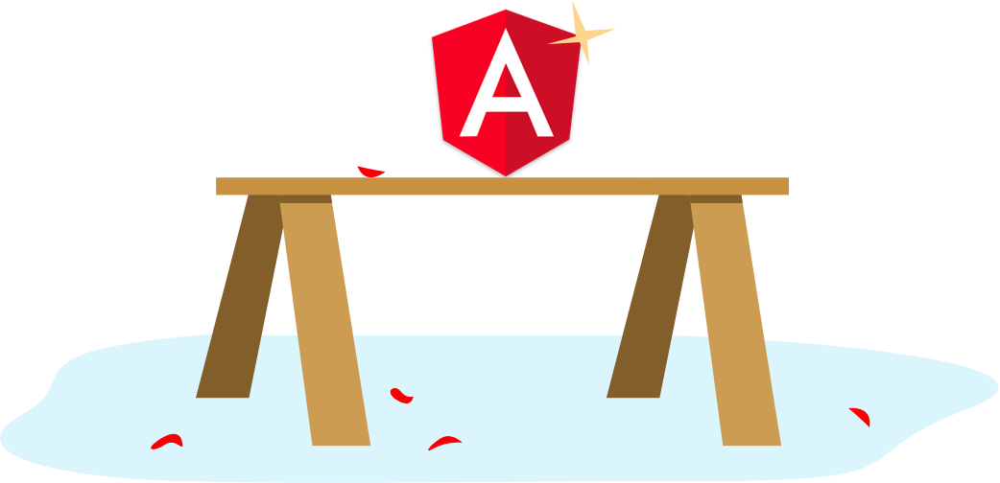
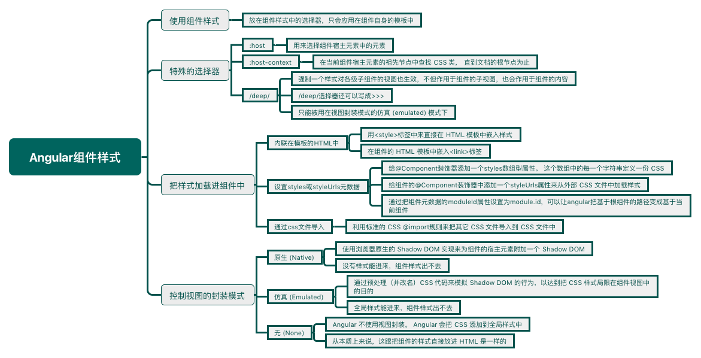

<!--more-->



## 使用组件样式

```typescript
@Component({
  selector: 'hero-app',
  template: `
    <h1>Tour of Heroes</h1>
    <hero-app-main [hero]=hero></hero-app-main>`,
  styles: ['h1 { font-weight: normal; }']
})
export class HeroAppComponent {
/* . . . */
}
```

放在组件样式中的选择器，**只会应用在组件自身的模板中。**

可以使用对每个组件最有意义的 CSS 类名和选择器。

类名和选择器是仅属于组件内部的，它不会和应用中其它地方的类名和选择器出现冲突。

组件的样式*不会*因为别的地方修改了样式而被意外改变。

## 特殊的选择器

### :host

使用`:host`伪类选择器，用来选择组件*宿主*元素中的元素（相对于组件模板*内部*的元素）。

```css
:host {
  display: block;
  border: 1px solid black;
}
```

 因为宿主不是组件自身模板的一部分，而是父组件模板的一部分，所以`:host`是能以宿主元素为目标的*唯一*方式。

要把宿主样式作为条件，就要像*函数*一样把其它选择器放在`:host`后面的括号中。

```css
:host(.active) { /*只有当宿主元素带有active类的时候才会生效*/
  border-width: 3px;
}
```

### :host-context

`:host-context()`伪类选择器在当前组件宿主元素的*祖先节点*中查找 CSS 类， 直到文档的根节点为止。在与其它选择器组合使用时，它非常有用。

下面例子中，只有当某个祖先元素有 CSS 类`theme-light`时，我们才会把`background-color`样式应用到组件*内部*的所有`<h2>`元素中。

```css
:host-context(.theme-light) h2 {
  background-color: #eef;
}
```

### /deep/

使用`/deep/`选择器会强制一个样式对各级子组件的视图也生效，它**不但作用于组件的子视图，也会作用于组件的内容。**

`/deep/`选择器还可以写成`>>>`。

```css
:host /deep/ h3 {
  font-style: italic;
}
----------等于----------
:host >>> h3 {
  font-style: italic;
}
```

<p style="border-left: 4px solid yellow; padding: 10px;">`/deep/`和`>>>`选择器只能被用在**视图封装模式的仿真 (emulated) **模式下。</p>

## 把样式加载进组件中

把样式加入组件的方式有以下几种：

- 内联在模板的HTML中
- 设置styles或styleUrls元数据
- 通过css文件导入

### 内联在模板的HTML中

用`<style>`标签中来直接在 HTML 模板中嵌入样式:

```typescript
@Component({
  selector: 'hero-controls',
  template: `
    <style>
      button {
        background-color: white;
        border: 1px solid #777;
      }
    </style>
    <h3>Controls</h3>
    <button (click)="activate()">Activate</button>
  `
})
```

或者可以在组件的 HTML 模板中嵌入`<link>`标签。这个 link 标签的`href`指向的 URL 也是相对于应用的根目录的(通常是宿主页面`index.html`所在的地方)，而不是组件文件。

```typescript
@Component({
  selector: 'hero-team',
  template: `
    <link rel="stylesheet" href="app/hero-team.component.css">
    <h3>Team</h3>
    <ul>
      <li *ngFor="let member of hero.team">
        {{member}}
      </li>
    </ul>`
})
```

### 设置styles或styleUrls元数据

给`@Component`装饰器添加一个`styles`数组型属性。 这个数组中的每一个字符串（通常也只有一个）定义一份 CSS。

```typescript
@Component({
  selector: 'hero-app',
  template: `
    <h1>Tour of Heroes</h1>
    <hero-app-main [hero]=hero></hero-app-main>`,
  styles: ['h1 { font-weight: normal; }']
})
export class HeroAppComponent {
/* . . . */
}
```

或者可以通过给组件的`@Component`装饰器中添加一个`styleUrls`属性来从外部 CSS 文件中加载样式：

```typescript
@Component({
  selector: 'hero-details',
  template: `
    <h2>{{hero.name}}</h2>
    <hero-team [hero]=hero></hero-team>
    <ng-content></ng-content>
  `,
  styleUrls: ['app/hero-details.component.css']
})
export class HeroDetailsComponent {
/* . . . */
}
```

<p style="border-left: 4px solid yellow; padding: 10px;">像 Webpack 这类模块打包器的用户可能会使用`styles`属性来在构建时从外部文件中加载样式。它们可能这样写：`styles: [require('my.component.css')]`。

注意，是在设置`styles`属性，**而不是**`styleUrls`属性！ 是模块打包器在加载 CSS 字符串，而不是 Angular。 Angular 看到的只是打包器加载它们之后的 CSS 字符串。 对 Angular 来说，这跟我们手写了`styles`数组没有任何区别。</p>

<p style="border-left: 4px solid yellow; padding: 10px;">上面代码中的URL路径是基于根组件。通过把组件元数据的`moduleId`属性设置为`module.id`，我们可以更改 Angular 计算完整 URL 的方式：</p>

```typescript
@Component({
  moduleId: module.id,
  selector: 'quest-summary',
  templateUrl: 'quest-summary.component.html',
  styleUrls:  ['quest-summary.component.css']
})
export class QuestSummaryComponent { }
```

### 通过css文件导入

可以利用标准的 CSS @import规则来把其它 CSS 文件导入到我们的 CSS 文件中。

在这种情况下，URL 是相对于我们执行导入操作的 CSS 文件的。

```typescript
@import 'hero-details-box.css';
```

## 控制视图的封装模式：原生 (Native)、仿真 (Emulated) 和无 (None)

通过在组件的元数据上设置*视图封装模式*，可以分别控制*每个组件*的封装模式。 可选的封装模式一共有三种：

- `Native`模式使用浏览器原生的 [Shadow DOM](https://developer.mozilla.org/en-US/docs/Web/Web_Components/Shadow_DOM) 实现来为组件的宿主元素附加一个 Shadow DOM。组件的样式被包裹在这个 Shadow DOM 中(不进不出，没有样式能进来，组件样式出不去)。原生(`Native`)模式只适用于[有原生 Shadow DOM 支持的浏览器](http://caniuse.com/#feat=shadowdom)。 
- `Emulated`模式（**默认值**）通过预处理（并改名）CSS 代码来模拟 Shadow DOM 的行为，以达到把 CSS 样式局限在组件视图中的目的。 (只进不出，全局样式能进来，组件样式出不去)
- `None`意味着 Angular 不使用视图封装。 Angular 会把 CSS 添加到全局样式中。而不会应用上前面讨论过的那些作用域规则、隔离和保护等。 从本质上来说，这跟把组件的样式直接放进 HTML 是一样的。(能进能出。)

通过组件元数据中的`encapsulation`属性来设置组件封装模式：

```typescript
encapsulation: ViewEncapsulation.Native
```

<p style="border-left: 4px solid yellow; padding: 10px;">当使用默认的仿真模式时，Angular 会对组件的所有样式进行预处理，让它们模仿出标准的 Shadow CSS 作用域规则。比如：一个元素在原生封装方式下可能是 Shadow DOM 的宿主，它会被自动添加上一个`_nghost`属性。组件视图中的每一个元素，都有一个`_ngcontent`属性，它会标记出该元素是哪个宿主的模拟 Shadow DOM。</p>

