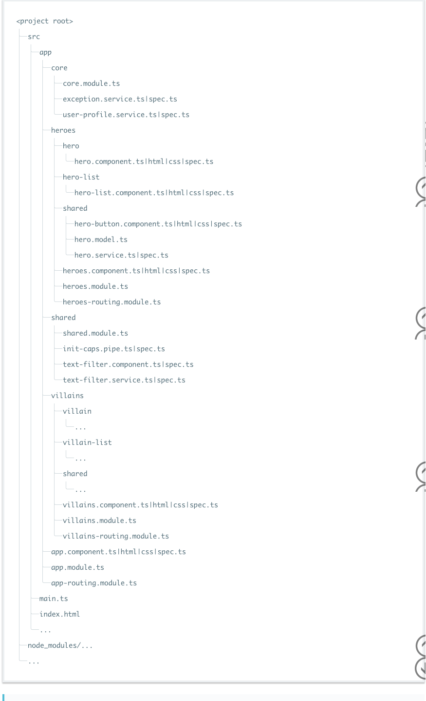

<!--more-->

## 单一职责

### 单一法则

**坚持**每个文件只定义一样东西（例如服务或组件）。

**考虑**把文件大小限制在 400 行代码以内。

### 简单函数

**坚持**定义简单函数

**考虑**限制在 75 行之内。


## 命名

### 总体命名指导原则

**坚持**所有符号使用一致的命名规则。

**坚持**遵循同一个模式来描述符号的特性和类型。推荐的模式为`feature.type.ts`。

### 使用点和横杠分隔文件名

**坚持** 在描述性名字中，用横杠来分隔单词。

**坚持**使用点来分隔描述性名字和类型。

**坚持**遵循先描述组件特性，再描述它的类型的模式，对所有组件使用一致的类型命名规则。推荐的模式为`feature.type.ts`。

**坚持**使用惯用的后缀来描述类型，包括`*.service`、`*.component`、`*.pipe`、`.module`、`.directive`。 必要时可以创建更多类型名，但必须注意，不要创建太多。

### 符号名与文件名

**坚持**为所有东西使用一致的命名约定，以它们所代表的东西命名。

**坚持**使用**大写驼峰命名法**来命名类。符号名匹配它所在的文件名。

**坚持**在符号名后面追加约定的类型后缀（例如`Component`、`Directive`、`Module`、`Pipe`、`Service`）。

**坚持**在文件名后面追加约定的类型后缀（例如`.component.ts`、`.directive.ts`、`.module.ts`、`.pipe.ts`、`.service.ts`）。

### 服务名

**坚持**使用一致的规则命名服务，以它们的特性来命名。

**坚持**使用**大写驼峰命名法**命名服务。

**坚持**添加`Service`后缀，当不清楚它们是什么时（例如当它们是名词时）。

### 引导

**坚持**把应用的引导程序和平台相关的逻辑放到名为`main.ts`的文件里。

**坚持**在引导逻辑中包含错误处理代码。

**避免**把应用逻辑放在`main.ts`中，而应放在组件或服务里。

### 指令选择器

**坚持**使用**小驼峰命名法**来命名指令的选择器。

### 为组件添加自定义前缀

**坚持**使用带连字符的小写元素选择器值（例如`admin-users`）。

**坚持**为组件选择器添加自定义前缀。 例如，`toh`前缀表示 **T**our **o**f **H**eroes（英雄指南），而前缀`admin表示管理特性区。

**坚持**使用前缀来识别特性区或者应用程序本身。

### 为指令添加自定义前缀

**坚持**为指令的选择器添加自定义前缀（例如前缀`toh`来自**T**our **o**f **H**eroes）。

**坚持**用**小驼峰形式**拼写非元素选择器，除非该选择器用于匹配原生 HTML 属性。

### 管道名

**坚持**为所有管道使用一致的命名约定，用它们的特性来命名。

### 单元测试文件名

**坚持**测试规格文件名与被测试组件文件名相同。

**坚持**测试规格文件名添加`.spec`后缀。

### 端到端测试文件名

**坚持**端到端测试规格文件和它们所测试的特性同名，添加`.e2e-spec`后缀。

### Angular NgModule 命名

**坚持**为符号名添加`Module`后缀

**坚持**为文件名添加`.module.ts`扩展名。

**坚持**用特性名和所在目录命名模块。

**坚持**为 *RoutingModule* 类名添加`RoutingModule`后缀。

**坚持**为 *RoutingModule* 的文件名添加`-routing.module.ts`后缀。


## 代码约定

### 类

**坚持**使用大写驼峰命名法来命名类。

### 常量

**坚持**用`const`声明变量，除非它们的值在应用的生命周期内会发生变化。

**考虑** 把常量名拼写为**小驼峰格式**。

**坚持**容许*现存的*`const`常量沿用**大写蛇形命名法**。

```typescript
export const mockHeroes   = ['Sam', 'Jill']; // prefer
export const heroesUrl    = 'api/heroes';    // prefer
export const VILLAINS_URL = 'api/villains';  // tolerate
```

### 接口

**坚持**使用**大写驼峰命名法**来命名接口。

**考虑**不要在接口名字前面加`I`前缀。（[TypeScript 指导原则](https://github.com/Microsoft/TypeScript/wiki/Coding-guidelines)不建议使用 “I” 前缀。）

**考虑**用类代替接口。（单独一个类的代码量小于*类+接口*；类可以作为接口使用，只是用`implements`代替`extends`而已；在 Angular 依赖注入系统中，接口类可以作为服务提供商的查找令牌。）

### 属性和方法

**坚持**使用小写驼峰命名法来命名属性和方法。

**避免**为私有属性和方法添加下划线前缀。

### 导入语句中的空行

**坚持**在第三方导入和应用导入之间留一个空行。

**考虑**按模块名字的字母顺排列导入行。

**考虑**在解构表达式中按字母顺序排列导入的东西。


## 应用结构与Angular模块

所有应用程序的源代码都放到名叫`app`的目录里。 所有特性区都在自己的文件夹中，带有它们自己的 Angular 模块。

所有内容都遵循每个文件一个特性的原则。每个组件、服务和管道都在自己的文件里。 所有第三方程序包保存到其它目录里，不是`app`目录。 

### LIFT

**坚持**组织应用的结构，达到这些目的：快速定位 (`L`ocate) 代码、一眼识别 (`I`dentify) 代码、 尽量保持扁平结构 (`F`lattest) 和尝试 (`T`ry) 遵循DRY (Do Not Repeat Yourself, 不重复自己) 原则。

**坚持**四项基本原则定义文件结构，上面的原则是按重要顺序排列的。

### 定位

**坚持**直观、简单和快速地定位代码。

### 识别

**坚持**命名文件到这个程度：看到名字立刻知道它包含了什么，代表了什么。

**坚持**文件名要具有说明性，确保文件中只包含一个组件。

**避免**创建包含多个组件、服务或者混合体的文件。

### 扁平

**坚持**尽可能保持扁平的目录结构。

**考虑**当同一目录下达到 7 个或更多个文件时创建子目录。

**考虑**配置 IDE，以隐藏无关的文件，例如生成出来的`.js`文件和`.js.map`文件等。

### T-DRY （尝试不重复自己）

**坚持** DRY（Don't Repeat Yourself，不重复自己）。

**避免**过度 DRY，以致牺牲了阅读性。

### 总体结构指导原则

**坚持**从零开始，但要考虑应用程序接下来的路往哪儿走。

**坚持**有一个近期实施方案和一个长期的愿景。

**坚持**把所有源代码都放到名为`app`的目录里。

**坚持**如果组件具有多个伴隨文件 (`.ts`、`.html`、`.css`和`.spec`)，就为它创建一个文件夹。

下面是符合规范的目录和文件结构：



### 按特性组织的目录结构

**坚持**根据特性区命名目录。

**坚持**为每个特性区创建一个 Angular 模块。

### 应用的根模块

**坚持**在应用的根目录创建一个 Angular 模块（例如`/app`）。

**考虑**把根模块命名为`app.module.ts`。

### 特性模块

**坚持**为应用中每个明显的特性创建一个 Angular 模块。

**坚持**把特性模块放在与特性区同名的目录中（例如`app/heroes`）。

**坚持**特性模块的文件名应该能反映出特性区的名字和目录（例如`app/heroes/heroes.module.ts`）。

**坚持**特性模块的符号名应该能反映出特性区、目录和文件名（例如在`app/heroes/heroes.module.ts`中定义`HeroesModule`）。

### 共享特性模块

**坚持**在`shared`目录中创建名叫`SharedModule`的特性模块（例如在`app/shared/shared.module.ts`中定义`SharedModule`）。

**坚持**把可能被应用其它特性模块使用的公共组件、指令和管道放在`SharedModule`中，这些资产倾向于共享自己的新实例（而不是单例）。

**坚持**在`SharedModule`中导入所有模块都需要的资产（例如`CommonModule`和`FormsModule`）。

**坚持**在`SharedModule`中声明所有组件、指令和管道。

**坚持**从`SharedModule`中导出其它特性模块所需的全部符号。

**避免**在`SharedModule`中指定应用级的单例服务提供商。但如果是故意设计的单例也可以，不过还是要小心。

### 核心特性模块

**坚持**把那些“只用一次”的类收集到`CoreModule`中，并对外隐藏它们的实现细节。简化的`AppModule`会导入`CoreModule`，并且把它作为整个应用的总指挥。

**坚持**在`core`目录下创建一个名叫`CoreModule`的特性模块（例如在`app/core/core.module.ts`中定义`CoreModule`）。

**坚持**把一个要共享给整个应用的单例服务放进`CoreModule`中（例如`ExceptionService`和`LoggerService`）。

**坚持**导入`CoreModule`中的资产所需要的全部模块（例如`CommonModule`和`FormsModule`）。

**坚持**把应用级、只用一次的组件收集到`CoreModule`中。 只在应用启动时从`AppModule`中导入它一次，以后再也不要导入它（例如`NavComponent`和`SpinnerComponent`）。

**避免**在`AppModule`之外的任何地方导入`CoreModule`。

**坚持**从`CoreModule`中导出`AppModule`需导入的所有符号，使它们在所有特性模块中可用。

### 防止多次导入`CoreModule`

**坚持**防范多次导入`CoreModule`，并通过添加守卫逻辑来尽快失败。(守卫可以阻止对`CoreModule`的多次导入,守卫会禁止创建单例服务的多个实例。)

```typescript
app/core/module-import-guard.ts

export function throwIfAlreadyLoaded(parentModule: any, moduleName: string) {
  if (parentModule) {
    throw new Error(`${moduleName} has already been loaded. Import Core modules in the AppModule only.`);
  }
}
```

### 惰性加载的目录

**坚持**把惰性加载特性下的内容放进*惰性加载目录*中。 典型的*惰性加载目录*包含*路由组件*及其子组件以及与它们有关的那些资产和模块。

### 永远不要直接导入惰性加载的目录

**避免**让兄弟模块和父模块直接导入*惰性加载特性*中的模块。


## 组件

### 组件选择器命名

**坚持**使用*中线 (dashed) 命名法*或*烤串 (kebab) 命名法*来命名组件中的元素选择器。

### 把组件当做元素

**坚持**通过选择器把组件定义为元素。

### 把模板和样式提取到它们自己的文件

**坚持**当超过 3 行时，把模板和样式提取到一个单独的文件。

**坚持**把模板文件命名为`[component-name].component.html`，其中，[component-name] 是组件名。

**坚持**把样式文件命名为`[component-name].component.css`，其中，[component-name] 是组件名。

### 内联输入和输出属性装饰器

**坚持** 使用`@Input`和`@Output`，而非`@Directive`和`@Component`装饰器的`inputs`和`outputs`属性:

**坚持**把`@Input()`或者`@Output()`放到所装饰的属性的同一行。

### 避免重命名输入和输出

**避免**重命名输入和输出。

### 成员顺序

**坚持**把属性成员放在前面，方法成员放在后面。

**坚持**先放公共成员，再放私有成员，并按照字母顺序排列。

```typescript
export class ToastComponent implements OnInit {
  // public properties
  message: string;
  title: string;
  // private fields
  private defaults = {
    title: '',
    message: 'May the Force be with You'
  };
  private toastElement: any;
  // public methods
  activate(message = this.defaults.message, title = this.defaults.title) {
    this.title = title;
    this.message = message;
    this.show();
  }
  ngOnInit() {
    this.toastElement = document.getElementById('toh-toast');
  }
  // private methods
  private hide() {
    this.toastElement.style.opacity = 0;
    window.setTimeout(() => this.toastElement.style.zIndex = 0, 400);
  }
  private show() {
    console.log(this.message);
    this.toastElement.style.opacity = 1;
    this.toastElement.style.zIndex = 9999;
    window.setTimeout(() => this.hide(), 2500);
  }
}
```

### 把逻辑放到服务里

**坚持**在组件中只包含与视图相关的逻辑。所有其它逻辑都应该放到服务中。

**坚持**把可重用的逻辑放到服务中，保持组件简单，聚焦于它们预期目的。

### 不要给输出属性加前缀

**坚持**命名事件时，不要带前缀`on`。

**坚持**把事件处理器方法命名为`on`前缀之后紧跟着事件名。

```typescript
export class HeroComponent {
  @Output() savedTheDay = new EventEmitter<boolean>();
}

<toh-hero (savedTheDay)="onSavedTheDay($event)"></toh-hero>
```

### 把表现层逻辑放到组件类里

**坚持**把表现层逻辑放进组件类中，而不要放在模板里。


## 指令

### 使用指令来加强已有元素

**坚持**当你需要有表现层逻辑，但没有模板时，使用属性型指令。

### 使用 HostListener 和 HostBinding 类装饰器

**考虑**优先使用`@HostListener`和`@HostBinding`，而不是`@Directive`和`@Component`装饰器的`host`属性。

**坚持**让你的选择保持一致。

```typescript
import { Directive, HostBinding, HostListener } from '@angular/core';
@Directive({
  selector: '[tohValidator]'
})
export class ValidatorDirective {
  @HostBinding('attr.role') role = 'button';
  @HostListener('mouseenter') onMouseEnter() {
    // do work
  }
}
```


## 服务

### 注入器中，服务总是单例的

**坚持**在同一个注入器内，把服务当做单例使用。用它们来共享数据和功能。

### 单一职责

**坚持**创建单一职责的服务，用职责封装在它的上下文中。

**坚持**当服务成长到超出单一用途时，创建一个新服务。

### 提供一个服务

**坚持**将服务提供到共享范围内的顶级组件的 Angular 注入器。

### 使用 @Injectable() 类装饰器

**坚持**当使用类型作为令牌来注入服务的依赖时，使用`@Injectable`类装饰器，而非`@Inject`参数装饰器。


## 数据服务

### 分离数据调用

**坚持**把数据操作和互动重构到服务里。

**坚持**让数据服务来负责 XHR 调用、本地储存、内存储存或者其它数据操作。


## 生命周期钩子

使用生命周期钩子来介入到 Angular 暴露的重要事件里。

### 实现生命周期钩子接口

**坚持**实现生命周期钩子接口。


## 附录

### Codelyzer

**坚持**使用 [codelyzer](https://www.npmjs.com/package/codelyzer) 来实施本指南。

**考虑**调整 codelyzer 的规则来满足你的需求。

### 文档模板和代码片段

**坚持**使用文件模板或代码片段来帮助实现一致的风格和模式。

**考虑**使用 [Visual Studio Code](https://code.visualstudio.com/)的[代码片段](https://marketplace.visualstudio.com/items?itemName=johnpapa.Angular2) 来实施本风格指南。

**考虑**使用 [Atom](https://atom.io/) 的[代码片断](https://atom.io/packages/angular-2-typescript-snippets)来实施本风格指南。

**考虑**使用 [Sublime Text](http://www.sublimetext.com/)的[代码片断](https://github.com/orizens/sublime-angular2-snippets) 来实施本风格指南。

**考虑**使用 [Vim](http://www.vim.org/) 的[代码片断](https://github.com/mhartington/vim-angular2-snippets)来实施本风格指南。
