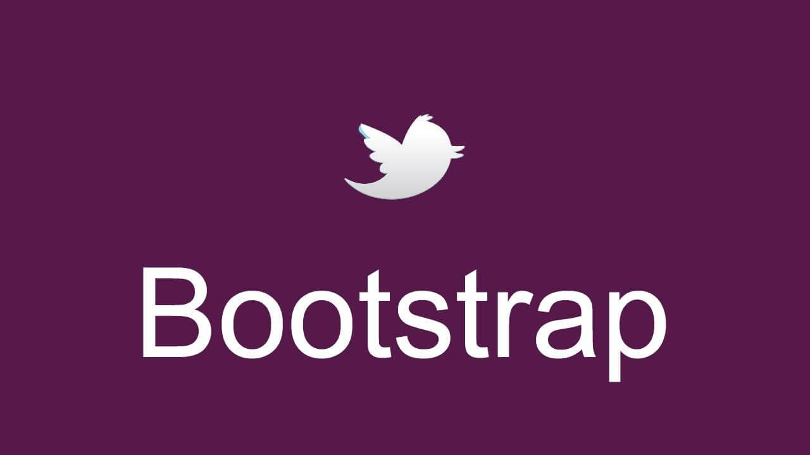
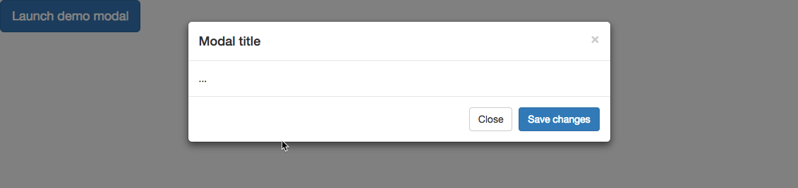
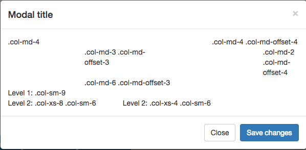
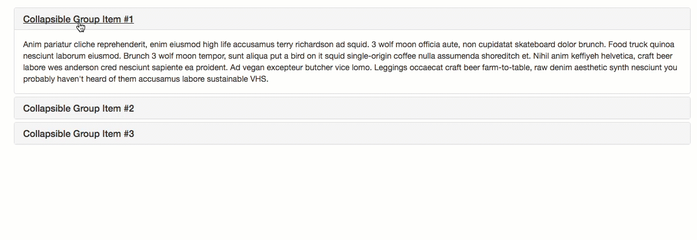

<!--more-->

<p id="div-border-left-green">本文是[Bootstrap中文网](http://v3.bootcss.com/getting-started/)的学习笔记</p>

## 概览

### data属性

通过 data 属性 API 就能使用所有的 Bootstrap 插件。这是 Bootstrap 中的一等 API，也应该是首选方式。

可以通过下面方法解除以 `data-api` 为命名空间并绑定在文档上的事件：

```javascript
$(document).off('.data-api')
```

如果是针对某个特定的插件，只需在 `data-api` 前面添加那个插件的名称作为命名空间，如下：

```javascript
$(document).off('.alert.data-api')
```

### 编程方式的API

所有 Bootstrap 插件提供了纯 JavaScript 方式的 API。所有公开的 API 都是支持单独或链式调用方式，并且返回其所操作的元素集合（注：和jQuery的调用形式一致）。

```javascript
$('.btn.danger').button('toggle').addClass('fat')
```

所有方法都可以接受一个可选的 option 对象作为参数，或者一个代表特定方法的字符串，或者什么也不提供（在这种情况下，插件将会以默认值初始化）：

```javascript
$('#myModal').modal()                    // 以默认值初始化
$('#myModal').modal({ keyboard: false })//初始化时默认键盘操作不可用
$('#myModal').modal('show')           // 初始化后立即调用 show 方法
```

每个插件还通过 `Constructor` 属性暴露了其原始的构造函数：`$.fn.popover.Constructor`。如果你想获取某个插件的实例，可以直接通过页面元素获取：`$('[rel="popover"]').data('popover')`。

#### 默认设置

每个插件都可以通过修改其自身的 `Constructor.DEFAULTS` 对象从而改变插件的默认设置：

```javascript
$.fn.modal.Constructor.DEFAULTS.keyboard = false // 将模态框插件的 `keyboard` 默认选参数置为 false
```

### 避免命名空间冲突

某些时候可能需要将 Bootstrap 插件与其他 UI 框架共同使用。在这种情况下，命名空间冲突随时可能发生。如果不幸发生了这种情况，可以通过调用插件的 `.noConflict` 方法恢复其原始值。

```javascript
var bootstrapButton = $.fn.button.noConflict() // return $.fn.button to previously assigned value
$.fn.bootstrapBtn = bootstrapButton            // give $().bootstrapBtn the Bootstrap functionality
```

### 事件

Bootstrap 为大部分插件所具有的动作提供了自定义事件。一般来说，这些事件都有不定式和过去式两种动词的命名形式，例如，不定式形式的动词（例如 `show`）表示其在事件开始时被触发；而过去式动词（例如 `shown`）表示在动作执行完毕之后被触发。

从 3.0.0 版本开始，所有 Bootstrap 事件的名称都采用命名空间方式。

所有以不定式形式的动词命名的事件都提供了 `preventDefault` 功能。这就赋予你在动作开始执行前将其停止的能力。

```javascript
$('#myModal').on('show.bs.modal', function (e) {
  if (!data) return e.preventDefault() // 阻止模态框的展示
})
```

## 过渡效果

Transition.js 是针对 `transitionEnd` 事件的一个基本辅助工具，也是对 CSS 过渡效果的模拟。它被其它插件用来检测当前浏览器对是否支持 CSS 的过渡效果。

通过下面的 JavaScript 代码可以在全局范围禁用过渡效果，并且必须将此代码放在 `transition.js` （或 `bootstrap.js` 或 `bootstrap.min.js`）后面，确保在 js 文件加载完毕后再执行下面的代码：

```javascript
$.support.transition = false
```

## 模态框

modal.js不支持同时打开多个模态框。

务必将模态框的 HTML 代码放在文档的最高层级内（也就是说，尽量作为 body 标签的直接子元素），以避免其他组件影响模态框的展现和功能。

` autofocus` HTML属性在Bootstrap模式中没有任何作用。 要达到同样的效果，请使用一些自定义JavaScript：

```javascript
$('#myModal').on('shown.bs.modal', function () {
  $('#myInput').focus()
})
```

### 用法

通过 data 属性或 JavaScript 调用模态框插件，可以根据需要动态展示隐藏的内容。模态框弹出时还会为 `<body>` 元素添加 `.modal-open` 类，从而覆盖页面默认的滚动行为，并且还会自动生成一个 `.modal-backdrop` 元素用于提供一个可点击的区域，点击此区域就即可关闭模态框。

#### 通过data属性

不需写 JavaScript 代码也可激活模态框。通过在一个起控制器作用的元素（例如：按钮）上添加 `data-toggle="modal"` 属性，或者 `data-target="#foo"` 属性，再或者 `href="#foo"` 属性，用于指向被控制的模态框。

```html
<button type="button" data-toggle="modal" data-target="#myModal">Launch modal</button>
```

#### 通过JavaScript调用

```javascript
$('#myModal').modal(options)
```

### 参数

可以将选项通过 data 属性或 JavaScript 代码传递。对于 data 属性，需要将参数名称放到 `data-` 之后，例如 `data-backdrop=""`。

| 名称       | 类型                       | 默认值   | 描述                                       |
| -------- | ------------------------ | ----- | ---------------------------------------- |
| backdrop | boolean 或 字符串 `'static'` | true  | 包括模态背景元素。 或者把点击时不关闭模态框的背景指定为`static`。    |
| keyboard | boolean                  | true  | 键盘上的 esc 键被按下时关闭模态框。                     |
| show     | boolean                  | true  | 模态框初始化之后就立即显示出来。                         |
| remote   | path                     | false | **此选项自v3.3.0以来已被弃用，已在v4中删除。** 建议使用客户端模板或数据绑定框架，或者自己调用jQuery.load。如果提供的是 URL，将利用 jQuery 的 `load` 方法**从此 URL 地址加载要展示的内容（只加载一次）**并插入 `.modal-content` 内。如果使用的是 data 属性 API，还可以利用 `href` 属性指定内容来源地址。下面是一个实例：`<a data-toggle="modal" href="remote.html" data-target="#modal">Click me</a>` |

### 事件

Bootstrap 的模态框类提供了一些事件用于监听并执行你自己的代码。

所有模态事件都在模态本身（即在`<div class =“modal”>`）处触发。

| 事件类型            | 描述                                       |
| --------------- | ---------------------------------------- |
| show.bs.modal   | `show` 方法调用之后立即触发该事件。如果是通过点击某个作为触发器的元素，则此元素可以通过事件的 `relatedTarget` 属性进行访问。 |
| shown.bs.modal  | 此事件在模态框已经显示出来（并且同时在 CSS 过渡效果完成）之后被触发。如果是通过点击某个作为触发器的元素，则此元素可以通过事件的 `relatedTarget` 属性进行访问。 |
| hide.bs.modal   | `hide` 方法调用之后立即触发该事件。                    |
| hidden.bs.modal | 此事件在模态框被隐藏（并且同时在 CSS 过渡效果完成）之后被触发。       |
| loaded.bs.modal | 从`远端的数据源`加载完数据之后触发该事件。                   |

```javascript
$('#myModal').on('hidden.bs.modal', function (e) {
  // do something...
})
```

### 方法

#### .modal(options)

将页面中的某块内容作为模态框激活。接受可选参数 `object`。

```javascript
$('#myModal').modal({
  keyboard: false
})
```

#### .modal('toggle')

手动打开或关闭模态框。**在模态框显示或隐藏之前返回到主调函数中**（也就是，在触发 `shown.bs.modal` 或 `hidden.bs.modal` 事件之前）。

```javascript
$('#myModal').modal('toggle')
```

#### .modal('show')

手动打开模态框。**在模态框显示之前返回到主调函数中** （也就是，在触发 `shown.bs.modal` 事件之前）。

```javascript
$('#myModal').modal('show')
```

#### .modal('hide')

手动隐藏模态框。**在模态框隐藏之前返回到主调函数中** （也就是，在触发 `hidden.bs.modal` 事件之前）。

```javascript
$('#myModal').modal('hide')
```

#### .modal('handleUpdate')

为了防止模态框跳到左边，重新调整模态的位置来抵消可能出现的滚动条。

只有当在模态框打开模态框的高度变化时才需要。

```javascript
$('#myModal').modal('handleUpdate')
```

### 实例

#### 动态实例

```html
<!-- Button trigger modal -->
<button type="button" class="btn btn-primary btn-lg" data-toggle="modal" data-target="#myModal">
  Launch demo modal
</button>

<!-- Modal -->
<div class="modal fade" id="myModal" tabindex="-1" role="dialog" aria-labelledby="myModalLabel">
  <div class="modal-dialog" role="document">
    <div class="modal-content">
      <div class="modal-header">
        <button type="button" class="close" data-dismiss="modal" aria-label="Close"><span aria-hidden="true">&times;</span></button>
        <h4 class="modal-title" id="myModalLabel">Modal title</h4>
      </div>
      <div class="modal-body">
        ...
      </div>
      <div class="modal-footer">
        <button type="button" class="btn btn-default" data-dismiss="modal">Close</button>
        <button type="button" class="btn btn-primary">Save changes</button>
      </div>
    </div>
  </div>
</div>
```



<p id="div-border-left-yellow">务必为 `.modal` 添加 `role="dialog"` 和 `aria-labelledby="..."` 属性，用于指向模态框的标题栏；为 `.modal-dialog` 添加 `aria-hidden="true"` 属性。

另外，还应该通过 `aria-describedby` 属性为模态框 `.modal` 添加描述性信息。

在模态框中嵌入 YouTube 视频需要增加一些额外的 JavaScript 代码，用于自动停止重放等功能，这些代码并没有在 Bootstrap 中提供。请参考这份[发布在 Stack Overflow 上的文章](https://stackoverflow.com/questions/18622508/bootstrap-3-and-youtube-in-modal)。</p>

### 可选尺寸

模态框提供了两个可选尺寸，通过为 `.modal-dialog` 增加`.modal-lg`或者`.modal-sm`样式调整类实现。

```html
<!-- Large modal -->
<button type="button" class="btn btn-primary" data-toggle="modal" data-target=".bs-example-modal-lg">Large modal</button>

<div class="modal fade bs-example-modal-lg" tabindex="-1" role="dialog" aria-labelledby="myLargeModalLabel">
  <div class="modal-dialog modal-lg" role="document">
    <div class="modal-content">
      ...
    </div>
  </div>
</div>

<!-- Small modal -->
<button type="button" class="btn btn-primary" data-toggle="modal" data-target=".bs-example-modal-sm">Small modal</button>

<div class="modal fade bs-example-modal-sm" tabindex="-1" role="dialog" aria-labelledby="mySmallModalLabel">
  <div class="modal-dialog modal-sm" role="document">
    <div class="modal-content">
      ...
    </div>
  </div>
</div>
```

### 禁止动画效果

如果你不需要模态框弹出时的动画效果（淡入淡出效果），删掉 `.fade` 类即可。

```html
<div class="modal" tabindex="-1" role="dialog" aria-labelledby="...">
  ...
</div>
```

### 使用栅格系统

要在模态中利用Bootstrap网格系统，只需在`.modal-body`中嵌套`.rows`，然后使用正常的网格系统类。

```html
<button type="button" class="btn btn-primary" data-toggle="modal" data-target=".model-grid">Small modal</button>

<div class="modal fade" tabindex="-1" role="dialog" aria-labelledby="gridSystemModalLabel">
  <div class="modal-dialog" role="document">
    <div class="modal-content">
      <div class="modal-header">
        <button type="button" class="close" data-dismiss="modal" aria-label="Close"><span aria-hidden="true">&times;</span></button>
        <h4 class="modal-title" id="gridSystemModalLabel">Modal title</h4>
      </div>
      <div class="modal-body">
        <div class="row">
          <div class="col-md-4">.col-md-4</div>
          <div class="col-md-4 col-md-offset-4">.col-md-4 .col-md-offset-4</div>
        </div>
        <div class="row">
          <div class="col-md-3 col-md-offset-3">.col-md-3 .col-md-offset-3</div>
          <div class="col-md-2 col-md-offset-4">.col-md-2 .col-md-offset-4</div>
        </div>
        <div class="row">
          <div class="col-md-6 col-md-offset-3">.col-md-6 .col-md-offset-3</div>
        </div>
        <div class="row">
          <div class="col-sm-9">
            Level 1: .col-sm-9
            <div class="row">
              <div class="col-xs-8 col-sm-6">
                Level 2: .col-xs-8 .col-sm-6
              </div>
              <div class="col-xs-4 col-sm-6">
                Level 2: .col-xs-4 .col-sm-6
              </div>
            </div>
          </div>
        </div>
      </div>
      <div class="modal-footer">
        <button type="button" class="btn btn-default" data-dismiss="modal">Close</button>
        <button type="button" class="btn btn-primary">Save changes</button>
      </div>
    </div><!-- /.modal-content -->
  </div><!-- /.modal-dialog -->
</div><!-- /.modal -->
```



### 用触发按钮改变模态内容

 使用`event.relatedTarget`和[HTML`data- *`attributes](https://developer.mozilla.org/en-US/docs/Learn/HTML/Howto/Use_data_attributes)根据点击哪个按钮来更改模态的内容。 有关`relatedTarget`的详细信息，请参阅Modal Events文档。

```html
<button type="button" class="btn btn-primary" data-toggle="modal" data-target="#exampleModal" data-whatever="@mdo">Open modal for @mdo</button>
<button type="button" class="btn btn-primary" data-toggle="modal" data-target="#exampleModal" data-whatever="@fat">Open modal for @fat</button>
<button type="button" class="btn btn-primary" data-toggle="modal" data-target="#exampleModal" data-whatever="@getbootstrap">Open modal for @getbootstrap</button>
...more buttons...

<div class="modal fade" id="exampleModal" tabindex="-1" role="dialog" aria-labelledby="exampleModalLabel">
  <div class="modal-dialog" role="document">
    <div class="modal-content">
      <div class="modal-header">
        <button type="button" class="close" data-dismiss="modal" aria-label="Close"><span aria-hidden="true">&times;</span></button>
        <h4 class="modal-title" id="exampleModalLabel">New message</h4>
      </div>
      <div class="modal-body">
        <form>
          <div class="form-group">
            <label for="recipient-name" class="control-label">Recipient:</label>
            <input type="text" class="form-control" id="recipient-name">
          </div>
          <div class="form-group">
            <label for="message-text" class="control-label">Message:</label>
            <textarea class="form-control" id="message-text"></textarea>
          </div>
        </form>
      </div>
      <div class="modal-footer">
        <button type="button" class="btn btn-default" data-dismiss="modal">Close</button>
        <button type="button" class="btn btn-primary">Send message</button>
      </div>
    </div>
  </div>
</div>
```

```javascript
$('#exampleModal').on('show.bs.modal', function (event) {
  var button = $(event.relatedTarget) // 触发modal的Button
  var recipient = button.data('whatever') // 从data-* attributes提取信息
  //如果需要，可以在此处启动AJAX请求（然后在回调中进行更新）。
  // 更新model的内容. 这里使用了jQuery, 你可以使用data binding library或者其他方法实现.
  var modal = $(this)
  modal.find('.modal-title').text('New message to ' + recipient)
  modal.find('.modal-body input').val(recipient)
})
```

## 下拉菜单

### 用法

通过data属性或JavaScript，下拉插件在父列表项上切换`.open`类来切换隐藏的内容。

在移动设备上，打开一个下拉菜单会添加一个`.dropdown-background`作为点击区域，用于在点击菜单之外关闭下拉菜单时，需要iOS版本支持。 这意味着从打开的下拉菜单切换到不同的下拉菜单需要额外点击移动设备。

注意：`data-toggle =“dropdown”`属性依赖于在应用程序级别关闭下拉菜单，因此推荐始终使用这个属性。

#### 通过data属性

将`data-toggle="dropdown"`添加到链接或按钮以切换下拉列表。

```html
<div class="dropdown">
  <button id="dLabel" type="button" data-toggle="dropdown" aria-haspopup="true" aria-expanded="false">
    Dropdown trigger
    <span class="caret"></span>
  </button>
  <ul class="dropdown-menu" aria-labelledby="dLabel">
    ...
  </ul>
</div>
```

要使用链接的URL保持完整，使用data-target属性而不是href =“＃”。

```html
<div class="dropdown">
  <a id="dLabel" data-target="#" href="http://example.com" data-toggle="dropdown" role="button" aria-haspopup="true" aria-expanded="false">
    Dropdown trigger
    <span class="caret"></span>
  </a>

  <ul class="dropdown-menu" aria-labelledby="dLabel">
    ...
  </ul>
</div>
```

#### 通过JavaScript

无论是通过JavaScript调用下拉列表，还是使用data-api，总是需要在下拉列表的触发器元素上显示`data-toggle =“dropdown”`。

```javascript
$('.dropdown-toggle').dropdown()
```

### 方法

切换下拉菜单:

```javascript
$().dropdown('toggle')
```

### 事件

所有下拉列表事件在`.dropdown-menu`的父元素下触发，并且都有一个`relatedTarget`属性，其值是切换锚点元素。

| 事件类型               | 描述                            |
| ------------------ | ----------------------------- |
| show.bs.dropdown   | 当调用show instance方法时，此事件会立即触发。 |
| shown.bs.dropdown  | 当下拉菜单对用户可见时，会触发此事件。           |
| hide.bs.dropdown   | 当调用hide instance方法事，此事件会立刻触发。 |
| hidden.bs.dropdown | 当下拉菜单从用户隐藏完毕时，会触发此事件。         |

```javascript
$('#myDropdown').on('show.bs.dropdown', function () {
  // do something…
})
```

## 滚动监听

滚动监听插件是用来根据滚动条所处的位置来自动更新导航项的。

### 用法

滚动监听插件依赖 [Bootstrap 的导航组件](http://v3.bootcss.com/components/#nav) 用于高亮显示当前激活的链接。

导航栏链接必须具有可解析的标识对象。 例如，`<a href="#home"> home </a>`必须与DOM中的某些内容相对应，如`<div id =“home”> </ div>`。

目标元素不是`:visible`的将被忽略，它们对应的导航项不会被突出显示。

### 需要相对定位

无论何种实现方式，滚动监听都需要被监听的组件是 `position: relative;` 即相对定位方式。大多数时候是监听 `<body>` 元素。当在`<body>`之外的元素上进行滚动监听时，请确保设置高度和`overflow-y：scroll;`。

### 通过data属性调用

要轻松地将scrollspy行为添加到顶部栏导航中，需要将`data-spy =“scroll”`添加到要监听的元素（通常是`<body>`），然后为Bootstrap`.nav`组件的父元素的ID或类添加data-target属性。

```css
body {
  position: relative;
}
```

```html
<body data-spy="scroll" data-target="#navbar-example">
  ...
  <div id="navbar-example">
    <ul class="nav nav-tabs" role="tablist">
      ...
    </ul>
  </div>
  ...
</body>
```

### 通过JavaScript调用

在 CSS 中添加 `position: relative;` 之后，通过 JavaScript 代码启动滚动监听插件：

```javascript
$('body').scrollspy({ target: '#navbar-example' })
```

### 方法

`.scrollspy('refresh')`

当使用滚动监听插件的同时在 DOM 中添加或删除元素后，需要像下面这样调用此刷新（ refresh） 方法：

```javascript
$('[data-spy="scroll"]').each(function () {
  var $spy = $(this).scrollspy('refresh')
})
```

### 参数

可以通过 data 属性或 JavaScript 传递参数。对于 data 属性，其名称是将参数名附着到 `data-` 后面组成，例如 `data-offset=""`。

| 名称     | 类型     | 默认值  | 描述                     |
| ------ | ------ | ---- | ---------------------- |
| offset | number | 10   | 计算滚动位置时相对于顶部的偏移量（像素数）。 |

### 事件

| 事件类型                  | 描述                         |
| --------------------- | -------------------------- |
| activate.bs.scrollspy | 每当一个新条目被激活后都将由滚动监听插件触发此事件。 |

```javascript
$('#myScrollspy').on('activate.bs.scrollspy', function () {
  // do something…
})
```

## 可切换的标签页

通过这个插件可以动态地把内容放置在标签页或者是胶囊式标签页甚至是下拉菜单标签页中。不支持嵌套选项卡。

### 用法

#### 通过JavaScript

通过JavaScript启用可选标签（每个选项卡需要单独激活）：

```javascript
$('#myTabs a').click(function (e) {
  e.preventDefault()
  $(this).tab('show')
})
```

可以通过以下几种方式激活单个选项卡：

```javascript
$('#myTabs a[href="#profile"]').tab('show') // 通过name选择标签
$('#myTabs a:first').tab('show') // 选择第一个标签
$('#myTabs a:last').tab('show') // 选择最后一个标签
$('#myTabs li:eq(2) a').tab('show') // 选择第三个标签
```

#### 通过data属性

可以通过简单地在元素上指定`data-toggle =“tab”`或`data-toggle =“pill”`来激活标签或胶囊导航，而无需编写任何JavaScript。 

```html
<div>

  <!-- Nav tabs -->
  <ul class="nav nav-tabs" role="tablist">
    <li role="presentation" class="active"><a href="#home" aria-controls="home" role="tab" data-toggle="tab">Home</a></li>
    <li role="presentation"><a href="#profile" aria-controls="profile" role="tab" data-toggle="tab">Profile</a></li>
    <li role="presentation"><a href="#messages" aria-controls="messages" role="tab" data-toggle="tab">Messages</a></li>
    <li role="presentation"><a href="#settings" aria-controls="settings" role="tab" data-toggle="tab">Settings</a></li>
  </ul>

  <!-- Tab panes -->
  <div class="tab-content">
    <div role="tabpanel" class="tab-pane active" id="home">...</div>
    <div role="tabpanel" class="tab-pane" id="profile">...</div>
    <div role="tabpanel" class="tab-pane" id="messages">...</div>
    <div role="tabpanel" class="tab-pane" id="settings">...</div>
  </div>

</div>
```

### 淡入淡出效果

要使标签淡入淡出，将`.fade`添加到每个`.tab-pane`。 第一个选项卡窗格必须具有`.in`使得初始内容可见。

```html
<div class="tab-content">
  <div role="tabpanel" class="tab-pane fade in active" id="home">...</div>
  <div role="tabpanel" class="tab-pane fade" id="profile">...</div>
  <div role="tabpanel" class="tab-pane fade" id="messages">...</div>
  <div role="tabpanel" class="tab-pane fade" id="settings">...</div>
</div>
```

### 事件

当显示新标签时，事件按以下顺序触发：

1. hide.bs.tab（在当前活动选项卡上）
2. show.bs.tab（在待显示的选项卡上）
3. hidden.bs.tab（在上一个活动选项卡上，与hide.bs.tab事件相同）
4. shown.bs.tab（在刚刚显示的新选项卡上，与show.bs.tab事件相同）

如果没有选项卡已经活动，则hide.bs.tab和hidden.bs.tab事件将不被触发。

| 事件类型          | 描述                                       |
| ------------- | ---------------------------------------- |
| show.bs.tab   | 此事件在选项卡显示时触发，但在显示新标签之前。 使用`event.target`和`event.relatedTarget`分别定位活动选项卡和上一个活动选项卡。 |
| shown.bs.tab  | 选项卡显示后，此事件将触发。 使用`event.target`和`event.relatedTarget`分别定位活动选项卡和上一个活动选项卡。 |
| hide.bs.tab   | 当要显示新的选项卡时，此事件将触发。 使用`event.target`和`event.relatedTarget`分别定位当前活动选项卡和新的即将到来的选项卡。 |
| hidden.bs.tab | 显示新选项卡后，此事件触发。 使用`event.target`和`event.relatedTarget`分别定位上一个活动选项卡和新的活动选项卡。 |

### 方法

* `$().tab`

激活标签元素和内容容器。 标签应该具有 `data-target` 或指向DOM中的容器节点的`href`。 

* `.tab('show')`

选择给定的选项卡并显示其相关内容。 之前选择的任何其他选项卡将被取消选择，并且其相关内容被隐藏。 在选项卡窗格实际显示之前（即在shows.bs.tab事件发生之前）返回给调用者。

## Tooltip

Tooltip插件是jQuery.tipsy的升级版本，它不依赖图片，使用了CSS3动画，使用data-attributes属性定义提示标题。

不会显示零长度标题的Tooltip。

### 四个方向的工具提示

```html
<button type="button" class="btn btn-default" data-toggle="tooltip" data-placement="left" title="Tooltip on left">Tooltip on left</button>

<button type="button" class="btn btn-default" data-toggle="tooltip" data-placement="top" title="Tooltip on top">Tooltip on top</button>

<button type="button" class="btn btn-default" data-toggle="tooltip" data-placement="bottom" title="Tooltip on bottom">Tooltip on bottom</button>

<button type="button" class="btn btn-default" data-toggle="tooltip" data-placement="right" title="Tooltip on right">Tooltip on right</button>
```

出于性能原因，Tooltip和Popover data-apis是可选的，这意味着必须自己初始化它们。

初始化页面上所有工具提示的一种方法是通过其数据切换属性来选择它们：

```javascript
$(function () {
  $('[data-toggle="tooltip"]').tooltip()
})
```

### 用法

Tooltip插件根据需要生成内容和标记，默认情况下，它们在触发元素之后显示Tooltip。

通过JavaScript调用：

```javascript
$('#example').tooltip(options)
```

#### data属性

Tooltip所需的标记是指定拥有Tooltip的HTML元素上的`data`和`title`属性。 生成的Tooltip的标记是相当简单的，它需要一个位置（默认情况下，由插件设置为`top`）。

```html
<!-- HTML to write -->
<a href="#" data-toggle="tooltip" title="Some tooltip text!">Hover over me</a>

<!-- Generated markup by the plugin -->
<div class="tooltip top" role="tooltip">
  <div class="tooltip-arrow"></div>
  <div class="tooltip-inner">
    Some tooltip text!
  </div>
</div>
```

有时您想要将包含多行的超链接添加一个Tooltip。 Tooltip插件的默认行为是水平和垂直居中。 可以通过添加`white-space: nowrap;`到对应锚点来调整。

当在`.btn-group`或`.input-group`或表相关元素（`<td>`，`<th>`，`<tr>`，`<thead>`，`<tbody>`，`<tfoot>`）上使用Tooltip时， 必须指定`container: 'body'` ，以避免不必要的副作用（例如，当触发工具提示时元素越来越宽或者没有圆角）。

当对应的元素是`display:none`时，调用`$(...).tooltip('show') `将导致Tooltip位置错误。

向`disabled`或`.disabled`元素添加Tooltip时，需要将元素放在`<div>`之内，并将Tooltip应用于`<div>`。

### 参数

可以通过data attributes或JavaScript传递参数。 对于data attributes，需要将参数名称附加到`data-`中，如`data-animation =“”`。

| 名称        | 类型                           | 默认项                                      | 描述                                       |
| --------- | ---------------------------- | ---------------------------------------- | ---------------------------------------- |
| animation | boolean                      | true                                     | 将CSS渐变过渡应用到Tooltip                       |
| container | string \| false              | false                                    | 将Tooltip附加到特定元素。 示例：`container：'body'`。 该选项特别有用，因为它允许将Tooltip放置在触发元素附近的文档流中 - 这将防止Tooltip在窗口调整大小期间从触发元素浮起。 |
| delay     | number \| object             | 0                                        | 延迟显示和隐藏Tooltip（ms为单位） - 不适用于手动触发类型。如果只提供了一个数字，则延迟效果对hide / show都有效。如果是Object，它的结构是：`delay：{“show”：500，“hide”：100}` |
| html      | boolean                      | false                                    | 将HTML插入工具提示。 如果为false，则将使用jQuery的`text`方法将内容插入到DOM中。 如果担心XSS攻击，可以使用文字。 |
| placement | string \| function           | 'top'                                    | 如何定位tooltip - top \| bottom\| left\| right\| auto。当参数是“auto”时，将动态定位tooltip。 当使用函数确定位置时，将使用tooltipDOM节点作为其第一个参数， 触发元素DOM节点作为其第二个参数。 |
| selector  | string                       | false                                    | 如果使用了selector参数，那么tooltip对象将被委派给指定的目标。 实际上，这用于启用动态HTML内容以添加工具提示。 |
| template  | string                       | `'<div class="tooltip" role="tooltip"><div class="tooltip-arrow"></div><div class="tooltip-inner"></div></div>'` | HTML在创建tooltip时使用。tooltip的`title`将被注入到`.tooltip-inner`。`.tooltip-arrow`中将成为tooltip的箭头标记。最外层的包装元素应该有`.tooltip`类。 |
| title     | string \| function           | ''                                       | 如果title属性不存在，这是默认标题值。                    |
| trigger   | string                       | 'hover focus'                            | 如何触发tooltip - click\| hover\| focus\| manual。 可以传递多个触发器; 将它们与空格分开。 `manual`不能与任何其他触发器组合。 |
| viewport  | string \| object \| function | { selector: 'body', padding: 0 }         | 将tooltip保留在元素的边界内。 示例：`viewport：'#viewport'`或`{“selector”：“#viewport”，“padding”：0}`。 |

### 方法

* `$().tooltip(options)`

向元素集合附加tooltip 。

* `.tooltip('show')`

显示元素的tooltip 。 在实际显示tooltip 之前（即在`shown.bs.tooltip`事件发生之前）返回给调用者。 这被认为是“manual”触发tooltip。 不会显示零长度标题的tooltip 。

```javascript
$('#element').tooltip('show')
```

* `.tooltip('hide')`

隐藏元素的tooltip 。 在tooltip 实际被隐藏之前（即在`hidden.bs.tooltip`事件发生之前），返回给调用者。 这被认为是“manual”触发tooltip 。

```javascript
$('#element').tooltip('hide')
```

* `.tooltip('toggle')`

切换元素的tooltip 。 在tooltip 实际显示或隐藏之前（即，在`shown.bs.tooltip`或`hidden.bs.tooltip`事件发生之前）返回给调用者。 这被认为是“manual”触发工具提示。

```javascript
$('#element').tooltip('toggle')
```

* `.tooltip('destroy')`

隐藏和破坏元素的tooltip 。 使用委托的tooltip不能在后代触发器元素上单独销毁。

```javascript
$('#element').tooltip('destroy')
```

### 事件

| 事件类型                | 描述                                       |
| ------------------- | ---------------------------------------- |
| show.bs.tooltip     | 当调用`show`实例方法时，此事件会立即触发。                 |
| shown.bs.tooltip    | 当tooltip已被用户看到时，会触发此事件（将等待CSS转换完成）。      |
| hide.bs.tooltip     | 当调用`hide`实例方法时，会立即触发此事件。                 |
| hidden.bs.tooltip   | 当tooltip隐藏完成时，会触发此事件（将等待CSS转换完成）。        |
| inserted.bs.tooltip | 在将tooltip模板添加到DOM后，`show.bs.tooltip`事件之后触发此事件。 |

```javascript
$('#myTooltip').on('hidden.bs.tooltip', function () {
  // do something…
})
```

## 弹出框

为任意元素添加一小块浮层，用于存放非主要信息。

弹出框的标题和内容的长度都是零的话将永远不会被显示出来。

由于性能的原因，工具提示和弹出框的 data 编程接口（data api）是必须要**手动初始化的**。

在一个页面上一次性初始化所有弹出框的方式是通过 `data-toggle` 属性选中他们：

```javascript
$(function () {
  $('[data-toggle="popover"]').popover()
})
```

当在`.btn-group`或`.input-group`或表相关元素（`<td>`，`<th>`，`<tr>`，`<thead>`，`<tbody>`，`<tfoot>`）上使用Tooltip时， 必须指定`container: 'body'` ，以避免不必要的副作用。

当对应的元素是`display:none`时，调用`$(...).tooltip('show') `将导致Tooltip位置错误。

向`disabled`或`.disabled`元素添加Tooltip时，需要将元素放在`<div>`之内，并将Tooltip应用于`<div>`。

### 实例

```html
<button type="button" class="btn btn-lg btn-danger" data-toggle="popover" title="Popover title" data-content="And here's some amazing content. It's very engaging. Right?">点我弹出/隐藏弹出框</button>
```

#### 四个弹出方向

```html
<button type="button" class="btn btn-default" data-container="body" data-toggle="popover" data-placement="left" data-content="Vivamus sagittis lacus vel augue laoreet rutrum faucibus.">
  Popover on 左侧
</button>

<button type="button" class="btn btn-default" data-container="body" data-toggle="popover" data-placement="top" data-content="Vivamus sagittis lacus vel augue laoreet rutrum faucibus.">
  Popover on 顶部
</button>

<button type="button" class="btn btn-default" data-container="body" data-toggle="popover" data-placement="bottom" data-content="Vivamus
sagittis lacus vel augue laoreet rutrum faucibus.">
  Popover on 底部
</button>

<button type="button" class="btn btn-default" data-container="body" data-toggle="popover" data-placement="right" data-content="Vivamus sagittis lacus vel augue laoreet rutrum faucibus.">
  Popover on 右侧
</button>
```

#### 点击并让弹出框消失

通过使用 `focus` 触发器可以在用户点击弹出框时让其消失。

为了更好的跨浏览器和跨平台效果，必须使用 `<a>` 标签，*不能*使用 `<button>` 标签，并且，还必须包含 `role="button"` 和 [`tabindex`](https://developer.mozilla.org/en-US/docs/Web/HTML/Global_attributes#tabindex) 属性。

```html
<a tabindex="0" class="btn btn-lg btn-danger" role="button" data-toggle="popover" data-trigger="focus" title="Dismissible popover" data-content="And here's some amazing content. It's very engaging. Right?">可消失的弹出框</a>
```

### 用法

通过 JavaScript 代码启动弹出框：

```javascript
$('#example').popover(options)
```

### 参数

可以通过 data 属性或 JavaScript 传递参数。对于 data 属性，将参数名附着到 `data-` 后面，例如 `data-animation=""`。

| 名称        | 类型                           | 默认值                                      | 描述                                       |
| --------- | ---------------------------- | ---------------------------------------- | ---------------------------------------- |
| animation | boolean                      | true                                     | 为弹出框赋予淡出的 CSS 动画效果。                      |
| container | string \| false              | false                                    | 向指定元素追加弹出框。 示例：`container：'body'`。       |
| content   | string \| function           | ''                                       | 如果`data-content`属性不存在，则为默认内容值。           |
| delay     | number \| object             | 0                                        | 延迟显示和隐藏popover（ms）。如果提供了一个数字，则延迟效果同时应用于hide / show。如果是Object，结构是：`delay：{“show”：500，“hide”：100}` |
| html      | boolean                      | false                                    | 向弹出框插入 HTML。如果为 false，jQuery 的` text `方法将被用于向 dom 插入内容。如果担心 XSS 攻击，请使用 text。 |
| placement | string \| function           | 'right'                                  | 规定如何定位弹出框（即 top\|bottom\|left\|right\|auto）。当指定为 *auto* 时，会动态调整弹出框。例如，如果 placement 是 "auto left"，弹出框将会尽可能显示在左边，在情况不允许的情况下它才会显示在右边。 |
| selector  | string                       | false                                    | 如果提供了一个选择器，弹出框对象将被委派到指定的目标。              |
| template  | string                       | `'<div class="popover" role="tooltip"><div class="arrow"></div><h3 class="popover-title"></h3><div class="popover-content"></div></div>'` | HTML在创建弹出框时使用。弹出框的`title`将被注入到`.popover-inner`。`.tooltip-arrow`中将成为tooltip的箭头标记。最外层的包装元素应该有`.popover`类。 |
| title     | string \| function           | ''                                       | 如果未指定 *title* 属性，则 title 选项是默认的 title 值。 |
| trigger   | string                       | 'click'                                  | 定义如何触发弹出框： click\| hover \| focus \| manual。可以传递多个触发器，每个触发器之间用空格分隔。 |
| viewport  | string \| object \| function | { selector: 'body', padding: 0 }         | 将弹出框保留在元素的边界内。 示例：`viewport：'#viewport'`或`{“selector”：“#viewport”，“padding”：0}`。 |

### 方法

* `$().popover(options)`

向元素集合附加弹出框句柄

* `.popover('show')`

显示元素的弹出框。 在弹出窗口实际显示之前（即在`shows.bs.popover`事件发生之前）返回给调用者。  标题和内容均为零长度的弹出框不会显示。

```javascript
$('#element').popover('show')
```

* `.popover('hide')`

隐藏元素的弹出框。 在弹出框被隐藏之前（即在`hidden.bs.popover`事件发生之前）返回给调用者。 

```javascript
$('#element').popover('hide')
```

* `.popover('toggle')`

切换显示/隐藏元素的弹出框。 在弹出窗口实际显示或隐藏之前（即在`shows.bs.popover`或`hidden.bs.popover`事件发生之前）返回给调用者。 

```javascript
$('#element').popover('toggle')
```

* `.popover('destroy')`

隐藏并销毁元素的弹出框。 

```javascript
$('#element').popover('destroy')
```

### 事件

| 事件类型                | 描述                                       |
| ------------------- | ---------------------------------------- |
| show.bs.popover     | 当调用 show 实例方法时立即触发该事件。                   |
| shown.bs.popover    | 当弹出框对用户可见时触发该事件（将等待 CSS 过渡效果完成）。         |
| hide.bs.popover     | 当调用 hide 实例方法时立即触发该事件。                   |
| hidden.bs.popover   | 当工具提示对用户隐藏时触发该事件（将等待 CSS 过渡效果完成）。        |
| inserted.bs.popover | 当弹出框模板已经添加到DOM时，这个事件在`show.bs.popover`事件之后触发。 |

```javascript
$('#myPopover').on('hidden.bs.popover', function () {
  // do something…
})
```

## 警告信息

### 实例

通过此插件可以为警告信息添加点击并消失的功能。

当使用 `.close` 按钮时，它必须是 `.alert-dismissible` 的第一个子元素，并且在它之前不能有任何文本内容。

### 用法

为关闭按钮添加 `data-dismiss="alert"` 属性就可以使其自动为警告框赋予关闭功能。关闭警告框也就是将其从 DOM 中删除。

```html
<button type="button" class="close" data-dismiss="alert" aria-label="Close">
  <span aria-hidden="true">&times;</span>
</button>
```

### 方法

* `$().alert()`

让警告框监听具有 `data-dismiss="alert"` 属性的后裔元素的点击（click）事件。（如果是通过 data 属性进行的初始化则无需使用）

* `$().alert('close')`

关闭警告框并从 DOM 中将其删除。如果警告框被赋予了 `.fade` 和 `.in` 类，那么，警告框在淡出之后才会被删除。

### 事件

Bootstrap 的警告框插件对外暴露了一些可以被监听的事件。

| 事件类型            | 描述                                |
| --------------- | --------------------------------- |
| close.bs.alert  | 当 `close` 方法被调用后立即触发此事件。          |
| closed.bs.alert | 当警告框被关闭后（也即 CSS 过渡效果完毕之后）立即触发此事件。 |

```javascript
$('#myAlert').on('closed.bs.alert', function () {
  // do something…
})
```

## 按钮

### 单个按钮切换

添加`data-toggle =“button”`以激活单个按钮上的切换。

```html
<button type="button" class="btn btn-primary" data-toggle="button" aria-pressed="false" autocomplete="off">
  Single toggle
</button>
```

### 单选按钮和多选按钮

将`data-toggle="buttons"` 添加到包含多选按钮或单选按钮的`.btn-group`，以启用其各自样式的切换。

```html
<!--多选按钮-->
<div class="btn-group" data-toggle="buttons">
  <label class="btn btn-primary active">
    <input type="checkbox" autocomplete="off" checked> Checkbox 1 (pre-checked)
  </label>
  <label class="btn btn-primary">
    <input type="checkbox" autocomplete="off"> Checkbox 2
  </label>
  <label class="btn btn-primary">
    <input type="checkbox" autocomplete="off"> Checkbox 3
  </label>
</div>

<!--单选按钮-->
<div class="btn-group" data-toggle="buttons">
  <label class="btn btn-primary active">
    <input type="radio" name="options" id="option1" autocomplete="off" checked> Radio 1 (preselected)
  </label>
  <label class="btn btn-primary">
    <input type="radio" name="options" id="option2" autocomplete="off"> Radio 2
  </label>
  <label class="btn btn-primary">
    <input type="radio" name="options" id="option3" autocomplete="off"> Radio 3
  </label>
</div>
```

## 方法

* `$().button('toggle')`

切换按压状态。赋予按钮被激活的外观。

* `$().button('reset')`

重置按钮状态 - 将按钮上的文本还原回原始的内容。**此为异步方法，此方法在内容被重置完成之前即返回。**

* `$().button(string)`

该方法中的字符串是指由用户声明的任何字符串。使用该方法，重置按钮状态，并添加新的内容。

```html
<button type="button" id="myStateButton" data-complete-text="finished!" class="btn btn-primary" autocomplete="off">
  ...
</button>

<script>
  $('#myStateButton').on('click', function () {
    $(this).button('complete') // button text will be "finished!"
  })
</script>
```

## 折叠 

### 实例

点击下面的按钮，通过改变class显示和隐藏另一个元素：

* `.collapse`隐藏内容
* `.collapsing`在过渡期间使用
* `.collapse.in`显示内容

可以使用与href属性的链接，或使用具有`data-target`属性的按钮。 在这两种情况下，都需要添加`data-toggle =“collapse”`。

```html
<a class="btn btn-primary" role="button" data-toggle="collapse" href="#collapseExample" aria-expanded="false" aria-controls="collapseExample">
  Link with href
</a>
<button class="btn btn-primary" type="button" data-toggle="collapse" data-target="#collapseExample" aria-expanded="false" aria-controls="collapseExample">
  Button with data-target
</button>
<div class="collapse" id="collapseExample">
  <div class="well">
    ...
  </div>
</div>
```


```html
<div class="panel-group" id="accordion" role="tablist" aria-multiselectable="true">
  <div class="panel panel-default">
    <div class="panel-heading" role="tab" id="headingOne">
      <h4 class="panel-title">
        <a role="button" data-toggle="collapse" data-parent="#accordion" href="#collapseOne" aria-expanded="true" aria-controls="collapseOne">
          Collapsible Group Item #1
        </a>
      </h4>
    </div>
    <div id="collapseOne" class="panel-collapse collapse in" role="tabpanel" aria-labelledby="headingOne">
      <div class="panel-body">
        Anim pariatur cliche reprehenderit, enim eiusmod high life accusamus terry richardson ad squid. 3 wolf moon officia aute, non cupidatat skateboard dolor brunch. Food truck quinoa nesciunt laborum eiusmod. Brunch 3 wolf moon tempor, sunt aliqua put a bird on it squid single-origin coffee nulla assumenda shoreditch et. Nihil anim keffiyeh helvetica, craft beer labore wes anderson cred nesciunt sapiente ea proident. Ad vegan excepteur butcher vice lomo. Leggings occaecat craft beer farm-to-table, raw denim aesthetic synth nesciunt you probably haven't heard of them accusamus labore sustainable VHS.
      </div>
    </div>
  </div>
  <div class="panel panel-default">
    <div class="panel-heading" role="tab" id="headingTwo">
      <h4 class="panel-title">
        <a class="collapsed" role="button" data-toggle="collapse" data-parent="#accordion" href="#collapseTwo" aria-expanded="false" aria-controls="collapseTwo">
          Collapsible Group Item #2
        </a>
      </h4>
    </div>
    <div id="collapseTwo" class="panel-collapse collapse" role="tabpanel" aria-labelledby="headingTwo">
      <div class="panel-body">
        Anim pariatur cliche reprehenderit, enim eiusmod high life accusamus terry richardson ad squid. 3 wolf moon officia aute, non cupidatat skateboard dolor brunch. Food truck quinoa nesciunt laborum eiusmod. Brunch 3 wolf moon tempor, sunt aliqua put a bird on it squid single-origin coffee nulla assumenda shoreditch et. Nihil anim keffiyeh helvetica, craft beer labore wes anderson cred nesciunt sapiente ea proident. Ad vegan excepteur butcher vice lomo. Leggings occaecat craft beer farm-to-table, raw denim aesthetic synth nesciunt you probably haven't heard of them accusamus labore sustainable VHS.
      </div>
    </div>
  </div>
  <div class="panel panel-default">
    <div class="panel-heading" role="tab" id="headingThree">
      <h4 class="panel-title">
        <a class="collapsed" role="button" data-toggle="collapse" data-parent="#accordion" href="#collapseThree" aria-expanded="false" aria-controls="collapseThree">
          Collapsible Group Item #3
        </a>
      </h4>
    </div>
    <div id="collapseThree" class="panel-collapse collapse" role="tabpanel" aria-labelledby="headingThree">
      <div class="panel-body">
        Anim pariatur cliche reprehenderit, enim eiusmod high life accusamus terry richardson ad squid. 3 wolf moon officia aute, non cupidatat skateboard dolor brunch. Food truck quinoa nesciunt laborum eiusmod. Brunch 3 wolf moon tempor, sunt aliqua put a bird on it squid single-origin coffee nulla assumenda shoreditch et. Nihil anim keffiyeh helvetica, craft beer labore wes anderson cred nesciunt sapiente ea proident. Ad vegan excepteur butcher vice lomo. Leggings occaecat craft beer farm-to-table, raw denim aesthetic synth nesciunt you probably haven't heard of them accusamus labore sustainable VHS.
      </div>
    </div>
  </div>
</div>
```




可以在`.panel-body`中用`.list-group`。

### 用法

折叠（Collapse）插件使用class处理繁重的伸缩：

* `.collapse`隐藏内容
* `.collapse.in`显示内容
* `.collapsing`当过渡效果开始时被添加，当过渡效果完成时被移除

这些类可以在组件动画中找到。

#### 通过data属性

向元素添加 `data-toggle="collapse"` 和 `data-target`，自动分配可折叠元素的控制。`data-target` 属性接受一个 CSS 选择器，并会对其应用折叠效果。请确保向可折叠元素添加 class`.collapse`。如果您希望它默认情况下是打开的，请添加额外的 class `.in`。为了向可折叠控件添加类似折叠面板的分组管理，请添加 data 属性 `data-parent="#selector"`。

#### 通过JavaScript

```javascript
$('.collapse').collapse()
```

### 参数

可以通过data属性或JavaScript传递参数。 对于data属性，将选项名称添加到`data-`，如`data-parent =“”`。

| 名称     | 类型       | 默认值   | 描述                                     |
| ------ | -------- | ----- | -------------------------------------- |
| parent | selector | false | 如果提供了选择器，则当显示此可折叠项目时，父元素下的所有可折叠元素将被关闭。 |
| toggle | boolean  | true  | 切换调用可折叠元素。                             |

### 方法

* `.collapse(options)`

激活内容为可折叠元素。 接受可选的option对象。

```javascript
$('#myCollapsible').collapse({
  toggle: false
})
```

* `.collapse('toggle')`

切换可折叠元素以显示或隐藏。 在可折叠元素实际显示或隐藏之前（即在`shown.bs.collapse` 或`hidden.bs.collapse`事件发生之前）返回到调用者。

* `.collapse('show')`

显示可折叠元素。 在可折叠元素实际显示之前（即在`shown.bs.collapse` 事件发生之前）返回给调用者。

* `.collapse('hide')`

隐藏可折叠元素。在可折叠元素实际上被隐藏之前（即在`hidden.bs.collapse`事件发生之前）返回给调用者。

### 事件

| 事件类型               | 描述                                |
| ------------------ | --------------------------------- |
| show.bs.collapse   | 在调用 show 方法后触发该事件。                |
| shown.bs.collapse  | 当折叠元素对用户可见时触发该事件（将等待 CSS 过渡效果完成）。 |
| hide.bs.collapse   | 当调用 hide 实例方法时立即触发该事件。            |
| hidden.bs.collapse | 当折叠元素对用户隐藏时触发该事件（将等待 CSS 过渡效果完成）。 |

```javascript
$('#myCollapsible').on('hidden.bs.collapse', function () {
  // do something…
})
```

## 轮播

### 实例

轮播不支持IE8和9。

`.active`类需要添加到其中一个幻灯片， 否则，轮播将不可见。

```html
<div id="carousel-example-generic" class="carousel slide" data-ride="carousel">
  <!-- Indicators -->
  <ol class="carousel-indicators">
    <li data-target="#carousel-example-generic" data-slide-to="0" class="active"></li>
    <li data-target="#carousel-example-generic" data-slide-to="1"></li>
    <li data-target="#carousel-example-generic" data-slide-to="2"></li>
  </ol>

  <!-- Wrapper for slides -->
  <div class="carousel-inner" role="listbox">
    <div class="item active">
      
      <div class="carousel-caption">
        ...
      </div>
    </div>
    <div class="item">
      
      <div class="carousel-caption">
        ...
      </div>
    </div>
    ...
  </div>

  <!-- Controls -->
  <a class="left carousel-control" href="#carousel-example-generic" role="button" data-slide="prev">
    <span class="glyphicon glyphicon-chevron-left" aria-hidden="true"></span>
    <span class="sr-only">Previous</span>
  </a>
  <a class="right carousel-control" href="#carousel-example-generic" role="button" data-slide="next">
    <span class="glyphicon glyphicon-chevron-right" aria-hidden="true"></span>
    <span class="sr-only">Next</span>
  </a>
</div>
```

### 可选参数

可以通过 `.item` 内的 `.carousel-caption` 元素向幻灯片添加标题。只需要在该处放置任何可选的 HTML 即可，它会自动对齐并格式化。

```html
<div class="item">
  
  <div class="carousel-caption">
    <h3>...</h3>
    <p>...</p>
  </div>
</div>
```

### 用法

#### 多个轮播

轮播需要在最外层的容器（`.carousel`）上添加一个`id`来让轮播插件正常运行。 添加多个轮播时，或更改轮播的`id`时，请务必更新相关控件。

#### 通过data属性

使用data属性可以轻松控轮播的位置。`data-slide`有两个参数`prev`或`next`，它们用来改变幻灯片相对于当前位置的位置。 或者，使用`data-slide-to`来向轮播传递一个原始滑动索引，`data-slide-to="2"` 将把滑块移动到一个特定的索引，索引从 0 开始计数。

`data-ride="carousel"`属性用于标记轮播在页面加载时就开始动画播放。 它不能与JavaScript初始化方法一起使用。

#### 通过JavaScript

```javascript
$('.carousel').carousel()
```

### 参数

可以通过data属性或JavaScript传递参数。 对于data属性，将选项名称附加到`data-`，如`data-interval =“”`。

| 名称       | 类型             | 默认值     | 描述                                    |
| -------- | -------------- | ------- | ------------------------------------- |
| interval | number         | 5000    | 自动循环每个项目之间延迟的时间量。如果为 false，轮播将不会自动循环。 |
| pause    | string \| null | "hover" | 鼠标进入时暂停轮播循环，鼠标离开时恢复轮播循环。              |
| wrap     | boolean        | true    | 轮播是否连续循环。                             |
| keyboard | boolean        | true    | 轮播是否响应鼠标事件                            |

### 方法

- `.carousel(options)`

初始化轮播为可选的 options 对象，并开始循环项目。

```javascript
$('.carousel').carousel({
  interval: 2000
})
```

- `.carousel('cycle')`

从左到右循环轮播项目。

- `.carousel('pause')`

停止轮播循环项目。

- `.carousel(number)`

循环轮播到某个特定的帧（从 0 开始计数，与数组类似）。

- `.carousel('prev')`

循环轮播到上一个项目。

- `.carousel('next')`

循环轮播到下一个项目。

### 事件

Bootstrap的轮播类暴露了两个事件，这两个事件可在函数中当钩子使用。

两个事件都具有以下附加属性：

- `direction`：轮播滑动的方向（`“left”`或`“right”`）。
- `relatedTarget` ：正在滑动的DOM元素。

所有轮播事件在轮播本身（即在`<div class =“carousel”>`）处被触发。

| 事件类型              | 描述                      |
| ----------------- | ----------------------- |
| slide.bs.carousel | 当调用 slide 实例方法时立即触发该事件。 |
| slid.bs.carousel  | 当轮播完成幻灯片过渡效果时触发该事件。     |

```javascript
$('#myCarousel').on('slide.bs.carousel', function () {
  // do something…
})
```

## 附加导航

### 实例

附加导航插件切换 `position: fixed;` 打开和关闭，模拟[`position: sticky;`](https://developer.mozilla.org/en-US/docs/Web/CSS/position#Sticky_positioning)的效果。 效果可以参考bootstrap官网右边的附加导航。

### 用法

通过data属性或JavaScript使用附加导航插件。 这两种情况都必须用CSS定位并指定内容的宽度。

注意：由于Safari渲染错误，请勿在相对定位的元素（例如pull或push的column）中包含的元素上使用附加导航插件。

### 通过css定位

附加导航插件在三个类之间切换，每个类代表一个特定的状态：`.affix`，`.affix-top`和`.affix-bottom`。必须提供css样式，如果` .affix`是`position: fixed;`除外，它会自己（独立于此插件）处理实际的位置。

附加导航插件的工作原理如下：

1. 开始时，插件添加`.affix-top`以表明该元素处于其最高位置。此时不需要CSS定位。
2. 当滚动经过添加了附加导航（Affix）的元素时。此时`.affix`替换`.affix-top`并且设置`position:fixed;`（由Bootstrap的CSS提供）。
3. 如果定义了底部偏移量，当滚动到达该位置时，应把`.affix`替换为`.affix-bottom`。由于偏移是可选的，假如设置了该偏移，则要求同时设置适当的 CSS。在这种情况下，可能会要添加`position：absolute;`。该插件使用data属性或JavaScript来确定从那里定位元素的位置。

按照上述步骤为以下任一使用选项设置CSS。

### 通过data属性

如需向元素添加附加导航（Affix）行为，只需要向需要监听的元素添加`data-spy="affix"` 即可。请使用偏移来定义何时切换元素的锁定和移动。

```html
<div data-spy="affix" data-offset-top="60" data-offset-bottom="200">
  ...
</div>
```

### 通过JavaScript

```javascript
$('#myAffix').affix({
  offset: {
    top: 100,
    bottom: function () {
      return (this.bottom = $('.footer').outerHeight(true))
    }
  }
})
```

### 参数

可以通过data属性或JavaScript传递选项。 对于data属性，将参数名称附加到`data-`，如`data-offset-top =“200”`。

| 名称     | 类型                                 | 默认值               | 描述                                       |
| ------ | ---------------------------------- | ----------------- | ---------------------------------------- |
| offset | number \| function \| object       | 10                | 当计算滚动位置时，距离顶部的偏移像素。如果设置了一个数字，则该偏移量的值将被应用在顶部和底部。如果设置了一个对象偏移，则其值形如`offset: { top: 10 } `或 `offset: { top: 10, bottom: 5 }`。如果需要动态计算偏移，请使用函数。 |
| target | selector \| node \| jQuery element | the`window`object | 指定附加导航的目标元素。                             |

### 方法

- `.affix(options)`

激活附加导航。 接受可选的参数`object`。

```javascript
$('#myAffix').affix({
  offset: 15
})
```

- `.affix('checkPosition')`

根据相关元素的尺寸，位置和滚动位置重新计算附加导航的状态。`.affix`，`.affix-top`和`.affix-bottom`类根据新的状态添加到固定内容或从其删除。 只要修改附加内容或目标元素的尺寸，就需要调用此方法以确保附加内容的正确定位。

```javascript
$('#myAffix').affix('checkPosition')
```

### 事件

| 事件类型                    | 描述                                       |
| ----------------------- | ---------------------------------------- |
| affix.bs.affix          | This event fires immediately before the element has been affixed. |
| affixed.bs.affix        | This event is fired after the element has been affixed. |
| affix-top.bs.affix      | This event fires immediately before the element has been affixed-top. |
| affixed-top.bs.affix    | This event is fired after the element has been affixed-top. |
| affix-bottom.bs.affix   | This event fires immediately before the element has been affixed-bottom. |
| affixed-bottom.bs.affix | This event is fired after the element has been affixed-bottom. |


