<!--more-->

> 本文是[《玩转Bootstrap》](http://www.imooc.com/learn/141)和[Bootstrap中文网](http://v3.bootcss.com/getting-started/)的学习笔记

## Bootstrap简介

Bootstrap是简单、灵活的用于开发响应式布局、移动设备优先的 WEB 项目的HTML，CSS，JavaScript框架。

## 起步

### 基本模板

<p id="div-border-left-yellow">**Bootstrap 的所有 JavaScript 插件都依赖 jQuery，**因此 jQuery 必须在 Bootstrap 之前引入。在[ `bower.json` 文件中](https://github.com/twbs/bootstrap/blob/v3.3.7/bower.json) 列出了 Bootstrap 所支持的 jQuery 版本</p>

```html
<!DOCTYPE html>
<html lang="zh-CN">
<head>
    <meta charset="utf-8">
    <meta http-equiv="X-UA-Compatible" content="IE=edge"><!--在IE运行最新的渲染模式-->
    <meta name="viewport" content="width=device-width, initial-scale=1"><!--初始化移动浏览显示，width=device-width让视口宽度等于设备的真实分辨率，initial-scale=1是初始化第一次载入时缩放比例-->
    
  	<!-- 上述3个meta标签*必须*放在最前面，任何其他内容都*必须*跟随其后！ -->
    
  	<title>Bootstrap 101 Template</title>

    <!-- Bootstrap -->
    <link href="css/bootstrap.min.css" rel="stylesheet">

    <!-- 下面是针对IE版本低于IE9设置，第一个script是让IE8支持HTML5标签，第二个script是让IE8支持媒体查询 -->

    <!-- HTML5 shim and Respond.js for IE8 support of HTML5 elements and media queries -->
    <!-- WARNING: Respond.js doesn't work if you view the page via file:// -->
    <!--[if lt IE 9]>
    <script src="https://cdn.bootcss.com/html5shiv/3.7.3/html5shiv.min.js"></script>
    <script src="https://cdn.bootcss.com/respond.js/1.4.2/respond.min.js"></script>
    <![endif]-->
</head>
<body>
<h1>你好，世界！</h1>

<!-- jQuery (necessary for Bootstrap's JavaScript plugins) -->
<script src="https://cdn.bootcss.com/jquery/1.12.4/jquery.min.js"></script>
<!-- Include all compiled plugins (below), or include individual files as needed -->
<script src="js/bootstrap.min.js"></script>
</body>
</html>
```

## 全局CSS样式

### 移动设备优先

**Bootstrap 是移动设备优先的**。针对移动设备的样式融合进了框架的每个角落，而不是增加一个额外的文件。

为了确保适当的绘制和触屏缩放，需要在 `` 之中**添加 viewport 元数据标签**。

```html
<meta name="viewport" content="width=device-width, initial-scale=1">
```

在移动设备浏览器上，通过为视口（viewport）设置 meta 属性为 `user-scalable=no` 可以禁用其缩放（zooming）功能。这样禁用缩放功能后，用户只能滚动屏幕，就能让你的网站看上去更像原生应用的感觉。注意，这种方式我们并不推荐所有网站使用，还是要看你自己的情况而定！

```html
<meta name="viewport" content="width=device-width, initial-scale=1, maximum-scale=1, user-scalable=no">
```

### 布局容器

Bootstrap 需要为页面内容和栅格系统包裹一个 `.container` 容器。我们提供了两个作此用处的类。注意，由于 `padding` 等属性的原因，这两种 容器类不能互相嵌套。

`.container` 类用于固定宽度并支持响应式布局的容器。

```html
<div class="container">
  ...
</div>
```

`.container-fluid` 类用于 100% 宽度，占据全部视口（viewport）的容器。

```html
<div class="container-fluid">
  ...
</div>
```

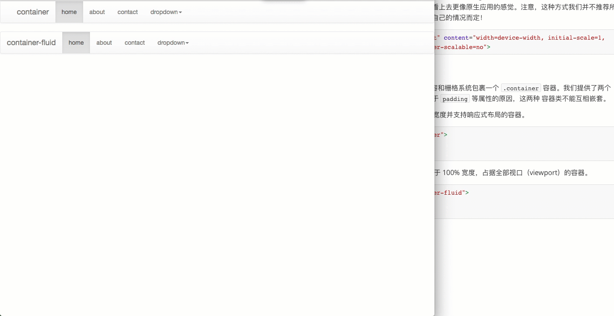


### 栅格系统

Bootstrap 提供了一套响应式、移动设备优先的流式栅格系统，随着屏幕或视口（viewport）尺寸的增加，系统会自动分为最多12列。

#### 简介

栅格系统用于通过一系列的行（row）与列（column）的组合来创建页面布局，你的内容就可以放入这些创建好的布局中。下面就介绍一下 Bootstrap 栅格系统的工作原理：

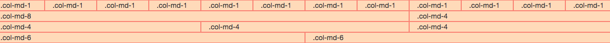

- “行（row）”必须包含在 `.container` （固定宽度）或 `.container-fluid` （100% 宽度）中，以便为其赋予合适的排列（aligment）和内补（padding）。

- 通过“行（row）”在水平方向创建一组“列（column）”。

- 你的内容应当放置于“列（column）”内，并且，只有“列（column）”可以作为行（row）”的直接子元素。

- 类似 `.row` 和 `.col-xs-4` 这种预定义的类，可以用来快速创建栅格布局。Bootstrap 源码中定义的 mixin 也可以用来创建语义化的布局。

- 通过为“列（column）”设置 `padding` 属性，从而创建列与列之间的间隔（gutter）。通过为 `.row` 元素设置负值 `margin` 从而抵消掉为 `.container` 元素设置的 `padding`，也就间接为“行（row）”所包含的“列（column）”抵消掉了`padding`。

- 负值的 margin就是下面的示例为什么是向外突出的原因。在栅格列中的内容排成一行。

- 栅格系统中的列是通过指定1到12的值来表示其跨越的范围。例如，三个等宽的列可以使用三个 `.col-xs-4` 来创建。

- 如果一“行（row）”中包含了的“列（column）”大于 12，多余的“列（column）”所在的元素将被作为一个整体另起一行排列。

  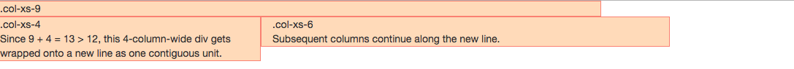

- 栅格类适用于与屏幕宽度大于或等于分界点大小的设备 ， 并且针对小屏幕设备覆盖栅格类。 因此，在元素上应用任何 `.col-md-*` 栅格类适用于与屏幕宽度大于或等于分界点大小的设备 ， 并且针对小屏幕设备覆盖栅格类。 因此，在元素上应用任何 `.col-lg-*` 不存在， 也影响大屏幕设备。

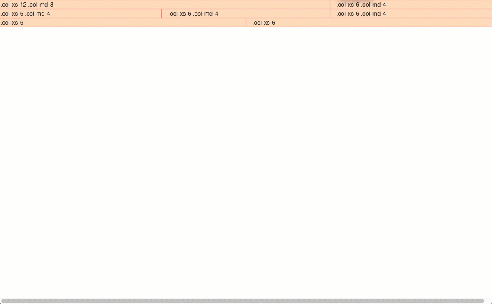

#### 媒体查询

在栅格系统中，我们在 Less 文件中使用以下媒体查询（media query）来创建关键的分界点阈值。

```less
/* 超小屏幕（手机，小于 768px） */
/* 没有任何媒体查询相关的代码，因为这在 Bootstrap 中是默认的（还记得 Bootstrap 是移动设备优先的吗？） */

/* 小屏幕（平板，大于等于 768px） */
@media (min-width: @screen-sm-min) { ... }

/* 中等屏幕（桌面显示器，大于等于 992px） */
@media (min-width: @screen-md-min) { ... }

/* 大屏幕（大桌面显示器，大于等于 1200px） */
@media (min-width: @screen-lg-min) { ... }
```

偶尔也会在媒体查询代码中包含 `max-width` 从而将 CSS 的影响限制在更小范围的屏幕大小之内

```less
@media (max-width: @screen-xs-max) { ... }
@media (min-width: @screen-sm-min) and (max-width: @screen-sm-max) { ... }
@media (min-width: @screen-md-min) and (max-width: @screen-md-max) { ... }
@media (min-width: @screen-lg-min) { ... }
```

#### 栅格参数

|                   | 超小屏幕 手机 (<768px)   | 小屏幕 平板 (≥768px)            | 中等屏幕 桌面显示器 (≥992px)        | 大屏幕 大桌面显示器 (≥1200px)       |
| ----------------- | ------------------ | -------------------------- | -------------------------- | -------------------------- |
| 栅格系统行为            | 总是水平排列             | 开始是堆叠在一起的，当大于这些阈值时将变为水平排列C | 开始是堆叠在一起的，当大于这些阈值时将变为水平排列C | 开始是堆叠在一起的，当大于这些阈值时将变为水平排列C |
| `.container` 最大宽度 | None （自动）          | 750px                      | 970px                      | 1170px                     |
| 类前缀               | `.col-xs-`         | `.col-sm-`                 | `.col-md-`                 | `.col-lg-`                 |
| 列（column）数        | 12                 | 12                         | 12                         | 12                         |
| 最大列（column）宽      | 自动                 | ~62px                      | ~81px                      | ~97px                      |
| 槽（gutter）宽        | 30px （每列左右均有 15px） | 30px （每列左右均有 15px）         | 30px （每列左右均有 15px）         | 30px （每列左右均有 15px）         |
| 可嵌套               | 是                  | 是                          | 是                          | 是                          |
| 偏移（Offsets）       | 是                  | 是                          | 是                          | 是                          |
| 列排序               | 是                  | 是                          | 是                          | 是                          |

#### 响应式列重置

在某些阈值时，某些列可能会出现比别的列高的情况。为了克服这一问题，建议联合使用 `.clearfix` 和 [响应式工具类](http://v3.bootcss.com/css/#responsive-utilities)。

```html
<div class="row">
  <div class="col-xs-6 col-sm-3">.col-xs-6 .col-sm-3</div>
  <div class="col-xs-6 col-sm-3">.col-xs-6 .col-sm-3</div>

  <!-- Add the extra clearfix for only the required viewport -->
  <div class="clearfix visible-xs-block"></div>

  <div class="col-xs-6 col-sm-3">.col-xs-6 .col-sm-3</div>
  <div class="col-xs-6 col-sm-3">.col-xs-6 .col-sm-3</div>
</div>
```

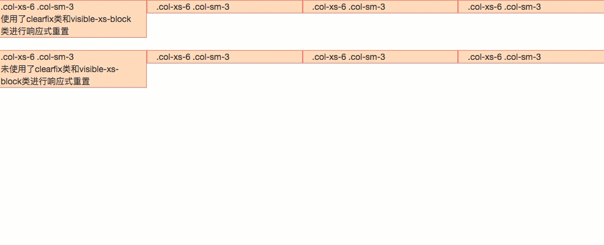

除了列在分界点清除响应， 还可以 **重置偏移, 后推或前拉某个列**。

```html
<div class="row">
  <div class="col-sm-5 col-md-6">.col-sm-5 .col-md-6</div>
  <div class="col-sm-5 col-sm-offset-2 col-md-6 col-md-offset-0">.col-sm-5 .col-sm-offset-2 .col-md-6 .col-md-offset-0</div>
</div>

<div class="row">
  <div class="col-sm-6 col-md-5 col-lg-6">.col-sm-6 .col-md-5 .col-lg-6</div>
  <div class="col-sm-6 col-md-5 col-md-offset-2 col-lg-6 col-lg-offset-0">.col-sm-6 .col-md-5 .col-md-offset-2 .col-lg-6 .col-lg-offset-0</div>
</div>
```

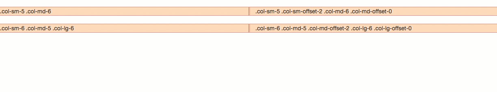

#### 列偏移

使用 `.col-md-offset-*` 类可以将列向右侧偏移。这些类实际是通过使用 `*` 选择器为当前元素增加了左侧的边距（margin）。例如，`.col-md-offset-4` 类将 `.col-md-4` 元素向右侧偏移了4个列（column）的宽度。

```html
<div class="row">
  <div class="col-md-4">.col-md-4</div>
  <div class="col-md-4 col-md-offset-4">.col-md-4 .col-md-offset-4</div>
</div>
<div class="row">
  <div class="col-md-3 col-md-offset-3">.col-md-3 .col-md-offset-3</div>
  <div class="col-md-3 col-md-offset-3">.col-md-3 .col-md-offset-3</div>
</div>
<div class="row">
  <div class="col-md-6 col-md-offset-3">.col-md-6 .col-md-offset-3</div>
</div>
```

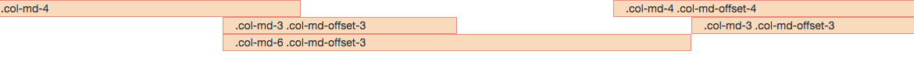

还可以使用`.col - * - offset-0`覆盖较低网格层的偏移量。

```html
<div class="row">
    <div class="col-xs-6 col-sm-4">col-xs-6 col-sm-4
    </div>
    <div class="col-xs-6 col-sm-4">col-xs-6 col-sm-4
    </div>
    <div class="col-xs-6 col-xs-offset-3 col-sm-4 col-sm-offset-0">col-xs-6 col-xs-offset-3 col-sm-4 col-sm-offset-0
    </div>
</div>
```

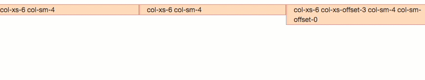

#### 嵌套列

为了使用内置的栅格系统将内容再次嵌套，可以通过添加一个新的 `.row` 元素和一系列 `.col-sm-*` 元素到已经存在的 `.col-sm-*` 元素内。被嵌套的行（row）所包含的列（column）的个数不能超过12。

```html
<div class="row">
  <div class="col-sm-9">
    Level 1: .col-sm-9
    <div class="row">
      <div class="col-xs-8 col-sm-6">
        Level 2: .col-xs-8 .col-sm-6
      </div>
      <div class="col-xs-4 col-sm-6">
        Level 2: .col-xs-4 .col-sm-6
      </div>
    </div>
  </div>
</div>
```

#### 列排序

通过使用 `.col-md-push-*` 和 `.col-md-pull-*` 类就可以很容易的改变列（column）的顺序。

不排序的话，`col-md-9`居左，`col-md-3`居右，如果要互换位置，需要将`col-md-9`向右移动3个列的距离，也就是3个offset ,也就是在`<div class=“col-md-9”>`添加类名`col-md-push-3`，调用其样式。

```html
<div class="row">
  <div class="col-md-9 col-md-push-3">.col-md-9 .col-md-push-3</div>
  <div class="col-md-3 col-md-pull-9">.col-md-3 .col-md-pull-9</div>
</div>
```

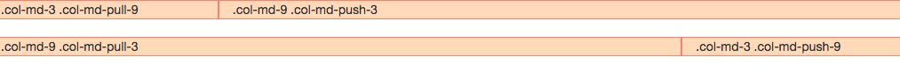

### Less mixin 和变量

#### 变量

通过变量来定义列数、槽（gutter）宽、媒体查询阈值（用于确定合适让列浮动）。我们使用这些变量生成预定义的栅格类。如：`@grid-columns`、`@grid-gutter-width `、`@grid-float-breakpoint`、`@grid-gutter-width `、`@font-family-base`、`@font-size-base`、`@line-height-base`等。

#### mixin

mixin 用来和栅格变量一同使用，为每个列（column）生成语义化的 CSS 代码。

```less
// Creates a wrapper for a series of columns
.make-row(@gutter: @grid-gutter-width) {
  // Then clear the floated columns
  .clearfix();

  @media (min-width: @screen-sm-min) {
    margin-left:  (@gutter / -2);
    margin-right: (@gutter / -2);
  }

  // Negative margin nested rows out to align the content of columns
  .row {
    margin-left:  (@gutter / -2);
    margin-right: (@gutter / -2);
  }
}

// Generate the extra small columns
.make-xs-column(@columns; @gutter: @grid-gutter-width) {
  position: relative;
  // Prevent columns from collapsing when empty
  min-height: 1px;
  // Inner gutter via padding
  padding-left:  (@gutter / 2);
  padding-right: (@gutter / 2);

  // Calculate width based on number of columns available
  @media (min-width: @grid-float-breakpoint) {
    float: left;
    width: percentage((@columns / @grid-columns));
  }
}

// Generate the small columns
.make-sm-column(@columns; @gutter: @grid-gutter-width) {
  position: relative;
  // Prevent columns from collapsing when empty
  min-height: 1px;
  // Inner gutter via padding
  padding-left:  (@gutter / 2);
  padding-right: (@gutter / 2);

  // Calculate width based on number of columns available
  @media (min-width: @screen-sm-min) {
    float: left;
    width: percentage((@columns / @grid-columns));
  }
}

// Generate the small column offsets
.make-sm-column-offset(@columns) {
  @media (min-width: @screen-sm-min) {
    margin-left: percentage((@columns / @grid-columns));
  }
}
.make-sm-column-push(@columns) {
  @media (min-width: @screen-sm-min) {
    left: percentage((@columns / @grid-columns));
  }
}
.make-sm-column-pull(@columns) {
  @media (min-width: @screen-sm-min) {
    right: percentage((@columns / @grid-columns));
  }
}

// Generate the medium columns
.make-md-column(@columns; @gutter: @grid-gutter-width) {
  position: relative;
  // Prevent columns from collapsing when empty
  min-height: 1px;
  // Inner gutter via padding
  padding-left:  (@gutter / 2);
  padding-right: (@gutter / 2);

  // Calculate width based on number of columns available
  @media (min-width: @screen-md-min) {
    float: left;
    width: percentage((@columns / @grid-columns));
  }
}

// Generate the medium column offsets
.make-md-column-offset(@columns) {
  @media (min-width: @screen-md-min) {
    margin-left: percentage((@columns / @grid-columns));
  }
}
.make-md-column-push(@columns) {
  @media (min-width: @screen-md-min) {
    left: percentage((@columns / @grid-columns));
  }
}
.make-md-column-pull(@columns) {
  @media (min-width: @screen-md-min) {
    right: percentage((@columns / @grid-columns));
  }
}

// Generate the large columns
.make-lg-column(@columns; @gutter: @grid-gutter-width) {
  position: relative;
  // Prevent columns from collapsing when empty
  min-height: 1px;
  // Inner gutter via padding
  padding-left:  (@gutter / 2);
  padding-right: (@gutter / 2);

  // Calculate width based on number of columns available
  @media (min-width: @screen-lg-min) {
    float: left;
    width: percentage((@columns / @grid-columns));
  }
}

// Generate the large column offsets
.make-lg-column-offset(@columns) {
  @media (min-width: @screen-lg-min) {
    margin-left: percentage((@columns / @grid-columns));
  }
}
.make-lg-column-push(@columns) {
  @media (min-width: @screen-lg-min) {
    left: percentage((@columns / @grid-columns));
  }
}
.make-lg-column-pull(@columns) {
  @media (min-width: @screen-lg-min) {
    right: percentage((@columns / @grid-columns));
  }
}
```

### 排版

Bootstrap 排版、链接样式设置了基本的全局样式。分别是：

- 为 `body` 元素设置 `background-color: #fff;`
- 使用 `@font-family-base`、`@font-size-base` 和 `@line-height-base` 变量作为排版的基本参数
- 为所有链接设置了基本颜色 `@link-color` ，并且当链接处于 `:hover` 状态时才添加下划线

这些样式都能在 `scaffolding.less` 文件中找到对应的源码。

#### 标题

HTML 中的所有标题标签，`<h1>` 到 `<h6>` 均可使用。另外，还提供了 `.h1` 到 `.h6` 类，为的是给内联（inline）属性的文本赋予标题的样式。

在标题内还可以包含 `<small>` 标签或赋予 `.small` 类的元素，可以用来标记副标题。

```html
<h1>h1. Bootstrap heading</h1>
<h2>h2. Bootstrap heading</h2>
<h3>h3. Bootstrap heading</h3>
<h4>h4. Bootstrap heading</h4>
<h5>h5. Bootstrap heading</h5>
<h6>h6. Bootstrap heading</h6>

<span class="h1">.h1</span>
<span class="h2">.h2</span>
<span class="h3">.h3</span>
<span class="h4">.h4</span>
<span class="h5">.h5</span>
<span class="h6">.h6</span>

<h1>h1. Bootstrap heading <small>small</small></h1>
<h2>h2. Bootstrap heading <small>small</small></h2>
<h3>h3. Bootstrap heading <small>small</small></h3>
<h4>h4. Bootstrap heading <small>small</small></h4>
<h5>h5. Bootstrap heading <small>small</small></h5>
<h6>h6. Bootstrap heading <small>small</small></h6>
```

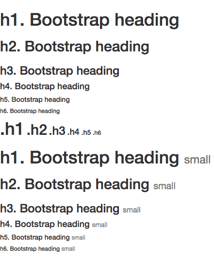


#### 页面主体

Bootstrap 将全局 `font-size` 设置为 **14px**，`line-height` 设置为 **1.428**。这些属性直接赋予 `<body>` 元素和所有段落元素。另外，`<p>` （段落）元素还被设置了等于 1/2 行高（即 10px）的底部外边距（margin）。

通过添加 `.lead` 类可以让段落突出显示。

```html
<p class="lead">Nullam quis risus eget urna mollis ornare vel eu leo. Cum sociis natoque penatibus et magnis dis parturient montes, nascetur ridiculus mus. Nullam id dolor id nibh ultricies vehicula.</p>
<p>Nullam quis risus eget urna mollis ornare vel eu leo. Cum sociis natoque penatibus et magnis dis parturient montes, nascetur ridiculus mus. Nullam id dolor id nibh ultricies vehicula.</p>
```

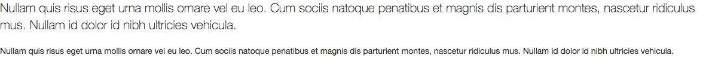

##### 使用Less工具构件

**variables.less** 文件中定义的两个 Less 变量决定了排版尺寸：`@font-size-base` 和 `@line-height-base`。第一个变量定义了全局 font-size 基准，第二个变量是 line-height 基准。我们使用这些变量和一些简单的公式计算出其它所有页面元素的 margin、 padding 和 line-height。自定义这些变量即可改变 Bootstrap 的默认样式。

#### 内联文本元素

* 高亮文本：`<mark></mark>`
* 被删除文本：`<del><del>`
* 无用文本：`<s></s>`
* 插入文本：`<ins></ins>`
* 带下划线的文本：`<u></u>`
* 小号文本：`<small></small>`
* 着重：`<strong></strong>`
* 斜体：`<em></em>`（在 HTML5 中可以使用 `<b>` 和 `<i>` 标签。`<b>` 用于高亮单词或短语，不带有任何着重的意味；而 `<i>` 标签主要用于发言、技术词汇等。）

```html
	<mark>高亮文本</mark><br>
    <del>被删除文本</del><br>
    <s>无用文本</s><br>
    <ins>插入文本</ins><br>
    <u>带下划线的文本</u><br>
    <small>小号文本</small><br>
    <strong>着重</strong><br>
    <em>斜体</em><br>
```

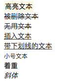

#### 对齐

文本对齐：`<p class="text-left">文本左对齐</p>`、`<p class="text-center">文本居中</p>`、`<p class="text-right">文本右对齐</p>`、`<p class="text-justify">文本两端对齐</p>`、`<p class="text-nowrap">禁止文字自动换行</p>`（在两端对齐文本中，文本行的左右两端都放在父元素的内边界上。然后，调整单词和字母间的间隔，使各行的长度恰好相等）

```html
 	<p class="text-left">文本左对齐</p>
    <p class="text-center">文本居中</p>
    <p class="text-right">文本右对齐</p>
    <p class="text-justify">文本两端对齐</p>
    <p class="text-nowrap">禁止文字自动换行</p>
```

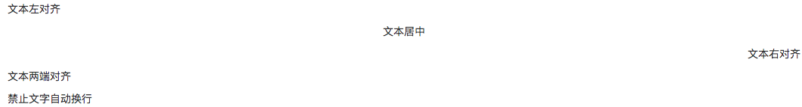

#### 改变大小写

改变大小写：`<p class="text-lowercase">小写</p>`、`<p class="text-uppercase">大写</p>`、`<p class="text-capitalize">首字母大写</p>`

```html
    <p class="text-lowercase">Lowercased小写</p>
    <p class="text-uppercase">Uppercased大写</p>
    <p class="text-capitalize">capitalize首字母大写</p>
```

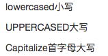

#### 缩略语

缩略语：当鼠标悬停在缩写和缩写词上时就会显示完整内容，Bootstrap 实现了对 HTML 的 `` 元素的增强样式。缩略语元素带有 `title` 属性，外观表现为带有较浅的虚线框，鼠标移至上面时会变成带有“问号”的指针。如想看完整的内容可把鼠标悬停在缩略语上（对使用辅助技术的用户也可见）, 但需要包含 title 属性。

* 基本缩略语：`<abbr title="attribute">attr</abbr>`
* 首字母缩略语：`<abbr title="HyperText Markup Language" class="initialism">HTML</abbr>`（为缩略语添加 `.initialism` 类，可以让 font-size 变得稍微小些。）

```html
  	<abbr title="缩略语">缩略语</abbr>
    <abbr title="缩略语" class="initialism">缩略语</abbr>
```

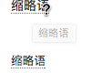

#### 地址

地址：`<address></address>`

```html
<address>
  <strong>Twitter, Inc.</strong><br>
  1355 Market Street, Suite 900<br>
  San Francisco, CA 94103<br>
  <abbr title="Phone">P:</abbr> (123) 456-7890
</address>
```

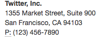

#### 引用

* 默认样式的引用：`<blockquote></blockquote>`（文本建议放在`<p>`标签内，外层包一层`<blockquote>`标签）
* 引用样式的命名来源：`<footer></footer>`（来源的名称可以包裹进 `<cite>`标签中）
* 引用内容右对齐：`<blockquote class="blockquote-reverse"></blockquote>`

```html
	<blockquote>
        <p>默认引用样式</p>
    </blockquote>
    <blockquote>
        <p>默认引用样式</p>
        <footer>命名来源<cite title="Source Title">命名来源</cite></footer>
    </blockquote>
    <blockquote class="blockquote-reverse">
        引用右对齐
    </blockquote>
```

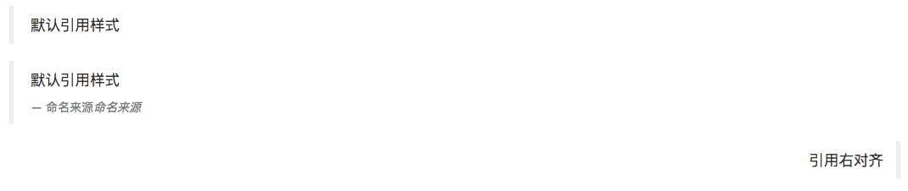

#### 列表

* 无序列表：`<ul></ul>`
* 有序列表：`<ol></ol>`
* 无样式列表：`<ul class="list-unstyled"></ul>`（移除了默认的 `list-style` 样式和左侧外边距的一组元素（只针对直接子元素）。**这是针对直接子元素的**，也就是说，你需要对所有嵌套的列表都添加这个类才能具有同样的样式。）
* 内联列表：`<ul class="list-inline"></ul>`
* 描述：`<dl> <dt></dt> <dd></dd> </dl>`
* 水平排列描述：`<dl class="dl-horizontal">  <dt></dt>  <dd></dd> </dl>`（通过 `text-overflow` 属性，水平排列的描述列表将会截断左侧太长的短语。在较窄的视口（viewport）内，列表将变为默认堆叠排列的布局方式。）

```html
	<ul>
        <li>无序列表</li>
        <li>无序列表</li>
        <li>无序列表</li>
    </ul>
    <ol>
        <li>有序列表</li>
        <li>有序列表</li>
        <li>有序列表</li>
    </ol>
    <ul class="list-unstyled">
        <li>无样式列表</li>
        <li>无样式列表</li>
        <li>无样式列表</li>
    </ul>
    <ul class="list-inline">
        <li>内联列表</li>
        <li>内联列表</li>
        <li>内联列表</li>
    </ul>
    <dl>
        <dt>描述</dt>
        <dd>描述</dd>
    </dl>
    <dl class="dl-horizontal">
        <dt>水平排列的描述</dt>
        <dd>水平排列的描述</dd>
    </dl>
```

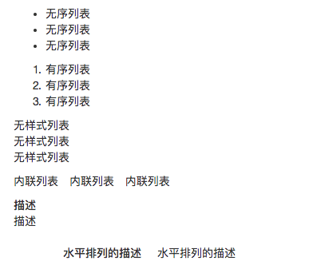


### 代码

* 内联代码：`<code></code>`
* 用户输入：`<kbd></kbd>`
* 代码块：`<pre></pre>`
* 变量：`<var></var>`
* 程序输出：`<samp></samp>`

```html
内联代码: <code>&lt;section&gt;</code> 
用户输入: <kbd><kbd>ctrl</kbd> + <kbd>,</kbd></kbd>
代码块: <pre>&lt;p&gt;Sample text here...&lt;/p&gt;</pre>
变量: <var>y</var> = <var>m</var><var>x</var> + <var>b</var>
程序输出: <samp>This text is meant to be treated as sample output from a computer program.</samp>
```

### 表格

#### 基本表格

为任意 `<table>` 标签添加 `.table` 类可以为其赋予基本的样式 — 少量的内补（padding）和水平方向的分隔线。

```html
<table class="table">
    <thead>
    <tr>
        <th>#</th>
        <th>first name</th>
        <th>last name</th>
        <th>username</th>
    </tr>
    </thead>
    <tbody>
    <tr>
        <td>1</td>
        <td>cheng</td>
        <td>tang</td>
        <td>tc9011</td>
    </tr>
    <tr>
        <td>2</td>
        <td>jie</td>
        <td>zhou</td>
        <td>jay</td>
    </tr>
    <tr>
        <td>3</td>
        <td>mark</td>
        <td>down</td>
        <td>md</td>
    </tr>
    </tbody>
</table>
```

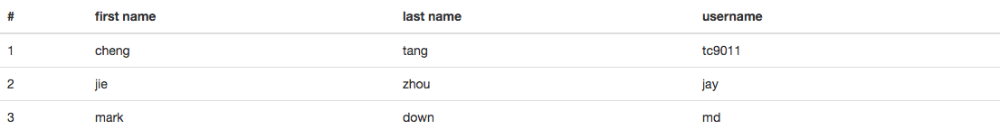

#### 条纹表格

通过 `.table-striped` 类可以给  之内的每一行增加斑马条纹样式。不支持IE8。

```html
<table class="table table-striped">
    <thead>
    <tr>
        <th>#</th>
        <th>first name</th>
        <th>last name</th>
        <th>username</th>
    </tr>
    </thead>
    <tbody>
    <tr>
        <td>1</td>
        <td>cheng</td>
        <td>tang</td>
        <td>tc9011</td>
    </tr>
    <tr>
        <td>2</td>
        <td>jie</td>
        <td>zhou</td>
        <td>jay</td>
    </tr>
    <tr>
        <td>3</td>
        <td>mark</td>
        <td>down</td>
        <td>md</td>
    </tr>
    </tbody>
</table>
```

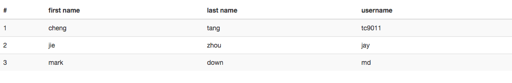

#### 带边框表格

添加 `.table-bordered` 类为表格和其中的每个单元格增加边框。

```html
<table class="table table-bordered">
    <thead>
    <tr>
        <th>#</th>
        <th>first name</th>
        <th>last name</th>
        <th>username</th>
    </tr>
    </thead>
    <tbody>
    <tr>
        <td>1</td>
        <td>cheng</td>
        <td>tang</td>
        <td>tc9011</td>
    </tr>
    <tr>
        <td>2</td>
        <td>jie</td>
        <td>zhou</td>
        <td>jay</td>
    </tr>
    <tr>
        <td>3</td>
        <td>mark</td>
        <td>down</td>
        <td>md</td>
    </tr>
    </tbody>
</table>
```

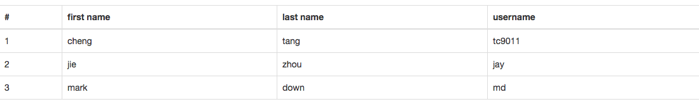

#### 鼠标悬停

通过添加 `.table-hover` 类可以让`<tbody>`中的每一行对鼠标悬停状态作出响应。

```html
<table class="table table-hover">
    <thead>
    <tr>
        <th>#</th>
        <th>first name</th>
        <th>last name</th>
        <th>username</th>
    </tr>
    </thead>
    <tbody>
    <tr>
        <td>1</td>
        <td>cheng</td>
        <td>tang</td>
        <td>tc9011</td>
    </tr>
    <tr>
        <td>2</td>
        <td>jie</td>
        <td>zhou</td>
        <td>jay</td>
    </tr>
    <tr>
        <td>3</td>
        <td>mark</td>
        <td>down</td>
        <td>md</td>
    </tr>
    </tbody>
</table>
```

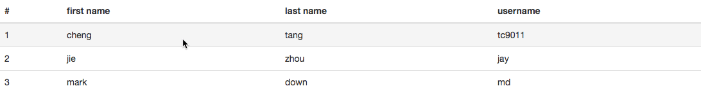

#### 紧缩表格

通过添加 `.table-condensed` 类可以让表格更加紧凑，单元格中的内补（padding）均会减半。

```html
<table class="table table-condensed">
   ...
</table>
```

#### 状态类

* 鼠标悬停在行或单元格上时所设置的颜色：`class="active"`
* 标识成功或积极的动作：`class="success"`
* 标识普通的提示信息或动作：`class="info"`
* 标识警告或需要用户注意：`class="warning"`
* 标识危险或潜在的带来负面影响的动作：`class="danger"`

```html
<table class="table">
    <tbody>
    <tr>
        <td class="active">...</td>
        <td class="success">...</td>
        <td class="warning">...</td>
        <td class="danger">...</td>
        <td class="info">...</td>
    </tr>
    </tbody>
</table>
```

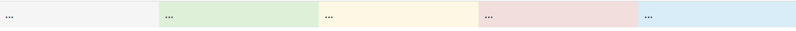

#### 响应式表格

将任何 `.table` 元素包裹在 `.table-responsive` 元素内，即可创建响应式表格，其会在小屏幕设备上（小于768px）水平滚动。当屏幕大于 768px 宽度时，水平滚动条消失。

<p id="div-border-left-yellow">响应式表格使用了 `overflow-y: hidden` 属性，这样就能将超出表格底部和顶部的内容截断。同时这样也会截断下拉菜单和其他第三方组件。

Firefox 浏览器对 `fieldset` 元素设置了一些影响 `width` 属性的样式，导致响应式表格出现问题。可以使用下面提供的针对 Firefox 的 hack 代码解决，但是以下代码并未集成在 Bootstrap 中：`@-moz-document url-prefix() {  fieldset { display: table-cell; }}`</p>

```html
<div class="table-responsive" style="margin: 20px">
    <table class="table">
        <thead>
        <tr>
            <th>#</th>
            <th>first name</th>
            <th>last name</th>
            <th>username</th>
            <th>username</th>
            <th>username</th>
            <th>username</th>
            <th>username</th>
        </tr>
        </thead>
        <tbody>
        <tr>
            <td>1</td>
            <td>cheng</td>
            <td>tang</td>
            <td>tc9011</td>
            <td>tang</td>
            <td>tc9011</td>
            <td>tang</td>
            <td>tc9011</td>
        </tr>
        <tr>
            <td>2</td>
            <td>jie</td>
            <td>zhou</td>
            <td>jay</td>
            <td>zhou</td>
            <td>jay</td>
            <td>zhou</td>
            <td>jay</td>
        </tr>
        <tr>
            <td>3</td>
            <td>mark</td>
            <td>down</td>
            <td>md</td>
            <td>down</td>
            <td>md</td>
            <td>down</td>
            <td>md</td>
        </tr>
        </tbody>
    </table>
</div>
```

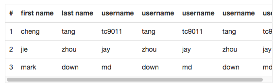

### 表单

#### 基本表单

单独的表单控件会被自动赋予一些全局样式。所有设置了 `.form-control` 类的 `<input>`、`<textarea>` 和 `<select>` 元素都将被默认设置宽度属性为 `width: 100%;`。 将 `label` 元素和前面提到的控件包裹在 `.form-group` 中可以获得最好的排列。

```html
<form>
  <div class="form-group">
    <label for="exampleInputEmail1">Email address</label>
    <input type="email" class="form-control" id="exampleInputEmail1" placeholder="Email">
  </div>
  <div class="form-group">
    <label for="exampleInputPassword1">Password</label>
    <input type="password" class="form-control" id="exampleInputPassword1" placeholder="Password">
  </div>
  <div class="form-group">
    <label for="exampleInputFile">File input</label>
    <input type="file" id="exampleInputFile">
    <p class="help-block">Example block-level help text here.</p>
  </div>
  <div class="checkbox">
    <label>
      <input type="checkbox"> Check me out
    </label>
  </div>
  <button type="submit" class="btn btn-default">Submit</button>
</form>
```

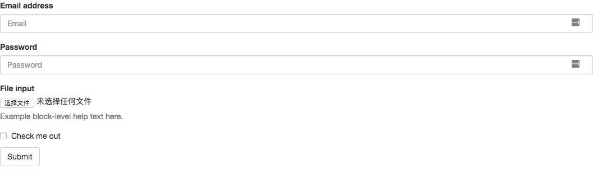

#### 内联表单

为 `<form>` 元素添加 `.form-inline` 类可使其内容左对齐并且表现为 `inline-block` 级别的控件。**只适用于视口（viewport）至少在 768px 宽度时（视口宽度再小的话就会使表单折叠）。**

<p id="div-border-left-yellow">在 Bootstrap 中，输入框和单选/多选框控件默认被设置为 `width: 100%;` 宽度。在内联表单，这些元素的宽度设置为 `width: auto;`，因此，多个控件可以排列在同一行。根据你的布局需求，可能需要一些额外的定制化组件。

如果你没有为每个输入控件设置 `label` 标签，屏幕阅读器将无法正确识别。对于这些内联表单，可以通过为 `label` 设置 `.sr-only` 类将其隐藏。还有一些辅助技术提供label标签的替代方案，比如 `aria-label`、`aria-labelledby` 或 `title` 属性。如果这些都不存在，屏幕阅读器可能会采取使用 `placeholder` 属性来替代其他的标记，但要注意，这种方法是不妥当的。</p>

```html
<form class="form-inline">
  <div class="form-group">
    <label class="sr-only" for="exampleInputEmail3">Email address</label>
    <input type="email" class="form-control" id="exampleInputEmail3" placeholder="Email">
  </div>
  <div class="form-group">
    <label class="sr-only" for="exampleInputPassword3">Password</label>
    <input type="password" class="form-control" id="exampleInputPassword3" placeholder="Password">
  </div>
  <div class="checkbox">
    <label>
      <input type="checkbox"> Remember me
    </label>
  </div>
  <button type="submit" class="btn btn-default">Sign in</button>
</form>
```

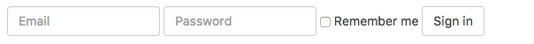

#### 水平排列的表单

通过为表单添加 `.form-horizontal` 类，并联合使用 Bootstrap 预置的栅格类，可以将 `label` 标签和控件组水平并排布局。这样做将改变 `.form-group` 的行为，使其表现为栅格系统中的行（row），因此就无需再额外添加 `.row` 了。

```html
<form class="form-horizontal">
  <div class="form-group">
    <label for="inputEmail3" class="col-sm-2 control-label">Email</label>
    <div class="col-sm-10">
      <input type="email" class="form-control" id="inputEmail3" placeholder="Email">
    </div>
  </div>
  <div class="form-group">
    <label for="inputPassword3" class="col-sm-2 control-label">Password</label>
    <div class="col-sm-10">
      <input type="password" class="form-control" id="inputPassword3" placeholder="Password">
    </div>
  </div>
  <div class="form-group">
    <div class="col-sm-offset-2 col-sm-10">
      <div class="checkbox">
        <label>
          <input type="checkbox"> Remember me
        </label>
      </div>
    </div>
  </div>
  <div class="form-group">
    <div class="col-sm-offset-2 col-sm-10">
      <button type="submit" class="btn btn-default">Sign in</button>
    </div>
  </div>
</form>
```

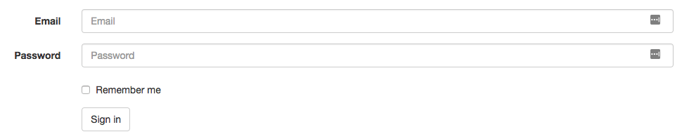

#### 被支持的控件

##### 输入框

包括大部分表单控件、文本输入域控件，还支持所有 HTML5 类型的输入控件： `text`、`password`、`datetime`、`datetime-local`、`date`、`month`、`time`、`week`、`number`、`email`、`url`、`search`、`tel` 和 `color`。只有正确设置了 `type` 属性的输入控件才能被赋予正确的样式。

##### 文本域

支持多行文本的表单控件。可根据需要改变 `rows` 属性。

```html
<textarea class="form-control" rows="3" placeholder="111"></textarea>
<textarea class="form-control" rows="5" placeholder="111"></textarea>
```

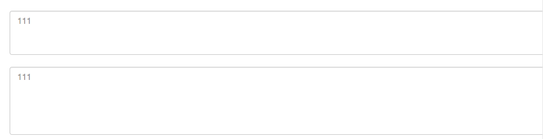

##### 多选和单选框

支持禁用复选框（checkbox）和单选框（radio），但是要在父标签`<label>`上提供禁用的鼠标手势，则需要将`.disabled`类添加到父级`.radio`，`.radio-inline`，`.checkbox`， 或`.checkbox-inline`。

```html
<div class="checkbox">
  <label>
    <input type="checkbox" value="">
    Option one is this and that&mdash;be sure to include why it's great
  </label>
</div>
<div class="checkbox disabled">
  <label>
    <input type="checkbox" value="" disabled>
    Option two is disabled
  </label>
</div>

<div class="radio">
  <label>
    <input type="radio" name="optionsRadios" id="optionsRadios1" value="option1" checked>
    Option one is this and that&mdash;be sure to include why it's great
  </label>
</div>
<div class="radio">
  <label>
    <input type="radio" name="optionsRadios" id="optionsRadios2" value="option2">
    Option two can be something else and selecting it will deselect option one
  </label>
</div>
<div class="radio disabled">
  <label>
    <input type="radio" name="optionsRadios" id="optionsRadios3" value="option3" disabled>
    Option three is disabled
  </label>
</div>
```

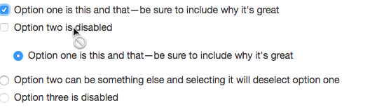

通过将 `.checkbox-inline` 或 `.radio-inline` 类应用到一系列的多选框（checkbox）或单选框（radio）控件上，可以使这些控件排列在一行。

如果需要 `<label>` 内没有文字，自有输入框（input），仍然需要为使用辅助技术的用户提供某种形式的 label（例如，使用 `aria-label`）。**目前只适用于非内联的 checkbox 和 radio。**

```html
<div class="checkbox">
  <label>
    <input type="checkbox" id="blankCheckbox" value="option1" aria-label="...">
  </label>
</div>
<div class="radio">
  <label>
    <input type="radio" name="blankRadio" id="blankRadio1" value="option1" aria-label="...">
  </label>
</div>
```

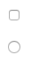

##### 下拉列表

很多原生选择菜单 - 即在 Safari 和 Chrome 中 - 的圆角是无法通过修改 `border-radius` 属性来改变的。

对于标记了 `multiple` 属性的 `<select>` 控件来说，默认显示多选项。

```html
<select class="form-control">
  <option>1</option>
  <option>2</option>
  <option>3</option>
  <option>4</option>
  <option>5</option>
</select>
<select multiple class="form-control">
  <option>1</option>
  <option>2</option>
  <option>3</option>
  <option>4</option>
  <option>5</option>
</select>
```

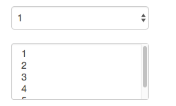

#### 静态控件

如果需要在表单中将一行纯文本和 `label` 元素放置于同一行，为 `<p>` 元素添加 `.form-control-static` 类即可。

#### 焦点状态

将某些表单控件的默认 `outline` 样式移除，然后对 `:focus` 状态赋予 `box-shadow` 属性。

#### 禁用状态

为输入框设置 `disabled` 属性可以禁止其与用户有任何交互（焦点、输入等）。被禁用的输入框颜色更浅，并且还添加了 `not-allowed` 鼠标状态。

```html
<input class="form-control" id="disabledInput" type="text" placeholder="Disabled input here..." disabled>
```

#### 被禁用的 fieldset

为`<fieldset>` 设置 `disabled` 属性,可以禁用 `<fieldset>` 中包含的所有控件，但是`<a>` 标签的链接功能不受影响，这些元素将只被赋予 `pointer-events: none` 属性。不支持IE11及其以下的浏览器。

```html
<form>
  <fieldset disabled>
    <div class="form-group">
      <label for="disabledTextInput">Disabled input</label>
      <input type="text" id="disabledTextInput" class="form-control" placeholder="Disabled input">
    </div>
    <div class="form-group">
      <label for="disabledSelect">Disabled select menu</label>
      <select id="disabledSelect" class="form-control">
        <option>Disabled select</option>
      </select>
    </div>
    <div class="checkbox">
      <label>
        <input type="checkbox"> Can't check this
      </label>
    </div>
    <button type="submit" class="btn btn-primary">Submit</button>
  </fieldset>
</form>
```

#### 只读状态

为输入框设置 `readonly` 属性可以禁止用户修改输入框中的内容。处于只读状态的输入框颜色更浅（就像被禁用的输入框一样），但是仍然保留标准的鼠标状态。

```html
<input class="form-control" type="text" placeholder="Readonly input here…" readonly>
```

#### 帮助文本

帮助文本应该与使用`aria-describeby`属性相关的表单控件明确关联。 这将确保辅助技术（例如屏幕阅读器）在用户聚焦或进入控制时正确识别此帮助文本。

```html
<label class="sr-only" for="inputHelpBlock">Input with help text</label>
<input type="text" id="inputHelpBlock" class="form-control" aria-describedby="helpBlock">
<span id="helpBlock" class="help-block">A block of help text that breaks onto a new line and may extend beyond one line.</span>
```

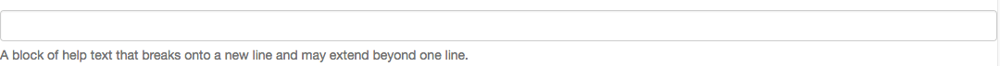

#### 校验状态

Bootstrap 对表单控件的校验状态，如 error、warning 和 success 状态，都定义了样式。使用时，添加 `.has-warning`、`.has-error` 或 `.has-success` 类到这些控件的**父元素**即可。任何包含在此元素之内的 `.control-label`、`.form-control` 和 `.help-block` 元素都将接受这些校验状态的样式。

```html
<div class="form-group has-success">
  <label class="control-label" for="inputSuccess1">Input with success</label>
  <input type="text" class="form-control" id="inputSuccess1" aria-describedby="helpBlock2">
  <span id="helpBlock2" class="help-block">A block of help text that breaks onto a new line and may extend beyond one line.</span>
</div>
<div class="form-group has-warning">
  <label class="control-label" for="inputWarning1">Input with warning</label>
  <input type="text" class="form-control" id="inputWarning1">
</div>
<div class="form-group has-error">
  <label class="control-label" for="inputError1">Input with error</label>
  <input type="text" class="form-control" id="inputError1">
</div>
<div class="has-success">
  <div class="checkbox">
    <label>
      <input type="checkbox" id="checkboxSuccess" value="option1">
      Checkbox with success
    </label>
  </div>
</div>
<div class="has-warning">
  <div class="checkbox">
    <label>
      <input type="checkbox" id="checkboxWarning" value="option1">
      Checkbox with warning
    </label>
  </div>
</div>
<div class="has-error">
  <div class="checkbox">
    <label>
      <input type="checkbox" id="checkboxError" value="option1">
      Checkbox with error
    </label>
  </div>
</div>
```

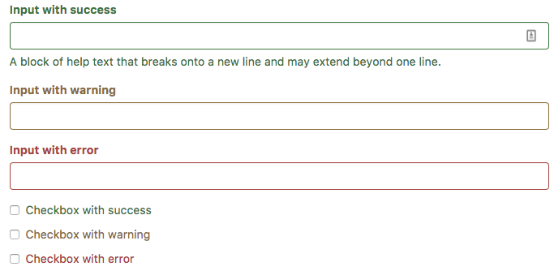

还可以针对校验状态为输入框添加额外的图标。只需设置相应的 `.has-feedback` 类并添加正确的图标即可。

**反馈图标（feedback icon）只能使用在文本输入框`<input class="form-control">`元素上。**

<p id="div-border-left-yellow">对于不带有 `label` 标签的输入框以及右侧带有附加组件的[输入框组](http://v3.bootcss.com/components#input-groups)，需要手动为其图标定位。为了让所有用户都能访问你的网站，强烈建议为所有输入框添加 `label` 标签。如果你不希望将 `label` 标签展示出来，可以通过添加 `.sr-only` 类来实现。如果的确不能添加 `label` 标签，请调整图标的 `top`值。对于输入框组，请根据你的实际情况调整 `right` 值。</p>

```html
<div class="form-group has-success has-feedback">
  <label class="control-label" for="inputSuccess2">Input with success</label>
  <input type="text" class="form-control" id="inputSuccess2" aria-describedby="inputSuccess2Status">
  <span class="glyphicon glyphicon-ok form-control-feedback" aria-hidden="true"></span>
  <span id="inputSuccess2Status" class="sr-only">(success)</span>
</div>
<div class="form-group has-warning has-feedback">
  <label class="control-label" for="inputWarning2">Input with warning</label>
  <input type="text" class="form-control" id="inputWarning2" aria-describedby="inputWarning2Status">
  <span class="glyphicon glyphicon-warning-sign form-control-feedback" aria-hidden="true"></span>
  <span id="inputWarning2Status" class="sr-only">(warning)</span>
</div>
<div class="form-group has-error has-feedback">
  <label class="control-label" for="inputError2">Input with error</label>
  <input type="text" class="form-control" id="inputError2" aria-describedby="inputError2Status">
  <span class="glyphicon glyphicon-remove form-control-feedback" aria-hidden="true"></span>
  <span id="inputError2Status" class="sr-only">(error)</span>
</div>
<div class="form-group has-success has-feedback">
  <label class="control-label" for="inputGroupSuccess1">Input group with success</label>
  <div class="input-group">
    <span class="input-group-addon">@</span>
    <input type="text" class="form-control" id="inputGroupSuccess1" aria-describedby="inputGroupSuccess1Status">
  </div>
  <span class="glyphicon glyphicon-ok form-control-feedback" aria-hidden="true"></span>
  <span id="inputGroupSuccess1Status" class="sr-only">(success)</span>
</div>
```

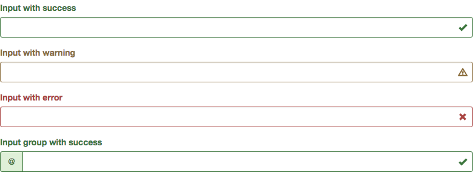

如果你使用 `.sr-only` 类来隐藏表单控件的 `<label>` （而不是使用其它标签选项，如 `aria-label` 属性）， 一旦它被添加，Bootstrap 会自动调整图标的位置。

#### 控件尺寸

通过 `.input-lg` 类似的类可以为控件设置高度，通过 `.col-lg-*` 类似的类可以为控件设置宽度。

通过添加 `.form-group-lg` 或 `.form-group-sm` 类，为 `.form-horizontal` 包裹的 `label` 元素和表单控件快速设置尺寸。

用栅格系统中的列（column）包裹输入框或其任何父元素，都可很容易的为其设置宽度。

```html
<input class="form-control input-lg" type="text" placeholder=".input-lg">
<input class="form-control" type="text" placeholder="Default input">
<input class="form-control input-sm" type="text" placeholder=".input-sm">
<div class="row">
  <div class="col-xs-2">
    <input type="text" class="form-control" placeholder=".col-xs-2">
  </div>
  <div class="col-xs-3">
    <input type="text" class="form-control" placeholder=".col-xs-3">
  </div>
  <div class="col-xs-4">
    <input type="text" class="form-control" placeholder=".col-xs-4">
  </div>
</div>
<form class="form-horizontal">
  <div class="form-group form-group-lg">
    <label class="col-sm-2 control-label" for="formGroupInputLarge">Large label</label>
    <div class="col-sm-10">
      <input class="form-control" type="text" id="formGroupInputLarge" placeholder="Large input">
    </div>
  </div>
  <div class="form-group form-group-sm">
    <label class="col-sm-2 control-label" for="formGroupInputSmall">Small label</label>
    <div class="col-sm-10">
      <input class="form-control" type="text" id="formGroupInputSmall" placeholder="Small input">
    </div>
  </div>
</form>
```

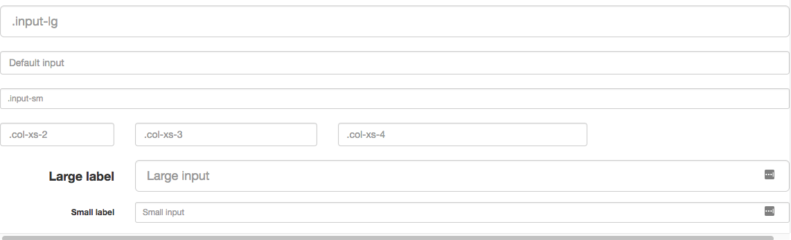

### 按钮

为 `<a>`、`<button>`、或`<input>` 元素添加按钮类（button class）即可使用 Bootstrap 提供的样式。

<p id="div-border-left-yellow">虽然按钮类可以应用到 `<a>`和 `<button>` 元素上，但是，导航和导航条组件只支持 `<button>` 元素。

如果 `<a>`元素被作为按钮使用 -- 并用于在当前页面触发某些功能 -- 而不是用于链接其他页面或链接当前页面中的其他部分，那么，务必为其设置 `role="button"` 属性。

最佳实践是：**强烈建议尽可能使用`<button>`元素**来获得在各个浏览器上获得相匹配的绘制效果。

另外， [Firefox <30 版本的浏览器上出现的一个 bug](https://bugzilla.mozilla.org/show_bug.cgi?id=697451)，其表现是：阻止我们为基于 `<input>` 元素所创建的按钮设置 `line-height` 属性，这就导致在 Firefox 浏览器上不能完全和其他按钮保持一致的高度。</p>

通过`.btn-default`、`.btn-primary`、`.btn-success`、`btn-info`、`btn-warning`、`btn-danger`、`btn-link`类来快速创建一个有预定义样式的按钮。

使用 `.btn-lg`、`.btn-sm` 或 `.btn-xs` 就可以获得不同尺寸的按钮。

通过给按钮添加 `.btn-block` 类可以将其拉伸至父元素100%的宽度，而且按钮也变为了块级（block）元素。

当按钮处于激活状态时，其表现为被按压下去（底色更深、边框夜色更深、向内投射阴影）。对于 `<button>` 元素，是通过 `:active` 状态实现的。对于 `<a>` 元素，是通过 `.active` 类实现的。然而，你还可以将 `.active`应用到 `<button>` 上（包含 `aria-pressed="true"` 属性)），并通过编程的方式使其处于激活状态。

为 `<button>` 元素添加 `disabled` 属性，使其表现出禁用状态。（原理是通过为按钮的背景设置 `opacity` 属性就可以呈现出无法点击的效果。）

对`<a>`标签设置`disabled`属性后，使用键盘操作仍然可以工作，为了安全起见，建议通过 JavaScript 代码来禁止链接的原始功能。

```html
<button type="button" class="btn btn-default">（默认样式）Default</button>
<button type="button" class="btn btn-primary">（首选项）Primary</button>
<button type="button" class="btn btn-success">（成功）Success</button>
<button type="button" class="btn btn-info">（一般信息）Info</button>
<button type="button" class="btn btn-warning">（警告）Warning</button>
<button type="button" class="btn btn-danger">（危险）Danger</button>
<button type="button" class="btn btn-link">（链接）Link</button>

<p>
    <button type="button" class="btn btn-primary btn-lg">（大按钮）Large button</button>
    <button type="button" class="btn btn-default btn-lg">（大按钮）Large button</button>
</p>
<p>
    <button type="button" class="btn btn-primary">（默认尺寸）Default button</button>
    <button type="button" class="btn btn-default">（默认尺寸）Default button</button>
</p>
<p>
    <button type="button" class="btn btn-primary btn-sm">（小按钮）Small button</button>
    <button type="button" class="btn btn-default btn-sm">（小按钮）Small button</button>
</p>
<p>
    <button type="button" class="btn btn-primary btn-xs">（超小尺寸）Extra small button</button>
    <button type="button" class="btn btn-default btn-xs">（超小尺寸）Extra small button</button>
</p>

<button type="button" class="btn btn-primary btn-lg btn-block">（块级元素）Block level button</button>
<button type="button" class="btn btn-default btn-lg btn-block">（块级元素）Block level button</button>

<button type="button" class="btn btn-primary btn-lg active">Primary button</button>
<button type="button" class="btn btn-default btn-lg active">Button</button>

<a href="#" class="btn btn-primary btn-lg active" role="button">Primary link</a>
<a href="#" class="btn btn-default btn-lg active" role="button">Link</a>

<button type="button" class="btn btn-lg btn-primary" disabled="disabled">Primary button</button>
<button type="button" class="btn btn-default btn-lg" disabled="disabled">Button</button>

<a href="#" class="btn btn-primary btn-lg disabled" role="button">Primary link</a>
<a href="#" class="btn btn-default btn-lg disabled" role="button">Link</a>
```

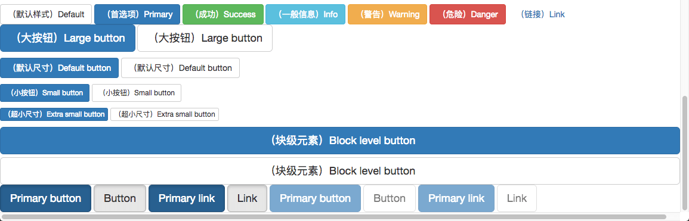

### 图片

#### 响应式图片

在 Bootstrap 版本 3 中，通过为图片添加 `.img-responsive` 类可以让图片支持响应式布局。其实质是为图片设置了 `max-width: 100%;`、 `height: auto;` 和 `display: block;` 属性，从而让图片在其父元素中更好的缩放。

如果需要让使用了 `.img-responsive` 类的图片水平居中，请使用 `.center-block` 类，不要用 `.text-center`。

<p id="div-border-left-yellow">在 Internet Explorer 8-10 中，设置为 `.img-responsive` 的 SVG 图像显示出的尺寸不匀称。为了解决这个问题，在出问题的地方添加 `width: 100% \9;` 即可</p>

```html

```


#### 图片形状

通过为 `` 元素添加`.img-rounded`、`.img-circle`、`.img-thumbnail`，可以让图片呈现不同的形状。

```html


```


### 辅助类

#### 情景文本颜色

通过颜色来展示意图，Bootstrap 提供了一组工具类。这些类可以应用于链接，并且在鼠标经过时颜色可以还可以加深，就像默认的链接一样。

```html
<p class="text-muted">text-muted</p>
<p class="text-primary">text-primary</p>
<p class="text-success">text-success</p>
<p class="text-info">text-info</p>
<p class="text-warning">text-warning</p>
<p class="text-danger">text-danger</p>
```

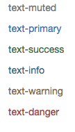

#### 情景背景色

```html
<p class="bg-primary">bg-primary</p>
<p class="bg-success">bg-success</p>
<p class="bg-info">bg-info</p>
<p class="bg-warning">bg-warning</p>
<p class="bg-danger">bg-danger</p>
```

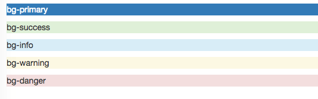

#### 关闭按钮

通过使用一个象征关闭的图标，可以让模态框和警告框消失。

```html
<button type="button" class="close" aria-label="Close"><span aria-hidden="true">&times;</span></button>
```


#### 三角符号

通过使用三角符号可以指示某个元素具有下拉菜单的功能。

```html
<span class="caret"></span>
```


#### 快速浮动

通过添加`.pull-left`和`.pull-right`类，可以将任意元素向左或向右浮动。但是不能用在导航组件中。

排列导航条中的组件时可以使用这些工具类：`.navbar-left` 或 `.navbar-right` 。

```html
<div class="pull-left">pull-left</div>
<div class="pull-right">pull-right</div>
```

#### 让内容块居中

通过添加`.center-block`类，原理是为任意元素设置 `display: block` 属性并通过 `margin` 属性让其中的内容居中。

```html
<div class="center-block">center-block</div>
```

```css
.center-block {
  display: block;
  margin-left: auto;
  margin-right: auto;
}
```

#### 清除浮动

**通过为父元素**添加 `.clearfix` 类可以很容易地清除浮动（`float`）。

```html
<div class="clearfix">...</div>
```

#### 显示或隐藏内容

`.show` 和 `.hidden` 类可以强制任意元素显示或隐藏(**对于屏幕阅读器也能起效**)。这些类通过 `!important` 来避免 CSS 样式优先级问题。注意，这些类只对块级元素起作用，另外，还可以作为 mixin 使用。

`.hide` 类仍然可用，但是它不能对屏幕阅读器起作用，并且从 v3.0.1 版本开始就**不建议使用**了。请使用 `.hidden` 或 `.sr-only` 。

另外，`.invisible` 类可以被用来仅仅影响元素的可见性，也就是说，元素的 `display` 属性不被改变，并且这个元素仍然能够影响文档流的排布。

```html
<div class="show">...</div>
<div class="hidden">...</div>
```

#### 屏幕阅读器和键盘导航

`.sr-only` 类可以对**屏幕阅读器以外**的设备隐藏内容。`.sr-only` 和 `.sr-only-focusable` 联合使用的话可以在元素有焦点的时候再次显示出来（例如，使用键盘导航的用户）。对于遵循 [可访问性的最佳实践](http://v3.bootcss.com/getting-started/#accessibility) 很有必要。这个类也可以作为 mixin 使用。

```html
<a class="sr-only sr-only-focusable" href="#content">Skip to main content</a>
```

#### 图片替换

使用 `.text-hide` 类或对应的 mixin 可以用来将元素的文本内容替换为一张背景图。

```html
<h1 class="text-hide">Custom heading</h1>
```

### 响应式工具

#### 可用的类

通过单独或联合使用以下列出的类，可以针对不同屏幕尺寸隐藏或显示页面内容。

|                 | 超小屏幕手机 (<768px) | 小屏幕平板 (≥768px) | 中等屏幕桌面 (≥992px) | 大屏幕桌面 (≥1200px) |
| --------------- | --------------- | -------------- | --------------- | --------------- |
| `.visible-xs-*` | 可见              | 隐藏             | 隐藏              | 隐藏              |
| `.visible-sm-*` | 隐藏              | 可见             | 隐藏              | 隐藏              |
| `.visible-md-*` | 隐藏              | 隐藏             | 可见              | 隐藏              |
| `.visible-lg-*` | 隐藏              | 隐藏             | 隐藏              | 可见              |
| `.hidden-xs`    | 隐藏              | 可见             | 可见              | 可见              |
| `.hidden-sm`    | 可见              | 隐藏             | 可见              | 可见              |
| `.hidden-md`    | 可见              | 可见             | 隐藏              | 可见              |
| `.hidden-lg`    | 可见              | 可见             | 可见              | 隐藏              |

从 v3.2.0 版本起，形如 `.visible-*-*` 的类针对每种屏幕大小都有了三种变体，每个针对 CSS 中不同的 `display` 属性，列表如下：

| 类组                        | CSS `display`            |
| ------------------------- | ------------------------ |
| `.visible-*-block`        | `display: block;`        |
| `.visible-*-inline`       | `display: inline;`       |
| `.visible-*-inline-block` | `display: inline-block;` |

因此，以超小屏幕（`xs`）为例，可用的 `.visible-*-*` 类是：`.visible-xs-block`、`.visible-xs-inline` 和 `.visible-xs-inline-block`。

`.visible-xs`、`.visible-sm`、`.visible-md` 和 `.visible-lg` 类也同时存在。但是**从 v3.2.0 版本开始不再建议使用**。除了 `<table>` 相关的元素的特殊情况外，它们与 `.visible-*-block` 大体相同。

#### 打印类

和常规的响应式类一样，使用下面的类可以针对打印机隐藏或显示某些内容。

| class                                    | 浏览器  | 打印机  |
| ---------------------------------------- | ---- | ---- |
| `.visible-print-block``.visible-print-inline``.visible-print-inline-block` | 隐藏   | 可见   |
| `.hidden-print`                          | 可见   | 隐藏   |

`.visible-print` 类也是存在的，但是从 v3.2.0 版本开始**不建议使用**。它与 `.visible-print-block` 类大致相同，除了 `<table>` 相关元素的特殊情况外。


