<!--more-->

> 本文是[Bootstrap中文网](http://v3.bootcss.com/getting-started/)的学习笔记

## Glyphicons 字体图标

类似于[fontawesome](http://fontawesome.io/icons/)和[iconfont](http://www.iconfont.cn/)。

### 如何使用

必须创建一个嵌套的 `<span>` 标签，并将图标类应用到这个 `<span>` 标签上。

<p style="border-left: 4px solid red; padding: 10px;">图标类不能和其他组件直接联合使用，不能在同一个元素上与其他类共同存在，只能应用在不包含任何文本内容或子元素的元素上。</p>

```html
<span class="glyphicon glyphicon-search" aria-hidden="true"></span>
```

## 下拉菜单

下拉菜单组件需要用到`bootstrap.js`文件。

将下拉菜单触发器和下拉菜单都包裹在 `.dropdown` 里，或者另一个声明了 `position: relative;` 的元素。然后加入组成菜单的 HTML 代码。

把`.dropdown`改成 `.dropup` 类，可以让菜单向上弹出（默认是向下弹出的）。

```html
<div class="dropdown">
  <button class="btn btn-default dropdown-toggle" type="button" id="dropdownMenu1" data-toggle="dropdown" aria-haspopup="true" aria-expanded="true">
    Dropdown
    <span class="caret"></span>
  </button>
  <ul class="dropdown-menu" aria-labelledby="dropdownMenu1">
    <li><a href="#">Action</a></li>
    <li><a href="#">Another action</a></li>
    <li><a href="#">Something else here</a></li>
    <li role="separator" class="divider"></li>
    <li><a href="#">Separated link</a></li>
  </ul>
</div>
```

### 对齐

默认情况下，下拉菜单自动沿着父元素的上沿和左侧被定位为 100% 宽度。 为 `.dropdown-menu` 添加 `.dropdown-menu-right` 类可以让菜单右对齐。

<p id="div-border-left-yellow">从 v3.1.0 版本开始，我们不再建议对下拉菜单使用 `.pull-right` 类。如需将菜单右对齐，请使用 `.dropdown-menu-right` 类。导航条中如需添加右对齐的导航（nav）组件，请使用 `.pull-right` 的 mixin 版本，可以自动对齐菜单。如需左对齐，请使用 `.dropdown-menu-left` 类</p>

### 标题

在任何下拉菜单中均可通过添加标题来标明一组动作。

```html
<ul class="dropdown-menu" aria-labelledby="dropdownMenu3">
  ...
  <li class="dropdown-header">Dropdown header</li>
  ...
</ul>
```

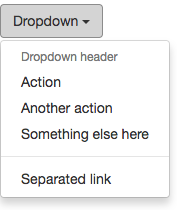

### 分割线

用于将多个链接分组。

```html
<ul class="dropdown-menu" aria-labelledby="dropdownMenuDivider">
  ...
  <li role="separator" class="divider"></li>
  ...
</ul>
```

### 禁用菜单项

为下拉菜单中的 `<li>` 元素添加 `.disabled` 类，从而禁用相应的菜单项。

```html
<ul class="dropdown-menu" aria-labelledby="dropdownMenu4">
  <li><a href="#">Regular link</a></li>
  <li class="disabled"><a href="#">Disabled link</a></li>
  <li><a href="#">Another link</a></li>
</ul>
```

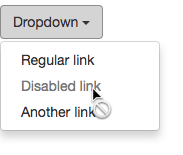

## 按钮组

通过按钮组容器(可以是`.btn-group`或者`.btn-toolbar`)把一组按钮放在同一行里。通过与[按钮插件](http://v3.bootcss.com/javascript/#buttons)联合使用，可以设置为单选框或多选框的样式和行为。

```html
<div class="btn-group" role="group" aria-label="...">
  <button type="button" class="btn btn-default">Left</button>
  <button type="button" class="btn btn-default">Middle</button>
  <button type="button" class="btn btn-default">Right</button>
</div>
```

### 按钮工具栏

把一组 `<div class="btn-group">` 组合进一个 `<div class="btn-toolbar">` 中就可以做成更复杂的组件。

```html
<div class="btn-toolbar" role="toolbar" aria-label="...">
    <div class="btn-group" role="group" aria-label="...">
        <button type="button" class="btn btn-default">1</button>
        <button type="button" class="btn btn-default">2</button>
        <button type="button" class="btn btn-default">3</button>
    </div>
    <div class="btn-group" role="group" aria-label="...">
        <button type="button" class="btn btn-default">a</button>
        <button type="button" class="btn btn-default">b</button>
        <button type="button" class="btn btn-default">c</button>
    </div>
    <div class="btn-group" role="group" aria-label="...">
        <button type="button" class="btn btn-default">Left</button>
        <button type="button" class="btn btn-default">Middle</button>
        <button type="button" class="btn btn-default">Right</button>
    </div>
</div>
```

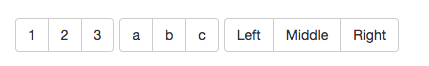

### 尺寸

只要给 `.btn-group` 加上 `.btn-group-*` 类，就省去为按钮组中的每个按钮都赋予尺寸类了，如果包含了多个按钮组时也适用。

### 嵌套

想要把下拉菜单混合到一系列按钮中，只须把 `.btn-group` 放入另一个 `.btn-group` 中。

### 垂直排列

添加`.btn-group-vertical`可以让一组按钮垂直堆叠排列显示。**分列式按钮下拉菜单（下拉按钮和显示区域分离的菜单）不支持这种方式。**

### 两端对齐排列的按钮组

让一组按钮拉长为相同的尺寸，填满父元素的宽度。对于按钮组中的按钮式下拉菜单也同样适用。

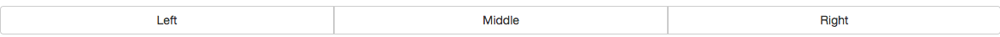

<p id="div-border-left-yellow">由于对两端对齐的按钮组使用了特定的 HTML 和 CSS （即 `display: table-cell`），两个按钮之间的边框叠加在了一起。在普通的按钮组中，`margin-left: -1px` 用于将边框重叠，而没有删除任何一个按钮的边框。然而，`margin` 属性不支持 `display: table-cell`。因此，根据你对 Bootstrap 的定制，你可以删除或重新为按钮的边框设置颜色。</p>

#### 关于a元素

只须将一系列 `.btn` 元素包裹到 `.btn-group.btn-group-justified` 中即可。

```html
<div class="btn-group btn-group-justified" role="group" aria-label="...">
    <a href="#" role="button" class="btn btn-default">Left</a>
    <a href="#" role="button" class="btn btn-default">Middle</a>
    <a href="#" role="button" class="btn btn-default">Right</a>
</div>
```

#### 关于button元素

为了将 `<button>` 元素用于两端对齐的按钮组中，**必须将每个按钮包裹进一个按钮组中**。大部分的浏览器不能将bootstrap的 CSS 应用到对齐的 `<button>` 元素上，但是，由于bootstrap支持按钮式下拉菜单，我们可以解决这个问题。

```html
<div class="btn-group btn-group-justified" role="group" aria-label="...">
  <div class="btn-group" role="group">
    <button type="button" class="btn btn-default">Left</button>
  </div>
  <div class="btn-group" role="group">
    <button type="button" class="btn btn-default">Middle</button>
  </div>
  <div class="btn-group" role="group">
    <button type="button" class="btn btn-default">Right</button>
  </div>
</div>
```

## 按钮式下拉菜单

按钮式下拉菜单依赖[下拉菜单插件](http://v3.bootcss.com/javascript/#dropdowns) ，因此需要将此插件包含在你所使用的 Bootstrap 版本中。

### 单按钮下拉菜单

只要改变一些基本的标记，就能把按钮变成下拉菜单的开关。

<p id="div-border-left-blue">感觉和上面的下拉菜单在功能上没什么区别</p>

```html
<div class="btn-group">
  <button type="button" class="btn btn-default dropdown-toggle" data-toggle="dropdown" aria-haspopup="true" aria-expanded="false">
    Action <span class="caret"></span>
  </button>
  <ul class="dropdown-menu">
    <li><a href="#">Action</a></li>
    <li><a href="#">Another action</a></li>
    <li><a href="#">Something else here</a></li>
    <li role="separator" class="divider"></li>
    <li><a href="#">Separated link</a></li>
  </ul>
</div>
```

### 分裂式按钮下拉菜单

```html
<div class="btn-group">
  <button type="button" class="btn btn-danger">Action</button>
  <button type="button" class="btn btn-danger dropdown-toggle" data-toggle="dropdown" aria-haspopup="true" aria-expanded="false">
    <span class="caret"></span>
    <span class="sr-only">Toggle Dropdown</span>
  </button>
  <ul class="dropdown-menu">
    <li><a href="#">Action</a></li>
    <li><a href="#">Another action</a></li>
    <li><a href="#">Something else here</a></li>
    <li role="separator" class="divider"></li>
    <li><a href="#">Separated link</a></li>
  </ul>
</div>
```

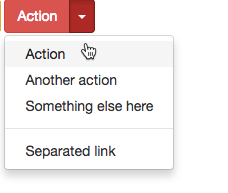

### 尺寸

通过给`<button>`添加`.btn-lg`、`.btn-sm`、`.btn-xs`来控制按钮大小。

```html
<!-- Large button group -->
<div class="btn-group">
  <button class="btn btn-default btn-lg dropdown-toggle" type="button" data-toggle="dropdown" aria-haspopup="true" aria-expanded="false">
    Large button <span class="caret"></span>
  </button>
  <ul class="dropdown-menu">
    ...
  </ul>
</div>

<!-- Small button group -->
<div class="btn-group">
  <button class="btn btn-default btn-sm dropdown-toggle" type="button" data-toggle="dropdown" aria-haspopup="true" aria-expanded="false">
    Small button <span class="caret"></span>
  </button>
  <ul class="dropdown-menu">
    ...
  </ul>
</div>

<!-- Extra small button group -->
<div class="btn-group">
  <button class="btn btn-default btn-xs dropdown-toggle" type="button" data-toggle="dropdown" aria-haspopup="true" aria-expanded="false">
    Extra small button <span class="caret"></span>
  </button>
  <ul class="dropdown-menu">
    ...
  </ul>
</div>
```

### 向上弹出式菜单

给父元素添加 `.dropup` 类就能使触发的下拉菜单朝上方打开。

```html
<div class="btn-group dropup">
  <button type="button" class="btn btn-default">Dropup</button>
  <button type="button" class="btn btn-default dropdown-toggle" data-toggle="dropdown" aria-haspopup="true" aria-expanded="false">
    <span class="caret"></span>
    <span class="sr-only">Toggle Dropdown</span>
  </button>
  <ul class="dropdown-menu">
    <!-- Dropdown menu links -->
  </ul>
</div>
```

## 输入框组

通过在文本输入框 `<input>` 前面、后面或是两边加上文字或按钮，可以实现对表单控件的扩展。

 `.input-group` 和 `.input-group-addon` 或 `.input-group-btn` 类一起使用，可以给 `.form-control` 的前面或后面添加额外的元素。

**不支持在输入框的单独一侧添加多个额外元素（`.input-group-addon `或 `.input-group-btn`）。**

**不支持在单个输入框组中添加多个表单控件。**

<p id="div-border-left-yellow">只支持`<input>`输入框。不要将表单组或栅格列（column）类直接和输入框组混合使用，需要将输入框组嵌套到表单组或栅格相关元素的内部。</p>

```html
<div class="input-group">
  <span class="input-group-addon" id="basic-addon1">@</span>
  <input type="text" class="form-control" placeholder="Username" aria-describedby="basic-addon1">
</div>

<div class="input-group">
  <input type="text" class="form-control" placeholder="Recipient's username" aria-describedby="basic-addon2">
  <span class="input-group-addon" id="basic-addon2">@example.com</span>
</div>

<div class="input-group">
  <span class="input-group-addon">$</span>
  <input type="text" class="form-control" aria-label="Amount (to the nearest dollar)">
  <span class="input-group-addon">.00</span>
</div>

<label for="basic-url">Your vanity URL</label>
<div class="input-group">
  <span class="input-group-addon" id="basic-addon3">https://example.com/users/</span>
  <input type="text" class="form-control" id="basic-url" aria-describedby="basic-addon3">
</div>
```

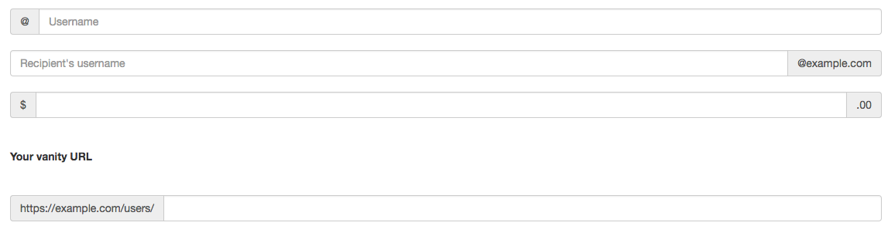

### 尺寸

为 `.input-group` 添加相应的尺寸类，其内部包含的元素将自动调整自身的尺寸。不需要为输入框组中的每个元素重复地添加控制尺寸的类。

```html
<div class="input-group input-group-lg">
  <span class="input-group-addon" id="sizing-addon1">@</span>
  <input type="text" class="form-control" placeholder="Username" aria-describedby="sizing-addon1">
</div>

<div class="input-group">
  <span class="input-group-addon" id="sizing-addon2">@</span>
  <input type="text" class="form-control" placeholder="Username" aria-describedby="sizing-addon2">
</div>

<div class="input-group input-group-sm">
  <span class="input-group-addon" id="sizing-addon3">@</span>
  <input type="text" class="form-control" placeholder="Username" aria-describedby="sizing-addon3">
</div>
```

### 作为额外元素的按钮

```html
<div class="row">
  <div class="col-lg-6">
    <div class="input-group">
      <div class="input-group-btn">
        <button type="button" class="btn btn-default dropdown-toggle" data-toggle="dropdown" aria-haspopup="true" aria-expanded="false">Action <span class="caret"></span></button>
        <ul class="dropdown-menu">
          <li><a href="#">Action</a></li>
          <li><a href="#">Another action</a></li>
          <li><a href="#">Something else here</a></li>
          <li role="separator" class="divider"></li>
          <li><a href="#">Separated link</a></li>
        </ul>
      </div><!-- /btn-group -->
      <input type="text" class="form-control" aria-label="...">
    </div><!-- /input-group -->
  </div><!-- /.col-lg-6 -->
  <div class="col-lg-6">
    <div class="input-group">
      <input type="text" class="form-control" aria-label="...">
      <div class="input-group-btn">
        <button type="button" class="btn btn-default dropdown-toggle" data-toggle="dropdown" aria-haspopup="true" aria-expanded="false">Action <span class="caret"></span></button>
        <ul class="dropdown-menu dropdown-menu-right">
          <li><a href="#">Action</a></li>
          <li><a href="#">Another action</a></li>
          <li><a href="#">Something else here</a></li>
          <li role="separator" class="divider"></li>
          <li><a href="#">Separated link</a></li>
        </ul>
      </div><!-- /btn-group -->
    </div><!-- /input-group -->
  </div><!-- /.col-lg-6 -->
</div><!-- /.row -->
```

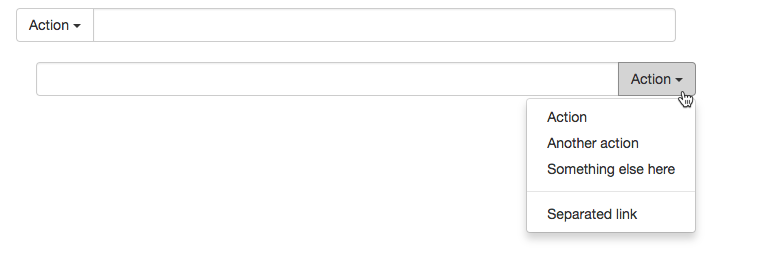

### 作为额外元素的分裂式按钮下拉菜单

```html
<div class="input-group">
    <div class="input-group-btn">
        <button type="button" class="btn btn-default">Action</button>
        <button type="button" class="btn btn-default dropdown-toggle" data-toggle="dropdown" aria-haspopup="true" aria-expanded="false">
            <span class="caret"></span>
            <span class="sr-only">Toggle Dropdown</span>
        </button>
        <ul class="dropdown-menu">
            <li><a href="#">Action</a></li>
            <li><a href="#">Another action</a></li>
            <li><a href="#">Something else here</a></li>
            <li role="separator" class="divider"></li>
            <li><a href="#">Separated link</a></li>
        </ul>
    </div>
    <input type="text" class="form-control" aria-label="...">
</div>

<div class="input-group">
    <input type="text" class="form-control" aria-label="...">
    <div class="input-group-btn">
        <button type="button" class="btn btn-default">Action</button>
        <button type="button" class="btn btn-default dropdown-toggle" data-toggle="dropdown" aria-haspopup="true" aria-expanded="false">
            <span class="caret"></span>
            <span class="sr-only">Toggle Dropdown</span>
        </button>
        <ul class="dropdown-menu">
            <li><a href="#">Action</a></li>
            <li><a href="#">Another action</a></li>
            <li><a href="#">Something else here</a></li>
            <li role="separator" class="divider"></li>
            <li><a href="#">Separated link</a></li>
        </ul>
    </div>
</div>
```

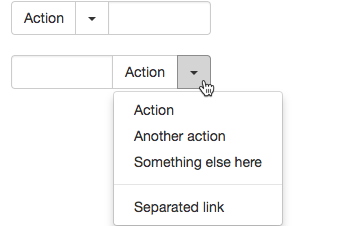

### 多个按钮

虽然每边只能有一个额外元素，但可以在单个`.input-group-btn`中有多个按钮。

```html
<div class="input-group">
    <input type="text" class="form-control" aria-label="...">
    <div class="input-group-btn">
        <button type="button" class="btn btn-default">Action</button>
        <button type="button" class="btn btn-default dropdown-toggle" data-toggle="dropdown" aria-haspopup="true" aria-expanded="false">
            <span class="caret"></span>
            <span class="sr-only">Toggle Dropdown</span>
        </button>
        <ul class="dropdown-menu">
            <li><a href="#">Action</a></li>
            <li><a href="#">Another action</a></li>
            <li><a href="#">Something else here</a></li>
            <li role="separator" class="divider"></li>
            <li><a href="#">Separated link</a></li>
        </ul>
    </div>
</div>
```

## 导航

Bootstrap 中的导航组件都依赖同一个 `.nav` 类，状态类也是共用的。改变修饰类可以改变样式。

### 标签页

注意 `.nav-tabs` 类依赖 `.nav` 基类。

```html
<ul class="nav nav-tabs">
  <li role="presentation" class="active"><a href="#">Home</a></li>
  <li role="presentation"><a href="#">Profile</a></li>
  <li role="presentation"><a href="#">Messages</a></li>
</ul>
```

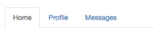

### 胶囊式标签页

HTML 标记相同，但使用 `.nav-pills` 类。

胶囊是标签页也是可以垂直方向堆叠排列的。只需添加 `.nav-stacked` 类。

```html
<ul class="nav nav-pills">
  <li role="presentation" class="active"><a href="#">Home</a></li>
  <li role="presentation"><a href="#">Profile</a></li>
  <li role="presentation"><a href="#">Messages</a></li>
</ul>

<ul class="nav nav-pills nav-stacked">
  <li role="presentation" class="active"><a href="#">Home</a></li>
  <li role="presentation"><a href="#">Profile</a></li>
  <li role="presentation"><a href="#">Messages</a></li>
</ul>
```

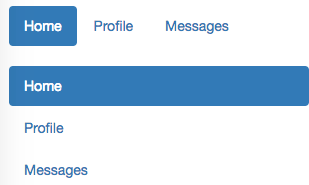

### 两端对齐的标签页

在大于 768px 的屏幕上，通过 `.nav-justified` 类可以很容易的让标签页或胶囊式标签呈现出同等宽度。在小屏幕上，导航链接呈现堆叠样式。

```html
<ul class="nav nav-tabs nav-justified">
    <li role="presentation" class="active"><a href="#">Home</a></li>
    <li role="presentation"><a href="#">Profile</a></li>
    <li role="presentation"><a href="#">Messages</a></li>
</ul>

<ul class="nav nav-pills nav-justified">
    <li role="presentation" class="active"><a href="#">Home</a></li>
    <li role="presentation"><a href="#">Profile</a></li>
    <li role="presentation"><a href="#">Messages</a></li>
</ul>
```

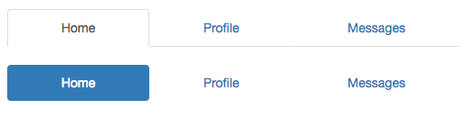

### 禁用的链接

对任何导航组件（标签页、胶囊式标签页），都可以添加 `.disabled` 类，从而实现**链接为灰色且没有鼠标悬停效果**。

这个类只改变 `<a>` 的外观，不改变功能。可以自己写 JavaScript 禁用这里的链接。

### 添加下拉菜单

#### 带下拉菜单的标签页

```html
<ul class="nav nav-tabs">
    <li role="presentation" class="active"><a href="#">Home</a></li>
    <li role="presentation"><a href="#">Profile</a></li>
    <li role="presentation"><a href="#">Messages</a></li>
    <li role="presentation" class="dropdown">
        <a class="dropdown-toggle" data-toggle="dropdown" href="#" role="button" aria-haspopup="true" aria-expanded="false">
            Dropdown <span class="caret"></span>
        </a>
        <ul class="dropdown-menu">
            <li role="presentation" class="active"><a href="#">Home</a></li>
            <li role="presentation"><a href="#">Profile</a></li>
            <li role="presentation"><a href="#">Messages</a></li>
        </ul>
    </li>
</ul>
```

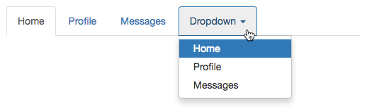

#### 带下拉菜单的胶囊式标签页

```html
<ul class="nav nav-pills">
    <li role="presentation" class="active"><a href="#">Home</a></li>
    <li role="presentation"><a href="#">Profile</a></li>
    <li role="presentation"><a href="#">Messages</a></li>
    <li role="presentation" class="dropdown">
        <a class="dropdown-toggle" data-toggle="dropdown" href="#" role="button" aria-haspopup="true"
           aria-expanded="false">
            Dropdown <span class="caret"></span>
        </a>
        <ul class="dropdown-menu">
            <li role="presentation" class="active"><a href="#">Home</a></li>
            <li role="presentation"><a href="#">Profile</a></li>
            <li role="presentation"><a href="#">Messages</a></li>
        </ul>
    </li>
</ul>
```

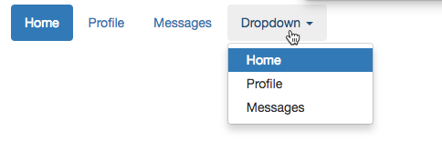


## 导航条

### 默认样式的导航条

导航条是在应用或网站中作为导航页头的响应式基础组件。它们在移动设备上可以折叠（并且可开可关），且在视口（viewport）宽度增加时逐渐变为水平展开。

导航条依赖 JavaScript 插件， JavaScript 被禁用，并且视口（viewport）足够窄，致使导航条折叠起来，导航条将不能被打开，`.navbar-collapse` 内所包含的内容也将不可见。

当浏览器视口（viewport）的宽度小于 `@grid-float-breakpoint` 值时，导航条内部的元素变为折叠排列，也就是变现为移动设备展现模式；当浏览器视口（viewport）的宽度大于 `@grid-float-breakpoint` 值时，导航条内部的元素变为水平排列，也就是变现为非移动设备展现模式。通过调整源码中的这个值，就可以控制导航条何时堆叠排列，何时水平排列。默认值是 `768px` （小屏幕 -- 或者说是平板 --的最小值，或者说是平板）。

<p id="div-border-left-yellow">由于 Bootstrap 并不知道你在导航条内放置的元素需要占据多宽的空间，你可能会遇到导航条中的内容折行的情况（也就是导航条占据两行）。解决办法如下：

1. 减少导航条内所有元素所占据的宽度。
2. 在某些尺寸的屏幕上（利用 [响应式工具类](http://v3.bootcss.com/css/#responsive-utilities)）隐藏导航条内的一些元素。
3. 修改导航条在水平排列和折叠排列互相转化时，触发这个转化的最小屏幕宽度值。可以通过修改 `@grid-float-breakpoint` 变量实现，或者自己重写相关的媒体查询代码，覆盖 Bootstrap 的默认值。</p>

```html
<nav class="navbar navbar-default">
  <div class="container-fluid">
    <!-- Brand and toggle get grouped for better mobile display -->
    <div class="navbar-header">
      <button type="button" class="navbar-toggle collapsed" data-toggle="collapse" data-target="#bs-example-navbar-collapse-1" aria-expanded="false">
        <span class="sr-only">Toggle navigation</span>
        <span class="icon-bar"></span>
        <span class="icon-bar"></span>
        <span class="icon-bar"></span>
      </button>
      <a class="navbar-brand" href="#">Brand</a>
    </div>

    <!-- Collect the nav links, forms, and other content for toggling -->
    <div class="collapse navbar-collapse" id="bs-example-navbar-collapse-1">
      <ul class="nav navbar-nav">
        <li class="active"><a href="#">Link <span class="sr-only">(current)</span></a></li>
        <li><a href="#">Link</a></li>
        <li class="dropdown">
          <a href="#" class="dropdown-toggle" data-toggle="dropdown" role="button" aria-haspopup="true" aria-expanded="false">Dropdown <span class="caret"></span></a>
          <ul class="dropdown-menu">
            <li><a href="#">Action</a></li>
            <li><a href="#">Another action</a></li>
            <li><a href="#">Something else here</a></li>
            <li role="separator" class="divider"></li>
            <li><a href="#">Separated link</a></li>
            <li role="separator" class="divider"></li>
            <li><a href="#">One more separated link</a></li>
          </ul>
        </li>
      </ul>
      <form class="navbar-form navbar-left">
        <div class="form-group">
          <input type="text" class="form-control" placeholder="Search">
        </div>
        <button type="submit" class="btn btn-default">Submit</button>
      </form>
      <ul class="nav navbar-nav navbar-right">
        <li><a href="#">Link</a></li>
        <li class="dropdown">
          <a href="#" class="dropdown-toggle" data-toggle="dropdown" role="button" aria-haspopup="true" aria-expanded="false">Dropdown <span class="caret"></span></a>
          <ul class="dropdown-menu">
            <li><a href="#">Action</a></li>
            <li><a href="#">Another action</a></li>
            <li><a href="#">Something else here</a></li>
            <li role="separator" class="divider"></li>
            <li><a href="#">Separated link</a></li>
          </ul>
        </li>
      </ul>
    </div><!-- /.navbar-collapse -->
  </div><!-- /.container-fluid -->
</nav>
```

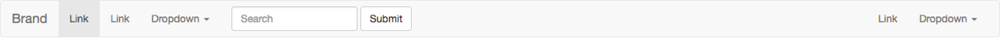

### 品牌图标

将导航条内放置品牌标志的地方替换为 `` 元素即可展示自己的品牌图标。由于 `.navbar-brand` 已经被设置了内补（padding）和高度（height），你需要根据自己的情况添加一些 CSS 代码从而覆盖默认设置。

```html
<nav class="navbar navbar-default">
  <div class="container-fluid">
    <div class="navbar-header">
      <a class="navbar-brand" href="#">
        
      </a>
    </div>
  </div>
</nav>
```

### 表单

将表单放置于 `.navbar-form` 之内可以呈现很好的垂直对齐，并在较窄的视口（viewport）中呈现折叠状态。 使用对齐选项可以规定其在导航条上出现的位置。

注意，`.navbar-form` 和 `.form-inline` 的大部分代码都一样，内部实现使用了 mixin。 **某些表单组件，例如输入框组，可能需要设置一个固定宽度，从而在导航条内有合适的展现。**

```html
<form class="navbar-form navbar-left" role="search">
  <div class="form-group">
    <input type="text" class="form-control" placeholder="Search">
  </div>
  <button type="submit" class="btn btn-default">Submit</button>
</form>
```

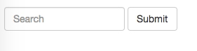

### 按钮

对于不包含在 `<form>` 中的 `<button>` 元素，加上 `.navbar-btn` 后，可以让它在导航条里垂直居中。

```html
<button type="button" class="btn btn-default navbar-btn">Sign in</button>
```

<p id="div-border-left-yellow">`.navbar-btn` 可以被用在 `<a>` 和 `<input>` 元素上。然而，在 `.navbar-nav` 内，`.navbar-btn` 和标准的按钮类都不应该被用在 `<a>` 元素上。</p>

### 文本

把文本包裹在 `.navbar-text`中时，为了有正确的行距和颜色，通常使用 `<p>` 标签。

```html
<p class="navbar-text">Signed in as Mark Otto</p>
```

### 非导航的链接

或许你希望在标准的导航组件之外添加标准链接，那么，使用 `.navbar-link` 类可以让链接有正确的默认颜色和反色设置。

```html
<nav class="navbar navbar-default">
    <div class="container-fluid">
        <div class="navbar-header">
            <p class="navbar-text navbar-right">Signed in as <a href="#" class="navbar-link">Mark Otto</a></p>
        </div>
    </div>
</nav>
```

### 组件排列

通过添加 `.navbar-left` 和 `.navbar-right` 工具类让导航链接、表单、按钮或文本对齐。两个类都会通过 CSS 设置特定方向的浮动样式。例如，要对齐导航链接，就要把它们放在个分开的、应用了工具类的 `<ul>` 标签里。

这些类是 `.pull-left` 和 `.pull-right` 的 mixin 版本，但是他们被限定在了媒体查询（media query）中，这样可以更容易的在各种尺寸的屏幕上处理导航条组件。

导航条目前不支持多个 `.navbar-right` 类。为了让内容之间有合适的空隙，为最后一个 `.navbar-right` 元素使用负边距（margin）。如果有多个元素使用这个类，它们的边距（margin）将不能按照你的预期正常展现。

```html
<nav class="navbar navbar-default">
    <div class="container-fluid">
        <p class="navbar-text navbar-right">Signed in as <a href="#" class="navbar-link">Mark Otto</a></p>
    </div>
</nav>
```

### 固定在顶部

添加 `.navbar-fixed-top` 类可以让导航条固定在顶部，还可包含一个 `.container` 或 `.container-fluid` 容器，从而让导航条居中，并在两侧添加内补（padding）。

<p id="div-border-left-red">这个固定的导航条会遮住页面上的其它内容，除非你给 `<body>` 元素底部设置了 `padding`。用你自己的值，或用`body { padding-top: 70px; }`都可以。提示：导航条的默认高度是 50px。</p>

```html
<nav class="navbar navbar-default navbar-fixed-top">
  <div class="container">
    ...
  </div>
</nav>
```

### 固定在底部

添加 `.navbar-fixed-bottom` 类可以让导航条固定在底部，并且还可以包含一个 `.container` 或 `.container-fluid` 容器，从而让导航条居中，并在两侧添加内补（padding）。

<p id="div-border-left-red">这个固定的导航条同样需要给`<body>`元素底部设置`padding`</p>

### 静止在顶部

通过添加 `.navbar-static-top` 类即可创建一个与页面等宽度的导航条，它会随着页面向下滚动而消失。还可以包含一个 `.container`或 `.container-fluid` 容器，用于将导航条居中对齐并在两侧添加内补（padding）。

与 `.navbar-fixed-*` 类不同的是，你不用给 `body` 添加任何内补（padding）。

### 反色导航条

通过添加 `.navbar-inverse` 类可以改变导航条的外观。

```html
<nav class="navbar navbar-inverse">
  ...
</nav>
```

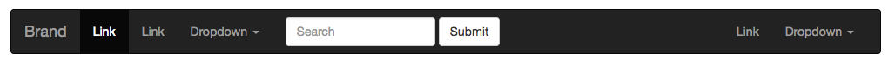

## 导航路径

通过添加`.breadcrumb`类，实现在一个带有层次的导航结构中标明当前页面的位置。

各路径间的分隔符已经自动通过 CSS 的 `:before` 和 `content` 属性添加了。

```html
<ol class="breadcrumb">
  <li><a href="#">Home</a></li>
  <li><a href="#">Library</a></li>
  <li class="active">Data</li>
</ol>
```

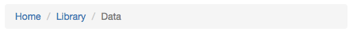

## 分页

### 默认分页

分页组件应该包裹在`<nav>`元素中，以将其标识为导航部分。

```html
<nav aria-label="Page navigation">
  <ul class="pagination">
    <li>
      <a href="#" aria-label="Previous">
        <span aria-hidden="true">&laquo;</span>
      </a>
    </li>
    <li><a href="#">1</a></li>
    <li><a href="#">2</a></li>
    <li><a href="#">3</a></li>
    <li><a href="#">4</a></li>
    <li><a href="#">5</a></li>
    <li>
      <a href="#" aria-label="Next">
        <span aria-hidden="true">&raquo;</span>
      </a>
    </li>
  </ul>
</nav>
```

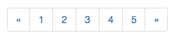

### 禁用和激活状态

链接在不同情况下可以定制。你可以给不能点击的链接添加 `.disabled` 类、给当前页添加 `.active` 类。

建议将 active 或 disabled 状态的链接（即 `<a>` 标签）替换为 `<span>` 标签，或者在向前/向后的箭头处省略`<a>` 标签，这样就可以让其保持需要的样式而不能被点击。

```html
<nav aria-label="...">
    <ul class="pagination">
        <li class="disabled">
            <span>
                <span aria-hidden="true">&laquo;</span>
            </span>
        </li>
        <li class="active">
            <span>1 <span class="sr-only">(current)</span></span>
        </li>
        <li class="disabled"><span>2</span></li>
        <li><a href="#">3</a></li>
        <li><a href="#">4</a></li>
        <li><a href="#">5</a></li>
    </ul>
</nav>
```

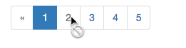

### 尺寸

`.pagination-lg` 或 `.pagination-sm` 类提供了额外可供选择的尺寸。

### 翻页

#### 默认实例

在默认的翻页中，链接居中对齐。

```html
<nav aria-label="...">
  <ul class="pager">
    <li><a href="#">Previous</a></li>
    <li><a href="#">Next</a></li>
  </ul>
</nav>
```


#### 对齐链接

通过添加`.next`和`.previous`类，可以把链接向两端对齐

```html
<nav aria-label="...">
  <ul class="pager">
    <li class="previous"><a href="#"><span aria-hidden="true">&larr;</span> Older</a></li>
    <li class="next"><a href="#">Newer <span aria-hidden="true">&rarr;</span></a></li>
  </ul>
</nav>
```

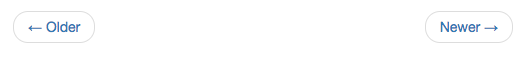

#### 可选的禁用状态

`.disabled` 类也可用于翻页中的链接。

```html
<nav aria-label="...">
  <ul class="pager">
    <li class="previous disabled"><a href="#"><span aria-hidden="true">&larr;</span> Older</a></li>
    <li class="next"><a href="#">Newer <span aria-hidden="true">&rarr;</span></a></li>
  </ul>
</nav>
```

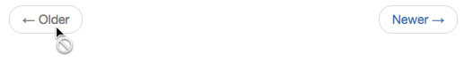

## 标签

```html
<h3>Example heading <span class="label label-default">New</span></h3>
```

### 可用的变体

```html
<span class="label label-default">Default</span>
<span class="label label-primary">Primary</span>
<span class="label label-success">Success</span>
<span class="label label-info">Info</span>
<span class="label label-warning">Warning</span>
<span class="label label-danger">Danger</span>
```

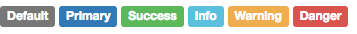

<p id="div-border-left-yellow">如果你有大量的设置为 `inline` 属性的标签全部放在一个较窄的容器元素内，在页面上展示这些标签就会出现问题，每个标签就会有自己的一个 `inline-block` 元素（就像图标一样）。解决的办法是为每个标签都设置为 `display: inline-block;` 属性。</p>

## 徽章

给链接、导航等元素嵌套 `<span class="badge">` 元素，可以很醒目的展示新的或未读的信息条目。

如果没有新的或未读的信息条目，也就是说不包含任何内容，徽章组件能够自动隐藏（通过CSS的 `:empty` 选择符实现，IE8不支持) 。

```html
<a href="#" style="margin: 20px">Inbox <span class="badge">42</span></a>
<a href="#" style="margin: 20px">Inbox <span class="badge"></span></a>

<button class="btn btn-primary" type="button" style="margin: 20px">
    Messages <span class="badge">4</span>
</button>
```

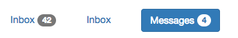

Bootstrap 提供了内置的样式，让胶囊式导航内处于激活状态的元素所包含的徽章展示相匹配的样式。

```html
<ul class="nav nav-pills" role="tablist">
  <li role="presentation" class="active"><a href="#">Home <span class="badge">42</span></a></li>
  <li role="presentation"><a href="#">Profile</a></li>
  <li role="presentation"><a href="#">Messages <span class="badge">3</span></a></li>
</ul>
```

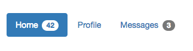

## 巨幕

这是一个轻量、灵活的组件，它能延伸至整个浏览器视口来展示网站上的关键内容。

```html
<div class="jumbotron">
  <h1>Hello, world!</h1>
  <p>...</p>
  <p><a class="btn btn-primary btn-lg" href="#" role="button">Learn more</a></p>
</div>
```

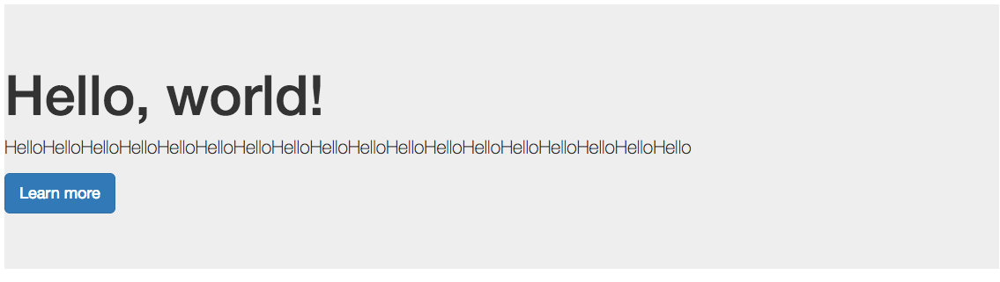

如果需要让巨幕组件的宽度与浏览器宽度一致并且没有圆角，请把此组件放在所有 `.container` 元素的外面，并在组件内部添加一个 `.container` 元素。

```html
<div class="jumbotron">
  <div class="container">
    ...
  </div>
</div>
```

## 页头

页头组件能够为 `<h1>` 标签增加适当的空间，并且与页面的其他部分形成一定的分隔。它支持 `<h1>` 标签内内嵌 `<small>` 元素的默认效果，还支持大部分其他组件（需要增加一些额外的样式）。

```html
<div class="page-header">
  <h1>Example page header <small>Subtext for header</small></h1>
</div>
```

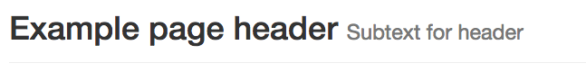

## 缩略图

通过缩略图组件扩展 Bootstrap 的 [栅格系统](http://v3.bootcss.com/css/#grid)，可以很容易地展示栅格样式的图像、视频、文本等内容。

### 默认样式

```html
<div class="row">
    <div class="col-xs-6 col-md-3">
        <a href="#" class="thumbnail">
            
        </a>
    </div>
    <div class="col-xs-6 col-md-3">
        <a href="#" class="thumbnail">
            
        </a>
    </div>
    <div class="col-xs-6 col-md-3">
        <a href="#" class="thumbnail">
            
        </a>
    </div>
    <div class="col-xs-6 col-md-3">
        <a href="#" class="thumbnail">
            
        </a>
    </div>
</div>
```

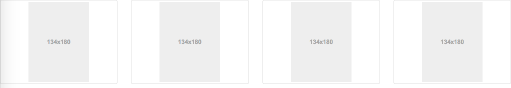

### 自定义内容

添加一点点额外的标签，就可以把任何类型的 HTML 内容，例如标题、段落或按钮，加入缩略图组件内。

```html
<div class="row">
    <div class="col-sm-6 col-md-4">
        <div class="thumbnail">
            
            <div class="caption">
                <h3>Thumbnail label</h3>
                <p>Cras justo odio, dapibus ac facilisis in, egestas eget quam. Donec id elit non mi porta gravida at eget metus. Nullam id dolor id nibh ultricies vehicula ut id elit.</p>
                <p><a href="#" class="btn btn-primary" role="button">Button</a> <a href="#" class="btn btn-default" role="button">Button</a></p>
            </div>
        </div>
    </div>
</div>
```

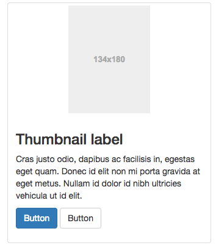

## 警告框

将任意文本和一个可选的关闭按钮组合在一起就能组成一个警告框，`.alert` 类是必须要设置的，另外还有特殊意义的4个类（例如，`.alert-success`），代表不同的警告信息。

```html
<div class="alert alert-success" role="alert">...</div>
<div class="alert alert-info" role="alert">...</div>
<div class="alert alert-warning" role="alert">...</div>
<div class="alert alert-danger" role="alert">...</div>
```

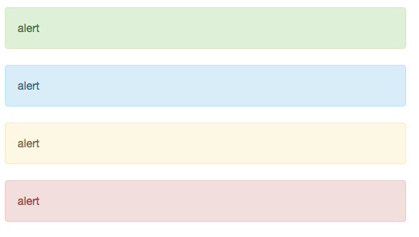

### 可关闭的警告框

为警告框添加一个可选的 `.alert-dismissible` 类和一个关闭按钮。

必须给 `<button>` 元素添加 `data-dismiss="alert"` 属性。

```html
<div class="alert alert-warning alert-dismissible" role="alert">
  <button type="button" class="close" data-dismiss="alert" aria-label="Close"><span aria-hidden="true">&times;</span></button>
  <strong>Warning!</strong> Better check yourself, you're not looking too good.
</div>
```

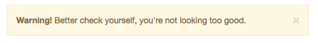

### 警告框中的链接

用 `.alert-link` 工具类，可以为链接设置与当前警告框相符的颜色。

```html
<div class="alert alert-success" role="alert">
    alert <a href="#" class="alert-link">alert</a>
</div>
<div class="alert alert-info" role="alert">
    alert <a href="#" class="alert-link">alert</a>
</div>
<div class="alert alert-warning" role="alert">
    alert <a href="#" class="alert-link">alert</a>
</div>
<div class="alert alert-danger" role="alert">
    alert <a href="#" class="alert-link">alert</a>
</div>
```

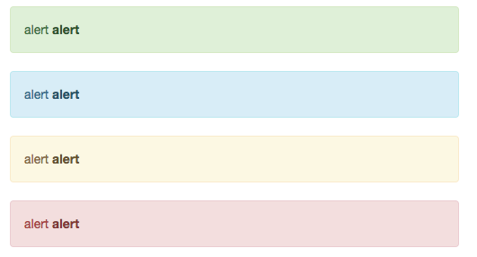

## 进度条

如果无法使用内联样式属性来设置进度条宽度，可以自定义JavaScript（设置element.style.width）或使用自定义CSS类。

```html
<div class="progress">
  <div class="progress-bar" role="progressbar" aria-valuenow="60" aria-valuemin="0" aria-valuemax="100" style="width: 60%;">
    <span class="sr-only">60% Complete</span>
  </div>
</div>
```


### 带有提示标签的进度条

将设置了 `.sr-only` 类的 `<span>` 标签从进度条组件中移除 类，从而让当前进度显示出来。

在展示很低的百分比时，如果需要让文本提示能够清晰可见，可以为进度条设置 `min-width` 属性。

```html
<div class="progress">
  <div class="progress-bar" role="progressbar" aria-valuenow="60" aria-valuemin="0" aria-valuemax="100" style="width: 60%;">
    60%
  </div>
</div>

<div class="progress">
  <div class="progress-bar" role="progressbar" aria-valuenow="0" aria-valuemin="0" aria-valuemax="100" style="min-width: 2em;">
    0%
  </div>
</div>
<div class="progress">
  <div class="progress-bar" role="progressbar" aria-valuenow="2" aria-valuemin="0" aria-valuemax="100" style="min-width: 2em; width: 2%;">
    2%
  </div>
</div>
```


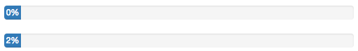

### 根据情景变化效果

通过添加`.progress-bar-success`、`.progress-bar-info`、`.progress-bar-warning`、`.progress-bar-danger`类，可以根据不同情境展现相应的效果。

```html
<div class="progress">
  <div class="progress-bar progress-bar-success" role="progressbar" aria-valuenow="40" aria-valuemin="0" aria-valuemax="100" style="width: 40%">
    <span class="sr-only">40% Complete (success)</span>
  </div>
</div>

<div class="progress">
  <div class="progress-bar progress-bar-info" role="progressbar" aria-valuenow="20" aria-valuemin="0" aria-valuemax="100" style="width: 20%">
    <span class="sr-only">20% Complete</span>
  </div>
</div>

<div class="progress">
  <div class="progress-bar progress-bar-warning" role="progressbar" aria-valuenow="60" aria-valuemin="0" aria-valuemax="100" style="width: 60%">
    <span class="sr-only">60% Complete (warning)</span>
  </div>
</div>

<div class="progress">
  <div class="progress-bar progress-bar-danger" role="progressbar" aria-valuenow="80" aria-valuemin="0" aria-valuemax="100" style="width: 80%">
    <span class="sr-only">80% Complete (danger)</span>
  </div>
</div>
```

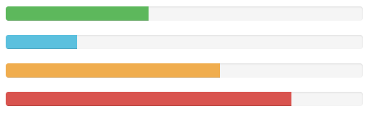

### 条纹效果

通过渐变可以为进度条创建条纹效果，IE9 及更低版本不支持。

```html
<div class="progress">
  <div class="progress-bar progress-bar-success progress-bar-striped" role="progressbar" aria-valuenow="40" aria-valuemin="0" aria-valuemax="100" style="width: 40%">
    <span class="sr-only">40% Complete (success)</span>
  </div>
</div>

<div class="progress">
  <div class="progress-bar progress-bar-info progress-bar-striped" role="progressbar" aria-valuenow="20" aria-valuemin="0" aria-valuemax="100" style="width: 20%">
    <span class="sr-only">20% Complete</span>
  </div>
</div>

<div class="progress">
  <div class="progress-bar progress-bar-warning progress-bar-striped" role="progressbar" aria-valuenow="60" aria-valuemin="0" aria-valuemax="100" style="width: 60%">
    <span class="sr-only">60% Complete (warning)</span>
  </div>
</div>

<div class="progress">
  <div class="progress-bar progress-bar-danger progress-bar-striped" role="progressbar" aria-valuenow="80" aria-valuemin="0" aria-valuemax="100" style="width: 80%">
    <span class="sr-only">80% Complete (danger)</span>
  </div>
</div>
```

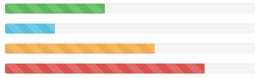

### 动画效果

为 `.progress-bar-striped` 添加 `.active` 类，使其呈现出由右向左运动的动画效果。IE9 及更低版本的浏览器不支持。

```html
<div class="progress">
  <div class="progress-bar progress-bar-striped active" role="progressbar" aria-valuenow="45" aria-valuemin="0" aria-valuemax="100" style="width: 45%">
    <span class="sr-only">45% Complete</span>
  </div>
</div>
```

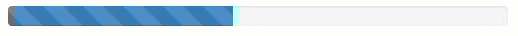

### 堆叠效果

把多个进度条放入同一个 `.progress` 中，使它们呈现堆叠的效果。

```html
<div class="progress">
  <div class="progress-bar progress-bar-success" style="width: 35%">
    <span class="sr-only">35% Complete (success)</span>
  </div>
  <div class="progress-bar progress-bar-warning progress-bar-striped" style="width: 20%">
    <span class="sr-only">20% Complete (warning)</span>
  </div>
  <div class="progress-bar progress-bar-danger" style="width: 10%">
    <span class="sr-only">10% Complete (danger)</span>
  </div>
</div>
```

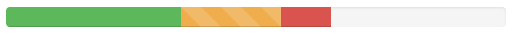


## 媒体对象

这是一个抽象的样式，用以构建不同类型的组件，这些组件都具有在文本内容的左或右侧对齐的图片（就像博客评论或 Twitter 消息等）。

### 默认样式

默认样式的媒体对象组件允许在一个内容块的左边或右边展示一个多媒体内容（图像、视频、音频）。

`.pull-left` 和 `.pull-right` 这两个类以前也曾经被用在了媒体组件上，但是，从 v3.3.0 版本开始，他们就不再被建议使用了。`.media-left` 和 `.media-right` 替代了他们，不同之处是，在 html 结构中， `.media-right` 应当放在 `.media-body` 的后面。

```html
<div class="media">
    <div class="media-left">
        <a href="#">
            
        </a>
    </div>
    <div class="media-body">
        <h4 class="media-heading">Media heading</h4>
        MediaMediaMedia
    </div>
</div>
```

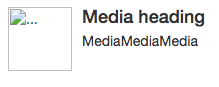

### 对齐

图片或其他媒体类型可以顶部、中部或底部对齐。默认是顶部对齐。

```html
<div class="media">
    <div class="media-left media-middle">
        <a href="#">
            
        </a>
    </div>
    <div class="media-body">
        <h4 class="media-heading">Middle aligned media</h4>
        <h4 class="media-heading">Middle aligned media</h4>
        <h4 class="media-heading">Middle aligned media</h4>
        <h4 class="media-heading">Middle aligned media</h4>
    </div>
</div>

<div class="media">
    <div class="media-left media-top">
        <a href="#">
            
        </a>
    </div>
    <div class="media-body">
        <h4 class="media-heading">Middle aligned media</h4>
        <h4 class="media-heading">Middle aligned media</h4>
        <h4 class="media-heading">Middle aligned media</h4>
        <h4 class="media-heading">Middle aligned media</h4>
    </div>
</div>

<div class="media">
    <div class="media-left media-bottom">
        <a href="#">
            
        </a>
    </div>
    <div class="media-body">
        <h4 class="media-heading">Middle aligned media</h4>
        <h4 class="media-heading">Middle aligned media</h4>
        <h4 class="media-heading">Middle aligned media</h4>
        <h4 class="media-heading">Middle aligned media</h4>
    </div>
</div>
```

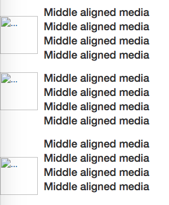

### 媒体对象列表

用一点点额外的标记，就能在列表内使用媒体对象组件（对评论或文章列表很有用）。

```html
<ul class="media-list">
  <li class="media">
    <div class="media-left">
      <a href="#">
        
      </a>
    </div>
    <div class="media-body">
      <h4 class="media-heading">Media heading</h4>
      ...
    </div>
  </li>
</ul>
```

## 列表组

最简单的列表组仅仅是一个带有多个列表条目的无序列表，另外还需要设置适当的类。bootstrap提供了一些预定义的样式，可以根据自身的需求通过 CSS 自己定制。

```html
<ul class="list-group">
  <li class="list-group-item">Cras justo odio</li>
  <li class="list-group-item">Dapibus ac facilisis in</li>
  <li class="list-group-item">Morbi leo risus</li>
  <li class="list-group-item">Porta ac consectetur ac</li>
  <li class="list-group-item">Vestibulum at eros</li>
</ul>
```

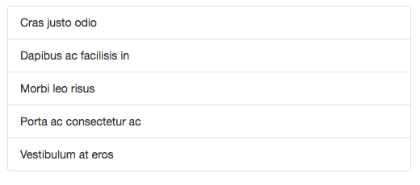

### 徽章

给列表组加入徽章组件，它会自动被放在右边。

```html
<ul class="list-group">
  <li class="list-group-item">
    <span class="badge">14</span>
    Cras justo odio
  </li>
</ul>
```

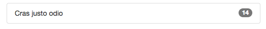

### 链接

用 `<a>` 标签代替 `<li>` 标签可以组成一个全部是链接的列表组（还要注意的是，需要将 `<ul>` 标签替换为 `<div>` 标签）。没必要给列表组中的每个元素都加一个父元素。

```html
<div class="list-group">
  <a href="#" class="list-group-item active">
    Cras justo odio
  </a>
  <a href="#" class="list-group-item">Dapibus ac facilisis in</a>
  <a href="#" class="list-group-item">Morbi leo risus</a>
  <a href="#" class="list-group-item">Porta ac consectetur ac</a>
  <a href="#" class="list-group-item">Vestibulum at eros</a>
</div>
```

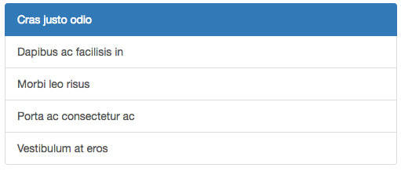

### 按钮

列表组中的元素也可以直接就是按钮（也同时意味着父元素必须是 `<div>` 而不能用 `<ul>` 了），并且无需为每个按钮单独包裹一个父元素。**注意不要使用标准的 .btn 类！**

```html
<div class="list-group">
  <button type="button" class="list-group-item">Cras justo odio</button>
  <button type="button" class="list-group-item">Dapibus ac facilisis in</button>
  <button type="button" class="list-group-item">Morbi leo risus</button>
  <button type="button" class="list-group-item">Porta ac consectetur ac</button>
  <button type="button" class="list-group-item">Vestibulum at eros</button>
</div>
```

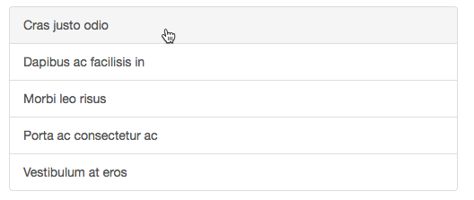

### 被禁用的条目

为 `.list-group-item` 添加 `.disabled` 类可以让单个条目显示为灰色，表现出被禁用的效果。

```html
<div class="list-group">
  <a href="#" class="list-group-item disabled">
    Cras justo odio
  </a>
  <a href="#" class="list-group-item">Dapibus ac facilisis in</a>
  <a href="#" class="list-group-item">Morbi leo risus</a>
  <a href="#" class="list-group-item">Porta ac consectetur ac</a>
  <a href="#" class="list-group-item">Vestibulum at eros</a>
</div>
```

### 情景类

为列表中的条目添加情境类，默认样式或链接列表都可以。还可以为列表中的条目设置 `.active` 状态。

```html
<ul class="list-group">
  <li class="list-group-item list-group-item-success">Dapibus ac facilisis in</li>
  <li class="list-group-item list-group-item-info">Cras sit amet nibh libero</li>
  <li class="list-group-item list-group-item-warning">Porta ac consectetur ac</li>
  <li class="list-group-item list-group-item-danger">Vestibulum at eros</li>
</ul>
<div class="list-group">
  <a href="#" class="list-group-item list-group-item-success">Dapibus ac facilisis in</a>
  <a href="#" class="list-group-item list-group-item-info">Cras sit amet nibh libero</a>
  <a href="#" class="list-group-item list-group-item-warning">Porta ac consectetur ac</a>
  <a href="#" class="list-group-item list-group-item-danger">Vestibulum at eros</a>
</div>
```

### 定制内容

列表组中的每个元素都可以是任何 HTML 内容，甚至是像下面的带链接的列表组。

```html
<div class="list-group">
  <a href="#" class="list-group-item active">
    <h4 class="list-group-item-heading">List group item heading</h4>
    <p class="list-group-item-text">...</p>
  </a>
</div>
```

## 面版

默认的 `.panel` 组件所做的只是设置基本的边框（border）和内补（padding）来包含内容。

```html
<div class="panel panel-default">
  <div class="panel-body">
    Basic panel example
  </div>
</div>
```

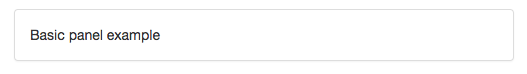

### 带标题的面版

通过 `.panel-heading` 可以很简单地为面板加入一个标题容器。你也可以通过添加设置了 `.panel-title` 类的 `<h1>`-`<h6>` 标签，添加一个预定义样式的标题。不过，`<h1>`-`<h6>` 标签的字体大小将被 `.panel-heading`的样式所覆盖。

为了给链接设置合适的颜色，务必将链接放到带有 `.panel-title` 类的标题标签内。

```html
<div class="panel panel-default">
  <div class="panel-heading">Panel heading without title</div>
  <div class="panel-body">
    Panel content
  </div>
</div>

<div class="panel panel-default">
  <div class="panel-heading">
    <h3 class="panel-title">Panel title</h3>
  </div>
  <div class="panel-body">
    Panel content
  </div>
</div>
```

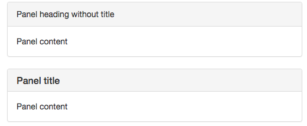

### 带脚注的面版

把按钮或次要的文本放入 `.panel-footer` 容器内。注意面版的脚注**不会**从情境效果中继承颜色，因为他们并不是主要内容。

```html
<div class="panel panel-default">
  <div class="panel-body">
    Panel content
  </div>
  <div class="panel-footer">Panel footer</div>
</div>
```

### 情景效果

像其他组件一样，可以简单地通过加入有情境效果的状态类，给特定的内容使用更针对特定情境的面版。

```html
<div class="panel panel-primary">...</div>
<div class="panel panel-success">...</div>
<div class="panel panel-info">...</div>
<div class="panel panel-warning">...</div>
<div class="panel panel-danger">...</div>
```

### 带表格的面版

为面板中不需要边框的表格添加 `.table` 类，是整个面板看上去更像是一个整体设计。如果是带有 `.panel-body` 的面板，我们为表格的上方添加一个边框，看上去有分隔效果。

如果没有 `.panel-body` ，面版标题会和表格连接起来，没有空隙。

```html
<div class="panel panel-default">
    <!-- Default panel contents -->
    <div class="panel-heading">Panel heading</div>
    <div class="panel-body">
        <p>...</p>
    </div>

    <!-- Table -->
    <table class="table">
        <thead>
        <tr>
            <th>#</th>
            <th>first name</th>
            <th>last name</th>
            <th>username</th>
        </tr>
        </thead>
        <tbody>
        <tr>
            <td>1</td>
            <td>cheng</td>
            <td>tang</td>
            <td>tc9011</td>
        </tr>
        <tr>
            <td>2</td>
            <td>jie</td>
            <td>zhou</td>
            <td>jay</td>
        </tr>
        <tr>
            <td>3</td>
            <td>mark</td>
            <td>down</td>
            <td>md</td>
        </tr>
        </tbody>
    </table>
</div>
```

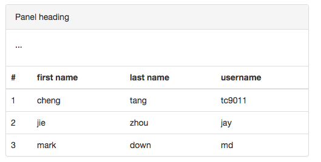

### 带列表组的面版

```html
<div class="panel panel-default">
  <!-- Default panel contents -->
  <div class="panel-heading">Panel heading</div>
  <div class="panel-body">
    <p>...</p>
  </div>

  <!-- List group -->
  <ul class="list-group">
    <li class="list-group-item">Cras justo odio</li>
    <li class="list-group-item">Dapibus ac facilisis in</li>
    <li class="list-group-item">Morbi leo risus</li>
    <li class="list-group-item">Porta ac consectetur ac</li>
    <li class="list-group-item">Vestibulum at eros</li>
  </ul>
</div>
```

## 具有响应式特性的嵌入内容

根据被嵌入内容的外部容器的宽度，自动创建一个固定的比例，从而让浏览器自动确定视频或 slideshow 的尺寸，能够在各种设备上缩放。

这些规则被直接应用在 `<iframe>`、`<embed>`、`<video>` 和 `<object>` 元素上。如果你希望让最终样式与其他属性相匹配，还可以明确地使用一个派生出来的 `.embed-responsive-item` 类。

<p id="div-border-left-red">不需要为 `<iframe>` 元素设置 `frameborder="0"` 属性，因为bootstrap已经替你这样做了。</p>

```html
<!-- 16:9 aspect ratio -->
<div class="embed-responsive embed-responsive-16by9">
  <iframe class="embed-responsive-item" src="..."></iframe>
</div>

<!-- 4:3 aspect ratio -->
<div class="embed-responsive embed-responsive-4by3">
  <iframe class="embed-responsive-item" src="..."></iframe>
</div>
```

## Well

### 默认效果

把 Well 用在元素上，就能有嵌入（inset）的简单效果。

```html
<div class="well">well</div>
```

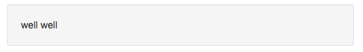

### 可选类/样式

通过`.well-lg`和`.well-sm`这两种可选修饰类，可以控制此组件的内补（padding）和圆角的设置。

```html
<div class="well well-lg">...</div>
<div class="well well-sm">...</div>
```

