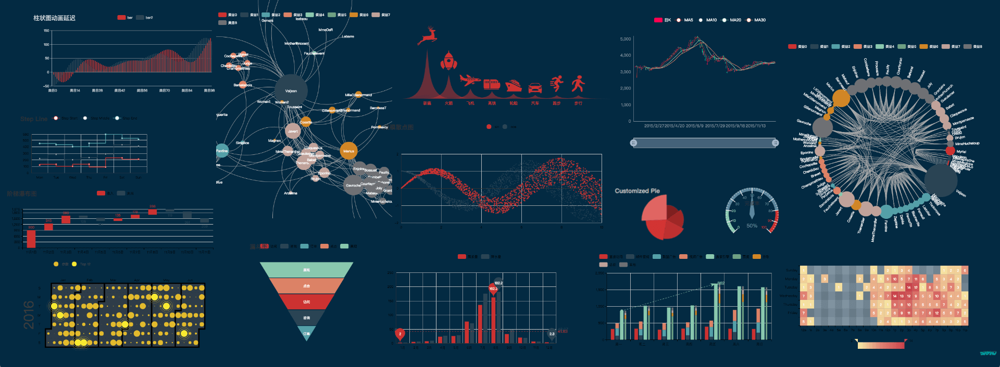

<!--more-->

[官网动态数据实例](http://echarts.baidu.com/gallery/editor.html?c=dynamic-data)中展示了数据动态变化的案例，这个如何移植到Angular2中去呢？首先要读懂官网的这个例子，不然会有坑。

## 官网案例分析

首先，数据处理和图表生成最好放在一起，根据官网的例子，在设置定时器之前，对应的配置项中已经设定好10个数据，而定时器，只是向对应的配置项中不断删除第一个数据，然后push新的数据。官网原话如下：

> 设置图表实例的配置项以及数据，万能接口，所有参数和数据的修改都可以通过`setOption`完成，ECharts 会合并新的参数和数据，然后刷新图表。如果开启[动画](http://echarts.baidu.com/api.html#option.html#option.animation)的话，ECharts 找到两组数据之间的差异然后通过合适的动画去表现数据的变化。

其次，`myChart`这个变量要设置为全局变量，不然每次echarts会重新复制图表，而不是像官网例子一样，呈现出向左推送的效果。

```javascript
<!DOCTYPE html>
<html style="height: 100%">
   <head>
       <meta charset="utf-8">
   </head>
   <body style="height: 100%; margin: 0">
       <div id="container" style="height: 100%"></div>
       <script type="text/javascript" src="http://echarts.baidu.com/gallery/vendors/echarts/echarts-all-3.js"></script>
       <script type="text/javascript" src="http://echarts.baidu.com/gallery/vendors/echarts/extension/dataTool.min.js"></script>
       <script type="text/javascript" src="http://echarts.baidu.com/gallery/vendors/echarts/map/js/china.js"></script>
       <script type="text/javascript" src="http://echarts.baidu.com/gallery/vendors/echarts/map/js/world.js"></script>
       <script type="text/javascript" src="http://api.map.baidu.com/api?v=2.0&ak=ZUONbpqGBsYGXNIYHicvbAbM"></script>
       <script type="text/javascript" src="http://echarts.baidu.com/gallery/vendors/echarts/extension/bmap.min.js"></script>
       <script type="text/javascript">
var dom = document.getElementById("container");
var myChart = echarts.init(dom);
var app = {};
option = null;
option = {
    title: {
        text: '动态数据',
        subtext: '纯属虚构'
    },
    tooltip: {
        trigger: 'axis'
    },
    legend: {
        data:['最新成交价', '预购队列']
    },
    toolbox: {
        show: true,
        feature: {
            dataView: {readOnly: false},
            restore: {},
            saveAsImage: {}
        }
    },
    dataZoom: {
        show: false,
        start: 0,
        end: 100
    },
    xAxis: [
        {
            type: 'category',
            boundaryGap: true,
            data: (function (){
                var now = new Date();
                var res = [];	//预先设置好初始值
                var len = 10;	//定义x轴数据个数
                while (len--) {
                    res.unshift(now.toLocaleTimeString().replace(/^\D*/,''));
                    now = new Date(now - 2000);
                }
                return res;
            })()
        },
        {
            type: 'category',
            boundaryGap: true,
            data: (function (){
                var res = [];
                var len = 10;
                while (len--) {
                    res.push(len + 1);
                }
                return res;
            })()
        }
    ],
    yAxis: [
        {
            type: 'value',
            scale: true,
            name: '价格',
            max: 30,
            min: 0,
            boundaryGap: [0.2, 0.2]
        },
        {
            type: 'value',
            scale: true,
            name: '预购量',
            max: 1200,
            min: 0,
            boundaryGap: [0.2, 0.2]
        }
    ],
    series: [
        {
            name:'预购队列',
            type:'bar',
            xAxisIndex: 1,
            yAxisIndex: 1,
            data:(function (){
                var res = [];
                var len = 10;
                while (len--) {
                    res.push(Math.round(Math.random() * 1000));
                }
                return res;
            })()
        },
        {
            name:'最新成交价',
            type:'line',
            data:(function (){
                var res = [];
                var len = 0;
                while (len < 10) {
                    res.push((Math.random()*10 + 5).toFixed(1) - 0);
                    len++;
                }
                return res;
            })()
        }
    ]
};

app.count = 11;
setInterval(function (){
    axisData = (new Date()).toLocaleTimeString().replace(/^\D*/,'');

    var data0 = option.series[0].data;
    var data1 = option.series[1].data;
    data0.shift();		//数组去头
    data0.push(Math.round(Math.random() * 1000));//推送新的数据
    data1.shift();
    data1.push((Math.random() * 10 + 5).toFixed(1) - 0);

    option.xAxis[0].data.shift();
    option.xAxis[0].data.push(axisData);
    option.xAxis[1].data.shift();
    option.xAxis[1].data.push(app.count++);

    myChart.setOption(option);
}, 2100);
;
if (option && typeof option === "object") {
    myChart.setOption(option, true);
}
       </script>
   </body>
</html>
```

## 移植到ANgular2

首先创建一个`dynamic-line.component.ts`文件，`@Component`装饰器和import按照自己需求配置好。在class中先定义一些全局变量，并配置好echarts的option：

```typescript
  url:any;
  id:string;
  userdata:any;
  dom:any;
  myoption:any;
  myChart:any;

  option:any = {
    tooltip: {
      show: true,
      trigger: 'axis'
    },
    toolbox: {
      show: true,
      feature: {
        dataZoom: {show: true},
        restore: {show: true},
        saveAsImage: {show: true}
      }
    },
    legend: {
      selectedMode: true,
      selected: {},
      right: '0px',
      top: '80px',
      orient: 'vertical',
      textStyle: {
        fontSize: 12,
      },
      show: true,
      data: []
    },
    xAxis: {
      data: [],
      axisLabel: {
        interval: 0,
      }
    },
    grid: {
      left: '9%',
      x2: 150,
    },
    yAxis: [
      {
        type: 'value',
        name: '',
      }
    ],
    series: []
  };
```

然后从外部传入url，以供echarts读取数据和刷新：

```typescript
@Input() url:any;
```

设置从后端获取数据的函数（获取数据后，因为后端数据有点乱，为了方便，我把数据重新处理了一下，定义了一个`setMyoption()`的函数，把处理后的数据，用json对象的形式存放在`myoption`这个变量中）：

```typescript
  getUrlData() {
    let that = this;
   //从接口获取数据(省略)
    that.userdata = ......
  }
  setMyoption() {
    let that = this;
    that.myoption = {
      "data": []
    };
	//处理数据后，存放在data中(省略)
  }
```

根据数据配置legend，因为legend不需要刷新，所以独立成单独的函数：

```typescript
setLegend() {
    let legend = [];
   
    //把数据处理后push到legend数组中（省略）；
    
    that.option.legend.data = legend;
  }
```

设置配置option中x轴数据和series数据：

```typescript
setDataToOption() {
  //把数据处理后push到xaxis的data数组和series数组中（省略）
}
```

设置生成echarts的函数：

```typescript
 createCharts() {
    let that = this;
    that.dom = document.getElementById(that.id);
    that.myChart = echarts.init(that.dom, 'macarons');
    that.myChart.setOption(that.option);
  }
```

接下来在`ngAfterViewInit`中调用相关函数，让页面加载完后显示echarts：

```typescript
 ngAfterViewInit() {
    let that = this;
    that.myUrl = that.url;      //把导入的url赋值给myUrl
    that.getUrlData();
    that.setMyoption();
    
    //清空原始数组
    that.option.legend.data = [];
    that.option.series.data = [];
    that.option.xAxis.data = [];
    that.option.series = [];
    
    //配置Legend
    that.setLegend();
    
    //配置option
    that.setDataToOption();

    //调用echarts画图
    that.createCharts();	
   //走到这步就已经把echarts初始化好了，下面要对特定的数据进行动态推送
    
    //动态推送
    setInterval(function () {
      that.setDynamicData();
    }, 6000)
  }
```

下面就设置动态推送数据的函数：

```typescript
setDynamicData() {
  	let that = this;
    let xaxisData = that.option.xAxis.data;
  
    that.getUrlData();	//读取的数据中不包含之前的数据
    that.setMyoption();
    for (let i = 0; i < that.userdata.length; i++) { //多个数据一个个推送
      let time = that.myoption.data[0].systime[i];
      xaxisData.shift();
      xaxisData.push(time);
      for (let n = 0; n < that.option.series.length; n++) {
        let pushData = that.myoption.data[n].value[i];
        that.option.series[n].data.shift();
        that.option.series[n].data.push(pushData);
      }
      that.myChart.setOption(that.option);  //mychart必须是全局变量
    }  
}
```


