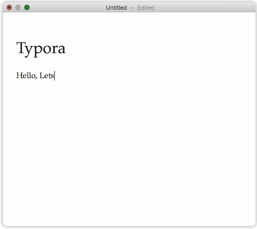
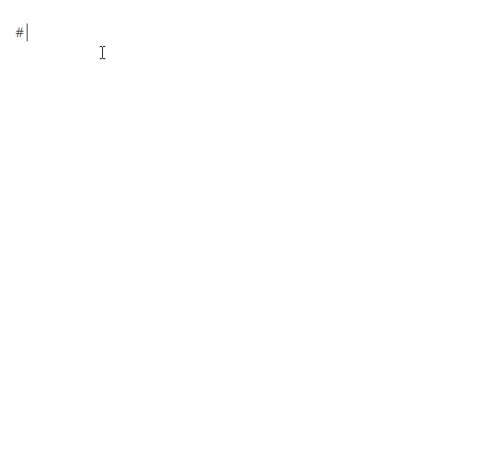
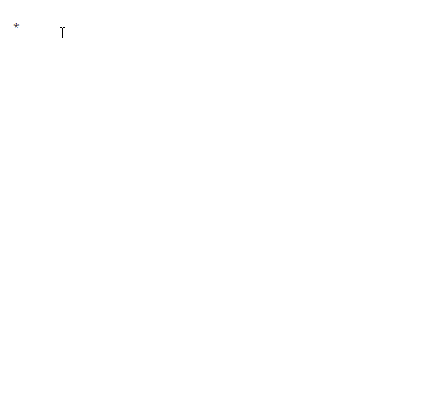
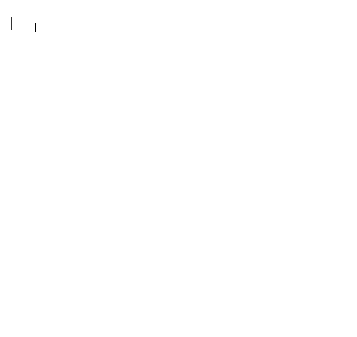
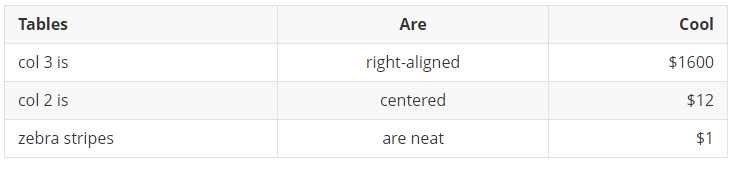
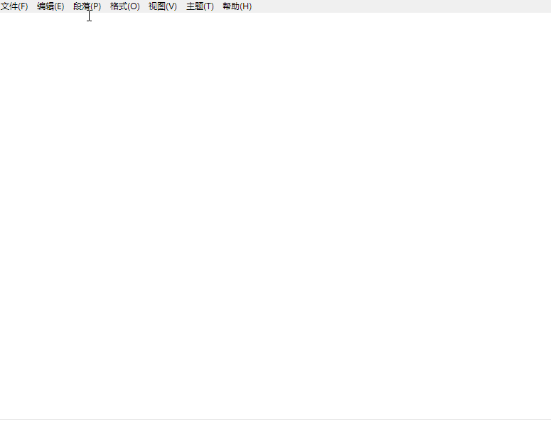
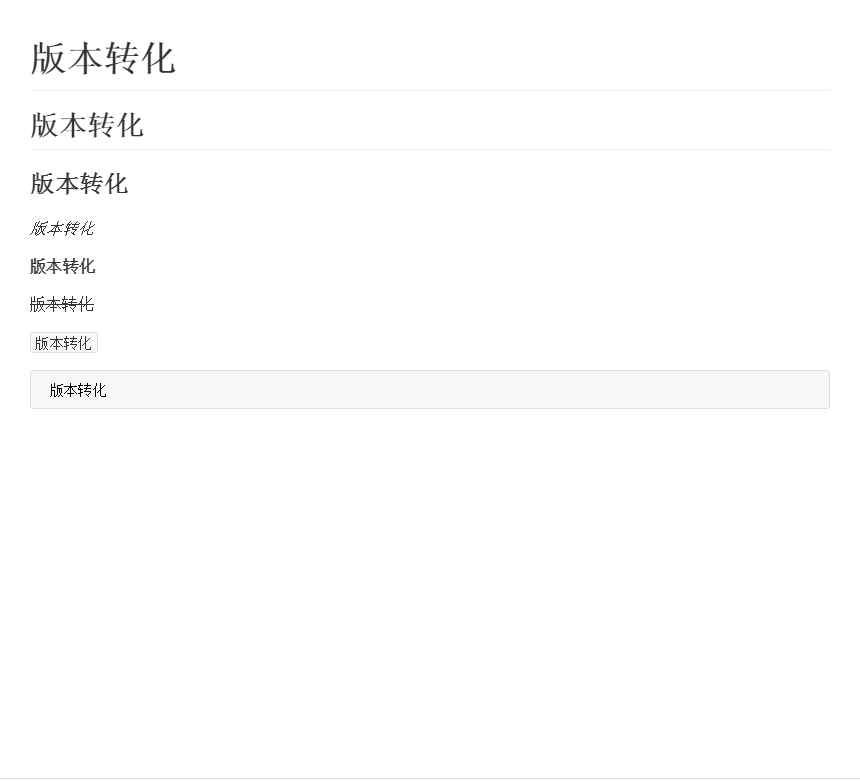
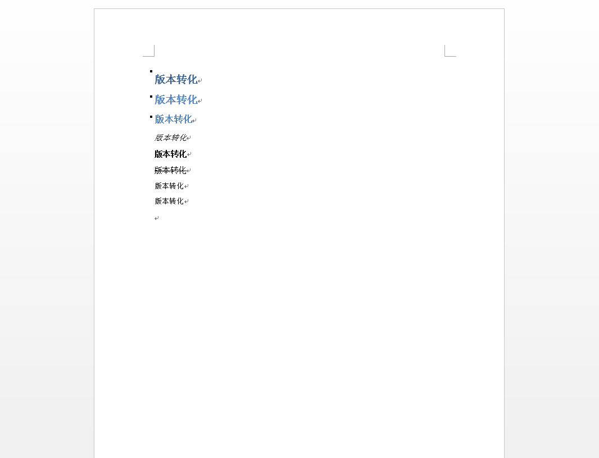

<!--more-->

## 什么是Markdown

> Markdown是一种可以使用普通文本编辑器编写的标记语言，通过简单的标记语法，它可以使普通文本内容具有一定的格式。它的优点很多，目前也被越来越多的写作爱好者，撰稿者广泛使用。看到这里请不要被「标记」、「语言」所迷惑，Markdown 的语法十分简单。常用的标记符号也不超过十个，这种相对于更为复杂的HTML 标记语言来说，Markdown 可谓是十分轻量的，学习成本也不需要太多，且一旦熟悉这种语法规则，会有一劳永逸的效果。

### 官方文档

[*创始人 John Gruber 的 Markdown 语法说明*](http://daringfireball.net/projects/markdown/syntax)

[*Markdown 中文版语法说明*](http://wowubuntu.com/markdown/#list)

## Markdown工具

一般写文章大家会用word，那写makdown用什么呢？

### mac平台

收费的有： [Ulysses Ⅲ](http://www.ulyssesapp.com/)， [Mou](http://mouapp.com/) ，[Bear](http://www.bear-writer.com/)

免费的有：[Typora](https://typora.io/)

### Windows平台

免费的有：[Typora](https://typora.io/)，[MarkdownPad](http://www.markdownpad.com/)，[MarkPad](http://code52.org/DownmarkerWPF/)


这里推荐使用[Typora](https://typora.io/)，通吃Windows、mac和Linux三大平台。Typora 在 Markdown 的基础上，保持了应有的简洁和优雅，又一定程度地改良了 Markdown 本身较为不合理和烦琐的地方，适度地引入一些高级的编辑功能，使得一切都觉得如此顺手。



## Markdown语法

### 标题

在 Markdown 中，如果一段文字被定义为标题，只要在这段文字前加 `#` 号即可。

`# 一级标题`

`## 二级标题`

`### 三级标题`

以此类推，总共六级标题，建议在井号后加一个空格，这是最标准的 Markdown 语法。



### 列表

在文字前加上 `-` 或 `*` 即可变为无序列表，有序列表则直接在文字前加 `1.` `2.` `3.`符号要和文字之间加上一个字符的空格。



### 引用

只需要在文本前加入 `>` 这种尖括号（大于号）即可显示引用格式。



### 图片与连接

插入链接与插入图片的语法很像，区别在一个 `!`号

插入图片的地址需要图床，这里推荐 [u图床](http://lzqup.com/) （mac）和[MPic](http://mpic.lzhaofu.cn/) （Windows）的服务，生成URL地址即可。

在Typora中支持把图片拖拽进去，自动生成Markdown格式。


### 粗体与斜体

Markdown 的粗体和斜体也非常简单，用两个 `*` 包含一段文本就是粗体的语法，用一个 `*` 包含一段文本就是斜体的语法。

### 代码框

用两个 ` 把中间的代码包裹起来。


### 代码块

输入三个`\``，选择语言，然后输入代码，你会发现代码块中的代码自动高亮。


### 分割线

分割线的语法只需要另起一行，连续输入三个星号 `***` 即可。


### 表格

Markdown 写表格比较累人。

```markdown
| Tables        | Are           | Cool  |
| ------------- |:-------------:| -----:|
| col 3 is      | right-aligned | $1600 |
| col 2 is      | centered      |   $12 |
| zebra stripes | are neat      |    $1 |
```

生成的表格如下：



但是Typora中提供了比较方便的写表格的方法。通过菜单栏或快捷键 Command+T 可以插入表格，Typora 会弹出一个表格插入设置，你可以预先设定好行数和列数，确定后表格就出现了。每一列上面还有三个按钮，可以控制本列的文字向左、居中、向右对齐。甚至，你可以点击左上角改变表格的行数和列数。



### 删除线

用`~~`包围住文字：


Markdown还支持直接写HTML，例如`#标题`等价于`<h1>标题</h1>`。

## 格式转化

在Typora的file—>Export中可以把md格式文件转化成pdf、word、html等格式文件。转word需要安装插件： **[Download Page](https://github.com/jgm/pandoc/releases/latest)**。

md格式：



转化成word格式：




