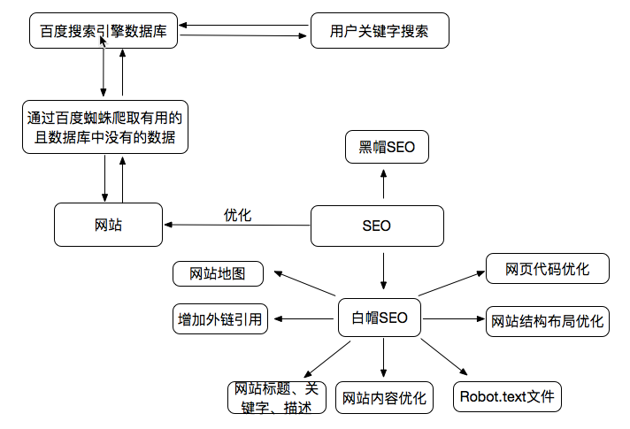

 

《SEO在网页制作中的应用》与《Yahoo军规》课程总结

<!--more-->

## SEO与搜索引擎

首先SEO是什么：

> SEO是由英文Search Engine Optimization缩写而来， 中文意译为“搜索引擎优化”。SEO是指通过站内优化（比如网站结构调整、网站内容建设、网站代码优化等）以及站外优化（比如网站站外推广、网站品牌建设等），使网站满足搜索引擎收录排名需求，在搜索引擎中提高关键词排名，从而吸引精准用户进入网站，获得免费流量，产生直接销售或品牌推广。

根据课程内容我自己画了上面这张图，这里以百度搜索引擎为例子说明一下，百度搜索引擎数据库通过百度蜘蛛爬取互联网上数据，这些数据是搜索引擎数据库中没有的，且有用的数据，理想状态下，用户输入关键字搜索，百度通过搜素引擎数据库中与关键字最匹配的结果返回给用户。

百度蜘蛛怎么才能更好的爬取数据呢，这就要通过网站的SEO，让网站用百度蜘蛛听得懂的语言和它交流，让它能更了解你的网站。SEO分为白帽SEO和黑帽SEO。黑帽SEO通过伪装让搜索引擎以为网站和某个关键字有联系，但实际上并没有；白帽SEO则通过上图列出的方法，让网站用百度蜘蛛听得懂的语言更好的去与搜索引擎交流。

## 网站结构与代码优化

* 结构布局优化：用扁平化结构

网站结构层次越少越容易被蜘蛛获取，中小型网站，目录层次结构超过3层，蜘蛛就不愿意往下爬。

* 控制首页链接数量

首页链接数量不能太少也不能太多，中小型企业首页链接在100个以内，例如：页面导航、底部导航、锚文字链接等。

* 扁平化目录层次

网站的设计不要用纵线性的结构。

* 导航SEO优化

尽量用文字，如果是图片，alt和title必须要有，面包屑导航（一般页面左上角的XX>>XX>>XX就是，便于了解当前位置和返回）。

* 页码

页码尽量用

> 首页 1 2 3 下一页

或者

> 首页 1 2 3 4  下拉菜单

这样方便蜘蛛抓取内容。

* 页面布局

左边正文，右边放热门文章和相关文章。

* 网速

控制页面不要超过100k，不然加载太慢。

* 网页代码

1. `<title>`标题
2. `<meta keywords>`关键词
3. `<meta description>`网页描述
4. HTML标签语义化
5. `<a>`要有title，对于指向其他网站的链接要写`rel="nofollow"`
6. `<h1>`用于正文标题，副级标题用`<h2>`
7. `<table>`标签要写`<caption>表格标题</caption>`
8. ``标签应使用alt说明
9. `<strong>`的权重>`<em>`的权重，如果只为加粗斜体效果建议用`<b>`和`<i>`标签
10. 重要内容HTML代码放在最前面
11. 重要内容不要用JS输出
12. 尽少使用iframe框架
13. 谨慎使用`display:none`，不想显示的内容可以用`z-index`或者显示在浏览器显示范围之外。蜘蛛会过滤掉`display:none`中的内容

## Yahoo军规

* 尽量减少HTTP的请求数

可以将图片合并、JavaScript代码合并、css样式合并

* 使用CDN（内容分发网络）

> CDN:内容分发网络。意思是尽可能避开互联网上有可能影响数据传输速度和稳定性的瓶颈和环节，使内容传输的更快、更稳定。

用简单的话说就是，在离你最近的地方，放置一台性能好链接顺畅的副本服务器，让你能够以最近的距离，最快的速度获取内容。

* 添加Expire/Cache-Control头

> expire头的内容是一个时间值，值就是资源在本地的过期时间、存在本地。在本地缓存阶段，找到一个对应的资源值，当前时间还没超过资源的过期时间，就直接使用这一个资源，不会发送http请求。
>
> Cache-Control是http协议中常用的头部之一，顾名思义，他是负责控制页面的缓存机制，如果该头部指示缓存，缓存的内容也会存在本地，操作流程和expire相似，但也有不同的地方，Cache-Control有更多的选项，也有更多的处理方式

* 启用Gzip压缩

将HTML、JavaScript、CSS、PHP等文件进行Gzip压缩，可以显著减小文件的体积。

* 将CSS放在页面最上方

避免页面出现空白或者闪烁，提高浏览器的渲染性能。

* 将Script放在页面最下面

先将内容呈现出来，不会让用户等太久。

* 避免在CSS中使用Expressions

在CSS中用了JavaScript的计算式，在页面显示和缩放、页面滚动、移动鼠标时CSS Expressions都会重新计算一次，严重影响性能。

* 把JS和CSS都放到外部文件中

JS和CSS单独提取出来，提高了JS和CSS的复用性，减少页面体积，提高了JS和CSS的可维护性；JS和CSS内置可以减少页面请求，提高页面渲染，若JS和CSS很少、只应用于一个页面或者不经常被访问到时可以这样使用。两者各有优势，灵活取用。

* 减少DNS查询

当缓存时间长时，减少DNS的重复查找，节省时间；当缓存时间短时，及时的检测网站服务器的变化，保证准确性。

* 压缩JavaScript和CSS

可以去除不必要的空白符、格式符、注释符，简写方法名、参数名压缩JS脚本。

* 避免重定向

> 重定向：用户的原始请求被重新转向到了其他请求

重定向状态码：301 Moved Permanently，表示用户请求的页面被移动到了另一个位置，客户端收到这个后会重新发起一次请求，是永久重定向；302 Found，表示用户请求的页面被找到了，但不在原始位置，服务器会返回一个地址，客户端会重新发起一次请求，是临时重定向。

用301重定向可以使搜索引擎识别，更新新的地址；用302总是会先找到旧地址再跳到新地址。

* 移除重复的脚本
* 配置实体标签（ETag）

ETag属于HTTP协议，是使用特殊的字符串来标识某个请求资源版本，如果客户端缓存中的版本和服务器中的版本一致，服务器就不需要再传递。

* 使用AJAX缓存

post请求每次都执行，不被缓存；get请求时同一地址不重复执行，可以被缓存。

看完这两课觉得以前自己码的东西还有很多要修改的，前端之路，任重而道远。
