<!--more-->

> 本文是[Sass中文网](http://www.sass.hk/)、慕课网[Sass入门篇 ](http://www.imooc.com/learn/311)和 [Sass进阶篇](http://www.imooc.com/learn/436)、阮一峰[SASS用法指南](http://www.ruanyifeng.com/blog/2012/06/sass.html)的学习笔记。

## Sass简介

### 什么是Sass

[Sass 官网](http://sass-lang.com/)上是这样描述 Sass 的：

> Sass 是一门高于 CSS 的元语言，它能用来清晰地、结构化地描述文件样式，有着比普通 CSS 更加强大的功能。
Sass 能够提供更简洁、更优雅的语法，同时提供多种功能来创建可维护和管理的样式表。

Sass 是采用 **Ruby **语言编写的一款 CSS 预处理语言，它诞生于2007年，是最大的成熟的 CSS 预处理语言。最初它是为了配合 HAML（一种缩进式 HTML 预编译器）而设计的，因此有着和 HTML 一样的缩进式风格。

### Sass和SCSS的区别

Sass 和 SCSS 其实是同一种东西，我们平时都称之为 Sass，两者之间不同之处有以下两点：

1. 文件扩展名不同，Sass 是以`.sass`后缀为扩展名，而 SCSS 是以`.scss`后缀为扩展名
2. 语法书写方式不同，Sass 是以严格的缩进式语法规则来书写，不带大括号`{}`和分号`;`，而 SCSS 的语法书写和我们的 CSS 语法书写方式非常类似。

例如：

Sass：

```scss
$font-stack: Helvetica, sans-serif  //定义变量
$primary-color: #333 //定义变量

body
  font: 100% $font-stack
  color: $primary-color
```

SCSS:

```scss
$font-stack: Helvetica, sans-serif;
$primary-color: #333;

body {
  font: 100% $font-stack;
  color: $primary-color;
}
```

### Sass/SCSS和纯CSS写法的区别

Sass 和 CSS 写法的确存在一定的差异，由于 Sass 是基于 Ruby 写出来，所以其延续了 Ruby 的书写规范。在书写 Sass 时不带有大括号和分号，其主要是依靠严格的缩进方式来控制的。

SCSS 和 CSS 写法无差别，这也是 Sass 后来越来越受大众喜欢原因之一。简单点说，把你现有的`.css`文件直接修改成`.scss`即可使用。

## Sass安装

`sass`基于`Ruby`语言开发而成，因此安装`sass`前需要[安装Ruby](http://rubyinstaller.org/downloads)。

mac下自带Ruby无需在安装Ruby。

window下先从官网[下载Ruby](http://rubyinstaller.org/downloads)并安装。安装过程中请注意勾选`Add Ruby executables to your PATH`添加到系统环境变量。

安装完成后需测试安装有没有成功,运行以下命令，下图表示已经安装成功：

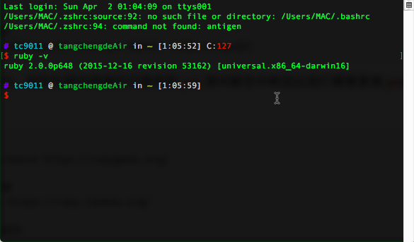

然后安装Sass和Compass，安装需要通过`gem`源，国内可以更换成淘宝源，更换过程参考[Sass官网](http://www.sass.hk/install/)，要安装最新版本的`Sass`和`Compass`，需要输入下面的命令：

```shell
sudo gem install sass
sudo gem install compass
```

安装成功后运行下面命令来确认应用已经正确地安装到了电脑中：

```shell
sass -v
Sass 3.4.23 (Selective Steve)

compass -v
Compass 1.0.3 (Polaris)
Copyright (c) 2008-2017 Chris Eppstein
Released under the MIT License.
Compass is charityware.
Please make a tax deductable donation for a worthy cause: http://umdf.org/compass
```

如下sass常用更新、查看版本、sass命令帮助等命令：

```shell
//更新sass
gem update sass

//查看sass版本
sass -v

//查看sass帮助
sass -h

//删除sass
gem uninstall sass
```

## Sass编译

Sass 的编译有多种方法：

- 命令编译
- GUI工具编译
- 自动化编译

### 命令编译

#### 单文件编译

```shell
//单文件转换命令
sass input.scss output.css

//单文件监听命令
sass --watch input.scss:output.css
```

#### 多文件编译

```shell
//如果你有很多的sass文件的目录，你也可以告诉sass监听整个目录：
sass --watch app/sass:public/stylesheets
```

#### 命令编译配置选项

```shell
//编译格式,--style表示解析后的css是什么排版格式;
  sass内置有四种编译格式:nested,expanded,compact,compressed
sass --watch input.scss:output.css --style compact

//编译添加调试map,--sourcemap表示开启sourcemap调试。开启sourcemap调试后，会生成一个后缀名为.css.map文件。
sass --watch input.scss:output.css --sourcemap

//选择编译格式并添加调试map
sass --watch input.scss:output.css --style expanded --sourcemap

//开启debug信息
sass --watch input.scss:output.css --debug-info
```

#### 四种编译排版格式

##### nested(嵌套)编译排版格式

```scss
//未编译样式
.box {
  width: 300px;
  height: 400px;
  &-title {
    height: 30px;
    line-height: 30px;
  }
}

/*命令行内容*/
sass style.scss:style.css --style nested

/*编译过后样式*/
.box {
  width: 300px;
  height: 400px; }
  .box-title {
    height: 30px;
    line-height: 30px; }
```

##### expanded(展开)编译排版格式

```scss
//未编译样式
.box {
  width: 300px;
  height: 400px;
  &-title {
    height: 30px;
    line-height: 30px;
  }
}

/*命令行内容*/
sass style.scss:style.css --style expanded

/*编译过后样式*/
.box {
  width: 300px;
  height: 400px;
}
.box-title {
  height: 30px;
  line-height: 30px;
}
```

##### compact(紧凑)编译排版格式

```scss
//未编译样式
.box {
  width: 300px;
  height: 400px;
  &-title {
    height: 30px;
    line-height: 30px;
  }
}

/*命令行内容*/
sass style.scss:style.css --style compact

/*编译过后样式*/
.box { width: 300px; height: 400px; }
.box-title { height: 30px; line-height: 30px; }
```

##### compressed(压缩)编译排版格式

```scss
//未编译样式
.box {
  width: 300px;
  height: 400px;
  &-title {
    height: 30px;
    line-height: 30px;
  }
}

/*命令行内容*/
sass style.scss:style.css --style compressed

/*编译过后样式*/
.box{width:300px;height:400px}.box-title{height:30px;line-height:30px}
```

### GUI工具编译

对于 GUI 界面编译工具，目前较为流行的主要有：

1. [Koala](http://koala-app.com/)
2. [Compass.app](http://compass.kkbox.com/)
3. [Scout](http://mhs.github.io/scout-app/)
4. [CodeKit](https://incident57.com/codekit/index.html)
5. [Prepros](https://prepros.io/)

这里推荐[koala](http://www.sass.hk/skill/koala-app.html)&[codekit](http://incident57.com/codekit/),其中koala是免费编译器，简单操作如下图:

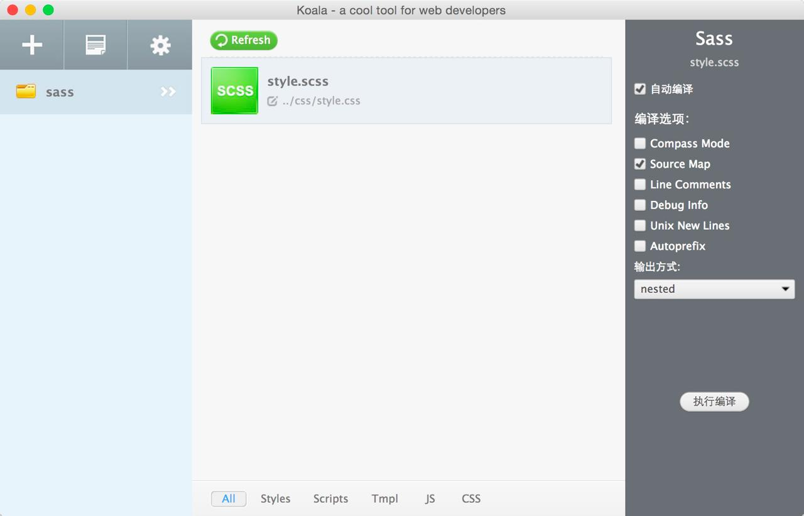

### 自动化编译

通过Grunt和Gulp来配置Sass编译，具体请看[[Sass]自动化编译](http://www.imooc.com/code/6380)，这里我只写一下在webstorm下的自动化编译。

在webstorm的设置中搜索`File Watcher`，然后在mac中webstorm自动会添加ruby中的scss文件，其他配置默认，然后点击ok就可以。

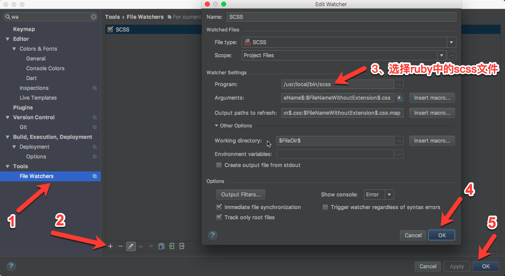

<p id="div-border-left-red">项目所在的路径中请不要出现中文，不然sass在编译是会出现编码错误。并且在Sass的编译的过程中，是不是支持`GBK`编码的。所以在创建 Sass 文件时，就需要将文件编码设置为`utf-8`。</p>

### Sass调试

#### CSS调试

首先，先讲一下css的调试，在chrome中打开开发者工具，在sources中右击选择`add folder to workspace`，选择所要调试的项目文件夹，浏览器弹出提示框，选择允许，这时候就可以看到浏览器sources中有项目的文件夹：

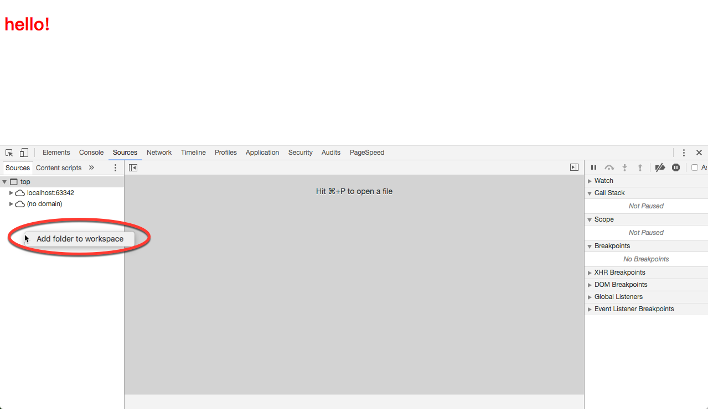

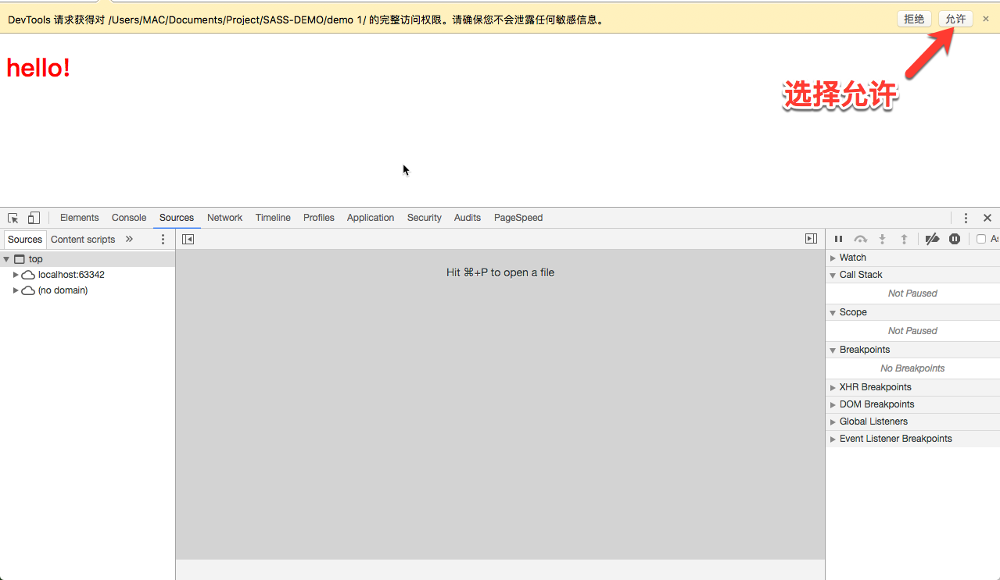

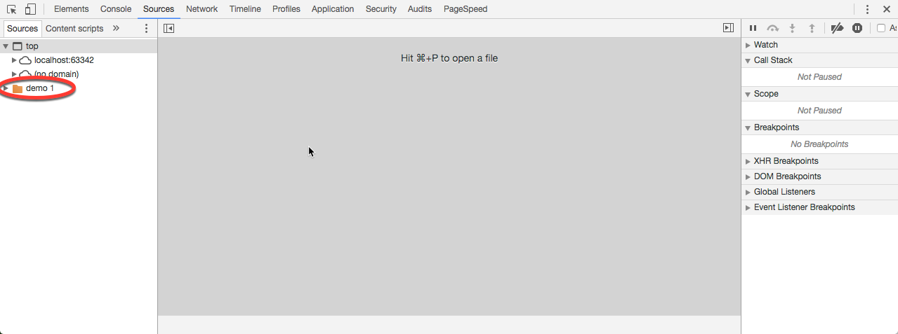

这时候需要把localhost中的项目文件夹和导入的文件夹关联起来：

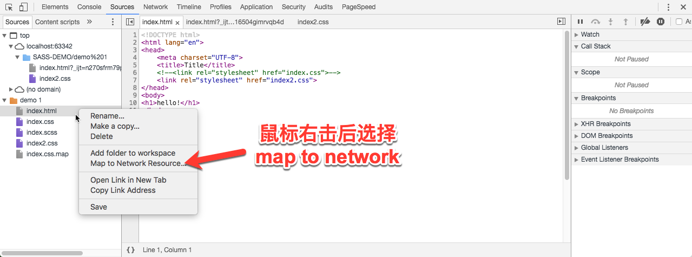

这时候会弹出一个选择框，选择chrome自动匹配到的文件：

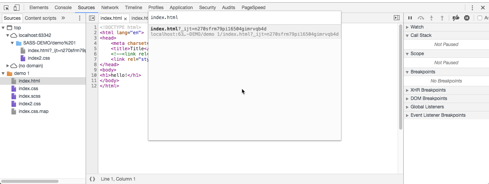

这时候就匹配上了，chrome还会提示你其他文件匹配，选择enable就行：

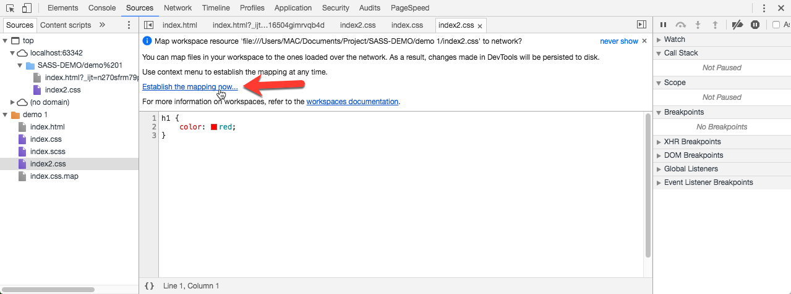

这时候在导入的项目文件夹中修改css样式，浏览器会立刻生效，按`command+s`或者`ctrl+s`后，webstorm中源代码也会修改：

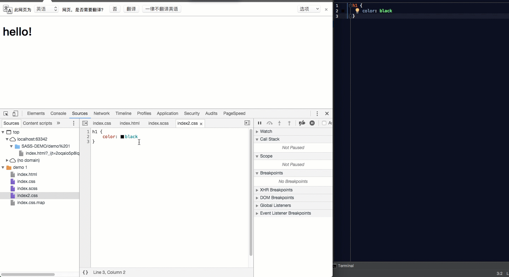


#### Sass调试

和css调试一样，直接修改Sass或者SCSS文件，保存后webstorm和浏览器同步更新。

## Sass的基本特性

### 使用变量

`sass`使用`$`符号来标识变量，Sass 的变量包括三个部分：

1. 声明变量的符号“$”
2. 变量名称
3. 赋予变量的值

```scss
$highlight-color: #F90;
```

任何可以用作`css`属性值的赋值都 可以用作`sass`的变量值，甚至是以空格分割的多个属性值或以逗号分割的多个属性值:

```scss
$basic-border: 1px solid black;
$plain-font: "Myriad Pro"、Myriad、"Helvetica Neue"、Helvetica、"Liberation Sans"、Arial和sans-serif; sans-serif;
```

当变量定义在`css`规则块内，那么该变量只能在此规则块内使用，将局部变量转换为全局变量可以添加 `!global` 声明：

```scss
$nav-color: #F90;
nav {
  $width: 100px;
  width: $width;
  color: $nav-color;
}
#main {
  $width: 5em !global;
  width: $width;
}

#sidebar {
  width: $width;
}
//编译后
nav {
  width: 100px;
  color: #F90;
}

#main {
  width: 5em; }

#sidebar {
  width: 5em; }
```

如果值后面加上!default则表示默认值:

```scss
$btn-primary-border : darken($btn-primary-bg, 5%) !default;
```

sass 的默认变量一般是用来设置默认值，然后根据需求来覆盖的，覆盖的方式也很简单，只需要在默认变量之前重新声明下变量即可：

```scss
$baseLineHeight: 2;
$baseLineHeight: 1.5 !default;
body{
    line-height: $baseLineHeight; 
}

//编译后
body{
    line-height:2;
}
```

凡是`css`属性的标准值可存在的地方，变量就可以使用。

在声明变量时，变量值也可以引用其他变量。

```scss
$highlight-color: #F90;
$highlight-border: 1px solid $highlight-color;
.selected {
  border: $highlight-border;
}

//编译后
.selected {
  border: 1px solid #F90;
}
```

`sass`的变量名可以与`css`中的属性名和选择器名称相同，包括中划线和下划线，并且这两种用法相互兼容：

```scss
$link-color: blue;
a {
  color: $link_color;
}

//编译后
a {
  color: blue;
}
```

### 嵌套

Sass 的嵌套分为三种：

- 选择器嵌套
- 属性嵌套
- 伪类嵌套

#### 选择器嵌套

Sass 允许将一套 CSS 样式嵌套进另一套样式中，内层的样式将它外层的选择器作为父选择器，例如：

```scss
#main p {
  color: #00ff00;
  width: 97%;

  .redbox {
    background-color: #ff0000;
    color: #000000;
  }
}
//编译后
#main p {
  color: #00ff00;
  width: 97%; }
  #main p .redbox {
    background-color: #ff0000;
    color: #000000; }
```

#### 属性嵌套

有些 CSS 属性遵循相同的命名空间 (namespace)，比如 `font-family, font-size, font-weight` 都以 `font` 作为属性的命名空间。为了便于管理这样的属性，同时也为了避免了重复输入，Sass 允许将属性嵌套在命名空间中，例如：

```scss
.funky {
  font: {
    family: fantasy;
    size: 30em;
    weight: bold;
  }
}

//编译后
.funky {
  font-family: fantasy;
  font-size: 30em;
  font-weight: bold; }
```

命名空间也可以包含自己的属性值，例如：

```scss
.funky {
  font: 20px/24px {
    family: fantasy;
    weight: bold;
  }
}

//编译后
.funky {
  font: 20px/24px;
    font-family: fantasy;
    font-weight: bold; }
```

#### 伪类嵌套

其实伪类嵌套和属性嵌套非常类似，只不过他需要借助`&`符号一起配合使用。例如：

```scss
.clearfix{
&:before,
&:after {
    content:"";
    display: table;
  }
&:after {
    clear:both;
    overflow: hidden;
  }
}

//编译后
.clearfix:before, .clearfix:after {
  content: "";
  display: table; }
.clearfix:after {
  clear: both;
  overflow: hidden; }
```

##### 父级选择器&

`&` 代表嵌套规则外层的父选择器，编译后的 CSS 文件中 `&` 将被替换成嵌套外层的父选择器，如果含有多层嵌套，最外层的父选择器会一层一层向下传递：

```scss
#main {
  color: black;
  a {
    font-weight: bold;
    &:hover { color: red; }
  }
}

//编译后
#main {
  color: black; }
  #main a {
    font-weight: bold; }
    #main a:hover {
      color: red; }
```

`&` 必须作为选择器的第一个字符，其后可以跟随后缀生成复合的选择器，例如:

```scss
#main {
  color: black;
  &-sidebar { border: 1px solid; }
}

//编译后
#main {
  color: black; }
  #main-sidebar {
    border: 1px solid; }
```

当父选择器含有不合适的后缀时，Sass 将会报错。

<p id="div-border-left-yellow">**避免选择器嵌套：**

- 选择器嵌套最大的问题是将使最终的代码难以阅读。开发者需要花费巨大精力计算不同缩进级别下的选择器具体的表现效果。
- 选择器越具体则声明语句越冗长，而且对最近选择器的引用(&)也越频繁。在某些时候，出现混淆选择器路径和探索下一级选择器的错误率很高，这非常不值得。</p>

### 混合指令

混合指令（Mixin）用于定义可重复使用的样式，避免了使用无语意的 class。混合指令可以包含所有的 CSS 规则，绝大部分 Sass 规则，甚至通过参数功能引入变量，输出多样化的样式。

#### 定义混合指令

混合指令的用法是在 `@mixin` 后添加名称与样式，比如名为 `large-text` 的混合通过下面的代码定义：

```scss
@mixin large-text {
  font: {
    family: Arial;
    size: 20px;
    weight: bold;
  }
  color: #ff0000;
}
```

可以在定义混合指令时带有参数，如：

```scss
@mixin border-radius($radius:5px){
    -webkit-border-radius: $radius;
    border-radius: $radius;
}
```

混合也需要包含选择器和属性，甚至可以用 `&` 引用父选择器：

```scss
@mixin clearfix {
  display: inline-block;
  &:after {
    content: ".";
    display: block;
    height: 0;
    clear: both;
    visibility: hidden;
  }
  * html & { height: 1px }
}
```

当然， Sass 中的混合宏还提供更为复杂的，你可以在大括号里面写上带有逻辑关系，帮助更好的做你想做的事情,如：

```scss
@mixin box-shadow($shadow...) {
  @if length($shadow) >= 1 {
    @include prefixer(box-shadow, $shadow);
  } @else{
    $shadow:0 0 4px rgba(0,0,0,.3);
    @include prefixer(box-shadow, $shadow);
  }
}
```

#### 引用混合样式

使用 `@include` 指令引用混合样式，格式是在其后添加混合名称，以及需要的参数（可选）：

```scss
@mixin large-text {
  font: {
    family: Arial;
    size: 20px;
    weight: bold;
  }
  color: #ff0000;
}

.page-title {
  @include large-text;
  padding: 4px;
  margin-top: 10px;
}

//编译后
.page-title {
  font-family: Arial;
  font-size: 20px;
  font-weight: bold;
  color: #ff0000;
  padding: 4px;
  margin-top: 10px; }
```

也可以在最外层引用混合样式，不会直接定义属性，也不可以使用父选择器:

```scss
@mixin silly-links {
  a {
    color: blue;
    background-color: red;
  }
}
@include silly-links;

//编译后
a {
  color: blue;
  background-color: red; }
```

混合样式中也可以包含其他混合样式，比如:

```scss
@mixin compound {
  @include highlighted-background;
  @include header-text;
}
@mixin highlighted-background { background-color: #fc0; }
@mixin header-text { font-size: 20px; }
```

混合样式中应该只定义后代选择器，这样可以安全的导入到文件的任何位置。

#### 参数

参数用于给混合指令中的样式设定变量，并且赋值使用。在定义混合指令的时候，按照变量的格式，通过逗号分隔，将参数写进圆括号里。引用指令时，按照参数的顺序，再将所赋的值对应写进括号：

```scss
@mixin sexy-border($color, $width) {
  border: {
    color: $color;
    width: $width;
    style: dashed;
  }
}
p { @include sexy-border(blue, 1in); }

//编译后
p {
  border-color: blue;
  border-width: 1in;
  border-style: dashed; }
```

混合指令也可以使用给变量赋值的方法给参数设定默认值，然后，当这个指令被引用的时候，如果没有给参数赋值，则自动使用默认值：

```scss
@mixin sexy-border($color, $width: 1in) {
  border: {
    color: $color;
    width: $width;
    style: dashed;
  }
}
p { @include sexy-border(blue); }
h1 { @include sexy-border(blue, 2in); }

//编译后
p {
  border-color: blue;
  border-width: 1in;
  border-style: dashed; }

h1 {
  border-color: blue;
  border-width: 2in;
  border-style: dashed; }
```

混合指令也可以使用关键词参数，关键词参数可以打乱顺序使用，如果使用默认值也可以省缺，另外，参数名被视为变量名，下划线、短横线可以互换使用，上面的例子也可以写成：

```scss
@mixin sexy-border($color, $width: 1in) {
  border: {
    color: $color;
    width: $width;
    style: dashed;
  }
}

p { @include sexy-border($color: blue); }
h1 { @include sexy-border($color: blue, $width: 2in); }

//编译后
p {
  border-color: blue;
  border-width: 1in;
  border-style: dashed; }

h1 {
  border-color: blue;
  border-width: 2in;
  border-style: dashed; }
```

有时，不能确定混合指令需要使用多少个参数，比如一个关于 `box-shadow` 的混合指令不能确定有多少个 'shadow' 会被用到。这时，可以使用参数变量 `…` 声明（写在参数的最后方）告诉 Sass 将这些参数视为值列表处理：

```scss
@mixin box-shadow($shadows...) {
  -moz-box-shadow: $shadows;
  -webkit-box-shadow: $shadows;
  box-shadow: $shadows;
}
.shadows {
  @include box-shadow(0px 4px 5px #666, 2px 6px 10px #999);
}

//编译后
.shadows {
  -moz-box-shadow: 0px 4px 5px #666, 2px 6px 10px #999;
  -webkit-box-shadow: 0px 4px 5px #666, 2px 6px 10px #999;
  box-shadow: 0px 4px 5px #666, 2px 6px 10px #999; }

```

参数变量也可以用在引用混合指令的时候 (`@include`)，将一串值列表中的值逐条作为参数引用：

```scss
@mixin colors($text, $background, $border) {
  color: $text;
  background-color: $background;
  border-color: $border;
}
$values: #ff0000, #00ff00, #0000ff;
.primary {
  @include colors($values...);
}

//编译后
.primary {
  color: #ff0000;
  background-color: #00ff00;
  border-color: #0000ff; }
```

### 扩展/继承

在 Sass 中是通过关键词 “@extend”来继承已存在的类样式块，从而实现代码的继承。如下所示：

```scss
.btn {
  border: 1px solid #ccc;
  padding: 6px 10px;
  font-size: 14px;
}

.btn-primary {
  background-color: #f36;
  color: #fff;
  @extend .btn;
}

.btn-second {
  background-color: orange;
  color: #fff;
  @extend .btn;
}

//编译后
//编译出来的 CSS 会将选择器合并在一起，形成组合选择器
.btn, .btn-primary, .btn-second {
  border: 1px solid #ccc;
  padding: 6px 10px;
  font-size: 14px; }

.btn-primary {
  background-color: #f36;
  color: #fff; }

.btn-second {
  background-color: orange;
  color: #fff; }
```

Class 选择器并不是唯一可以被继承的，Sass 允许延伸任何定义给单个元素的选择器，比如 `.special.cool`，`a:hover` 或者 `a.user[href^="http://"]` 等，例如：

```scss
.hoverlink {
  @extend a:hover;
}
a:hover {
  text-decoration: underline;
}

//编译后
a:hover, .hoverlink {
  text-decoration: underline; }
```

所有 `a:hover` 的样式将继承给 `.hoverlink`，包括其他使用到 `a:hover`的样式，例如：

```scss
.hoverlink {
  @extend a:hover;
}
.comment a.user:hover {
  font-weight: bold;
}

//编译后
//.comment a.user:hover的样式也继承给了.hoverlink
.comment a.user:hover, .comment .user.hoverlink {
  font-weight: bold; }
```

同一个选择器可以继承给多个选择器，它所包含的属性将继承给所有被继承的选择器，且后定义的样式享有优先权。多重继承可以使用逗号分隔选择器名，比如 `@extend .error, .attention;` 与 `@extend .error;` `@extend.attention` 有相同的效果。

当一个选择器继承给第二个后，可以继续将第二个选择器继承给第三个，第三个选择器既包含第二个选择器的样式，又包含第一个选择器样式。

暂时不可以将选择器列 (Selector Sequences)，比如 `.foo .bar` 或 `.foo + .bar`，延伸给其他元素。

当两个列 (sequence) 合并时，如果没有包含相同的选择器，将生成两个新选择器，第一列出现在第二列之前，或者第二列出现在第一列之前：

```scss
#admin .tabbar a {
  font-weight: bold;
}
#demo .overview .fakelink {
  @extend a;
}

//编译后
#admin .tabbar a,
#admin .tabbar #demo .overview .fakelink,  //第一列在第二列之前
#demo .overview #admin .tabbar .fakelink { //第二列在第一列之前
  font-weight: bold; }
```

如果两个列 (sequence) 包含了相同的选择器，相同部分将会合并在一起，其他部分交替输出：

```scss
#admin .tabbar a {
  font-weight: bold;
}
#admin .overview .fakelink {
  @extend a;
}

//编译后
#admin .tabbar a,						//相同部分
#admin .tabbar .overview .fakelink,		
#admin .overview .tabbar .fakelink {
  font-weight: bold; }
```

在指令中使用 `@extend` 时（比如在 `@media` 中）有一些限制：Sass 不可以将 `@media` 层外的 CSS 规则延伸给指令层内的 CSS，如果在 `@media` （或者其他 CSS 指令）中使用 `@extend`，必须延伸给相同指令层中的选择器（`@media`中的继承，只能在其内部使用）。

### 占位符

与常用的 id 与 class 选择器写法相似，只是 `#` 或 `.` 替换成了 `%`。必须通过`@extend`指令调用，当占位符选择器单独使用时（未通过 `@extend` 调用），不会编译到 CSS 文件中：

```scss
%mt5 {
  margin-top: 5px;
}
%pt5{
  padding-top: 5px;
}

.btn {
  @extend %mt5;
}


//编译后
.btn {
  margin-top: 5px; }
```

通过 @extend 调用的占位符，编译出来的代码会将相同的代码合并在一起。

### 何时使用混合指令、继承、占位符

#### 混合指令

用混合指令编译出来的 CSS 不会自动合并相同的样式代码，如果在样式文件中调用同一个混合指令，会产生多个对应的样式代码，造成代码的冗余。

混合指令可以用来传参数，如果你的代码块中涉及到变量，建议使用混合指令来创建相同的代码块。

#### 继承

通过继承编译出来的 CSS 会将使用继承的代码块合并到一起，通过组合选择器的方式向大家展现，相对于混合指令来说要干净的多。但是他不能传变量参数。

如果你的代码块不需要传任何变量参数，而且有一个基类已在文件中存在，那么建议使用 Sass 的继承。

#### 占位符

占位符和继承编译出来的CSS代码基本相同。占位符是独立定义，不调用的时候是不会在 CSS 中产生任何代码；继承是首先有一个基类存在，不管调用与不调用，基类的样式都将会出现在编译出来的 CSS 代码中。

### 插值

通过 `#{}` 插值语句可以在选择器或属性名中使用变量：

```scss
$name: foo;
$attr: border;
p.#{$name} {
  #{$attr}-color: blue;
}

//编译后
p.foo {
  border-color: blue; }
```

`#{}` 插值语句也可以在属性值中插入 SassScript，大多数情况下，这样可能还不如使用变量方便，但是使用 `#{}` 可以避免 Sass 运行运算表达式，直接编译 CSS。

```scss
p {
  $font-size: 12px;
  $line-height: 30px;
  font: #{$font-size}/#{$line-height};
}

//编译后
p {
  font: 12px/30px; }
```

使用插值语句可以构建一个选择器：

```scss
@mixin generate-sizes($class, $small, $medium, $big) {
    .#{$class}-small { font-size: $small; }
    .#{$class}-medium { font-size: $medium; }
    .#{$class}-big { font-size: $big; }
}
@include generate-sizes("header-text", 12px, 20px, 40px);

//编译后
.header-text-small {
  font-size: 12px; }

.header-text-medium {
  font-size: 20px; }

.header-text-big {
  font-size: 40px; }
```

但是不能在mixin中作为参数调用：

```scss
@mixin updated-status {
    margin-top: 20px;
    background: #F00;
}
$flag: "status";
.navigation {
    @include updated-#{$flag};
}
//以上代码会报错
```

可以在`@extend`中使用插值。例如：

```scss
%updated-status {
    margin-top: 20px;
    background: #F00;
}
.selected-status {
    font-weight: bold;
}
$flag: "status";
.navigation {
    @extend %updated-#{$flag};
    @extend .selected-#{$flag};
}

//编译后
.navigation {
  margin-top: 20px;
  background: #F00; }

.selected-status, .navigation {
  font-weight: bold; }
```

### 注释

Sass 支持标准的 CSS 多行注释 `/* */`，以及单行注释 `//`，前者会 被完整输出到编译后的 CSS 文件中，而后者则不会，例如：

```scss
/* This comment is
 * several lines long.
 * since it uses the CSS comment syntax,
 * it will appear in the CSS output. */
body { color: black; }

// These comments are only one line long each.
// They won't appear in the CSS output,
// since they use the single-line comment syntax.
a { color: green; }

//编译后
/* This comment is
 * several lines long.
 * since it uses the CSS comment syntax,
 * it will appear in the CSS output. */
body {
  color: black; }

a {
  color: green; }
```

将 `!` 作为多行注释的第一个字符表示在压缩输出模式下保留这条注释并输出到 CSS 文件中，通常用于添加版权信息。

插值语句也可写进多行注释中输出变量值：

```scss
$version: "1.2.3";
/* This CSS is generated by My Snazzy Framework version #{$version}. */

//编译后
/* This CSS is generated by My Snazzy Framework version 1.2.3. */
```

### 数据类型

SassScript 支持 6 种主要的数据类型：

- 数字，`1, 2, 13, 10px`
- 字符串，有引号字符串与无引号字符串，`"foo", 'bar', baz`
- 颜色，`blue, #04a3f9, rgba(255,0,0,0.5)`
- 布尔型，`true, false`
- 空值，`null`
- 数组 (list)，用空格或逗号作分隔符，`1.5em 1em 0 2em, Helvetica, Arial, sans-serif`
- maps, 相当于 JavaScript 的 object，`(key1: value1, key2: value2)`

SassScript 也支持其他 CSS 属性值，比如 Unicode 范围，或 !important 声明。然而，Sass 不会特殊对待这些属性值，一律视为无引号字符串 。

#### 字符串

SassScript 支持 CSS 的两种字符串类型：

- 有引号字符串 (quoted strings)，如 "Lucida Grande" 、'http://sass-lang.com'；
- 无引号字符串 (unquoted strings)，如 sans-serifbold，在编译 CSS 文件时不会改变其类型。只有一种情况例外，使用 `#{}` (interpolation) 时，有引号字符串将被编译为无引号字符串，这样便于在 mixin 中引用选择器名：

```scss
@mixin firefox-message($selector) {
  body.firefox #{$selector}:before {
    content: "Hi";
  }
}

@include firefox-message(".header");

//编译后
body.firefox .header:before {
  content: "Hi"; }
```

#### 数组

数组 (lists) 指 Sass 如何处理 CSS 中 `margin: 10px 15px 0 0` 或者 `font-face: Helvetica, Arial, sans-serif` 这样通过空格或者逗号分隔的一系列的值。事实上，独立的值也被视为数组。

Sass数组函数（Sass list functions）赋予了数组更多功能：

1. nth函数可以直接访问数组中的某一项；
2. join函数可以将多个数组连结在一起；
3. append函数可以在数组中添加值； 
4. `@each`指令能够遍历数组中的每一项。

数组中可以包含子数组，可以用两种方式书写

1. 使用逗号分割子数组，比如`1px 2px, 5px 6px`
2. 使用空格分割子数组，比如`(1px 2px) (5px 6px)`

当数组被编译为 CSS 时，Sass 不会添加任何圆括号（CSS 中没有这种写法），所以 `(1px 2px) (5px 6px)` 与 `1px 2px, 5px 6px` 在编译后的 CSS 文件中是完全一样的，但是它们在 Sass 文件中却有不同的意义，前者是包含两个数组的数组，而后者是包含四个值的数组。

用 `()` 表示不包含任何值的空数组（在 Sass 3.3 版之后也视为空的 map）。空数组不可以直接编译成 CSS，比如编译 `font-family: ()` Sass 将会报错。如果数组中包含空数组或空值，编译时将被清除，比如 `1px 2px () 3px` 或 `1px 2px null 3px`。

基于逗号分隔的数组允许保留结尾的逗号，这样做的意义是强调数组的结构关系，尤其是需要声明只包含单个值的数组时。例如 `(1,)` 表示只包含 `1` 的数组，而 `(1 2 3,)` 表示包含 `1 2 3` 这个以空格分隔的数组的数组。

#### Maps

Map表示key和value之间的关联，其中key用于查找value。Map可以轻松地将value收集到命名组中，并动态访问这些组。语法类似于媒体查询表达式：`$ map：（key1：value1，key2：value2，key3：value3）;`

与数组不同，Map必须始终用括号括起来，并且必须始终以逗号分隔。

Map中的key和value都可以是任何SassScript对象。Map可能只有一个与给定key相关联的value（尽管该值可能是一个数组）。但是，给定的值可能与许多键相关联。

像数组一样，Map大都使用SassScript函数进行操作。`map-get`函数在地图中查找值，`map-merge`函数将值添加到地图。`@each`指令可用于为Map中的每个键/值对添加样式。

`（key1：value1，key2：value2）`将被视为嵌套`key1 value1，key2 value2`的数组。除了空数组之外，数组不能被视为Map。 

请注意，Map的key可以是任何Sass数据类型（甚至另一个Map），声明Map的语法同时也允许任意正确的SassScript表达式作为key。

Map无法转换为纯CSS。使用一个作为CSS函数的变量或参数的值将导致错误。

使用`inspect（$ value）`函数来生成一个对调试Map有用的输出字符串。

#### 颜色

任何CSS颜色表达式返回SassScript颜色值，SassScript颜色值包括大量命名的颜色，与无引号的字符串不可区分。 

在压缩输出模式下，Sass将输出颜色的颜色的16进制形式。 例如，`＃FF0000`将以压缩模式输出为红色，但`blanchedalmond`将输出为`#FFEBCD`。 

用户常遇到的命名颜色问题是，当压缩时插入到选择器中的颜色将变为无效语法。 为了避免这种情况，如果它们是用于构建选择器的话，总是引用命名的颜色。

### Sass运算

所有数据类型均支持相等运算 `==` 或 `!=`。

关系运算 `<, >, <=, >=` 也可用于数字运算。

SassScript 支持数字的加减乘除、取整等运算 (`+, -, *, /, %`)，如果必要会在相同类型的不同单位间转换值。

运算时碰到不同类型的单位时，编译也会报错，如：`em`和`px`。

运算符两边有空格。

#### 加法

```scss
.box {
  width: 20px + 8in;
}

//编译后
.box {
  width: 788px; }
```

#### 减法

```scss
$full-width: 960px;
$sidebar-width: 200px;

.content {
  width: $full-width -  $sidebar-width;
}

//编译后
.content {
  width: 760px; }
```

#### 乘法

乘法中一个单位同时只能声明一个值。

```scss
.box {
  width: 10px * 2;   //等于10px * 2px
}

//编译后
.box {
  width: 20px; }
```

#### 除法

`/` 在 CSS 中通常起到分隔数字的用途，SassScript 作为 CSS 语言的拓展当然也支持这个功能，同时也赋予了 `/` 除法运算的功能。也就是说，如果 `/` 在 SassScript 中把两个数字分隔，编译后的 CSS 文件中也是同样的作用。

以下三种情况 `/` 将被视为除法运算符号：

- 如果值，或值的一部分，是变量或者函数的返回值
- 如果值被圆括号包裹
- 如果值是算数表达式的一部分

```scss
p {
  font: 10px/8px;             // “/”起分隔作用
  $width: 1000px;
  width: $width/2;            // “/”起除法运算
  width: round(1.5)/2;        // “/”起除法运算
  height: (500px/2);          // “/”起除法运算
  margin-left: 5px + 8px/2px; // “/”起除法运算
}

//编译后
p {
  font: 10px/8px;
  width: 500px;
  width: 1;
  height: 250px;
  margin-left: 9px; }
```

如果需要使用变量，同时又要确保 `/` 不做除法运算而是完整地编译到 CSS 文件中，只需要用 `#{}` 插值语句将变量包裹。

```scss
p {
  $font-size: 12px;
  $line-height: 30px;
  font: #{$font-size}/#{$line-height};
}

//编译后
p {
  font: 12px/30px; }
```

在除法运算时，如果两个值带有相同的单位值时，除法运算之后会得到一个不带单位的数值：

```scss
.box {
  width: (1000px / 100px);
}

//编译后
.box {
  width: 10; }
```

#### 颜色运算

颜色值的运算是分段计算进行的，也就是分别计算红色，绿色，以及蓝色的值：

```scss
p {
  color: #010203 + #040506;
}

//编译后
p {
  color: #050709; }//计算过程：01 + 04 = 05 02 + 05 = 07 03 + 06 = 09
```

数字与颜色值之间也可以进行算数运算，同样也是分段计算的，比如：

```scss
p {
  color: #010203 * 2;
}

//编译后
p {
  color: #020406; }//计算过程： 01 * 2 = 02 02 * 2 = 04 03 * 2 = 06
```

需要注意的是，如果颜色值包含 alpha channel（rgba 或 hsla 两种颜色值），必须拥有相等的 alpha 值才能进行运算，因为算术运算不会作用于 alpha 值。

```scss
p {
  color: rgba(255, 0, 0, 0.75) + rgba(0, 255, 0, 0.75);
}

//编译后
p {
  color: rgba(255, 255, 0, 0.75); }
```

颜色值的 alpha channel 可以通过 [opacify](http://sass-lang.com/docs/yardoc/Sass/Script/Functions.html#opacify-instance_method) 或 [transparentize](http://sass-lang.com/docs/yardoc/Sass/Script/Functions.html#transparentize-instance_method) 两个函数进行调整。

```scss
$translucent-red: rgba(255, 0, 0, 0.5);
p {
  color: opacify($translucent-red, 0.3);	//透明度相加
  background-color: transparentize($translucent-red, 0.25);//透明度替换
}

//编译后
p {
  color: rgba(255, 0, 0, 0.8);
  background-color: rgba(255, 0, 0, 0.25); }
```

IE 滤镜要求所有的颜色值包含 alpha 层，而且格式必须固定 `#AABBCCDD`，使用 `ie_hex_str` 函数可以很容易地将颜色转化为 IE 滤镜要求的格式。

```scss
$translucent-red: rgba(255, 0, 0, 0.5);
$green: #00ff00;
div {
  filter: progid:DXImageTransform.Microsoft.gradient(enabled='false', startColorstr='#{ie-hex-str($green)}', endColorstr='#{ie-hex-str($translucent-red)}');
}

//编译后
div {
  filter: progid:DXImageTransform.Microsoft.gradient(enabled='false', startColorstr=#FF00FF00, endColorstr=#80FF0000);
}
```

#### 字符串运算

`+` 可用于连接字符串:

```scss
p {
  cursor: e + -resize;
}

//编译后
p {
  cursor: e-resize; }
```

如果有引号字符串（位于 `+` 左侧）连接无引号字符串，运算结果是有引号的，相反，无引号字符串（位于 `+`左侧）连接有引号字符串，运算结果则没有引号。

运算表达式与其他值连用时，用空格做连接符：

```scss
p {
  margin: 3px + 4px auto;
}

//编译后
p {
  margin: 7px auto; }
```

在有引号的文本字符串中使用 `#{}` 插值语句可以添加动态的值：

```scss
p:before {
  content: "I ate #{5 + 10} pies!";
}

//编译后
p:before {
  content: "I ate 15 pies!"; }
```

空的值被视作插入了空字符串：

```scss
$value: null;
p:before {
  content: "I ate #{$value} pies!";
}

//编译后
p:before {
  content: "I ate pies!"; }
```

#### 布尔运算

SassScript 支持布尔型的 `and` `or` 以及 `not` 运算。

#### 数组运算

数组不支持任何运算方式，只能使用 [list functions](http://sass-lang.com/docs/yardoc/Sass/Script/Functions.html#list-functions) 控制。

## Sass控制指令

### @if

当 `@if` 的表达式返回值不是 `false` 或者 `null` 时，条件成立，输出 `{}` 内的代码：

```scss
p {
  @if 1 + 1 == 2 { border: 1px solid; }
  @if 5 < 3 { border: 2px dotted; }
  @if null  { border: 3px double; }
}

//编译后
p {
  border: 1px solid; }
```

`@if` 声明后面可以跟多个 `@else if` 声明，或者一个 `@else` 声明。如果 `@if` 声明失败，Sass 将逐条执行 `@else if` 声明，如果全部失败，最后执行 `@else` 声明，例如：

```scss
$type: monster;
p {
  @if $type == ocean {
    color: blue;
  } @else if $type == matador {
    color: red;
  } @else if $type == monster {
    color: green;
  } @else {
    color: black;
  }
}
```

### @for

`@for` 指令可以在限制的范围内重复输出格式，每次按要求（变量的值）对输出结果做出变动。

这个指令包含两种格式：`@for $var from <start> through <end> `，或者 `@for $var from  <start> to  <end>`，区别在于 `through` 与 `to` 的含义：当使用`through`时，条件范围包含`<start>`与 `<end>`的值，而使用`to`时条件范围只包含`<start>`的值不包含`<end>`的值。另外，`$var` 可以是任何变量，比如 `$i`；`<start>` 和 `<end>` 必须是整数值。

```scss
@for $i from 1 through 3 {
  .item-#{$i} { width: 2em * $i; }
}

//编译后
.item-1 {
  width: 2em; }
.item-2 {
  width: 4em; }
.item-3 {
  width: 6em; }
```

### @each

`@each` 指令的格式是 `$var in <list> `，`$var` 可以是任何变量名，比如 `$length` 或者 `$name`，而 `<list>` 是一连串的值，也就是值列表。

`@each` 将变量 `$var` 作用于值列表中的每一个项目，然后输出结果，例如：

```scss
$list: adam john wynn mason kuroir;//$list 就是一个列表

@mixin author-images {
    @each $author in $list {
        .photo-#{$author} {
            background: url("/images/avatars/#{$author}.png") no-repeat;
        }
    }
}

.author-bio {
    @include author-images;
}

//编译后
.author-bio .photo-adam {
  background: url("/images/avatars/adam.png") no-repeat; }
.author-bio .photo-john {
  background: url("/images/avatars/john.png") no-repeat; }
.author-bio .photo-wynn {
  background: url("/images/avatars/wynn.png") no-repeat; }
.author-bio .photo-mason {
  background: url("/images/avatars/mason.png") no-repeat; }
.author-bio .photo-kuroir {
  background: url("/images/avatars/kuroir.png") no-repeat; }
```

`@each`指令中也可以使用多个变量：

```scss
@each $animal, $color, $cursor in (puma, black, default),
                                  (sea-slug, blue, pointer),
                                  (egret, white, move) {
  .#{$animal}-icon {
    background-image: url('/images/#{$animal}.png');
    border: 2px solid $color;
    cursor: $cursor;
  }
}

//编译后
.puma-icon {
  background-image: url("/images/puma.png");
  border: 2px solid black;
  cursor: default; }

.sea-slug-icon {
  background-image: url("/images/sea-slug.png");
  border: 2px solid blue;
  cursor: pointer; }

.egret-icon {
  background-image: url("/images/egret.png");
  border: 2px solid white;
  cursor: move; }
```

因为maps可以看做是有键值对的数组，所以用`@each`遍历多个变量也能用：

```scss
@each $header, $size in (h1: 2em, h2: 1.5em, h3: 1.2em) {
  #{$header} {
    font-size: $size;
  }
}

//编译后
h1 {
  font-size: 2em; }
h2 {
  font-size: 1.5em; }
h3 {
  font-size: 1.2em; }
```

### @while

`@while` 指令重复输出格式直到表达式返回结果为 `false`。这样可以实现比 `@for` 更复杂的循环，只是很少会用到。例如：

```scss
$i: 6;
@while $i > 0 {
  .item-#{$i} { width: 2em * $i; }
  $i: $i - 2;
}

//编译后
.item-6 {
  width: 12em; }
.item-4 {
  width: 8em; }
.item-2 {
  width: 4em; }
```

## Sass的函数

### 字符串函数

#### unquote(\$string)和quote(\$string)

- **unquote(\$string)**：删除字符串中的引号
- **quote(\$string)**：给字符串添加引号，如果字符串自身带有引号会统一换成双引号 

```scss
.test1 {
    content:  unquote('Hello Sass!') ;
}
.test2 {
    content: unquote("'Hello Sass!");
}

.test3 {
    content:  quote('Hello Sass!');
}

.test4 {
    content: quote(ImWebDesigner);
}

//编译后
.test1 {
  content: Hello Sass!; }
.test2 {
  content: 'Hello Sass!; }
.test3 {
  content: "Hello Sass!"; }
.test4 {
  content: "ImWebDesigner"; }
```

#### To-upper-case()和To-lower-case()

- **To-upper-case()**：将字符串转换成大写字母
- **To-lower-case()**：将字符串转换成小写字母

```scss
.test {
  text: to-upper-case(aaaaa);
  text: to-lower-case(AA);
}

//编译后
.test {
  text: AAAAA;
  text: aa; }
```

### 数字函数

#### percentage()

percentage()函数主要是将一个不带单位的数字转换成百分比形式：

```scss
.footer{
    width : percentage(.2)
}

//编译后
.footer {
  width: 20%; }
```

#### round()

round() 函数可以将一个数四舍五入为一个最接近的整数:

```scss
.footer {
   width:round(12.3px)
}

//编译后
.footer {
  width: 12px; }
```

#### ceil()和floor()

* ceil() 函数将一个数转换成最接近于自己的整数，会将一个大于自身的任何小数转换成大于本身 1 的整数。也就是只做入，不做舍的计算
* floor() 函数刚好与 ceil() 函数功能相反，其主要将一个数去除其小数部分，并且不做任何的进位。也就是只做舍，不做入的计算

```scss
.footer {
   width:ceil(12.3px);
}

.footer1 {
   width:floor(12.3px);
}

//编译后
.footer {
  width: 13px; }
.footer1 {
  width: 12px; }
```

#### abs()

abs( ) 函数会返回一个数的绝对值

```scss
.footer {
   width:abs(-12.3px);
}

//编译后
.footer {
  width: 12.3px; }
```

#### min()和max()

* min() 函数功能主要是在多个数之中找到最小的一个，这个函数可以设置任意多个参数，不过参数类型不同会报错
* max() 函数和 min() 函数一样，不同的是，max() 函数用来获取一系列数中的最大那个值

```scss
.footer {
  width: max(13px,5px); 
}
.footer1 {
  width: min(13px,5px); 
}

//编译后
.footer {
  width: 13px; }

.footer1 {
  width: 5px; }
```

#### random()

random() 函数是用来获取一个随机数：

```scss
.footer {3
  width: random(); 
}

//编译后
.footer {
  width: 0.18589; }
```

### 数组函数

#### length()

length() 函数主要用来返回一个数组中有几个值：

```scss
.footer {
  width: length(10px 20px (border 1px solid) 2em);
}

//编译后
.footer {
  width: 4; }
```

length() 函数中的列表参数之间使用空格隔开，不能使用逗号，否则函数将会出错。

#### nth()

nth() 函数用来指定列表中某个位置的值，语法为`nth($list,$n)`，$n 必须是大于 0 的整数：

```scss
.footer {
  width: nth(10px 20px 30px,1);
}

//编译后
.footer {
  width: 10px; }
```

#### join()

join() 函数是将两个列表（只能是两个列表）连接合并成一个列表，碰到两个以上列表合并时，需要用多个join() 函数合并：

```scss
.footer {
  color: join((blue red), join((#abc #def),(#dee #eff)));
}

//编译后
.footer {
  color: blue red #abc #def #dee #eff; 
```

在join()函数中还有一个很特别的参数`$separator`，这个参数主要是用来给数组函数连接数组值，默认值为`auto`。

join()函数中`$separator`除了默认值`auto`之外，还有`comma`和`space`两个值，其中 `comma`值指定数组中的数组值之间使用逗号分隔，`space`值指定列表中的数组项值之间使用空格分隔。

在join()函数中除非明确指定了`$separator`值，否则将会有多种情形发生，建议大家使用`join()`函数合并列表项的时候就明确指定`$separator`参数：

```scss
.footer {
  color: join(blue,red,comma) (#0000ff, #ff0000);
}
.footer1 {
  color: join(blue,red,space) (#0000ff #ff0000);
}
//编译后
.footer {
  color: blue, red #0000ff, #ff0000; }
.footer1 {
  color: blue red #0000ff #ff0000; }
```

#### append()

append()函数是用来将某个值插入到数组中，并且处于最末位。

append()函数中也有\$separator参数。

```scss
.footer {
  color: append((blue green),red,comma) (#0000ff, #008000, #ff0000);
}
.footer1 {
  color: append((blue green),red,space) (#0000ff #008000 #ff0000);
}

//编译后
.footer {
  color: blue, green, red #0000ff, #008000, #ff0000; }
.footer1 {
  color: blue green red #0000ff #008000 #ff0000; }
```

#### zip()

zip()函数将多个数组值转成一个多维的数组，在使用zip()函数时，每个单一的数组个数值必须是相同的。

```scss
.footer {
  border: zip(1px 2px 3px,solid dashed dotted,green blue red);
}

//编译后
.footer {
  border: 1px solid green, 2px dashed blue, 3px dotted red }
```

#### index()

index() 函数类似于索引一样，主要让你找到某个值在列表中所处的位置。在 Sass 中，第一个值就是1，第二个值就是 2，依此类推，如果指定的值不在列表中（没有找到相应的值），那么返回的值将是 false。

### Introspection函数

Introspection 函数包括了几个判断型函数：

- type-of(\$value)：返回一个值的类型，number 为数值型、string 为字符串型、bool 为布尔型、color 为颜色型。
- unit(\$number)：返回一个值的单位
- unitless(\$number)：判断一个值是否带有单位，不带单位返回的值为 true，带单位返回的值为 false
- comparable(\$number-1, \$number-2)：判断两个值是否可以做加、减和合并，如果可以返回的值为 true，如果不可以返回的值是 false

### Miscellaneous函数

Miscellaneous函数和 JavaScript 中的三元判断非常的相似：`if($condition,$if-true,$if-false)`。他有两个值，当条件成立返回一种值，当条件不成立时返回另一种值：

```scss
@mixin containue($bool){
  p{
    width:if($bool,8em,20em);
  }
}
@include containue(false);

//编译后
p {
  width: 20em; }
```

### Map

 Sass 的 map 长得与 JSON 极其相似：

```scss
$map: (
    $key1: value1,
    $key2: value2,
    $key3: value3
)
```

首先有一个类似于 Sass 的变量一样，用个 $ 加上命名空间来声明 map。后面紧接是一个小括号 ()，将数据以 key:value 的形式赋予，其中 key 和 value 是成对出现，并且每对之间使用逗号分隔，其中最后一组后面没有逗号。

对于 Sass 的 map，还可以让 map 嵌套 map。其实就是 map 的某一个 key 当成 map，里面可以继续放一对或者多对 key:value：

```scss
$map: (
    key1: value1,
    key2: (
        key-1: value-1,
        key-2: value-2,
    ),
    key3: value3
);
```

map 的嵌套实用性也非常的强，大家可能有碰到过换皮肤的项目，可能每一套皮肤对应的颜色蛮多的，那么使用此功能来管理颜色的变量就非常的有条理性，便于维护与管理。你可以这样使用：

```scss
$theme-color: (
    default: (
        bgcolor: #fff,
        text-color: #444,
        link-color: #39f
    ),
    primary:(
        bgcolor: #000,
        text-color:#fff,
        link-color: #93f
    ),
    negative: (
        bgcolor: #f36,
        text-color: #fefefe,
        link-color: #d4e
    )
);
```

#### map-get(\$map,\$key)

map-get(\$map,\$key) 函数的作用是根据 \$key 参数，返回 \$key 在 \$map 中对应的 value 值。如果 \$key 不存在 $map中，将返回 null 值。此函数包括两个参数：

- $map：定义好的 map。
- $key：需要遍历的 key。

```scss
$social-colors: (
    dribble: #ea4c89,
    facebook: #3b5998,
    github: #171515,
    google: #db4437,
    twitter: #55acee
);
.btn-dribble{
  color: map-get($social-colors,facebook);
}

//编译后
.btn-dribble {
  color: #3b5998; }
```

<p id="div-border-left-yellow">如果 $key 不在 $map 中，不会编译出 CSS，其实在 Sass 中，map-get($social- colors,weibo) 返回了一个 null 值。但在编译出来的 CSS 中，你只知道他没有编译出样式，而且在命令终端编译时，也没有任何错误或者警告信息。说实话，你并不知道他为什么编译不出来样式，或者说他已返回了值为 null。</p>

#### map-has-key(\$map,\$key)

map-has-key(\$map,\$key) 函数将返回一个布尔值。当 \$map 中有这个 \$key，则函数返回 true，否则返回 false。

```scss
$social-colors: (
    dribble: #ea4c89,
    facebook: #3b5998,
    github: #171515,
    google: #db4437,
    twitter: #55acee
);
@if map-has-key($social-colors,facebook){
    .btn-facebook {
        color: map-get($social-colors,facebook);
    }
} @else {
    @warn "No color found for faceboo in $social-colors map. Property ommitted."
}

//编译后
.btn-facebook {
  color: #3b5998; }
```

<p id="div-border-left-yellow">这样可以解决map-get(\$social- colors,weibo) 返回了一个 null 值后没有提示的状态。其实可以自定义一个函数来实现：</p>

```scss
@function colors($color){
    @if not map-has-key($social-colors,$color){
        @warn "No color found for `#{$color}` in $social-colors map. Property omitted.";
    }
    @return map-get($social-colors,$color);
}

.btn-dribble {
    color: colors(dribble);
}
.btn-facebook {
    color: colors(facebook);
}
.btn-github {
    color: colors(github);
}
.btn-google {
    color: colors(google);
}
.btn-twitter {
    color: colors(twitter);
}
.btn-weibo {
    color: colors(weibo);
}

//编译后
.btn-dribble {
  color: #ea4c89; }

.btn-facebook {
  color: #3b5998; }

.btn-github {
  color: #171515; }

.btn-google {
  color: #db4437; }

.btn-twitter {
  color: #55acee; }
```

#### map-keys(\$map)

map-keys(\$map) 函数将会返回 \$map 中的所有 key。这些值赋予给一个变量，那他就是一个列表。如：

```scss
$list: map-keys($social-colors);
.test{
  content:$list
}

//编译后
.test {
  content: dribble, facebook, github, google, twitter; }
```

<p id="div-border-left-yellow">上面的`@function colors函数可以做通过 map-keys(\$map) 来做一个修改：</p>

```scss
@function colors($color){
    $names: map-keys($social-colors);
    @if not index($names,$color){
        @warn "Waring: `#{$color} is not a valid color name.`";
    }
    @return map-get($social-colors,$color);
}

@each $name in map-keys($social-colors){
    .btn-#{$name}{
        color: colors($name);
    }
}

//编译后
.btn-dribble {
  color: #ea4c89; }

.btn-facebook {
  color: #3b5998; }

.btn-github {
  color: #171515; }

.btn-google {
  color: #db4437; }

.btn-twitter {
  color: #55acee; }
```

#### map-values(\$map)和map-merge(\$map1,\$map2)

map-values(\$map) 函数类似于 map-keys(\$map) 功能，不同的是 map-values(\$map )获取的是 \$map 的**所有 value 值**，可以说也将是一个数组。而且，map-values(\$map) 中如果有相同的 value 也将会全部获取出来。

```scss
$list: map-values($social-colors);
.test{
  content:$list
}

//编译后
.test {
  content: #ea4c89, #3b5998, #171515, #db4437, #55acee; }
```

map-merge(\$map1,\$map2) 函数是将 \$map1 和 \$map2 合并，然后得到一个新的 \$map。如果你要快速将新的值插入到 \$map 中的话，这种方法是最佳方法。

```scss
$color: (
    text: #f36,
    link: #f63,
    border: #ddd,
    backround: #fff
);
$typo:(
    font-size: 12px,
    line-height: 1.6
);
$newmap: map-merge($color,$typo);

//得到新的map
$newmap:(
    text: #f36,
    link: #f63,
    font-size: 12px,
    line-height: 1.6,
    border: #ccc,
    background: #000
);
```

#### map-remove(\$map,\$key)和keywords(\$args)

map-remove(\$map,\$key) 函数是用来删除当前 \$map 中的某一个 \$key，从而得到一个新的 map。其返回的值还是一个 map。他并不能直接从一个 map 中删除另一个 map，仅能通过删除 map 中的某个 key 得到新 map。如：

```scss
$social-colors: (
    dribble: #ea4c89,
    facebook: #3b5998,
    github: #171515,
    google: #db4437,
    twitter: #55acee
);
$map:map-remove($social-colors,dribble);

//返回新的map
$map:(
    facebook: #3b5998,
    github: #171515,
    google: #db4437,
    twitter: #55acee
);
```

keywords(\$args) 函数可以说是一个动态创建 map 的函数。可以通过混合宏或函数的参数变创建 map。参数也是成对出现，其中 \$args 变成 key(会自动去掉\$符号)，而 \$args 对应的值就是value。

```scss
@mixin map($args...){
    @debug keywords($args);
}

@include map(
  $dribble: #ea4c89,
  $facebook: #3b5998,
  $github: #171515,
  $google: #db4437,
  $twitter: #55acee
);

//在命令终端可以看到一个输入的 @debug 信息
DEBUG: (dribble: #ea4c89, facebook: #3b5998, github: #171515, google: #db4437, twitter: #55acee)
```

### 颜色函数

#### RGB()颜色函数

在 Sass 中为 RGB 颜色提供六种函数：

- rgb(\$red,\$green,\$blue)：根据红、绿、蓝三个值创建一个颜色；
- rgba(\$red,\$green,\$blue,\$alpha)：根据红、绿、蓝和透明度值创建一个颜色；
- red(\$color)：从一个颜色中获取其中红色值；
- green(\$color)：从一个颜色中获取其中绿色值；
- blue(\$color)：从一个颜色中获取其中蓝色值；
- mix(\$color-1,\$color-2,[\$weight])：把两种颜色混合在一起。

```shell
$ sass -i			//相当于开启 Sass 的函数计算
>> rgb(200,40,88) //根据r:200,g:40,b:88计算出一个十六进制颜色值
#c82858
>> rgba(#c82858,.65) //根据#c82858的65%透明度计算出一个rgba颜色值
rgba(200, 40, 88, 0.65)
>> red(#c82858) //从#c82858颜色值中得到红色值 200
200
>> green(#c82858) //从#c82858颜色值中得到绿色值 40
40
>> blue(#c82858) //从#c82858颜色值中得到蓝色值 88
88
>> mix(#c82858,rgba(200,40,80,.65),.3) //把#c82858和rgba(200,40,88,.65) 两颜色按比例混合得到一个新颜色
rgba(200, 40, 80, 0.65105)
```

##### RGBA()颜色函数

rgba() 函数主要用来将一个颜色根据透明度转换成 rgba 颜色。

其语法有两种格式：

```scss
rgba($red,$green,$blue,$alpha)  //将一个rgba颜色转译出来，和未转译的值一样
rgba($color,$alpha)  //将一个Hex颜色转换成rgba颜色
```

其中 rgba(\$color,\$alpha) 函数作用更大，主要运用在这样的情形之中：假设在实际中知道的颜色值是`#f36`或者`red`，但在使用中，需要给他们配上一个透明度，这时可以用上rgba(\$color,\$alpha) 函数：

```scss
$color: #f36;
$bgColor: orange;
$borderColor:green;
.rgba {
    color: rgba(#f36,.5);
    background: rgba(orange,.5);
    border-color: rgba(green,.5);
}

//编译后
.rgba {
  color: rgba(255, 51, 102, 0.5);
  background: rgba(255, 165, 0, 0.5);
  border-color: rgba(0, 128, 0, 0.5); }
```

##### Mix()函数

Mix 函数是将两种颜色根据一定的比例混合在一起，生成另一种颜色。其使用语法如下：

```scss
mix($color-1,$color-2,$weight);
```

`$color-1`和`$color-2`指的是你需要合并的颜色，颜色可以是任何表达式，也可以是颜色变量。

`$weight`为合并的比例（选择权重），默认值为 50%，其取值范围是 0~1 之间。它是每个 RGB 的百分比来衡量，当然透明度也会有一定的权重。默认的比例是 50%，这意味着两个颜色各占一半，如果指定的比例是 25%，这意味着第一个颜色所占比例为 25%，第二个颜色所占比例为75%。

```scss
$color1: #a63;
$color2: #fff;
$bgColor1: #f36;
$bgColor2: #e36;
$borderColor1:#c36;
$borderColor2:#b36;

.mix {
    background: mix($bgColor1,$bgColor2,.75);
    color: mix($color1,$color2,.25);
    border-color: mix($borderColor1,$bgColor2,.05);
}

//编译后
.mix {
  background: #ee3366;
  color: #fffffe;
  border-color: #ee3366; }
```

#### HSL函数

在 Sass 中提供了一系列有关于 HSL 的颜色函数：

- **hsl(\$hue,\$saturation,\$lightness)**：通过色相（hue）、饱和度(saturation)和亮度（lightness）的值创建一个颜色
- **hsla(\$hue,\$saturation,\$lightness,\$alpha)**：通过色相（hue）、饱和度(saturation)、亮度（lightness）和透明（alpha）的值创建一个颜色
- **hue(\$color)**：从一个颜色中获取色相（hue）值
- **saturation(\$color**)：从一个颜色中获取饱和度（saturation）值
- **lightness(\$color)**：从一个颜色中获取亮度（lightness）值
- **adjust-hue(\$color,\$degrees)**：通过改变一个颜色的色相值，创建一个新的颜色
- **lighten(\$color,\$amount)**：通过改变颜色的亮度值，让颜色变亮，创建一个新的颜色
- **darken(\$color,\$amount)**：通过改变颜色的亮度值，让颜色变暗，创建一个新的颜色
- **saturate(\$color,\$amount)**：通过改变颜色的饱和度值，让颜色更饱和，从而创建一个新的颜色
- **desaturate(\$color,\$amount)**：通过改变颜色的饱和度值，让颜色更少的饱和，从而创建出一个新的颜色
- **grayscale(\$color)**：将一个颜色变成灰色，相当于desaturate(\$color,100%)
- **complement(\$color)**：返回一个补充色，相当于adjust-hue(\$color,180deg)
- **invert(\$color)**：返回一个反相色，红、绿、蓝色值倒过来，而透明度不变

##### lighten()

lighten() 和 darken() 两个函数都是围绕颜色的亮度值做调整的，其中 lighten() 函数会让颜色变得更亮，与之相反的 darken() 函数会让颜色变得更暗。这个亮度值可以是`0~1`之间，不过常用的一般都在`3%~20%`之间。

```scss
$baseColor: #ad141e;
.lighten {
  background: lighten($baseColor,10%);
}
.darken{
  background: darken($baseColor,10%);
}

//编译后
.lighten {
  background: #db1926; }

.darken {
  background: #7f0f16; }
```

##### saturate()

saturate()、desaturate()这两个函数是通过改变颜色的饱和度来得到一个新的颜色，他们和前面介绍的修改亮度得到新颜色的方法非常相似。

```scss
$baseColor: #ad141e;
.saturate {
  background: saturate($baseColor,30%); //在原色饱和度基础上增加饱和度
}
.desaturate {
  background: desaturate($baseColor,30%);//在原色饱和度基础上减少饱和度
}

//编译后
.saturate {
  background: #c1000d; }

.desaturate {
  background: #903137; }
```

##### adjust-hue()函数

这个是通过调整颜色的色相换算一个新颜色。他需要一个颜色和色相度数值。通常这个度数值是在`-360deg`至`360deg`之间，当然了可以是百分数：

```scss
$baseColor: #ad141e;
.adjust-hue-deg {
  background: adjust-hue($baseColor,30deg);
}
.adjust-hue-per {
  background: adjust-hue($baseColor,30%);
}

//编译后
.adjust-hue-deg {
  background: #ad5714; }

.adjust-hue-per {
  background: #ad5714; }
```

##### grayscale()函数

这个函数会颜色的饱和度值直接调至`0%`，所以此函数与`desaturate($color,100%)`所起的功能是一样的。一般这个函数能将彩色颜色转换成不同程度的灰色。例如：

```scss
$baseColor: #ad141e;
.grayscale {
  background: grayscale($baseColor);
}
.desaturate {
  background: desaturate($baseColor,100%);
}

//编译后
.grayscale {
  background: #616161; }

.desaturate {
  background: #616161; }
```

#### Opacity函数

##### alpha()、opacity()函数

alphpa() 和 opacity() 函数很简单，与前面介绍的 red(),green() 等函数很类似。这个函数的主要功能是用来获取一个颜色的透明度值。如果颜色没有特别指定透明度，那么这两个函数得到的值都会是 1。

##### opacify()、fade-in()函数

这两个函数是用来对已有颜色的透明度做一个加法运算，会让颜色更加不透明。其接受两个参数，第一个参数是原始颜色，第二个参数是你需要增加的透明度值，其取值范围主要是在 0~1 之间。当透明度值增加到大于 1 时，会以 1 计算，表示颜色不具有任何透明度。

##### transparentize()、 fade-out()函数

transparentize() 和 fade-out() 函数所起作用刚好与 opacify() 和 fade-in() 函数相反，让颜色更加的透明。这两个函数会让透明值做减法运算，当计算出来的结果小于 0 时会以 0 计算，表示全透明。

## Sass的@规则

### @import

Sass 拓展了 `@import` 的功能，允许其导入 SCSS 或 Sass 文件。被导入的文件将合并编译到同一个 CSS 文件中，另外，被导入的文件中所包含的变量或者混合指令 (mixin) 都可以在导入的文件中使用。

Sass 在当前地址，或 Rack, Rails, Merb 的 Sass 文件地址寻找 Sass 文件，如果需要设定其他地址，可以用 `:load_paths` 选项，或者在命令行中输入 `--load-path` 命令。

通常，`@import` 寻找 Sass 文件并将其导入，但在以下情况下，`@import` 仅作为普通的 CSS 语句，不会导入任何 Sass 文件。

- 文件拓展名是 `.css`；
- 文件名以 `http://` 开头；
- 文件名是 `url()`；
- `@import` 包含 media queries。

如果不在上述情况内，文件的拓展名是 `.scss` 或 `.sass`，则导入成功。没有指定拓展名，Sass 将会试着寻找文件名相同，拓展名为 `.scss` 或 `.sass` 的文件并将其导入。

Sass 允许同时导入多个文件，例如同时导入 rounded-corners 与 text-shadow 两个文件：

```scss
@import "rounded-corners", "text-shadow";
```

导入文件也可以使用 `#{ }` 插值语句，但不是通过变量动态导入 Sass 文件，只能作用于 CSS 的 `url()` 导入方式：

```scss
$family: unquote("Droid+Sans");
@import url("http://fonts.googleapis.com/css?family=\#{$family}");
```

如果需要导入 SCSS 或者 Sass 文件，但又不希望将其编译为 CSS，只需要在文件名前添加下划线，这样会告诉 Sass 不要编译这些文件，但导入语句中却不需要添加下划线。注意，不可以同时存在添加下划线与未添加下划线的同名文件，添加下划线的文件将会被忽略。

大多数情况下，一般在文件的最外层（不在嵌套规则内）使用 `@import`，其实，也可以将 `@import` 嵌套进 CSS 样式或者 `@media` 中，与平时的用法效果相同，只是这样导入的样式只能出现在嵌套的层中。但是不可以在混合指令 (mixin) 或控制指令 (control directives) 中嵌套 `@import`。

假设 example.scss 文件包含以下样式：

```scss
.example {
  color: red;
}
```

然后导入到 `#main` 样式内

```scss
#main {
  @import "example";
}
```

将会被编译为

```scss
#main .example {
  color: red;
}
```

### @media

Sass 中 `@media` 指令与 CSS 中用法一样，只是增加了一点额外的功能：允许其在 CSS 规则中嵌套。如果 `@media`嵌套在 CSS 规则内，编译时，`@media` 将被编译到文件的最外层，包含嵌套的父选择器。这个功能让 `@media` 用起来更方便，不需要重复使用选择器，也不会打乱 CSS 的书写流程。

```scss
.sidebar {
  width: 300px;
  @media screen and (orientation: landscape) {
    width: 500px;
  }
}

//编译后
.sidebar {
  width: 300px; }
  @media screen and (orientation: landscape) {
    .sidebar {
      width: 500px; } }
```

`@media` 的 queries 允许互相嵌套使用，编译时，Sass 自动添加 `and`

```scss
@media screen {
  .sidebar {
    @media (orientation: landscape) {
      width: 500px;
    }
  }
}

//编译后
@media screen and (orientation: landscape) {
  .sidebar {
    width: 500px; } }
```

`@media` 甚至可以使用 SassScript（比如变量，函数，以及运算符）代替条件的名称或者值：

```scss
$media: screen;
$feature: -webkit-min-device-pixel-ratio;
$value: 1.5;

@media #{$media} and ($feature: $value) {
  .sidebar {
    width: 500px;
  }
}

//编译后
@media screen and (-webkit-min-device-pixel-ratio: 1.5) {
  .sidebar {
    width: 500px; } }
```

### @at-root

@at-root 从字面上解释就是跳出根元素。当你选择器嵌套多层之后，想让某个选择器跳出，此时就可以使用 @at-root。来看一个简单的示例：

```scss
.a {
  color: red;

  .b {
    color: orange;

    .c {
      color: yellow;

      @at-root .d {
        color: green;
      }
    }
  }  
}

//编译后
.a {
  color: red; }
.a .b {
  color: orange; }
.a .b .c {
  color: yellow; }
.d {
  color: green; }
```

### @debug

@debug 在 Sass 中是用来调试的，当你的在 Sass 的源码中使用了 @debug 指令之后，Sass 代码在编译出错时，在命令终端会输出你设置的提示 Bug:

```scss
@debug 10em + 12em;

//输出
Line 1 DEBUG: 22em
```

### @warn

@warn 和 @debug 功能类似，用来帮助我们更好的调试 Sass。如：

```scss
@mixin adjust-location($x, $y) {
  @if unitless($x) {
    @warn "Assuming #{$x} to be in pixels";
    $x: 1px * $x;
  }
  @if unitless($y) {
    @warn "Assuming #{$y} to be in pixels";
    $y: 1px * $y;
  }
  position: relative; left: $x; top: $y;
}

.button{
  @include adjust-location(20px,30)
}
//编译后
.button {
  position: relative;
  left: 20px;
  top: 30px; }
```

### @error

@error 和 @warn、@debug 功能是如出一辙。

```scss
@mixin error($x){
  @if $x < 10 {
    width: $x * 10px;
  } @else if $x == 10 {
    width: $x;
  } @else {
    @error "你需要将#{$x}值设置在10以内的数";
  }

}

.test {
  @include error(15);
}

//编译后
你需要将15值设置在10以内的数 on line 7 at column 5
```

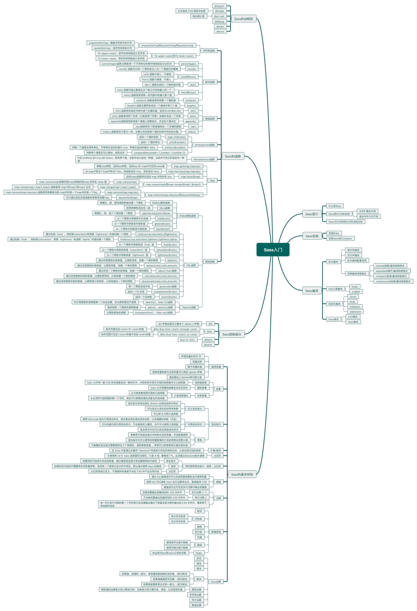

 <iframe src="https://www.xmind.net/embed/9yff" width="620px" height="540px"></iframe>
