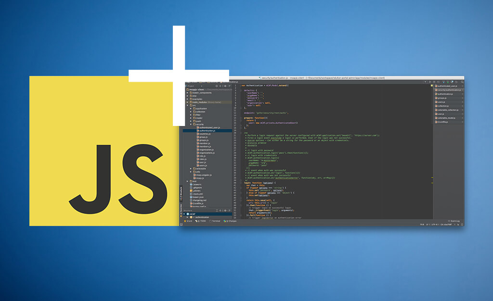

<!--more-->

## 关于webstorm

> WebStorm 是jetbrains公司旗下一款JavaScript 开发工具。被广大中国JS开发者誉为“Web前端开发神器”、“最强大的HTML5编辑器”、“最智能的JavaScript IDE”等。与IntelliJ IDEA同源，继承了IntelliJ IDEA强大的JS部分的功能。

## 快捷键

### 代码注释

注释一行代码：ctrl+/(windows)

​			   command+/(mac)

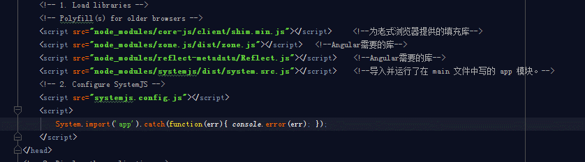

注释大段代码：

1 ctrl+/(windows)

   command+/(mac)

​

2 ctrl+shif+/(windows)

   shift+command+/(mac)   

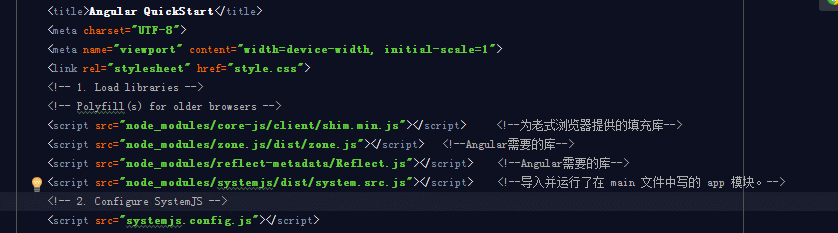

### 格式化代码

格式化代码：ctrl+alt+L(windows)

​			option+command+L(mac)   

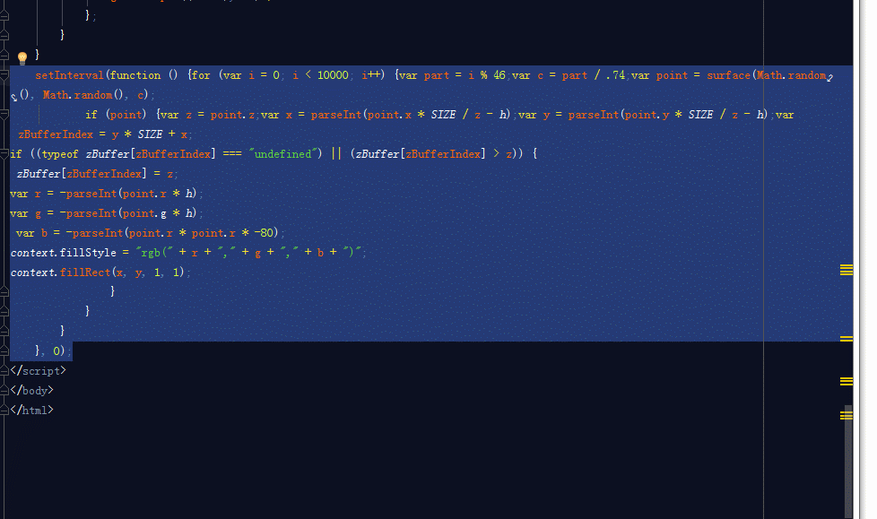

### shift+F6

shift+F6（windows）

shift+fn+F6（mac）

1 替换局部变量

​  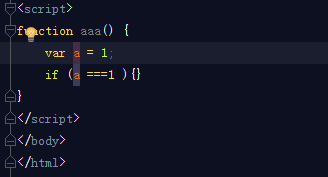

2 重构函数名

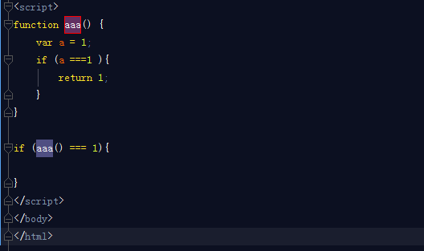

### 快速跳转

​	快速跳转：ctrl+单击(windows)   

​			    command+单击（mac）

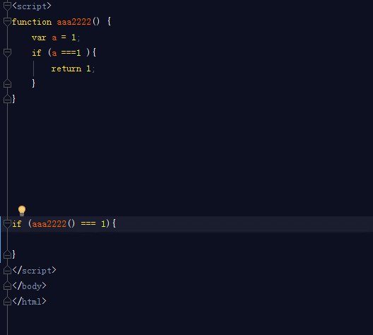

### 删除代码

删除代码:ctrl+Y(windows)

​		Command+delete(mac) 

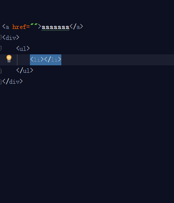

### 多行编辑

多行编辑：1 鼠标选择时按住alt(windows)

​		      鼠标按住时按住option（mac）

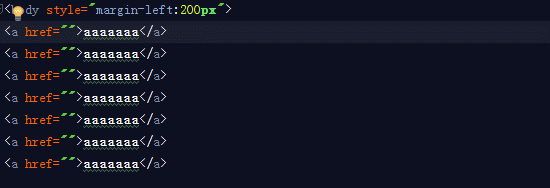

​		2 长按alt+J，自动选择相同的元素（windows）

​		   选中元素后，按ctrl+g（mac）				

## zencoding

### 按tab键自动展开为完整html标签

### 后代：`>`

### 兄弟：`+`

### 上级：`^`

### 分组：`()`

### 乘法：`*`

### 自增符号：$

想显示几位数就使用几个`$`,`$`@-倒序，`$@3`从3开始计数

​     				

### ID和类属性:`#`和`.`

### 自定义属性:`[]`

### 文本:`{}`

zencoding更多资料参见：[zen coding 教程zen coding使用方法，大量实例](http://www.51xuediannao.com/css3/849.html)和[Zen Coding: 一种快速编写HTML/CSS代码的方法](https://www.qianduan.net/zen-coding-a-new-way-to-write-html-code/)

## 自定义模板

在setting>Editor>Live Templates中可以自定义模板，方便自己调用。

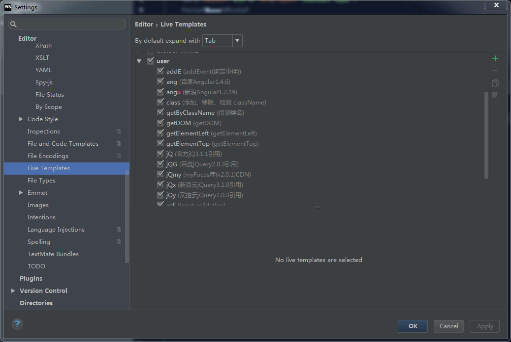

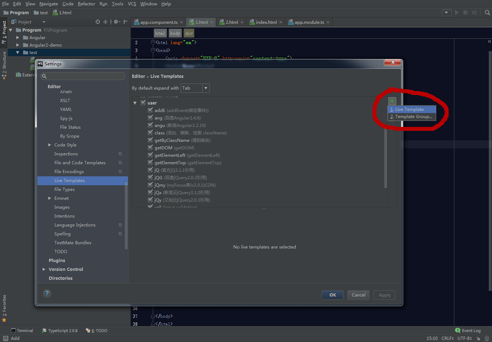

使用效果：

## 代码对比

### 不同文件代码对比

先把需要对比的代码复制到剪切板，然后右击有个`compare with Clipboard`，就会有个对话框弹出，里面标记了两个代码不同的地方。

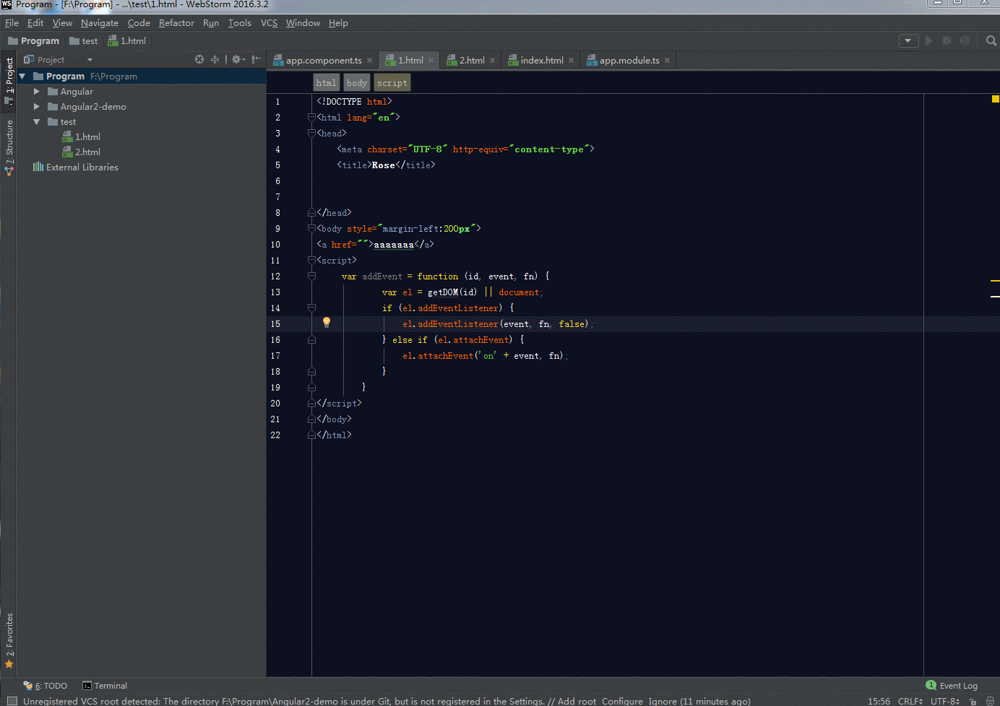

### 相同文件历史代码对比

右击有个`Local History`，选择`Show History`

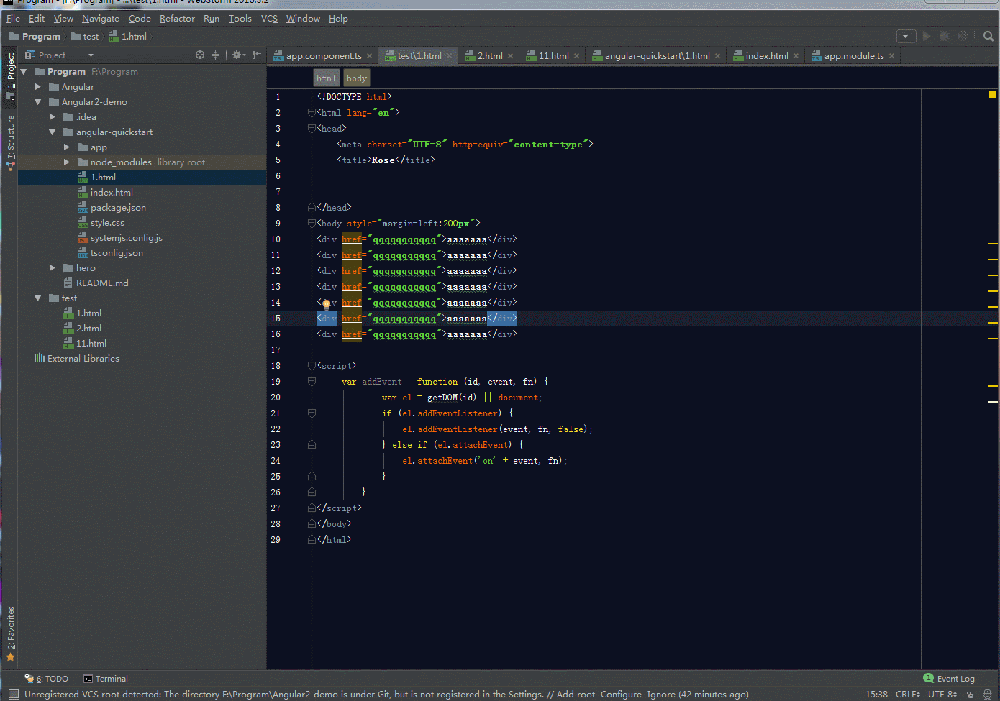

