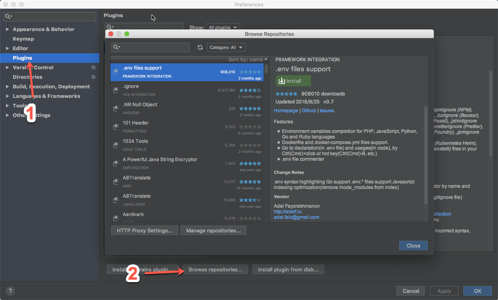

<!--more-->

Angular官方文档的[风格指南](https://angular.cn/docs/ts/latest/guide/style-guide.html)提到使用IDE的模板来实现统一的风格，里面的IDE没有提到WebStorm，于是网上搜了一下相关资料。

## 安装插件

参照[WebStorm 最新 2016 AngularJs 2 代码提示插件安装](http://blog.csdn.net/zeroso/article/details/52127935)。

在webstorm的setting或者performance（macos）中选择左侧Plugin选项，然后点击Browse repositories。



在搜索框中搜索Angular 2 TypeScript Live Templates，然后点击Install，会提示重启webstorm，重启后就安装好了。


如果电脑上设置了代理，点击左下角的HTTP proxy settings，选择auto-detect proxy settings，然后再进行下载。


## 使用插件

[Angular 2 TypeScript Live Templates (Snippets) for WebStorm](https://github.com/MrZaYaC/ng2-webstorm-snippets)的github上有使用说明，我按照这个说明演示一下。

### TypeScript Snippets

插件对于TypeScript有以下指令：

```html
ng2-component-root  // Angular 2 root App component
ng2-bootstrap       // Angular 2 bootstraping, for main.ts
ng2-component       // Angular 2 component
ng2-pipe            // Angular 2 pipe
ng2-routes          // Angular 2 @Routes
ng2-route-path      // Angular 2 routing path
ng2-service         // Angular 2 service
ng2-subscribe       // Angular 2 observable subscription
```

指令会有提示，选择相应的指令会生成预设的模板。

### HTML Snippets

插件对Angular中的以下指令也有提示：

```html
ng2-ngClass
ng2-ngFor
ng2-ngIf
ng2-ngModel
ng2-routerLink
ng2-ngStyle
ng2-ngSwitch
```


