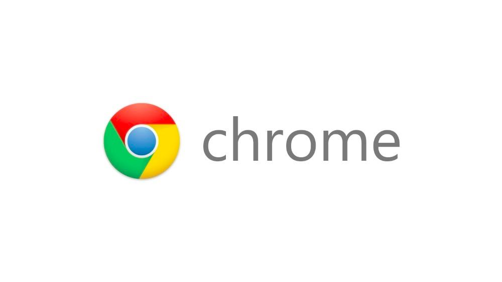

<!--more-->

Google Chrome，是一个由Google公司开发的一款设计简单、高效的网页浏览器。其最大的魅力就在于可以安装各种扩展插件，让Chrome浏览器自身的功能更加丰富。Chrome网上应用店，用户可以下载和安装应用程序、扩展程序以及主题背景。

作为用了7年的chrome的老用户，下面推荐一下我常用的chrome扩展程序。

因为某些原因，如果不能去chrome网上应用商店下载，可以去[chrome插件](http://chromecj.com/)和[插件网](http://www.cnplugins.com/)下载，然后自行安装，安装教程参考:[怎么在谷歌浏览器中安装.crx扩展名的离线Chrome插件？](http://chromecj.com/utilities/2014-09/181.html)。

## uBlock Origin

一款去除页面广告的插件，之所以不推荐大名鼎鼎的Adblock Plus是因为uBlock Origin占用极低的内存和 CPU。而且uBlock Origin支持的Adblock Plus过滤语法拦截广告。

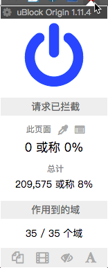

开启拦截前：

开启拦截后：

**前端开发的时候记得把拦截取消。**

国内下载地址：[uBlock Origin](http://www.cnplugins.com/office/block/)

官方下载地址：[uBlock Origin](https://chrome.google.com/webstore/detail/ublock-origin/cjpalhdlnbpafiamejdnhcphjbkeiagm?hl=zh-CN)

## Tampermonkey

俗称“油猴”，号称“Chrome第二应用商店”，是一款最为流行的用户脚本管理器。它可以加入更多的 Chrome 本身不支持的用户脚本功能。

安装完Tampermonkey，就可以去[Greasy Fork](https://greasyfork.org/zh-CN)安装各种脚本了，无数强大的脚本都可以通过这个扩展运行，代替应用商店里繁复的apps&extensions，极大地减少了chrome应用、扩展造成的不必要的系统资源占用。
**不必担心这些脚本会导致浏览器卡顿，它们只在特定页面运行，资源占用极低。**

下面是我安装的一些脚本：

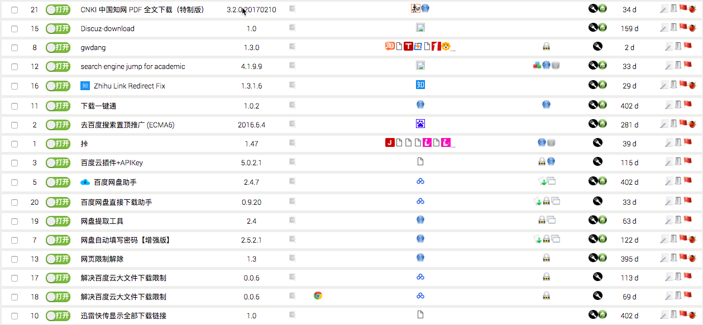

国内下载地址：[Tampermonkey](http://www.cnplugins.com/office/tampermonkey/)

官方下载地址：[Tampermonkey](https://chrome.google.com/webstore/detail/tampermonkey/dhdgffkkebhmkfjojejmpbldmpobfkfo?hl=zh-CN)

## Speed dial 2

Speed dial 2可以完美替代默认的新标签页。它可以记录书签、浏览历史，主题易于定制，对快速拨号页面进行分组，可以云同步所有配置（需要付费，不过很便宜）。

国内下载地址：[Speed dial 2](http://www.cnplugins.com/office/speed-dial-2/)

官方下载地址：[Speed dial 2](https://chrome.google.com/webstore/detail/speed-dial-2/jpfpebmajhhopeonhlcgidhclcccjcik?hl=zh-CN)

## FireShot

FireShot是网页截图插件，它可以对网页中整个屏幕或者是网页的部分视图进行截图操作，在截图之后用户还可以对当前截图的图片进行编辑，包括添加注释，批注，添加线条，上传，分享等操作。

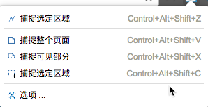

国内下载地址：[FireShot](http://www.cnplugins.com/blog/capture-webpage-screensho/)

官方下载地址：[FireShot](https://chrome.google.com/webstore/detail/take-webpage-screenshots/mcbpblocgmgfnpjjppndjkmgjaogfceg?hl=zh-CN)

## OneTab

chrome浏览器每打开一个标签就相当于多独立运行了一个程序，所以每个网页标签都是占用内存的。标签页数量较多时消耗的内存相当可观。对内存不是那么大的人来说，用一段时间之后整个系统被拖得很慢着实非常痛苦。OneTab chrome扩展插件是为了解决 Chrome 浏览器内存占用过多的问题的，安装后，点击一下扩展图标，扩展的功能会将当前打开的标签关闭，显示在扩展页的标签列表中，相当于只打开一个标签，内存占用就一下子从几个 G 骤减为 100M 左右了；同时将标签页展示为一个竖排的列表样式，查看全部标签也更轻松了。你可以点击恢复某个标签页，也可以全部恢复打开。

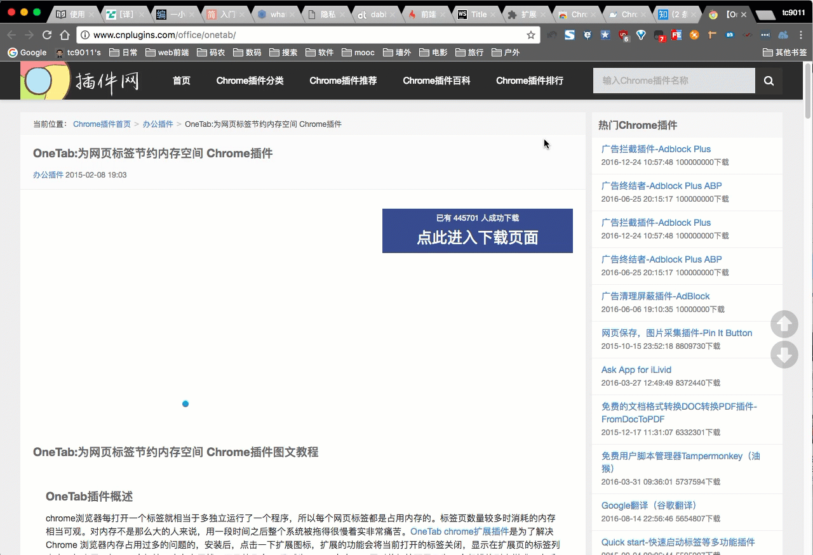

国内下载地址：[OneTab](http://www.cnplugins.com/office/onetab/)

官方下载地址：[OneTab](https://chrome.google.com/webstore/detail/onetab/chphlpgkkbolifaimnlloiipkdnihall?hl=zh-CN)

## Scroll To Top

Scroll To Top可以在浏览页面时帮助你快速滚动到顶部或者底部。

国内下载地址：[Scroll To Top](http://www.cnplugins.com/office/scroll-to-top/)

官方下载地址：[Scroll To Top](https://chrome.google.com/webstore/detail/scroll-to-top/hegiignepmecppikdlbohnnbfjdoaghj?hl=zh-CN)

## crxMouse Chrome Gestures

CrxMouse是一款鼠标手势Chrome插件，使用它可以充分、方便、快捷地发挥鼠标在Chrome浏览器中的操作方式。其中包括鼠标手势，超级拖拽，滚动手势，摇杆手势，平滑滚动，标签页列表等功能，比如在Chrome浏览器中画上一个向左的转折线就可以快速地把当前的标签页关闭。

鼠标手势的设置：

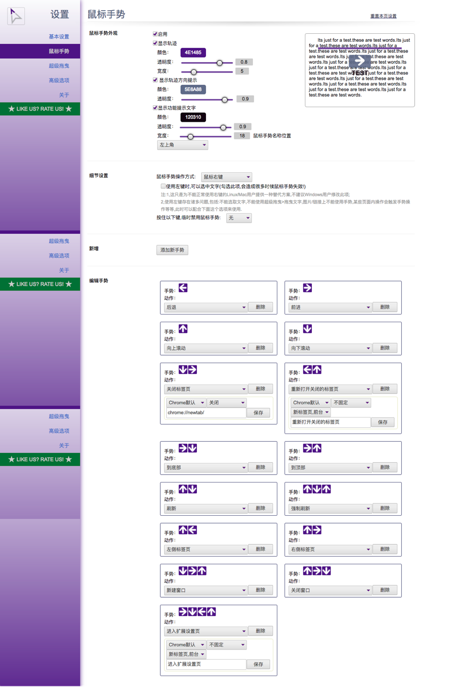

鼠标手势效果演示：

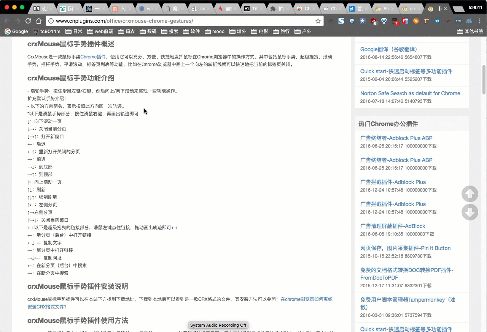

超级拖拽的设置（可以方便的进行各种搜索）：

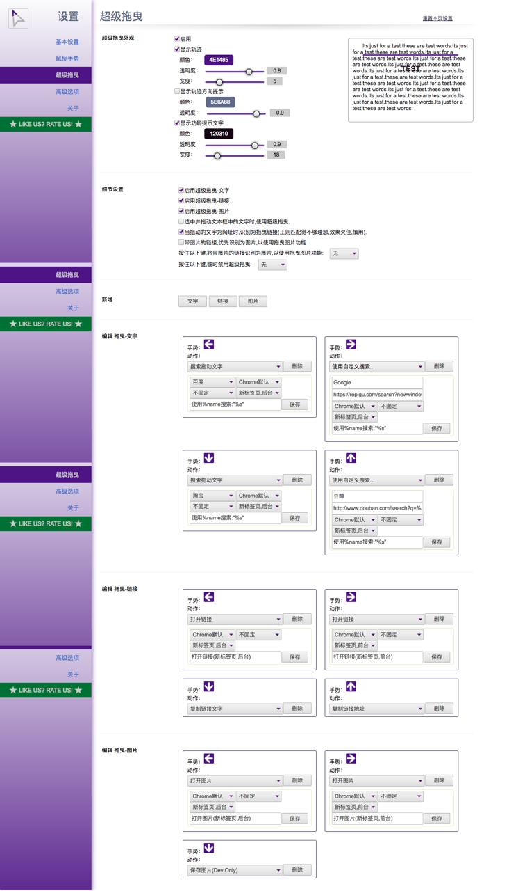

国内下载地址：[crxMouse Chrome Gestures](http://www.cnplugins.com/office/crxmouse-chrome-gestures/)

官方下载地址：[crxMouse Chrome Gestures](https://chrome.google.com/webstore/detail/crxmouse-chrome-gestures/jlgkpaicikihijadgifklkbpdajbkhjo?hl=zh-CN)

## 划词翻译

一个简便但强大的翻译扩展。支持谷歌、百度、有道、必应四大翻译和朗读引擎，可以方便的查看、复制和朗读不同引擎的翻译结果。
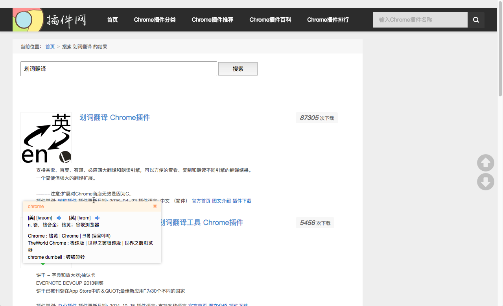

国内下载地址：[划词翻译](http://www.cnplugins.com/fuzhu/huacifanyi/)

官方下载地址：[划词翻译](https://chrome.google.com/webstore/detail/%E5%88%92%E8%AF%8D%E7%BF%BB%E8%AF%91/ikhdkkncnoglghljlkmcimlnlhkeamad?hl=zh-CN)

## Fatkun图片批量下载

Fatkun图片批量下载是一个简单好用的下载图片扩展，它可以找出当前页面的所有图片，并提供按分辨率、链接等筛选图片的功能。

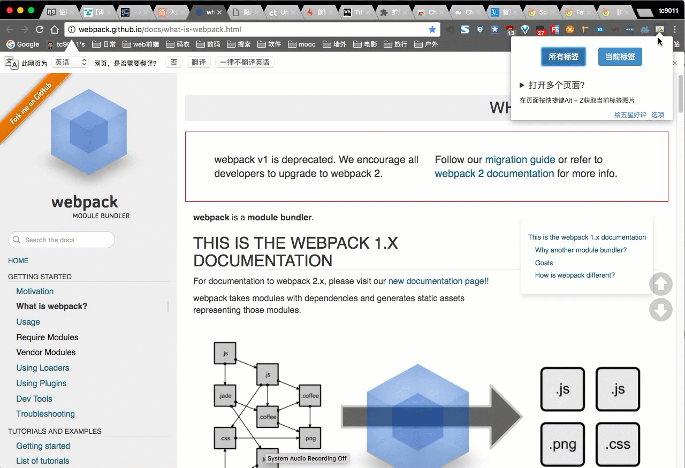

国内下载地址：[Fatkun图片批量下载](https://chrome.google.com/webstore/detail/fatkun-batch-download-ima/nnjjahlikiabnchcpehcpkdeckfgnohf?hl=zh-CN)

官方下载地址：[Fatkun图片批量下载](https://chrome.google.com/webstore/detail/%E5%88%92%E8%AF%8D%E7%BF%BB%E8%AF%91/ikhdkkncnoglghljlkmcimlnlhkeamad?hl=zh-CN)

## Octotree

Octotree是一个用来显示 Github 项目的目录结构的插件， Github上的项目可以显示为类似 IDE 的代码目录树结构。缺点是需要初始化的时间，像nodejs这种稍微大一点的代码库要花大概1分钟多有去爬吧。

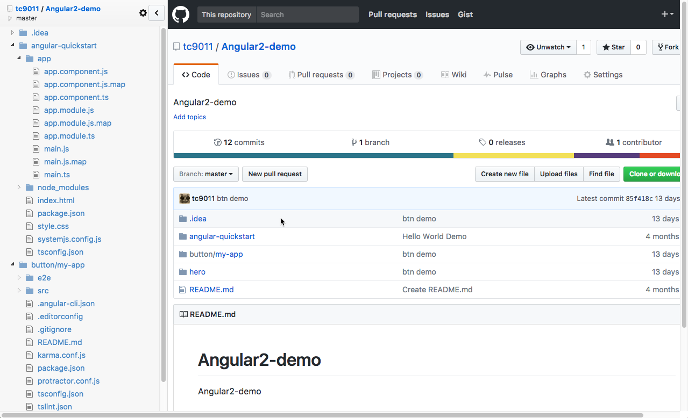

国内下载地址：[Octotree](http://www.cnplugins.com/devtool/octotree/)

官方下载地址：[Octotree](https://chrome.google.com/webstore/detail/octotree/bkhaagjahfmjljalopjnoealnfndnagc?hl=zh-CN)

## Isometric Contributions

这个插件可以把github上的contributions 显示为3d柱状图，并且给出一些更加详细的信息。

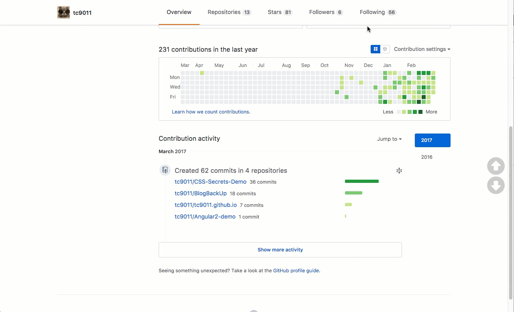

国内下载地址：[Isometric Contributions](http://www.cnplugins.com/devtool/isometric-contributions/)

官方下载地址：[Isometric Contributions](https://chrome.google.com/webstore/detail/isometric-contributions/mjoedlfflcchnleknnceiplgaeoegien?hl=zh-CN)

## WEB前端助手(FeHelper)

功能包括字符串编解码、代码压缩、美化、JSON格式化、正则表达式、时间转换工具、二维码生成器、编码规范检测、页面性能检测、页面取色、Ajax接口调试。

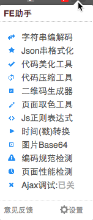

国内下载地址：[WEB前端助手(FeHelper)](http://www.cnplugins.com/devtool/webqianduanzhushoufehelper/)

官方下载地址：[WEB前端助手(FeHelper)](https://chrome.google.com/webstore/detail/web%E5%89%8D%E7%AB%AF%E5%8A%A9%E6%89%8Bfehelper/pkgccpejnmalmdinmhkkfafefagiiiad?hl=zh-CN)

## WhatFont

WhatFont是一款可以帮助用户查看识别网页字体的浏览器插件。

国内下载地址：[WhatFont](http://www.cnplugins.com/devtool/whatfont/)

官方下载地址：[WhatFont](https://chrome.google.com/webstore/detail/whatfont/jabopobgcpjmedljpbcaablpmlmfcogm?hl=zh-CN)

## Page Ruler

Page Ruler是一款页面尺寸测量工具，非常适合前端工程师。PageRuler插件可以与当前网页的屏幕无缝地集成到一起，使用户非常精确地测量出当前页面某个元素或者是整个页面的大小尺寸。

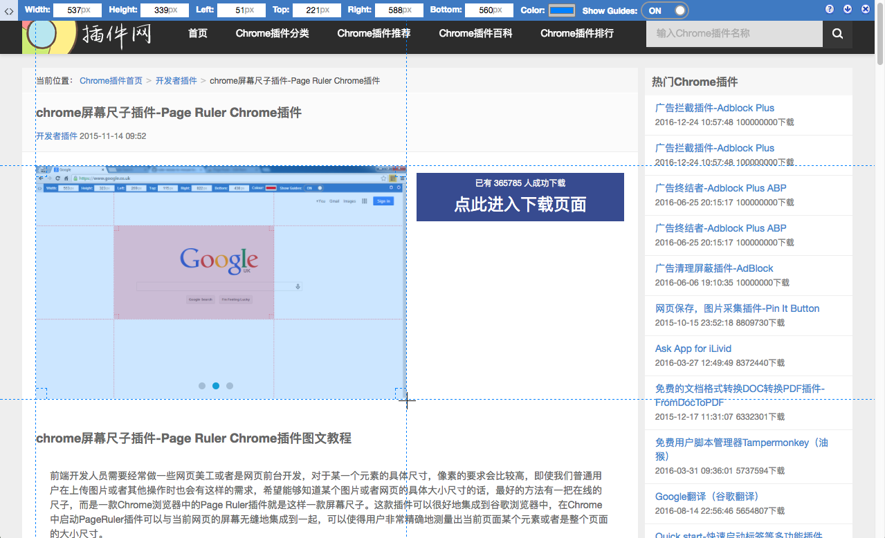

国内下载地址：[Page Ruler](http://www.cnplugins.com/devtool/page-ruler/)

官方下载地址：[Page Ruler](https://chrome.google.com/webstore/detail/page-ruler/jlpkojjdgbllmedoapgfodplfhcbnbpn?hl=zh-CN)

## CSSViewer

CSSViewer是一款快速查看css样式的插件，不需点开开发者工具，直接可以显示元素的css样式信息。

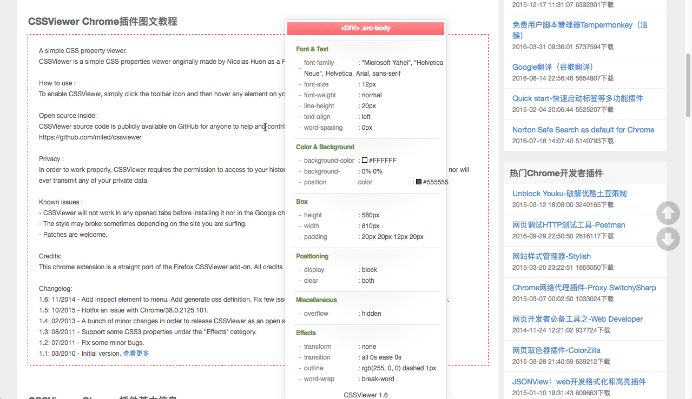

国内下载地址：[CSSViewer](http://www.cnplugins.com/devtool/cssviewer/)

官方下载地址：[CSSViewer](https://chrome.google.com/webstore/detail/cssviewer/ggfgijbpiheegefliciemofobhmofgce?hl=zh-CN)

## Code Cola

Code Cola是一个可视化编辑在线页面css样式的chrome插件。比chrome自带的开发者工具要方便一点。

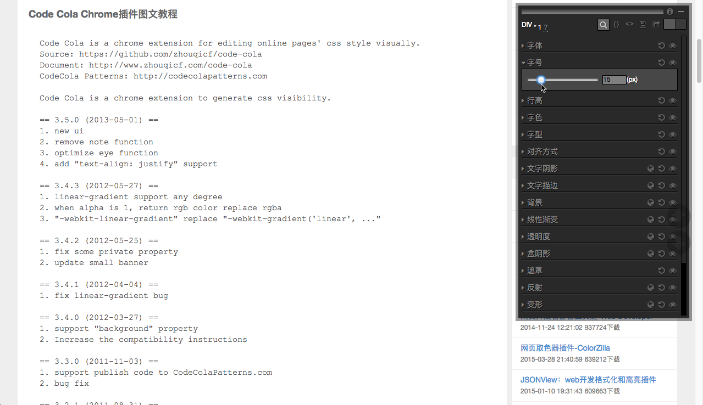

国内下载地址：[Code Cola](http://www.cnplugins.com/devtool/code-cola/)

官方下载地址：[Code Cola](https://chrome.google.com/webstore/detail/code-cola/lomkpheldlbkkfiifcbfifipaofnmnkn?hl=zh-CN)

## PerfectPixel by WellDoneCode

PerfectPixel是一种叠加插件。它处理的是图层，这样你可以在同一页面多次叠加。

在PixelPerfect中简单地加载任意JPG或PNG格式的网站原型，然后在你的工作代码上手工定位，锁定它的位置，并将它的不透明度降低到大约20％。

当你开发HTML页面时，你可以不断地将HTML和CSS呈现的效果与原始设计稿比较。

国内下载地址：[PerfectPixel by WellDoneCode](http://www.cnplugins.com/devtool/perfectpixel-by-welldonec/)

官方下载地址：[PerfectPixel by WellDoneCode](https://chrome.google.com/webstore/detail/perfectpixel-by-welldonec/dkaagdgjmgdmbnecmcefdhjekcoceebi?hl=zh-CN)

## Web Developer Checklist

这个插件可以分析任何网页是否违反最佳实践，对于Web开发谁想要确保他们遵循最佳实践，这个扩展可以让你很容易发现你的网站的问题领域。

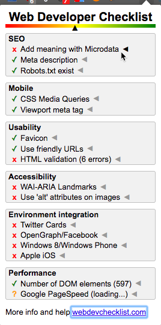

国内下载地址：[Web Developer Checklist](http://www.cnplugins.com/devtool/web-developer-checklist/)

官方下载地址：[Web Developer Checklist](https://chrome.google.com/webstore/detail/web-developer-checklist/iahamcpedabephpcgkeikbclmaljebjp?hl=zh-CN)

## PageSpeed Insights (with PNaCl)

这个插件是Google官方的PageSpeed Tools的chrome扩展版本，通过分析网页的内容来提供网站加载速度优化建议。

安装完后，进入开发者页面，此时顶部会多出一个PageSpeed按钮，点击Start Analyzing就可以开始分析。

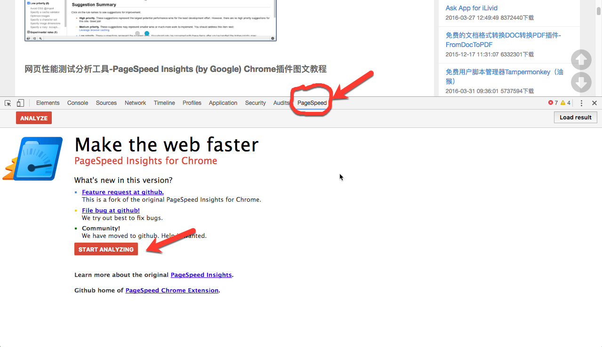

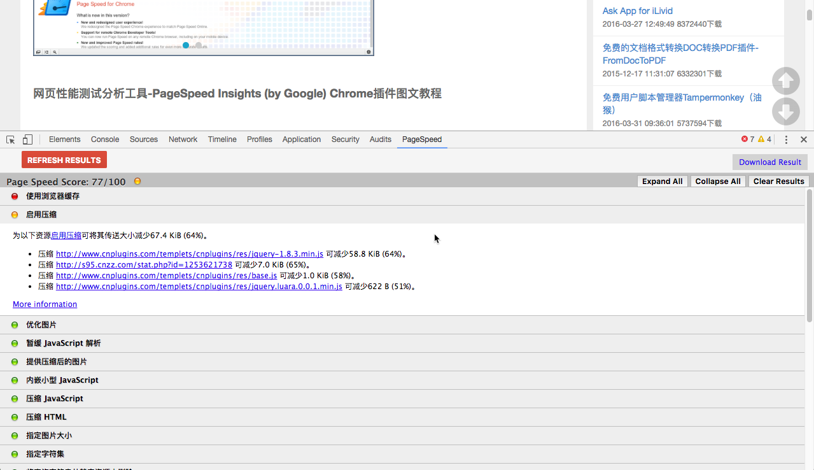

国内下载地址：[PageSpeed Insights (with PNaCl)](http://www.cnplugins.com/devtool/pagespeed-insights-by-goo/)

官方下载地址：[PageSpeed Insights (with PNaCl)](https://chrome.google.com/webstore/detail/pagespeed-insights-with-p/lanlbpjbalfkflkhegagflkgcfklnbnh?hl=zh-CN)

## User-Agent Switcher for Chrome

User-Agent Switcher插件是一款可以使用Chrome浏览器访问网站的时候来制造一种其他浏览器正在访问该网站的一种“假象”。

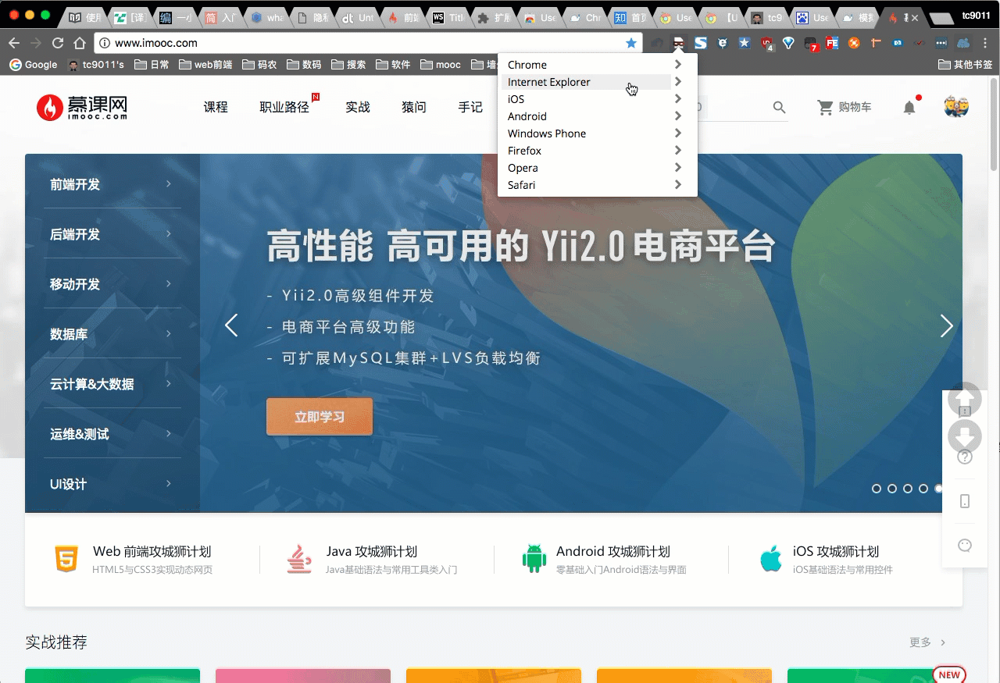

国内下载地址：[User-Agent Switcher for Chrome](http://www.cnplugins.com/office/user-agent-switcher-for-c/)

官方下载地址：[User-Agent Switcher for Chrome](https://chrome.google.com/webstore/detail/user-agent-switcher-for-c/djflhoibgkdhkhhcedjiklpkjnoahfmg?hl=zh-CN)

## Responsive Web Design Tester

Responsive Web Design Tester是一个能模拟网站在不同浏览器和设备上的行为，适合前端响应式网站开发。

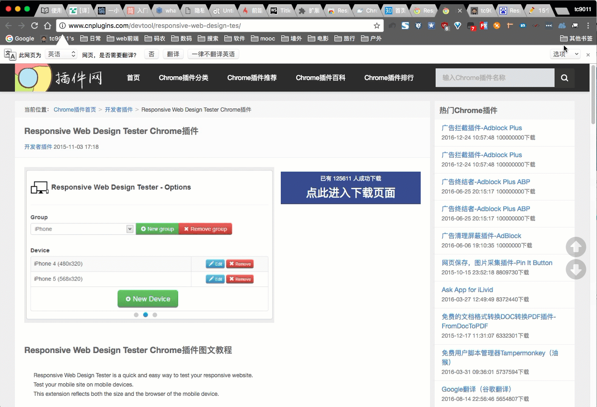

国内下载地址：[Responsive Web Design Tester](http://www.cnplugins.com/devtool/responsive-web-design-tes/)

官方下载地址：[Responsive Web Design Tester](https://chrome.google.com/webstore/detail/responsive-web-design-tes/objclahbaimlfnbjdeobicmmlnbhamkg?hl=zh-CN)

