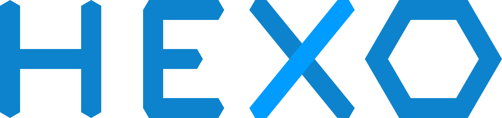

<!--more-->

看到有的博客上有版权声明的标记，感觉有点逼格，就想自己弄一下。

## 添加版权声明

在Github上，Next主题的issues上有[设置 Creative Commons 协议](https://github.com/iissnan/hexo-theme-next/wiki/%E8%AE%BE%E7%BD%AE-Creative-Commons-%E5%8D%8F%E8%AE%AE)，这个就是设置版权声明，但是配置了以后图标比较小，没有文字说明（就是没逼格），而且还会出现在它不该出现的地方。

在网上找到一篇[为Hexo博客的每一篇文章自动追加版权信息](http://kuangqi.me/tricks/append-a-copyright-info-after-every-post/)，可惜我木有成功。有兴趣的可以试一下。

这时候我想起了[Hexo+nexT主题搭建个人博客](http://www.wuxubj.cn/2016/08/Hexo-nexT-build-personal-blog/)的5.3中有在文章末尾添加“本文结束”标记的介绍。于是我就仿照写了一个版权声明。

> **新建 passage-end-tag.swig 文件**

在路径`\themes\next\layout\_macro`中添加`passage-end-tag.swig`文件，其内容为：

```html

<div style="text-align:center;color: #ccc;font-size:14px;">
------ 本文结束 ------</div>
<br/>
<div style="border: 1px solid black">
<div style="margin-left:10px">
<span style="font-weight:blod">版权声明</span>

<br/>
<p style="font-size: 10px;line-height: 30px"><a href="http://tc9011.com" style="color:#258FC6">tc9011's Notes</a> by <a href="http://tc9011.com" style="color:#258FC6">Cheng Tang</a> is licensed under a <a href="https://creativecommons.org/licenses/by-nc-nd/4.0/" style="color:#258FC6">Creative Commons BY-NC-ND 4.0 International License</a>.<br/>
由<a href="http://tc9011.com" style="color:#258FC6">汤诚</a>创作并维护的<a href="http://tc9011.com" style="color:#258FC6">tc9011's Notes</a>博客采用<a href="https://creativecommons.org/licenses/by-nc-nd/4.0/" style="color:#258FC6">创作共用保留署名-非商业-禁止演绎4.0国际许可证</a>。<br/>
本文首发于<a href="http://tc9011.com" style="color:#258FC6">tc9011's Notes</a> 博客（ <a href="http://tc9011.com" style="color:#258FC6">http://tc9011.com</a> ），版权所有，侵权必究。</p>
</div>
</div>

```

> **修改 post.swig 文件**

在`\themes\next\layout\_macro\post.swig`中，`post-body`之后，`post-footer`之前添加如下代码：

```html
<div>
  
    
  
</div>
```

> **在主题配置文件中添加字段**

在主题配置文件 `_config.yml`中添加以下字段开启此功能：

```
# 文章末尾添加“本文结束”标记
passage_end_tag:
  enabled: true
```

完成以上设置之后，在每篇文章之后都会添加“版权声明”标记。

## 添加背景动画

[背景动画](https://github.com/hustcc/canvas-nest.js)基于canvas，添加到博客上也比较简单，在`\themes\next\layout\_layout.swig`的`</body>`上面添加

```html

  <script type="text/javascript" src="//cdn.bootcss.com/canvas-nest.js/1.0.0/canvas-nest.min.js"></script>

```

在`\themes\next\_config.yml`中添加以下字段开启此功能：

```yaml
# background settings
# add canvas-nest effect
# see detail from https://github.com/hustcc/canvas-nest.js
canvas_nest: true
```

添加完了，发现博客背景是白色，会遮住动画，只留下两边一点点的位置看到动画效果，这时候可以去设置一下背景颜色，在`\themes\next\source\css\_schemes\Pisces\_layout.styl`中，把`.content-wrap`中的`background`修改为none。

这时候如果用手机打开，也能看到动画效果，但是带来的体验不好，显得页面比较乱，这是可以把`.content-wrap`的`+mobile()`中的`background`修改为white，这样手机端的体验就好很多，却又不影响电脑端的炫酷动画。

附上我的`.content-wrap`配置：

```css
.content-wrap {
  float: right;
  box-sizing: border-box;
  padding: $content-desktop-padding;
  width: $content-desktop;
  background: none;
  min-height: 700px;
  box-shadow: $box-shadow-inner;
  border-radius: $border-radius-inner;

  +tablet() {
    width: 100%;
    padding: 20px;
    border-radius: initial;
  }
  +mobile() {
    width: 100%;
    padding: 20px;
    min-height: auto;
    border-radius: initial;
    background: white;
  }
}
```


## 修改一些样式

[never_yu‘Blog](https://neveryu.github.io/)中的文章添加许多样式，看了一下[github](https://github.com/Neveryu/Neveryu.github.io)上的源码，在 `themes\next\source\css\_custom\custom.styl` 中，添加如下css：

```css
//修改文章内链接文本样式
.post-body p a {
	color: #0593d3;
	border-bottom: none;
	&:hover {
		color: #0477ab;
		text-decoration: underline;
	}
}
//修改不在文章内的链接文本样式
.link-blue{
	color: #f36;
	&:hover {
		color: #f00;
	}
}
//修改文章内code样式
code {color:#fff;background:#333;}

//修改文章中图片样式，改为居中
.posts-expand .post-body img {
	margin: 0 auto;
}

// 下载样式
a#download {
	display: inline-block;
	padding: 0 10px;
	color: #000;
	background: transparent;
	border: 2px solid #000;
	border-radius: 2px;
	transition: all .5s ease;
	font-weight: bold;
	&:hover {
		background: #000;
		color: #fff;
	}
}
//阅读全文样式
.post-more-link .btn {
	position:relative;
	border: 2px solid #000;
	border-radius: 2px;
	padding: 0 10px;
	font-weight: bold;
	background: transparent;
	transition: all .5s ease;
	&:hover {
		background: #000;
		color: #eee;
	}
}
//
// 颜色块-黄
span#inline-yellow {
	display:inline;
	padding:.2em .6em .3em;
	font-size:80%;
	font-weight:bold;
	line-height:1;
	color:#fff;
	text-align:center;
	white-space:nowrap;
	vertical-align:baseline;
	border-radius:0;
	background-color: #f0ad4e;
}
// 颜色块-黑
span#inline-black {
	display:inline;
	padding:.2em .6em .3em;
	font-size:80%;
	font-weight:bold;
	line-height:1;
	color:#fff;
	text-align:center;
	white-space:nowrap;
	vertical-align:baseline;
	border-radius:0;
	background-color: black;
}
// 颜色块-绿
span#inline-green {
	display:inline;
	padding:.2em .6em .3em;
	font-size:80%;
	font-weight:bold;
	line-height:1;
	color:#fff;
	text-align:center;
	white-space:nowrap;
	vertical-align:baseline;
	border-radius:0;
	background-color: #5cb85c;
}
// 颜色块-蓝
span#inline-blue {
	display:inline;
	padding:.2em .6em .3em;
	font-size:80%;
	font-weight:bold;
	line-height:1;
	color:#fff;
	text-align:center;
	white-space:nowrap;
	vertical-align:baseline;
	border-radius:0;
	background-color: #2780e3;
}
// 颜色块-紫
span#inline-purple {
	display:inline;
	padding:.2em .6em .3em;
	font-size:80%;
	font-weight:bold;
	line-height:1;
	color:#fff;
	text-align:center;
	white-space:nowrap;
	vertical-align:baseline;
	border-radius:0;
	background-color: #9954bb;
}
// 颜色块-红
span#inline-red {
	display:inline;
	padding:.2em .6em .3em;
	font-size:80%;
	font-weight:bold;
	line-height:1;
	color:#fff;
	text-align:center;
	white-space:nowrap;
	vertical-align:baseline;
	border-radius:0;
	background-color: #df3e3e;
}

// 左侧边框红色块级
p#div-border-left-red {
	display: block;
	padding: 10px;
	margin: 10px 0;
	border: 1px solid #ccc;
	border-left-width: 5px;
	border-radius: 3px;
	border-left-color: #df3e3e;
}
// 左侧边框黄色块级
p#div-border-left-yellow {
	display: block;
	padding: 10px;
	margin: 10px 0;
	border: 1px solid #ccc;
	border-left-width: 5px;
	border-radius: 3px;
	border-left-color: #f0ad4e;
}
// 左侧边框绿色块级
p#div-border-left-green {
	display: block;
	padding: 10px;
	margin: 10px 0;
	border: 1px solid #ccc;
	border-left-width: 5px;
	border-radius: 3px;
	border-left-color: #5cb85c;
}
// 左侧边框蓝色块级
p#div-border-left-blue {
	display: block;
	padding: 10px;
	margin: 10px 0;
	border: 1px solid #ccc;
	border-left-width: 5px;
	border-radius: 3px;
	border-left-color: #2780e3;
}
// 左侧边框紫色块级
p#div-border-left-purple {
	display: block;
	padding: 10px;
	margin: 10px 0;
	border: 1px solid #ccc;
	border-left-width: 5px;
	border-radius: 3px;
	border-left-color: #9954bb;
}
// 右侧边框红色块级
p#div-border-right-red {
	display: block;
	padding: 10px;
	margin: 10px 0;
	border: 1px solid #ccc;
	border-right-width: 5px;
	border-radius: 3px;
	border-right-color: #df3e3e;
}
// 右侧边框黄色块级
p#div-border-right-yellow {
	display: block;
	padding: 10px;
	margin: 10px 0;
	border: 1px solid #ccc;
	border-right-width: 5px;
	border-radius: 3px;
	border-right-color: #f0ad4e;
}
// 右侧边框绿色块级
p#div-border-right-green {
	display: block;
	padding: 10px;
	margin: 10px 0;
	border: 1px solid #ccc;
	border-right-width: 5px;
	border-radius: 3px;
	border-right-color: #5cb85c;
}
// 右侧边框蓝色块级
p#div-border-right-blue {
	display: block;
	padding: 10px;
	margin: 10px 0;
	border: 1px solid #ccc;
	border-right-width: 5px;
	border-radius: 3px;
	border-right-color: #2780e3;
}
// 右侧边框紫色块级
p#div-border-right-purple {
	display: block;
	padding: 10px;
	margin: 10px 0;
	border: 1px solid #ccc;
	border-right-width: 5px;
	border-radius: 3px;
	border-right-color: #9954bb;
}
// 上侧边框红色
p#div-border-top-red {
	display: block;
	padding: 10px;
	margin: 10px 0;
	border: 1px solid #ccc;
	border-top-width: 5px;
	border-radius: 3px;
	border-top-color: #df3e3e;
}
// 上侧边框黄色
p#div-border-top-yellow {
	display: block;
	padding: 10px;
	margin: 10px 0;
	border: 1px solid #ccc;
	border-top-width: 5px;
	border-radius: 3px;
	border-top-color: #f0ad4e;
}
// 上侧边框绿色
p#div-border-top-green {
	display: block;
	padding: 10px;
	margin: 10px 0;
	border: 1px solid #ccc;
	border-top-width: 5px;
	border-radius: 3px;
	border-top-color: #5cb85c;
}
// 上侧边框蓝色
p#div-border-top-blue {
	display: block;
	padding: 10px;
	margin: 10px 0;
	border: 1px solid #ccc;
	border-top-width: 5px;
	border-radius: 3px;
	border-top-color: #2780e3;
}
// 上侧边框紫色
p#div-border-top-purple {
	display: block;
	padding: 10px;
	margin: 10px 0;
	border: 1px solid #ccc;
	border-top-width: 5px;
	border-radius: 3px;
	border-top-color: #9954bb;
}

//动画模块
//第一篇博客中-精于心，简于形-的动画（https://neveryu.github.io/page/2/）
span#yu-1 {
	display:inline;
	position:relative;
	border-top:1px solid #222;
	border-bottom:1px solid #222;
	font-size:110%;
	cursor:pointer;
	&:hover {
		background-color: #000;
		color: #fff;
		animation: animate-yu-1 3s ease-in;
	}
}
@keyframes animate-yu-1 {
	0% {
		left:-10px;
		top:0px;
	}
	10% {
		left:10px;
		top:0px;
	}
	20% {
		left:-8px;
		top:0px;
	}
	30% {
		left:8px;
		top:0px;
	}
	40% {
		left:-5px;
		top:0px;
	}
	50% {
		left:5px;
		top:0px;
	}
	60% {
		left:-3px;
		top:0px;
	}
	70% {
		left:3px;
		top:0px;
	}
	80% {
		left:-1px;
		top:0px;
	}
	90% {
		left:1px;
		top:0px;
	}
	100% {
		left:0px;
		top:0px;
	}
}
//留言页面-[最近访客]-的样式
span#yu-2 {
	display:inline;
	position:relative;
	border-top:1px solid #222;
	border-bottom:1px solid #222;
	font-size:130%;
}

```


