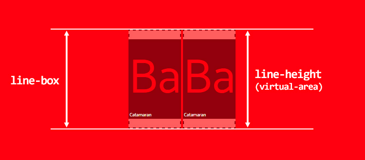
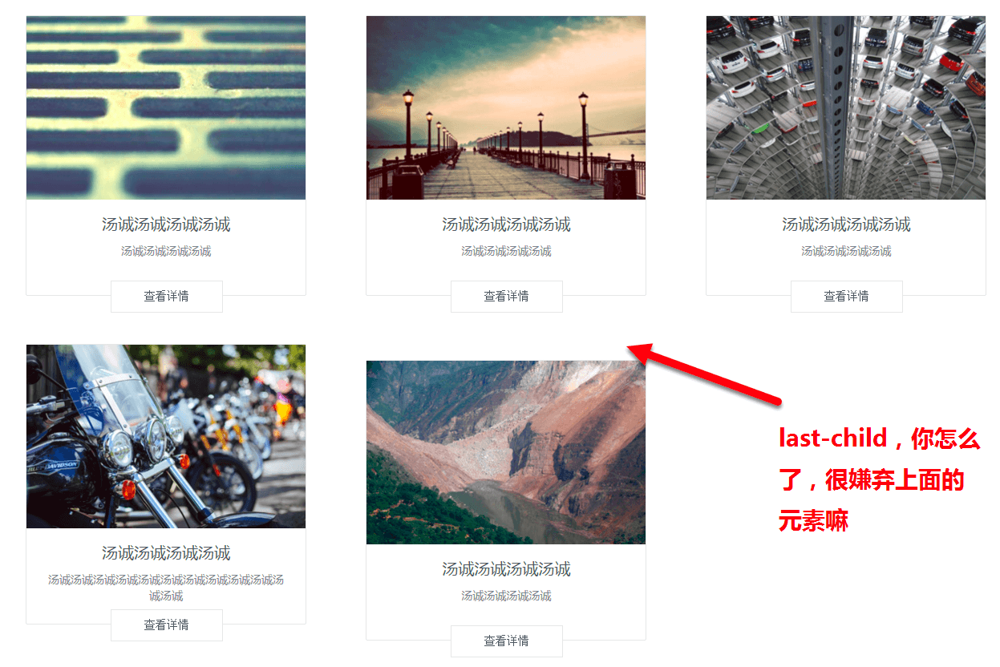
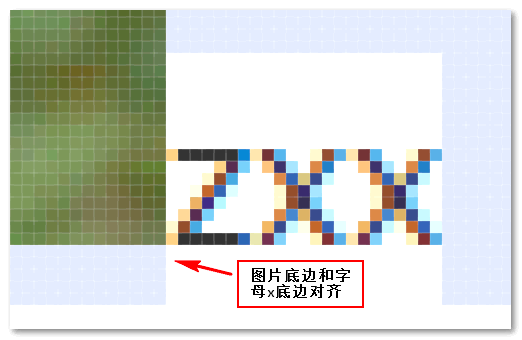
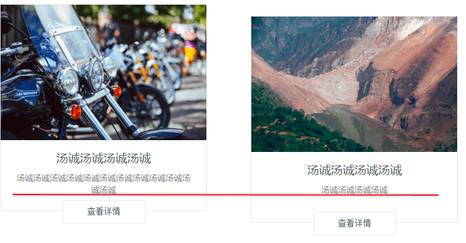
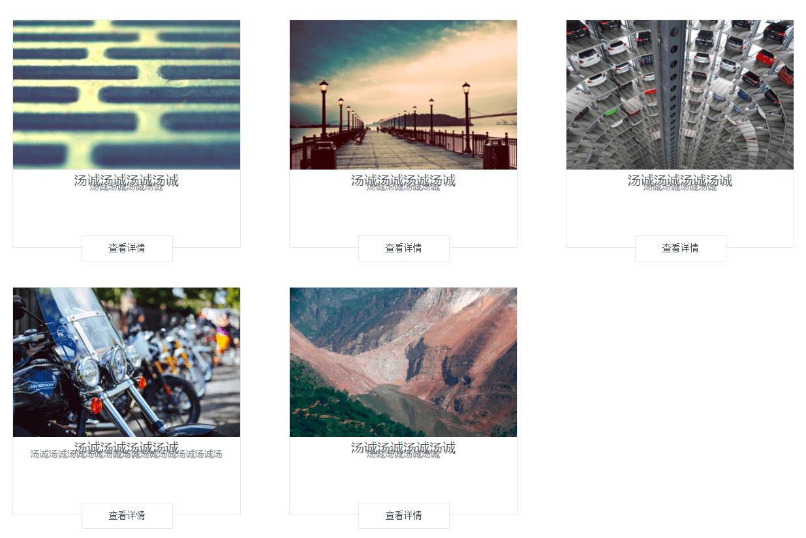
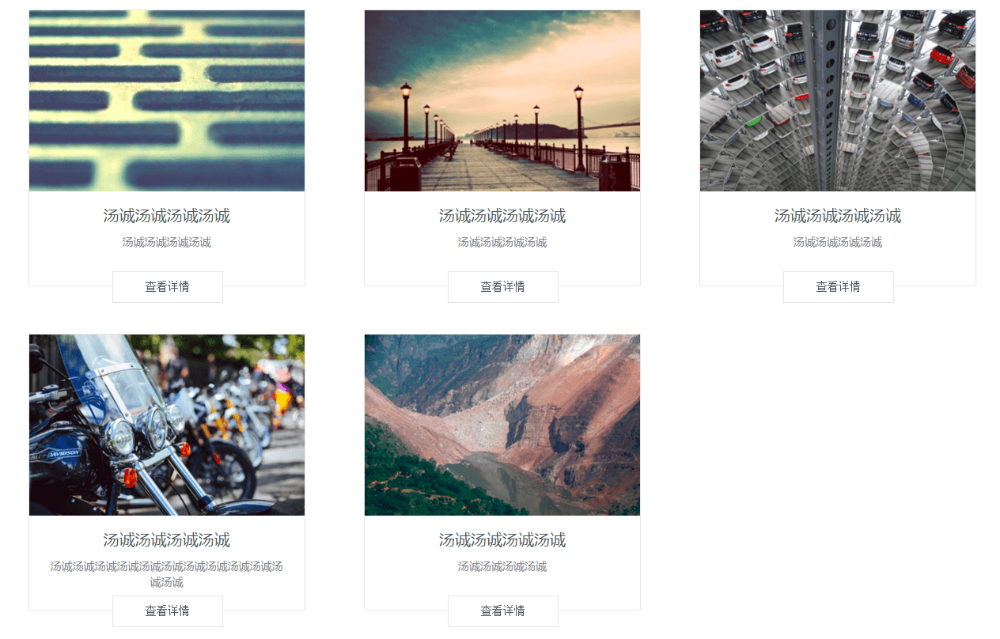
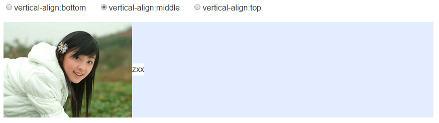
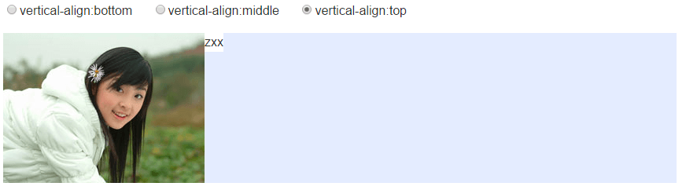
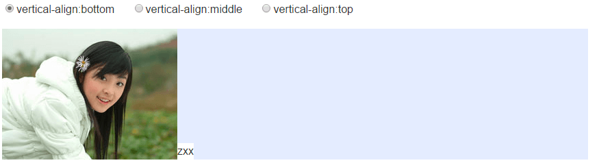

<!--more-->

# 起因

项目中在应用Angular/Material的`card`组件的时候遇到如下问题：



它的代码大概是这样的：

```html
<ul>
  <li>
    <md-card>
      
      <md-card-title>汤诚汤诚汤诚汤诚</md-card-title>
      <md-card-subtitle>汤诚汤诚汤诚汤诚</md-card-subtitle>
      <button>查看详情</button>
    </md-card>
  </li>
  <li>
    <md-card>
      
      <md-card-title>汤诚汤诚汤诚汤诚</md-card-title>
      <md-card-subtitle>汤诚汤诚汤诚汤诚</md-card-subtitle>
      <button>查看详情</button>
    </md-card>
  </li>
  <li>
    <md-card>
      
      <md-card-title>汤诚汤诚汤诚汤诚</md-card-title>
      <md-card-subtitle>汤诚汤诚汤诚汤诚</md-card-subtitle>
      <button>查看详情</button>
    </md-card>
  </li>
  <li>
    <md-card>
      
      <md-card-title>汤诚汤诚汤诚汤诚</md-card-title>
      <md-card-subtitle>汤诚汤诚汤诚汤诚汤诚汤诚汤诚汤诚汤诚汤诚汤诚汤诚</md-card-subtitle>
      <button>查看详情</button>
    </md-card>
  </li>
  <li>
    <md-card>
      
      <md-card-title>汤诚汤诚汤诚汤诚</md-card-title>
      <md-card-subtitle>汤诚汤诚汤诚汤诚</md-card-subtitle>
      <button>查看详情</button>
    </md-card>
  </li>
</ul>
```

```scss
ul{
  width: 1200px;
  margin: 0 auto;
  margin-top: 40px;
}

li{
  display: inline-block;
  margin-right: 70px;
  margin-bottom: 60px;
  &:nth-child(3n){
    margin-right: 0;
  }
}
```

我一开始以为是`li`标签之间空隙导致的，于是就按照常规方法，把`font-size`设置为`0`，but，最后一个元素好像很固执，一动不动，这就让我很尴尬。

# 原因

参考张鑫旭的[CSS深入理解vertical-align和line-height的基友关系](http://www.zhangxinxu.com/wordpress/2015/08/css-deep-understand-vertical-align-and-line-height/)。

[vertical-align](https://developer.mozilla.org/en-US/docs/Web/CSS/vertical-align)默认值是`baseline`, 也就是基线对齐。而基线是什么，基线就是字母X的下边缘（参见“[字母’x’在CSS世界中的角色和故事](http://www.zhangxinxu.com/wordpress/2015/06/about-letter-x-of-css/)”一文）。而文字高度是由`line-height`决定的。卡片上面留白行为表现，本质上，就是`vertical-align`和`line-height`背地里搞基造成的。这里借用一下张鑫旭文章中的图片可能更好理解一点：



在这里`li`元素`display:inline-block`，而在CSS2的可视化格式模型文档中，**一个`inline-block`元素，如果里面没有`inline`内联元素，或者`overflow`不是`visible`，则该元素的基线就是其`margin`底边缘，否则，其基线就是元素里面最后一行内联元素的基线。**

可以从下图看出，在`li`的基线是最后一行文字的基线（查看详情按钮不计入，因为已经脱离文档流了）。而倒数第二个`li`的文字折行了，最后一个`li`文字只有一行，但是最后一个`li`元素要像它的好基友看齐，于是它把自己变矮了（和基友是真爱）。此时也可以说明为什么`font-size`设置为`0`，因为我给那段文字手动设置了`font-size`，按照优先级来说，`li`的`font-size`当然不起作用。



知道原因后，我们可以试下把`li`的`line-height`设置为`0`，得到下面的效果：



此时图片下面那两行字的行高就会受到影响，两行文字会叠在一起，这样我需要手动为文字加一个`line-height`，但是对于我这样的懒人来说，太麻烦了。

此时还有一种方法就是修改`vertical-align`的值，让`li`元素的`vertical-align`变成`top`/`bottom`/`middle`。这时候同样会得到下图的效果，但是卡片里面的文字却还是正常显示，恩，简直完美。



`vertical-align`的`top`/`bottom`/`middle`这三个值到底是啥东西咧，可以看MDN上[vertical-align](https://developer.mozilla.org/en-US/docs/Web/CSS/vertical-align)的解释，并结合张鑫旭那篇文章给出的图理解：

- middle：元素中线与父元素的小写x中线对齐。



- top：元素及其后代的顶端与整行的顶端对齐。



- bottom：元素及其后代的底端与整行的底端对../_images/windows下几款好用的免费软件../_images/windows下几款好用的免费软件齐。



还有一篇老外的文章写得也蛮好的[Deep dive CSS: font metrics, line-height and vertical-align](https://iamvdo.me/en/blog/css-font-metrics-line-height-and-vertical-align)

# 类似问题的解决方案

- 将图片转换为块级对象

图片默认是`inline`水平的，而`vertical-align`对块状水平的元素无感。因此，我们只要让图片`display`水平为`block`就可以了，我们可以直接设置`display`或者浮动、绝对定位等（如果布局允许）。

```css
img { display: block }
```

- 使用其他vertical-align值

比方说`bottom`/`middle`/`top`都是可以的。

- 直接修改line-height值

只要行高足够小，实际文字占据的高度的底部就会在x的上面，下面没有了高度区域支撑，自然，图片就会有容器底边贴合在一起了。

- line-height为相对单位，font-size间接控制

如果`line-height`是相对单位，例如`line-height:1.6`或者`line-height:160%`之类，也可以使用`font-size`间接控制，比方说来个狠的，`font-size`设为`0`, 本质上还是改变`line-height`值。

# 参考文章

1. [CSS深入理解vertical-align和line-height的基友关系](http://www.zhangxinxu.com/wordpress/2015/08/css-deep-understand-vertical-align-and-line-height/)
2. [vertical-align](https://developer.mozilla.org/zh-CN/docs/Web/CSS/vertical-align)
3. [li和img标签之间空隙解决办法](http://blog.csdn.net/shitouplus/article/details/49486933)
4. [Deep dive CSS: font metrics, line-height and vertical-align](https://iamvdo.me/en/blog/css-font-metrics-line-height-and-vertical-align)
