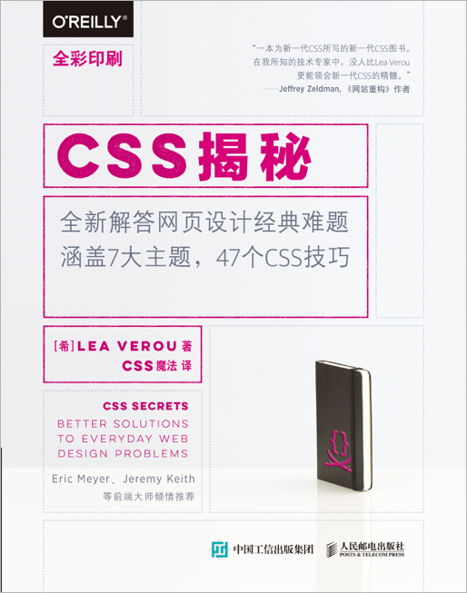

<!--more-->

> 这本书给我打开了css新的大门，看之前最好对css基础比较熟练，然后对css3的新特性有一定的了解。书中大部份代码都在[github](https://github.com/tc9011/CSS-Secrets-Demo)上，大部分手敲，有问题可以提交pr

## 关于本书

`$$()`函数可以更容易地获取和遍历所有匹配特定CSS选择符的DOM元素：

```javascript
function $$(selector,context){
  context = context || document;
  var elements = context.querySelectorAll(selector);
  return Array.prototype.slice.call(elements);
}
```

应该把标准语法排在最后，这样可以通过层叠机制来确保标准语法能够最终生效。

可以使用[modernizr](https://modernizr.com/)来针对支持或者不支持某些特性的浏览器分别编写样式。

自定义特性检测函数：

```javascript
function testProperty(property){
  var root = document.documentElement;
  if (property in root.style){
    root.classList.add(property.toLowerCase());
    return true;
  }
  root.classList.add('no-' + property.toLowerCase());
  return false;
}
```

自定义检测某个具体值是否支持的函数：

```javascript
function testValue(id,value,property)(){
  var dummy = document.createElement("p");
  dummy.style[property] = value;
  if (dummy.style[property]){
    root.classList.add(id);
    return true;
  }
  root.classList.add('no-' + id);
  return false;
}
```

## 引言

### Web标准：是敌还是友

#### 冰与火之歌：浏览器前缀

常见浏览器前缀：Firefox的`-moz-`、IE的`-ms-`、Opera的`-o-`、Safari和Chrome的`-webkit-`。

自动添加浏览器前缀的工具：

* [css3,please](http://css3please.com/)，允许把无前缀的css代码粘贴进去，它们会自动帮你把必要的前缀都加好。
* [css3generator](http://css3generator.com/)，可视化的css3代码生成器（我补充的）。
* [autoprefixer](https://css-tricks.com/autoprefixer/)，它是在本地完成编译的，类似于预处理器。
* [prefixfree](http://leaverou.github.io/prefixfree/)，会在浏览器中进行特性检测，来决定哪些前缀是需要的，几乎不需要更新。

### CSS编码技巧

#### 尽量减少代码重复

字号和行高之间有关系，如果都写成绝对值，改变字号的时候好需要计算行高。**当某些值相互依赖时，应该把他们的相互关系用代码表达出来。**

```css
font-size: 20px;
line-height: 30px;
--------升级-----------
font-size: 20px;
line-height: 1.5;
--------升级-----------
font-size: 125%;/*假设父级字号是16px*/
line-height: 1.5;
```

把下面一些长度单位单位改成em，这样这些效果就可以根据字号进行缩放，em可能会导致复杂的运算，因为它只能跟父级元素建立联系，这种情况下可以使用rem，rem是指相对于根元素的字体大小的单位，简单的说它就是一个相对单位。

把半透明的黑色或者白色叠加在主色调上，即可产生主色调的亮色和暗色变体，只要覆盖`background-color`属性，就可以得到不同颜色版本的按钮。

```css
padding: 6px 16px;
border: 1px solid #446d88;
background: #58a line-gradient(#77a0bb,#58a);
border-radius: 4px;
box-shadow: 0 1px 5px gray;
color: white;
text-shadow: 0 -1px 1px #335166;
font-size: 20px;
line-height: 30px;
--------升级-----------
padding: .3em .8em;
border: 1px solid #446d88;
background: #58a line-gradient(#77a0bb,#58a);
border-radius: .2em;
box-shadow: 0 .05em .25em gray;
color: white;
text-shadow: 0 -.05em .05em #335166;
font-size: 125%;
line-height: 1.5;
--------升级-----------
padding: .3em .8em;
border: 1px solid rgba(0,0,0,.1);
background: #58a line-gradient(hsla(0,0%,100%,.2),transparent);
border-radius: .2em;
box-shadow: 0 .05em .25em rgba(0,0,0,.5);
color: white;
text-shadow: 0 -.05em .05em rgba(0,0,0,.5);
font-size: 125%;
line-height: 1.5;

button.cancel{
  background-color: #c00;
}
button.ok{
  background-color: #6b0;
}
```

##### currentColor

`currentColor`是CSS有史以来的第一个变量。假设让所有水平分割线自动与文本颜色保持一致：

```css
hr{
  height: .5em;
  background: currentColor;
}
```

##### 继承

`inherit`总是绑定到父元素的计算值。

```css
input,button{font: inherit;}
```

#### 相信你的眼睛，而不是数字

有时候精准的尺度看起来并不精准，这种视觉上的错觉在任何形式的视觉设计中都普遍存在，我们的设计要顺应这种偏差。

#### 关于响应式网页设计

每个媒体查询都会增加成本。

不妨在媒体查询中使用em单位，这能让文本缩放在必要时触发布局的变化。

使用百分比长度来取代固定长度。如果实在做不到这点，也应该尝试使用与视口相关的单位（vm、vh、vmin和vmax），它们的值解析为视口的宽度或者高度的百分比。

当需要在较大分辨率下得到固定宽度时，使用max-width而不是width，因为它可以适应较小分辨率，而无需使用媒体查询。

不要忘记为替换元素（比如img、object、video、iframe等）设置一个max-width，值为100%

假如背景图片需要完整的铺满一个容器，不管容器的尺寸如何变化，`background-size: cover`这个属性都可做到。但是带宽并不是无限的，因此在移动设备中通过css把大图缩小显示往往是不明智的。

当图片（或其他元素）以行列式进行布局时，让视口的宽度来决定列的数量。弹性盒布局（即flexbox）或者`display: inline-block`加上常规的文本折行行为，都可以实现这一点。

在使用多列文本时，指定column-width（列宽）而不是指定column-count（列数），这样它就可以在较小的屏幕上自动显示为单列布局。

**实现弹性可伸缩的布局，并在媒体查询的各个断点区间内指定相应的尺寸。**

#### 合理使用简写

```css
background: rebeccapurole;
background-color: rebeccapurole;
```

上面两行代码并不等价，前者是简写，它可以确保你得到rebeccapurole纯色背景；使用后者有可能背景颜色会受到`background-image`影响，从而背景最终显示为其他的图案。

#### 我应该使用预处理器吗

```css
ul{ --accent-color: purple;}
ol{ --accent-color: rebeccapurole;}
li{ background: var(--accent-color);}
```

这段原生css代码使用变量玩法，在有序列表中，li的背景颜色是rebeccapurole；在无序列表中，li的背景颜色是purple。

## 背景与边框

### 半透明边框

> RGBA(R,G,B,A)，R：红色值，正整数 | 百分数；G：绿色值，正整数 | 百分数；B：蓝色值，正整数 | 百分数；A：Alpha透明度，取值0~1之间。此色彩模式与[RGB](http://www.css88.com/book/css/values/color/rgb.htm)相同，只是在[RGB](http://www.css88.com/book/css/values/color/rgb.htm)模式上新增了Alpha透明度。IE6.0-8.0不支持使用 rgba 模式实现透明度，可使用 IE 滤镜处理。

> HSLA(H,S,L,A)，H：Hue(色调)，0(或360)表示红色，120表示绿色，240表示蓝色，也可取其他数值来指定颜色，取值为：0 - 360；S：Saturation(饱和度)，取值为：0.0% - 100.0%；L：Lightness(亮度)，取值为：0.0% - 100.0%；A：Alpha透明度，取值0~1之间。

默认情况下，背景会延伸到边框所在的区域下层。

在背景与边框第三版中可以通过`background-clip`属性来调整上面的默认行为带来的不便。

```css
border: 10px solid hsla(0,0%,100%,0.5);
background: white;
background-clip: padding-box;
```

`background-clip`属性初始值是`border-box`，意味着背景会被元素的`border box`（边框的外沿边框）剪裁掉。`padding-box`意味着浏览器会用内边距的外沿来把背景剪裁掉。

### 多重边框

#### box-shadow方案

`box-shadow`第四个参数（称作扩张半径）通过指定正值或者负值，可以让投影面积加大或者减小。

一个正值的扩张半径加上两个为零的偏移量以及为零的模糊值，得到的投影其实像一道实线边框：

```css
background: yellowgreen;
box-shadow: 0 0 0 10px #655,
```

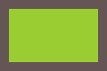

用`box-shadow`的好处在于，它支持逗号分隔语法，可以用来创建任意数量的投影：

```css
box-shadow: 0 0 0 10px #655,
   		    0 0 0 15px deeppink,
            0 2px 5px 15px rgba(0,0,0,.6);
```


唯一需要注意的是，`box-shadow`是层层叠加的，第一层投影位于最顶层，假设为10px，如果外圈再加一道5px的外框，需要指定的扩张半径为：15px（10px+5px）。

需要注意的是：

* 投影不会影响布局，而且不会受到`box-size`属性的影响。不过可以通过内边距或者外边距来额外模拟出边框所需要占据的空间。
* 投影的边框出现在元素的外圈，不会影响鼠标事件。

#### outline方案

如果只需要两层边框，可以先设置一层常规边框，再设置一层outline属性来产生外层的边框。这种方法有点在于边框样式比较灵活，可以模拟虚线边框的效果，还可以通过`outline-offset`属性来控制它跟元素边缘之间的间距，这个属性可以接受负值。但是这个方案中outline产生的边框不会贴合圆角边框。

```css
#div1{
    display: inline-block;
    color: white;
    text-align: center;
    width: 100px;
    height: 60px;
    margin: 25px 25px;
    background: yellowgreen;
    border: 10px solid #655;
    outline: 5px dashed deeppink;
}

#div2{
    display: inline-block;
    color: white;
    text-align: center;
    width: 100px;
    height: 60px;
    margin: 25px 25px;
    background: black;
    border: 10px solid black;
    outline: 1px dashed white;
    outline-offset: -5px;
}

#div3{
    display: inline-block;
    color: white;
    text-align: center;
    width: 100px;
    height: 60px;
    margin: 25px 25px;
    background: yellowgreen;
    border: 10px solid #655;
    border-radius: 15px;
    outline: 5px solid deeppink;
}
```

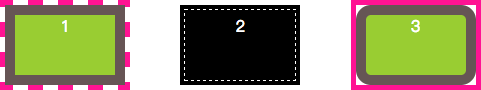

### 灵活的背景定位

#### background-position的扩展语法方案

在[CSS背景与边框（第三版）](http://w3.org/TR/css3-background)中，`background-position`属性允许指定背景图片距离任意角的偏移量，只要在偏移量前面指定关键字。

```css
 background: url(http://csssecrets.io/images/code-pirate.svg)
    no-repeat #58a;
 background-position: right 20px bottom 10px;
```

对不支持`background-position`扩展语法的浏览器中，回退方案是把`bottom right`写到`background`简写属性中：

```css
 background: url(http://csssecrets.io/images/code-pirate.svg)
    no-repeat bottom right #58a;
 background-position: right 20px bottom 10px;
```

#### background-origin方案

当偏移量与容器内边距一致的时候，可以用`background-origin`，让偏移量自动跟着内边距走。

默认情况下，`background-position`的偏移量是以padding box为准，这样边框才不会遮住背景图片。在[背景与边框（第三版）](http://w3.org/TR/css3-background)中的`background-origin`属性可以改变这种行为，其默认值是`padding box`，改成`content-box`后`background-position`的偏移量以content-box为准。

#### calc()方案

<p style="border-left: 4px solid red; padding: 10px;">请不要忘记在`calc()`函数内部的`-`和`+`运算符的两侧各加一个空白符，否则会产生解析错误。</p>

```css
  background: url(http://csssecrets.io/images/code-pirate.svg)
    no-repeat bottom right #58a;
  background-position: calc(100% - 20px) calc(100% - 10px);
```

### 边框内圆角

```css
outline: .6em solid #655;
box-shadow: 0 0 0 .4em #655; /* todo calculate max of this */
border-radius: .8em;
padding: 1em;
background: tan;
```

描边并不会跟着元素的圆角走，但是`box-shadow`会，两者叠加到一起，`box-shadow`刚好填补描边和容器圆角之间的空隙，达到下图的效果。扩张值等于描边宽度可能会浏览器渲染异常，所以扩张半径取圆角半径的一半，并且描边的宽度要比圆角半径的一半要小。

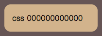

### 条纹背景

<p style="border-left: 4px solid green; padding: 10px;">如果多个色标具有相同的位置，它们会产生一个无限小的过度区域，过度的起止色分别是第一个和最后一个指定值。从效果上看，颜色会在那个位置突然变化，而不是一个平滑的渐变过程：`background: linear-gradient(#fb3 50%, #58a 50%);`。</p>

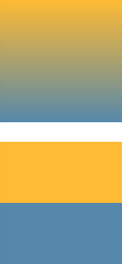

关于`linear-gradient()`，[MDN](https://developer.mozilla.org/zh-CN/docs/Web/CSS/linear-gradient)是这样说明的（颜色参数后面的长度参数是渐变的起始位置或者终止位置）：

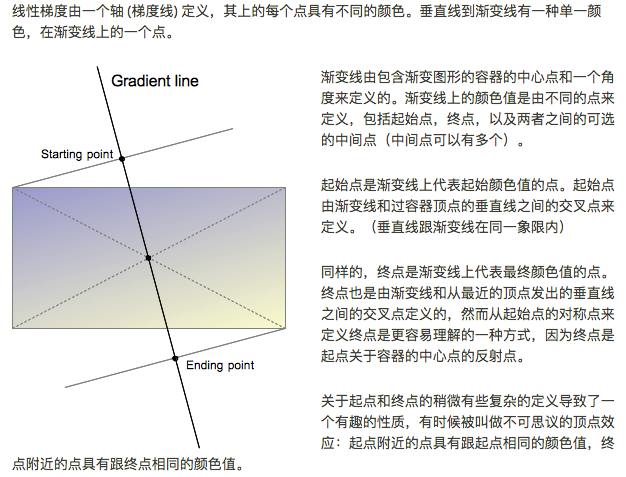

如果第二个色标的位置值设为0，那它的位置就总会被浏览器调整为前一个色标的位置值。`background: linear-gradient(#fb3 50%, #58a 0);`

#### 垂直条纹

```css
  background: linear-gradient(to right, #fb3 50%, #58a 0);
  /*或者这样写*/
  /*background: linear-gradient(90deg, #fb3 50%, #58a 0);*/
  background-size: 30px 100%;
```

#### 斜向条纹

单个贴片中包含四条条纹，才有可能无缝拼接成斜向条纹。

条纹宽度要和垂直条纹宽度一样时，条纹宽度需要通过勾股定理计算。

```css
   background: linear-gradient(45deg, #fb3 25%, #58a 0, #58a 50%, #fb3 0, #fb3 75%, #58a 0);
    background-size: 42px 42px;
```

#### 更好的斜向条纹

可以通过`linear-gradient()`（`radial-gradient()`）的循环加强版`repeating-linear-gradient()`（`repeating-radial-gradient()`）来实现斜向条纹，和前者相比，后者的色标是无限循环的。

使用`repeating-radial-gradient()`可以随意改变斜纹的角度，而且代码中的长度直接表示条纹自身宽度。

```css
background: repeating-linear-gradient(45deg, #fb3 0, #fb3 15px, #58a 0, #58a 30px);
```

#### 灵活的同色系条纹

如果条纹图案属于同色系，只是在明暗方面有着轻微的差别，可以这样写：

```css
 background: #58a;
 background-image: repeating-linear-gradient(30deg, hsla(0,0%,100%,.1) 0, hsla(0,0%,100%,.1) 15px, transparent 0, transparent 30px);
---------等同于---------
background: repeating-linear-gradient(30deg, #79b 0, #79b 15px, #58a 0, #58a 30px);
```

这样写只需要修改一处就可以改变所有颜色，而且对不支持css渐变的浏览器来说起到了回退作用。

### 复杂的背景图案

#### 网格

```css
 	background: white;
    background-image: linear-gradient(90deg, rgba(200,0,0,.5) 50%,  transparent 0),linear-gradient(rgba(200,0,0,.5) 50%,  transparent 0);
    background-size: 30px 30px;
----------改进版，可方便的改变网格尺寸、线宽、颜色----------
  	background: #5588aa;
    background-image: linear-gradient( white 1px,  transparent 0),linear-gradient(90deg,white 1px,  transparent 0);
    background-size: 30px 30px;
```

#### 波点

```css
	background: #655;
    background-image: radial-gradient(tan 30%, transparent 0),
                      radial-gradient(tan 30%, transparent 0);
    background-size: 30px 30px;
    background-position: 0 0,15px 15px;
```

为了达到波点的效果，第二层背景的偏移定位必须是贴片宽高的一半。为了方便维护，可以使用scss的mixin：

```scss
@mixin polka($size,$dot,$base,$accent){
  	background: $base;
    background-image: radial-gradient($accent $dot, transparent 0),
                      radial-gradient($accent $dot, transparent 0);
    background-size: $size $size;
    background-position: 0 0,$size/2 $size/2;
}
```

<p style="border-left: 4px solid green; padding: 10px;">[Bennett的图案库](http://bennettfeely.com/gradients/)</p>

### 伪随机背景

```css
background: hsl(20,40%,90%);
background-image: linear-gradient(90deg, #fb3 10px,  transparent 0),
                  linear-gradient(90deg, #ab4 20px,  transparent 0),
                  linear-gradient(90deg, #655 20px,  transparent 0);
 background-size: 41px 100%,61px 100%,83px 100%;
 width: 300px;
 height: 100px;
 margin: 2em 2em;
```

贴片尺寸是`background-size`的最小公倍数，也就是每隔`41px*61px*83px`后贴片会重复，所以`background-size`尽量选择质数，使得最小公倍数尽可能大，减小重复。

### 连续的图像边框

<p style="border-left: 4px solid green; padding: 10px;">`border-image`工作原理是把图片分成9块，然后把他们应用到元素边框的边和角。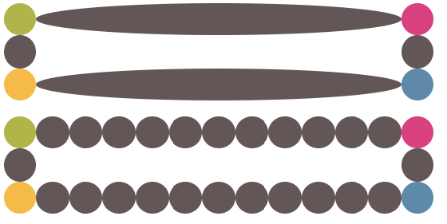</p>

使用`border-image`生成边框，需要额外的html元素：

```css
.div3{
    background: url(http://csssecrets.io/images/stone-art.jpg);
    background-size: cover;

    /* Styling & enable resize */
    width: 21em;
    padding: 1em;
    overflow: hidden;
    resize: both;
    font: 100%/1.6 Baskerville, Palatino, serif;
    margin: 5em 5em;
}
.div3 > div{
    background: white;
    padding: 1em;
}
```

```html
<div class="div3"><div>i am a man</div></div>
```

还可以在背景图片之上，再叠加一层纯白实色背景，这两层背景分别设置不同的`background-clip`值，并且`background-origin`设置为`border-box`，这样使得背景图片在`border-box`范围内平铺：

```css
    padding: 1em;
	border: 1em solid transparent;
    background: linear-gradient(white , white),
                url(http://csssecrets.io/images/stone-art.jpg);
    background-size: cover;
    background-clip: padding-box,border-box;
    background-origin: border-box
```

这个技巧可以用来做蚂蚁行军框：

```css
@keyframes div5 {
    to {background-position: 100%}
}
.div5{
    border: 1px solid transparent;
    background: linear-gradient(white , white) padding-box,
                 repeating-linear-gradient(-45deg ,
            black 0,black 25%,
            white 0,white 50%)
    0 / .6em .6em;
    animation: div5 12s linear infinite;

    /* Styling & enable resize */
    width: 21em;
    padding: 1em;
    font: 100%/1.6 Baskerville, Palatino, serif;
    margin: 5em 5em;
}
```

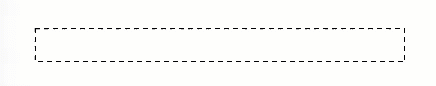

`border-image`配合渐变图案生成顶部边框被剪裁的效果：

```css
border-top : .2em solid transparent; 
border-image : 100% 0 0 linear-gradient(90deg, currentColor 4em, 				   transparent 0); 
padding-top : 1em;
```

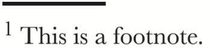

## 形状

### 自适应椭圆

给任何足够大的正方形元素设置一个足够大的`border-radius`就可以把它变成一个圆形。

<p style="border-left: 4px solid green; padding: 10px;">当任意两个相邻圆角的半径之和超过border box的尺寸时，用户代理必须按比例减小各个边框半径所使用的值，直到它们不会相互重叠为止。</p>

`border-radius`可以单独指定水平和垂直半径，只要用`/`分隔两个值即可。

`border-radius`不仅可以接受长度值，还可以接受百分比。

`border-radius: 50%;`可以实现自适应椭圆。

`border-radius`是简写，对应的展开式属性为：`border-top-left-radius`、`border-top-right-radius`、`border-bottom-right-radius`、`border-bottom-left-radius`。可以向`border-radius`一次性提供空格分隔的多个值。如果传了4个值，这4个值分别从左上角开始以顺时针顺序应用到元素的各个拐角；如果传了3个值，意味着第四个值与第二个值相同；如果传了2个值，意味着第三个值与第一个相同。

可以为所有四角提供完全不同的水平半径和垂直半径：斜杠前指定1~4个值，斜杠后指定1~4个值：`border-radius: 10px/5px 20px;`

自适应的半椭圆：`border-radius: 50%/100% 100% 0 0;`

自适应四分之一椭圆：`border-radius: 100% 0 0 0;`

### 平行四边形

#### 嵌套元素方案

用`skew()`变形属性对矩形进行斜向拉伸：`transform: skewX(-45deg);`。

直接用`skew()`拉伸内容也会拉伸，此时可以对内容再用一次反向`skew()`变形，缺点是需要额外的HTML元素包裹内容。

#### 伪元素方案

另一种方法是把所有样式（背景、边框等）应用到伪元素上，然后再对伪元素进行变形，因为内容不包含在伪元素中，所以内容不会受到影响：

```css
.button2 {
    position: relative;
    color: white;
    font: bold 200%/1 sans-serif;
    padding: .5em 1em;
    border: 0;
}

.button2::before {
    content: "";	/*用伪元素生成一个矩形*/
  
    /*偏移量设置为0，以便让伪元素在水平和垂直方向上都被拉伸至宿主元素的尺寸*/
  	position: absolute;
    top: 0;
    right: 0;
    bottom: 0;
    left: 0;
  
    z-index: -1;/*伪元素生成的方块位于内容之上，设置z-index后会推到宿主元素之后*/
    background: #5588aa;
    transform: skew(45deg);
}
```

当想变形一个元素而不想变形它的内容时都可以用到上面的代码。

### 菱形图片

#### 基于变形的方案

```css
.div1 {
    width: 250px;
    height: 250px;
    transform: rotate(45deg);
    overflow: hidden;
    margin: 100px;
}

.div1 img{
    max-width: 100%;
    transform: rotate(-45deg) scale(1.42);
    z-index: -1;
    position: relative;
}
```

```html
<div class="div1">
    
</div>
```

`max-width: 100%`会被解析为容器的边长。要显示为菱形，图片的宽度要与容器的对角线相等。

通过`scale()`变形样式缩放图片时，是以它的中心点进行缩放的。通过`width`属性来放大图片时，只会以它的左上角为原点进行缩放。

#### 裁切路径方案

`clip-path`属性可以把元素剪裁成任何形状。`polygon()`是多边形函数，可以用一系列坐标点来指定任意的多边形，使用百分比时会解析为元素自身的尺寸。

```css
clip-path: polygon(50% 0, 100% 50%, 50% 100%, 0 50%);
```

只要使用同一种形状函数并且点的数量相同，`clip-path`属性可以参与动画：

```css
.img2{
    clip-path: polygon(50% 0, 100% 50%, 50% 100%, 0 50%);
    transition: 1s clip-path;
}

.img2:hover{
    clip-path: polygon(0 0, 100% 0, 100% 100%, 0 100%);
}
```

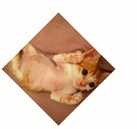

### 切角效果

`linear-gradient`可以接受一个角度作为方向，色标的位置信息也可以是绝对的长度值。

```css
 background: #5588aa;
 background: linear-gradient(45deg, white 15px,#5588aa 0);
```

四角切角效果需要把`background-repeat`关掉，防止四层渐变背景相互覆盖。

```css
    background: #5588aa;
    background: linear-gradient(135deg, white 15px,#5588aa 0) top left,
                linear-gradient(-135deg, white 15px,#5588aa 0) top right,
                linear-gradient(-45deg, white 15px,#5588aa 0) bottom right,
                linear-gradient(45deg, white 15px,#5588aa 0) bottom left;
    background-size: 50% 50%;
    background-repeat: no-repeat;
```

#### 弧形切角

```css
  background: radial-gradient(circle at top left, transparent 15px, #58a 0) top left,
              radial-gradient(circle at top right, transparent 15px, #58a 0) top right,
              radial-gradient(circle at bottom right, transparent 15px, #58a 0) bottom right,
              radial-gradient(circle at bottom left, transparent 15px, #58a 0) bottom left;
  background-size: 50% 50%;
  background-repeat: no-repeat;
```

#### 内联SVG与border-image方案

SVG可以实现与尺寸完全无关的缩放，此处使用的切片尺寸是1，它所对应的是SVG文件的坐标系统，因此不需要单位。`background-clip`属性避免背景色蔓延到边框区域。

`border-width`支持动画效果。

```css
border: 21px solid transparent;
border-image: 1 url('data:image/svg+xml,\
	                      <svg xmlns="http://www.w3.org/2000/svg" width="3" height="3" fill="%2358a">\
	                      <polygon points="0,1 1,0 2,0 3,1 3,2 2,3 1,3 0,2" />\
	                      </svg>');
 background: #58a;
 background-clip: padding-box;
```

#### 裁切路径方案

`clip-path`属性中可以同时使用百分比数值和绝对长度。

```css
    background: #58a;
    clip-path:
            polygon(20px 0, calc(100% - 20px) 0, 100% 20px, 100% calc(100% - 20px),
            calc(100% - 20px) 100%,
            20px 100%, 0 calc(100% - 20px), 0 20px);
```

这个方法不仅可以对任意类型的背景进行裁剪，甚至对替换元素（比如图片）进行裁剪，而且还支持动画效果。

由于它只能对元素做统一的裁剪，当内边距不够宽时，这个方案会裁剪掉文本。渐变方案允许文字溢出并超出切角区域，而`border-image`方案则会起到普通边框的作用，令文字折行。

### 梯形标签页

对元素使用3d变形后，其内部的变形效应是不可逆的。

当没有设置`transform-origin`属性时，应用变形效果会让这个元素以它自身的中心线为轴进行空间上的旋转，因此元素投射到2D屏幕上的尺寸会发生变化。指定`transform-origin: bottom;`，当元素在3D空间中旋转时，可以把它的底边固定住。

```css
.div1{
    height: 50px;
    width: 100px;
    color: white;
    position: relative;
    line-height: 50px;
    margin: 5em 5em;
    text-align: center;
}

.div1::before{
    content: "";
    position: absolute;
    top: 0;right: 0;left: 0;bottom: 0;
    z-index: -1;
    background: #5588aa;
    transform: perspective(.5em) rotateX(5deg) scaleY(1.3);
    transform-origin: bottom;
}
```

这个方法可以给梯形标签页添加背景、边框。圆角。投影等一系列样式，并且只需要把`transform-origin`改成`bottom left`或者`buttom right`就可以立刻得到左侧倾斜或者右侧倾斜的标签页。但是这个方法的斜边角度依赖于元素的宽度。

### 简单的饼图

#### 基于transform的解决方案

用伪元素覆盖上去，通过旋转决定露出多大扇形区。

```css
.pie::before {
    content: '';
    display: block;
    margin-left: 50%;
    height: 100%;
    border-radius: 0 100% 100% 0 / 50%;
    background-color: inherit;	/*背景元素与宿主元素保持一致,比率超过50%时改成棕色*/
    transform-origin: left;	/*伪元素圆形的圆形旋转，还可以写成transform-origin: 0 50%*/
    animation: spin 3s linear infinite, bg 6s step-end infinite;
}
```

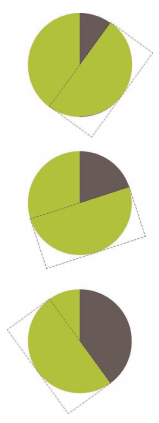


<p style="border-left: 4px solid green; padding: 10px;">一个负的延时值是合法的。与0s的延时类似，它意味着动画会立即开始播放，但会自动前进到延时值的绝对值处，就好像动画在过去已经播放了指定的时间一样。因此实际效果就是动画跳过指定时间而从中间开始播放了。</p>

可以用负的动画延时来直接跳至动画中的任意时间点，并且定格在那里，以此来实现按照比率来显示饼图。这里的动画永远处于暂停状态，指定的持续时间并不会产生任何副作用。

#### SVG解决方案

`stroke-dasharray: 20 10;`是为虚线描边而准备的，20是虚线线段长度，10是间隙长度。

SVG描边时总会把一半绘制在元素外部，另一半绘制在元素内部：

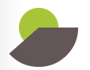

## 视觉效果

### 单侧投影

#### 单侧投影

投影`box-shadow: 2px 3px 4px rgba(0,0,0,5);`的绘制过程：

1. 在该元素相同尺寸和位置绘制颜色为`rgba(0,0,0,5)`的矩形；
2. 把它向右移2px，向下移3px；
3. 使用高斯模糊算法进行4px的模糊处理，本质上表示在阴影边缘发生阴影色和纯透明色之间的颜色过度长度近似于模糊半径的两倍（在这里就是8px）；
4. 模糊后的矩形与原始元素交集部分会被切除掉。

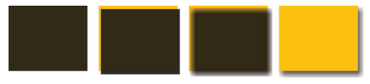

<p style="border-left: 4px solid red; padding: 10px;">**所以`box-shadow`中，没有任何投影绘制在元素的下层**。</p>

`text-shadow`中，文字下层的投影不会被剪裁。

使用4px的模糊半径意味着投影的尺寸会比元素本身的尺寸大8px；因此投影的最外圈会从元素的四面向外显露出来。

`box-shadow`还有第四个长度参数—扩张半径，这个参数会根据指定的值去扩大或者缩小投影尺寸。比如，一个-5px的扩张半径会把投影的宽度和高度各减少10px（每边5px）。

```css
box-shadow: 0 5px 4px -4px rgba(0,0,0,5);
```

#### 邻边投影

扩张半径设为模糊半径相反值的一半，并且偏移量的值需要大于或者等于模糊半径的一半，比如，把6px模糊半径的投影设置到右侧和底部：

```css
box-shadow: 3px 3px 6px -3px rgba(0,0,0,5);
```

#### 双侧投影

设置两块投影（运用两次单侧投影）以实现双侧投影的效果：

```css
box-shadow: 5px 0 5px -5px rgba(0,0,0,5),
			-5px 0 5px -5px rgba(0,0,0,5);
```

### 不规则投影

使用`filter`滤镜属性，该属性只需要一些函数，就可以指定滤镜效果，比如`blur()`、`grayscale()`、`drop-shadow()`等。

```css
filter: blur() grayscale() drop-shadow();
```

`drop-shadow()`带有的参数和`box-shadow`属性一样，但是不包括扩张半径，不包括insert关键字，也不支持逗号分隔的多层投影语法：

```css
filter: drop-shadow(2px 2px 10px rgba(0,0,0,.5));
```

任何非透明的部分都会被打上投影，如果文字被搭上投影，不能用`text-shadow: none`去除。

### 染色效果

#### 基于滤镜的方案

`sepia()`滤镜会给图片增加一种降饱和度的橙黄色染色效果，几乎所有像素的色相值都会被收敛到35~40：

```css
filter: sepia();
```


`saturate()`滤镜可以给每个像素提升饱和度；`hue-rotate()`滤镜把每个像素的相色以指定的度数进行偏移。

```css
filter: sepia(1) saturate(4) hue-rotate(295deg);
```

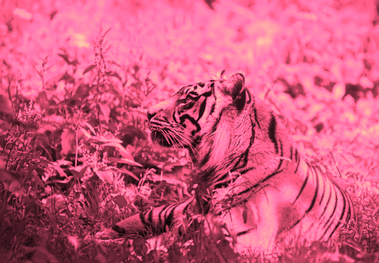

#### 基于混合模式的方案

`luminosity`混合模式会保留上层元素的HSL亮度信息，并从下层吸取色相的饱和度信息。

`background-blend-mode: luminosity;`可以为每层背景单独指定混合模式，不用``元素，而是用`<div>`元素，把这个元素的第一层背景设置为要染色的图片，并把第二层颜色设置成想要的主色调；

`mix-blend-mode: luminosity;`可以为整个元素设置混合模式，需要把图片包裹在一个容器中，并把容器的背景色设置成想要的主色调。

混合模式不可以加动画。把属性设置为`luminosity`混合模式，图片总会跟某些东西进行混合，如果要加上过度动画，可以通过修改背景颜色的方式实现，比如，可以把背景图片和一个透明背景混合，此时不会出现任何混合效果：

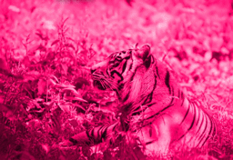

### 毛玻璃效果

`blur()`会使整个元素都会模糊。所以不能对元素本身进行模糊处理，这样文字也会变模糊。

可以对一个伪元素进行处理，然后将其定位到元素下层，它的背景将会无缝匹配`<body>`的背景。

```css
main {
    position: relative;
    margin: 0 auto;
    padding: 1em;
    max-width: 23em;
    background: hsla(0,0%,100%,.25) border-box;
    overflow: hidden;
    border-radius: .3em;
    box-shadow: 0 0 0 1px hsla(0,0%,100%,.3) inset,
    0 .5em 1em rgba(0, 0, 0, 0.6);
    text-shadow: 0 1px 1px hsla(0,0%,100%,.3);
}

main::before {
    content: '';
    position: absolute;
    top: 0; right: 0; bottom: 0; left: 0;
    margin: -30px; /*为了让边缘不出现逐渐消退的效果，需要让伪元素 相对其宿主元素的尺寸再向 外扩大 至少 20px （即它的模糊半径）。由于不同浏览器的模糊算法可能存在差异， 用一个更大的绝对值（比 如 -30px ）会更保险一些。*/
  
    z-index: -1;/*把伪元素移动到宿主元素后面*/
  
    -webkit-filter: blur(20px);/*设置伪元素模糊效果*/
    filter: blur(20px);
}

body, main::before {	/*第二张图是去掉body的效果*/
    background: url("http://csssecrets.io/images/tiger.jpg") 0 / cover fixed;	/*把伪元素和body背景设置为相同的图片，因为main元素有overflow: hidden;所以超出main元素大小的部分会被剪裁掉*/
}
```

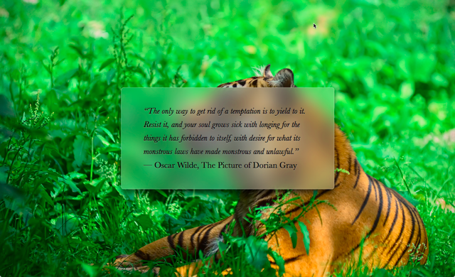

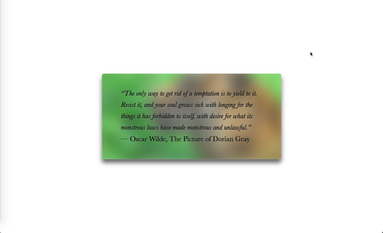

### 折角效果

#### 45°折角的解决方案

切角效果的矩形和渐变生成的小三角形重合。要注意，第二层渐变中的`1.5em`是沿着渐变轴测量的，第一层渐变中`background-size`中的`2em`长度是背景贴片的宽度和高度。为了两者尺寸一致，需要把原来切角渐变的角标位置`2em`除以√2变成`1.5em`。

```css
  	background: #58a; /* Fallback */
    background:
            linear-gradient(to left bottom, transparent 50%, rgba(0,0,0,.4) 0) no-repeat 100% 0 / 2em 2em,
            linear-gradient(-135deg, transparent 1.5em, #58a 0);
```

#### 其他角度的解决方案

```css
.div5 {
    position: relative;
    background: #5588aa;
    background:
                linear-gradient(-150deg,transparent 1.5em,#5588aa 0);
    border-radius: .5em;
    margin-top: 2em;
    width: 12em;
    font: 100%/1.6 Baskerville, Palatino, serif;
    padding: 2em;
    color: white;
}

.div5::before{
    content: '';
    position: absolute;
    top: 0;right: 0;
    background: linear-gradient(to left bottom,transparent 50%,rgba(0,0,0,.2) 0,rgba(0,0,0,.4)) 100% 0 no-repeat;
    width: 1.73em;
    height: 3em;
  
  /*移动并旋转伪元素与切角对齐*/
    transform: translateY(-1.3em) rotate(-30deg);
  
  /*让三角形的右下角成为旋转中心，方便计算便宜距离*/
    transform-origin: bottom right;
  
    border-bottom-left-radius: inherit;
    box-shadow: -.2em .2em .3em -.1em rgba(0,0,0,.15);
}
```

## 字体排印

### 连字符断行

`hyphens`属性有三个值：`none`、`manual`、`auto`。`manual`为默认值，它允许任何时候手工插入软连字符（`&shy;`），来实现断词折行的效果。`hyphens`属性会优先处理软连字符，再去计算其他可以断词的地方。

`hyphens`属性的`auto`值可以比较好的实现连字符断行，不过需要在在HTML标签的`lang`属性中指定合适的语言。

```css
hyphens: auto;
```

### 插入换行

`\A`在Unicode中代表换行，可以用它来作为 `::after `伪元素的内容，并将其添加到每个 `<dd> `元素的尾部。

设置[white-space: pre;](http://www.w3school.com.cn/cssref/pr_text_white-space.asp) 保留源代码中 的空白符和换行。

如果你的结构代码在多个连续的 `<dd> `之间包含了（未加 注释的）空白符，那么逗号前面会有一个空格。可以利用负外边距修复这个问 题，但如果你的内容是以不一样的字体和尺寸来 显示的， 这个空隙的宽度就 不一定刚好 是 0.25em 。

```css
dt, dd {
    display: inline;
    margin: 0;
}

dd {
    font-weight: 600;
}

dd + dt::before {
    content: "\A";
    white-space: pre;
}

dd + dd::before {
    content: ', ';
    font-weight: normal;
    margin-left: -.25em;
}

body {
    font: 150%/1.6 Baskerville, Palatino, serif;
}
```

```html
<dl>
    <dt>Name:</dt>
    <dd>Lea Verou</dd>

    <dt>Email:</dt>
    <dd>lea@verou.me</dd>
    <dd>leaverou@mit.edu</dd>

    <dt>Location:</dt>
    <dd>Earth</dd>
</dl>
```

### 文本行的斑马条纹

可以在 CSS 中用渐变直接生成背景图像，用 em 单位来设定背景尺寸，这样背景就可以自动适应 font-size 的变化了。

```css
pre {
    padding: .5em;
  
  /*创建出水平条纹背景。它的background-size需要设置为line-height的两倍，因为每个背景贴片需要覆盖两行代码。*/
    line-height: 1.5em;
  
    background: hsl(20, 50%, 95%);
    background-image: linear-gradient(
            rgba(120,0,0,.1) 50%, transparent 0);
    background-size: auto 3em;
  
  /*让背景自动跟着内边距的宽度走*/
    background-origin: content-box;
  
    font-family: Consolas, Monaco, monospace;
}
```

### 调整tab的宽度

`tab-size`属性接受一个数字（表示字符数）或者一个长度值（这个不那么实用）来调整tab缩进尺寸。

### 连字

`font-variant-ligatures`专门用来控制连字效果的开启和关闭。如果要启用所有可能的连字，需要同时指定这三个标识符：

```css
font-variant-ligatures: common-ligatures discretionary-ligatures historical-ligatures;
```

可以显式地把两种连字关闭：

```css
font-variant-ligatures: common-ligatures no-discretionary-ligatures no-historical-ligatures;
```

如果要把`font- variant-ligatures`属性复位为初始值，应该使用`normal`而不是`none`，`none`会把所有连字效果都关掉。

### 华丽的&符号

在 font-family 声明中同时指定多个字体（即字体队列 ）这样，即使我们指定的最优先字体不可用，浏览器还可以回退到其他符合整 体设计风格的字体。但是，很多开发者都忽略了一点：**这个机制对单个字符 来说也是有效的**。如果某款字体可用，但仅包括某几个字符，那它就只会用 来显示这几个字符；而在显示其他字符时，浏览器就会回退到其他字体。这 个规则对本地字体和通过 @font-face 规则引入的嵌入字体都是有效的。

@font-face 规则中的 src 描述符还可以接受 local() 函数，用于指定本地字体的名称。

```css
@font-face { 
  font-family: Ampersand; 
  src: local ('Baskerville'), 
       local ('Goudy Old Style'),
       local ('Garamond'), 
       local ('Palatino'); 
}
```

`unicode-range`描述符只在@font-face规则内部生效（因此这里用了描述符这个术语；它并不是一个 CSS 属性），它可以把字体作用的字符范围限制在一个子集内。它对本地字体和远程字体都是有效的。

```css
unicode-range : U+26;
```

可以在控制台用下面语句查询字符的16进制Unicode码位：

```javascript
"&".charCodeAt(0).toString(16); // 返回26
```

如果你想指定一个字符区间，还是要加上`U+`前缀， 比如`U+400-4FF`。 实际上对于这个区间来说， 你还可以使用通配符， 以这样的方式来写：`U+4??`。同时指定多个字符或多个区间也是允许的，把它们用逗号隔开即可， 比如`U+26,U+4??, U+2665-2670` 。

```css
@font-face {
    font-family: Ampersand;
    src: local('Baskerville-Italic'), local('GoudyOldStyleT-Italic'), local('Garamond-Italic'), local('Palatino-Italic');
    unicode-range: U+26;
}

h1 {
    font-family: Ampersand, Helvetica, sans-serif;
}
```

### 自定义下划线

使用`background-image`及其相关属性生成下划线。可以设置两层与背景色相同的`text-shadow`来模拟下划线在遇到字母时会自动断开避让的效果：

```css
a {
    background: linear-gradient(gray, gray) no-repeat;
    background-size: 100% 1px;
    background-position: 0 1.02em;
    text-shadow: .05em 0 white, -.05em 0 white;
}
```

使用渐变来实现下划线的高明之处在于， 这些线条 极为灵活。比如生成虚线下划线：

```css
background: linear-gradient(90deg, gray 66%, transparent 0) repeat-x; background-size: .2em 2px;
background-position: 0 1em;
```

### 现实中的文字效果

#### 凸版印刷效果

出现在底部的浅色投影（或者出现在顶部的暗色投影）会让人 产生物体是凹进平面内的错觉。同理，出现在底部的暗色投影（或者出现在 顶部的浅色投影）会让人产生物体从平面上凸起的错觉。

#### 空心字效果

* 使用多个 text-shadow ，分别为这些投影加上不同方向的少量偏移：

```css
    background: deeppink;
    color: white;
    text-shadow: 1px 1px black, -1px -1px black,
                 1px -1px black,-1px 1px black;
```

* 重叠多层轻微模糊的投影来模拟描边。这种方法不需要设置偏移量，但是性能较差，因为使用了模糊算法：

```css
    background: deeppink;
    color: white;
    text-shadow: 0 0 1px black, 0 0 1px black,
                 0 0 1px black, 0 0 1px black,
                 0 0 1px black, 0 0 1px black;
```

* SVG方案：

```css
h1{
    font: 500%/1 Rockwell, serif;
    background: deeppink;
    color: white;
}

h1 text{
    fill: currentcolor;
}

h1 svg{
    overflow: visible;
}

h1 use{
    stroke: black;
    stroke-width: 6;
    stroke-linejoin: round;
}
```

```html
<h1>
    <svg width="2em" height="1.2em">
        <use xlink:href="#css"/>
        <text id="css" y="1em">css</text>
    </svg>
</h1>
```

#### 文字外发光效果

* 通过几层重叠的 text-shadow，但是依赖 text-shadow 来实现文字显示的做法无法实 现平稳退化：

```css
.p1 {
    font: 250%/1.6 Baskerville, Palatino, serif;
    background: #203;
    color: white;
    transition: 1s;
}

.p1:hover{
    text-shadow: 0 0 .1em, 0 0 .3em;
}
```

* 使用 CSS 滤镜来实现文字的模糊效果：

```css
.span3 {
    font: 250%/1.6 Baskerville, Palatino, serif;
    background: #203;
    color: white;
    transition: 1s;
}

.span3:hover{
    filter: blur(.1em);
}
```

#### 文字凸起效果

使用一长串累加的投影， 不设模糊并以 1px 的跨度逐渐错开，使颜色逐渐变暗，然后在底部加一层强 烈模糊的暗投影，从而模拟完整的立体效果。

```css
.p1 {
    font: 250%/1.6 Baskerville, Palatino, serif;
    background: #58a;
    color: white;
    text-shadow: 0 1px hsl(0,0%,85%),
                 0 2px hsl(0,0%,80%),
                 0 3px hsl(0,0%,75%),
                 0 4px hsl(0,0%,70%),
                 0 5px hsl(0,0%,65%),
                 0 5px black;
}
```

### 环形文字

```html
<div class="circular">
    <svg viewBox="0 0 100 100">
        <path d="M 0,50 a 50,50 0 1,1 0,1 z" id="circle"/>
        <text>
            <textPath xlink:href="#circle">
                circular reasoning works because
            </textPath>
        </text>
    </svg>
</div>
```

* `M 0,50` ：移动到点 (0,50) 。
* `a 50,50 0 1,1 0,1` ：以当前所在的这个点为起点，以当前点右侧 0单位、下方 1 单位的那个点为终点， 画一段圆弧。这段圆弧的水平 半径和垂直半径都必须是 50。如果存在两种可能的圆弧度数，选择 度数较大的那一种；同时，如果存在两种可能的圆弧方向， 选择画 在这两个点右侧的那一种，而不是左侧的。
* `z` ：用一条直线线段闭合这条路径。
* 通过 `<text>` 和 `<textPath> `元素来添加文本，并通过` xlink:href `属性来把它链接到这个圆上：

```css
.circular path {
    fill: none;
}

.circular {
    width: 30em;
    height: 30em;
  
  /*把 SVG 元素自身往下推*/
    margin: 3em auto 0;
}

.circular svg {
    display: block;
  
  /*取消把溢出内容裁切效果*/
    overflow: visible;
}
```

用脚本遍历所有设置了 circular 类的元素，将其文本内容删除并保存在变量中，然后为其填入必要的 SVG 元素：

```html
<div class="circular" >
  circular reasoning works because 
</div>
```

```javascript
$$('.circular').forEach(function (el) {
    var NS = "http://www.w3.org/2000/svg";
    var xlinkNS = "http://www.w3.org/1999/xlink";
    var svg = document.createElementNS(NS, "svg");
    var circle = document.createElementNS(NS, "path");
    var text = document.createElementNS(NS, "text");
    var textPath = document.createElementNS(NS, "textPath");
    svg.setAttribute("viewBox", "0 0 100 100");

    circle.setAttribute("d", "M0,50 a50,50 0 1,1 0,1z");
    circle.setAttribute("id", "circle");

    textPath.textContent = el.textContent;
    textPath.setAttributeNS(xlinkNS, "xlink:href", "#circle");

    text.appendChild(textPath);
    svg.appendChild(circle);
    svg.appendChild(text);
    el.textContent = '';
    el.appendChild(svg);

});
```

## 用户体验

### 选择合适的鼠标光标

#### 提示禁用状态

```css
:disabled , [ disabled ], [ aria - disabled ="true"] { 
    cursor : not-allowed; 
}
```

#### 隐藏鼠标光标

在css2.1中需要用到一张 1×1 的透明 GIF 图片，然后`cursor:url('transparent.gif');`

在css3中只要：`cursor: none;`。

### 扩大可点击区域

> Fitts 法则认为，人类移动到某个 目标区域所需的最短时间是由目标距离与目标宽度之比所构成的对数函数。

* 为按钮设置一圈透明边框：

```css
 	border: 10px solid transparent;
   
	/*把背景限制在原本的区域内*/
    background: #58a;

    background-clip: padding-box;

	/*用box-shadow模拟边框*/
    box-shadow: 0 0 0 1px rgba(0,0,0,.3) inset;
```

* 通过伪元素代表其宿主元素来响应鼠标交互：

```css
.button1 {
    position: relative;
    padding: .3em .5em;
    background: #58a;
    border-radius: 50%;
    border: 1px solid rgba(0,0,0,.3);
    box-shadow:  0 .1em .2em -.05em rgba(0,0,0,.5);
    color: white;
    font: bold 150%/1 sans-serif;
    cursor: pointer;
}

.button1:before {
    content: '';
    position: absolute;
  
  /*伪元素在四个方向上都比宿主元素大出10px*/
    top: -10px; right: -10px;
    bottom: -10px; left: -10px;
}
```

### 自定义复选框

<p style="border-left: 4px solid yellow; padding: 10px;">伪类选择符`:checked`和属性选择符`[checked]`的区别是：后者不会根据用户的交互行为进行更新，因为用户的交互不会影响到HTML标签上的属性。</p>

可以基于复选框的勾选状态借助组合选择符来给其他元素设置样式。

```css
input[type="checkbox"] {
  /*隐藏原始的复选框，不能使用display: none，这样会把它从tab键切换焦点的队列完全删除*/
    position: absolute;
    clip: rect(0,0,0,0);
}

/*设置紧邻input的label伪元素样式*/
input[type="checkbox"] + label::before {
    content: '\a0';
    display: inline-block;
    vertical-align: .2em;
    width: .8em;
    height: .8em;
    margin-right: .2em;
    border-radius: .2em;
    background: silver;
    text-indent: .15em;
    line-height: .65;
}

/*设置紧邻已经勾选的input的label伪元素的样式*/
input[type="checkbox"]:checked + label::before {
    content: '\2713';
    background: yellowgreen;
}

input[type="checkbox"]:focus + label::before {
    box-shadow: 0 0 .1em .1em #58a;
}

input[type="checkbox"]:disabled + label::before {
    background: gray;
    box-shadow: none;
    color: #555;
    cursor: not-allowed;
}
```

```html
<input type="checkbox" id="awesome" autofocus />
<label for="awesome">Awesome!</label>
```

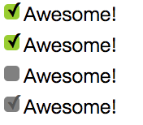

把`<label>`元素与复选框关联，让它起到触发开关的作用，为它添加生成性内 容（伪元素），并基于复选框的状态来为其设置样式。把真正 的复选框隐藏起来，再 把生成性内容美化一番，用来顶替原来的复选框。

#### 开关式按钮

用同样的思路可以实现开关式按钮：

```css
input[type="checkbox"] {
    position: absolute;
    clip: rect(0,0,0,0);
}

input[type="checkbox"] + label {
    display: inline-block;
    padding: .35em .5em .2em;
    background: #ccc;
    background-image: linear-gradient(#ddd, #bbb);
    border: 1px solid rgba(0,0,0,.2);
    border-radius: .3em;
    box-shadow: 0 1px white inset;
    text-align: center;
    text-shadow: 0 1px 1px white;
    cursor: pointer;
}

input[type="checkbox"]:checked + label,
input[type="checkbox"]:active + label {
    box-shadow: .04em .1em .2em rgba(0,0,0,.6) inset;
    border-color: rgba(0,0,0,.3);
    background: #bbb;
}
```

```html
<input type="checkbox" id="awesome" autofocus />
<label for="awesome">Awesome!</label>
```

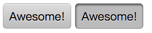

在绝大多数场景下，开关式按钮 对可用性有负面作用，因为它们很容易与普通按钮混淆，让人误以为按下它 会触发某个动作。

### 通过阴影来弱化背景

#### 配合HTML实现

```css
/*用于遮挡背景*/
.overlay{
    position: fixed;
    top: 0;
    right: 0;
    bottom: 0;
    left: 0;
    background: rgba(0,0,0,.8);
}

/*需要吸引用户注意的元素*/
.lightbox {
    position: absolute;
    z-index: 1;
    top: 50%; left: 50%;
    margin: -200px;
}
```

这个方案需要增加额外的HTML，`.overlay`负责把这个关键元素背后的所有东西调暗。

#### 伪元素方案

```css
.lightbox::before {
    position: fixed;
    top: 0;
    right: 0;
    bottom: 0;
    left: 0;
    z-index: -1;
    background: rgba(0, 0, 0, .8);
}
.lightbox {
    position: absolute;
    z-index: 1;
    top: 50%; left: 50%;
    margin: -200px;
}
```

<p style="border-left: 4px solid yellow; padding: 10px;">这个方案没有成功~~~</p>

#### box-shadow方案

`box-shadow`的扩张参数可以把元素的投影向各个方 向延伸放大。具体做法就是生成一个巨大的投影，不偏移也不模糊，简单而 拙劣地模拟出遮罩层的效果：

```css
.lightbox {
    position: fixed;
    top: 50%;
    left: 50%;
    margin: -200px;
    box-shadow: 0 0 0 50vmax rgba(0, 0, 0, .8);
}
```

`vmax`是视口单位，`1vmax`相当于`1vw`和`1vh`两者中的较大值。`100vw`等于整 个视口的宽度，`100vh`就是视口的高度。因此，满足我们需求的最小值就是`50vmax`。 由于投影是同时向四个方向扩展的， 这个遮罩层的最终尺寸将是`100vmax`加上元素本身的尺寸。

这个方案的缺点是：

1. 由于遮罩层的尺寸是与视口相关，而不是与页面相关的，当我们 滚动页面时，遮罩层的边缘就露出来了，除非给它加上`position: fixed;`
2. 当使用一个独立的元素（或伪元素）来实现遮罩层时，这个遮罩 层不仅可以从视觉上把用户的注意力引导到关键元素上，还可以防止用户的 鼠标与页面的其他部分发生交互， 因为遮罩层会捕获所有指针事件。`box- shadow`并没有这种能力， 因此它只能在视觉上起到引导注意力的作用， 却 无法阻止鼠标交互。

#### backdrop方案

`<dialog>`元素可以由它的`showModal()`方法显示出来。根据浏览器 的默认样式，它会自带一个遮罩层。借助`::backdrop`伪元素，这个原生的 遮罩层也是可以设置样式的，比如可以把它变得更暗一些：

```css
dialog::backdrop {
    background: rgba(0,0,0,.8)
}
```

```html
<button onclick="document.querySelector('#modal').showModal()">Click me</button>
<dialog id="modal">
    O HAI!
    <button onclick="this.parentNode.close()">Close</button>
</dialog>
```

**浏览器对它的支持还极为有限。**

### 通过模糊来弱化背景

` <main>`元素它可以把页面中的主要内容标记出来（对话框通常都不是主要内 容），同时还给了我们添加样式的钩子。

```html
<main>.....</main>
<dialog>o hai</dialog>
```

```css
main.de-emphasized {
    -webkit-filter: blur(3px);
    filter: blur(3px);
}
main {
    transition: .6s;
    background: white;
}
```


可以通过`contrast()`和`brightness()`滤镜同时实现模糊效果和阴影效果来弱化背景：

```css
filter: blur(3px) contrast(.8) brightness(.8);
```

但是这个方法没有任何回退方案。

### 滚动提示

<p style="border-left: 4px solid yellow; padding: 10px;">`background-attachment `属性有三个值：`scroll`、`fixed`、`local`。

`scroll`是默认值，背景图像会随着页面其余部分的滚动而移动。

`fixed`表示页面的其余部分滚动背景图像不会移动。

`local `表示背景相对于元素的内容固定。如果一个元素拥有滚动机制，背景将会随着元素的内容滚动， 并且背景的绘制区域和定位区域是相对于可滚动的区域而不是包含他们的边框。</p>

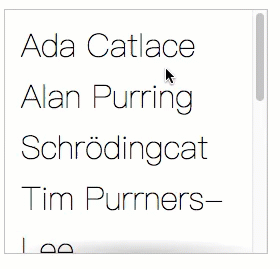

达到上面动图的效果，需要用两层背景，一层用来生成那条阴影，另一层基本 上就是一个用来遮挡阴影的白色矩形，其作用类似于遮罩层。生成阴影的那 层背景将具有默认的 `background-attachment `值（`scroll`），因为我们希望 它总是保持在原位。 我们把遮罩背景的`background-attachment`属性设置 为`local`，这样它就会在我们滚动到最顶部时盖住阴影，在向下滚动时跟着 滚动，从而露出阴影。

```css
ul {
  /*基本样式，让ul的高度小于内容的高度*/
    display: inline-block;
    overflow: auto;
    width: 7.2em;
    height: 7em;
    border: 1px solid silver;
    padding: .3em .5em;
    list-style: none;
    margin-top: 2em;
    font: 100 200%/1.6 'Frutiger LT Std', sans-serif;
}
```

```css
.ul1 {
  /*通过径向渐变生成顶部的阴影，但是生成的阴影出现的时机和我们期望的相反*/
    background: radial-gradient(at top,rgba(0,0,0,.2), transparent 70%) no-repeat;
    background-size: 100% 15px;
    background-attachment: local;
}
----------进化----------
.ul2 {
  /*通过线性渐变生成白色矩形来遮挡阴影*/
    background: linear-gradient(white,white),
            radial-gradient(at top,rgba(0,0,0,.2), transparent 70%);
    background-repeat: no-repeat;
    background-size: 100% 15px;
    background-attachment: local,scroll;
}
----------进化----------
.ul3 {
  /*生成底部的阴影和遮挡矩形，并且把白色矩形的渐变颜色改成linear-gradient(white,hsla(0,0%,100%,0))，这样可以让阴影的显现变得平滑*/
    background: linear-gradient(white 15px, hsla(0,0%,100%,0)) 0 0 / 100% 50px,
    radial-gradient(at top, rgba(0,0,0,.2), transparent 70%) 0 0 / 100% 15px,
    linear-gradient(to top, white 15px, hsla(0,0%,100%,0)) bottom / 100% 50px,
    radial-gradient(at bottom, rgba(0,0,0,.2), transparent 70%) bottom / 100% 15px;

    background-repeat: no-repeat;
    background-attachment: local, scroll, local, scroll;
}
```

### 交互式的图片对比控件

#### CSS resize方案

<p style="border-left: 4px solid yellow; padding: 10px;">`resize`属性控制元素是否能被用户缩放，有`none`、`both`、`horizontal`、`vertical`、`block`、`inline`这几个属性。其中：

`none`表示元素不能被用户缩放。

`both`表示允许用户在水平和垂直方向上调整元素的大小。

`horizontal`表示允许用户在水平方向上调整元素的大小。

`vertical`表示允许用户在垂直方向上调整元素的大小。

如果一个block元素的 overflow 属性被设置成了visible，那么resize属性对该元素无效。</p>

```html
<body>
<div class="image-slider">
    <div></div>
    
</div>
```

```css
.image-slider1 {
    position:relative;
    display: inline-block;
}

.image-slider1 > div {
    position: absolute;
    top: 0; bottom: 0; left: 0;
    width: 50%;/*设置初识宽度*/
    overflow: hidden;/*剪裁图片*/
    resize: horizontal;/*动态改变宽度*/
}

.image-slider1 img {
    display: block;
}
```

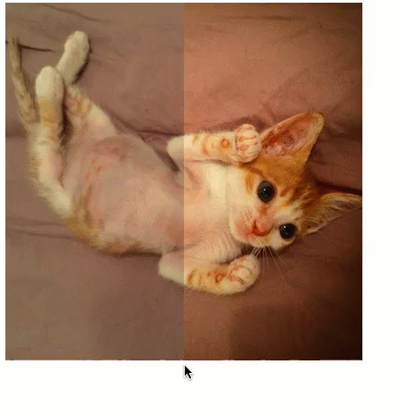

可以看到已经可以随心所欲的改变图片的宽度了，但是调节手柄不容易辨认，而且`<div>`的宽度拉伸超过了图片宽度的（可以注意动图最后右下角调节手柄的位置）。

超出图片宽度只要这样设置`max-width: 100%`。

调节手柄可以通过伪元素覆盖在调节手柄之上：

```css
.image-slider2 > div:before {
    content: '';
    position: absolute;
    right: 0; bottom: 0;
    width: 12px; height: 12px;
    padding: 5px;
    background: linear-gradient(-45deg, white 50%, transparent 0);
    background-clip: content-box;
    cursor: ew-resize;
    -webkit-filter: drop-shadow(0 0 2px black);
    filter: drop-shadow(0 0 2px black);
}
```

` cursor: ew-resize;`表示鼠标变成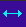

这个方案对键盘来说是不可访问的。

#### 范围输入控件方案

将原生的滑块控件覆盖在图片上，通过js脚本将滑块移动和`<div>`的宽度联系起来，实现用控件控制的效果。

```html
<div class="image-slider3">
    
    
</div>
```

```javascript
$$('.image-slider3').forEach(function (slider) {
    //创建附加的div元素，并用它包裹住第一个图片元素
    var div = document.createElement("div");
    var img = slider.querySelector("img");
    slider.insertBefore(div,img);
    div.appendChild(img);

    //创建滑块
    var range = document.createElement("input");
    range.type = 'range';
  	//滑块和div宽度绑定
    range.oninput = function () {
        div.style.width = this.value + "%";
    };
    slider.appendChild(range);
});

function $$(selector, context) {
    context = context || document;
    var elements = context.querySelectorAll(selector);
    return Array.prototype.slice.call(elements);
}
```

```css
.image-slider3 {
    position:relative;
    display: inline-block;
}

.image-slider3 > div {
    position: absolute;
    top: 0; bottom: 0; left: 0;
    width: 50%;/*设置初识宽度*/
    overflow: hidden;/*剪裁图片*/
}

.image-slider3 img {
    display: block;
    user-select: none;
}
.image-slider3 input{
    position: absolute;
    left: 0;
    bottom: 10px;
    width: 100%;
    margin: 0;
}
```

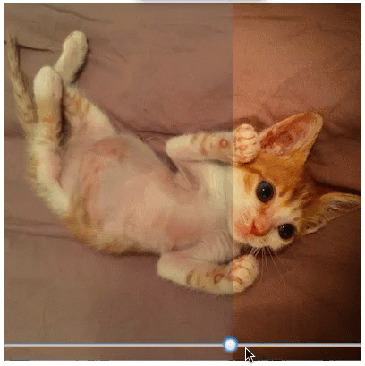

可以通过混合模式、滤镜和变形来优化控件：

```css
.image-slider3 input{
    position: absolute;
    left: 0;
    bottom: 10px;
    /*width: 100%;*/
    margin: 0;

    width: 50%;
    filter: contrast(.5);
    mix-blend-mode: luminosity;
    transform: scale(2);
    transform-origin: left bottom;
}
```

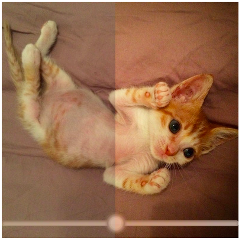

## 结构与布局

### 自适应内部元素

`width`和`height`属性有一个新的关键字： `min-content`，这个关键字将解析为这个容器内部最大的不可断行元素的宽度（即最宽的单词、图片或者具有固定宽度的盒元素）：

```html
<p>Let’s assume we have some text here. Bacon ipsum dolor sit amet turkey veniam shankle, culpa short ribs kevin t-bone occaecat.</p>
<figure>
    
    <figcaption>
        The great Sir Adam Catlace was named after Countess Ada Lovelace, the first programmer ever.
    </figcaption>
</figure>
<p>We also have some more text here. Et laborum venison nostrud, ut veniam sint kielbasa ullamco pancetta.</p>
```

```css
figure {
    max-width: 300px;/*为了向下兼容*/
    max-width: min-content;
    margin: auto;
}

figure > img { max-width: inherit }

/* Basic styling */

figure {
    padding: 10px;
    border: 1px solid silver;
}
```

<p style="border-left: 4px solid yellow; padding: 10px;"> `width`和`height`属性其他的值还有`max-content`，它的行为类似于`display: inline-block`；`fit-content`的行为与浮动元素是相同的（和`min-content`效果通常一致，但也有例外）</p>

### 精确控制表格列宽

`table-layout`属性有`auto`和`fixed`两个值：

`auto`的行为模式被称为自动表格布局算法，会根据内容自动调整表格宽度。

`fixed`表示表和列宽度由表和元素的宽度或第一行单元格的宽度来设置。后续行中的单元格不会影响列宽度。

`table-layout: fixed`这种固定表格布局算法不仅更容易预测、便于使用，同时也明显更快。 因为表格的内容并不会影响单元格的宽度，所以在页面的下载过程中，表格 不需要频繁重绘。

在使用时，我们只需要对 `<table> `元素或其他具有`display: table`样 式的元素应用这个属性即可。 请注意， 为了确保这个技巧奏效， 需要为这 些表格元素指定一个宽度（哪怕是 100% ）。 同样， 为了让`text-overflow: ellipsis`发挥作用， 我们还需要为那一列指定宽度。

```css
table{
  table-layout: fixed;
  width: 100%;
}
```

### 根据兄弟元素的数量来设置样式

`:only-child`可以用来定义只有一个子元素时的样式。等效于`:first-child:last-child`。`:last-child`相当于`:nth-last-child(1)`。

`li:first-child:nth-last-child(4)`表示一个正好有四个列表项的列表中的第一个列表项。如下图所示：

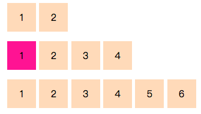


通过`:first-child:nth-last-child()`找到特定数量列表中的第一项，然后可以使用兄弟选择器`~`来命中它之后的所有兄弟元素，这样就达到了选定特定数量列表项中每个元素的目的：

```css
li:first-child:nth-last-child ( 4 ), li:first-child:nth-last-child ( 4 ) ~ li { /* 当列表正好包含四项时，命中所有列表项 */ }
```

### 根据兄弟元素的数量范围来匹配元素

`:nth-child()`中的参数不仅可以是数字还可以是`an+b`这样的表达式。如果参数是`n+b`这样的表达式，不论`n`取何值，这个表达式无法产生小于`b`的值，因此`n+b`这个表达式可以选择从第`b`个元素开始的所有子元素。

同样`n+b`这个表达式也可以用在`:nth-last-child ()`上，这样可以在列表总数是`b`或者更多时选中所有列表项：

```css
li:first-child:nth-last-child ( n + 4 ), li:first-child:nth-last-child ( n + 4 ) ~ li { /* 当列表至少包含四项时，命中所有列表项 */ }
```

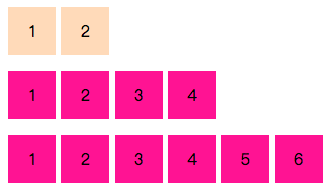

`-n+b`表达式可以选中开头的`b`个元素。这样可以在列表总数是`b`或者更少时选中所有列表项：

```css
li:first-child:nth-last-child ( -n + 4 ), li:first-child:nth-last-child ( -n + 4 ) ~ li { /* 当列表最多包含四项时，命中所有列表项 */ }
```

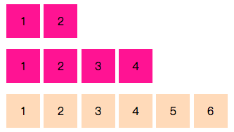

这两个技巧还可以组合起来使用，比如在列表包含2~4个列表项时命中所有的列表项：

```css
li:first-child:nth-last-child ( n + 2 ) :nth-last-child ( -n + 4 ), li:first-child:nth-last-child ( n + 2 ) :nth-last-child ( -n + 4 ) ~ li { /* 当列表包含2～4项时，命中所有列表项 */ }
```

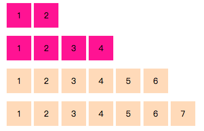

### 满幅的背景，定宽的内容

`calc()`函数允许在css中直接进行简单的算式来指定属性的值。

<p style="border-left: 4px solid red; padding: 10px;">别忘了在`calc()`函数中用 空白符把`-`和`+`隔起来，否则会 产生解析错误！这个看似怪异的规则是为了向前兼容，因为在未来，`calc()`可能会允许使用标识符， 而这些标识符本身可能会包含连字符，容易与减号混淆。</p>

如果内容居中，左右外边距实际上都等于视口宽度的一半减去内容宽度的一半，而且使用`calc()`函数计算出的值可以用在任何一个接受长度值的属性上，所以可以这样写：

```css
<footer>
	<div class="wrapper">
	<!--内容-->
	</div>
</footer>
      
footer {
  background: #333;
}
.wrapper {
  max-width:900px;
  margin:1em auto;
}
-------升级-------
<footer>
	<!--内容-->
</footer>

footer {
  max-width: 900px;/*这一行声明注释掉没影响，因为当内边距是 50% - 450px 时，只可能给内容留出 900px （2× 450px ）的可用空 间。 只有把 width 显式地设置为 900px 之外（或大或小）的其他值， 我们 才有可能看出区别。由于我们想要得到的内容宽度本来就是 900px ，这一行 声明其实就是冗余的，我们可以把它去掉*/

  padding: 1em calc(50% - 450px);
  background: #333;
}
-------升级-------
<footer>
	<!--内容-->
</footer>

footer {
  padding: 1em;	/*向后兼容，避免浏览器不支持calc()函数*/
  padding: 1em calc(50% - 450px);
  background: #333;
}
```

### 垂直居中

#### 基于绝对定位的解决方案

先把这个元素的左上角放置在视 口（或最近的、具有定位属性的祖先元素）的正中心，然后再利用负外边距 把它向左、向上移动（移动距离相当于它自身宽高的一半），从而把元素的 正中心放置在视口的正中心。借助`calc()`函数可以简化代码：

```css
.main1 {
  position: absolute;
  top: 50%;
  left: 50%;
  margin-top: -5em; /*6/2=3*/
  margin-left: -9em; /*18/2=9*/
  width: 18em;
  height: 10em;
}
-------升级-------
.main1 {
    position: absolute;
    left: calc(50% - 9em);
    top: calc(50% - 5em);
    width: 18em;
    height: 10em;
}
```

当我们在 translate() 变形函数中使用百分比值时，是以这个元素自身的宽度和高度 为基准进行换算和移动的，而这正是我们所需要的。接下来，只要换用基于 百分比的 CSS 变形来对元素进行偏移， 就不需要在偏移量中把元素的尺寸 写死了。

```css
.main1 {
    position: absolute;
    left: 50%;
    top: 50%;
    transform: translate(-50%, -50%);
}
```

<p style="border-left: 4px solid yellow; padding: 10px;">`translate()`用来移动元素在平面上的位置。这种变换的特点是一个向量，其坐标定义多少，它在每个方向移动多少。

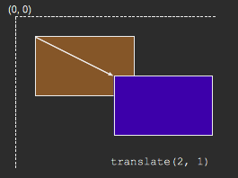</p>

这个方案有以下缺点：

* 需要绝对定位，对整个布局的影响太过强烈
* 如果需要居中的元素已经在高度上超过了视口，那它的顶部会被视 口裁切掉
* 在某些浏览器中，这个方法可能会导致元素的显示有一些模糊，因 为元素可能被放置在半个像素上。 这个问题可以用 transform- style: preserve-3d 来修复，不过很难保证它在未来不会出问题。

#### 基于视口单位的解决方案

原理和上面的方案一样，不过通过`margin`属性的百分比值来控制元素左上角位于容器的中心，然后再用`translate()`技巧来把元素以其自身高度宽高的一半为距离进行移动。

`margin`的百分比是以<span id="inline-red">父元素的宽度</span>作为解析基准的。

css3定义了一套与视口相关的长度单位：

* `vw`是与视口宽度相关的。`1vw`实际上表示视口宽度的1%，而不是100%。
* `1vh`表示视口高度的1%。
* 当视口宽度小于高度时，`1vmin`等于`1vw`，否则等于`1vh`。
* 当视口宽度大于高度时，`1vmax`等于`1vw`，否则等于`1vh`。

```css
.main2 {
    width: 18em;
    padding: 1em 1.5em;
    margin: 50vh auto 0;
    transform: translate(-50%,-50%);
}
```

这个方案只适合在视口中居中的场景。

#### 基于Flexbox的解决方案

先给这个待居中元素的父元素设置`display: flex`（在这个例子中是`<body>`元素），再给这个元素自身设置`margin: auto`（在这个例子中是`<main>`元素）：

```css
body{
    display: flex;
    min-height: 100vh;
    margin: 0;
}

main {
    margin: auto;
}
```

当我们使用 Flexbox 时，`margin: auto`不仅在水平方向上将元 素居中，垂直方向上也是如此。我们甚至不需要指定任何宽度（如果需要的话，也是可以指定的）：这个居中元素分配到的宽度等于`max- content`。

Flexbox 的另一个好处在于，它还可以将匿名容器（即没有被标签包裹 的文本节点）垂直居中。比如：

```html
<main>Center me,please!</main>
```

```css
main { 
  display : flex; 
  align-items : center; 
  justify-content : center; 
  width : 18em; 
  height : 10em; 
}
```

<p style="border-left: 4px solid yellow; padding: 10px;">`justify-content`用于设置或检索弹性盒子元素在主轴（横轴）方向上的对齐方式。

`align-items`属性属性定义flex子项在flex容器的当前行的侧轴（纵轴）方向上的对齐方式。这意味着它像`justify-content`一样，但是在垂直方向。</p>

`align-self `属性规定弹性盒子元素内被选中项目的对齐方式。直接用`align-self: center`就可以实现垂直居中。

### 紧贴底部的页脚

#### 固定高度的解决方案

```html
<header>
    <h1>Site name</h1>
</header>
<main>
    <input type="checkbox" id="contents" /><label for="contents">Toggle contents</label>
    <p>Bacon ipsum dolor ....</p>
</main>
<footer>
    <p>© 2015 No rights reserved.</p>
    <p>Made with ♥ by an anonymous pastafarian.</p>
</footer>
```

计算出页脚所占高度和大标题与最顶部的距离，然后让内容的最小高度为（视口高度-页脚所占高度-大标题与最顶部的距离）。

```css
main { 
  min-height : calc(100vh - 2.5em - 7em); 
  /* 避免内边距或边框搞乱高度的计算： */ 
  box-sizing : border-box; 
}
```

或者直接把`<header>`和`<main>`元素包在一个容器里面，这样只要计算页脚高度：

```css
#wrapper { 
  min-height: calc(100vh - 7em); 
}
```

这套方案不仅要求我们确保页脚内的文本永远不会折行， 而且每当我们改变页脚的尺寸时，都需要跟着调整`min-height`值。

#### 更灵活的解决方案

对父元素设置`display: flex`，当父元素获得这个属性之后，就可以对其 子元素触发“伸缩盒布局模型”。 我们还需要把`flex-flow`设置为`column`， 否则子元素会被水平排放在一行上。

要把父元素的`min-height`属性指 定为`100vh`，这样它就至少会占据整个视口的高度。不过此时各个子元素的高度仍然是以各自的内容为准的（按照 CSS 规 范的说法，它们的高度仍然由内部因素来决定）。只要给`<main>`这个容器的`flex`属性指定一个大于 0 的值（比如 1 即可），内容区块的高度应该可以自动伸展并占满所有的可用空间。

```css
body {
    display: flex;
    flex-direction: column;
    min-height: 100vh;
}
main {
  flex: 1;
}
```

 <p style="border-left: 4px solid yellow; padding: 10px;">`flex`属 性 实 际 上 是`flex-grow`、`flex-shrink`和`flex-basis`的 简 写 语 法。 任 何 元素只要设置了一个大于 0 的`flex`值， 就将获得可伸缩的特 性；`flex`的值负责控制多个可伸 缩元素之间的尺寸分配比例。 举例来说，在上面的这个例子中， 如 果`<main>`是`flex: 2`而 `<footer>`是`flex: 1`，那么内容 区块的高度将是页脚高度的两倍。如果把它们的值从 2 和 1 改为 4和 2 ， 结果也是一样的， 因为真 正起作用的是它们的数值比例。</p>

## 过渡与动画

### 缓动效果

#### 弹跳动画

所有过渡和动画都是跟一条曲线（缓动曲线）有关的，这条曲线指定了动画过程在整段时间中是如何推进的。如果不指定调速函数， 它就会得到一个默认值。这个默认的缓动效果并不是我们想像中的匀速效果，而是如下图所示的效果：

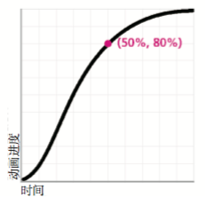

不 论 是在`animation / transition`简 写 属 性 中，还 是在`animation- timing-function / transition-timing-function`展开式属性中，`ease`都是是 默认值缓动曲线如上图。除此以外，还有四种内置的缓动曲线，你可以用它们来改变动画的推进方式：

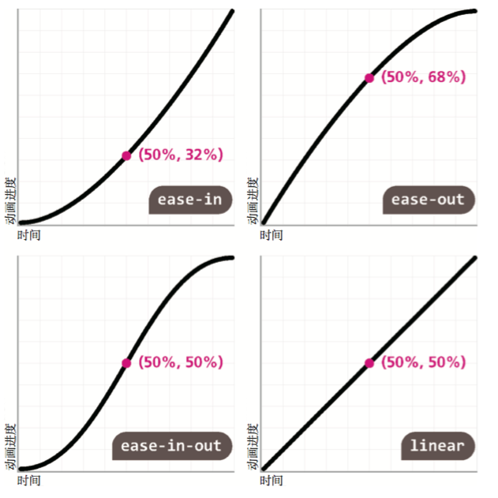

`ease-out`是`ease-in`是反向版本。 这一对组合正好是实现回弹效果所需要的：每当小球的运动方向相反时，我们希望调速函数也是相反的。 因此，我们可以在`animation`属性中指定一个通用的调速函数， 然后在关键帧中按需覆盖它。我们希望下落方向上的调速函数是加速的（`ease- out`），而弹起方向上是减速的（`ease-in`）：

```css
@keyframes bounce {
    60%, 80%, to {
        transform: translateY(400px);
        animation-timing-function: ease-out;
    }
    70% { transform: translateY(300px); }
    90% { transform: translateY(360px); }
}

.ball {
    width: 0; height: 0; padding: 1.5em;
    border-radius: 50%;
    margin: auto;
    background: red radial-gradient(at 30% 30%, #fdd, red);
    animation: bounce 2s ease-in ;
}
```

所有这五种曲线都是通过（三次）贝塞尔曲线来指定的。这种曲线 由一定数量的路径片断所组成，各个片断的每一端都可以由一个手柄来控制曲率（这些手柄通常也被称作控制锚点）。一条复杂的曲线可能包含很多个 片断，这些片断的端点彼此相连构成了整条曲线。

作为对上述五种预定义曲线的补充，CSS 提供了`cubic-bezier()`函数，允许我们指定自定义的调速函数。它接受四个参数，分别代表两个控 制锚点的坐标值， 我们通过这两个控制锚点来指定想要的贝塞尔曲线。 语法形式是这样的：`cubic-bezier(x1, y1, x2, y2)`，其中`( x 1 , y 1 )`表示第一 个控制锚点的坐标， 而`( x 2 , y 2 )`是第二个。 曲线片断的两个端点分别固定在`(0,0)`和`(1,1)`，前者是整个过渡的起点（时间进度为零，动画进度为零）， 后者是终点（时间进度为 100%，动画进度为 100%）。两个控制锚点 的 x 值都被限制在 [0, 1] 区间内（即我们无法把手柄在水平方向上移出这个图形范围）。只要把控制锚点的水平坐标和垂直坐标互换， 就可以得到任何调速函数的反向版本。

下面的`ease` 等 同 于`cubic-bezier(.25,.1,.25,1)`，它的反向版本就是`cubic- bezier(.1,.25,1,.25)`：

```css
@keyframes bounce {
    60%, 80%, to {
        transform: translateY(400px);
        animation-timing-function: ease;
    }
    70% { transform: translateY(300px); }
    90% { transform: translateY(360px); }
}

.ball {
    width: 0; height: 0; padding: 1.5em;
    border-radius: 50%;
    margin: auto;
    background: red radial-gradient(at 30% 30%, #fdd, red);
    animation: bounce 2s cubic-bezier(.1,.25,1,.25) forwards;
}
```

借助一款[cubic-bezier.com](cubic-bezier.com)的图形化工具，可以反复调整贝塞尔曲线，从而优化动画效果。

#### 弹性过渡

```html
<label>
    Your username:
    <input value="leaverou"></input>
    <span class="callout">
	Only letters, numbers, underscores (_) and hyphens (-) allowed!
	</span>
</label>
```

```css
input:not(:focus) + .callout {
    transform: scale(0);
}

.callout {
    transition: .5s transform;
    transform-origin: 1.4em -.4em;
}
---------升级到弹性过渡---------
@keyframes elastic-grow {
    from {transform: scale(0)}
    70% {
        transform: scale(1.1);
        animation-timing-function: cubic-bezier(.1,.25,1,.25);
    }
}

input:not(:focus) + .callout:not(:hover) {
    transform: scale(0);
}

input:focus + .callout {
    animation: elastic-grow .5s;
}
```

上面的弹性过渡特效使用了动画，但是有点大材小用，还可以只用`cubic-bezier()`函数来实现。

曲线的控制锚点可以在垂直方向上突破 0~1 区间，从而让过渡达到低于0或高于100%的程度。它表示如果我们要从 scale(0) 的变形程度过渡到 scale(1) ，就还将经历一个比最终值更大的状 态，比如 scale(1.1) （或者更甚，这取决于调速函数有多陡）。

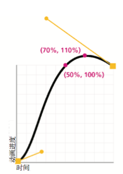

从上图可以看出，现在这个过渡会在总时长 50% 的时间点达到100%的变形程度。 不过， 过渡过程并不会停在那里；它会在超越最终值之后继 续推进， 在 70% 的时间点达到 110% 的变形程度峰值， 然后在最后可用的 30% 时间里过渡回它的最终值。 可见， 整个过渡的推进过程非常接近前面 的动画方案，但它只需要一行代码就可以实现整个效果：

```css
input:not(:focus) + .callout {
    transform: scale(0);
}
.callout {
    transition: .5s cubic-bezier(.25,.1,.3,1.5);
    transform-origin: 1.4em -.4em;
}
```

当我们把焦点从输入框中切出去的时候，所触发 的过渡会以`scale(1)`作为起始值， 并以`scale(0)`作为最终值。 由于此时 是相同的调速函数在起作用，这个过渡仍然会在 350ms 后到达110%的变形 程度。只不过在这里，110% 变形程度的解析结果并不是 `scale(1.1)`，而是`scale(-0.1)`，这样就会出现下面的效果：

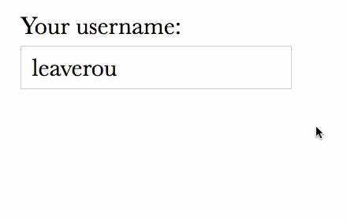

修复这个问题不过是多加一行代码而已。假设我们 只想给提示框的关闭过程指定普通的 ease 调速函数，那么可以在定义关闭 状态的 CSS 规则中把当前的调速函数覆盖掉：

```css
input:not(:focus) + .callout {
    transform: scale(0);
  	transition-timing-function: ease;
}
.callout {
    transition: .5s cubic-bezier(.25,.1,.3,1.5);
    transform-origin: 1.4em -.4em;
}
```

但是此时提示框的关闭动作明显要迟钝一 些。这是因为在提示框的展开过程中，当时间 进行到 50% 时（即 250ms 之后）， 它就已经达到 100% 的完整尺寸了。 但 在收缩的过程中，从 0 到 100% 的变化会花费我们为过渡所指定的所有时间 （500ms），因此感觉上会慢一半。要修复这个问题，只需同时覆盖过渡的持续时间即可，我们既可以单独 覆盖`transition-duration`这一个属性，也可以用`transition`这个简写属 性来覆盖所有的值。如果选择后者的话，就不需要显式指定 ease 了：

```css
input:not(:focus) + .callout {
    transform: scale(0);
  	transition: .25s;
}
.callout {
    transition: .5s cubic-bezier(.25,.1,.3,1.5);
    transform-origin: 1.4em -.4em;
}
```

在对颜色属性的弹性过渡中，由于RGB三个通道的值是独立进行插值运算的， 因此这个过渡过程中可能会产生其他颜色，为避免不小心对颜色设置了弹性过渡， 可以尝试 把过渡的作用范围 限制在某几种特定的属性上。当我们在`transition`简写属性中不指定任何属性时，`transition-property`就会得 到它的初始值：`all`。这意味着只要是可以过渡的属性，都会参与过渡。因 此，如果我们以后在提示框打开状态的样式规则中增加一行 `background`声明，那么弹性过渡也会作用在这个属性上。

```css
input:not(:focus) + .callout {
    transform: scale(0);
  	transition: .25s transform;
}
.callout {
    transition: .5s cubic-bezier(.25,.1,.3,1.5) transform;
    transform-origin: 1.4em -.4em;
}
```

<p style="border-left: 4px solid yellow; padding: 10px;">可以通过`transition-delay`属 性把各个属性的过渡过程排成列队， 这个 属性的值实际上就是`transition`简写属性中的第二个时间值。 举例 来 说， 如 果`width`和`height`都需要过渡效果， 而且你希望高 度先变化然后宽度再变化， 就可以这样 写：`transition: .5s height, .8s .5s width;`（ 也 就 是 说， 让 width过渡的延时正好等于`height`过渡的持续时间）。</p>

### 逐帧动画

```html
<div class="loader">Loading…</div>
```

```css
@keyframes loader {
    to { background-position: -800px 0; }
}

.loader {
    width: 100px; height: 100px;
    animation: loader 1s infinite linear;
    text-indent: 999px; overflow: hidden; /* Hide text */
    background: url(http://dabblet.com/img/loader.png) 0 0;
}
```

这种通过应用各种不同的`background-position`值的方法会显示帧与帧之间的动画：


这时候可以采用`steps()`调速函数，而不是基于贝塞尔曲线的调速函数。

所有基于贝塞尔曲线的调速函数都会在关键帧之间进行插值运算，从而产生平滑的过渡效果。在通常情况下，平滑的过渡是我们使用 CSS 过渡和动画的原因。 但在眼前的场景下， 这种平滑特性恰恰毁 掉了我们想实现的逐帧动画效果。	

与贝塞尔曲线调速函数迥然不同的是，`steps()`会根据你指定的步进数量（在这个例子中就是动画的帧数），把整个动画切分为多帧，而且整个动画会在帧与帧之间硬切，不会做任何插值处理。

```css
.loader {
    width: 100px; height: 100px;
    text-indent: 999px; overflow: hidden; /* Hide text */
    background: url(http://dabblet.com/img/loader.png) 0 0;
    animation: loader 1s infinite steps(8);
}
```

`steps()`还接受可选的第二个参数， 其值可以是`start`或`end`（默认值）。这个参数用于指定动画在每个循环周期的什么位置发生帧的切换动作，但实际上这个参数用得并不 多。 如果我们只需要一个单步切换效果， 还可以使用`step-start`和`step- end`这样的简写属性，它们分别等同于`steps(1, start)`和`steps(1, end)`。

<p style="border-left: 4px solid yellow; padding: 10px;">对`steps(1, start)`和`steps(1, end)`的理解可以参照闪烁效果中的例子</p>

### 闪烁效果

```css
@keyframes blink-1 { to { color: transparent } }

.blink-smooth-1 {
    animation: 1s blink-1 3;
}
----------升级----------
@keyframes blink-2 { 50% { color: transparent } }

.blink-smooth-2 {
    animation: 1s blink-1 3;
}
```

下图中，`.blink-smooth-1`对应第二个闪烁图，`.blink-smooth-2`对应第一个闪烁图。

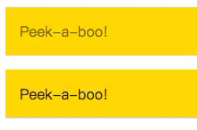

通过修改关键帧，让状态切换发生在每个循环周期的中间。

`animation-direction`的唯一作用就是反转每一个循环周期（`reverse`），或第偶数个循环周期（`alternate`），或第奇数个循环周期（`alternate-reverse`）。它的伟大之处在于，它会同时反转调整函数 ，从而产生更加逼真的动画效果。

```css
@keyframes blink-2 { to { color: transparent } }

.blink-smooth-2 {
    animation: .5s blink-1 6 alternate;
}
```

必须把动画循环的次数翻倍（而不是像前面的方法那样把循环周期的时间长度翻倍），因为现在一次淡入淡出的过程是由两个循环周 期组成的。基于同样的原因，我们也要把`animation-duration`减半。

如果用`steps()`函数来实现:

```css
@keyframes blink { to { color: transparent } 
  
.blink {
    animation: 1s blink 3 steps(1);
}
```

此时文字不会闪烁，因为`steps(1)`本质上等同于`steps(1, end)`， 它表示当前颜色与`transparent`之间的过渡会在一次步进中完成，于是颜色值的切换只会发生在动画周期的末尾。因此，我们会看到起始值贯穿于整个动画周期，而终止值只在 动画结尾的无限短的时间点处出现。如果我们改用`steps(1, start)`，结果 就完全相反了：颜色值的切换会发生在动画周期最开始，于是我们始终只能 看到纯透明的文字，没有任何动画或闪烁效果。

我们接下来可以换用`steps(2)`来碰碰运气，两种步进方式（`start`或`end`）都可以试一下。现在我们终于可以看到闪烁效果了， 但这个闪烁效果要么是由半透明切到纯透明，要么是由半透明切到实色，原因同上。由于我们无法通过配置`steps()`来让这个切换动作发生在动画周期 的中间点（只能发生在起点或终点），唯一的解决方案是调整动画的关键帧， 让切换动作发生在 50% 处，就像我们在本节刚开始所做的那样：

```css
@keyframes blink-1 { to { color: transparent } 
  
.blink1 {
    animation: 1s blink-1 3 steps(2);
}
----------升级----------
@keyframes blink-2 { 50% { color: transparent } 
  
.blink2 {
    animation: 1s blink-2 3 steps(1);
}
```

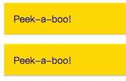

上图第一个对应的是`blink-1`的效果，第二个对应的是`blink-2`的效果。

### 打字动画

核心思路就是让容器的宽度成为动画的主体：把所有文本包裹在这个容 器中，然后让它的宽度从 0 开始以步进动画的方式、一个字一个字地扩张到 它应有的宽度。这个方法并不适用于多行文本。

动画的持续时间越长，动画效果越差：持续时间较短的动画会让界面显得更加精致。反之，动画的持续时间越长，越容易让用户感到厌烦。因此，即使这个 技巧可以用在大段文本身上，也不一定是个好主意。

需要用`white-space: nowrap;`来阻止文本折行，否则文本的行数会随着宽度的扩张不断变化。

用`overflow: hidden;`， 裁切超出宽度的文本。

用`steps()`来达到动画逐字呈现的效果，而不是平滑连贯的。

```html
<h1>CSS is awesome!</h1>
```

```css
@keyframes typing {
    from { width: 0 }
}

h1 {
    font: bold 200% Consolas, Monaco, monospace;
    width: 7.7em;
    white-space: nowrap;
    overflow: hidden;
    animation: typing 8s steps(15),
}
```

此时的效果如下：

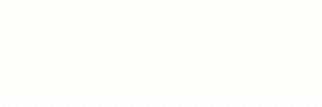

用`em`指定宽度显然效果不好，可以用`ch`来解决这个问题。

`ch`表示“0” 字形的宽度，是[CSS值与单位（第三版）](http://w3.org/TR/css3-values)规范引入的一个新单位。在绝大多数场景下， 我们并不关心`0`这个字符显示出来到底有多宽。但对等宽字体来说，这是个 例外。在等宽字体中，“0”字形的宽度和其他所有字形的宽度是一样的。因 此，如果我们用 ch 单位来表达这个标题的宽度，那取值实际上就是字符的数量。

```css
@keyframes typing {
    from { width: 0 }
}

h1 {
    font: bold 200% Consolas, Monaco, monospace;
    width: 15ch;
    white-space: nowrap;
    overflow: hidden;
    animation: typing 8s steps(15),
}
```

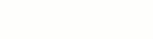

在这个例子中，可以用一个伪元素来生成光标，并通过`opacity`属性来实现闪烁效果；我们也可以用右边框来模拟 光标效果，这样就可以把有限的伪元素资源节省下来留作他用。光标的闪烁动画是需要无限循环的（即使所有的文字都显示完整之后仍然如此）， 因此需要用到 infinite 关键字。

```css
@keyframes typing {
    from { width: 0 }
}

@keyframes caret {
    50% { border-right-color: transparent; }
}

h1 {
    font: bold 200% Consolas, Monaco, monospace;
    width: 15ch;
    white-space: nowrap;
    overflow: hidden;
    border-right: .05em solid;
    animation: typing 8s steps(15),
    		   caret 1s steps(1) infinite;
}
```

由于需要根据每 个标题的字数来给它们分别指定不同的宽度样式， 而且还需要在每次改变标题内容时同步更新这些宽度样式，所有可以用一段JavaScript代码来实现：

```javascript
function $$(expr, con) {
    return [].slice.call((con || document).querySelectorAll(expr));
}

$$('h1').forEach(function (h1) {
    var len = h1.textContent.length, s = h1.style;
    s.width = len + 'ch';
    s.animationTimingFunction = "steps(" + len + "),steps(1)";
});
```

### 状态平滑的动画

让背景的`background-position`属性值从原本的`0 0`一直变化到`100% 0`时，我们就会看到这张图片从左侧一直滚动到右侧的完整过程。

```css
@keyframes panoramic {
    to { background-position: 100% 0; }
}

.panoramic {
    width: 150px; height: 150px;
    background: url('http://c3.staticflickr.com/3/2671/3904743709_74bc76d5ac_b.jpg');
    background-size: auto 100%;
    animation: panoramic 10s linear infinite alternate;
}
```

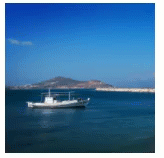

接下来实现当用户鼠标悬停时才开始播放的效果：

```css
@keyframes panoramic {
    to { background-position: 100% 0; }
}

.panoramic {
    width: 150px; height: 150px;
    background: url('http://c3.staticflickr.com/3/2671/3904743709_74bc76d5ac_b.jpg');
    background-size: auto 100%;
}

.panoramic:hover, .panoramic:focus {
    animation: panoramic 10s linear infinite alternate;
}
```

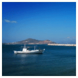

这时候当我们把鼠标移出图片时，它就会生硬地跳回最左侧。为了修复这个问题，我们需要换个角度来思考：我们在这里到底想要实 现什么样的结果。我们需要的并不是在`:hover`时应用一个动画，因为这意 味着动画被中断时的状态是无处保存的。我们需要的是当失去 :hover 状态 时暂停动画。有一个属性正好是为暂停动画的需求专门设计的：`animation-play-state`。

```css
@keyframes panoramic {
    to { background-position: 100% 0; }
}

.panoramic {
    width: 150px; height: 150px;
    background: url('http://c3.staticflickr.com/3/2671/3904743709_74bc76d5ac_b.jpg');
    background-size: auto 100%;
    animation: panoramic 10s linear infinite alternate;
    animation-play-state: paused;
}

.panoramic:hover, .panoramic:focus {
    animation-play-state: running;
}
```

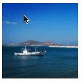

### 沿环形路径平移的动画

```html
<div class="path">
    
</div>
```

```css
@keyframes spin {
    to { transform: rotate(1turn); }
}
.avatar {
    animation: spin 3s infinite linear;
    transform-origin: 50% 150px; /*150px = 路径的半径*/
}
```

这段代码不仅让头像沿着环形路径转动，同时还会让头像自身旋转。如果有文字的话，那文字也会是颠倒的，这在可读性方面可是一个严重的问题。因此我们希望它只是沿着环形进行移动，同时保持自己本来的朝向。

#### 需要两个元素的解决方案

最主要的思路 与“平行四边形” 或者“菱形图片” 中提到的“嵌套的两层变形会相互抵 消”如出一辙：用内层的变形来抵消外层的变形效果。这时需要给图片套上额外的`div`：

```html
<div class="path">
    <div class="avatar">
        
    </div>
</div>
```

然后只需把头像的动画设置为相反的角度范围（ 360-0deg ） 即可：

```css
@keyframes spin { 
  to { transform : rotate(1turn); } 
} 
@keyframes spin-reverse {
  from { transform : rotate(1turn); } 
}

.avatar { 
  animation : spin 3s infinite linear; 
  transform-origin : 50% 150px; /* 150px = 路径的半径 */ 
}

.avatar > img {
  animation : spin-reverse 3s infinite linear;
}
```

上面代码中`animation`的参数重复了两次，可以让内层动画从父元素那里继承所有的动画属性，然后把动画名覆盖掉。

如果只是为了反转第一套动画，就又建了一套新动画， 有点浪费。可以用在“闪烁效果”中所提到的`animation-direction`属性的`reverse`值得到原始动画的反向版本。

```css
@keyframes spin { 
  to { transform : rotate(1turn); } 
}

.avatar { 
  animation : spin 3s infinite linear; 
  transform-origin : 50% 150px; /* 150px = 路径的半径 */ 
}

.avatar > img {
  animation : inherit;
  animation-direction: reverse;
}
```

#### 单个元素的解决方案

<p style="border-left: 4px solid green; padding: 10px;">`transform-origin`只是一个语法糖而已。实际上你总是可以用`translate()`来代替它</p>

每 个`transform-origin`都是可以被两个`translate()`模拟出来的。比如，下面两段代码实际上是等效的：

```css
transform : rotate(30deg); 
transform-origin : 200px 300px;

transform : translate(200px, 300px) 
			rotate(30deg) 
			translate(-200px, -300px); 
transform-origin : 0 0;
```

这是因为，变形函数并不是彼此独立的。每个变形函数并不是只对这个元素进行变形， 而且会把整个元素的坐标系统进行变形， 从而影响所有后续的变形操作。这也说明了为什么变形函数的顺序是很重要的，变形属性中不同函数的顺序如果被打乱， 可能会产生完全不同的结果。

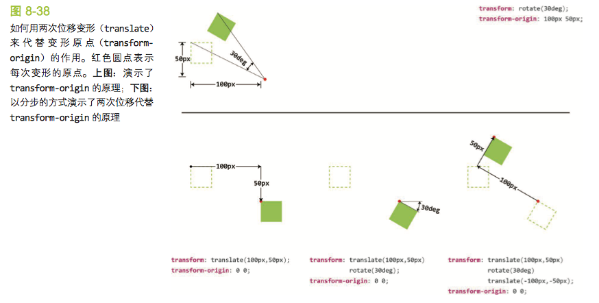

借助这个思路，基于同一个`transform-origin`来实现前面用到的两个旋转动画：

```css
@keyframes spin {
    from {
       transform : translate(50%, 150px) 
                   rotate(0turn) 
         		   translate(-50%, -150px);
    }
    to {
         transform : translate(50%, 150px) 
                     rotate(1turn) 
         		     translate(-50%, -150px);
    }
}

@keyframes spin-reverse {
    from {
       transform : translate(50%, 50%) 
                   rotate(1turn) 
         		   translate(-50%, -50%);
    }
    to {
         transform : translate(50%, 50%) 
                     rotate(0turn) 
         		     translate(-50%, -50%);
    }
}


.avatar {
    animation: spin 3s infinite linear;
}

.avatar > img {
    animation: inherit;
    animation-name: spin-reverse;
}
```

因为现在所有变形函数都是使用一个起点，可以把两套动画合成一套，这时候就不需要两层`div`来实现了：

```css
@keyframes spin {
    from {
       transform : translate(50%, 150px) 
                   rotate(0turn) 
         		   translate(-50%, -150px)
         		   translate(50%, 50%) 
                   rotate(1turn) 
         		   translate(-50%, -50%);
    }
    to {
         transform : translate(50%, 150px) 
                     rotate(1turn) 
         		     translate(-50%, -150px)
           			 translate(50%, 50%) 
                     rotate(0turn) 
         		     translate(-50%, -50%);;
    }
}

.avatar {
    animation: spin 3s infinite linear;
}
```

上面代码还可以把连续的`translate()`变形操作合并起来， `translate(-50%, -150px)`和 `translate(50%, 50%)`在水平方向上的位移可以抵消，相当于我们只在 Y 轴上做了两次位移操作` translateY(-150px) translateY(50%) `：

```css
@keyframes spin {
    from {
       transform : translateY(150px) 
        		   translateY(-50%)
                   rotate(0turn) 
         		   translateY(-150px)
         		   translateY(50%) 
                   rotate(1turn) 
    }
    to {
         transform : translateY(150px) 
                     translateY(-50%);;
                     rotate(1turn) 
         		     translateY(-150px)
           			 translateY(50%) 
                     rotate(0turn) 
    }
}

.avatar {
    animation: spin 3s infinite linear;
}
```

如果把头像放在圆心并以此作为起点，就可以消除最开始的那两个位移操作了，而实际上这两个位移在本质上所做的就是把它放在圆心。

```css
@keyframes spin {
    from {
       transform : rotate(0turn) 
         		   translateY(-150px)
         		   translateY(50%) 
                   rotate(1turn) 
    }
    to {
         transform : rotate(1turn) 
         		     translateY(-150px)
           			 translateY(50%) 
                     rotate(0turn) 
    }
}

.avatar {
    animation: spin 3s infinite linear;
}
```

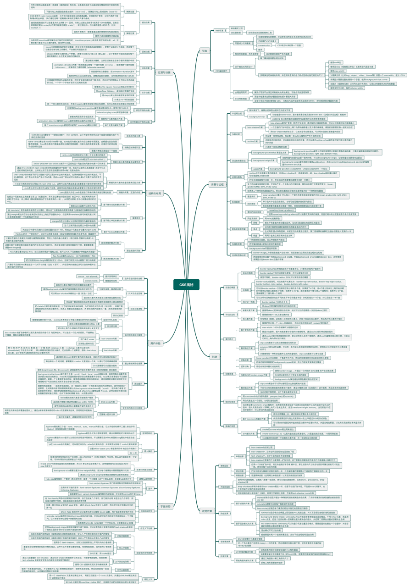

<iframe src="https://www.xmind.net/embed/5g5s" width="620px" height="540px"></iframe>
