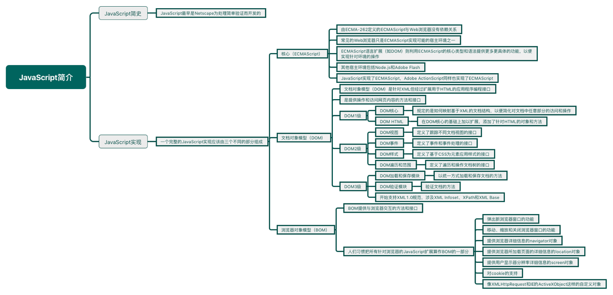
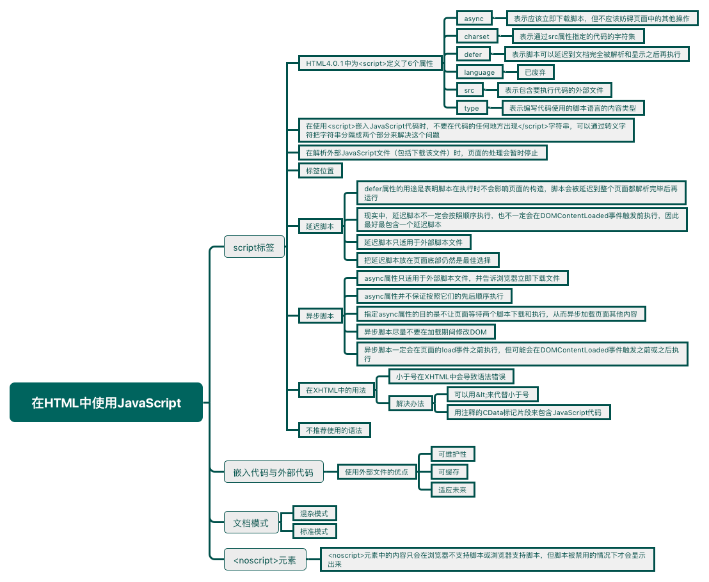
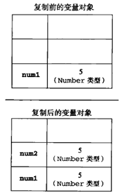
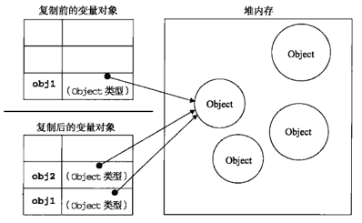
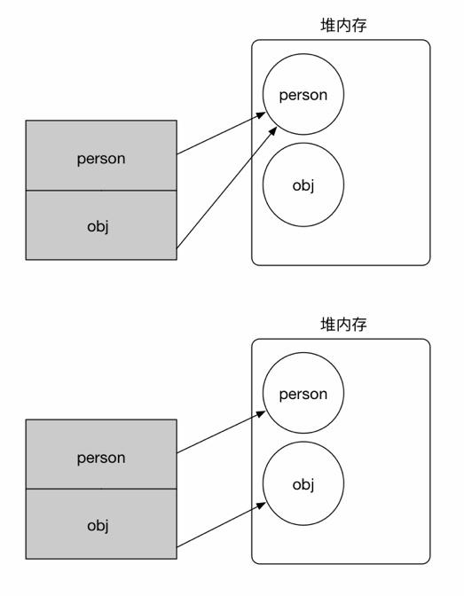
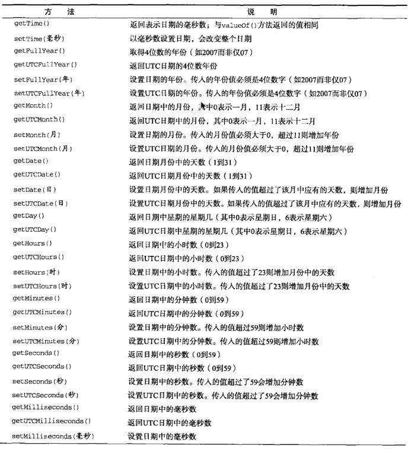
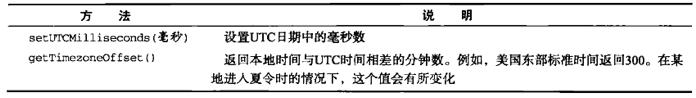

> 第一章：JavaScript简介
>
> 第二章：在HTML中使用JavaScript
>
> 第三章：基本概念
>
> 第四章：变量、作用域和内存问题
>
> 第五章：引用类型

<!--more-->

# JavaScript简介

## JavaScript简史

JavaScript最早是Netscape为处理简单验证而开发的。

## JavaScript实现

一个完整的JavaScript实现应该由下列三个不同的部分组成：

* 核心（ECMAScript）
* 文档对象模型（DOM）
* 浏览器对象模型（BOM）

### ECMAScript

由ECMA-262定义的ECMAScript与Web浏览器没有依赖关系。实际上，这门语言本身并不包含输入和输出定义。ECMA-262定义的只是这门语言的基础，在此基础之上可以构建更完善的脚本语言。我们常见的Web浏览器只是ECMAScript实现可能的**宿主环境**之一。宿主环境不仅提供基本的ECMAScript实现，同时也会提供该语言的扩展，以便语言与环境之间对接交互。而这些扩展（如DOM），则利用ECMAScript的核心类型和语法提供更多更具体的功能，以便实现针对环境的操作。其他宿主环境包括Node.js和Adobe Flash。

ECMAScript规定了下列组成部分：

* 语法
* 类型
* 语句
* 关键字
* 保留字
* 操作符
* 对象

ECMAScript就是对实现该标准的各个方面内容的语言的描述。JavaScript实现了ECMAScript，Adobe ActionScript同样也实现了ECMAScript。

### 文档对象模型（DOM）

文档对象模型（DOM）是针对XML但经过扩展用于HTML的应用程序编程接口（是提供操作和访问网页内容的方法和接口）。DOM把整个页面映射为一个多层节点结构。

DOM1级由两个模块组成：DOM核心和DOM HTML。DOM核心规定的是如何映射基于XML的文档结构，以便简化对文档中任意部分的访问和操作。DOM HTML模块则在DOM核心的基础上加以扩展，添加了针对HTML的对象和方法。

DOM2级引入了下列新模块：

* DOM视图：定义了跟踪不同文档视图的接口
* DOM事件：定义了事件和事件处理的接口
* DOM样式：定义了基于CSS为元素应用样式的接口
* DOM遍历和范围：定义了遍历和操作文档树的接口

DOM3级引入了下列新模块，并对DOM核心进行了扩展，开始支持XML1.0规范，涉及XML Infoset、XPath和XML Base。

* DOM加载和保存模块：以统一方式加载和保存文档的方法
* DOM验证模块：验证文档的方法

### 浏览器对象模型（BOM）

BOM提供与浏览器交互的方法和接口。从根本上讲，BOM只处理浏览器窗口和框架；但人们习惯把所有针对浏览器的JavaScript扩展算作BOM的一部分，比如：

* 弹出新浏览器窗口的功能
* 移动、缩放和关闭浏览器窗口的功能
* 提供浏览器详细信息的navigator对象
* 提供浏览器所加载页面的详细信息的location对象
* 提供用户显示器分辨率详细信息的screen对象
* 对cookie的支持
* 像XMLHttpRequest和IE的ActiveXObject这样的自定义对象



# 在HTML中使用JavaScript

## script标签

HTML4.0.1中为`<script>`定义了下列6个属性：

* `async`：可选。表示应该立即下载脚本，但不应该妨碍页面中的其他操作，比如下载其他资源或等待加载其他脚本，只对外部脚本文件有效。
* `charset`：可选。表示通过`src`属性指定的代码的字符集。由于大多数浏览器会忽略它的值，所以很少用。
* `defer`：可选。表示脚本可以延迟到文档完全被解析和显示之后再执行，只对外部脚本文件有效。
* `language`：已废弃。
* `src`：可选。表示包含要执行代码的外部文件。
* `type`：可选。可以看成是`language`的代替属性；表示编写代码使用的脚本语言的内容类型。虽然`text/javascript`和`text/ecmascript`都已经不推荐使用，但人们一直以来使用的都还是`text/javascript`。实际上，服务器在传送JavaScript文件时使用的MIME类型通常是`application/x-javascript`，但在type中设置这个值却可能导致脚本被忽略。如果没有指定这个属性，则其默认值仍为`text/javascript`。

包含在`<script>`元素内部的JavaScript代码将从上至下依次解释。比如下面代码中，解释器会先解释到一个函数的定义，然后将该定义保存在自己的环境中。在解释器对`<script>`元素内部的所有代码求值完毕以前，页面中的其余内容都不会被浏览器加载或显示。

```html
<script>
  function sayHi() {
    alert('Hi');
  }
</script>
```

在使用`<script>`嵌入JavaScript代码时，不要在代码的任何地方出现`</script>`字符串。比如，浏览器加载下面代码就会输出`") }`。因为浏览器遇到`</script>`时，就会认为是结束的`</script>`标签。可以通过转义字符把字符串分隔成两个部分来解决这个问题。

```html
<script>
    function sayScript() {
        alert("</script>")
    }
</script>
<!--解决办法-->
<script>
    function sayScript() {
        alert("<\/script>")
    }
</script>
```

在解析外部JavaScript文件（包括下载该文件）时，页面的处理会暂时停止。

### 标签位置

现代web应用程序一般都会把全部JavaScript引用放在`<body>`元素中页面的内容后面，这样在解析包含的JavaScript代码之前，页面的内容将完全呈现在浏览器中。

### 延迟脚本

`defer`属性的用途是表明脚本在执行时不会影响页面的构造。也就是说，脚本会被延迟到整个页面都解析完毕后再运行。相当于告诉浏览器立即下载，但延迟执行。

```html
<!DOCTYPE html>
<html lang="en">
<head>
    <meta charset="UTF-8">
    <title>Title</title>
    <script type="text/javascript" defer="defer" src="test1.js"></script>
    <script type="text/javascript" defer="defer" src="test2.js"></script>
</head>
<body>
<!--内容-->
</body>
</html>
```

上面代码中的脚本会延迟到浏览器遇到`</html>`标签后再执行。根据HTML5规范要求，第一个延迟脚本会先于第二个延迟脚本执行，而两个脚本会先于`DOMContentLoaded`事件执行。但现实中，延迟脚本不一定会按照顺序执行，也不一定会在`DOMContentLoaded`事件触发前执行，因此最好最包含一个延迟脚本。

延迟脚本只适用于外部脚本文件，这点在HTML5中明确规定，支持HTML5的实现的浏览器会忽略嵌入脚本的`defer`属性。不支持`defer`属性的浏览器会忽略这个属性，因此把延迟脚本放在页面底部仍然是最佳选择。

### 异步脚本

`async`属性只适用于外部脚本文件，并告诉浏览器立即下载文件，但是`async`属性并不保证按照它们的先后顺序执行。

```html
<!DOCTYPE html>
<html lang="en">
<head>
    <meta charset="UTF-8">
    <title>Title</title>
    <script type="text/javascript" async src="test1.js"></script>
    <script type="text/javascript" async src="test2.js"></script>
</head>
<body>
<!--内容-->
</body>
</html>
```

上面代码中，第二个脚本文件可能会在第一个脚本文件之前执行。因此，要确保两者之间互不依赖。指定`async`属性的目的是不让页面等待两个脚本下载和执行，从而异步加载页面其他内容。因此，异步脚本尽量不要在加载期间修改DOM。

异步脚本一定会在页面的`load`事件之前执行，但可能会在`DOMContentLoaded`事件触发之前或之后执行。



# 基本概念

## 语法

### 区分大小写

ECMAScript中的一切（变量、函数名和操作符）都是区分大小写的。

### 标识符

标识符是指变量、函数、属性的名字，或者函数的参数。第一个字符必须是字母、下划线`_`或一个美元符号`$`。

标识符推荐使用驼峰大小写方式。

### 严格模式

严格模式是ECMAScript5为JavaScript定义的一种不同的解析与执行模型。在严格模式下，ECMAScript3中一些不确定的行为将得到处理，而且对某些不安全的操作也会抛出错误。在整个脚本中启用严格模式，可以在顶部添加如下代码：

```javascript
"use strict"
```

在函数内部的上方包含这条编译指示，也可以指定函数在严格模式下执行：

```javascript
function doSomething{
  "use strict"
  //函数体
}
```

### 语句

虽然语句结尾的分号不是必须的，但是建议任何时候都不要省略它。因为分号可以避免错误，并且在某些情况下增加代码性能（解析器不必花时间推测应该在哪里插入分号）。

始终在控制语句中使用代码块`{}`符号。

## 变量

`var message = 'hi'`，像这样初始化变量并不会把变量标记为字符串类型，因此，可以在修改变量值的同时修改值的类型，但不建议修改变量所保存值的类型。

使用`var`操作符定义的变量将成为定义该变量的作用域中的局部变量。如果省略`var`操作符，就会创建一个全局变量。

```javascript
function test() {
    var message = 'hi';
    message1 = 'hi'
}

test();

alert(message);		//Uncaught ReferenceError: message is not defined
alert(message1); 	//hi
```

在严格模式下，不能定义名为`eval`或`arguments`的变量，否则会导致语法错误。

## 数据类型

ECMAScript有5种简单数据类型：`Undefined`、`Null`、`Boolean`、`Number`和`String`。还有一种复杂数据类型`Object`，`Object`本质上是由一组无序的名值对组成。

### typeof操作符

`typeof`负责检测给定变量的数据类型。返回值如下：

* `undefined`：值未定义
* `boolean`：布尔值
* `string`：字符串
* `number`：数值
* `object`：对象或**null**（null被认为是一个空对象的引用）
* `function`：函数

```javascript
var message = 'hi';
alert(typeof message);		//string
alert(typeof (message));	//string
alert(typeof 95)			//number
```

### Undefined类型

在使用`var`声明变量但未对其加以初始化时，这个变量的值是`undefined`。

```javascript
var message;
alert(message == undefined);	//true

var message = undefined;
alert(message == undefined);	//true
```

包含`undefined`值的变量和尚未定义的变量是不一样的：

```javascript
var tang;

alert(tang);	//undefined
alert(cheng)	//Uncaught ReferenceError: cheng is not defined
```

但是`typeof`操作符对未初始化的变量会返回`undefined`值，对未定义的变量也会返回`undefined`值。因为虽然这两种变量从技术角度看有本质区别，但实际上无论对哪种变量也不可能执行真正的操作。

```javascript
var tang;

alert(typeof tang);	//undefined
alert(typeof cheng)	//undefined
```

### Null类型

`null`值表示一个空对象指针。

如果定义的变量准备要保存对象，最好将变量初始化为`null`而不是其他值，这样只要直接检查`null`的值就可以知道相应变量是否已经保存一个对象的引用：

```javascript
if (car != null){
  //对car对象的操作
}
```

`undefined`值是派生自`null`值，因此ECMA-262规定对它们的相等性测试要返回`true`（`null`和`undefined`之间的相等操作符`==`总是返回`true`）：

```javascript
alert(null == undefined)	//true
alert(null === undefined)	//false
```

无论什么情况下都没有必要把一个变量的值显式地设置为`undefined`。

如果保存对象的变量还没有真正保存变量前，就应该明确地让变量保存`null`值。

### Boolean类型

Boolean类型有两个值：`true`和`false`。

ECMAScript中所有类型的值都有与这两个Boolean值等价的值。要将一个值转换为其对应的Boolean值，可以调用转型函数`Boolean()`：

```javascript
var message = 'hi';
var messageBoolean = Boolean(message);
alert(messageBoolean);	//true
```

转型函数`Boolean()`返回的是`true`还是`false`，取决于转换值的数据类型及其实际值。下表给出了各种数据类型及其对应转换规则：

|   数据类型    |   转换为true的值    | 转换为false的值 |
| :-------: | :------------: | :--------: |
|  Boolean  |      true      |   false    |
|  String   |    任何非空字符串     |    空字符串    |
|  Number   | 任何非零数字值（包括无穷大） |   0和NaN    |
|  Object   |      任何对象      |    null    |
| Undefined |      不适用       | undefined  |

这些规则对理解流控制语句（如if语句）自动执行相应的Boolean转换非常重要：

```javascript
var message = 'hi';
if (message){
  alert("value is true");	
}
```

### Number类型

为了支持各种数值类型，ECMA-262定义了不同的数值字面量格式。

八进制第一位必须是`0`，八进制数字序列为0~7，如果字面值中的数值超过这个范围，前面导零会被忽略，后面数字被解析为十进制。八进制在严格模式下死无效的。

十六进制字面值的前两位必须是`0x`，后跟任何十六进制数字（0~9及A~F）。其中，字母不区分大小写。

#### 浮点数值

由于保存浮点数值需要的内存空间是保存整数值的两倍，因此ECMAScript会不失时机地将浮点数值转换为整数值。当小数点后面没有跟任何数字，那么这个数值就可以作为整数值来保存。当浮点数值本身表示一个整数（如1.0），那么该值也会转换为整数。

对于极大或极小数值，可以用科学计数法表示浮点数值，例如：`var floatNum = 3.2e7;`表示32000000。

浮点数值的最高精度是17位小数，但在进行算术计算时其精度远远不如整数。例如`0.1`加`0.2`的结果不是`0.3`，而是`0.30000000000000004`，但是`0.05`和`0.25`，或者`0.15`和`0.15`都不会有问题。这个小小的舍入误差会导致无法测试特定的浮点数值。因此，永远不要测试某个特定的浮点数值。

```javascript
if (0.1 + 0.2 == 0.3){	//false
  alert("get 0.3");
}

if (0.05 + 0.25 == 0.3){	//true
  alert("get 0.3");
}
```

#### 数值范围

ECMAScript能够表示的最小数值保存在`Number.MIN_VALUE`中，在大多数浏览器是`5e-324`。能够表示的最大数值保存在`Number.MAX_VALUE`中，在大多数浏览器是`1.7976931348623157e+308`。

如果超出了这个范围，当数值为负数，会转化为`-Infinity`，当数值为正数，会转化为`Infinity`。

如果某次计算返回了正或负的`Infinity`值，那么该值将无法继续参与下一次计算。想要确定一个数值是不是位于最大值和最小值之间的，可以用`isFinite()`函数。如果位于最大值和最小值之间，返回`true`。

#### NaN

`NaN`表示非数值（Not a Number），是一个特殊的数值，这个数值用于表示一个本来要返回数值的操作数未返回数值的情况。例如，任何数除以0会返回`NaN`，不会影响其他代码的执行。

`NaN`本身有两个非同寻常的特点：

* 任何涉及`NaN`的操作都会返回`NaN`
* `NaN`与任何值都不相等，包括`NaN`本身

ECMAScript定义了`isNaN()`函数，该函数会判断一个数是不是`NaN`。`isNaN()`接受到一个值之后，会尝试将这个值转换为数值。某些不是数值的值会直接转换为数值，而任何不能被转换为数值的值都会导致这个函数返回`true`。

```javascript
alert(isNaN(NaN));	//true
alert(isNaN(10));	//false(10是一个数值)
alert(isNaN("10"));	//false(可以被转化成数值10)
alert(isNaN("blue"));	//true(blue不能转化成数值)
alert(isNaN(true));	//false(可以被转化为数值1)
```

#### 数值转换

有3个函数可以把非数值转换为数值：`Number()`、`parseInt()`和`parseFloat()`。

转型函数`Number()`可以用于任何数据类型，另外两个函数则专门用于把字符串转化成数值。

`Number()`函数的转换规则如下：

* 如果是`Boolean`值，`true`和`false`将分别被转换为`1`和`0`
* 如果是数字值，只是简单的传入和返回
* 如果是`null`，返回`0`
* 如果是`undefined`，返回`NaN`
* 如果是字符串，遵循下列规则
  * 如果字符串只包含数字，则将其转换成十进制数值
  * 如果字符串中包含有效的浮点格式，则将其转换成对应的浮点数值
  * 如果字符串中包含有效的十六进制格式，则将其转换成相同大小的十进制整数
  * 如果字符串是空，则将其转换成`0`
  * 如果字符串中包含除上述格式之外的字符串，则将其转换成`NaN`。
* 如果是对象，则调用对象的`valueof()`方法，然后依照前面的规则转换成返回值。如果返回值是`NaN`，则调用对象的`toString()`方法，然后再次依照前面的规则转换返回的字符串值。

```javascript
alert(Number('hello'));		//NaN
alert(Number(''));			//0
alert(Number('000011'));	//11
alert(Number(true));		//1
```

`parseInt()`函数在转换字符串时，更多的是看其是否符合数值模式。它会忽略字符串前面的空格，直到找到第一个非空格字符。如果第一个字符不是数字字符或负号，`parseInt()`就会返回`NaN`。`parseInt()`解析完第一个字符就会解析第二个字符，直到解析完所有后续字符或遇到一个非数字字符。`parseInt()`也能识别出各种整数格式（十进制、八进制、十六进制）。

```javascript
alert(parseInt('123hello'));	//123
alert(parseInt(''));			//NaN 
alert(parseInt('0xA'));			//10(十六进制数)
alert(parseInt(22.5));			//22
alert(parseInt('70'));			//70(十进制数)
alert(parseInt('0xf'));			//15(十六进制数)
```

在使用`parseInt()`解析八进制字面量的字符串时，ECMAScript5不具有解析八进制的能力，而在ECMAScript3中会被当成八进制字面量解析。

```javascript
alert(parseInt('070'));		//ECMAScript5中输出70，ECMAScript3中输出56
```

这时候可以为`parseInt()`提供第二个参数：转换时使用的基数：

```javascript
alert(parseInt('070',8));		//输出56
alert(parseInt('070',10));		//输出70
```

建议在无论什么情况下都指明基数。

`parseFloat()`和`parseInt()`类似，不过在`parseFloat()`中只有第一个小数点是有效的，第二个小数点及其后面的字符串都会被忽略。

`parseInt()`始终会忽略前导的`0`，因此它只解析十进制值。

### String类型

#### 字符字面量

String类型包含了一些特殊的字符字面量，也叫转义序列。

|   字面量    |            含义             |
| :------: | :-----------------------: |
|   `\n`   |            换行             |
|   `\t`   |            制表             |
|   `\b`   |            空格             |
|   `\r`   |            回车             |
|   `\f`   |            进纸             |
|   `\\`   |            斜杠             |
|   `\'`   |    单引号（在用单引号表示的字符串中使用）    |
|   `\"`   |    双引号（在用双引号表示的字符串中使用）    |
|  `\xnn`  |     以十六进制代码nn表示的一个字符      |
| `\unnnn` | 以十六进制代码nnnn表示的一个Unicode字符 |

任何字符串的长度都可以通过访问其`length`属性取得。任何转义字符都只表示一个字符。

#### 字符串的特点

ECMAScript中的字符串是不可变的，字符串一旦创建，其值就不能改变。要改变某个变量保存的字符串，首先要销毁原来的字符串，然后再用另一个包含新值的字符串填充该变量（这个过程是在后台发生的）。

#### 转换为字符串

* `toString()`

数值、布尔值、对象和字符串值都有`toString()`方法，但`null`和`undefined`值没有这个方法。`toString()`方法会返回相应值的字符串表现。

默认情况下，`toString()`方法以十进制返回数值的字符串表示，可以通过传递基数让`toString()`方法输出二进制、八进制、十六进制乃至其他任意有效进制格式表示的字符串值：

```javascript
 var num = 10;
console.log(num.toString());		//10
console.log(num.toString(2));		//1010
console.log(num.toString(8));		//12
console.log(num.toString(16));		//a
```

* `String()`

在不知道转换的值是不是`null`或`undefined`的情况下，可以使用转型函数`String()`，这个函数能把任何类型的值转换为字符串。如果值是`null`，则返回`null`；如果值是`undefined`，则返回`undefined`；如果值有`toString()`方法，则调用该方法并返回相应的结果。

```javascript
var a;
var b = null;
console.log(String(2));		//2
console.log(String(b));		//null
console.log(String(a));		//undefined
```

### Object类型

ECMAScript中的对象其实就是一组数据和功能的集合。Object类型所具有的任何属性和方法也同样存在于更具体的对象中。Object的每个实例都具有下列属性和方法：

* `Constructor`：保存着用于创建当前对象的函数。
* `hasOwnProperty(propertyName)`：用于检查给定的属性在当前对象实例中是否存在，其中，作为参数的属性名必须以字符串的形式指定。
* `isPrototypeof(object)`：用于检查传入的对象是否是另一个对象的原型。
* `propertyIsEnumerable(propertyName)`：用于检查给定的属性是否能使用`for-in`语句来枚举。
* `toLocaleString()`：返回对象的字符串表示，该字符串与执行环节的地区对应。
* `toString()`：返回对象的字符串表示。
* `valueOf()`：返回对象的字符串、数值或布尔值表示。通常与`toString()`方法的返回值相同。

<p style="border-left: 4px solid yellow; padding: 10px;">ECMA-262中对象的行为不一定适用于JavaScript中的其他对象。浏览器环境中的对象，比如BOM和DOM中的对象，都属于宿主对象，ECMA-262不负责定义宿主对象，因此宿主对象可能会也可能不会继承Object。</p>

## 操作符

### 一元操作符

只能操作一个值的操作符叫一元操作符。

#### 递增和递减操作符

前置型：`++i`、`--i`；后置型：`i++`、`i--`

在应用不同的值时，递增和递减操作符遵循下列规则：

* 在应用于一个包含有效数字字符的字符串时，先将其转换为数字值，在执行加减1操作
* 在应用于一个不包含有效数字字符的字符串时，将变量的值设置为`NaN`。
* 在应用于布尔值`false`时，先将其转换为0再执行加减1操作
* 在应用于布尔值`true`时，先将其转换为1再执行加减1操作
* 在应用于对象时，先调用`valueOf()`方法以取得一个可供操作的值。

```javascript
var s1 = "2";
var s2 = "z";
var m = false;
var f = 1.1;
var o = {
  valueOf: function () {
    return -1;
  }
};

console.log(++s1);		//3
console.log(++s2);		//NaN
console.log(++m);		//1
console.log(--f);		//0.1000000000000009
console.log(--o);		//-2
```

### 布尔操作符

* 逻辑非：由`!`表示
* 逻辑与：由`&&`表示，是短路操作符，第一个操作数求值为`fasle`就不会对第二个操作数求值
* 逻辑或：由`||`表示，是短路操作符，第一个操作数求值为`true`就不会对第二个操作数求值

### 乘性操作符

* 乘法：由`*`表示。如果一个操作数是`NaN`，结果是`NaN`；如果`Infinity`与0相乘，结果是`NaN`；如果`Infinity`与非零数值相乘，结果是`Infinity`或`-Infinity`；如果`Infinity`与`Infinity`相乘，结果是`Infinity`。
* 除法：由`/`表示。如果一个操作数是`NaN`，结果是`NaN`；如果0被0除，结果是`NaN`；如果非零有限数被0除，结果是`Infinity`或`-Infinity`；如果`Infinity`被`Infinity`除，结果是`NaN`；如果`Infinity`被任何非零数值除，结果是`Infinity`或`-Infinity`。
* 求模（余数）：由`%`表示。

### 加性操作符

* 加法：由`+`表示。

```javascript
var res = 5 + 5;
console.log(res);		//10
var res2 = 5 + '5';
console.log(res2);		//55

var num1 = 5;		
var num2 = 10;		
console.log("5 and 10 is " + num1 + num2);		// 5 and 10 is 510
console.log("5 and 10 is " + (num1 + num2));		//5 and 10 is 15
```

* 减法：由`-`表示。

```javascript
console.log(5 - true);		//4 ,true转换成1
console.log(NaN - 1);		//NaN
console.log(5 - "");		//5，""转换成0
console.log(5 - "2");		//3，"2"转换成2
console.log(5 - null);		//5，null转换成0
```

### 关系操作符

`<`、`>`·、`<=`和`>=`这几个关系操作符用于两个值进行比较。

当关系操作符使用了非数值时，应用下列规则：

* 如果两个值都是数值，则进行数值比较
* 如果两个操作数是字符串，则比较两个字符串对应的字符编码值（大写字母的字符编码小于小写字母的字符编码，如果是字符串数字之间的比较，也会转换成字符编码进行比较）
* 如果一个操作数是数值，则将另一个操作数转换为一个数值，然后进行比较
* 如果操作数是对象，则调用这个对象的`valueOf()`方法，然后进行比较

任何与`NaN`比较的结果都是`fasle`。

```javascript
console.log('a' < 3);		//fasle
```

### 相等操作符

ECMAScript提供两组操作符：

* 相等和不相等：先转换成相似的类型再比较
* 全等和全不等：仅比较不转换

#### 相等和不相等

相等操作符由`==`表示；不相等操作符由`!=`表示。这两个操作符都会先转换操作数（通常叫强制转型），然后再比较它们的相等性。

在转换不同数据类型时，相等和不相等操作符遵循下列规则：

* 如果有一个操作数是布尔值，则在比较相等性之前先将其转换为数值（`false`转换成`0`，`true`转换成`1`）
* 如果一个操作数是字符串，另一个操作数是数值，在比较前先将字符串转换为数值
* 如果一个操作数是对象，另个不是，则调用对象的`valueOf()`方法，用得到的基本类型数值进行比较
* `null`和`undefined`是相等的
* 要比较相等性之前，不能将`null`和`undefined`转换成其他任何值
* 如果有一个操作数是`NaN`，则相等操作符返回`false`，不相等操作符返回`true`

<p style="border-left: 4px solid red; padding: 10px;">即使两个操作数都是`NaN`，相等操作符也返回`false`，因为按规则`NaN`不等于`NaN`</p>

* 如果两个操作数都是对象，则比较它们是不是同一个对象。如果指向同一个对象，则相等操作符返回`true`；否则返回`false`

|         表达式         |   值   |
| :-----------------: | :---: |
| `null == undefined` | true  |
|   `"NaN" == NaN`    | false |
|     `5 == NaN`      | false |
|    `NaN == NaN`     | false |
|    `NaN != NaN`     | true  |
|    `false == 0`     | true  |
|     `true == 1`     | true  |
|     `true == 2`     | false |
|  `undefined == 0`   | false |
|     `null == 0`     | false |
|     `"5" == 5`      | true  |
|    `false == ""`    | true  |

#### 全等和全不等

全等由`===`表示；不全等由`!==`表示。除了在比较之前不转换操作数之外，全等和不全等操作符没什么区别。

`null == undefined`会返回`true`，因为它们是类似的值，但`null === undefined`会返回`false`，因为它们是不同类型的值。

### 条件操作符

```javascript
variable = boolean_expression? true_value : false_value;
```

### 赋值操作符

由`=`表示。等号前面添加乘性操作符、加性操作符或位操作符，就可以完成复合赋值操作。

* `*=`：乘/赋值
* `/=`：除/赋值
* `%=`：模/赋值
* `+=`：加/赋值
* `-=`：减/赋值
* `<<=`：左移/赋值
* `>>=`：有符号右移/赋值
* `>>>=`：无符号右移/赋值

使用它们不会带来任何性能提升。

## 语句

### if语句

`if`语句中的条件可以是任意表达式，而且对这个表达式的结果求值不一定是布尔值。ECMAScript会自动调用`Boolean()`转换函数将这个表达式结果转换为一个布尔值。

### do-while语句

只有在循环体中的代码执行后，才会测试出口条件。循环体中的代码至少会被执行一次。

### while语句

在循环体内代码执行之前，就会对出口条件求值。

### for语句

由于ECMAScript中不存在块级作用域，因此在循环内部定义的变量在外部也可以访问。

```javascript
var count = 10;
for (i = 0; i < count; i++){
  console.log(i);
}
alert(i);	//10
```

### for-in语句

`for-in`语句是一种精准的迭代语句，可以用来枚举对象的属性。

```javascript
for (property in expression) statement
```

ECMAScript对象的属性没有顺序，因此，用`for-in`循环输出的属性名的顺序是不可预测的。

如果表示要迭代的对象的变量值为`null` 或`undefined`，`for-in`语句会抛出错误。在ECMAScript5中对这种情况不会抛出错误，而是不执行循环体。

### label语句

使用`label`语句可以在代码中添加标签，以便将来使用。

```javascript
label: statement

-----示例-----

start: for(var i=0; i < count; i++){
  alert(i);
}
```

加标签的语句一般都要与`for`语句等循环语句配合使用，这样将来可以由`break`或`continue`语句引用。

### break和continue语句

`break`语句会立即退出循环，强制继续执行循环后面的语句。

`continue`语句也会立即退出循环，但是退出循环后会从循环的顶部继续执行。

`break`和`continue`语句都可以与`label`语句联合使用，从而返回代码中的特定位置。

```javascript
var num = 0;
outermost: for (var i = 0; i < 10; i++){
  for (var j = 0; j < 10; j++){
    if (i == 5 && j == 5){
      break outermost;
    }
    num++;
  }
}
console.log(num);	//55
----------------------------------------------
var num1 = 0;
outermost: for (var i = 0; i < 10; i++){
  for (var j = 0; j < 10; j++){
    if (i == 5 && j == 5){
      continue outermost;
    }
    num1++;
  }
}
console.log(num1);	//95
```

### with语句

`with`语句的作用是将代码的作用域设置到一个特定的对象中。严格模式下不允许使用`with`语句。`with`语句会导致性能下降，并且很难调试。

### switch语句

在`switch`语句中可以使用任何数据类型。`case`的值可以是常量、变量或者表达式。

<p style="border-left: 4px solid yellow; padding: 10px;">`switch`语句在比较值时使用的是全等操作符，因此不会发送类型转换</p>

## 函数

位于`return`之后的任何代码都不会被执行。

在严格模式中不能把函数命名为`eval`或`arguments`，不能把参数命名为`eval`或`arguments`，不能出现两个命名参数同名的情况。

### 理解参数

ECMAScript函数不介意传递进来多少个参数，也不在乎传进来参数是什么数据类型。因为ECMAScript中的参数在内部是用一个数组来表示的。函数接收到的始终是这个数组，而不关心数组中包含哪些参数。

在函数体内部可以通过`arguments`对象来访问这个参数数组，从而获取传递给函数的每一个参数。`arguments`对象只是与数组类似，因为可以用方括号语法访问它的每一个元素，使用`length`属性来确定传递进来多少个参数。

```javascript
function sayHi() {
  alert("heollo " + arguments[0] + ',' + arguments[1]);	//hello tang,cheng
}
window.onload = function () {
  this.sayHi("tang","cheng");
}
```

通过访问`arguments`对象的`length`属性可以获知有多少个参数传递给了函数，利用这点可以让函数接受任意个参数并分别实现适当的功能：

```javascript
function doAdd() {
  if (arguments.length == 1){
    alert(arguments[0] + 10);
  } else if (arguments.length == 2){
    alert(arguments[0] + arguments[1]);
  }
}
doAdd(10);
doAdd(30,20);
```

`arguments`对象可以与命名参数一起互换使用。

`arguments`的值永远与对应命名参数的值保持同步。修改了`arguments`对象中的值会自动反应到对应的命名参数中，但是这两个值的内存空间是独立的，只是值会同步，但这种影响是单向的，修改命名参数不会改变`arguments`中对应的值。

如果只传入一个参数，`arguments[1]`设置的值不会反应到命名参数中，这是因为`arguments`对象的长度是由传入的参数个数决定，不是由定义函数时的命名参数的个数决定的。

没有传递值的命名参数将被自动赋予`undefined`值。

在严格模式中，对如何使用`arguments`对象作出了以下限制：

* `arguments`值与对应命名参数的值不同步，比如即使把`arguments[1]`设置为10，`num2`的值还是`undefined`
* 重写`arguments`值会导致语法错误

### 没有重载

在ECMAScript中定义了两个名字相同的函数，则该名字只属于后定义的函数。

通过检查传入函数中参数的类型和数量并作出不同的反应，可以模仿方法的重载。

<iframe src="https://www.xmind.net/embed/eNqx" width="620px" height="540px"></iframe>

# 变量、作用域和内存问题

## 基本类型和引用类型的值

ECMAScript变量包含两种不同数据类型的值：基本类型值和引用类型值。在将一个值赋给变量时，解析器必须确定这个值是基本类型值还是引用类型值。

* 基本类型指的是简单的数据段，基本数据类型包括：`Undefined`、`Null`、`Boolean`、`Number`和`String`。这五种基本数据类型是按值访问的，因此可以操作保存在变量中的实际值。
* 引用类型值指的是那些可能由多个值构成的保存在内存中的对象。JavaScript不允许直接访问内存中的位置（不能操作对象的内存空间），在操作对象时是在操作对象的引用而不是实际的对象，因此引用类型是按引用访问的。

### 动态属性

对引用类型的值，可以为其动态添加属性和方法，也可以删除和修改其属性和方法。

但不能给基本类型添加属性和方法。

### 复制变量值

如果一个变量向另一个变量复制基本类型的值，会在变量对象上创建一个新值，然后把该值复制到新变量分配的位置上。这两个变量可以参与任何操作而不会相互影响。



如果一个变量向另一个变量复制引用类型的值时，同样也会将存储在变量对象中的值复制一份到新变量分配的空间中。不同的是，这个值的副本实际上是一个指针，这个指针指向存储在堆内存中的一个对象。复制结束后，两个变量实际上引用同一个对象。因此改变其中一个变量，就会影响另一个变量。



### 传递参数

ECMAScript中所有函数的参数都是按值传递的（把函数外部的值复制给函数内部的参数，和把值从一个变量复制到另一个变量一样）。

在向参数传递基本类型的值时，被传递的值会被复制给一个局部变量。

在向参数传递引用类型的值时，会把这个值在内存中的地址复制给一个局部变量，因此这个局部变量的变化会反映在函数外部（注：复制的是指针，两个引用指向同一个对象）。因为对象在参数中是按值传递的，所以下面第三个例子中，在函数内部重写`obj`时，这个变量引用的就是一个局部对象，而这个局部对象会在函数执行完毕后立即销毁。

```javascript
function addTen(num) {
  num += 10;
  return num;
}
var count = 20;
var result = addTen(count);
console.log(count);		//20
console.log(result);	//30
------------分割线------------
function setName(obj) {
  obj.name = 'tc';
}
var person = new Object();
setName(person);
console.log(person.name);	//tc
------------分割线------------
function setname(obj) {
  obj.name = 'tc';
  obj = new Object();
  obj.name = 'cheng';
}
var person2 = new Object();
setname(person2);
console.log(person2.name);	//tc
```

函数内重写`obj`前后内存示意图如下图：



<p style="border-left: 4px solid yellow; padding: 10px;">可以把ECMAScript函数的参数想象成局部变量</p>

### 检测类型

`instanceof`操作符可以检测对象的类型，如果变量是给定引用类型的实例，`instanceof`操作符会返回`true`。

```javascript
var person = new Object();
var colors = new Array;
var pattern = new RegExp();

console.log(person instanceof Object);	//true
console.log(colors instanceof Array);	//true
console.log(pattern instanceof RegExp);	//true
```

`instanceof`操作符检测基本类型的值时，会返回`false`。

## 执行环境及作用域

执行环境定义了变量或函数有权访问的其他数据，决定了它们各自的行为。每个执行环境都有一个与之关联的变量对象，环境中定义的所有变量和函数都保存在这个对象中。

全局执行环境是最外围的一个执行环境。在web浏览器中，全局执行环境被认为是window对象。因此所有全局变量和函数都是作为window对象的属性和方法创建的。

某个执行环境中的所有代码执行完毕后，该环境被销毁，保存在其中的所有变量和函数定义也随之销毁。

每个函数都有自己的执行环境。当执行流进入一个函数时，函数的环境会被推入一个环境栈中。在函数执行之后，栈将其环境弹出，把控制权返回给之前的执行环境。

当代码在一个环境中执行时，会创建变量对象的一个作用域链。作用域链的用途是保证对执行环境有权访问的所有变量和函数的有序访问。

作用域链的前端始终是当前执行的代码所在环境的变量对象。如果这个环境是函数，则其活动对象作为变量对象。活动对象在最开始时只包含一个变量-`arguments`对象（这个对象在全局环境中不存在）。作用域链中的下一个变量对象来自外部环境，而再下一个对象则来自于下一个外部环境。这样一直延续到全局执行环境，全局执行环境的变量对象始终都是作用域中的最后一个对象。

标识符解析是沿着作用域链一级一级地搜索标识符的过程。搜索过程始终从作用域链的前端开始，然后逐级地向后回溯，直到找到标识符为止。

在局部作用域中定义的变量可以在局部环境下与全局变量互换使用。

```javascript
var color = 'blue';
function changeColor() {
  if (color === 'blue'){
    color = 'red';
  }else {
    color = 'blue';
  }
}

changeColor();
console.log('color is '+ color);		//color is red
------------分割线------------
var color = 'blue';
function changeColor() {
  var anotherColor = 'red';

  function swapColors() {
    var tempColor = anotherColor;
    anotherColor = color;
    color = tempColor;
  }
  swapColors();
}

changeColor();
console.log('color is '+ color);	//color is red
```

内部环境可以通过作用域链访问所有的外部环境，但是外部环境不能访问内部环境中的任何变量和函数。每个环境都可以向上搜索作用域链，以查询变量和函数名，但任何环境都不能通过向下搜索作用域链而进入另一个执行环境。

### 延长作用域链

有些语句可以在作用域链的前端临时增加一个变量对象，该变量对象会在代码执行后被移除。在下面两种情况下会发生这种现象，当执行流进入下列任何一个语句时，作用域链会得到加长：

* `try-catch`语句的`catch`块，它会创建一个新的变量对象，其中包含的是被抛出的错误对象声明。
* `with`语句，它会将指定的对象添加到作用域链中。

```javascript
function buildUrl() {
  var qs = '?debug=true';

  with (location){	//with接受的location对象被添加到作用域链的前端
    var url = href + qs;
  }

  return url;	//url成为函数执行环境的一部分，所以可以被返回
}
```

### 没有块级作用域

JavaScript没有块级作用域，所以在下面例子中，`if`语句中定义的变量声明会将变量添加到当前的执行环境中。`for`语句中创建的变量`i`即使在`for`循环执行结束后，依旧会存在于循环外部的执行环境中。

```javascript
if (true){
  var color = 'blue';
}
console.log(color);		//blue
------------分割线------------
for (var i = 0; i < 10; i++){
  doSomething(i);
}
console.log(i)		//10
```

#### 声明变量

使用`var`声明的变量会自动被添加到最接近的环境中。在函数内部，最接近的环境是函数的局部环境。如果初始化变量时没有使用`var`声明，该变量会自动被添加到全局环境中。

```javascript
function add(num1,num2) {
  var sum = num1 + num2;	//sum只存在于add函数的局部环境中
  return sum;
}
var result = add(10,20);
console.log(sum);//Uncaught ReferenceError: sum is not defined
------------分割线------------
function add2(num1,num2) {
  sum = num1 + num2;		//sum存在于全局环境中
  return sum;
}
var result2 = add(10,20);
console.log(sum);//30
```

#### 查询标识符

当在某个环境中为了读取或写入而引用一个标识符时，必须通过搜索来确定该标识符实际代表什么，搜索过程从作用域链的前端（即当前环境）开始，闲上逐级查询与给定名字匹配的标识符。

下面例子中，在搜索过程中，如果存在一个局部的变量的定义，则搜索停止，不会再进入另外一个变量对象。任何位于局部变量`color`之后的代码，不使用`window.color`都无法访问全局变量`color`。如果有一个操作数是对象，而另一个不是，就会在对象上调用`valueOf()`方法取得基本类型的值，在进行比较。

```javascript
var color = 'blue';
function getColor() {
  return color;
}
console.log(getColor());	//blue
------------分割线------------
var color = 'blue';
function getColor() {
  var color = 'red';
  return color;
}
console.log(getColor());	//red
------------分割线------------
var color = 'blue';
function getColor() {
  var color = 'red';
  return window.color;
}
console.log(getColor());	//blue
```

<p style="border-left: 4px solid yellow; padding: 10px;">访问局部变量要比访问全局变量更快，JavaScript引擎在优化标识符查询方面做得不错，这个差距可以忽略。</p>

## 垃圾收集

JavaScript具有自动垃圾收集机制，执行环境会负责管理代码执行过程中使用的内存。

函数中局部变量只在函数执行过程中存在，在这个过程中，会为全局变量在栈（或者堆）内存上分配相应的空间，以便存储它们的值。函数执行后，垃圾收集器会跟踪哪个变量有用哪个变量没用，对于不再有用的变量打上标记，以备将来收回其占用的内存。在浏览器中，用于表示无用变量的策略通常有两种：标记清除和引用计数。

### 标记清除

JavaScript中最常用的垃圾收集方式是标记清除。当变量进入环境时，就将变量标记为`进入环境`。永远不能释放进入环境的变量所占用的内存。当变量离开环境时，将其标记为`离开环境`。

垃圾收集器在运行时会给存储在内存中的所有变量都加上标记，然后去掉环境中的变量以及被环境中的变量引用的变量的标记。在此之后再被加上标记的变量将会被视为准备删除的变量，最后垃圾收集器销毁那些带标记的值并回收它们所占用的内存空间。

### 引用计数

另一种不常见的垃圾收集策略是引用计数。其含义是跟踪记录每个值被引用的次数。当声明了一个变量并将一个引用类型赋值给该变量时，这个值的引用次数是1。如果同一个值又被赋给另一个变量，则引用次数加1。如果包含对这个值引用的变量又取得另外一个值，则这个值引用次数减1.当这个值引用次数变成0时，则说明没有办法再访问这个值，因此在垃圾收集器运行时会释放其占用的内存空间。

如果一个函数中两个对象互相引用各自属性，它们的引用次数永远不会是0，如果这个函数被多次调用，会导致大量内存得不到回收。

在IE9以下版本中，BOM和DOM中的对象是使用C++以COM（Component Object Model，组件对象模型）对象的形式实现。而COM对象的垃圾收集机制就是引用计数。所以只要在IE9以下版本中涉及COM对象，就会存在循环引用问题。

### 管理内存

确保占用最少内存可以让页面获得更好的性能。一旦数据不再有用，最好通过将其值设置为`null`来释放其引用（这个方法叫解除引用）。这一做法适用于大多数全局变量和全局对象的属性。局部变量会在它们离开执行环境时自动被解除引用。

解除一个值的引用并不意味着自动回收该值所占用的内存。解除引用的真正作用是让值脱离执行环境，以便垃圾收集器下次运行时将其回收。

<iframe src="https://www.xmind.net/embed/XT5V" width="620px" height="540px"></iframe>

# 引用类型

引用类型的值（对象）是引用类型的实例。新对象是使用`new`操作符后跟一个构造函数来创建的。

## object类型

创建Object实例的方式有两种：

* 使用`new`操作符后跟Object构造函数:

```javascript
var person = new Object();
person.name = 'tc';
person.age = 27;
```

* 使用对象字面量表示法：

```javascript
var person = {
  name: 'tc',
  age: 27
};
```

<p style="border-left: 4px solid yellow; padding: 10px;">使用对象字面量定义对象时，实际上不会调用Object构造函数。</p>

访问对象属性时可以使用点表示法或方括号表示法。

方括号语法可以通过变量来访问属性。

如果属性名中包含会导致语法错误的字符，或者属性名使用的是关键字或保留字，也可以使用方括号表示法。

除非必须使用变量访问属性，否则推荐使用点表示法。

```javascript
var person = {
  'name': 'tc',
  'age': 27,
  5: true
};
console.log(person['name']);	//tc
console.log(person.name);		//tc

var myName = 'name';
console.log(person[myName]);		//tc
```

## Array类型

ECMAScript数组的每一项可以保存任何类型的数据，数组的大小是可以动态调整的。

创建数组的基本方法有两种：

* 使用Array构造函数

```javascript
var colors = new Array();
var colors = new Array(20);
var colors = new Array('red','blue','green');
var colors = Array(3);
var colors = Array('green');
```

* 使用数组字面量表示法

```javascript
var colors = ['red','green','blue'];
var colors = [];
```

<p style="border-left: 4px solid yellow; padding: 10px;">使用对象字面量定义数组时，实际上不会调用Array构造函数。</p>

在读取和设置数组的值时，要使用方括号并提供相应的基于0的数字索引。

如果设置某个值的索引超过了数组现有项数，数组就会自动增加到该索引值加1的长度。

数组的项数保存在其`length`属性中。数组的`length`属性不是只读的，通过设置这个属性，可以从数组的末尾移除项或向数组中添加新项。

### 检测数组

`Array.isArray()`方法的目的是最终确定某个值是不是数组。

### 转换方法

调用数组的`toString()`方法会返回由数组中每个值的字符串形式拼接而成的一个逗号分隔的字符串。

调用数组的`valueOf()`方法返回的还是数组。

`alert()`要接受字符串参数，后台会调用`toString()`，得到的结果与直接调用`toString()`方法输出相同。

```javascript
var colors = ['red','blue','green'];

console.log(colors.toString());//red,blue,green
console.log(colors.valueOf());//Array(3),打印出来的数组
console.log(colors);//Array(3)，打印出来的数组
alert(colors);//red,blue,green
```

`toLocaleString()`方法经常也会返回与`toString()`和`valueOf()`方法相同的值，但也不总是如此。当调用数组的`toLocaleString()`方法时，它也会创建一个数组值的以逗号分隔的字符串。不同之处是，调用的是每一项的`toLocaleString()`方法，而不是`toString()`方法。

```javascript
var person1 = {
  toLocaleString: function () {
    return 'tc';
  },
  toString: function () {
    return 'zj';
  }
};

var person2 = {
  toLocaleString: function () {
    return '11';
  },
  toString: function () {
    return '22';
  }
};

var people = [person1,person2];
console.log(people);					//(2) [Object, Object]
console.log(people.toString());			//zj,22
console.log(people.toLocaleString());	//tc,11
```

使用`join()`方法可以使用不同的分隔符来构建字符串。

如果数组中某一项是`null` 或者`undefined`，那么该值在`join()`、`toString()`、`toLocaleString()`、`valueOf()`方法返回的结果中以空字符串表示。

### 栈方法

栈是一种LIFO（Last-In-First-Out，后进先出）的数据结构。栈中项的插入和移除，只发生在一个位置—栈的顶部。

ECMAScript为数组提供了`push()`和`pop()`方法，可以实现类似栈的行为。

`push()`方法可以接收任意数量的参数，把它们逐个添加到数组末尾，并返回修改后数组的长度。

`pop()`方法从数组末尾移除最后一项，减少数组的`length`值，然后返回移除项。

```javascript
var colors = ['red','blue'];
colors.push('black');			
colors[3] = 'yellow';
console.log(colors.length);		//4

var item = colors.pop();		//取得最后一项
console.log(item);				//yellow
console.log(colors.length);		//3
```

### 队列方法

队列数据结构的访问规则是FIFO（First-In-First-Out，先进先出）。队列在列表的末端添加项，在列表的前端移除项。

`shift()`方法能移除数组中的第一个项并返回该项，同时数组长度减1。

`shift()`和`push()`方法结合使用，就可以像使用队列一样使用数组。

```javascript
var colors = [];
var count = colors.push('red','green');
console.log(count);			//2，push返回数组长度

count = colors.push('black');
console.log(count);			//3

var item = colors.shift();
console.log(colors.length);	//2
```

`unshift()`方法能在数组前端添加任意个项并返回新数组的长度。

同时使用`unshift()`和`pop()`方法，可以从相反的方向来模拟队列。

```javascript
var colors = [];
var count = colors.unshift('red','green');
console.log(count);			//2
count = colors.unshift('black');
console.log(count);			//3

var item = colors.pop();
console.log(item);			//green
console.log(colors.length);	//2
```

### 重排序方法

`reverse()`方法会反转数组项的顺序。

```javascript
var values = [1,2,3,4,5];
values.reverse();
console.log(values);	//5,4,3,2,1
```

`sort()`方法在默认情况下按升序排列数组项—即最小值在最前面，最大值在最后面。`sort()`方法会调用每个数组项的`toString()`方法，然后比较得到的字符串，以确定如何排序。即使数组中每一项是数值，`sort()`方法比较的也是字符串。

```javascript
var values = [0,1,5,10,15];
values.sort();
console.log(values);	//0, 1, 10, 15, 5]
```

上面例子中，`sort()`方法在字符串比较时`10`位于`5`前面，所以得到上述顺序。

`sort()`方法可以接收一个比较函数作为参数，以便我们指定哪个值位于哪个值的前面。

比较函数接收两个参数，如果第一个参数应该位于第二个之前则返回一个负数，如果两个参数相等返回`0`，如果第一个参数应该位于第二个之后则返回一个正数。

```javascript
var values = [0,1,5,10,15];

function compare(value1,value2) {
  if (value1 < value2){
    return -1;
  }else if (value1 > value2) {
    return 1;
  }else {
    return 0;
  }
}
values.sort(compare);
console.log(values);		//0, 1, 5, 10, 15
```

对于数值类型或者`valueOf()`方法会返回数值类型的对象类型，可以使用一个更简单的比较函数：

```javascript
function compare(value1,value2) {
  return value2 - value1;
}
```

### 操作方法

`concat()`方法可以基于当前数组中的所有项创建一个新数组，原数组的值不变。该方法会先创建当前数组一个副本，然后将接收到的参数添加到这个副本的末尾，最后返回新构建的数组。如果没有传递参数，该方法只是复制当前数组并返回副本。

```javascript
var colors = ['red','green','blue'];
var colors2 = colors.concat('yellow',['black','pink']);

console.log(colors);	//["red", "green", "blue"]
console.log(colors2);	//["red", "green", "blue", "yellow", "black", "pink"]
```

`slice()`方法能基于当前数组中的一或多个项创建一个新数组。`slice()`方法可以接受一或两个参数，即要返回项的起始位置和结束位置。在只有一个参数的情况下，`slice()`方法返回从该参数指定位置开始到当前数组末尾的所有项。如果有两个参数，该方法会返回起始位置和结束位置之间的项—但不包括结束位置的项。`slice()`方法不会影响原始数组。

```javascript
var colors = ['red','green','blue','yellow','pink'];
var colors2 = colors.slice(1);
var colors3 = colors.slice(1,4);

console.log(colors);	//["red", "green", "blue", "yellow", "pink"]
console.log(colors2);	//["green", "blue", "yellow", "pink"]
console.log(colors3);	//["green", "blue", "yellow"]
```

<p style="border-left: 4px solid yellow; padding: 10px;">如果`slice()`方法的参数中有一个负数，则利用数组长度加上该数来确定相应的位置。例如，在一个包含5项的数组中，`slice(-2,-1)`与`slice(3,4)`结果相同。</p>

`splice()`方法主要用途是向数组的中部插入项，但是该方法有下面三种使用方式：

* 删除：可以删除任意数量的项，只需要指定两个参数：要删除的第一项的位置和要删除的项数。
* 插入：可以向指定位置插入任意数量的项，只需要提供3个参数：起始位置、0（要删除的项数）和要插入的项。如果要插入多个项，可以再传入第四、第五，以至任意多项。
* 替换：可以向指定位置插入任意数量的项，且同时删除任意数量的项，只需指定3个参数：起始位置、要删除的项数和要插入的任意数量的项。插入的项数不必与删除的项数相等。

`splice()`方法始终都会返回一个数组，该数组中包含从原始数组中删除的项。

```javascript
var colors = ['red','blue','green'];
var remove = colors.splice(0,1);	//删除第一项

console.log(colors);	//["blue", "green"]
console.log(remove);	//["red"]

remove = colors.splice(1,0,'yellow','pink');//从位置1开始插入两项
console.log(colors);	//["blue", "yellow", "pink", "green"]
console.log(remove);	//[]

remove = colors.splice(1,1,'red','purple');//插入两项，删除一项
console.log(colors);	//["blue", "red", "purple", "pink", "green"]
console.log(remove);	//["yellow"]
```

### 位置方法

`indexOf()`和`lastIndexOf()`方法都接收两个参数：要查找的项和（可选的）表示查找起点位置的索引。`indexOf()`方法从数组的开头开始向后查找，`lastIndexOf()`方法则从数组的末尾开始向前查找。

这两个方法都要返回要查找的项在数组中的位置，或者在没有找到时返回`-1`。在比较第一个参数与数组中每一项时，会用全等操作符。

```javascript
var numbers = [1,2,3,4,5,4,3,2,1];

console.log(numbers.indexOf(4));	//3
console.log(numbers.lastIndexOf(4));//5
console.log(numbers.indexOf(4,4));	//5
console.log(numbers.lastIndexOf(4,4));//3

var person = {'name':'tc'};
var people = [{'name':'tc'}];
var morePeople = [person];
console.log(people.indexOf(person));	//-1
console.log(morePeople.indexOf(person));//0
```

### 迭代方法

ECMAScript5为数组定义了5个迭代方法。每个方法都接收两个参数：要在每一项上运行的函数和（可选的）运行该函数的作用域对象—影响`this`的值。传入这些方法的函数会接收三个参数：数组项的值、该项在数组中的位置和数组对象本身。根据使用的方法不同，这个函数执行后的返回值可能会也可能不会影响访问的返回值。

* `every()`：对数组中的每一项运行给定函数，如果该函数对每一项都返回`true`，则返回`true`。
* `filter()`：对数组中的每一项运行给定函数，返回该函数会返回`true`的项组成的数组。
* `forEach()`：对数组中的每一项运行给定函数。这个方法没有返回值，本质上与使用`for`循环迭代数组一样。
* `map()`：对数组中的每一项运行给定函数，返回每次函数调用的结果组成的数组。
* `some()`：对数组中的每一项运行给定函数，如果该函数对任一项返回`true`，则返回`true`。

以上方法都不会修改数组中的包含值。

```javascript
var numbers = [1,2,3,4,5,4,3,2,1];

var everyResult = numbers.every(function (item, index, array) {
  return (item > 2)
});
console.log(everyResult);	//false

var someResult = numbers.some(function (item, index, array) {
  return (item > 2);
});
console.log(someResult);	//true

var filterResult = numbers.filter(function (item, index, array) {
  return (item > 2);
});
console.log(filterResult);	//[3, 4, 5, 4, 3]

var mapResult = numbers.map(function (item, index, array) {
  return (item * 2);
});
console.log(mapResult);		//[2, 4, 6, 8, 10, 8, 6, 4, 2]

numbers.forEach(function (item, index, array) {
  console.log('item=' + item + ' index=' + index + ' array=' + array);
});
/*
 *item=1 index=0 array=1,2,3,4,5,4,3,2,1
 *item=2 index=1 array=1,2,3,4,5,4,3,2,1
 *item=3 index=2 array=1,2,3,4,5,4,3,2,1
 *item=4 index=3 array=1,2,3,4,5,4,3,2,1
 *item=5 index=4 array=1,2,3,4,5,4,3,2,1
 *item=4 index=5 array=1,2,3,4,5,4,3,2,1
 *item=3 index=6 array=1,2,3,4,5,4,3,2,1
 *item=2 index=7 array=1,2,3,4,5,4,3,2,1
 *item=1 index=8 array=1,2,3,4,5,4,3,2,1
 */
```

### 缩小方法

`reduce()`和`reduceRight()`方法都会迭代数组的所有项，然后构建一个最终返回的值。

`reduce()`方法从数组的第一项开始，逐个遍历到最后。`reduceRight()`则从数组的最后一项开始，向前遍历到第一项。

这两个方法都接收两个参数：一个在每一项上调用的函数和（可选的）作为缩小基础的初始值。这两个方法参数中的调用函数都接收四个参数：前一个值、当前值、项的索引和数组对象。这个函数返回的任何值都会作为第一个参数自动传递给下一项。第一个迭代发生在数组的第二项上，因此第一个参数是数组的第一项，第二个参数是数组的第二项。

```javascript
var values = ['1','2','3','4','5'];
var sum = values.reduce(function (prev, cur, index, array) { 
  return prev + cur;
})
console.log(sum);	//15
```

## Date类型

Date类型使用自UTC（国际协调时间）1970年1月1日零时开始经过的毫秒数来保存日期。date类型保存的日期能精确到1970年1月1日之前或之后的285616年。

在调用Date构造函数而不传递参数的情况下，新创建的对象自动获得当前日期和时间。如果想根据特定的日期和时间创建日期对象，必须传入表示该日期的毫秒数。为了简化这一计算过程，ECMAScript提供了`Date.parse()`和`Date.UTC()`方法。

`Date.parse()`方法接收一个表示日期的字符串参数，然后尝试根据这个字符串返回相应日期的毫秒数。这个方法的行为实现因地区而异（以地区为美国为例）：

* 月/日/年
* 英文月名 日,年
* 英文星期几 英文月名 日 年 时:分:秒 时区
* ISO 8601 扩展模式 YYYY-MM-DDTHH:mm:ss:sssZ，只有兼容ECMAScript5的实现支持这种格式

实际上如果直接将表示日期的字符串传递给Date构造函数，也会在后台调用`Date.parse()`。

```javascript
var someDate = new Date(Date.parse('May 25,2017'));
var someDate2 = new Date('May 25,2017');

console.log(someDate);	//Thu May 25 2017 00:00:00 GMT+0800 (CST)
console.log(someDate2);	//Thu May 25 2017 00:00:00 GMT+0800 (CST)
```

`Date.UTC()`方法同样也返回表示日期的毫秒数，但它与`Date.parse()`在构建值时使用不同的信息。`Date.UTC()`的参数分别是年份、基于0的月份、月中的哪一天、小时数、分钟、秒及毫秒数。在这些参数中只有前两个参数是必须的。

Date构造函数也会模仿`Date.UTC()`，但日期和时间都基于本地时间而非GMT来创建。Date构造函数接收的参数仍然与`Date.UTC()`相同。

```javascript
var y2k = new Date(Date.UTC(2000,0));
var y2k2 = new Date(2000,0);

var allFives = new Date(Date.UTC(2005,4,5,17,55,55));
var allFives2 = new Date(2005,4,5,17,55,55);

console.log(y2k);//Sat Jan 01 2000 08:00:00 GMT+0800 (CST)
console.log(y2k2);//Sat Jan 01 2000 00:00:00 GMT+0800 (CST)

console.log(allFives);//Fri May 06 2005 01:55:55 GMT+0800 (CST)
console.log(allFives2);//Thu May 05 2005 17:55:55 GMT+0800 (CST)
```

`Date.now()`方法返回表示调用这个方法时的日期和时间的毫秒数。

```javascript
var start = Date.now();

setTimeout(function () {
  var stop = Date.now();
  result = stop - start;
  console.log(result);			//10002
},10000);
```

### 继承的方法

Date类型也重写了`toLocaleString()`、`toString()`和`valueOf()`方法。

Date类型的`toLocaleString()`方法会按照与浏览器设置的地区相适应的格式返回日期和时间。这大致意味着时间格式中会包含`AM`和`PM`，但不会包含时区信息。

`toString()`方法通常返回带有时区信息的日期和时间，时间一般是24小时制。

`valueOf()`返回日期的毫秒表示，因此可以方便使用比较操作符来比较日期值。

### 日期格式化方法

* `toDateString()`：以特定于实现的格式显示星期几、月、日和年
* `toTimeString()`：以特定于实现的格式显示时、分、秒和时区
* `toLocaleString()`：以特定于地区的格式显示星期几、月、日和年
* `toLocaleTimeString()`：以特定于地区的格式显示时、分、秒
* `toUTCString()`：以特定于实现的格式完整的UTC日期

### 日期/时间组件方法





## RegExp类型

通过下面语法，可以创建一个正则表达式：

```javascript
var expression = / pattern / flags;
```

其中`pattern`（模式）是任何简单或复杂的正则表达式，可以包括字符类、限定符、分组、向前查找以及反向引用。每个正则表达式都可以带有一或多个`flags`，以标明正则表达式的行为。正则表达式的匹配模式支持下列3个标志：

* `g`：表示全局模式，即模式将被应用于所有字符串，而非在发现第一个匹配项时立即停止
* `i`：表示不区分大小写模式
* `m`：表示多行模式

在`pattern`中使用的所有元字符都必须转义。正则表达式中的元字符包括

```javascript
( [ { \ ^ $ | ) ? * + . ] }
```

还可以使用RegExp构造函数创建正则表达式，它接受两个参数：一个是匹配的字符串模式，另一个是可选的标志字符串。

```javascript
//下面两个创建正则表达式的方式等价
var pattern = /[bc]at/i;
var pattern1 = new RegExp('[bc]at','i');
```

要注意的是，传递给RegExp构造函数的两个参数都是字符串，所以在某些情况下要对字符进行双重转义。所有元字符必须双重转义，转义过的字符也是如此。

<p style="border-left: 4px solid blue; padding: 10px;">使用正则表达式字面量和使用RegExp构造函数创建的正则表达式不一样。在ECMAScript3中，正则表达式字面量始终会共享同一个RegExp实例，而使用构造函数创建的每一个新RegExp实例都是一个新的实例。

在下面例子中，第一个循环只为`/cat/`创建了一个RegExp实例。由于实例属性不会重置，所以在循环中再次调用`test()`方法会失败。这个是因为第一次调用`test()`找到了`“cat”`，但第二次调用是从索引为3的字符（上次匹配的末尾）开始，所以找不到它。由于会测试到字符串末尾，所以下次再调用`test()`就又从开头开始了。

第二个循环中，每个迭代都会创建一个新的RegExp实例，所以每次调用`test()`都会返回`true`。</p>

```javascript
var re = null,
    i;

for (i = 0; i < 10; i++){
  re = /cat/g;
  re.test('catastrophe');
}

for (i = 0; i < 10; i++){
  re = new RegExp('cat','g');
  re.test('catastrophe');
}
```

**ECMAScript5明确规定，使用正则表达式字面量必须像调用RegExp构造函数一样，每次都创建新的RegExp实例。**

### RegExp实例属性

* `global`：布尔值，表示是否设置了`g`标志
* `ignoreCase`：布尔值，表示是否设置了`i`标志
* `lastIndex`：整数，表示开始搜索下一个匹配项的字符位置，从`0`算起
* `multiline`：布尔值，表示是否设置了`m`标志
* `source`：正则表达式的字符串表示，按照字面量形式而非传入构造函数中的字符串模式返回

### RegExp实例方法

`exec()`方法是专门为捕获组而设计的。`exec()`方法接收一个参数，即要应用模式的字符串，然后返回包含第一个匹配项信息的数组；或者在没有匹配项的情况下返回`null`。返回的数组虽然是Array的实例，但包含两个额外的属性：`index`和`input`。`index`表示匹配项在数组中的位置，而`input`表示应用正则表达式的字符串。数组中第一项是整个模式匹配的字符串，其他项是与模式中捕获组匹配的字符串（如果模式中没有捕获组，则该数组只包含一项）。

```javascript
var text = 'mom and dad and baby';
var pattern = /mom( and dad( and baby)?)?/gi;
var matches = pattern.exec(text);

console.log(matches.index);	//0
console.log(matches.input);	//mom and dad and baby
console.log(matches[0]);	//mom and dad and baby
console.log(matches[1]);	//and dad and baby
console.log(matches[2]);	//and baby
```

对`exec()`方法而言，即使在模式中设置了全局标志`g`，它每次只会返回一个匹配项。在不设置全局标志的情况下，同一个字符串上多次调用`exec()`将始终返回第一个匹配项的信息。在设置全局标志的情况下，每次调用`exec()`都将会在字符串中继续查找新匹配项。

```javascript
var text = 'cat, bat , sat , fat';
var pattern1 = /.at/;

var matches = pattern1.exec(text);
console.log(matches.index);			//0
console.log(matches[0]);			//cat
console.log(pattern1.lastIndex);	//0

matches = pattern1.exec(text);
console.log(matches.index);			//0
console.log(matches[0]);			//cat
console.log(pattern1.lastIndex);	//0

var pattern2 = /.at/g;
matches = pattern2.exec(text);
console.log(matches.index);			//0
console.log(matches[0]);			//cat
console.log(pattern2.lastIndex);	//3

matches = pattern2.exec(text);
console.log(matches.index);			//5
console.log(matches[0]);			//bat
console.log(pattern2.lastIndex);	//8
```

`test()`方法接收一个字符串参数，在模式与该参数匹配的情况下返回`true`，否则，返回`false`。`test()`经常被用在`if`语句中。

```javascript
var text = '000-00-0000';
var pattern = /\d{3}-\d{2}-\d{4}/;

if (pattern.test(text)){
  console.log('matched');	//matched
}
```

RegExp实例继承的`toLocaleString()`和`toString()`方法都会返回正则表达式的字面量。

### RegExp构造函数属性

RegExp构造函数的属性适用于作用域中所有的正则表达式，并且基于所执行的最近一次正则表达式操作而变化。可以通过两种方式访问这些属性，短属性名可以通过`[]`访问，长属性名可以通过`.`访问。

|     长属性名     | 短属性名 |                 说明                  |
| :----------: | :--: | :---------------------------------: |
|    input     |  $_  |        最近要匹配的字符串。Opera未实现此属性        |
|  lastMatch   |  $&  |        最近一次的匹配项。Opera未实现此属性         |
|  lastParen   |  $+  |       最近一次匹配的捕获组。Opera未实现此属性        |
| leftContext  |  $`  |       input字符串中lastMatch之前的文本       |
|   mutiline   |  $*  | 布尔值，表示是否所有表达式都使用多行模式。IE和Opera未实现此属性 |
| rightContext |  $'  |       Input字符串中lastMatch之后的文本       |

```javascript
var text = 'this has been a short summer';
var pattern = /(.)hort/g;

if (pattern.test(text)){
  console.log(RegExp.input);		//this has been a short summer
  console.log(RegExp.leftContext);	//this has been a 
  console.log(RegExp.rightContext);	// summer
  console.log(RegExp.lastMatch);	//short
  console.log(RegExp.lastParen);	//s
  console.log(RegExp.multiple);		//undefined(这个属性好像不存在了)
}
```

## Function类型

每个函数都是Function类型的实例，函数名实际上是一个指向函数对象的指针，不会与某个函数绑定。定义函数的方式有下面几种：

* 用函数声明语法定义

```javascript
function sum (num1, num2) {
  return num1 + num2;
}
```

* 用函数表达式语法定义

```javascript
var sum = function (num1, num2) {
  return num1 + num2;
};
```

* 用Function构造函数（不推荐）

```javascript
var sum = new Function('num1','num2','return num1 + num2')
```

### 函数声明与函数表达式

解析器在向执行环境中加载数据时，对函数声明和函数表达式并非一视同仁。解析器会先读取函数声明，并使其在执行任何代码之前可用。而函数表达式必须等到解析器执行到它所在的代码行，才会真正被解释执行。

```javascript
console.log(sum(10,10));		//20
function sum(num1,num2) {
  return num1 + num2;			
}

console.log(sum1(10,10));		//sum1 is not a function
var sum1 = function (num1, num2) {
  return num1 + num2;
}
```

第一个例子中，在代码开始执行之前，解析器就已经通过一个名为函数声明提升的过程，读取并将函数声明添加到执行环境中，对代码求值时，JavaScript引擎在第一遍会声明函数并将它们放到源代码树的顶部。所以，即使声明函数的代码在调用它的代码后面，JavaScript引擎也能把函数声明提升到顶部。

第二个例子中，在执行到函数所在语句之前，变量`sum`不会保存对函数的引用。

### 作为值的函数

ECMAScript中函数名本身就是变量，所以函数也可以作为值来使用。不仅可以像传递参数一样把一个函数传递给另一个函数，而且可以将一个函数作为另一个函数的结果返回。

```javascript
function callSomeFunction(someFunction,someArgument) {
  return someFunction(someArgument);
}

function add10(num) {
  return num + 10;
}

var result = callSomeFunction(add10,10);
console.log(result);				//20

function getGreeting(name) {
  return 'hello ' + name;
}

var result2 = callSomeFunction(getGreeting,'nicholas');
console.log(result2);				//hello nicholas
```

还可以从一个函数中返回另一个函数，这是极为有用的一种技术：

```javascript
function createComparisonFunction(propertyName) {
  return function (object1, object2) {
    var value1 = object1[propertyName];
    var value2 = object2[propertyName];

    if (value1 < value2){
      return -1;
    }else if (value1 > value2){
      return 1;
    }else {
      return 0;
    }
  };
}

var data = [{
  name: 'tc',
  age: 27
},{
  name: 'zj',
  age: 23
}];

data.sort(createComparisonFunction('name'));
console.log(data[0].name);	//tc

data.sort(createComparisonFunction('age'));
console.log(data[0].name);	//zj
```

### 函数内部属性

函数内部有两个特殊的对象：`arguments`和`this`。

`arguments`是一个类数组对象，包含传入函数中的所有参数。这个对象还有一个叫`callee`的属性，该属性是一个指针，指向拥有这个`arguments`对象的函数。

在严格模式下`arguments.callee`会导致错误。

```javascript
function factorial(num) {
  if (num <= 1){
    return 1;
  }else {
    return num * factorial(num - 1);
  }
}

function factorial1(num) {
  if (num <= 1){
    return 1;
  }else {
    return num * arguments.callee(num - 1);	//用callee属性解除函数执行与函数名的高耦合
  }
}

console.log(factorial(5));		//120
console.log(factorial1(5));		//120
```

`this`引用的是函数据以执行的环境对象，当在全局作用域中调用函数时，`this`对象引用的就是`windows`。

```javascript
window.color = 'red';
var o = {color:'blue'};

function sayColor() {
  console.log(this.color);
}

sayColor();		//red,全局作用域调用sayColor，this指向window对象

o.sayColor = sayColor;
o.sayColor();	//blue，对象o调用sayColor，this指向对象o
```

ECMAScript也规范化了另一个函数对象的属性：`caller`。这个属性中保存着调用当前函数的函数引用，如果在全局作用域中调用当前函数，它的值为`null`。

```javascript
function outer() {
  inner();
}

function inner() {
  console.log(inner.caller);
  console.log(arguments.callee.caller);
}  									
outer();   							
/*
*function outer() {
*inner();
*}
*/
```

严格模式下，不能为函数的`caller`属性赋值。

### 函数属性和方法

每个函数都包含两个属性：`length`和`prototype`。

`length`属性表示函数希望接收的命名参数的个数。

```javascript
function sayName(name) {
  console.log(name);
}

function sum(num1,num2) {
  return num1 + num2;
}

function sayHi() {
  console.log('hi');
}

console.log(sayName.length);	//1
console.log(sum.length);		//2
console.log(sayHi.length);		//0
```

对于ECMAScript中的引用类型而言，`prototype`是保存它们所有实例方法的真正所在。诸如`toString()`和`valueOf()`等方法实际上都保存在`prototype`名下，只不过是通过各自对象的实例访问。在ECMAScript5中，`prototype`属性是不可枚举的。

 每个函数都包含两个非继承而来的方法：`apply()`和`call()`。这两个方法的用途都是在特定的作用域中调用函数，实际上等于设置函数体内`this`对象的值。`apply()`方法接收两个参数：一个是其中运行函数的作用域，另一个是参数数组。其中，第二个参数可以是`Array`的实例，也可以是`arguments`对象。

```javascript
function sum(num1,num2) {
  return num1 + num2;
}

function callSum1(num1,num2) {
  return sum.apply(this,arguments);//全局作用域中，this指window对象
}

function callSum2(num1,num2) {
  return sum.apply(this,[num1,num2]);
}

console.log(callSum1(10,10));	//20
console.log(callSum2(10,10));	//20
```

`call()`方法与`apply()`方法相同，区别在于接收参数的方式不同。使用`call()`方法时，传递给函数的参数必须逐个列举出来。

```javascript
function sum(num1,num2) {
  return num1 + num2;
}

function callSum3(num1,num2) {
  return sum.call(this,num1,num2);
}

console.log(callSum3(10,10));	//20
```

`apply()`和`call()`真正强大的地方是能够扩充函数赖以运行的作用域。

```javascript
window.color = 'red';
var o = {color: 'blue'};
function sayColor() {
  console.log(this.color);
}
sayColor();					//red,this.color转换成window.color
sayColor.call(this);		//red，显式地在全局作用域调用函数
sayColor.call(window);		//red，显式地在全局作用域调用函数
sayColor.call(o);			//blue，this指向o
```

使用`call()`或者`apply()`来扩充作用域的最大好处是，对象不需要与方法有任何耦合关系。

ECMAScript5还定义了一个方法：`bind()`。这个方法会创建一个函数的实例，其`this`值会被绑定到传给`bind()`函数的值。

```javascript
window.color = 'red';
var o = {color: 'blue'};

function sayColor() {
  console.log(this.color);
}

var objectSayColor = sayColor.bind(o);
objectSayColor();		//blue
```

## 基本包装类型

ECMAScript提供了3个特殊的引用类型：`Boolean`、`Number`和`String`。每当读取一个基本类型值的时候，后台都会创建一个对应的基本包装类型的对象，从而让我们能够调用一些方法来操作这些数据。

```javascript
var s1 = 'tc';
var s2 = s1.substring(2);
```

当上面例子访问第二行代码时，访问过程处于一种读取模式，而在读取模式中，后台会自动完成下列处理：

1. 创建`string`类型的一个实例；
2. 在实例上调用指定的方法；
3. 销毁这个实例

以上三个步骤可以想象成下面代码：

```javascript
var s1 = new String('some text');
var s2 = s1.substring(2);
s1 = null;
```

经过上述处理，字符串值就变得跟对象一样。

引用类型与基本包装类型的主要区别就是对象的生存期。使用`new`操作符创建的引用类型的实例，在执行流离开当前作用域之前都一直保存在内存中。而自动创建的基本包装类型的对象，则只存在于一行代码的执行瞬间，然后立即被销毁。这意味着不能在运行时为基本类型值添加属性和方法。

对基本包装类型的实例调用`typeof`会返回`true`，而且所有基本包装类型的对象都会被转换为布尔值`true`。

Object构造函数会像工厂方法一样，根据传入值的类型返回相应基本包装类型的实例。把字符串传给Object构造函数，就会创建String的实例。

```javascript
var obj = new Object('tc');
console.log(obj instanceof String);		//true
```

使用`new`调用基本包装类型的构造函数，与直接调用同名的转型函数是不一样的。

```javascript
var value = '25';
var number = Number(value);		//转型函数
console.log(typeof number);		//number

var obj = new Number(value);	//构造函数
console.log(typeof obj);		//object
```

不建议显式地创建基本包装类型的对象，但它们操作基本类型值的能力还是相当重要的。而每个基本包装类型都提供了操作相应值的便捷方法。

### Boolean类型

Boolean类型是与布尔值对应的引用类型。要创建Boolean对象，可以像下面这样调用Boolean构造函数并传入`true`或者`false`值。

```javascript
var booleanObject = new Boolean(true);
```

Boolean类型的实例重写了`valueOf()`方法，返回基本类型值`true`或`false`；重写了`toString()`方法，返回字符串`true`和`false`。Boolean对象在ECMAScript中用处不大，因为常会造成误解：

```javascript
var falseObject = new Boolean(false);
var result = falseObject && true;//对falseObject求值，布尔表达式中所有对象都会被转换为true
console.log(result);		//true

var falseObject = false;
result = falseObject && true;
console.log(result);		//false
```

基本类型与引用类型的布尔值还有下列两个区别：

* `typeof`操作符对基本类型返回`boolean`，而对引用类型返回`object`
* Boolean对象是Boolean类型的实例，使用`instanceof`操作符测试Boolean对象会返回`true`，而测试基本类型的布尔值会返回`false`

### Number类型

Number类型是与数字值对应的引用类型。要创建Number对象，可以在调用Number构造函数时向其中传递相应的数值：

```javascript
var numberObject = new Number(10);
```

Number类型也重写了`valueOf()`、`toLocaleString()`和`toString()`方法。重写后的`valueOf()`方法返回对象表示的基本类型的数值，另外两个方法则返回字符串形式的数值。

Number类型的`toFixed()`方法会按照指定的小数位返回数值的字符串表示，如果数值本身包含的小数位比指定的还多，接近指定的最大小数位的值会舍入：

```javascript
var num = 10;
console.log(num.toFixed(2));		//10.00

num = 10.0005;
console.log(num.toFixed(2));		//10.01
```

`toExponential()`方法返回以指数表示发表示的数值的字符串形式。它接收一个参数，该参数指定输出结果中的小数位数：

```javascript
var num = 10;
console.log(num.toExponential(1))		//1.0e+1
```

`toPrecision()`方法会根据数字的位数返回一个合适的格式，它可能会返回固定大小的格式，也会返回指数格式，这个方法接收一个参数，该参数表示数值的所有数字的位数：

```javascript
var num = 99;
console.log(num.toPrecision(1));	//1e+2
console.log(num.toPrecision(2));	//99
console.log(num.toPrecision(3));	//99.0
```

### String类型

String类型是字符串的对象包装类型，可以像下面这样使用String构造函数来创建：

```javascript
var stringObject = new String('hello');
```

String对象的方法也可以在所有基本的字符串值中访问到。其中，继承的`valueOf()`、`toLocaleString()`和`toString()`方法，都返回对象所表示的基本字符串值。

String类型的每个实例都有一个`length`属性，表示字符串中包含多少个字符。

#### 字符方法

`charAt()`和`charCodeAt()`方法用于访问字符串中特定字符。两个方法都接收一个参数，即基于`0`的字符位置。

`charAt()`方法以单字符字符串的形式返回给定位置的那个字符：

```javascript
var stringValue = 'hello';
console.log(stringValue.charAt(1));		//e
```

`charCodeAt()`方法则返回给定位置的字符的字符编码：

```javascript
var stringValue = 'hello';
console.log(stringValue.charCodeAt(1));		//101
```

在ECMAScript5中，还定义了用方括号加数字索引访问个别字符的方法：

```javascript
var stringValue = 'hello';
console.log(stringValue[1]);		//e
```

#### 字符串操作方法

* `concat()`方法用于将一或多个字符串拼接起来，返回拼接得到的新字符串。

```javascript
var stringValue = 'hello ';
var result = stringValue.concat('world');
console.log(result);			//hello world
console.log(stringValue);		//hello
```

`concat()`方法接受任意多个参数。

实际使用中用`+`来拼接字符串比较多，这样更简便易行。

* `slice()`、`substr()`、`substring()`方法都会返回被操作字符串的一个子字符串，它们接收一或两个参数，第一个参数指定子字符串的开始位置，第二个参数表示子字符串到哪里结束。

具体来说，``slice()`和`substing()`的第二个参数指定的是子字符串最后一个字符后面的位置。而`substr()`的第二个参数指定的是返回的字符个数。如果没有传第二个参数，则将字符串的长度作为结束位置。这三个方法不会修改字符串本身的值，它们只是返回一个基本类型的字符串值，对原始字符串没有任何影响。

```javascript
var stringValue = 'hello world';
console.log(stringValue.slice(3));			//lo world
console.log(stringValue.substring(3));		//lo world
console.log(stringValue.substr(3));			//lo world
console.log(stringValue.slice(3,7));		//lo w
console.log(stringValue.substring(3,7));	//lo w
console.log(stringValue.substr(3,7));		//lo worl
```

在传递给这些方法的参数是负值的情况下，`slice()`方法会将传入的负值与字符串的长度相加；`substr()`方法将负的第一个参数加上字符串的长度，负的第二个参数转换为`0`；`substring()`方法会把所有负值参数都转换为`0`，且这个方法会将两个参数中较小的数作为开始位置，将较大的数作为结束位置。

```javascript
var stringValue = 'hello world';
console.log(stringValue.slice(-3));		//rld
console.log(stringValue.substring(-3));	//hello world
console.log(stringValue.substr(-3));	//rld
console.log(stringValue.slice(3,-4));	//lo w
console.log(stringValue.substring(3,-4));//hel，相当于stringValue.substring(0,3)
console.log(stringValue.substr(3,-4));	//''(空字符串)
```

#### 字符串位置方法

`indexOf()`和`lastIndexOf()`方法都是从一个字符串中搜索给定的字符串，然后返回子字符串的位置（如果没有找到，返回`-1`）。

其中，`indexOf()`是从头开始向后搜索子字符串，而`lastIndexOf()`方法是从后向前搜索子字符串。这两个方法都可以接收可选的第二个参数，表示从字符串的哪个位置开始搜索。`indexOf()`会从指定位置向后搜索，忽略位置之前的所有字符，而`lastIndexOf()`则会从指定的位置向前搜索，忽略该位置之后所有字符。

```javascript
var stringValue = 'hello world';

console.log(stringValue.indexOf('o'));		//4
console.log(stringValue.lastIndexOf('o'));	//7
console.log(stringValue.indexOf('o',6));	//7
console.log(stringValue.lastIndexOf('o',6));//4

var positions = new Array();
var pos = stringValue.indexOf('o');

while (pos > -1){
  positions.push(pos);
  pos = stringValue.indexOf('o',pos + 1);
}
console.log(positions);		//[4,7]
```

#### trim()方法

ECMAScript5为所有字符串定义了`trim()`方法，这个方法会创建一个字符串的副本（原始字符串不变），删除前置及后缀的所有空格，然后返回结果。

```javascript
var stringValue = '     hello world     ';
var trimmedStringValue = stringValue.trim();
console.log(stringValue);		//'     hello world     '
console.log(trimmedStringValue);//'hello world'
```

#### 字符串大小写转换方法

`toLowerCase()`、`toLocaleLowerCase()`、`toUpperCase()`和`toLocaleUpperCase()`用于字符串大小写转换。`toLocaleLowerCase()`和`toLocaleUpperCase()`方法是针对特定地区的实现，比如，少数语言（如土耳其语）会为Unicode大小写转换应用特殊的规则。一般来说，不知道自己的代码将在哪种语言环境下运行，还是用针对地区的方法更稳妥一点。

#### 字符串的模式匹配方法

* `match()`方法本质上和调用RegExp的`exec()`方法相同。`match()`方法只接受一个参数，要么是正则表达式，要么是一个RegExp对象。

```javascript
var text = 'cat bat sat fat';
var pattern = /.at/;

var mateches = text.match(pattern);
console.log(mateches.index);	//0
console.log(mateches[0]);		//cat
console.log(pattern.lastIndex);	//0
```

* `search()`方法的唯一参数与`match()`方法的参数相同，由字符串或RegExp对象指定的一个正则表达式。`search()`方法返回字符串中第一个匹配项的索引，如果没找到匹配项，返回`-1`，并且，`search()`方法始终是从字符串开头向后查找。

```javascript
var text = 'cat bat sat fat';
var pos = text.search(/at/);
console.log(pos);			//1
```

* `replace()`方法接收两个参数：第一个参数可以是一个RegExp对象或一个字符串（这个字符串不会被转换成正则表达式），第二个参数可以是一个字符串或者函数。如果第一个参数是字符串，那么只会替换第一个子字符串。要想替换所有子字符串，唯一的办法是提供一个正则表达式，而且要指定全局（`g`）标志。

```javascript
var text = 'cat bat sat fat';
var result = text.replace('at','ond');
console.log(result);	//cond bat sat fat

result = text.replace(/at/g,'ond');
console.log(result);	//cond bond sond fond
```

如果第二个参数是字符串，还可以使用一些特殊的字符序列，将正则表达式操作得到的值插入到结果字符串中。

| 字符序列 |                   替换文本                   |
| :--: | :--------------------------------------: |
|  $$  |                   `$`                    |
|  $&  |    匹配整个模式的子字符串。与regExp.lastMatch的值相同     |
|  $'  |  匹配的子字符串之前的子字符串。与regExp.leftContext的值相同  |
|  $`  | 匹配的子字符串之后的子字符串。与regExp.rightContext的值相同  |
|  $n  | 匹配第n个捕获组的子字符串，其中n等于0-9。例如，$1是匹配第一个捕获组的子字符串，\$2是匹配第二个捕获组的子字符串，以此类推。如果正则表达式中没有定义捕获组，则使用空字符串 |
| $nn  | 匹配第nn个捕获组的子字符串，其中nn等于00-99。例如，$01是匹配第一个捕获组的子字符串，\$02是匹配第二个捕获组的子字符串，以此类推。如果正则表达式中没有定义捕获组，则使用空字符串 |

通过这些特殊的字符序列，可以使用最近一次匹配结果中的内容：

```javascript
var text = 'cat bat sat fat';
result = text.replace(/(.at)/g,'word ($1))');
console.log(result);	//word (cat)) word (bat)) word (sat)) word (fat))
```

`replace()`方法的第二个参数也可以是一个函数。在只有一个匹配项时，会向这个函数传递3个参数：模式的匹配项、模式匹配项在字符串中的位置和原始字符串。在正则表达式中定义多个捕获组时，传递给函数的参数依次是模式的匹配项、第一个捕获组的匹配项、第二个匹配项.......，但最后两个参数依然分别是模式的匹配项在字符串中的位置和原始字符串。这个函数应该返回一个字符串，表示应该被替换的匹配项使用函数作为`replace()`方法的第二个参数可以实现更加精细的替换操作。

```javascript
function htmlEscape(text) {
  return text.replace(/[<>"&]/g,function (match,pos,originalText) {
    switch (match){
      case "<":
        return '&lt;';
      case ">":
        return '&gt;';
      case "&":
        return '&amp;';
      case "\"":
        return '&quot;';
    }
  });
}
console.log(htmlEscape("<p class='greeting'>hello</p>"));
//&lt;p class='greeting'&gt;hello&lt;/p&gt;
```

* `split()`方法可以基于指定的分隔符将一个字符串分割成多个子字符串，并将结果放在一个数组中。分隔符可以是字符串，也可以是RegExp对象（这个方法不会将字符串看成正则表达式）。`split()`方法可以接收可选的第二个参数，用于指定数组的大小，以便确保返回的数组不会超过既定大小。

```javascript
var colorText = 'red,blue,green,yellow';
var colors = colorText.split(',');
var colors2 = colorText.split(',',2);
var colors3 = colorText.split(/[^\,]+/);

console.log(colors);		//["red", "blue", "green", "yellow"]
console.log(colors2);		//["red", "blue"]
console.log(colors3);		//["", ",", ",", ",", ""]
```

#### localeCompare()方法

`localeCompare()`方法会比较两个字符串，并返回下列值中的一个：

* 如果字符串在字母表中应该排在字符串参数之前，则返回一个负数（大多数情况下是-1，具体的值要视实现而定）
* 如果字符串等于字符串参数，则返回0
* 如果字符串在字母表中应该排在字符串参数之后，则返回一个正数（大多数情况下是1，具体的值要视实现而定）

```javascript
var stringValue = 'yellow';
console.log(stringValue.localeCompare('brick'));	//1
console.log(stringValue.localeCompare('yellow'));	//0
console.log(stringValue.localeCompare('zoom'));		//-1
```

`localeCompare()`方法的返回值取决于实现，所有最好像下面这样使用这个方法：

```javascript
function determineOrder(value){
  var result = stringValue.localeCompare(value);
  if (result < 0){
    console.log('the string "yellow" comes before the string "' + value + '".');
  } else if (result > 0){
    console.log('the string "yellow" comes after the string "' + value + '".');
  }else {
    console.log('the string "yellow" is equal to the string "' + value + '".');
  }
}

determineOrder('brick');	//the string "yellow" comes after the string "brick".
determineOrder('yellow');	//the string "yellow" is equal to the string "yellow".
determineOrder('zoom');		//the string "yellow" comes before the string "zoom".
```

`localeCompare()`方法实现所支持的地区决定了这个方法的行为。比如，美国以英文为ECMAScript实现的标准语言，因此这个方法就是区分大小写的，于是大写字母在字母表中排在小写字母前头就成为一项决定性的比较规则。

#### fromCharCode()方法

`fromCharCode()`方法的任务是接收一或多个字符编码，然后把它们转换成一个字符串。从本质上来看，这个方法与实例方法`charCodeAt()`执行的是相反的操作。

## 单体内置对象

ECMA-262对内置对象的定义是：由ECMAScript实现提供的、不依赖于宿主环境对象，这些对象在ECMAscript程序执行之前就已经存在了。也就是开发人员不必显式地实例化内置对象。

内置对象除了Object、Array和String，还有Global和Math。

### Global对象

Global对象可以说是ECMAScript中最特别的一个对象了，因为不管从什么角度看，这个对象都是不存在的。ECMAScript中的Global对象在某种意义上是作为一个终极的兜底对象来定义的。也就是不属于任何其他对象的属性和函数，最终都是它的的属性和方法。

事实上，没有全局变量或全局函数，所有在全局作用域中定义的属性和函数，都是Global对象的属性。

上面介绍的`isNaN()`、`isFinite()`、`parseInt()`以及`parseFloat()`实际上都是Global对象的方法。除此之外，Global对象还包含其他一些方法。

#### URI编码方法

Global对象的`encodeURI()`和`encodeURIComponent()`方法可以对URI（通用资源标识符）进行编码，以便发送给浏览器。有效的URI中不能包含某些字符，比如空格。而这两个URI编码方法就可以对URI进行编码，它们用特殊的UTF-8编码替换所有无效的字符，从而让浏览器能够接受和理解。

`encodeURI()`主要用于整个URI，且不会对本身属于URI的特殊字符进行编码，比如，冒号、正斜杠、问好和井字号；而`encodeURIComponent()`主要用于对URI中某一段进行编码，且会对它发现的任何非标准字符进行编码。

```javascript
var uri = 'http://tc9011.com/illegal value.htm#start';

console.log(encodeURI(uri));	//http://tc9011.com/illegal%20value.htm#start
console.log(encodeURIComponent(uri));	//http%3A%2F%2Ftc9011.com%2Fillegal%20value.htm%23start
```

与`encodeURI()`和`encodeURIComponent()`方法对应的是`decodeURI()`和`decodeURIComponent()`。其中`decodeURI()`只能对使用`encodeURI()`替换的字符进行解码，`decodeURIComponent()`能解码使用`encodeURIComponent()`编码的所有字符，即可以解码任何特殊字符的编码。

```javascript
var uri = 'http%3A%2F%2Ftc9011.com%2Fillegal%20value.htm%23start';

console.log(decodeURI(uri));
//http%3A%2F%2Ftc9011.com%2Fillegal value.htm%23start
console.log(decodeURIComponent(uri));
//http://tc9011.com/illegal value.htm#start
```

#### eval()方法

`eval()`方法是整个ECMAScript中最强大的一个方法，它就像是一个完整的ECMAScript解析器，它只接受一个参数，即要执行的ECMAScript字符串。

```javascript
eval('alert("hi")');
----------等价于----------
alert("hi");
```

当解析器发现代码中调用`eval()`方法时，它会将传入的参数当作实际的ECMAScript语句来解析，然后把执行结果插入到原位置。通过`eval()`执行的代码被认为是包含该次调用的执行环境的一部分，因此被执行的代码具有与该执行环境相同的作用域链。这意味着通过`eval()`执行的代码可以引用在包含环境中定义的变量。

```javascript
var msg = 'hello';
eval('alert(msg)');		//hello

eval('function sayHi(){alert(msg)}');
sayHi();				//hello
```

在`eval()`中创建的任何变量或函数都不会被提升，因为在解析代码的时候，它们被包含在一个字符串中；它们只在`eval()`执行的时候创建。

在严格模式下，在外部访问不到`eval()`中创建的任何变量或函数，同样在严格模式下，为`eval()`赋值也会导致错误。

<p style="border-left: 4px solid red; padding: 10px;">使用`eval()`必须极为谨慎，特别是在用它执行用户输入数据的情况下，因为可能会有恶意的代码注入。</p>

#### Global对象的属性

`undefined`、`NaN`、`Infinity`都是Global对象的属性，此外，所有原生引用类型的构造函数，也都是Global对象的属性。下面是Global对象的所有属性。

|       属性       |         说明         |
| :------------: | :----------------: |
|   undefined    |    特殊值undefined    |
|      NaN       |       特殊值NaN       |
|    Infinity    |    特殊值Infinity     |
|     Object     |     构造函数Object     |
|     Array      |     构造函数Array      |
|    Function    |    构造函数Function    |
|    Boolean     |    构造函数Boolean     |
|     String     |     构造函数String     |
|     Number     |     构造函数Number     |
|      Date      |      构造函数Date      |
|     RegExp     |     构造函数RegExp     |
|     Error      |     构造函数Error      |
|   EvalError    |   构造函数EvalError    |
|   RangError    |   构造函数RangError    |
| ReferenceError | 构造函数ReferenceError |
|  SyntaxError   |  构造函数SyntaxError   |
|   TypeError    |   构造函数TypeError    |
|    URIError    |    构造函数URIError    |

#### window对象

ECMAScript虽然没有指出如何直接访问Global对象，但是浏览器都是将这个全局对象作为window对象的一部分加以实现。因此，在全局作用域中声明的所有变量和函数，都成为window对象的属性。

### Math对象

与在Javascript中直接编写的计算功能相比，Math对象提供的计算功能执行起来要快得多。

#### Math对象的属性

|      属性      |       说明       |
| :----------: | :------------: |
|    Math.E    | 自然对数的底数，即常量e的值 |
|  Math.LN10   |    10的自然对数     |
|   Math.LN2   |     2的自然对数     |
|  Math.LOG2E  |    以2为底e的对数    |
| Math.LOG10E  |   以10为底e的对数    |
|   Math.PI    |      π的值       |
| Math.SQRT1_2 |    1/2的平方根     |
|  Math.SQRT2  |     2的平方根      |

#### min()和max()方法

`min()`和`max()`方法用于确定一组数值中的最大值和最小值，这两个方法都可以接收任意多个数值参数。

要找到数组中的最大值或最小值，可以像下面这样使用`apply()`方法，将Math对象作为`apply()`的第一个参数，从而正确地设置`this`值，然后可以将任何数组作为第二个参数：

```javascript
var values = [1,2,3,4,5,6,7,8];
var max = Math.max.apply(Math,values);
console.log(max);		//8
```

#### 舍入方法

* `Math.cell()`执行向上舍入，即它总是将数值向上舍入为最接近的整数
* `Math.floor()`执行向下舍入，即它总是将数值向下舍入为最接近的整数
* `Math.round()`执行标准舍入，即它总是将数值四舍五入为最接近的整数

#### random()方法

`Math.random()`方法返回介于0和1之间一个随机数，不包括0和1。

套用下面公式，可以从某个整数范围内随机选择一个值：

```javascript
值 = Math.floor(Math.random()*可能值的总数 + 第一个可能的值)
```

可以通过下面函数来计算可能值的总数和第一个可能的值：

```javascript
function selectFrom(lowerValue,upperValue) {
  var choices = upperValue - lowerValue + 1;
  return Math.floor(Math.random()*choices + lowerValue);
}

var num = selectFrom(2,10);
console.log(num);		//介于[2,10]之间的一个数值
```

#### 其他方法

|         方法          |       说明       |
| :-----------------: | :------------: |
|    Math.abs(num)    |   返回num的绝对值    |
|    Math.exp(num)    | 返回Math.E的num次幂 |
|    Math.log(num)    |   返回num的自然对数   |
| Math.pow(num,power) | 返回num的power次幂  |
|   Math.sqrt(num)    |   返回num的平方根    |
|    Math.acos(x)     |    返回x的反余弦值    |
|    Math.asin(x)     |    返回x的反正弦值    |
|    Math.atan(x)     |    返回x的反正切值    |
|   Math.tan2(y,x)    |   返回y/x的反正切值   |
|     Math.cos(x)     |    返回x的余弦值     |
|     Math.sin(x)     |    返回x的正弦值     |
|     Math.tan(x)     |    返回x的正切值     |

<iframe src="https://www.xmind.net/embed/TcAf" width="620px" height="540px"></iframe>
