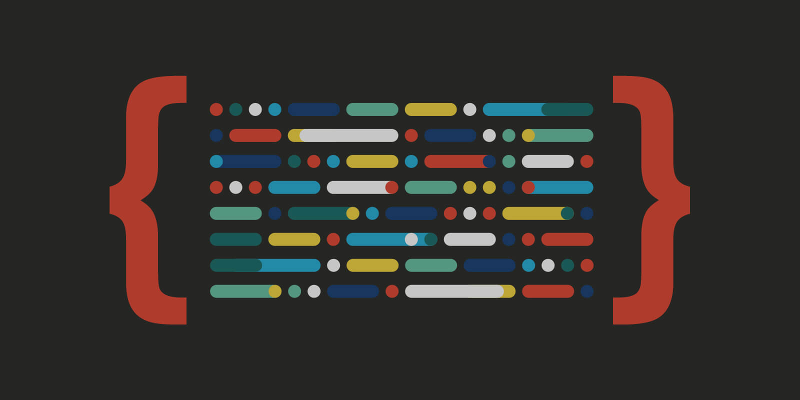
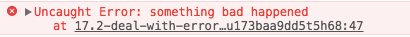
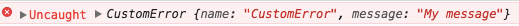

> 第十七章：错误处理与调试
>
> 第二十章：JSON

<!--more-->

## 错误处理与调试

### 错误处理

#### try-catch语句

```javascript
try{
    // 可能会导致错误的代码
} catch (error) {
    // 在错误发生时怎么处理
}
```

如果`try`块中的任何代码发生了错误，就会立刻退出代码执行过程，然后执行`catch`块。此时，`catch`块会接收到一个包含错误信息的对象。即使不想使用这个错误对象，也要给它起个名字。这个对象中包含的实际信息会因浏览器而异，但共同的是有一个保存着错误消息的`message`属性。ECMA-262还规定一个保存错误类型的`name`属性；当前所有浏览器都支持这个属性。

```javascript
try{
    window.someNoneexistentFunction();
} catch (error) {
    alert(error.message);
}
```

##### finally子句

虽然在`try-catch`语句中是可选的，但`finally`子句一经使用，其代码无论如何都会执行。只要代码中包含`finally`子句，则无论`try`或`catch`语句块中包含什么代码—甚至`return`语句，都不会阻止`finally`子句的执行：

```javascript
function testFinally() {
  try {
    return 2;
  } catch (error) {
    return 1;
  } finally {
    return 0;
  }
}		// 返回0
```

##### 错误类型

ECMA-262定义了下列7种错误类型：

* Error
* EvalError
* RangeError 
* ReferenceError
* SyntaxError
* TypeError
* URIError

其中，Error是基本类型，其他错误类型都继承自该类型。因此，所有错误类型共享一组相同的属性。Error类型的错误很少见，如果有也是浏览器抛出的；这个基本类型的主要目的是供开发人员抛出自定义错误。

EvalError类型的错误会在使用`eval()`函数而发生异常时被抛出。ECMA-262中对这个错误有如下描述：如果以非直接调用的方式使用`eval`属性的值（换句话说，没有明确地将其名称为作一个Identifier，即用作callExpression中的MemberExpression），或者为`eval`属性赋值。简单地说，如果没有把`eval()`当成函数调用，就会抛出错误：

```javascript
new eval(); 	// 抛出EvalError
eval = foo		// 抛出EvalError
```

在实践中，浏览器不一定会在应该抛出错误时就抛出EvalError。加上实际开发中极少用到`eval()`，所以遇到这种错误类型的可能性极小。

RangeError类型的错误会在数值超出相应范围时触发：

```javascript
var items1 = new Array(-20);    // 抛出RangeError
var items2 = new Array(Number.MAX_VALUE);   // 抛出RangeError
```

在找不到对象的情况下，会发生ReferenceError。通常，在访问不存在的变量时，就会发生这种错误：

```javascript
var obj = x;		// 在x并未声明的情况下抛出ReferenceError
```

当把语法错误的JavaScript字符串传入`eval()`函数时，会导致SyntaxError：

```javascript
eval('a ++ b');     // 抛出SyntaxError
```

TypeError类型在JavaScript中经常用到，在变量中保存着意外的类型时，或者在访问不存在的方法时，都会导致这种错误。错误的原因虽然多种多样，但归根结底还是由于在执行特定于类型的操作时，变量的类型并不符合要求所致：

```javascript
var o = new 10;     // 抛出TypeError
console.log('name' in true);    // 抛出TypeError
Function.prototype.toString.call('name');   // 抛出TypeError
```

在使用`encodeURI()`和`decodeURI()`，而URI格式不正确时，就会导致URIError错误。

可以像下面这样在`try-catch`语句的`catch`语句中使用`instanceof`操作符：

```javascript
try {
  someFunction();
}catch (error){
  if (error instanceof TypeError){
    // 处理类型错误
  }else if (error instanceof ReferenceError){
    // 处理引用错误
  }else {
    // 处理其他类型错误
  }
}
```

在跨浏览器编程中，检查错误类型是确定处理方式的最简便途经；包含在`message`属性中的错误消息会因浏览器而异。

##### 合理使用try-catch

使用`try-catch`最适合处理那些无法控制的错误。在明白地知道自己的代码会发生错误时，再使用`try-catch`语句就不太合适。

#### 抛出错误

与`try-catch`语句相匹配的还有一个`throw`操作符，用于随时抛出自定义错误。抛出错误时，必须要给`throw`操作符指定一个值，这个值是什么类型，没有要求。

```javascript
throw 12345;
throw 'hello';
throw true;
throw {name: 'JavaScript'};
```

在遇到`throw`操作符时，代码会立即停止执行。仅当`try-catch`语句捕获到被抛出的值时，代码才会继续执行。

通过使用某种内置错误类型，可以更真实地模拟浏览器错误。每种错误类型的构造函数接收一个参数，即实际的错误消息：

```javascript
throw new Error('something bad happened');
```



还可以使用其他错误类型，模拟出类似的浏览器错误：

```javascript
throw new SyntaxError("i don't like your syntax");
throw new TypeError('what type of variable do you take me for');
throw new RangeError('Sorry, you just do not have the range');
throw new EvalError('that does not evaluate');
throw new URIError('uri, is that you');
throw new ReferenceError('you do not cite your references properly');
```

另外，利用原型链还可以通过继承Error来创建自定义错误类型。此时，需要为新创建的错误类型指定`name`和`message`属性：

```javascript
function CustomError(message) {
  this.name = 'CustomError';
  this.message = message;
}

CustomError.prototype = new Error();

throw new CustomError('My message');
```



#### 抛出错误的时机

浏览器会在某种特定的条件下自习函数时抛出错误：

```javascript
// 如果values不是数组，浏览器会报错
function process(values) {
  values.sort();

  for (var i = 0, len = values.length; i < len; i++) {
    if (values[i] > 100) {
      return values[i];
    }
  }

  return -1;
}
```

但错误消息没有清楚的告诉我们到底出了什么问题。当面对复杂的Web应用时，要想查找错误来源就没有那么容易。这种情况下，带有适当信息的自定义错误能够显著提升代码的可维护性：

```javascript
function process(values) {
  if (!(values instanceof Array)) {
    throw new Error('process(): Argument must be an array');
  }
  values.sort();

  for (var i = 0, len = values.length; i < len; i++) {
    if (values[i] > 100) {
      return values[i];
    }
  }

  return -1;
}
```

建议重点关注函数和可能导致函数执行失败的因素。

##### 抛出错误与使用try-catch

在编写一个要在很多应用程序中使用的JavaScript库，甚至编写一个可能会在应用内部多个地方使用的辅助函数，强烈建议在抛出错误时提供详尽的信息。然后，即可在应用程序中捕获并适当处理这些错误。

只应该捕获那些确切知道该如何处理的错误。捕获错误的目的在于避免浏览器以默认方式处理它们；而抛出错误的目的在于提供错误发生具体原因的消息。

#### 错误事件

任何没有通过`try-catch`处理的错误都会触发`window`对象的`error`事件。在任何浏览器中，`onerror`事件处理程序都不会创建`event`对象，但它可以接收三个参数：错误消息、错误所在的URL和行号。要使用`onerror`事件处理程序，必须使用如下DOM0级技术，它没有遵循DOM2级事件的标准格式：

```javascript
window.onerror = function (message, url, line) {
  console.log(message);
}
```

只要发生错误，无论是不是浏览器生成的，都会触发`error`事件，并执行这个事件处理程序。然后，浏览器默认的机制发挥作用，像往常一样显示错误消息。像下面这样在事件处理程序中返回`false`，可以阻止浏览器报告错误的默认行为：

```javascript
window.onerror = function (message, url, line) {
  console.log(message);
  return false;
}
```

只要适当地使用`try-catch`语句，就不会有错误交给浏览器，也就不会触发`error`事件。

图像也支持`error`事件。只要图像的`src`特性中的URL不能返回可以被识别的图像格式，就会触发`error`事件。此时的`error`事件遵循DOM格式，会返回一个以图像为目标的`event`对象：

```javascript
var image = new Image();
EventUtil.addHandler(image, 'load', function (event) {
  console.log('image loaded');
});
EventUtil.addHandler(image, 'error', function (event) {
  console.log('image not loaded');
});
image.src = 'test.gif';     // 指定不存在的文件
```

#### 常见的错误类型

一般来说，需要关注三种错误：

* 类型转换错误
* 数据类型错误
* 通信错误

##### 类型转换错误

类型转换错误发生在使用某个操作符，或者使用其他可能会自动转换值的数据类型的语言结构时。在使用`==`和`!=`，或者在`if`、`for`和`while`等流控制语句中使用非布尔值时，最常发生类型转换错误。

多数情况下，建议使用`===`和`!==`，以避免类型转换。

流控制语句会在确定下一步操作前，把任何值转换为布尔值，尤其是`if`语句，使用不当，容易出错：

```javascript
function concat(str1, str2, str3) {
  var result = str1 + str2;
  if (str3) {             // 绝对不要这样, 如果str是0也会是false
    result += str3;
  }
  return result;
}
```

在流控制语句中使用非布尔值，是极为常见的错误来源。为了避免此类错误，就要做到在条件比较时切实传入布尔值：

```javascript
function concat(str1, str2, str3) {
  var result = str1 + str2;
  if (typeof str3 == 'string') {             // 恰当比较
    result += str3;
  }
  return result;
}
```

##### 数据类型错误

JavaScript在使用变量和函数参数之前，不会对它们进行比较以确保它们的数据类型正确。在将预料之外的值传递给函数的情况下，最容易发送数据类型错误。

```javascript
// 不安全的函数，任何非字符串值都会导致错误
function getQueryString(url) {
  var pos = url.indexOf('?');
  if (pos > -1) {
    return url.substring(pos + 1);
  }
  return "";
}

/*--------------重写后----------------*/

function getQueryString(url) {
  if (typeof url == 'string') {       // 通过检查类型确保安全
    var pos = url.indexOf('?');
    if (pos > -1) {
      return url.substring(pos + 1);
    }
    return "";
  }
}
```

在流控制语句中使用非布尔值作为条件很容易导致数据类型错误：

```javascript
function reverseSort(values) {
  if (values) {               // 任何会转换为true的非数组值都会导致错误
    values.sort();
    values.reverse();
  }
}
```

另一个常见错误是将参数与`null`比较：

```javascript
function reverseSort(values) {
  if (values != null) {               // 与null比较只能确保相应的值不少null和undefined
    values.sort();
    values.reverse();
  }
}
```

另一种错误做法，就是只针对要使用的某一个特性执行检测：

```javascript
function reverseSort(values) {
  if (typeof values.sort == 'function') {    // 如果传入一个包含sort()方法的对象(而不是数组)也会通过检测
    values.sort();
    values.reverse();
  }
}
```

在知道应该传入什么类型的情况下，最好使用`instanceof`来检测其数据类型：

```javascript
function reverseSort(values) {
  if (values instanceof Array) {               // 问题解决了
    values.sort();
    values.reverse();
  }
}
```

大体上，基本类型的值应该用`typeof`来检测，而对象类型的值应该使用`instanceof`来检测。

##### 通信错误

第一种通信错误与格式不正确的URL或发送的数据有关。最常见的问题是在将数据发送给服务器之前，没有使用`encodeURIComponent()`对数据进行编码。可以定义一个处理查询字符串的函数：

```javascript
function addQueryStringArg(url, name, value) {
  if (url.indexOf('?') == -1) {
    url += '?';
  }else {
    url += '&';
  }

  url += encodeURIComponent(name) + '=' + encodeURIComponent(value);
  return url;
}
var url = 'http://www.tc9011.com';
var newUrl = addQueryStringArg(url, 'redir', 'http://www.someotherdomain.com?a=b&c=d');

console.log(newUrl);
```

另外，在服务器响应的数据不正确时，也会发生通信错误。

#### 区分致命错误和非致命错误

对于非致命错误，可以根据下列一或多个条件来确定：

* 不影响用户的主要任务
* 只影响页面的一部分
* 可以恢复
* 重复相同操作可以消除错误

致命错误，可以通过下列一或多个条件来确定：

* 应用程序根本无法继续运行
* 错误明显影响到了用户的主要操作
* 会导致其他连带错误

区分非致命错误和致命错误的主要依据，就是看它们对用户的影响。设计良好的代码，可以做到应用程序某一部分发生错误不会不必要地影响另一个实际上毫不相干的部分。

### 调试技术

#### 将消息记录到控制台

`console`对象有下列方法：

* `error(message)`：将错误消息记录到控制台
* `info(message)`：将信息性消息记录到控制台
* `log(message)`：将一般消息记录到控制台
* `warn(message)`：将警告消息记录到控制台

#### 抛出错误

对大型应用程序来说，自定义的错误通常都使用`assert()`函数抛出。这个函数接受两个参数，一个是求值结果应该为`true`的条件，另一个是条件为`false`时要抛出的错误。以下就是一个非常基本的`assert()`函数：

```javascript
function assert(condition, message) {
  if (!condition) {
    throw new Error(message);
  }
}

function divide(num1, num2) {
  assert(typeof num1 == 'number' && typeof num2 =='number', 'divide():Both arguments must be numbers');
  return num1/num2;
}
```

## JSON

### 语法

JSON语法可以表示下列三种类型的值：

* 简单值：使用与JavaScript相同的语法，可以在JSON中表示字符串、数值、布尔值和`null`，但JSON不支持JavaScript中的特殊值`unefined`。
* 对象：对象作为一种复杂数据类型，表示的是一组有序的键值对。而每个键值对中的值可以是简单值，也可以是复杂数据类型的值。
* 数组：数组也是一种复杂数据类型，表示一组有序的值的列表，可以通过数值索引来访问其中的值。数组的值也可以是任意类型。

JSON不支持变量、函数或对象实例，它就是一种表示结构化数据的格式。

#### 简单值

最简单的JSON数据形式就是简单值。例如：

```json
5
```

这是JSON表示数值5的方式。类似地，下面是JSON表示字符串的方式：

```json
"hello world"
```

JavaScript字符串与JSON字符串的最大区别在于，JSON字符串必须使用双引号（单引号会导致语法错误）。

布尔值和`null`也是有效的JSON形式。

#### 对象

JSON中的对象要求给属性加引号：

```json
{
    "name": "tc",
  	"age": 29
}
```

属性的值可以是简单值，也可以是复杂类型值：

```json
{
    "name": "tc",
  	"age": 29,
  	"school": {
        "name": "aaa",
      	"location": "uuu"
    }
}
```

#### 数组

在JSON中，可以采用JavaScript同样的语法表示同一个数组：

```json
[25, "hi", true]
```

JSON数组没有变量和分号。把数组和对象结合起来，可以构成更复杂的数据集合：

```json
[
    {
        "name": "tc",
        "age": 29,
        "school": {
          "name": "aaa",
          "location": "uuu"
        } 
    },
  	{
        "name": "tc1",
        "age": 27,
        "school": {
          "name": "aaa",
          "location": "uuu"
        }  
    }
]
```

### 解析与序列化

#### JSON对象

JSON对象有两个方法：`stringfy()`和`parse()`。在最简单的情况下，这两个方法分别用于把JavaScript对象序列化为JSON字符串和把JSON字符串解析为原生JavaScript值：

```javascript
var book = {
  title: "professional javascript",
  authors: [
    "Nicholas C. Zakas"
  ],
  edition: 3,
  year: 2011
};

var jsonText = JSON.stringify(book);
```

默认情况下，`JSON.stringify()`输出的JSON字符串不包含任何空格字符或缩进：

```json
{"title":"professional javascript","authors":["Nicholas C. Zakas"],"edition":3,"year":2011}
```

在序列化JavaScript对象时，所有函数及原型成员都会被有意忽略，不体现在结果中。此外，值为`undefined`的任何属性也都会被跳过。

将JSON字符串直接传递给`JSON.parse()`就可以得到相应的JavaScript值：

```javascript
var bookCopy = JSON.parse(jsonText);
```

如果传给`JSON.parse()`的字符串不是有效的JSON，该方法会抛出错误。

#### 序列化选项

`JSON.stringify()`还可以接收另外两个参数，这两个参数用于指定以不同的方式序列化JavaScript对象。第一个参数是个过滤器，可以是个数组，也可以是个函数；第二个参数是一个选项，表示是否在JSON字符串中保留缩进。单独或组合使用这两个参数，可以更全面深入地控制JSON的序列化。

##### 过滤结果

如果过滤器参数是数组，那么`JSON.stringify()`的结果中将只包含数组中列出的属性：

```javascript
var book = {
  title: "professional javascript",
  authors: [
    "Nicholas C. Zakas"
  ],
  edition: 3,
  year: 2011
};

var jsonText = JSON.stringify(book, ['title', 'edition']);
// {"title":"professional javascript","edition":3}
```

如果第二个参数是函数，传入的函数接受两个参数，属性（键）名和属性值。根据属性（键）名可以知道应该如何处理要序列化的对象中的属性。属性名只能是字符串，而在值并非键值对结构的值时，键名可以是空字符串。

为了改变序列化对象的结果，函数返回的值就是相应键的值。如果函数返回了`undefined`，那么相应的属性会被忽略：

```javascript
var book = {
  title: "professional javascript",
  authors: [
    "Nicholas C. Zakas"
  ],
  edition: 3,
  year: 2011
};

var jsonText = JSON.stringify(book, function (key, value) {
  switch (key) {
    case 'authors':
      return value.join(",");

    case 'year':
      return 5000;

    case "edition":
      return undefined;

    default:				// 一定要提供default项
      return value;
  }
});

// {"title":"professional javascript","authors":"Nicholas C. Zakas","year":5000}
```

##### 字符串缩进

`JSON.stringify()`方法的第三个参数用于控制结果中的缩进和空白符。如果这个参数是一个数值，那它表示的是每个级别缩进的空格数：

```javascript
var book = {
  title: "professional javascript",
  authors: [
    "Nicholas C. Zakas"
  ],
  edition: 3,
  year: 2011
};

var jsonText = JSON.stringify(book, null, 4);	// 每个级别缩进4个空格
/*{
    "title": "professional javascript",
    "authors": [
        "Nicholas C. Zakas"
    ],
    "edition": 3,
    "year": 2011
}*/
```

`JSON.stringify()`也在结果字符串中插入了换行符以提高可读性。只要传入有效的控制缩进的参数值，结果字符串就会包含换行符。最大缩进空格数为10，所有大于10的值都会自动转换为10.

如果缩进参数是一个字符串而非数值，则这个字符串将在JSON字符串中被用作缩进字符。在使用字符串的情况下，可以将缩进字符设置为制表符，或者两个短划线之类的任意字符：

```javascript
var jsonText = JSON.stringify(book, null, '- -');
/*
{
- -"title": "professional javascript",
- -"authors": [
- -- -"Nicholas C. Zakas"
- -],
- -"edition": 3,
- -"year": 2011
}
*/
```

##### toJSON()方法

可以调用`toJSON()`方法，返回其自身的JSON数据格式。原生Date对象有一个`toJSON()`方法，能够将JavaScript的Date对象自动转换成ISO 8601日期字符串。

可以为任何对象添加`toJSON()`方法：

```javascript
var book = {
  title: "professional javascript",
  authors: [
    "Nicholas C. Zakas"
  ],
  edition: 3,
  year: 2011,
  toJSON: function () {
    return this.title;
  }
};

var jsonText = JSON.stringify(book);
// "professional javascript"
```

可以让`toJSON()`方法返回任何序列化的值，它都能正常工作。也可以让这个方法返回`undefined`，此时如果包含它的对象嵌入在另一个对象中，会导致该对象的值变成`null`，而如果包含它的对象是顶级对象，结果就是`undefined`。

`toJSON()`可以作为函数过滤器的补充，因此理解序列化的内部顺序十分重要。假设把一个对象传入`JSON.stringify()`，序列化该对象的顺序如下：

1. 如果存在`toJSON()`方法而且能通过它取得有效值，则调用该方法。否则按默认顺序执行序列化
2. 如果提供了第二个参数，应用这个函数过滤器。传入函数过滤器的值是第一步返回的值
3. 对第二部返回的每个值进行相应的序列化
4. 如果提供了第三个参数，执行相应的格式化

#### 解析选项

`JSON.parse()`方法也可以接收另一个参数，该参数是一个函数，将每个键值对上调用。为了区别`JSON.stringify()`接收的过滤函数，这个函数被称为还原函数，但实际上两个函数的签名是相同的—它们都接收两个参数，一个键和一个值，而且都需要返回一个值。

如果还原函数返回`undefined`，则表示要从结果中删除相应的键；如果返回其他值，则将该值插入到结果中。在将日期字符串转换为Date对象时，经常要用到还原函数：

```javascript
var book = {
  title: "professional javascript",
  authors: [
    "Nicholas C. Zakas"
  ],
  edition: 3,
  year: 2011,
  releaseDate: new Date(2011, 11, 1)
};

var jsonText = JSON.stringify(book);

var bookCopy = JSON.parse(jsonText, function (key, value) { 
  if (key == 'releaseDate') {
    return new Date(value);
  }else {
    return value;
  }
});

console.log(bookCopy.releaseDate.getFullYear());	// 2011
```

