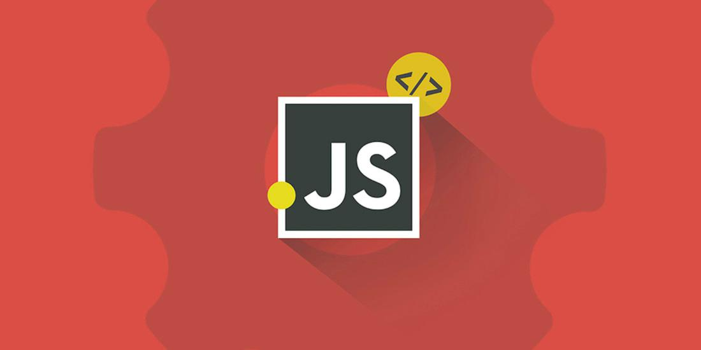
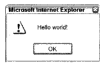
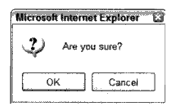
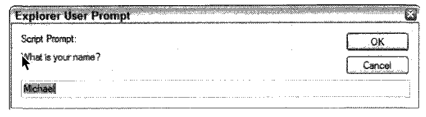
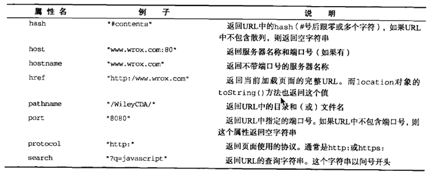
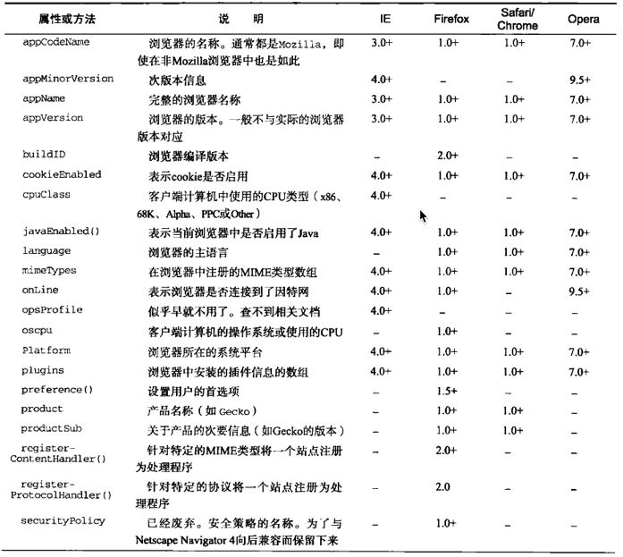
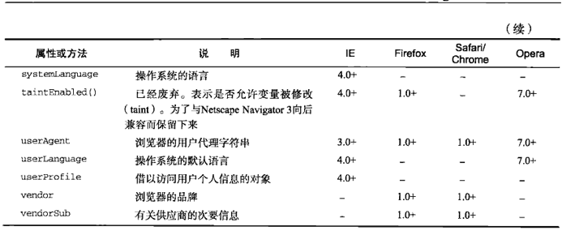
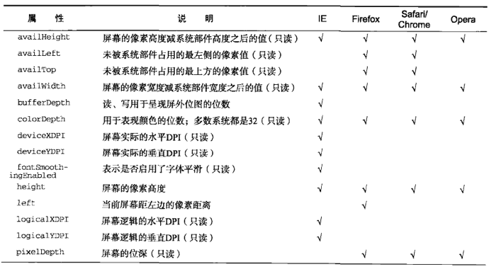
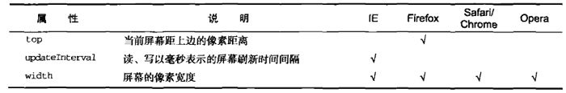

> 第八章：BOM 
>
> 第九章：客户端检测

<!--more-->

# BOM

## window对象

BOM的核心对象是`window`，它表示浏览器的一个实例。在浏览器中，`window`对象有双重角色，它既是通过JavaScript访问浏览器窗口的一个接口，又是ECMAScript规定的`Global`对象。这意味着在网页中定义的任何一个对象、变量和函数，都以`window`作为其`Global`对象，因此有权访问`parseInt()`等方法。

### 全局作用域

由于`window`对象同时扮演者ECMAScript中`Global`对象的角色，因此所有在全局作用域中声明的变量、函数都会变成`window`对象的属性和方法。

```javascript
var age = 29;
function sayAge(){
  console.log(this.age);
}
console.log(window.age); //29
sayAge();				//29
window.sayAge();		//29
```

定义全局变量与在`window`对象上直接定义属性还是有一点差别：全局变量不能通过`delete`操作符删除，而直接在`window`对象上的定义的属性可以：

```javascript
var age = 29;
window.color = 'red';

//在IE<9时抛出错误，在其他所有浏览器中都返回false
delete window.age;

//在IE<9时抛出错误，在其他所有浏览器中都返回true
delete window.color;

console.log(window.age);	//29
console.log(window.color);	//undefined
```

使用`var`语句添加的`window`属性都有一个名为`[[Configurable]]`的特性，这个特性的值被设置为`false`，因此这样定义的属性不可以通过`delete` 操作符删除。

尝试访问未声明的变量会抛出错误，但是通过查询`window`对象，可以知道某个可能未声明的变量是否存在：

```javascript
//这里会抛出错误，因为oldValue没有定义
var newValue = oldValue;

//这里不会抛出错误，因为这是一次属性查询
//newValue的值是undefined
var newValue = window.oldValue;
```

### 窗口关系及框架

如果页面中包含框架，则每个框架都拥有自己的`window`对象，并保存在`frames`集合中。在`frames`集合中，可以通过数值索引（从0开始，从左至右，从上到下）或者框架名称来访问相应的`window`对象。每个`window`对象都有一个`name`属性，其中包含框架的名称。下面是一个包含框架的页面：

```html
<html lang="en">
<head>
    <meta charset="UTF-8">
    <title>Title</title>
</head>
<frameset rows="160,*">
    <frame src="frame.html" name="topFrame">
    <frameset cols="50%,50%">
        <frame src="anotherframe.html" name="leftFrame">
        <frame src="yetanotherframe.html" name="rightFrame">
    </frameset>
</frameset>
</html>
```

<p id="div-border-left-red">`<frame>`和`<frameset>`元素已经从web标准中删除虽然一些浏览器目前仍然支持它，但也许会在未来的某个时间停止支持，请尽量不要使用该特性。</p>

对于上面例子，可以通过`window.frames[0]`或者`window.frames['topFrame']`来引用上方的框架。不过，最好使用`top`，而非`window`来引用这些框架（比如，通过`top.frames[0]`）。

* `top`对象始终指向最高层（最外层）的框架，也就是浏览器窗口。使用它可以确保在一个框架中正确地访问另一个框架。因为对于在一个框架中编写的任何代码来说，其中的`window`对象指向的都是那个框架的特定实例，而非最高层的框架。
* `parent`对象始终指向当前框架的直接上层框架。

除非最高层窗口是用过`window.open()`打开的，否则其`window`对象的`name`属性不会包含任何值。

* 与框架有关的最后一个对象是`self`，它始终指向`window`。实际上，`window`和`self`对象可以互换使用。引入`self`对象的目的是为了与`top`和`parent`对象对应起来，因此它不包含其他值。

所有这些对象都是window对象的属性，可以通过`window.parent`、`window.top`等形式访问。同时，也可以将不同层次的`window`对象连缀起来，比如`window.parent.parent.frames[0]`。

### 窗口位置

IE、Safari、Opera和Chrome都提供了`screenLeft`和`screenTop`属性，分别用于表示窗口相对于屏幕左边和上边的位置。Firefox则在`screenX`和`screenY`属性中提供相同的窗口位置信息，Safari和Chrome也同时支持这两个属性。Opera虽然也支持，但与`screenLeft`和`screenTop`属性不对应，因此不建议在Opera中使用。

```javascript
var leftPos = (typeof window.screenLeft == 'number')?window.screenLeft:window.screenX;

var topPos = (typeof window.screenTop == 'number')?window.screenTop:window.screenY;
```

在IE、Opera和Chrome中，`screenLeft`和`screenTop`中保存的是从显示器屏幕左边和上边到由`window`对象表示的页面可见区域（浏览器窗口的显示界面）的距离。如果`window`对象是最外层对象，而且浏览器窗口紧贴屏幕最上端（y轴坐标为0），那么`screenTop`的值就是位于页面可见区域上方的浏览器工具栏的像素高度。但是，在Firefox和Safari中，`screenY`或`screenTop`中保存的是整个浏览器窗口相对于屏幕的坐标值，即在窗口的y轴坐标为0时返回0。

Firefox、Safari和Chrome始终返回页面中每个框架的`top.screenX`和`top.screenY`值。即使在页面由于被设置了外边距而发生偏移的情况下，相对于`window`对象使用`screenX`和`screenY`每次也都会返回相同的值。而IE和Opera则会给出框架相对于屏幕边界的精确坐标值。

这样就无法在跨浏览器的条件下取得窗口左边和上边的精确坐标值。然而用`moveTo()`和`moveBy()`方法倒是有可能将窗口精确地移动到一个新位置。这两个方法都接收两个参数，其中`moveTo()`接收的是新位置的`x`和`y`坐标值，而`moveBy()`接收的是在水平和垂直方向上移动的像素数。

```javascript
//将窗口移动到屏幕的左上角
window.moveTo(0,0);

//将窗口向下移动100像素
window.moveBy(0,100);

//将窗口移动到（200，300）
window.moveTo(200,300);

//将窗口向左移动50px
window.moveBy(-50,0);
```

这两个方法可能会被浏览器禁用，在Opera和IE7（及更高版本）中默认就是禁用。而且这两个方法不适用与框架，只能对最外层的`window`使用。

### 窗口大小

IE9+、Firefox、Safari、Opera和Chrome都为确定窗口大小提供了四个属性：`innerWidth`、`innerHeight`、`outerWidth`和`outerHeight`。

* 在IE9+、Safari和Firefox中，`outerWidth`和`outerHeight`返回浏览器窗口本身的尺寸。
* 在Opera中，`outerWidth`和`outerHeight`两个属性的值表示页面视图容器（Opera中单个标签页对应的浏览器窗口）的大小。而`innerWidth`和`innerHeight`表示该容器中页面视图区的大小（减去边框的宽度）。
* 在Chrome中，`outerWidth`、`outerHeight`和`innerWidth`、`innerHeight`返回相同的值，即视口（viewport）大小而非浏览器窗口大小。
* IE8及更早版本没有提供取得当前浏览器窗口尺寸的属性，不过，它通过DOM提供了页面可见区域的相关信息。

在IE、Firefox、Safari、Opera和Chrome中，`document.documentElement.clientWidth`和`document.documentElement.clientHeight`中保存了页面视口的信息。在IE6中，这个属性必须在标准模式下才能有效，如果是混杂模式，就必须通过`document.body.clientWidth`和`document.body.clientHeight`取得相同信息。而对于混杂模式下的Chrome。`document.documentElement.clientWidth`、`document.documentElement.clientHeight`和`document.body.clientWidth`、`document.body.clientHeight`属性都可以取得视口的大小：

```javascript
var pageWidth = window.innerWidth,
    pageHeight = window.innerHeight;

if (typeof pageWidth != 'number'){			//检查保存的是不是一个数值
  if (document.cpmpatMode == 'CSS1Compat'){	//确定页面是否处于标准模式
    pageWidth = document.documentElement.clientWidth;
    pageHeight = document.documentElement.clientHeight;
  } else {
    pageWidth = document.body.clientWidth;
    pageHeight = document.body.clientHeight;
  }
}
```

对于移动设备，`window.innerWidth`和`window.innerHeight`保存着可见视口，也就是屏幕上可见页面区域的大小。

在移动浏览器中，`document.documentElement`度量的是布局视口，即渲染后页面的实际大小（与可见视口不同，可见视口只是整个页面中的一小部分）。

最好先检测一下用户是否在使用移动设备，然后再决定使用哪个属性。

使用`resizeTo()`和`resizeBy()`方法可以调整浏览器窗口的大小。这两个方法都接收两个参数，其中`resizeTo()`接收浏览器窗口的新宽度和新高度，而`resizeBy()`接收新窗口与原窗口的宽度和高度之差。

```javascript
//调整到100*100
window.resizeTo(100,100);

//调整到200*150
window.resizeBy(100,50);

//调整到300*300
window.resizeTo(300,300);
```

这两个方法与移动窗口位置的方法类似，也有可能被浏览器禁用；在Opera和IE7（及更高版本）中默认就是禁用。而且这两个方法不适用与框架，只能对最外层的`window`使用。

### 导航和打开窗口

使用`window.open()`方法既可以导航到特定的URL，也可以打开一个新的浏览器窗口。这个方法可以接收四个参数：要加载的URL、窗口目标、一个特性字符串以及一个表示新页面是否取代浏览器历史记录中当前加载页面的布尔值。通常只需传递第一个参数，最后一个参数只在不打开新窗口的情况下使用。

如果为`window.open()`传递第二个参数，而且该参数是已有窗口活框架的名称，那么就会在具有该名称的窗口或框架中加载第一个参数指定的URL：

```javascript
//等同于<a href="http://www.google.com" target="topFrame"></a>
window.open('http://www.google.com','topFrame');
```

此外。第二个参数也可以是下面任何一个特殊的窗口名称：`_self`、`_parent`、`_top`或`_blank`。

#### 弹出窗口

如果给`window.open()`传递的第二个参数并不是一个已经存在的窗口或框架，那么该方法就会根据第三个参数位置上传入的字符串创建一个新窗口或新标签页。如果没有传入第三个参数，那么就会打开一个带有全部默认设置（工具栏、地址栏和状态栏等）的新浏览器窗口（或打开一个新标签页---根据浏览器设置）。在不打开新窗口的情况下，会忽略第三个参数。

第三个参数是一个**逗号分隔**的设置**字符串**，表示在新窗口中都显示哪些特性。下面列出了出现在这个字符串中的设置选项：

```javascript
window.open('http://www.google.com','weoxWindow','heigh=400,width=400,top=10,left=10,resizeable=yes');//第三个参数中不允许出现空格
```

`window.open()`方法会返回一个指向新窗口的引用。引用的对象与其他`window`对象大致相似，但可以进行更多的控制。例如，有些浏览器在默认情况下可能不允许针对主浏览器窗口调整大小或移动位置，但允许针对通过`window.open()`创建的窗口大小或移动位置。通过这个返回对象。可以像操作其他窗口一样操作新打开的窗口：

```javascript
var wroxWin = window.open('http://www.google.com','weoxWindow','heigh=400,width=400,top=10,left=10,resizeable=yes');

//调整大小
wroxWin.resizeTo(500,500);

//移动位置
wroxWin.moveTo(100,100);
```

调用`close()`方法还可以关闭新打开的窗口。

```javascript
wroxWin.close();
```

但是这个方法仅适用于通过`window.open()`打开的弹出窗口。对于浏览器主窗口，如果没有得到用户的允许是不能关闭它。不过，弹出窗口倒是可以调用`top.close()`在不经用户允许的情况下关闭自己。弹出窗口关闭以后，窗口的引用仍然还在，但除了像下面这样检测其`closed`属性之外，已经没有其他用处了，

```javascript
wroxWin.close();
console.log(wroxWin.closed);	//true
```

新创建的`window`对象有一个`opener`属性，其中保存着打开它的原始窗口对象。这个属性只在弹出窗口中的最外层`window`对象（`top`）中有定义，而且指向调用`window.open()`的窗口或框架：

```javascript
var wroxWin = window.open('http://www.google.com','weoxWindow','heigh=400,width=400,top=10,left=10,resizeable=yes');

console.log(wroxWin.opener == window);	//true
```

虽然弹出窗口中有一个指针指向打开它的原始窗口，但原始窗口中并没有这样的指针指向弹出窗口。窗口并不跟踪记录它们打开的弹出窗口，因此只能在必要的时候手动实现跟踪。

有些浏览器（如IE8和Chrome）会在独立的进程中运行每个标签页。当一个标签页打开另一个标签页时，如果两个`window`对象之间需要彼此通信，那么新标签页就不能在独立的进程中。在Chrome中，将新创建的标签页的`opener`属性设置为`null`，即表示在单独的进程中运行新标签页：

```javascript
var wroxWin = window.open('http://www.google.com','weoxWindow','heigh=400,width=400,top=10,left=10,resizeable=yes');

wroxWin.opener = null;
```

将`opener`属性设置为`null`就是告诉浏览器新创建的标签页不需要与打开它的标签页通信，因此可以在独立的进程中运行。标签页之间的联系一旦切断，将无法恢复。

#### 弹出窗口屏蔽程序

如果是浏览器内置的屏蔽程序阻止的弹出窗口，那么`window.open()`很可能会返回`null`。此时，只要检测这个返回值就可以确定弹出窗口是否被屏蔽：

```javascript
var wroxWin = window.open('http://www.google.com','_blank');
if (wroxWin == null){
  console.log('the popup was blocked!');
}
```

如果是浏览器扩展或其他程序阻止的弹出窗口，那么`window.open()`通常会抛出一个错误。因此，想准确地检测出弹出窗口是否被屏蔽，必须在检测返回值的同时，将`window.open()`的调用封装在一个`try-catch`块中：

```javascript
var blocked = false;

try {
  var wroxWin = window.open('http://www.google.com','_blank');
  if (wroxWin == null){
    blocked = true;
  }
} catch (ex) {
  blocked = true;
}

if (blocked) {
  console.log('the popup was blocked!');
}
```

### 间歇调用和超时调用

JavaScript是单线程语言，但它允许通过设置超时值和间歇时间来调度代码在特定的时刻执行。前者是在指定的时间过后执行代码，而后者则是每隔指定的时间就执行一次代码。

超时调用需要使用`window`对象的`setTimeout()`方法，它接受两个参数：要执行的代码和以毫秒表示的时间（即在执行代码前需要等待多少毫秒）。其中，第一个参数可以是包含JavaScript代码的字符串，也可以是一个函数：

```javascript
//不推荐传递字符串，可能会导致性能损失
setTimeout('alert("hello")',1000);

//推荐的调用方式
setTimeout(function(){
  alert("hello");
},1000);
```

第二个参数是一个表示等待多长时间的毫秒数，但经过该时间后指定的代码不一定会执行。JavaScript是一个单线程序的解释器，因此一定时间内只能执行一段代码。为了控制要执行的代码，就有一个JavaScript任务队列。这些任务会按照它们添加到队列的顺序执行。`setTimeout()`的第二个参数告诉JavaScript再过多长时间把当前任务添加到队列中。如果队列是空，那么添加的代码会立即执行；如果队列不是空，那么它就要等前面的代码执行完后再执行。

调用`setTimeout()`之后，该方法会返回一个数值ID，表示超时调用。这个超时调用ID是计划执行代码的唯一标识符，可以通过它来取消超时调用。要取消尚未执行的超时调用计划，可以调用`clearTimeout()`方法并将相应的超时调用ID作为参数传递给它：

```javascript
//设置超时调用
var timeoutID = setTimeout(function(){
  console.log('hello');
},1000);

//把它取消
clearTimeout(timeoutID);
```

只要是在指定的时间尚未过去之前调用`clearTimeout()`，就可以完全取消超时调用。超时调用的代码是在全局作用域中执行的，因此函数中`this`的值在非严格模式下指向`window`对象，在严格模式下是`undefined`。

间歇调用会按照指定的时间间隔重复执行代码，直至间歇调用被取消或页面被卸载。设置间歇调用的方法是`setInterval()`，它接受的参数是：要执行的代码和每次执行之前需要等待的毫秒数：

```javascript
//不推荐传递字符串，可能会导致性能损失
setInterval('alert("hello")',1000);

//推荐的调用方式
setInterval(function(){
  alert("hello");
},1000);
```

调用`setInterval()`方法同样会返回一个间歇调用ID，该ID可用于在未来某个时刻取消间歇调用。要取消尚未执行的间歇调用，可以使用`clearInterval()`方法并传入相应的间歇调用ID。取消间歇调用的重要性要远远高于取消超时调用，因为在不加干涉的情况下，间歇调用会一直执行到页面卸载。

```javascript
var num = 0;
var max = 10;
var intervalID = null;

function incrementNumber(){
  num++;
  
  //如果执行次数达到了max设定的值，就取消后续尚未执行的调用
  if (num == max){
    clearInterval(intervalID);
    console.log('done');
  }
}

intervalID = setInterval(incrementNumber,500);
--------------------------改成超时调用---------------------------
var num = 0;
var max = 10;

function incrementNumber(){
  num++;
  
  //如果执行次数未达到了max设定的值，则设置另一次超时调用
  if (num < max){
    setTimeout(incrementNumber,500);
  } else{
    console.log('done');
  }
}

setTimeout(incrementNumber,500);
```

在使用超时调用时，没有必要跟踪超时调用ID，因为每次执行代码之后如果不再设置另一次超时调用，调用就会自动停止。一般认为，使用超时调用来模拟间歇调用是一种最佳模式。在开发环境下，很少使用真正的间歇调用，原因是后一个间歇调用可能会在前一个间歇调用结束之前启动。而像上面代码中这样使用超时调用，可以完全避免这点。所以，最好不要使用间歇调用。

### 系统对话框

浏览器通过`alert()`、`confirm()`和`prompt()`方法可以调用系统对话框向用户显示消息。系统对话框与在浏览器中显示的网页没有关系，也不包含HTML。它们的外观由操作系统及浏览器设置决定，而不是CSS决定。此外，通过这几个方法打开的对话框都是同步和模态的。也就是说，显示这些对话框的时候代码会停止执行，而关掉这些对话框后代码又会恢复执行。

* `alert()`方法接收一个字符串并将其显示给用户。调用`alert()`方法的结果就是向用户显示一个系统对话框，其中包含指定的文本和一个OK（‘‘确定’’）按钮。通常使用`alert()`生成的警告对话框向用户显示一些他们无法控制的消息，例如错误消息。而用户只能在看完消息后关闭对话框。



* `confirm()`方法与`alert()`方法的主要区别在于对话框除了显示OK按钮外，还会显示一个Cancel（“取消”）按钮，两个按钮可以让用户决定是否执行给定的操作。`confirm()`方法返回`true`表示点击了OK，返回`false`表示点击了Cancel（‘取消’）或者右上角关闭按钮。



* `prompt()`方法可以用于提示用户输入一些文本。提示框除了显示ok和Cancel之外，还会显示一个文本输入域，以供用户在其中输入内容。这个方法接收两个参数：要显示给用户的文本提示和文本输入域的默认值（可以是一个空字符串）。点击OK返回文本输入域的值，点击Cancel或没有单击OK而通过其他方法关闭了对话框，则返回`null`。



Chrome浏览器中，如果当前脚本在执行过程中会打开两个或多个对话框，那么从第二个对话框开始，每个对话框中都会显示一个复选框，以便用户阻止后续的对话框显示，除非用户刷新页面。

查找和打印对话框都是异步显示的，能够将控制权立即交还给脚本。这两个对话框与用户用过浏览器菜单的查找和打印命令打开的对话框相同。

```javascript
//显示打印对话框
window.print();

//显示查找对话框
window.find();
```

## location对象

`location`是最有用的BOM对象之一，它提供了与当前窗口中加载的文档有关的信息，还提供了一些导航功能。

`location`对象既是`window`对象的属性，也是`document`对象的属性，也就是`window.location`和`document.location`引用的是同一个对象。

`location`对象的用处不知表现在它保存着当前文档的信息，还表现在它将URL解析为独立的片段，让开发人员可以通过不同的属性访问这些片段。下面列出了`location`对象的所有属性：



### 查询字符串参数

尽管`location.search`返回从问号到URL末尾的所有内容，但却没有办法逐个访问其中每个查询字符串参数。可以创建下面这样一个函数，用于解析查询字符串，然后返回包含所有参数的一个对象：

```javascript
function getQueryStringArgs() {
  //取得查询字符串并去掉开头的问号
  var qs = (location.search.length > 0 ? location.search.substring(1) : ""),
      //保存数据对象
      args = {},

      //取得每一项
      items = qs.length ? qs.split("&") : [],
      item = null,
      name = null,
      value = null,

      //在for循环中使用
      i = 0,
      len = items.length;

  //逐个将每一项添加到args对象中
  for (i = 0; i < len; i++){
    item = items[i].split('=');
    name = decodeURIComponent(item[0]);
    value = decodeURIComponent(item[1]);

    if (name.length) {
      args[name] = value;
    }
  }

  return args;
}

//假设查询字符串是 ?q=javascript&num=10
var args = getQueryStringArgs();	//每个查询字符串都成了返回对象的属性
console.log(args['q']);		//javascript
console.log(args['num']);	//10
```

### 位置操作

使用`location`对象可以通过很多方式来改变浏览器的位置。

使用`assign()`方法并为其传递一个URL，就可以打开新URL并在浏览器的历史记录中生成一条记录。

```javascript
location.assign('http://www.google.com');
```

如果是将`location.href`或`window.href`设置为一个URL值，也会以该值调用`assign()`方法。

在改变浏览器位置的方法中，最常用的是设置`location.href`属性。

修改`location` 对象的其他属性也可以改变当前加载的页面：

```javascript
//假设初识URL为 http://www.wrox.com/WileyCDA

//将URL修改为 http://www.wrox.com/WileyCDA/#section1
location.hash = '#section1';

//将URL修改为 http://www.wrox.com/WileyCDA/?q=javascript
location.search = '?q=javascript';

//将URL修改为 http://www.yahoo.com/WileyCDA/
location.hostname = 'www.yahoo.com';

//将URL修改为 http://www.yahoo.com/mydir/
location.pathname = 'mydir';

//将URL修改为 http://www.yahoo.com:8080/WileyCDA/
location.port = 8080;
```

每次修改`location`的属性（`hash`除外），页面都会以新URL重新加载。

当通过上述任何一种方式修改URL之后，浏览器的历史记录中就会生成一条新记录，因此可以通过后退按钮导航到前一个页面。要禁止这种行为，可以使用`replace()`方法。这个方法只接受一个参数，即要导航到的URL；结果虽然会导致浏览器位置改变，但不会在历史记录中生成新记录。在调用`replace()`方法之后，用户不能回到前一个页面：

```html
<!DOCTYPE html>
<html lang="en">
<head>
    <meta charset="UTF-8">
    <title>Title</title>
</head>
<body>
<p>enjoy this page for a second, because you won't be coming back here</p>
<script>
    setTimeout(function () {
        location.replace('http://tc9011.com')
    },1000)
</script>
</body>
</html>
```

`reload()`方法的作用是重新加载当前显示的页面。如果调用`reload()`时不传递任何参数，页面就会以最有效的方式重新加载。也就是说，如果页面上次请求以来并没有改变过，页面就会从浏览器缓存中重新加载，如果要强制从服务器重新加载，则需要像下面这样为该方法传递参数`true`：

```javascript
location.replace();		//重新加载(可能会从缓存中加载)
location.reload(true);	//重新加载(从服务器重新加载)
```

位于`reload()`调用之后的代码可能也可能不执行，这要取决于网络延迟或系统资源等因素。所以，最好将`reload()`放在代码的最后一行。

## navigator对象

通过`navigator`对象可以识别客户端浏览器。每个浏览器中的`navigator`对象都有一套自己的属性：





表中的`navigator`对象的属性通常用于检测显示网页的浏览器类型。

### 检测插件

检测浏览器中是否安装了特定的插件是一种最常见的检测例程。对于非IE浏览器，可以使用`plugins`数组来达到这个目的。该数组中的每一项都包含下列属性：

* `name`：插件的名字
* `description`：插件的描述
* `filename`：插件的文件名
* `length`：插件所处理的MIME类型数量

一般来说，`name`属性中会包含检测插件必需的所有信息，但有时候也不完全如此。在检测插件时，需要像下面这样循环迭代每个插件并将插件的`name`与给定的名字进行比较。

```javascript
 //检测插件(在IE中无效)
function hasPlugin(name) {
  name = name.toLowerCase();	//转换为小写，便于比较
  for (var i = 0; i < navigator.plugins.length; i++){
    if (navigator.plugins[i].name.toLowerCase().indexOf(name) > -1){
      return true;
    }
  }
  return false;
}

console.log(hasPlugin('Flash'));
console.log(hasPlugin('QuickTime'));
```

在Firefox、Safari、Opera和Chrome中可以使用上面的方法来检测插件。

检测IE中的插件比较麻烦，因为IE不支持Netscape式的插件。在IE中检测插件的唯一方式就是使用专有的`ActiveXObject`类型，并尝试创建一个特定的插件的实例。IE是以COM对象的方式实现插件的，而COM对象使用唯一标识符来标识。因此，想要检测特定的插件，就必须知道其COM标识符。例如，Flash的标识符是`shockwaveFlash.shockwaveFlash`。知道唯一标识符后，就可以编写类似下面的函数来检测IE中是否安装相应插件了。

```javascript
//检测IE中的插件
function hasIEPlugin(name) {
  try {
    new ActiveXObject(name);
    return true;
  }catch (ex) {
    return false;
  }
}

console.log(hasIEPlugin('shockwaveFlash.shockwaveFlash'));
console.log(hasIEPlugin('QuickTime.QuickTime'));
```

鉴于检测两种插件的方法差别太大，因此典型的做法是针对每个插件分别创建检测函数：

```javascript
//检测所有浏览器中的Flash
function hasFlash() {
  var result = hasPlugin('Flash');
  if (!result){
    result = hasIEPlugin('shockwaveFlash.shockwaveFlash');
  }
  return result;
}

//检测所有浏览器中的QuickTime
function hasQuickTime() {
  var result = hasPlugin('QuickTime');
  if (!result){
    result = hasIEPlugin('QuickTime.QuickTime');
  }
  return result;
}

console.log(hasFlash());
console.log(hasQuickTime());
```

`plugins`集合有一个`refresh()`方法，用于刷新`plugins`以反映最新安装的插件。这个方法接收一个参数：表示是否应该重新加载页面的一个布尔值。如果将这个值设为`true`，则会重新加载包含插件的所有页面；否则，只更新`plugins`集合，不重新加载页面。

### 注册处理程序

Firefox2为`navigator`对象新增了`registerContentHandler()`和`registerProtocolHandler()`方法（这两个方法是在HTML5中定义的）。这两个方法可以让一个站点指明它可以处理特定类型的信息。随着RSS阅读器和在线电子邮件程序的兴起，注册处理程序就为像使用桌面应用程序一样默认使用这些在线应用程序提供了一种方式。

`registerContentHandler()`方法接收三个参数：要处理的MIME类型、可处理该MIME类型的页面的URL以及应用程序的名称。比如，要将一个站点注册为处理RSS源的处理程序：

```javascript
navigator.registerContentHandler('application/rss+xml',
        'http://www.somereader.com?feed=%s','Some Reader');
```

第二个参数是应该接收RSS源URL的URL，其中`%s`表示RSS源URL，由浏览器自动插入。当下一个请求RSS源时，浏览器就会打开指定的URL，而相应的web应用程序将以适当的方式来处理该请求。

`registerProtocolHandler()`方法也接收三个参数：要处理的协议、处理该协议页面的URL和应用程序名称：

```javascript
navigator.registerProtocolHandler('mailto',
        'http://www.somereader.com?cmd=%s','Some Mail Client');
```

## screen对象

`screen`对象基本上只用来表明客户端的能力，其中包括浏览器窗口外部的显示器的信息，如像素宽度和高度等。每个浏览器中`screen`对象都包含着不同的属性：





这些信息经常集中出现在测定客户端能力的站点跟踪工具中，但通常不会影响功能。不过，有时候也会用到其中的信息来调整窗口大小，使其占据屏幕的可用空间：

```javascript
window.resizeTo(screen.availWidth,screen.availHeight);
```

涉及移动设备屏幕时，运行IOS的设备始终会像把设备竖着拿在手里一样，因此返回值是768*1024。而Android设备会相应调用`screen.width`和`screen.height`的值。

## history对象

`history`对象保存着用户上网的历史记录，从窗口被打开的那一刻算起。因为`history`是`window`对象的属性，因此每个浏览器窗口、每个标签页乃至每个框架，都有自己的`history`对象与特定的`window`对象关联。出于安全考虑，开发人员无法得知用户浏览过的URL。不过，借由用户访问过的页面列表，同样可以在不知道实际URL的情况下实现后退和前进。

使用`go()`方法可以在用户的历史记录中任意跳转，可以向前也可以向后。这个方法接受一个参数，表示向后或向前跳转的页面数的一个整数值。负值表示向后跳转，正值表示向前跳转：

```javascript
//后退一页
history.go(-1);

//前进一页
history.go(1);

//前进两页
history.go(2);
```

也可以给`go()`方法传递一个字符串参数，此时浏览器会跳转到历史记录中包含该字符串的第一个位置—可能后退或前进，具体看哪个位置最近。如果历史记录中不包含这个字符串，那么这个方法什么都不做：

```javascript
//跳转到最近的wrox.com页面
history.go('wrox.com');

//跳转到最近的tc9011.com页面
history.go('tc9011.com');
```

可以使用两个简写方法``back()``和`forward()`来代替`go()`。这两个方法模仿浏览器的后退和前进按钮：

```javascript
//后退一页
history.back();

//前进一页
history.forward();
```

`history`对象还有一个`length`属性，保存着历史记录的数量。这个数量包括所有历史记录。对于加载到窗口、标签页或框架中的第一个页面而言，`history.length`等于0。通过像下面一样测试该属性值，可以确定用户是否一开始就打开了你的页面：

```javascript
if (history.length == 0){
  //这应该是用户打开窗口后的第一个页面
}
```

<iframe src="https://www.xmind.net/embed/AHxZ" width="620px" height="540px"></iframe>

# 客户端检测

先设计最通用的方案，然后再使用特定于浏览器的技术增强方案。

## 能力检测

能力检测的目标不是识别特定的浏览器，而是识别浏览器的能力。采用这种方式不必顾及特定的浏览器如何，只要确定浏览器支持特定的能力，就可以给出解决方案。其基本模式如下：

```javascript
if (object.propertyInQuestion){
  //使用object.propertyInQuestion
}
```

要理解能力检测，首先必须理解两个重要的概念：

* 先检测达成目的的最常用的特性，保证代码最优化，因为多数情况下都可以避免测试多个条件。
* 必须测试实际要用到的特性。一个特性存在，不一定意味着另一个特性也存在。

### 更可靠的能力检测

能力检测对于想知道某个特性是否会按照适当方式行事（而不仅仅是某个特性存在）非常有用。

下面函数用来确定一个对象是否支持排序：

```javascript
//不要这样做，这不是能力检测---只检测了是否存在相应的方法
function isSortable(object){
  return !!object.sort;
}
```

上面的方法对任何包含`sort`属性的对象也会返回`true`，比如：

```javascript
var result = isSortable({sort: true});
```

检测某个属性是否存在并不能够确定对象是否支持排序。更好的方式是检测`sort`是不是一个函数。

```javascript
//这样更好，检测sort是不是函数
function isSortable(object){
  return typeof object.sort == 'function';
}
```

在可能的情况下，要尽量使用`typeof`进行能力检测。特别是，宿主对象没有义务让`typeof`返回合理的值。

在浏览器环境下测试任何对象的某个特性是否存在，可以使用下面这个函数：

```javascript
function isHostMethod(object,property){
  var t = typeof object[property];
  return t == 'function' || (!!(t == 'object' && object[property])) || t=='unknown';
}

var xhr = new ActiveXObject('Microsoft.XMLHttp');
result = isHostMethod(xhr,'open');	//true
result = isHostMethod(xhr,'foo');	//false
```

宿主对象没有义务保持目前的实现方式不变，也不一定会模仿已有宿主对象的行为，所以这个函数不能百分之百保证永远可靠。

### 能力检测，不是浏览器检测

检测某个或几个特性并不能确定浏览器。

如果知道自己的应用程序需要使用某些特定的浏览器特性，那么最好一次性检测所有相关特性，而不是分别检测。

实际开发中，应该将能力检测作为确定一下步解决方案的依据，而不是用它来判断用户使用的是什么浏览器。

## 怪癖检测

怪癖检测的目标是识别浏览器的特殊行为，与能力检测确认浏览器支持什么能力不同的是，怪癖检测是想要知道浏览器存在什么缺陷。这通常需要运行一小段代码，以确定某一特性不能正常工作。

一般来说，怪癖都是个别浏览器所独有的，而且通常被归为bug。在新版本中，这些问题可能会也可能不会被修复。建议只检测对你有直接影响的怪癖，而且最好在脚本一开始就执行此类检测。

## 用户代理检测

用户代理检测通过检测用户代理字符串来确定实际使用的浏览器。在每一次HTTP请求过程中，用户代理字符串是作为响应首部发送的，而且该字符串可以通过JavaScript的`navigator.userAgent`属性访问。

在服务器端，通过检测用户代理字符串来确定用户使用的浏览器是一种常用而且广为接受的做法。

在客户端，用户代理检测一般被当做一种万不得已才用的做法，其优先级排在能力检测和怪癖检测之后。

### 用户代理字符串检测技术

首先要确定的是你需要多么具体的浏览器信息。一般情况下，知道呈现引擎和最低限度的版本就足以决定正确的操作方法了。

#### 识别呈现引擎

如果Firefox、Camino和Netscape都使用的是同一个版本的Gecko，那么它们一定支持相同的特性。同样，不管什么浏览器，使用跟Safari3同一个版本的Webkit，那么该浏览器也和Safari3具有同样的功能。

因此，编写的脚本主要检测5大呈现引擎：IE、Gecko、Webkit、KHTML和Opera。

为了不在全局作用域中添加多余的变量，将使用模块增强模式来封装检测脚本：

```javascript
var client = function () {
  var engine = {
    //呈现引擎
    ie: 0,
    gecko: 0,
    webkit: 0,
    khtml: 0,
    opera: 0,

    //具体版本号
    ver: null
  };

  //在此检测呈现引擎、平台和设备

  return{
    engine: engine
  };
}();
```

在匿名函数的对象字面量中，每个呈现引擎都对应着一个属性，属性的值默认为0.如果检测到哪个呈现引擎，那么就以浮点数值形式将该引擎的版本号写入相应的属性。而呈现引擎的完全版本则被写入`ver`属性。这段代码用法如下：

```javascript
if (client.engine.ie) {	//如果是IE，client.ie的值应该大于0
  //针对IE的代码
} else if (client.engine.gecko > 1.5) {
  if (client.engine.ver == '1.8.1'){
    //针对这个版本进行某些操作
  }
}
```

要正确地识别呈现引擎，关键是检测顺序要正确。由于用户代理字符串存在诸多不一致的地方，如果检测顺序不对，很可能会导致检测结果不正确。

为此，第一步就是识别Opera，因为它的用户代理字符串有可能完全模仿其他浏览器。不相信Opera是因为任何情况下其用户代理字符串都不会将自己标识为Opera。

* Opera

要识别Opera，必须得检测`window.opera`对象。Opera5及更高版本中都有这个对象，用以保存于浏览器相关的标识信息以及与浏览器直接交互。在Opera7.6及更高版本中，调用`version()`方法可以返回一个表示浏览器版本的字符串，而这也是确定Opera版本号的最佳方式。要检测更早的版本，可以直接检查用户代理字符串，因为那些版本还不支持隐藏身份：

```javascript
if (window.opera) {
  engine.ver = window.opera.version();
  engine.opera = parseFloat(engine.ver);
}
```

* WebKit

放在第二位检测的呈现引擎是WebKit。因为WebKit的用户代理字符串包含`Gecko`和`KHTML`这两个子字符串。

WebKit的用户代理字符串中的`AppleWebKit`是独一无二的，因此检测这个字符串最合适：

```javascript
var ua = navigator.userAgent;	//保存用户代理字符串

if (window.opera) {
  engine.ver = window.opera.version();
  engine.opera = parseFloat(engine.ver);
} else if (/AppleWebKit\/(\S+)/.test(ua)){	
  engine.ver = RegExp['$1'];
  engine.webkit = parseFloat(engine.ver);
}
```

由于实际版本号中可能会包含数字、小数点和字母，所以捕获组中使用了表示非空格的特殊字符（\S）。用户代理字符串中的版本号与下一部分的分隔符是一个空格，因此这个模式可以保证捕获所有版本信息。

* KHTML

KHTML的用户代理字符串中也包含`Gecko`，因此，在排除KHTML之前，无法准确检测基于Gecko的浏览器。KHTML的版本号与WebKit的版本号在用户代理字符串中的格式差不多，因此可以使用类似的正则表达式。此外，由于Konqueror3.1及更早版本中不包含KHTML的版本，故而就要使用Konqueror的版本来代替：

```javascript
var ua = navigator.userAgent;	

if (window.opera) {
  engine.ver = window.opera.version();
  engine.opera = parseFloat(engine.ver);
} else if (/AppleWebKit\/(\S+)/.test(ua)){	
  engine.ver = RegExp['$1'];
  engine.webkit = parseFloat(engine.ver);
} else if (/KHTML\/(\S+)/.test(ua) || /Konqueror\/([^;]+)/.test(ua)) {
  engine.ver = RegExp['$1'];
  engine.khtml = parseFloat(engine.ver);
}
```

* Gecko

在用户代理字符串中，Gecko的版本号不会出现在字符串`Gecko`的后面，而是会出现在字符串`rv:`的后面：

```javascript
var ua = navigator.userAgent;	

if (window.opera) {
  engine.ver = window.opera.version();
  engine.opera = parseFloat(engine.ver);
} else if (/AppleWebKit\/(\S+)/.test(ua)){	
  engine.ver = RegExp['$1'];
  engine.webkit = parseFloat(engine.ver);
} else if (/KHTML\/(\S+)/.test(ua) || /Konqueror\/([^;]+)/.test(ua)) {
  engine.ver = RegExp['$1'];
  engine.khtml = parseFloat(engine.ver);
} else if (/rv:([^\)]+)\) Gecko\/\d{8}/.test(ua)){
  engine.ver = RegExp['$1'];
  engine.gecko = parseFloat(engine.ver);
}
```

* IE

IE的版本号位于字符串`MSIE`的后面、一个分号的前面：

```javascript
var ua = navigator.userAgent;	

if (window.opera) {
  engine.ver = window.opera.version();
  engine.opera = parseFloat(engine.ver);
} else if (/AppleWebKit\/(\S+)/.test(ua)){	
  engine.ver = RegExp['$1'];
  engine.webkit = parseFloat(engine.ver);
} else if (/KHTML\/(\S+)/.test(ua) || /Konqueror\/([^;]+)/.test(ua)) {
  engine.ver = RegExp['$1'];
  engine.khtml = parseFloat(engine.ver);
} else if (/rv:([^\)]+)\) Gecko\/\d{8}/.test(ua)){
  engine.ver = RegExp['$1'];
  engine.gecko = parseFloat(engine.ver);
} else if (/MSIE ([^;]+)/.test(ua)) {
  engine.ver = RegExp['$1'];
  engine.ie = parseFloat(engine.ver);
}
```

#### 识别浏览器

```javascript
var client = function () {
  var engine = {
    //呈现引擎
    ie: 0,
    gecko: 0,
    webkit: 0,
    khtml: 0,
    opera: 0,

    //具体版本号
    ver: null
  };

  var browser = {
    //浏览器
    ie: 0,
    firefox: 0,
    safari: 0,
    konq: 0,
    opera: 0,
	chrome: 0,
    
    //具体版本号
    ver: null
  };
  
  //在此检测呈现引擎、平台和设备

  return{
    engine: engine,
    browser: browser
  };
}();
```

上面代码中添加了私有变量`browser`，用于保存每个主要浏览器的属性。除了当前使用的浏览器，其他属性的值将保持为`0`。如果是当前使用的浏览器，则这个属性保存的是浮点数值形式的版本号。`ver`属性中在必要时会包含字符串形式的浏览器完整版本号。由于大多数浏览器与其呈现引擎密切相关，所以检测浏览器的代码与检测呈现引擎的代码是混合在一起的。

```javascript
//检测呈现引擎及浏览器
var ua = navigator.userAgent;	

if (window.opera) {
  engine.ver = browser.ver = window.opera.version();
  engine.opera = browser.opera = parseFloat(engine.ver);
} else if (/AppleWebKit\/(\S+)/.test(ua)){	
  engine.ver = RegExp['$1'];
  engine.webkit = parseFloat(engine.ver);
  
  //确定是chrome还是Safari
  if (/chrome\/(\S+)/.test(ua)) {
    browser.ver = RegExp['$1'];
    browser.chrome = parseFloat(browser.ver);
  } else if (/Version\/(\S+)/.test(ua)) {
    browser.ver = RegExp['$1'];
    browser.safari = parseFloat(browser.ver);
  }else {
    //近似地确定版本号
    var safariVersion = 1;
    if (engine.webkit < 100){
      safariVersion == 1;
    } else if (engine.webkit < 312) {
      safariVersion = 1.2;
    } else if (engine.webkit < 412) {
      safariVersion = 1.3;
    } else {
      safariVersion = 2;
    }
    
    browser.safari = browser.ver = safariVersion;
  }
} else if (/KHTML\/(\S+)/.test(ua) || /Konqueror\/([^;]+)/.test(ua)) {
  engine.ver = browser.ver = RegExp['$1'];
  engine.khtml = browser.konq = parseFloat(engine.ver);
} else if (/rv:([^\)]+)\) Gecko\/\d{8}/.test(ua)){
  engine.ver = RegExp['$1'];
  engine.gecko = parseFloat(engine.ver);
  
  //确定是不是Firefox
  if (/Firefox\/(\S+)/.test(ua)) {
    browser.ver = RegExp['$1'];
  	browser.firefox = parseFloat(browser.ver);
  }
} else if (/MSIE ([^;]+)/.test(ua)) {
  engine.ver = browser.ver = RegExp['$1'];
  engine.ie = browser.ie = parseFloat(engine.ver);
}
```

对Opera和IE而言，`browswe`对象中的值等于`engine`对象中的值。

对Konqueror而言，`browser.konq`和`browser.ver`属性分别等于`engine.khtml`和`engine.ver`属性。

为了检测Chrome和Safari，在检测引擎的代码中添加了`if`语句。提取Chrome版本号时，需要查找字符串`Chrome/`并取得该字符串后面的数值。而提取Safari的版本号时，则需要查找字符串`Version/`并取得其后的数值。由于这种方式仅适用于Safari3及更高版本，因此需要一些备用的代码，将WebKit的版本号近似地映射为Safari的版本号。

在检测Firefox时，要找到字符串`Firefox/`并取得其后的数值。

有了上面代码后，可以这样用：

```javascript
if (client.engine.webkit) {	//如果是webkit
  if (client.browser.chrome) {
    //执行针对chrome的代码
  } else if (client.browser.safari) {
    //执行针对Safari的代码
  }
} else if (client.engine.gecko) {
  if (client.browser.firefox) {
    //执行针对Firefox的代码
  } else {
    //执行针对其他Gecko浏览器的代码
  }
}
```

#### 识别平台

目前三大主流平台是Windows、Mac和Unix（包括各种Linux）。为了检测这些平台，还需要像下面这样添加新对象：

```javascript
var client = function () {
  var engine = {
    //呈现引擎
    ie: 0,
    gecko: 0,
    webkit: 0,
    khtml: 0,
    opera: 0,

    //具体版本号
    ver: null
  };

  var browser = {
    //浏览器
    ie: 0,
    firefox: 0,
    safari: 0,
    konq: 0,
    opera: 0,
	chrome: 0,
    
    //具体版本号
    ver: null
  };
  
  var system = {
    win: false,
    mac: false,
    xll: false	//表示Unix
  }
  //在此检测呈现引擎、平台和设备

  return{
    engine: engine,
    browser: browser,
    system: system
  };
}();
```

与呈现引擎不同，在不能访问操作系统或版本的情况下，平台信息是很有限的。对这三个平台而言，浏览器一般只报告Windows版本。为此，新变量`system`的每个属性最初都保存着布尔值`false`。

在确定平台时，检测`navigator.platform`要比检测用户代理字符串更简单，后者在不同浏览器中会给出不同的平台信息：

```javascript
var p = navigator.platform;
system.win = p.indexOf('Win') == 0;
system.mac = p.indexOf('Mac') == 0;
system.xll = (p.indexOf('Xll') == 0) || (p.indexOf('Linux') == 0);
```

#### 识别Windows操作系统

在Windows平台下，还可以从用户代理字符串中进一步取得具体的操作信息。

```javascript
if (system.win) {
  if (/win(?:dows)?([^do]{2})\s?(\d+\.\d+)?/.test(ua)){
    if (RegExp['$1'] == 'NT'){
      switch (RegExp['$2']) {
        case '5.0':
          system.win = '2000';
          break;
        case '5.1':
          system.win = 'XP';
          break;
        case '6.0':
          system.win = 'Vista';
          break;
        case '6.1':
          system.win = '7';
          break;
        default:
          system.win = 'NT';
          break;
      }
    } else if (RegExp['$1'] == '9x') {
      system.win = 'ME';
    } else {
      system.win = RegExp['$1'];
    }
  }
}
```

`/win(?:dows)?([^do]{2})\s?(\d+\.\d+)?/`中`win(?:dows)?([^do]{2})`会匹配Windows95和Windows98这两个字符串。对这两个字符串，只有Gecko与其他浏览器不同，即没有`dows`，而且`Win`与版本号之间没有空格。`(\d+\.\d+)?`用于取得Gecko中 Windows NT的版本号。`\s?`表示在Opera中Windows NT的字符串中`NT`与`4.0`之间的空格。这个正则表达式第一个捕获组将会匹配95、98、9x、NT、ME或XP。第二个捕获组则只针对Windows ME及所有Windows NT的变体。

如果`system.win`的值是`true`，那么就用这个正则表达式从用户代理字符串中提取具体的信息：

```javascript
if (client.system.win) {
  if (client.system.win == 'XP'){
    //说明是XP
  } else if (client.system.win == 'Vista') {
    //说明是Vista
  }
}
```

#### 识别移动设备

```javascript
var client = function () {
  var engine = {
    //呈现引擎
    ie: 0,
    gecko: 0,
    webkit: 0,
    khtml: 0,
    opera: 0,

    //具体版本号
    ver: null
  };


  var browser = {
    //浏览器
    ie: 0,
    firefox: 0,
    safari: 0,
    konq: 0,
    opera: 0,
    chrome: 0,

    //具体版本号
    ver: null
  };

  var system = {
    win: false,
    mac: false,
    xll: false,

    //移动设备
    iphone: false,
    ipod: false,
    ipad: false,
    ios: false,
    android: false
  };
  
  //在此检测呈现引擎、平台和设备

  return{
    engine: engine,
    browser: browser,
    system: system
  };
}();
```

通常简单地检测字符串`iphone`、`ipod`和`ipad`，就可以分别设置相应属性的值：

```javascript
system.iphone = ua.indexOf('iphone') > -1;
system.ipod = ua.indexOf('ipod') > -1;
system.ipad = ua.indexOf('ipad') > -1;

//检测IOS版本号
if (system.mac && ua.indexOf('Mobile') > -1) {
  if (/CPU(?:iphone)?OS(\d+_\d+)/.test(ua)){
    system.ios = parseFloat(RegExp.$1.replace('_','.'));
  }else {
    system.ios = 2; //不能真正检测出来，只能猜测
  }
}
```

IOS3之前，用户代理字符串只包含`CPU like Mac OS`，后来又改成`CPU iphone OS 3_0 like Mac OS X`，iPad中又改成`CPU OS 3_2 like Mac OS X`。检测系统是不是Mac OS、字符串是否存在`Mobile`，可以确保无论什么版本，`system.ios`中都不会是`0`。

所有Android都有版本值，检测Android：

```javascript
//检测Android版本
if (/Android(\d+\.\d+)/.test(ua)){
  system.android = parseFloat(RegExp.$1);
}
```

#### 识别游戏系统

```javascript
var client = function () {
  var engine = {
    //呈现引擎
    ie: 0,
    gecko: 0,
    webkit: 0,
    khtml: 0,
    opera: 0,

    //具体版本号
    ver: null
  };


  var browser = {
    //浏览器
    ie: 0,
    firefox: 0,
    safari: 0,
    konq: 0,
    opera: 0,
    chrome: 0,

    //具体版本号
    ver: null
  };

  var system = {
    win: false,
    mac: false,
    xll: false,

    //移动设备
    iphone: false,
    ipod: false,
    ipad: false,
    ios: false,
    android: false,
    
    //游戏系统
    wii: false,
    ps: false
  };
  
  //在此检测呈现引擎、平台和设备

  return{
    engine: engine,
    browser: browser,
    system: system
  };
}();
```

检测游戏系统代码如下：

```javascript
system.wii = ua.indexOf('wii') > -1;
system.ps = /playstation/i.test(ua);
```

### 完整的代码

```javascript
var client = function () {
  var engine = {
    //呈现引擎
    ie: 0,
    gecko: 0,
    webkit: 0,
    khtml: 0,
    opera: 0,

    //完整的版本号
    ver: null
  };

  //浏览器
  var browser = {

    //主要浏览器
    ie: 0,
    firefox: 0,
    safari: 0,
    konq: 0,
    opera: 0,
    chrome: 0,

    //具体版本号
    ver: null
  };

  //平台、设备和操作系统
  var system = {
    win: false,
    mac: false,
    xll: false,

    //移动设备
    iphone: false,
    ipod: false,
    ipad: false,
    ios: false,
    android: false,

    //游戏系统
    wii: false,
    ps: false
  };


  //检测呈现引擎及浏览器
  var ua = navigator.userAgent;	

  if (window.opera) {
    engine.ver = browser.ver = window.opera.version();
    engine.opera = browser.opera = parseFloat(engine.ver);
  } else if (/AppleWebKit\/(\S+)/.test(ua)){	
    engine.ver = RegExp['$1'];
    engine.webkit = parseFloat(engine.ver);

    //确定是chrome还是Safari
    if (/chrome\/(\S+)/.test(ua)) {
      browser.ver = RegExp['$1'];
      browser.chrome = parseFloat(browser.ver);
    } else if (/Version\/(\S+)/.test(ua)) {
      browser.ver = RegExp['$1'];
      browser.safari = parseFloat(browser.ver);
    }else {
      //近似地确定版本号
      var safariVersion = 1;
      if (engine.webkit < 100){
        safariVersion == 1;
      } else if (engine.webkit < 312) {
        safariVersion = 1.2;
      } else if (engine.webkit < 412) {
        safariVersion = 1.3;
      } else {
        safariVersion = 2;
      }

      browser.safari = browser.ver = safariVersion;
    }
  } else if (/KHTML\/(\S+)/.test(ua) || /Konqueror\/([^;]+)/.test(ua)) {
    engine.ver = browser.ver = RegExp['$1'];
    engine.khtml = browser.konq = parseFloat(engine.ver);
  } else if (/rv:([^\)]+)\) Gecko\/\d{8}/.test(ua)){
    engine.ver = RegExp['$1'];
    engine.gecko = parseFloat(engine.ver);

    //确定是不是Firefox
    if (/Firefox\/(\S+)/.test(ua)) {
      browser.ver = RegExp['$1'];
      browser.firefox = parseFloat(browser.ver);
    }
  } else if (/MSIE ([^;]+)/.test(ua)) {
    engine.ver = browser.ver = RegExp['$1'];
    engine.ie = browser.ie = parseFloat(engine.ver);
  }

  //检测浏览器
  browser.ie = engine.ie;
  browser.opera = engine.opera;

  //检测平台
  var p = navigator.platform;
  system.win = p.indexOf('Win') == 0;
  system.mac = p.indexOf('Mac') == 0;
  system.xll = (p.indexOf('Xll') == 0) || (p.indexOf('Linux') == 0);

  //检测Windows系统
  if (system.win) {
    if (/win(?:dows)?([^do]{2})\s?(\d+\.\d+)?/.test(ua)){
      if (RegExp['$1'] == 'NT'){
        switch (RegExp['$2']) {
          case '5.0':
            system.win = '2000';
            break;
          case '5.1':
            system.win = 'XP';
            break;
          case '6.0':
            system.win = 'Vista';
            break;
          case '6.1':
            system.win = '7';
            break;
          default:
            system.win = 'NT';
            break;
        }
      } else if (RegExp['$1'] == '9x') {
        system.win = 'ME';
      } else {
        system.win = RegExp['$1'];
      }
    }
  }

  //移动设备
  system.iphone = ua.indexOf('iphone') > -1;
  system.ipod = ua.indexOf('ipod') > -1;
  system.ipad = ua.indexOf('ipad') > -1;

  //检测IOS版本号
  if (system.mac && ua.indexOf('Mobile') > -1) {
    if (/CPU(?:iphone)?OS(\d+_\d+)/.test(ua)){
      system.ios = parseFloat(RegExp.$1.replace('_','.'));
    }else {
      system.ios = 2; //不能真正检测出来，只能猜测
    }
  }

  //检测Android版本
  if (/Android(\d+\.\d+)/.test(ua)){
    system.android = parseFloat(RegExp.$1);
  }

  //检测游戏系统
  system.wii = ua.indexOf('wii') > -1;
  system.ps = /playstation/i.test(ua);

  //返回这些对象
  return{
    engine: engine,
    browser: browser,
    system: system
  };
}();
```

### 使用方法

用户代理是客户端检测的最后一个选择。用户代理检测一般适用于下列情形：

* 不能直接准确地使用能力检测或怪癖检测。
* 同一款浏览器在不同平台下具备不同的能力。这时候，可能就有必要确定浏览器位于哪个平台下。
* 为了跟踪分析等目的需要知道确切的浏览器。


<iframe src="https://www.xmind.net/embed/GKba" width="620px" height="540px"></iframe>
