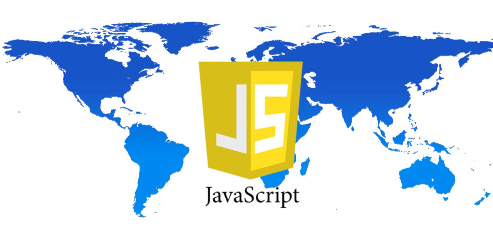
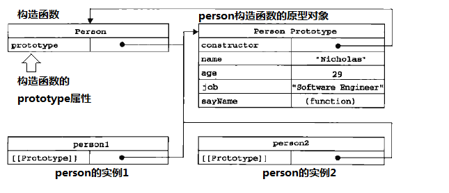
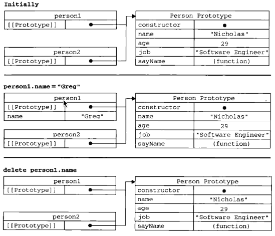
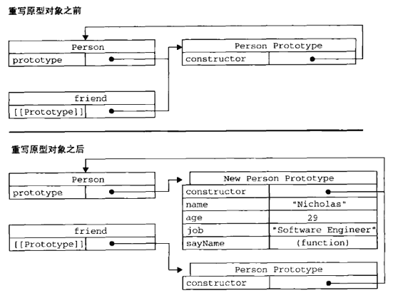
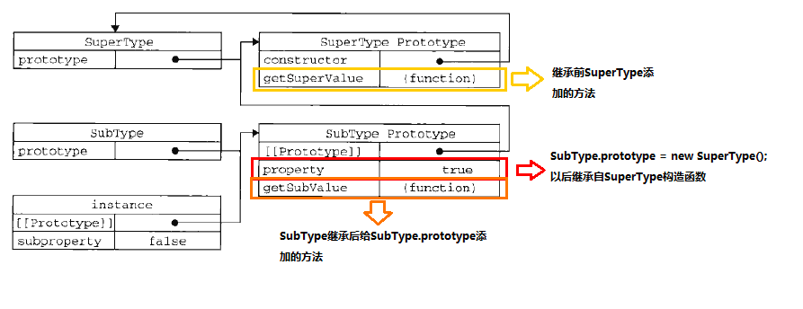
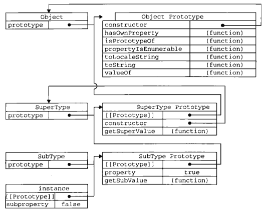
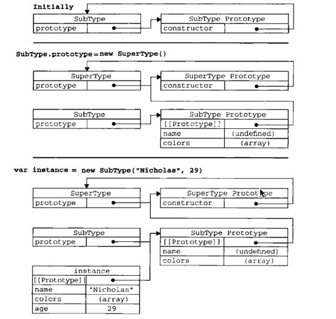
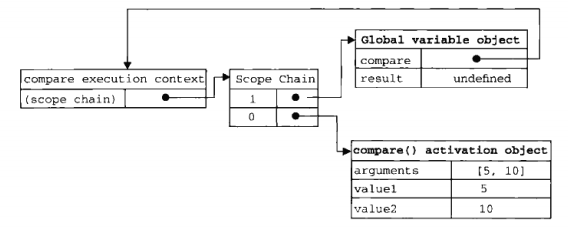
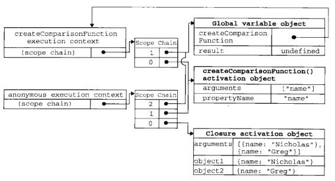

> 第六章：面向对象的程序设计 
>
> 第七章：函数表达式

<!--more-->

# 面向对象的程序设计 

ECMA-262把对象定义为：无序属性的集合，其属性可以包含基本值、对象或者函数。严格来讲，这就相当于对象是一组没有特定顺序的值。

每个对象都是基于一个引用类型创建的。

## 理解对象

### 属性类型

ECMA-262第五版在定义只有内部才用的特性（attribute）时，描述了属性（property）的各种特征。ECMA-262定义这些特性是为了实现JavaScript引擎用的，因此在JavaScript中不能直接访问它们。为了表示特性是内部值，该规范把它们放在了两对方括号中，比如`[[Enumerable]]`。

ECMAScript中有两种属性：数据属性和访问属性。

#### 数据属性

数据属性包含一个数据值的位置。在这个位置可以读取和写入值。数据属性有4个描述其行为的特性。

- [[Configurable]]：表示能否通过delete删除属性从而重新定义属性，能否修改属性的特性，或者能否把属性修改为访问器属性。直接在对象上定义的属性，它们的这个特性默认值为`true`。
- [[Enumerable]]：表示能否通过for-in循环返回属性。直接在对象上定义的属性，它们的这个特性默认值为`true`。
- [[writable]]：表示能否修改属性的值。直接在对象上定义的属性，它们的这个特性默认值为`true`。
- [[value]]：包含这个属性的数据值。读取属性值的时候，从这个位置读；写入属性值时，把新值保存在这个位置。这个特性的默认值是`undefined`。

要修改属性默认的特性，必须使用ECMAScript5中的`Object.defineProperty()`方法。这个方法接收三个参数：属性所在的对象、属性的名字和一个描述符对象。其中，描述符对象的属性必须是：`Configurable`、`Enumerable`、`writable`和`value`。设置其中一个或者多个值，可以修改对应的特性值。

```javascript
var person = {};
Object.defineProperty(person,'name',{
  writable: false,
  value: 'tc'
});
console.log(person.name);	//tc
person.name = 'zj';			//严格模式下会抛错误，非严格模式下，赋值操作会被忽略
console.log(person.name);	//tc

var person = {};
Object.defineProperty(person,'name',{
  Configurable: false,
  value: 'tc'
});
console.log(person.name);	//tc
delete person.name;			//严格模式下会抛错误，非严格模式下，删除操作会被忽略
console.log(person.name);	//tc
```

可以多次调用`Object.defineProperty()`方法修改同一属性，但是把`Configurable`特性设置为`false`之后，不能再调用`writable`之外的特性，包括`Configurable`，也就是说一旦把属性定义为不可配置，就不能再把它变回可配置。

调用`Object.defineProperty()`方法时，如果不指定，`Configurable`、`Enumerable`、`writable`特性都默认为`false`。

#### 访问器属性

访问属性不包含数据值，它包含一对`getter`和`setter`函数。在读取访问器属性时，会调用`getter`函数，这个函数负责返回有效的值；在写入访问器属性时，会调用`setter`函数并传入新值，这个函数负责决定如果处理数据。访问器属性有如下4个特性：

- [[Configurable]]：表示能否通过`delete`删除属性从而重新定义属性，能否修改属性的特性，或者能否把属性修改为数据属性。直接在对象上定义的属性，它们的这个特性默认值为`true`。
- [[Enumerable]]：表示能否通过for-in循环返回属性。直接在对象上定义的属性，它们的这个特性默认值为`true`。
- [[Get]]：在读取属性时调用的函数。默认值为`undefined`。
- [[Set]]：在写入属性时调用的函数。默认值为`undefined`。

访问器属性不能直接定义，必须使用`Object.defineProperty()`来定义。

```javascript
var book = {
  _year: 2004,
  edition: 1
};
Object.defineProperty(book,'year',{
  get: function () {
    return this._year;
  },
  set: function (newValue) {
    if (newValue > 2004){
      this._year = newValue;
      this.edition += newValue - 2004;
    }
  }
});
book.year = 2005;
console.log(book.edition);	//2 
```

不一定非要同时指定`getter`和`setter`。只指定`getter`意味着属性是不能写，尝试写入属性会被忽略，在严格模式下，则会抛出错误。没指定`getter`函数的属性不能读，反正会返回`undefined`，在严格模式下会抛出错误。

### 定义多个属性

`Object.defineProperties()`方法可以通过描述一次定义多个属性。这个方法接收两个对象参数：第一个对象是要添加和修改其属性的对象，第二个对象的属性与第一个对象中要添加或修改的属性一一对应。

```javascript
var book = {};
Object.defineProperties(book,{//定义了两个数据属性(_year和edition)和一个访问器属性(year)
  _year: {					
    value: 2004
  },
  edition: {
    value: 1
  },
  year: {
    get: function () {
      return this._year;
    },
    set: function (newValue) {
      if (newValue > 2004){
        this._year = newValue;
        this.edition += newValue - 2004;
      }
    }
  }
});
```

### 读取属性的特性

`Object.getOwnPropertyDescriptor()`方法可以取得给定属性的描述符。这个方法接收两个参数：属性所在的对象和要读取其描述符的属性名称。返回值是一个对象，如果是访问器属性，这个对象的属性有`configurable`、`enumerable`、`get`和`set`；如果是数据属性，这个对象的属性有`configurable`、`enumerable`、`writable`和`value`。

```javascript
var book = {};
Object.defineProperties(book,{
  _year: {					
    value: 2004
  },
  edition: {
    value: 1
  },
  year: {
    get: function () {
      return this._year;
    },
    set: function (newValue) {
      if (newValue > 2004){
        this._year = newValue;
        this.edition += newValue - 2004;
      }
    }
  }
});

var descriptor = Object.getOwnPropertyDescriptor(book,'_year');
console.log(descriptor.value);			//2004
console.log(descriptor.configurable);	//false
console.log(typeof descriptor.get);		//undefined

var descriptor = Object.getOwnPropertyDescriptor(book,'year');
console.log(descriptor.value);			//undefined
console.log(descriptor.enumerable);		//false
console.log(typeof descriptor.get);		//function
```

## 创建对象

虽然Object构造函数或对象字面量都可以用来创建单个对象，但这些方式有个明显的缺点：使用同一个接口创建很多对象，会产生大量的重复代码。

### 工厂模式

工厂模式是一种设计模式，它抽象了创建具体对象的过程。可以用函数封装以特定接口创建对象的细节：

```javascript
function createPerson(name, age, job){
  var o = new Object();
  o.name = name;
  o.age = age;
  o.job = job;
  o.sayName = function (){
    console.log(this.name);
  };
  return 0
}

var person1 = createPerson('tc',27,'SE');
var person2 = createPerson('zj',23,'Designer');
```

工厂模式虽然解决了创建多个相似对象的问题，但却没有解决对象识别的问题（即怎样知道一个对象的类型）。

### 构造函数模式

ECMAScript中构造函数可用来创建特定类型的对象。

可以创建自定义的构造函数，从而定义自定义对象类型的属性和方法。

```javascript
function Person(name, age, job){	
  this.name = name;
  this.age = age;
  this.job = job;
  this.sayName = function (){
    console.log(this.name);
  };
}

var person1 = new Person('tc',27,'SE');
var person2 = new Person('zj',23,'Designer');

console.log(person1.constructor == Person);	//true
console.log(person2.constructor == Person);	//true
console.log(person1 instanceof Person);		//true
console.log(person2 instanceof Person);		//true
console.log(person1 instanceof Object);		//true
console.log(person2 instanceof Object);		//true
```

与工厂模式相比，有以下不同：

* 没有显式地创建对象
* 直接将属性和方法赋给了`this`对象
* 没有return语句

构造函数始终应该以一个大写字母开头，而非构造函数应该以一个小写字母开头。

要创建`Person`的新实例，必须使用`new`操作符。使用这种方式调用构造函数实际上会经历以下4个步骤：

1. 创建一个新对象；
2. 将构造函数的作用域赋给新对象（因此`this`就指向了这个新对象）；
3. 执行构造函数中的代码（为这个新对象添加属性）；
4. 返回新对象。

上面例子中创建的所有对象既是Object的实例，同时也是Person的实例。

以这种方式定义的构造函数是定义在Global对象（在浏览器中是window对象）中的。

#### 将构造函数当作函数

构造函数与其他函数的唯一区别在于调用它们的方式不同。任何函数，只要通过`new`操作符来调用，它就可以作为构造函数；而任何函数，如果不通过`new`操作符来调用，那它和普通函数一样。

前面定义的`Person()`函数可以通过下列任何一种方式来调用：

```javascript
//当作构造函数使用
var person = new Person('tc',27,'SE');
person.sayName()			//tc

//作为普通函数调用
Person('tc',27,'SE');		//添加到window
window.sayName();			//tc

//在另一个对象的作用域中调用
var o = new Object();
Person.call(o,'tc',27,'SE');
o.sayName();				//tc
```

#### 构造函数的问题

使用构造函数的主要问题，就是每个方法都要在每个实例上重新创建一遍。

不同实例上的同名函数是不相等的。

像上面例子中`sayName()`创建两个完成相同任务的Function实例是没必要的。况且有`this`对象在，根本不用在执行代码前就把函数绑定到特定对象上面。因此可以把函数定义转移到构造函数外部来解决这个问题：

```javascript
function Person(name, age, job){
  this.name = name;
  this.age = age;
  this.job = job;
  this.sayName = sayName;
}

function sayName (){
  console.log(this.name);
};

var person1 = new Person('tc',27,'SE');
var person2 = new Person('zj',23,'Designer');
```

全局作用域中定义的`sayName()`函数被`person1`和`person2`共享。这样解决了两个函数做同一件事情的问题，但是这个全局函数实际上只能被某个对象调用，而且如果对象需要定义很多方法，那么就要定义很多全局函数，这样自定义的引用类型就没有封装性可言。这个问题可以通过原型模式来解决。

### 原型模式

创建的每一个函数都有一个`prototype`（原型）属性，这个属性是一个指针，指向一个对象，而这个对象的用途是包含可以由特定类型的所有实例共享的属性和方法。

使用原型对象的好处就是可以让所有对象实例共享它所包含的属性和方法，也就是不必在构造函数中定义对象实例的信息，而是可以将这些信息直接添加到原型对象中。

```javascript
function Person(){}

Person.prototype.name = 'tc';
Person.prototype.age = 27;
Person.prototype.job = 'se';
Person.prototype.sayName = function (){
  console.log(this.name);
};

var person1 = new Person();
person1.sayName();			//tc

var person2 = new Person();
person2.sayName();			//tc

console.log(person1.sayName == person2.sayName)	//true
```

#### 理解原型对象

无论什么时候，只要创建一个新函数，就会根据一组特定的规则为该函数创建一个`prototype`属性，这个属性指向函数的原型对象。

在默认情况下。所有原型对象都会自动获得一个`constructor`（构造函数）属性。这个属性包含一个指向`prototype`属性所在函数的指针。比如，之前的例子中，`Person.prototype.constructor`指向`Person`。通过这个构造函数还可以继续为原型对象添加其他属性和方法。

创建自定义的构造函数之后，其原型对象默认只会取得`constructor`属性；至于其他方法，则都是从Object继承而来。当调用构造函数创建一个新实例后，该实例的内部将包含一个指针（内部属性），指向构造函数的原型对象。ECMA-262第五版中管这个指针叫`[[prototype]]`。虽然在脚本中没有标准的方式访问`[[prototype]]`，但Firefox、Safari和Chrome在每个对象上都支持一个属性`_proto_`；而在其他实现中，这个属性对脚本是完全不可见的。不过，最重要的是，这个连接存在于实例与构造函数的原型对象之间，而不是存在与实例与构造函数之间。

以上面`Person`构造函数和`person.prototype`创建实例的代码为例：



虽然`person1`和`person2`两个实例都不包含属性和方法，但是却可以调用`person1.sayName()`。这是通过查找对象属性的过程来实现的。

虽然在所有实现中都无法访问到`[[prototype]]`，但可以通过`isPrototypeOf()`方法来确定对象之间是否存在这种关系。从本质上将，如果`[[prototype]]`指向调用`isprototypeOf()`方法的对象（`Person.prototype`，即构造函数的原型对象），那么这个方法就返回`true`。

```javascript
console.log(Person.prototype.isPrototypeOf(person1));	//true
console.log(Person.prototype.isPrototypeOf(person2));	//true
```

在ECMAScript5中，增加了`Object.getPrototypeOf()`方法，在所有支持的实现中，这个方法返回`[[prototype]]`的值。

```javascript
console.log(Object.getPrototypeOf(person1) == Person.prototype);		//true
console.log(Object.getPrototypeOf(person1).name);	//tc
```

使用`Object.getPrototypeOf()`方法可以方便地取得一个对象的原型，而这在利用原型实现继承的情况下是非常重要的。

每当代码读取某个对象的属性时，都会执行一次搜索。目标是具有给定名字的属性。搜索首先从对象实例本身开始。如果在实例中找到具有给定名字的属性，则返回该属性的值；如果没有找到，则继续搜索指针指向的原型对象，在原型对象中查找具有给定名字的属性。如果在原型对象中找到这个属性，则返回该属性的值。这正是多个对象实例共享原型所保存的属性和方法的基本原理。

虽然可以通过对象实例访问保存在原型中的值，但却不能通过对象实例重写原型中的值。如果在实例中添加了一个属性，而该属性与实例原型中的一个属性同名，那就会在实例中创建该属性，该属性将会屏蔽原型中的那个属性。

```javascript
function Person(){}

Person.prototype.name = 'tc';
Person.prototype.age = 27;
Person.prototype.job = 'se';
Person.prototype.sayName = function (){
  console.log(this.name);
};

var person1 = new Person();
var person2 = new Person();

person1.name = 'zj';
console.log(person1.name);		//zj -- 来自实例
console.log(person2.name);		//tc -- 来自原型
```

当为对象实例添加一个属性时，这个属性只会阻止访问原型中的同名属性，但不会修改原型中的同名属性。即使把这个属性设置为`null`，也只会在实例中设置这个属性，而不会恢复其指向原型的连接。

使用`delete`操作符可以完全删除实例属性，从而能够重新访问原型中的属性：

```javascript
function Person(){}

Person.prototype.name = 'tc';
Person.prototype.age = 27;
Person.prototype.job = 'se';
Person.prototype.sayName = function (){
  console.log(this.name);
};

var person1 = new Person();
var person2 = new Person();

person1.name = 'zj';
console.log(person1.name);		//zj -- 来自实例
console.log(person2.name);		//tc -- 来自原型

delete person1.name;
console.log(person1.name);		//tc -- 来自原型
```

`hasOwnProperty()`方法可以检测一个属性是存在于实例中，还是存在于原型中。这个方法（它是从Object继承来的）只在给定属性存在于对象实例中时，才会返回`true`。

```javascript
function Person(){}

Person.prototype.name = 'tc';
Person.prototype.age = 27;
Person.prototype.job = 'se';
Person.prototype.sayName = function (){
  console.log(this.name);
};

var person1 = new Person();
var person2 = new Person();

console.log(person1.hasOwnProperty('name'));	//false

person1.name = 'zj';
console.log(person1.name);						//zj
console.log(person1.hasOwnProperty('name'));	//true

delete person1.name;
console.log(person1.name);						//tc
console.log(person1.hasOwnProperty('name'));	//false
```

通过使用`hasOwnProperty()`方法，什么时候访问的是实例属性，什么时候访问的是原型属性就一清二楚了。下图展示了上面例子在不同情况下的实现与原型的关系（图中省略了与Person构造函数的关系）：



ECMAScript5的`Object.getOwnPropertyDescriptor()`方法只能用于实例属性，要取得原型属性的描述符，必须直接在原型对象上调用`Object.getOwnPropertyDescriptor()`方法。

#### 原型与in操作符

有两种方式使用`in`操作符：单独使用和在`for-in`循环中使用。在单独使用时，`in`操作符会在通过对象能够访问给定属性时返回`true`，无论该属性存在于实例中还是原型中。

```javascript
function Person(){}

Person.prototype.name = 'tc';
Person.prototype.age = 27;
Person.prototype.job = 'se';
Person.prototype.sayName = function (){
  console.log(this.name);
};

var person1 = new Person();
var person2 = new Person();

console.log(person1.hasOwnProperty('name'));	//false
console.log('name' in person1);					//true

person1.name = 'zj';
console.log(person1.name);						//zj -- 来自实例
console.log(person1.hasOwnProperty('name'));	//true
console.log('name' in person1);					//true

console.log(person2.name);						//tc -- 来自原型
console.log(person2.hasOwnProperty('name'));	//false
console.log('name' in person2);					//ture

delete person1.name;
console.log(person1.name);						//tc -- 来自实例
console.log(person1.hasOwnProperty('name'));	//false
console.log('name' in person1);					//true
```

无论属性存在于实例中还是存在于原型中，同时使用`hasOwnProperty()`和`in`操作符，就可以确定该属性到底是存在于对象中，还是存在于原型中。

```javascript
function hasPrototypeProperty(object, name) {
  return !object.hasOwnProperty(name) && (name in object);
}

function Person(){}

Person.prototype.name = 'tc';
Person.prototype.age = 27;
Person.prototype.job = 'se';
Person.prototype.sayName = function (){
  console.log(this.name);
};

var person = new Person();
console.log(hasPrototypeProperty(person,'name'));	//true

person.name = 'zj';
console.log(hasPrototypeProperty(person,'name'));	//false
```

在使用`for-in`循环时，返回的是所有能够通过对象访问的、可枚举的属性，其中既包括存在于实例中的属性，也包括存在于原型中的属性。屏蔽了原型中不可枚举属性（即将`[[Enumerable]]`标记的属性）的实例属性也会在`for-in`循环中返回。因为根据规定，所有开发人员定义的属性都是可枚举的------只有IE8及更早版本中例外。在IE8及更早版本中的这个bug会影响默认不可枚举的所有属性和方法，包括`hasOwnProperty()`、`propertyIsEnumerable()`、`toLocaleString()`、`toString()`和`valueOf()`。

```javascript
var o = {
  toString: function () {
    return 'myObject';
  }
};

for (var prop in o){
  if (prop == 'toString'){
    console.log('found toString');	//IE8及更早版本中不会显示
  }
}
```

要取得对象上所有可枚举的实例属性，可以使用ECMAScript5的`Object.keys()`方法。这个方法接收一个对象作为参数，返回一个包含所有可枚举属性的字符串数组。

```javascript
function Person(){}

Person.prototype.name = 'tc';
Person.prototype.age = 27;
Person.prototype.job = 'se';
Person.prototype.sayName = function (){
  console.log(this.name);
};

var keys = Object.keys(Person.prototype);
console.log(keys);			//["name", "age", "job", "sayName"]

var p1 = new Person();
p1.name = 'zj';
p1.age = 28;
var p1keys = Object.keys(p1);
console.log(p1keys);		//["name", "age"]
```

如果想要得到所有实例属性，无论是否可以枚举，都可以使用`Object.getOwnPropertyNames()`方法。

```javascript
var keys = Object.getOwnPropertyNames(Person.prototype);
console.log(keys);		//["constructor", "name", "age", "job", "sayName"]
```

#### 更简单的原型语法

为了减少不必要的输入以及从视觉上更好地封装原型的功能，更常见的做法是用一个包含所有属性和方法的对象字面量来重写整个原型对象：

```javascript
function Person(){}

Person.prototype = {
  name: 'tc',
  age: 27,
  job: 'se',
  sayName: function () {
    console.log(this.name);
  }
}
```

上面代码中这样定义时，`constructor`属性不再指向`Person`。这样的语法，本质上完全重写了默认的`prototype`对象，因此`constructor`属性也就变成了新对象的`constructor`属性（指向Object构造函数），不再指向`Person`函数。此时，尽管`instanceof`操作符还能返回正确结果，但通过`constructor`已经无法确定对象的类型。

```javascript
var friend = new Person();

console.log(friend instanceof  Object);		//true
console.log(friend instanceof Person);		//true
console.log(friend.constructor == Person);	//false
console.log(friend.constructor == Object);	//true
```

如果想让`constructor`的值指向`Person`，可以这样设置：

```javascript
Person.prototype = {
  constructor: Person,
  name: 'tc',
  age: 27,
  job: 'se',
  sayName: function () {
    console.log(this.name);
  }
};
```

以这样方式重新设置`constructor`属性会导致它的`[[Enumerable]]`特性被设置为`true`。默认情况下，原生的`constructor`属性是不可枚举的。这个特性可以用`Object.defineProperty()`来设置：

```javascript
Person.prototype = {
  constructor: Person,
  name: 'tc',
  age: 27,
  job: 'se',
  sayName: function () {
    console.log(this.name);
  }
};

Object.defineProperty(Person.prototype,'constructor',{
  enumerable: false,
  value: Person
});
```

#### 原型的动态性

由于在原型中查找值的过程是一次搜索，因此我们对原型对象所做的任何修改都能够立即从实例上反映出来——即使是先创建了实例后修改原型也照样如此。

```javascript
var friend = new Person();
Person.prototype.sayHi = function () {
  console.log('hi');
};
friend.sayHi();				//hi
```

上面代码中，在`Person.prototype`中添加一个方法`sayHi()`。即使`person`实例是在添加新方法之前创建的，但它仍然可以访问这个新方法。其原因可以归结为实例与原型之间的松散关系。实例与原型之间的连接不过是一个指针，而非一个副本。

尽管可以随时为原型添加属性和方法，并且修改能够立即在所有对象实例中反应出来，但如果是重写整个原型对象，那么情况就不一样了。调用构造函数时会为实例添加一个指向最初原型的`[[prototype]]`指针，而把原型修改为另外一个对象就等于切断了构造函数与最初原型之间的联系。**实例中的指针仅指向原型，而不是指向构造函数。**

```javascript
var friend = new Person();
Person.prototype = {
  constructor: Person,
  name: 'tc',
  age: 27,
  job: 'se',
  sayName: function () {
    console.log(this.name);
  }
};
friend.sayName();	//error，friend指向的原型中不包含该属性
```



重写原型对象切断了现有原型与任何之前已经存在的对象实例之间的联系；它们的引用的仍然是最初的原型。（重写原型对象时，`friend`的`[[prototype]]`还是指向最初的原型对象，而这个对象中没有不包含`name`、`age`等属性，这些属性保存在新的原型对象中。而如果没有重写原型对象，`person`构造函数的原型对象中包括了这些属性。）

#### 原生对象的原型

原型模式的重要性不仅体现在创建自定义类型当面，就连所有原生的引用类型，都是采用这种模式创建的。所有原生引用类型都在其构造函数的原型上定义了方法。

```javascript
console.log(typeof Array.prototype.sort);			//function
console.log(typeof String.prototype.substring);		//function
```

通过原生对象的原型，不仅可以取得所有默认方法的引用，而且也可以定义新方法。可以像修改自定义对象的原型一样修改原生对象的原型，因此可以随时添加方法。

```javascript
String.prototype.startWith = function (text) {
  return this.indexOf(text) == 0;
};
var msg = 'hello world';
console.log(msg.startWith('hello'));	//true
```

不推荐修改原生对象的原型，这样做不仅可能导致命名冲突，也可能会意外地重新原生方法。

#### 原型对象的问题

原型模式省略了为构造函数传递初始化参数这一环节，结果所有实例在默认情况下都将取得相同的属性值。虽然这会在某种程度上带来一些不方便，但还不是原型的最大问题。原型模式的最大问题是由其共享的本性所导致的。

原型所有属性是被很多实例共享的，这种共享对于函数非常合适。对于那些包含基本值的属性倒也说得过去，毕竟，通过在实例上添加一个同名属性，可以隐藏原型中的对应属性。然而，对于包含引用类型值的属性来说，问题就比较突出：

```javascript
function Person(){}
Person.prototype = {
  constructor: Person,
  name: 'tc',
  age: 27,
  job: 'se',
  friends: ['zj','tc'],
  sayName: function () {
    console.log(this.name);
  }
};

var person1 = new Person();
var person2 = new Person();
person1.friends.push('wcx');

console.log(person1.friends);		//["zj", "tc", "wcx"]
console.log(person2.friends);		//["zj", "tc", "wcx"]
console.log(person1.friends === person2.friends);	//true
```

上面例子中，`person1`和`person2`的`friend`属性都指向同一个数组。

### 组合使用构造函数模式和原型模式

创建自定义类型的最常见方式，就是组合使用构造函数模式与原型模式。构造函数模式用于定义实例属性，而原型模式用于定义方法和共享的属性。这样，每个实例都会有自己的一份实例属性的副本，但同时又共享着对方法的引用，最大限度地节省了内存。另外，这种混成模式还支持向构造函数传递参数；可谓是集两种模式之长。

```javascript
function Person(name,age,job) {
  this.name = name;
  this.age = age;
  this.job = job;
  this.friends = ['tc','zj'];
}

Person.prototype = {
  constructor: Person,
  sayName: function () {
    console.log(this.name);
  }
};

var person1 = new Person('tc',29,'se');
var person2 = new Person('zj',24,'art');

person1.friends.push('wcx');
console.log(person1.friends);		//["tc", "zj", "wcx"]
console.log(person2.friends);		//["tc", "zj"]
console.log(person1.friends === person2.friends);	//false
console.log(person1.sayName === person2.sayName);	//true
```

这种构造函数与原型混成的模式，是目前ECMAScript中使用最广泛。认同度最高的一种创建自定义类型的方法。可以说，这是用来自定义引用类型的一种默认模式。

### 动态原型模式

动态原型模式把所有信息都封装在构造函数中，而通过在构造函数中初始化原型（仅在必要的情况下），又保持了同时使用构造函数和原型的优点。也就是可以通过检查某个应该存在的方法是否有效，来决定是否需要初始化原型。

```javascript
function Person(name,age,job) {
  //属性
  this.name = name;
  this.age = age;
  this.job = job;
  
  //方法
  if (typeof this.sayName != 'function'){
    Person.prototype.sayName = function () {
      console.log(this.name);
    };
  }
}

var friend = new Person('tc',27,'se');
friend.sayName();		//tc
```

上面代码中，只会在`sayName()`不存在的情况下，才会将他添加到原型中。`Person`中，注释`方法`下面的这段代码只会在初次调用构造函数时才会执行，此后，原型已经完成初始化，不需要再做什么修改。这里对原型做的修改，能够立即在所有实例中得到反映。对于这种模式创建的对象，还可以使用`instanceof`操作符确定它的类型。

使用动态原型模式时，不能使用对象字面量重写原型。如果在已经创建了实例的情况下重写原型，那么就会切断现有实例与新原型之间的联系。

### 寄生构造函数模式

通常，在前面几种模式都不适用的情况下，可以使用寄生（parasitic）构造函数模式。这种模式的基本思想是创建一个函数，该函数的作用仅仅是封装创建对象的代码，然后再返回新创建的对象；但从表面上看，这个函数又很像是典型的构造函数。

```javascript
function Person(name,age,job) {
  var o = new Object();
  o.name = name;
  o.age = age;
  o.job = job;
  o.sayName = function () {
    console.log(this.name);
  };
  return o;
}

var friend = new Person('tc',27,'se');
friend.sayName();		//tc
```

这个模式可以在特殊情况下用来为对象创建构造函数。假设想创建一个具有额外方法的特殊数组。由于不能直接修改`Arrary`构造函数，因此可以使用这个模式：

```javascript
function SpecialArrary() {
  //创建数组
  var values = new Array();

  //添加值
  values.push.apply(values,arguments);

  //添加方法
  values.toPipedString = function () {
    return this.join('|');
  };

  //返回数组
  return values;
}

var colors = new SpecialArrary('red','blue','green');
console.log(colors.toPipedString());	//red|blue|green
```

寄生构造函数模式中，返回的对象与构造函数或者与构造函数的原型属性之间没有关系，也就是说，构造函数返回的对象与在构造函数外部创建的对象没有什么不同。所以不能依赖`instanceof`操作符来确定对象类型。建议在可以使用其他模式的情况下，不要使用这种模式。

### 稳妥构造函数模式

所谓稳妥对象（durable objects），指的是没有公共属性，而且其方法也不引用`this`对象。稳妥对象最适合在一些安全环境中（这些环境中会禁止使用`this`和`new`），或者在防止数据被其他应用程序（如Mashup程序）改动时使用。稳妥构造函数遵循与寄生构造函数类似的模式，但有两点不同：一是新创建对象的实例方法不引用`this`；二是不使用`new`操作符调用构造函数。

```javascript
function Person(name,age,job) {
  //创建要返回的对象
  var o = new Object();

  //可以在这里定义私有变量和函数

  //添加方法
  o.sayName = function () {
    console.log(name);
  };
  return o;
}

var friend = Person('tc',27,'se');
friend.sayName();
```

在这种模式下，除了使用`sayName()`方法之外，没有别的方法访问`name`值。变量`friend`中保存的是一个稳妥对象，除了调用`sayName()`方法外，没有别的方式可以访问其数据成员。即使有其他代码会给这个对象添加方法或数据成员，但也不可能有别的办法访问传入到构造函数中的原始数据。稳妥构造函数模式提供的这种安全性，使得它非常适合在某些安全执行环境下使用。

与寄生构造函数模式类似，使用稳妥构造函数模式创建的对象与构造函数之间也没有什么关系，因此`instanceof`操作符对这种对象也没有意义。

## 继承

许多OO语言都支持两种继承方式：接口继承和实现继承。接口继承只继承方法签名，而实现继承则继承实际的方法。由于函数没有签名，在ECMAScript中无法实现接口继承。ECMAScript只支持实现继承，而且其实现继承主要是依靠原型链来实现的。

### 原型链

ECMAScript将原型链作为实现继承的主要方法。其基本思想是利用原型让一个引用类型继承另一个引用类型的属性和方法。

每一个构造函数都有一个原型对象，原型对象都包含一个指向构造函数的指针，而实例都包含一个指向原型对象的内部指针。如果让原型对象等于另一个类型的实例，那么上述关系依然成立，如此层层递进，就构成了实例与原型的链条。这就是所谓原型链的基本概念。

实现原型链有一种基本模式，代码大致如下：

```javascript
function SuperType(){
  this.property = true;
}
SuperType.prototype.getSuperValue = function (){
  return this.property;
};
function SubType(){
  this.subproperty = false;
}

//继承了SuperType
SubType.prototype = new SuperType();//相当于重写了SubType的原型对象

SubType.prototype.getSubValue = function(){
  return this.subproperty;
};

var instance = new SubType();
console.log(instance.getSuperValue());	//true
```

上面代码定义了两个类型：`SuperType`和`SubType`。每个类型分别有一个属性和一个方法。它们的主要区别是`SubType`继承了`SuperType`，而继承是通过创建`SuperType`的实例，并将该实例赋给`SubType.prototype`实现的。**实现的本质是重写原型对象，代之以一个新类型的实例**。也就是说，原来存在于`SuperType`的实例中的所有属性和方法，现在也存在与`SubType.prototype`中。在确立了继承关系后，给`SubType.prototype`添加了一个方法，这样就在继承了`SuperType`的属性和方法的基础上又添加了一个新方法。这个例子中的实例以及构造函数和原型之间的关系如下图：



上面代码中，没有使用`SubType`默认提供的原型，而是给它换一个新原型；这个新原型就是`SuperType`的实例。于是，新原型不仅具有作为一个`SuperType`的实例所拥有的全部属性和方法，而且其内部还有一个指针，指向`SuperType`的原型。最终结果就是：`instance`指向`SubType`的原型，`Subtype`的原型又指向`SuperType`的原型。`getSuperValue()`方法仍然还在`SuperType.prototype`中，但`property`则位于`SubType.prototype`中。这是因为`prototype`是一个实例属性，而`getSuperValue()`则是一个原型方法。既然`SubType.prototype`现在是`SuperType`的实例，那么`property`当然就该位于该实例中。此外，要注意`instance.constructor`现在指向的是`SuperType`，这是因为原来`SubType.prototype`中的`constructor`被重写了的缘故（实际上，不是`Subtype`的原型的`constructor`属性被重写了，而是`Subtype`的原型指向了另一个对象——`SuperType`的原型，而这个原型对象的`constructor`属性指向的是`SuperType`）。

通过实现原型链，本质上扩展了原型搜索机制。当以读取模式访问一个实例属性时，首先会在实例中搜索该属性，如果没有找到该属性，则会继续搜索实例的原型。在通过原型链实现继承的情况下，搜索过程就得沿着原型链继续向上。就上面的例子来说，调用`instance.getSuperValue()`会经历三个搜索步骤：

1. 搜索实例；
2. 搜索`SubType.prototype`；
3. 搜索`SuperType.prototype`

最后一步才会找到该方法。在找不到属性或方法的情况下，搜索过程总是要一环环地前行到原型链末端才会停下来。

#### 别忘记默认的原型

事实上，前面例子中展示的原型链还少一环。所有引用类型默认都继承了`Object`，而这个继承也是通过原型链实现的。所有函数默认原型都是`Object`的实例，因此默认原型都会包含一个内部指针，指向`Object.prototype`。这也正是所有自定义类型都会继承`toString()`、`valueof()`等默认方法的根本原因。所以，上面例子展示的原型链中还应该包括另外一个继承层次：



`SubType`继承了`SuperType`，而`SuperType`继承了`Object`。当调用`instance.toString()`时，实际上调用的是保存在`Object.prototype`中的那个方法。

#### 确定原型和实例的关系

可以通过两种方式来确定原型与实例之间的关系。第一种是使用`instanceof`操作符，只要用这个操作符来测试实例与原型链中出现过的构造函数，结构就会返回`true`。

```javascript
console.log(instance instanceof Object);		//true
console.log(instance instanceof SuperType);		//true
console.log(instance instanceof SubType);		//true
```

由于原型链的关系，可以说`instance`是`Object`、`SuperType`、`SubType`中任何一个类型的实例。因此测试三个构造函数的结果都返回了`true`。

第二种方式是使用`isPrototypeOf()`方法。只要是原型链中出现过的原型，都可以说是该原型链所派生的实例的原型，因此`isPrototypeOf()`方法也会返回`true`。

```javascript
console.log(Object.prototype.isPrototypeOf(instance));	//true
console.log(SubType.prototype.isPrototypeOf(instance));	//true
console.log(SuperType.prototype.isPrototypeOf(instance));//true
```

#### 谨慎地定义方法

子类型有时候需要重写超类型中的某个方法，或者需要添加超类型中不存在的某个方法。但是给原型添加方法的代码一定要放在替换原型的语句之后。

```javascript
function SuperType() {
  this.property = true;
}

SuperType.prototype.getSuperValue = function () {
  return this.property;
};

function SubType() {
  this.subproperty = false;
}
//继承了SuperType
SubType.prototype = new SuperType();

//添加新方法
SubType.prototype.getSubValue = function () {
  return this.subproperty;
};

//重写超类型中的方法
SubType.prototype.getSuperValue = function () {
  return false;
};

var instance = new SubType();
console.log(instance.getSuperValue());		//false
```

重写的方法会屏蔽原来的方法。当通过`SubType`的实例调用`getSuperValue()`时，调用的是重新定义的方法；但通过`SuperType`的实例调用`getSuperValue()`时，还会调用原来的那个方法。这里需要格外注意的是，必须在用`SuperType`的实例替换原型之后，再定义两个方法。

在通过原型链实现继承时，不能使用对象字面量创建原型方法。因为这样会重写原型链。

```javascript
function Supertype() {
  this.property = true;
}

SuperType.prototype.getSuperValue = function () {
  return this.property;
};

function SubType() {
  this.subproperty = false;
}
//继承了SuperType
SubType.prototype = new SuperType();

//使用字面量添加新方法，会导致上一行代码无效
SubType.prototype = {
  getSubValue: function () {
    return this.subproperty
  },

  someOtherMethod: function () {
    return false;
  }
};

var instance = new SubType();
console.log(instance.getSuperValue());		//Uncaught TypeError: instance.getSuperValue is not a function
```

上面例子中，用字面量添加新的方法时，`SubType`和`SuperType`之间的原型链已经被切断，`SubType`的原型包含的是一个`Object`的实例，而非`SuperType`的实例。

#### 原型链的问题

最主要的问题来自包含引用类型值的原型。包含引用类型值的原型属性会被所有实例共享；而这也是为什么要在构造函数中，而不是原型对象中定义属性的原因。在通过原型来实现继承时，原型实际上会变成另一个类型的实例。于是，原先的实例属性也会变成现在的原型属性。

```javascript
function SuperType() {
  this.color = ['red','blue','green'];
}
function SubType() {

}

//继承了SuperType
SubType.prototype = new SuperType();

var instance1 = new SubType();
instance1.color.push('black');
console.log(instance1.color);//["red", "blue", "green", "black"]

var instance2 = new SubType();
console.log(instance2.color);//["red", "blue", "green", "black"]
```

原型链的第二个问题是：在创建子类型的实例时，不能向超类型的构造函数中传递参数。实际上，应该说是没有办法在不影响所有对象实例的情况下，给超类型的构造函数传递参数。因此，加上原型中包含引用类型值所带来的问题，实践中很少会单独使用原型链。

### 借用构造函数

在解决原型中包含引用类型值所带来问题的过程中，开发人员开始使用一种叫借用构造函数的技术（也叫伪造对象或经典继承）。它会在子类型构造函数的内部调用超类型构造函数。因为函数只不过是在特定环境中执行代码的对象，所以通过使用`apply()`和`call()`方法也可以在新创建的对象上执行构造函数。

```javascript
function SuperType() {
  this.color = ['red','blue','green'];
}

function SubType() {
  //继承了SuperType
  SuperType.call(this);
}

var instance1 = new SubType();
instance1.color.push('black');
console.log(instance1.color);//["red", "blue", "green", "black"]

var instance2 = new SubType();
console.log(instance2.color);//["red", "blue", "green"]
```

通过使用`call()`方法（或`apply()`方法也可以），实际上是在（未来将要）新创建的`SubType`实例的环境下调用了`SuperType`构造函数。这样就会在新`SubType`对象上执行`SuperType()`函数中定义的所有对象初始化代码。结果，`SubType`的每个实例就会具有自己的`color`属性的副本。

#### 传递参数

相对于原型而言，借用构造函数有一个很大的优势，即可以在子类型构造函数中向超类型构造函数传递参数。

```javascript
function SuperType(name) {
  this.name = name;
}

function SubType() {
  //继承了SuperType，同时还传递了参数
  SuperType.call(this,'tc');//this指向instance对象，表示instance对象调用SuperType方法，并传入tc这个参数

  //实例属性
  this.age = 29;
}

var instance = new SubType();
console.log(instance.name);		//tc
console.log(instance.age);		//29
```

在`SubType`调用构造函数时，实际上是为`SubType`实例设置了`name`属性（`SuperType`中的`this`指向调用`SuperType`的对象，即`instance`实例对象，通过`this.name`给`instance`实例对象创建了一个`name`属性）。为了确保`SuperType`构造函数不会重写子类型的属性，可以在调用超类型构造函数后，再添加应该在子类型中定义的属性。

#### 借用构造函数的问题

如果仅仅是借用构造函数，那么也将无法避免构造函数模式存在的问题----方法都在构造函数中定义，因此函数复用就无从谈起。而且在超类型的原型中定义的方法，对子类型而言是不可见的，结果所有类型都只能使用构造函数模式。所以借用构造函数的技术也很少单独使用。

### 组合继承

组合继承有时候也叫做伪经典继承，指的是将原型链和借用构造函数的技术组合到一块，从而发挥二者之长的一种继承模式。其背后的思路是使用原型链实现对原型属性和方法的继承，而通过借用构造函数来实现对实例属性的继承。这样，既通过在原型上定义方法实现了函数复用，又能够保证每个实例都有它自己的属性。

```javascript
function SuperType(name) {
  this.name = name;
  this.colors = ['red','blue','green'];
}

SuperType.prototype.sayName = function () {
  console.log(this.name);
};

function SubType(name, age) {
  //继承属性
  SuperType.call(this,name);

  this.age = age;
}

//继承方法
SubType.prototype = new SuperType();

SubType.prototype.sayAge = function () {
  console.log(this.age);
};

var instance1 = new SubType('tc',27);
instance1.colors.push('black');
console.log(instance1.colors);		//["red", "blue", "green", "black"]
instance1.sayName();				//tc
instance1.sayAge();					//27

var instance2 = new SubType('zj',23);
console.log(instance2.colors);		//["red", "blue", "green"]
instance2.sayName();				//zj
instance2.sayAge();					//23
```

组合继承避免了原型链和借用构造函数的缺陷，融合了它们的优点，成为JavaScript中最常用的继承模式。而且`instanceof`和`isPrototypeOf()`也能够用于识别基于组合继承创建的对象。

### 原型式继承

道格拉斯·克罗克福德介绍了一种实现继承的方法，这种方法并没有使用严格意义上的构造函数。他的想法是借助原型可以基于已有的对象创建新对象，同时还不必因此创建自定义类型。为了达到这个目的，他给出了如下函数。

```javascript
function object(o) {
  function F() { }
  F.prototype = o;
  return new F();
}
```

在`object()`函数内部，先创建一个临时性的构造函数，然后将传入的对象作为这个构造函数的原型，最后返回这个临时类型的一个新实例。从本质上讲，`object()`对传入其中的对象执行了一次浅复制。

```javascript
function object(o) {
  function F() { }
  F.prototype = o;
  return new F();
}

var person = {
  name: 'tc',
  friend: ['syx','wcx','zj']
};

var anotherPerson = object(person);
anotherPerson.name = 'zz';
anotherPerson.friend.push('cc');

var yetAnotherPerson = object(person);
yetAnotherPerson.name = 'jj';
yetAnotherPerson.friend.push('tt');

console.log(person.friend);	//["syx", "wcx", "zj", "cc", "tt"]
```

这种原型继承，要求必须有一个对象可以作为另一个对象的基础。如果有这么一个对象的话，可以把它传递给`object()`函数，然后再根据具体需求得到的对象加以修改即可。在这个例子中，可以作为另一个对象基础的是`person`对象，于是把它传入到`object()`函数中，然后该函数就会返回一个新对象。这个新对象将`person`作为原型，所以它的原型中包含一个基本类型值属性和一个引用类型值属性。这意味着`person.friend`不仅属于`person`所有，而且也会被`anotherPerson`以及`yetAnotherPerson`共享。实际上，这就相当于创建了`person`对象的两个副本。

ECMAScript5通过新增`Object.create()`方法规范化了原型式继承。这个方法接收两个参数：一个用作新对象原型的对象和（可选的）一个为新对象定义额外属性的对象。在传入一个参数的情况下，`Object.create()`与`object()`方法的行为相同。

```javascript
var person = {
  name: 'tc',
  friend: ['syx','wcx','zj']
};

var anotherPerson = Object.create(person);
anotherPerson.name = 'zz';
anotherPerson.friend.push('cc');

var yetAnotherPerson = Object.create(person);
yetAnotherPerson.name = 'jj';
yetAnotherPerson.friend.push('tt');

console.log(person.friend);	//["syx", "wcx", "zj", "cc", "tt"]
```

`Object.create()`方法的第二个参数与`Object.defineProperties()`方法的第二个参数格式相同：每个属性都是通过自己的描述符定义的。以这种方式指定的任何属性都会覆盖原型对象上的同名属性。

```javascript
var person = {
  name: 'tc',
  friend: ['syx','wcx','zj']
};

var anotherPerson = Object.create(person,{
  name: {
    value: 'zj'
  }
});

console.log(anotherPerson.name);	//zj
```

在没有必要兴师动众地创建构造函数，而只想让一个对象与另一个对象保持类似的情况下，原型式继承完全可以胜任。但是包含引用类型值的属性始终都会共享相应的值，就像使用原型模式一样。

### 寄生式继承

寄生式继承是与原型式继承紧密相关的一种思路。寄生式继承的思路与寄生构造函数和工厂模式类似，即创建一个仅用于封装继承过程的函数，该函数在内部以某种方式来增强对象，最后再像真地是它做了所有工作一样返回对象。

```javascript
function createAnother(original) {
  var clone = object(original);	//通过调用函数创建一个新对象
  clone.sayHi = function () {	//以某种方式来增强这个对象
    console.log('hi');
  };
  return clone;					//返回这个对象
}
```

`createAnother()`函数接收一个参数，也就是将要作为新对象基础的对象。然后，把这个对象（`original`）传递给`object()`函数，将返回结果赋给`clone`。再为`clone`对象添加一个新方法`sayHi()`，最后返回`clone`对象。

```javascript
function object(o) {
  function F() { }
  F.prototype = o;
  return new F();
}

function createAnother(original) {
  var clone = object(original);
  clone.sayHi = function () {
    console.log('hi');
  };
  return clone;
}

var person = {
  name: 'tc',
  friend: ['syx','wcx','zj']
};

var anotherPerson = createAnother(person);
anotherPerson.sayHi();			//hi
```

上面代码基于`person`返回一个新对象`anotherPerson`。新对象不仅具有`person`的所有属性和方法，而且还有`sayHi()`方法。

在主要考虑对象而不是自定义类型和构造函数的情况下，寄生式继承也是一种有用的模式。前面示范继承模式时使用的`object()`函数不是必须的，任何能够返回新对象的函数都适用于此模式。

使用寄生式继承为对象添加函数，会由于不能做到函数复用而降低效率。

### 寄生组合式继承

组合继承是JavaScript最常用的继承模式，组合继承最大的问题就是无论什么情况下，都会调用两次超类型构造函数：一次在创建子类型原型的时候，另一次是在子类型构造函数内部。子类型最终会包含超类型对象的全部实例属性，但不得不在调用子类型构造函数时重写这些属性：

```javascript
function SuperType(name) {
this.name = name;
this.colors = ['red','blue','green'];
}

SuperType.prototype.sayName = function () {
console.log(this.name);
};

function SubType(name,age) {
SuperType.call(this,name);      //第二次调用SuperType()
this.age = age;
}

subType.prototype = new SuperType();//第一次调用SuperType()

SubType.prototype.constructor = SubType;
SubType.prototype.sayAge = function () {
console.log(this.age);
};
```

在第一次调用`SuperType`构造函数时，`SubType.prototype`会得到两个属性：`name`和`colors`；它们都是`SuperType`的实例属性，只不过现在位于`SubType`的原型中。当调用`SubType`构造函数时，又会调用一次`SuperType`构造函数，这一次又在新对象上创建了实例属性`name`和`colors`。于是，这两个属性就屏蔽了原型中两个同名属性。如下图所示：



在上图中，有两组`name`属性和`color`属性：一组在实例上，一组在`SubType`原型中。这就是调用两次`SuperType`构造函数的结果。这个问题可以使用寄生组合式继承。

寄生组合式继承，即通过借用构造函数来继承属性，通过原型链的混成形式来继承方法。其背后的基本思路是：不必为了指定子类型的原型而调用超类型的构造函数，所需要的无非就是超类型原型的一个副本而已。本质上，就是使用寄生式继承来继承超类型的原型，然后再将结果指定给子类型的原型。寄生组合式继承的基本模式如下所示：

```javascript
function inheritPrototype(subType, superType) {
  var prototype = object(superType.prototype);	//创建对象
  prototype.constructor = subType;				//增强对象
  subType.prototype = prototype;				//指定对象
}
```

`inheritPrototype()`函数实现了寄生组合式继承的最简单形式。这个函数接收两个参数：子类型构造函数和超类型构造函数。在函数内部，第一步是创建超类型的一个副本。第二步是为创建的副本添加`constructor`属性，从而弥补因重写原型而失去的默认`constructor`属性。最后一步，将新创建的对象赋值给子类型的原型。这样我们就可以调用`inheritPrototype()`函数的语句，去替换前面例子中为子类型原型赋值的语句，例如：

```javascript
function SuperType(name) {
  this.name = name;
  this.colors = ['red','blue','green'];
}

SuperType.prototype.sayName = function () {
  console.log(this.name);
};

function SubType(name,age) {
  SuperType.call(this,name);
  this.age = age;
}

inheritPrototype(SubType,SuperType);

SubType.prototype.sayAge = function () {
  console.log(this.age);
};
```

这个例子的高效率体现在它只调用一次`SuperType`构造函数，并且因此避免了在`SubType.prototype`上面创建不必要的、多余的属性。与此同时，原型链还能保持不变；因此还能正常使用`instanceof`和`isPrototypeOf()`。普遍认为寄生组合式继承是引用类型最理想的继承范式。

<iframe src="https://www.xmind.net/embed/ESqr" width="620px" height="540px"></iframe>

# 函数表达式

定义函数的方法有两种：

1. 函数声明

函数声明的重要特征是函数声明提升，在执行代码之前会先读取函数声明。

2. 函数表达式

这种情况下创建的函数叫匿名函数，因为`function`关键字后没有标识符。匿名函数的`name`属性是空字符串。函数表达式在使用前必须先赋值。

## 递归

递归函数是在一个函数听过名字调用自身的情况下构成的。

下面代码调用递归阶乘函数调用会报错，

```javascript
function factorial(num) {
  if (num <= 1){
    return 1;
  } else {
    return num * factorial(num - 1);
  }
}

var anotherFactorial = factorial;
factorial = null;
console.log(anotherFactorial(4));	//Uncaught TypeError: factorial is not a function
--------------------------------
var anotherFactorial = factorial;
console.log(anotherFactorial(4));	//24
```

可以使用`arguments.callee`解决这个问题，`arguments.callee`是一个指向正在执行的函数的指针，因此可以用它来实现对函数的递归调用：

```javascript
function factorial(num) {
  if (num <= 1){
    return 1;
  } else {
    return num * arguments.callee(num - 1);
  }
}
```

但是在严格模式下，不能通过脚本访问`arguments.callee`，还可以使用命名函数表达式来达到相同的目的：

```javascript
var factorial = (function f(num) {		//f函数用()括起来
  if (num <= 1){
    return 1;
  } else {
    return num * f(num - 1);
  }
});
```

上面代码创建了一个名为`f()`的命名函数表达式，然后把它赋值给变量`factorial`。即便把函数赋值给了另一个变量，函数的名字仍然有效。

这种方式在严格模式和非严格模式下都可以。

## 闭包

闭包是指有权访问另一个函数作用域中的变量的**函数**。创建闭包的常见方式，就是在一个函数内部创建另一个函数：

```javascript
function createComparisonFunction(propertyName){
  return function (object1,object2){
 	var value1 = object1(propertyName);
    var value2 = object2(propertyName);
    
    if (value1 < value2){
      return -1;
    } else if (value1 > value2){
      return 1;
    } else {
      return 0;
    }
  };
}
```

当某个函数第一次被调用时，会创建一个执行环境及相应的作用域链，并把作用域链赋值给一个特殊的内部属性`[[Scope]]`。然后，使用`this`、`arguments`和其他命名参数的值来初始化函数的活动对象。但在作用域链中，外部函数的活动对象始终处于第二位，外部函数的外部函数的活动对象处于第三位，。。。直至作用域链终点的全局执行环境。

在函数执行过程中，为读取和写入变量的值，就需要在作用域链中查找变量，比如下面这个例子：

```javascript
function compare(value1, value2){
  if (value1 < value2){
    return -1;
  }else if (value1 > value2){
    return 1;
  }else {
    return 0;
  }
}

var result = compare(5, 10);
```

当第一次调用`compare()`时，会创建一个包含`this`、`arguments`、`value1`和`value2`的活动对象。全局执行环境的变量对象（包含`this`、`result`和`compare`）在`compare()`执行环境的作用域链中则处于第二位。如下图所示：



后台的每个执行环境都有一个表示变量的对象，即变量对象。全局环境的变量对象始终存在，而像`compare()`函数这样的局部环境的变量对象，则只在函数执行的过程中存在。在创建`compare()`函数时，会为函数创建一个预先包含全局变量对象的作用域链，这个作用域链保存在内部的`[[scope]]`属性中。当调用`compare()`函数时，会为函数创建一个执行环境，然后通过复制函数的`[[scope]]`属性中的对象构建起执行环境的作用域链。此后，又有一个活动对象（在此作为变量对象使用）被创建并被推入执行环境作用域链的前端。对于这个例子中`compare()`函数的执行环境而言，其作用域链中包含两个变量对象：本地活动对象和全局变量对象。显然，**作用域链本质上是一个指向变量对象的指针列表，它只引用但不实际包含变量对象**。

无论什么时候在函数中访问一个变量时，就会从作用域链中搜索具有相应名字的变量。一般当函数执行完毕后，局部活动对象就会销毁，内存中仅保存全局作用域（全局执行环境的变量对象）。但是闭包情况又有所不同。

在另一个函数内部定义的函数将会包含函数（即外部函数）的活动对象添加到它的作用域链中。因此，在`createComparisonFunction()`函数内部定义的匿名函数的作用域中，实际上会包含外部函数`createComparisonFunction()`的活动对象。如下图所示：



```javascript
var compare = createComparisonFunction('name');
var result = compare({name: 'tc'},{name: 'zj'});
```

在匿名函数从`createComparisonFunction()`中被返回后，它的作用域链被初始化为包含`createComparisonFunction()`函数的活动对象和全局变量对象。这样，匿名函数就可以访问在`createComparisonFunction()`中定义的所有变量。更重要的是，`createComparisonFunction()`函数在执行完毕后，其活动对象也不会被销毁，因为匿名函数的作用域链仍然在引用这个活动对象。也就是说，当`createComparisonFunction()`函数返回后，其执行环境的作用域就会被销毁，但它的活动对象仍然会留在内存中，直到匿名函数被销毁，比如：

```javascript
//创建函数
var compareNames = createComparisonFunction('name');

//调用函数
var result = compareNames({name: 'tc'},{name: 'zj'});

//解除对匿名函数的引用（以便释放内存）
compareNames = null;
```

<p id='div-border-left-red'>由于闭包会携带包含它的函数的作用域，因此会比其他函数占用更多的内存。过度使用闭包可能会导致内存占用过多，建议只在绝对必要时再考虑使用闭包。</p>

### 闭包与变量

作用域链的这种配置引出了一个值得注意的副作用，即闭包只能取得包含函数中任何变量的最后一个值。闭包所保存的是整个变量对象，而不是某个特殊的变量（由于闭包会携带包含它的函数的作用域，外部函数的作用域即使被销毁，但它的活动对象仍存在，除非闭包被销毁），比如：

```javascript
function createFunctions(){
  var result = new Array();
  
  for(var i = 0; i < 10; i++){
    result[i] = function(){
      return i;
    };
  }
  return result;
}
```

这个函数会返回一个函数数组。表面上看，似乎每个函数都应该返回自己的索引值，即位置0的函数返回0，位置1的函数返回10，以此类推。但实际上，每个函数都返回10。因为每个函数的作用域链中都保存着`createFunctions()`函数的活动对象，所以它们引用的都是同一个变量`i`（作用域链本质上是一个指向变量对象的指针列表，它只引用但不实际包含变量对象）。当`createFunctions()`函数返回后，变量的值是10，此时每个函数都保存着变量`i`的同一个变量对象（因为是引用同一个变量`i`，返回时`i`的值都会被修改成最后一个`i`的值，也就是10）。但是，可以通过创建另一个匿名函数强制让闭包的行为符合预期：

```javascript
function createFunctions(){
  var result = new Array();

  for(var i = 0; i < 10; i++){
    result[i] = function(num){
      return function () {
        return num;
      };
    }(i);
  }
  return result;
}
```

上面代码中没有直接把闭包赋值给数组，而是定义了一个匿名函数，并将立即执行该匿名函数的结果赋给数组。这里的匿名函数有一个参数`num`，也就是最终的函数要返回的值。在调用每个匿名函数时，传入了变量`i`。由于函数参数是按值传递，所以变量`i`就会把当前值复制给`num`。而在这个匿名函数内部，又创建并返回了一个访问`num`的闭包（返回的`num`属于每个`result`数组函数，而上上面的那段代码中的返回`i`是属于`createFunctions()`的，所以所有的`result`数组函数都引用的是同一个`i`）。这样一来，`result`数组中的每个函数都有自己`num`变量的一个副本，因此就可以返回各自不同的数值了。

### 关于this对象

`this`对象是在运行时基于函数的执行环境绑定的：在全局函数中，`this`等于`window`，而当函数被作为某个对象的方法调用时，`this`等于那个对象。不过，匿名函数的执行环境具有全局性，因此其`this`对象通常指向`window`（[匿名函数的this指向为什么是window](https://www.zhihu.com/question/21958425)），通过`call()`或`apply()`可以使`this`指向其他对象。但有时候由于编写闭包的方式不同，这一点可能不会那么明显，比如：

```javascript
var name = 'the window';

var object = {
  name: 'my object',
  
  getNameFunc: function(){
    return function(){
      return this.name;		//指向window对象
    };
  }
};

console.log(object.getNameFunc()());	//the window (在非严格模式下)
```

每个函数在被调用时，其活动对象都会自动取得两个特殊变量：`this`和`arguments`。内部函数在搜索这两个变量时，只会搜索到其活动对象为止，因此永远不可能直接访问外部函数中的这两个变量（匿名函数的执行环境具有全局性，因此其`this`对象通常指向`window`，这里`this`指向`window`）。

<p id='div-border-left-yellow'>当函数作为单纯的函数调用时（即该函数不属于某一对象的方法），this指向全局对象；当函数作为某一对象的方法调用时，this指向该对象；作为构造函数调用时（用new调用），this指向新创建的对象；当通过call或者apply调用时，this指向call和apply第一个传进来的参数，如果参数为空，则this指向全局对象。</p>

不过，把外部作用域中的`this`对象保存在一个闭包能够访问到的变量里，就可以让闭包访问该对象了，比如：

```javascript
var name = 'the window';

var object = {
  name: 'my object',
  
  getNameFunc: function(){
    var that = this;			//指向调用此方法的对象，即object
    return function(){
      return that.name;			
    };
  }
};

console.log(object.getNameFunc()());	//my object
```

如果想访问作用域中的`arguments`对象，必须将该对象的引用保存到另外一个闭包能够访问的变量中。

在几种特殊情况下，`this`的值可能会意外地改变。比如：

```javascript
var name = 'the window';

var object = {
  name: 'my object',
  
  getName: function(){
    return this.name;		
  }
};

object.getName();						//"my object"
(object.getName)();						//"my object"
(object.getName = object.getName)();	//"the window"
```

上面代码中。第一次调用`object.getName()`时，`this`指向`object`。

第二次调用时，在调用这个方法前先给它加上了括号，虽然加上括号后，就像只是在引用一个函数，但是`this`的值得到了维持，因为`object.getName`和`(object.getName)`的定义是相同的。

第三次调用时，代码先执行一条赋值语句，然后再调用赋值后的结果。因为这个赋值表达式的值是函数本身（这个函数是一个匿名函数，匿名函数的this指向window对象），所以`this`的值不能得到维持，结果就返回`the window`。

### 内存泄露

在IE9之前的版本对JScript对象和COM对象（Component Object Model，组件对象模型）使用不同的垃圾收集例程（标记清除和引用计数）。因此闭包在IE的这些版本中会导致一些特殊的问题。具体来说，如果闭包的作用域链中保存着一个HTML元素，那么就意味着该元素将无法被销毁。

```javascript
function assignHandler(){
  var element = document.getElementByID('someElement');
  element.onclick = function(){
    console.log(element.id);
  };
}
```

上面代码创建了一个作为`element`元素事件处理程序的闭包，而这个闭包则又创建了一个循环引用。由于匿名函数保存了一个对`assignHandler()`的活动对象的引用，因此就会导致无法减少`element`的引用数。只要匿名函数存在，`element`的引用数至少也是1，因此它所占用的内存就永远不会被回收。这个问题可以这样解决：

```javascript
function assignHandler(){
  var element = document.getElementByID('someElement');
  var id= element.id;
  
  element.onclick = function(){
    console.log(id);
  };
  
  element = null;
}
```

上面代码通过把`element.id`的一个副本保存在一个变量中，并且在闭包中引用该变量消除循环引用。闭包会引用包含函数的整个活动对象，而其中包含着`element`。即使闭包不直接引用`element`，包含函数的活动对象中也会保存一个引用。因此，需要把`element`变量设置为`null`。这样就能解除对DOM对象的引用，顺利减少其引用数，确保正常回收其占用的内存。

## 模仿块级作用域

JavaScript没有块级作用域的概念。这意味着在块语句中定义的变量，实际上是在包含函数中而非语句中创建的：

```javascript
function outputNumbers (count){
  for (var i = 0; i < count; i++){
     console.log(i)		//0,1,2
  }
  console.log(i);		//3
}
```

在JavaScript中，变量`i`是定义在`outputNumbers()`的活动对象中的，因此从它有定义开始，就可以在函数内部随处访问它，即使像下面这样错误地重新声明同一个变量，也不会改变它的值：

```javascript
function outputNumbers (count){
  for (var i = 0; i < count; i++){
     console.log(i)		//0,1,2
  }
  var i;
  console.log(i);		//3
}
```

JavaScript不会告诉你是否多次声明了同一个变量；遇到这种情况，它只会对后续的声明视而不见（不过，它会执行后续声明中的变量初始化，例如，把上面的`var i;`变成`var i = 1;`，这时第二个`console.log(i);`就会打印出1）。匿名函数可以用来模仿块级作用域并避免这个问题。

用作块级作用域（通常称为私有作用域）的匿名函数的语法如下：

```javascript
(function(){
  //这里是块级作用域
})();
```

以上代码定义并立即调用了一个匿名函数。将函数声明包含在`()`中，表示它实际上是一个函数表达式。而紧随其后的另一对`()`会立即调用这个函数。举个例子：

```javascript
var count = 5;
outputNumbers(count);
```

这里初始化了变量`count`，将其值设置为5。当然这个变量是没有必要的，因为可以直接把值传递给函数：

```javascript
outputNumbers(5);
```

这样做之所以可行，是因为变量只不过是值的另一种表现形式，因此用实际的值替换变量没有问题。再看下面的例子：

```javascript
var someFunction = function(){
  //这里是块级作用域
}；
someFunction();
```

这个例子先定义了一个函数，然后立即调用它，定义函数的方式是创建一个匿名函数，并把匿名函数赋值给变量`someFunction`。而调用函数的方式是在函数名称后面添加一对`()`，通过前面的例子我们知道，可以使用实际的值来取代变量`count`，这里如果用函数值直接取代函数名，会导致错误：

```javascript
function(){
  //这里是块级作用域	
}();  //出错
```

这是因为JavaScript将`function`关键字当作一个函数声明的开始，而函数声明后面不能跟`()`。但是函数表达式后面可以跟`()`。要将函数声明转换成函数表达式，只要像下面这样加上`()`就可以：

```javascript
(function(){
  //这里是块级作用域
})();
```

无论在什么地方，只要零时需要一些变量，就可以使用私有作用域，比如：

```javascript
function outputNumbers(count){
  (function(){
  	  for  (var i=0; i < count; i++){
        console.log(i);
  	  }
  })();
  console.log(i)		//Uncaught ReferenceError: i is not defined
}
```

在匿名函数中定义的任何变量，都会在执行结束时被销毁。因为这个匿名函数是一个闭包，它能够访问包含作用域中的所有变量。

这种技术经常在全局作用域中被用在函数外部，从而限制像全局作用域中添加过多的变量和函数。一般应该尽量少向全局作用域中添加变量和函数。

这样做法可以减少闭包占用的内存问题，因为没有指向匿名函数的引用，只要函数执行完毕，就可以立即销毁其作用域链。

## 私有变量

严格来说，JavaScript没有私有成员的概念，所有对象的属性都是公有的。不过，倒是有一个私有变量的概念。任何在函数中定义的变量，都可以认为是私有变量，因为不能在函数外部访问这些变量。私有变量包括函数的参数、局部变量和在函数内部定义的其他函数。比如：

```javascript
function add(num1,num2){
  var sum = num1 + num2;
  return sum;
}
```

上面函数内部有三个私有变量：`num1`、`num2`和`sum`。在函数内部可以访问这几个变量，但在函数外部则不能访问它们。如果在这个函数内部创建一个闭包，那么闭包通过自己的作用域链也可以访问这些变量。利用这一点，就可以创建用于访问私有变量的公有方法。

把有权访问私有变量和私有函数的公有方法称为特权方法。有两种在对象上创建特权方法的方式。第一种是在构造函数中定义特权方法，基本模式如下：

```javascript
function MyObject(){
  //私有变量和私有函数
  var privateVariable = 10;
  function privateFunction(){
    return false;
  }
  
  //特权方法
  this.publicMethod = function (){		//this指向该构造函数的实例对象，并给这个实例对象创建一个publicMethod方法
    privateVariable++;
    return privateFunction();
  }
}
```

能够在构造函数中定义特权方法，是因为特权方法作为闭包有权访问在构造函数中定义的所有变量和函数。上面例子中，`privateVariable`和`privateFunction()`只能通过特权方法`publicMethod()`来访问。

利用私有和特权成员，可以隐藏不应该被直接修改的数据，比如：

```javascript
function Person(name){
  this.getName = function(){
    return name;
  };
  this.setName = function(value){
    name = value;
  };
}

var person = new Person('tc');
console.log(person.getName());		//tc
person.setName('zj');
console.log(person.getName());		//zj
```

上面代码在构造函数中定义了两个特权方法：`getName()`和`setName()`。这两个方法都可以在构造函数外部使用，而且都有权访问私有变量`name`。但在构造函数外部，没有任何办法访问`name`。由于这两个方法是在构造函数内部定义的，它们作为闭包能够通过作用域链访问`name`。私有变量`name`在`Person`的每一个实例中都不同，因为每次调用构造函数都会创建这两个方法。

在构造函数中定义特权方法有一个缺点，就是必须使用构造函数模式来达到这个目的。而构造函数模式的缺点是针对每个实例都会创建一组新的方法，而使用静态私有变量来实现特权方法就可以避免这个问题。

### 静态私有变量

通过在私有作用域中定义私有变量或函数，同样也可以创建特权方法：

```javascript
(function(){
  //私有变量和私有函数
  var privateVariable = 10;
  
  function privateFunction(){
    return false;
  }
  
  //构造函数
  MyObject = function(){};
  
  //公有/特权方法
  MyObject.prototype.publicMethod = function(){
    privateVariable++;
    return privateFunction();
  };
})();
```

这个模式创建了一个私有作用域，并在其中封装了一个构造函数及相应的方法。在私有作用域中，首先定义了私有变量和私有函数，然后又定义了构造函数及其方法。公有方法是在原型上定义的，这一点体现了典型的原型模式。这个模式在定义构造函数时并没有使用函数声明，而是使用了函数表达式。**函数声明只能创建局部函数**。出于同样原因，也没有在声明`MyObject`时使用`var`关键字。因为未经声明的变量，总是会创建一个全局变量。这样`MyObject`就能在私有作用域之外被访问到。但是在严格模式下给未经声明的变量赋值会导致错误。

这个模式与在构造函数中定义特权方法的主要区别在于，私有变量和函数是由实例共享的。由于特权方法是在原型上定义的，因此所有实例都使用同一个函数。而这个特权方法，作为闭包，总是保存着对包含作用域的引用。

```javascript
(function () {
  var name = '';

  Person = function (value) {
    name = value;
  };

  Person.prototype.getName = function () {
    return name;
  };

  Person.prototype.setName = function (value) {
    name = value;
  };
})();

var person1 = new Person('tc');
console.log(person1.getName());		//tc
person1.setName('zj');
console.log(person1.getName());		//zj

var person2 = new Person('wcx');
console.log(person1.getName());		//wcx
console.log(person2.getName());		//wcx
```

在这个模式下，变量`name`就变成了静态的、所有实例共享的属性。也就是说，在一个实例上调用`setName()`会影响所有实例。

以这种方式创建静态私有变量会因为使用原型而增进代码复用，但每个实例都没有自己的私有变量。

### 模块模式

前面的模式是用于为自定义类型创建私有变量和特权方法。而模块模式则是为单例创建私有变量和特权方法。所谓单例指的是只有一个实例的对象。按惯例，JavaScript是以对象字面量的方式来创建单例对象的。

```javascript
var singleton = {
  name: value,
  method: function(){
    //这里是方法的代码
  }
}
```

模块模式通过为单例添加私有变量和特权方法能够使其得到增强：

```javascript
var singleton = function(){
  //私有变量和私有函数
  var privateVariable = 10;
  
  function privateFunction(){
    return false;
  }
  
  //特权/公有方法和属性
  return {						//对象字面量定义了单例的公共接口
    publicProperty: true,
    
    publicMethod: function(){
      privateVariable++;
      return privateFunction();
    }
  };
}();		//()表示调用这个匿名函数
```

这个模块模式使用了一个返回对象的匿名函数。在这个匿名函数内部，首先定义了私有变量和函数。然后将一个对象字面量作为函数的值返回。返回的对象字面量中只包含可以公开的属性和方法。由于这个对象是在匿名函数内部定义的。因此它的公有方法有权访问私有变量和函数。从本质上讲，这个对象字面量定义的是单例的公共接口。这种模式在需要对单例进行某些初始化，同时又需要维护其私有变量时非常有用，比如：

```javascript
var application = function(){
  //私有变量和函数
  var components = new Array();
  
  //初始化
  components.push(new BaseComponent());
  
  //公共
  return {
    getComponentCount: function(){
      return components.length;
    },
    
    registerComponent: function(component){
      if(typeof component == 'object'){
        components.push(component);
      }
    }
  };
}();
```

如果必须创建一个对象并以某些数据对其进行初始化，同时还要公开一些能够访问这些私有数据的方法，那么就用模块模式。以这种模式创建的每个单例都是`Object`的实例，因为最终要通过一个对象字面量来表示它。

### 增强的模块模式

这种增强的模块模式适合那些单例必须是某种类型的实例，同时还必须添加某些属性和方法对其加以增强的情况。

```javascript
var singleton = function(){
  //私有变量和私有函数
  var privateVariable = 10;
  
  function privateFunction(){
    return false;
  }
  
  //创建对象
  var object = new CustomType();
  
  //添加特权/公有属性和方法
  object.publicProperty = true;
  
  object.publicMethod = function(){
    privateVariable++;
    return privateFunction();
  };
  
  //返回这个对象
  return object;
}();
```

如果前面演示模块模式的例子中的`application`对象必须是`BaseComponent`的实例，那么就可以使用下面代码：

```javascript
var application = function(){
  //私有变量和函数
  var components = new Array();
  
  //初始化
  components.push(new BaseComponent());
  
  //创建application的一个局部副本
  var app = new BaseComponent();
  
  //公共接口
  app.getComponentCount = function(){
    return components.length;
  };
  app.registerComponent = function(component){
    if(typeof component == 'object'){
      components.push(component);
    }
  };
 
  //返回这个副本
  return app;
}();
```

<iframe src="https://www.xmind.net/embed/fwY6" width="620px" height="540px"></iframe>
