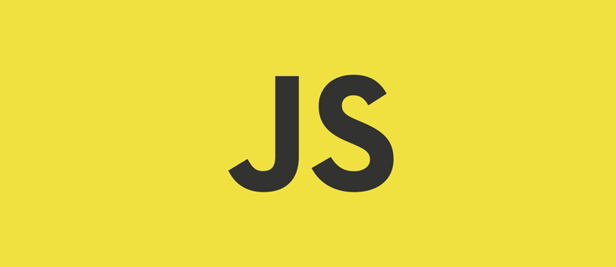

> 第十三章：事件

<!--more-->

JavaScript与HTML之间的交互是通过事件实现的，就是文档或浏览器窗口中发生的一些特定的交互瞬间。可以使用侦听器（或处理程序）来预定事件，以便事件发生时执行相应的代码。这种在传统软件工程中被称为观察员模式的模型，支持页面的行为与页面的外观之间的松散耦合。

## 事件流

事件流描述的是从页面中接收事件的顺序。IE事件流是事件冒泡流，而Netscape Communicator的事件流是事件捕获流。

### 事件冒泡

IE的事件流叫做事件冒泡，即事件开始时由最具体的元素接收，然后逐级向上传播到较为不具体的节点（文档）。

```html
<!DOCTYPE html>
<html lang="en">
<head>
    <meta charset="UTF-8">
    <title>Title</title>
</head>
<body>
    <div id="myDiv">Click me</div>
</body>
</html>
```

点击了页面中的`<div>`元素，那么这个`click`事件会按照如下顺序传播：

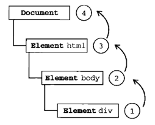

所有浏览器都支持事件冒泡，但在具体实现上还有一些差别。IE9、Firefox、Chrome和Safari则将事件一直冒泡到`window`对象。

### 事件捕获

事件捕获的思想是不太具体的节点应该更早接收到事件，而最具体的节点应该最后接收到事件。事件捕获的用意在于在事件到达预定目标之前捕获它。

点击了上面例子中的`<div>`元素，那么这个`click`事件会按照如下顺序传播：

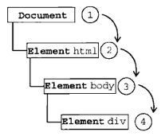

IE9、Safari、Chrome、Opera和Firefox也都支持这种事件流模型。尽管DOM2级事件规范要求事件应该从`document`对象开始传播，但这些浏览器都是从`window`对象开始捕获事件的。

建议放心地使用事件冒泡，在有特殊需要的时候再使用事件捕获。

### DOM事件流

DOM2级事件规定的事件流包括三个阶段：事件捕获阶段、处于目标阶段和事件冒泡阶段。

首先发生的是事件捕获，为截获事件提供了机会。然后是实际的目标接收到事件。最后一个阶段是冒泡阶段，可以在这个阶段对事件做出响应。

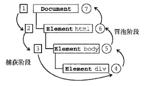

在DOM事件流中，实际的目标在捕获阶段不会接收到事件。这意味着在捕获阶段，事件从`document`到`<html>`再到`<body>`后就停止了。下一个阶段是处于目标阶段，于是事件再`<div>`上发生，**并在事件处理中被看成冒泡阶段的一部分**。然后，冒泡阶段发生，事件又传播回文档。

多数支持DOM事件流的浏览器都实现了一种特定的行为，即使DOM2级事件规范明确要求捕获阶段不会涉及事件目标，但IE9、Safari、Chrome、Firefox和Opera9.5及更高版本都会在捕获阶段触发事件对象上的事件。结果，就是有两个机会在目标对象上面操作事件。

## 事件处理程序

事件就是用户或浏览器自身执行的某种动作。如`click`、`load`和`mouseover`都是事件的名字。而响应某个事件的函数就叫事件处理程序（或事件侦听器）。事件处理程序的名字以`on`开头，因此`click`事件的事件处理程序就是`onclick`。

### HTML事件处理程序

某个元素支持的每种事件，都可以使用一个与相应事件处理程序同名的HTML特性来指定。这个特性的值应该是能够执行的JavaScript代码。

```html
<input type="button" value="Click Me" onclick="alert('Clicked')">
```

```html
<input type="button" value="Click Me" onclick="showMessage()">
<script>
    function showMessage() {
        alert('hello');
    }
</script>
```

在HTML中定义的事件处理程序可以包含要执行的具体动作，也可以调用在页面其他地方定义的脚本。

包含具体动作时，是以JavaScript代码作为`onclick`的值来定义的。由于值是JavaScript，因此不能在其中使用未经转义的HTML语法字符，例如`&`、`""`、`<`、`>`。

事件处理程序中的代码在执行时，有权访问全局作用域中的任何代码。

这样指定事件处理程序具有一些独到之处。首先，这样会创建一个封装着元素属性值的函数。这个函数中有一个局部变量`event`，也就是事件对象：

```html
<input type="button" value="Click Me" onclick="alert(event.type)">
```

通过`event`变量，可以直接访问事件对象，你不用自己定义它，也不用从函数的列表中读取。在这个函数内部，`this`值等于事件的目标元素：

```html
<input type="button" value="Click Me" onclick="alert(this.value)">
```

关于这个动态创建的函数，另一个有意思的地方是它扩展作用域的方式。在这个函数内部，可以像访问局部变量一样访问`document`及该元素本身的成员。这个函数使用`with`像下面这样扩展作用域：

```javascript
function(){
    with(document){
        with(this){
            //元素属性值
        }
    }
}
```

这样，事件处理程序要访问自己的属性就简单多了，下面这行代码与前面的例子效果相同：

```html
<input type="button" value="Click Me" onclick="alert(value)">
```

如果当前元素是一个表单输入元素，则作用域中还会包含访问表单元素（父元素）的入口，这个函数就变成了如下所示：

```javascript
function(){
    with(document){
        with(this.form){
            with(this){
                // 元素属性值
            }
        }
    }
}
```

实际上，这样扩展作用域的方式，无非就是想让事件处理程序无需引用表单元素就能访问其他表单字段：

```html
<form method="post">
    <input type="text" name="username" value="">
    <input type="button" value="Echo Username" onclick="alert(username.value)">
</form>
```

不过，在HTML中指定事件处理程序有两个缺点。首先，存在一个时差问题，因为用户可能会在HTML元素一出现在页面上就触发相应的时间，但当时的事件处理程序可能尚不具备执行条件。假设上面的`showMessage()`函数是在按钮下方、页面最底部定义的。如果用户在页面解析`showMessage()`函数之前就单击了按钮，就会引发错误。为此，很多HTML事件处理程序都会被封装在一个`try-catch`块中，以便错误不会浮出水面：

```html
<input type="button" value="Click Me" onclick="try{showMessage();}catch (ex){}">
```

另一个缺点是，这样扩展事件处理程序的作用域链在不同浏览器中会导致不同的结果。不同JavaScript引擎遵循的标识符解析规则略有差异，很可能会在访问非限定对象成员时出错。

通过HTML指定事件处理程序的最后一个缺点是HTML与JavaScript代码紧密耦合。

### DOM0级事件处理程序

通过JavaScript指定事件处理程序的传统方式，就是将一个函数赋值给一个事件处理程序属性。这种方式比较简单，而且具有跨浏览器的优势。要使用JavaScript指定事件处理程序，首先必须取得一个要操作的对象的引用。

每个元素（包括`window`和`document`）都有自己的事件处理程序属性，这些属性通常全部小写。将这种属性的值设置为一个函数，就可以指定事件处理程序：

```javascript
var btn = document.getElementById('mtBtn');
btn.onclick = function () {
  alert('clicked');
}
```

要注意的是，在这些代码运行前不会指定事件处理程序，因此如果这些代码在页面中位于按钮后面，就有可能在一段时间内怎么单击都没有反应。

使用DOM0级方法指定的事件处理程序被认为是元素的方法。因此，这时候的事件处理程序时在元素的作用域中运行；也就是，程序中的`this`引用当前元素：

```javascript
var btn = document.getElementById('mtBtn');
btn.onclick = function () {
    alert(this.id);
};
```

实际上可以在事件处理程序中通过`this`访问元素的任何属性和方法。以这种方式添加的事件处理程序会在事件流的冒泡阶段被处理。

也可以删除通过DOM0级方法指定的事件处理程序，只要像下面这样将事件处理程序属性的值设置为`null`即可：

```javascript
btn.onclick = null;
```

将事件处理程序设置为`null`后，再单击按钮将不会有任何动作发生。

### DOM2级事件处理程序

DOM2级事件定义了两个方法，用于处理指定和删除事件处理程序的操作：`addEventListener()`和`removeEventListener()`。所有DOM节点中都包含这两个方法，并且它们都接受3个参数：要处理的事件名、作为事件处理程序的函数和一个布尔值。最后这个布尔值参数如果是`true`，表示在捕获阶段调用事件处理程序；如果是`false`，表示在冒泡阶段调用事件处理程序。

```javascript
btn.addEventListener('click', function () {
  alert(this.id);
},false);
```

与DOM0级方法一样，这里添加的事件处理程序也是在其依附的元素的作用域中运行。使用DOM2级方法添加事件处理程序的主要好处是可以添加多个事件处理程序：

```javascript
btn.addEventListener('click', function () {
  alert(this.id);
},false);

btn.addEventListener('click',function () {
  alert('hello');
},false);
```

这里为按钮添加了两个事件处理程序。这两个事件处理程序会按照添加它们的顺序触发。

通过`addEventListener()`添加的事件处理程序只能使用`removeEventListener()`来移除，移除时传入的参数与添加处理程序时使用的参数相同。这也意味着通过`addEventListener()`添加的匿名函数将无法移除：

```javascript
btn.removeEventListener('click',function () {	//没有用
  alert(this.id);
},false);

-------分割线-------

var handle = function () {
  alert(this.id);
};

btn.addEventListener('click', handle, false);
btn.removeEventListener('click', handle, false);	//有效
```

大多数情况下，都是将事件处理程序添加到事件流的冒泡阶段，这样可以最大限度地兼容各种浏览器。最好只在需要在事件到达目标之前截获它的时候将事件处理程序添加到捕获阶段。如果不是特别需要，不建议在事件捕获阶段注册事件处理程序。

### IE事件处理程序

IE实现了与DOM中类似的两个方法：`attachEvent()`和`detachEvent()`。这两个方法接受相同的两个参数：事件处理程序名与事件处理程序函数。由于IE8及更早版本只支持事件冒泡，所以通过`attachEvent()`添加的事件处理程序都会被添加到冒泡阶段。

```javascript
btn.attachEvent('onclick', function () {
  alert('clicked');
});
```

在IE中使用`attachEvent()`与使用DOM0级方法的主要区别在于事件处理程序的作用域。在使用DOM0级方法的情况下，事件处理程序会在其所属元素的作用域内运行；在使用`attachEvent()`方法的情况下，事件处理程序会在全局作用域中运行，**因此`this`等于`window`**。

```javascript
btn.attachEvent('onclick', function () {
  alert(this === window);
});
```

`attachEvent()`方法也可以用来为一个元素添加多个事件处理程序：

```javascript
btn.attachEvent('onclick', function () {
  alert(this === window);
});

btn.attachEvent('onclick', function () {
  alert('hello');
});
```

不过，与DOM方法不同的是，这些事件处理程序不是以添加它们的顺序执行，而是以相反的顺序被触发。

使用`attachEvent()`添加的事件可以通过`detachEvent()`来移除，条件是必须提供相同的参数。与DOM方法一样，这也意味着添加的匿名函数将不能被移除。不过，只要能够将对相同函数的引用传给`detachEvent()`，就可以移除相应的事件处理程序。

### 跨浏览器的事件处理程序

要保证处理事件的代码能在大多数浏览器下一致地运行，只需要关注冒泡阶段。

第一个要创建的方法是`addHandler()`，它的职责是视情况分别使用DOM0级方法、DOM2级方法或IE方法来添加事件。`addHandler()`方法接受3个参数：要操作的元素、事件名称和事件处理程序函数。

与`addHandler()`对应的方法是`removeHandler()`，它也接受相同的参数。这个方法的职责是移除之前添加的事件处理程序—无论该事件处理程序是采取什么方式添加到元素中的，如果其他方法无效，默认采用DOM0级方法。

```javascript
var EventUtil = {
  addHandler: function (element, type, handler) {
    if (element.addEventListener){
      element.addEventListener(type, handler, false);
    }else if (element.attachEvent){
      element.attachEvent('on'+type, handler);
    }else {
      element['on' + type] = handler;
    }
  },
  removeHandler: function (element, type, handler) {
    if (element.removeEventListener){
      element.removeEventListener(type, handler, false);
    }else if (element.detachEvent){
      element.detachEvent('on' + type, handler);
    }else {
      element['on' + type] = null;
    }
  }
};

var handler = function () {
  alert('clicked');
};
EventUtil.addHandler(btn, 'click', handler);
EventUtil.removeHandler(btn, 'click', handler);
```

## 事件对象

在触发DOM上的某个事件时，会产生一个事件对象`event`，这个对象中包含着所有与事件有关的信息。包括导致事件的元素、事件的类型以及其他与特定事件相关的信息。

### DOM中的事件对象

兼容DOM的浏览器会将一个`event`对象传入到事件处理程序中。无论指定事件处理程序时使用什么方法（DOM0级或DOM2级），都会传入`event`对象：

```javascript
btn.onclick = function (event) {
  alert(event.type);	//click
};

btn.addEventListener('click', function (event) {
  alert(event.type);    //click
}, false);
```

在通过HTML特性指定事件处理程序时，变量`event`中保存着`event`对象：

```html
<input type="button" value="Click Me" onclick="alert(event.type)">
```

以这种方式提供`event`对象，可以让HTML特性事件处理程序与JavaScript函数执行相同的操作。

`event`对象包含与创建它的特定事件有关的属性和方法。触发的事件类型不一样，可用的属性和方法也不一样。不过，所有事件都会有下列成员：

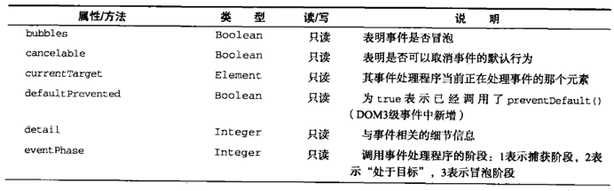

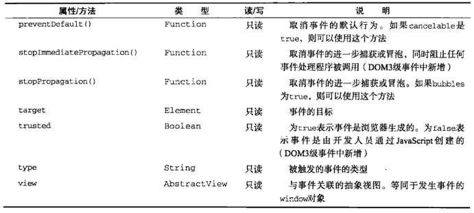

在事件处理程序内部，对象`this`始终等于`currentTarget`的值，而`target`则只包含事件的实际目标。如果直接将事件处理程序指定给了目标元素，则`this`、`currentTarget`和`target`包含相同的值：

```javascript
btn.onclick = function (event) {
  alert(event.currentTarget === this);	//true
  alert(event.target === this);			//true
};
```

由于`click`事件的目标是按钮，因此`this`、`currentTarget`和`target`这三个值是相等的。如果事件处理程序存在于按钮的父节点中，那么这些值是不相同的：

```javascript
document.body.onclick = function (event) {
  alert(event.currentTarget === document.body);		//true
  alert(this === document.body);					//true
  alert(event.target === document.getElementById('myBtn'));	//true
};
```

当单击上面例子中的按钮时，`this`和`currentTarget`都等于`document.body`，因为事件处理程序是注册到这个元素上的。然而，`target`元素却等于按钮元素，因为它是`click`事件真正的目标。由于按钮上并没有注册事件处理程序，结果`click`事件就冒泡到了`document.body`，在那里事件才得到了处理。

在需要通过一个函数处理多个事件时，可以使用`type`属性：

```javascript
var handler = function (event) {
  switch (event.type){
    case 'click':
      alert('clicked');
      break;

    case 'mouseover':
      event.target.style.backgroundColor = 'red';
      break;

    case 'mouseout':
      event.target.style.backgroundColor = ' ';
      break;
  }
};

btn.onclick = handler;
btn.onmousemove = handler;
btn.onmouseout = handler;
```

这里通过检测`event.type`属性，让函数能够确定发生了什么事件，并执行相应的操作。

要阻止特定事件的默认行为，可以使用`preventDefault()`方法。例如，链接的默认行为就是在被单击时会被导航到其`href`特性指定的URL。如果想阻止链接导航这一默认行为，可以通过链接的`onclick`事件处理程序取消它：

```javascript
var link = document.getElementById('myLink');
link.onclick = function (event) {
  event.preventDefault();
};
```

只有`cancelable`属性设置为`true`的事件，才可以使用`preventDefault()`来取消其默认行为。

`stopPropagation()`方法用于立即停止事件在DOM层次中的传播，即取消进一步的事件捕获或冒泡。

```javascript
btn.onclick = function (event) {
  alert('clicked');
  event.stopPropagation();
};

document.body.onclick = function (event) {
  alert('body clicked');
};
```

上面例子如果不调用`stopPropagation()`，就会在单击按钮时出现两个警告框。可是，由于`click`事件根本不会传播到`document.body`，因此就不会触发注册在这个元素上的`onclick`事件处理程序。

事件对象的`eventPhase`属性可以用来确定事件当前正位于事件流的哪个阶段。如果是在捕获阶段调用的事件处理程序，那么`eventPhase`等于1；如果事件处理程序处于目标对象上，则`eventPhase`等于2；如果是在冒泡阶段调用的事件处理程序，`eventPhase`等于3。要注意的是，尽管`处于目标`发生在冒泡阶段，但`eventPhase`仍然一直等于2。

```javascript
btn.onclick = function (event) {
  alert(event.eventPhase);    //2
};
document.body.addEventListener('click', function (event) {
  alert(event.eventPhase);    //1
},true);
document.body.onclick = function (event) {
  alert(event.eventPhase);    //3
};
```

只有在事件处理程序执行期间，`event`对象才会存在，一旦事件处理程序执行完成，`event`对象就会被销毁。

### IE中的事件对象

与访问DOM中的`event`对象不同，要访问IE中的`event`对象有几种不同的方式，取决于指定事件处理程序的方法。在使用DOM0级方法添加事件处理程序时，`event`对象作为`window`对象的一个属性存在：

```javascript
btn.onclick = function () {
  var event = window.event;
  alert(event.type);		//'click'
}
```

如果事件处理程序是使用`attachEvent()`添加的，那么就会有一个`event`对象作为参数被传入事件处理程序函数中：

```javascript
btn.attachEvent('onclick', function (event) {
  alert(event.type);		//'click'
});
```

如果是通过HTML特性指定的事件处理程序，那么还可以通过一个名叫`event`的变量来访问`event`对象（与DOM中的事件模型相同）。

IE的`event`对象也同样包含与创建它的事件相关的属性和方法。所有事件对象都包含下列属性和方法：

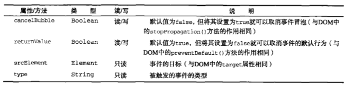

因为事件处理程序的作用域是根据指定它的方式来确定，所以不能认为`this`会始终等于事件目标。最好使用`event.srcElement`：

```javascript
btn.onclick = function () {
  alert(window.event.srcElement === this);		//true
};

btn.attachEvent('onclick', function (event) {
  alert(event.srcElement === this);				//false(在使用attachEvent()方法的情况下，事件处理程序会在全局作用域中运行，因此this等于window)
});
```

`returnValue`属性相当于DOM中的`preventDefault()`方法，它们的作用都是取消给定事件的默认行为。只要将`returnValue`设置为`false`，就可以阻止默认行为：

```javascript
link.onclick = function () {
  window.event.returnValue = false;
};
```

`cancelBubble`属性与DOM中的`stopPropagation()`方法作用相同，都是用来停止事件冒泡的。由于IE不支持事件捕获，因此只能取消事件冒泡；但`stopPropagation()`可以同时取消事件捕获和冒泡：

```javascript
btn.onclick = function () {
  alert('clicked');
  window.event.cancelBubble = true;
};

document.body.onclick = function () {
  alert('body clicked');
};
```

### 跨浏览器的事件对象

```javascript
var EventUtil = {
  addHandler: function (element, type, handler) {
    if (element.addEventListener){
      element.addEventListener(type, handler, false);
    }else if (element.attachEvent){
      element.attachEvent('on'+type, handler);
    }else {
      element['on' + type] = handler;
    }
  },

  removeHandler: function (element, type, handler) {
    if (element.removeEventListener){
      element.removeEventListener(type, handler, false);
    }else if (element.detachEvent){
      element.detachEvent('on' + type, handler);
    }else {
      element['on' + type] = null;
    }
  },

  getEvent: function (event) {
    return event?event : window.event;
  },

  getTarget: function (event) {
    return event.target || event.srcElement;
  },

  preventDefault: function (event) {
    if (event.preventDefault){
      event.preventDefault();
    }else {
      event.returnValue = false;
    }
  },

  stopPropagation: function (event) {
    if (event.stopPropagation){
      event.stopPropagation();
    }else {
      event.cancelBubble = true;
    }
  }
};

btn.onclick = function (event) {
  event = EventUtil.getEvent(event);
  var target = EventUtil.getTarget(event);
  EventUtil.stopPropagation(event);
};

link.onclick = function (event) {
  event = EventUtil.getEvent(event);
  EventUtil.preventDefault(event);
};

document.body.onclick = function (event) {
  alert('body clicked'); 
};
```

## 事件类型

DOM3级事件规定了下列几类事件：

* UI（User Interface，用户界面）事件，当用户与页面上的元素交互时触发
* 焦点事件，当元素获得或失去焦点时触发
* 鼠标事件，当用户通过鼠标在页面上执行操作时触发
* 滚轮事件，当使用鼠标滚轮时触发
* 文本事件，当在文档中输入文本时触发
* 键盘事件，当用户通过键盘在页面上执行操作时触发
* 合成事件，当为IME（Input Method Editor，输入法编辑器）输入字符时触发
* 变动事件，当底层DOM结构发生变化时触发
* 变动名称事件，当元素或属性名变动时触发。此类事件已经被废弃，没有任何浏览器实现它们

除了这几类事件之外，HTML5页定义了一组事件，而有些浏览器还会在DOM和BOM中实现其他专有事件。这些专有事件一般都是根据开发人员需求定制的，没有什么规范，因此不同浏览器的实现可能不一致。

DOM3级事件模块在DOM2级事件模块基础上重新定义了这些事件，也添加了一些新事件。包括IE9在内的所有主流浏览器都支持DOM2级事件。IE9也支持DOM3级事件。

### UI事件

UI事件事件指的是那些不一定与用户操作有关的事件。这些事件在DOM规范出现之前，都是以这种或那种形式存在的，而在DOM规范中保留是为了向后兼容。现有的UI事件如下：

* `DOMActive`：表示元素已经被用户操作激活。这个事件再DOM3级事件中被废弃。
* `load`：当页面完全加载后在`window`上面触发，当所有框架都加载完毕时在框架上面触发，当图像加载完毕时在``元素上面触发，或者当嵌入的内容加载完毕时在`<object>`元素上面触发。
* `unload`：当页面完全卸载后在`window`上面触发，当所有框架都卸载后在框架集上面触发，或者当嵌入的内容卸载完毕后在`<object>`元素上面触发。
* `abort`：在用户停止下载过程时，如果嵌入的内容没有加载完，则在`<object>`元素上面触发。
* `error`：当发生JavaScript错误时在`window`上面触发，当无法加载图像时在``元素上面触发，当无法加载嵌入内容时在`<object>`元素上面触发，或者当有一或多个框架无法加载时在框架集上面触发。
* `select`：当用户选择文本框中一或多个字符时触发。
* `resize`：当窗口或框架的大小变化时在`window`或框架上面触发。
* `scroll`：当用户滚动带滚动条的元素中的内容，在该元素上面触发。`<body>`元素中包含所加载页面的滚动条。

多数这些事件都与`window`对象或表单控件相关。

除了`DOMActive`之外，其他事件在DOM2级事件中都归为HTML事件。

#### load事件

JavaScript中最常用的一个事件就是`load`。当页面完全加载后，就会触发`window`上面的`load`事件。有两种定义`onload`事件处理程序的方式。第一种方式是使用如下所示的JavaScript代码：

```javascript
EventUtil.addHandler(window, 'load', function (event) {
  alert('loaded');
});
```

这里也给事件处理程序传入了一个`event`对象。这个`event`对象不包含有关这个事件的任何附加信息，但在兼容DOM的浏览器中，`event.target`属性的值会被设置为`document`，而IE并不会为这个事件设置`srcElement`属性。

第二种方式是为`<body>`元素添加一个`onload`特性：

```html
<!DOCTYPE html>
<html lang="en">
<head>
    <meta charset="UTF-8">
    <title>Title</title>
</head>
<body onload="alert('loaded')">

</body>
</html>
```

一般来说，在`window`上面发生的任何事件都可以在`<body>`元素中通过相应的特性来指定，因为在HTML中无法访问`window`元素。但这只是为了保证向后兼容的权宜之计。建议尽可能使用JavaScript方式。

图像上面也可以触发`load`事件，无论是在DOM中的图像元素还是HTML中的图像元素。可以在HTML中为任何图像指定`onload`事件处理程序：

```html

```

用JavaScript来实现：

```javascript
var image = document.getElementById('myImage');
EventUtil.addHandler(image, 'load', function (event) {
  event = EventUtil.getEvent(event);
  alert(EventUtil.getTarget(event).src);
});
```

在创建新的``元素时，可以为其指定一个事件处理程序，以便图像加载完毕后给出提示。此时，最重要的是要在指定`src`属性之前先指定事件：

```javascript
EventUtil.addHandler(window, 'load', function () {
  var image = document.getElementById('img');
  EventUtil.addHandler(image, 'load', function (event) {
    event = EventUtil.getEvent(event);
    alert(EventUtil.getTarget(event).src);
  });
  document.body.appendChild(image);
  image.src = 'smile.gif';
});
```

在上面例子中，首先为`window`指定了`onload`事件处理程序。原因是想向DOM中添加一个新元素，所以必须确定页面已经加载完毕，如果在页面加载前操作`document.body`会导致错误。

新图像元素不一定要从添加到文档后才开始下载，只要设置了`src`属性就会开始下载。

同样的功能也可以通过使用DOM0级的`Image`对象实现，在DOM出现之前，开发人员经常使用`Image`对象在客户端预先加载图像。可以像使用``元素一样使用`Image`对象，只不过无法将其添加到DOM树中：

```javascript
EventUtil.addHandler(window, 'load', function () {
  var image = new Image();
  EventUtil.addHandler(image, 'load', function (event) {
    alert('Image loaded');
  });
  image.src = 'smile.gif';
});
```

还有一些元素也以非标准的方式支持`load`事件。在IE9+、Firefox、Opera、Chrome和Safari3+中，`<script>`元素也会被触发`load`事件，以便开发人员确定动态加载的JavaScript文件是否加载完毕。与图像不同，只有在设置了`<script>`元素的`src`属性并将该元素添加到文档后，才会开始下载JavaScript文件。对`<script>`元素而言，指定`src`属性和指定事件处理程序的先后顺序就不重要了：

```javascript
EventUtil.addHandler(window, 'load', function () {
  var script = document.createElement('script');
  EventUtil.addHandler(script, 'load', function (event) {
    alert('loaded');
  });
  script.src = 'example.js';
  document.body.appendChild(script);
});
```

#### unload事件

`unload`事件再文档被完全卸载后触发。只要用户从一个页面切换到另一个页面，就会发生`unload`事件。而利用这个事件最多的情况是清除引用，以免内存泄露。与`load`事件类似，也有两种指定`onunload`事件处理程序的方式。第一种方式是使用JavaScript：

```javascript
EventUtil.addHandler(window, 'unload', function (event) {
  alert('unloaded');
});
```

此时生成的`event`对象在兼容DOM的浏览器中只包含`target`属性（值为`document`）。

第二种方式是为`<body>`元素添加一个特写：

```html
<!DOCTYPE html>
<html lang="en">
<head>
    <meta charset="UTF-8">
    <title>Title</title>
</head>
<body onunload="alert('Unloaded！')">
</body>
</html>
```

`unload`事件是在一切都被卸载之后才触发，那么在页面加载后存在的那些对象，就不一定存在了，此时操作DOM节点或元素的样式就会导致错误。

#### resize事件

当浏览器窗口被调整到一个新的高度或宽度时，就会触发`resize`事件。这个事件在`window`上触发，因此可以通过JavaScript或者`<body>`元素中的`onresize`特性来指定事件处理程序：

```javascript
EventUtil.addHandler(window, 'resize', function (event) {
  alert('Resized');
});
```

与其他发生在`window`上的事件类似，在兼容DOM的浏览器中，传入事件处理程序中的`event`对象有一个`target`属性，值为`document`。

关于何时会触发`resize`事件，不同浏览器有不同的机制。IE、Safari、Chrome和Opera会在浏览器窗口变化了1像素时就触发`resize`事件，然后随着变化不断重复触发。Firefox则只会在用户停止调整窗口大小时才会触发`resize`事件。由于存在这个差别，应该注意不要在这个事件的处理程序中加入大计算量的代码，因为这些代码可能被频繁执行，从而导致浏览器反应明显变慢。

#### scroll事件

虽然`scroll`事件是在`window`对象上发生的，但它实际表示的则是页面中相应元素的变化。在混杂模式下，可以通过`<body>`元素的`scrollLeft`和`scrollTop`来监控到这一变化；而在标准模式下，除Safari之外的所有浏览器都会通过`<html>`元素来反映这一变化：

```javascript
EventUtil.addHandler(window, 'scroll', function (event) {
  if (document.compatMode == 'CSS1Compat'){
    alert(document.documentElement.scrollTop);
  }else {
    alert(document.body.scrollTop);
  }
});EventUtil.addHandler(window, 'resize', function (event) {
  alert('Resized');
});
```

与`resize`事件类似，`scroll`事件也会在文档被滚动期间重复被触发，所以有必要尽量保持事件处理程序的代码简单。

<p id="div-border-left-yellow">`scroll`事件只要页面滚动就触发，包括鼠标滚动引起的、键盘方向键引起的滚动以及拖动滚动条引起的</p>

### 焦点事件

焦点事件会在页面获得或失去焦点时触发。利用这些事件并与`document.hasFocus()`方法及`document.activeElement`属性配合，可以知晓用户在页面上的行踪。有以下6个焦点事件：

* `blur`：在元素失去焦点时触发。这个事件不会冒泡；所有浏览器都支持它。
* `DOMFocusIn`：在元素获得焦点时触发。这个事件与HTML事件`focus`等价，但它冒泡。只有Opera支持这个事件。DOM3级事件废弃了`DOMFocusIn`，选择了`focusin`。
* `DOMFocusOut`：在元素失去焦点时触发。这个事件是HTML事件`blur`的通用版本。只有Opera支持这个事件。DOM3级事件废弃了`DOMFocusOut`，选择了`focusout`。
* `focus`：在元素获得焦点时触发。这个事件不会冒泡；所有浏览器都支持它。
* `focusin`：在元素获得焦点时触发。这个事件与HTML事件`focus`等价，但它冒泡。支持这个事件的浏览器有IE5.5+、Safari5.1+、Opera11.5+和Chrome。
* `focusout`：在元素失去焦点时触发。这个事件是HTML事件`blur`的通用版本。支持这个事件的浏览器有IE5.5+、Safari5.1+、Opera11.5+和Chrome。

这一类事件中最主要的两个是`focus`和`blur`，它们都是JavaScript早期就得到所有浏览器支持的事件。这些事件的最大问题是它们不冒泡。

当焦点从页面中的一个元素移动到另一个元素，会依次触发下列事件：

1. `focusout`：在失去焦点的元素上触发
2. `focusin`：在获得焦点的元素上触发
3. `blur`：在失去焦点的元素上触发
4. `DOMFocusOut`：在失去焦点的元素上触发
5. `focus`：在获得焦点的元素上触发
6. `DOMFocusIn`：在获得焦点的元素上触发

其中，`blur`、`DOMFocusOut`和`focusout`的事件目标是失去焦点的元素；而`focus`、`DOMFocusIn`和`focusin`的事件目标是获得焦点的元素。

### 鼠标与滚轮事件

DOM3级事件中定义了9个鼠标事件：

* `click`：在用户单击主鼠标按钮（一般是左键）或者按下回车键时触发。这一点对确保易访问性很重要，意味着`onclick`事件处理程序既可以通过键盘也可以通过鼠标执行。
* `dblclick`：在用户双击主鼠标按钮（一般是左键）时触发。
* `mousedown`：在用户按下任意鼠标按钮时触发。不能通过键盘触发这个事件。
* `mouseenter`：在鼠标光标从元素外部首次移动到元素范围之内时触发。这个事件不冒泡，而且在光标移动到后代元素上不会触发。
* `mouseleave`：在位于元素上方的鼠标光标移动到元素范围之外时触发。这个事件不冒泡，而且在光标移动到后代元素上不会触发。
* `mousemove`：当鼠标指针在元素内部移动时重复地触发。不能通过键盘触发这个事件。
* `mouseout`：在鼠标指针位于一个元素上方，然后用户将其移入另一个元素时触发。又移入的另一个元素可能位于前一个元素的外部，也可能是这个元素的子元素。不能通过键盘触发这个事件。
* `mouseover`：在鼠标指针位于一个元素外部，然后用户将其首次移入另一个元素边界之内时触发。不能通过键盘触发这个事件。
* `mouseup`：在用户释放鼠标按钮时触发。不能通过键盘触发这个事件。

只有在同一个元素上相继触发`mousedown`和`mouseup`事件，才会触发`click`事件；如果`mousedown`或`mouseup`中的一个被取消，就不会触发`click`事件。类似地，只有触发两次`click`事件，才会触发一次`dblclick`事件。这4个事件触发的顺序始终如下：

1. `mousedown`
2. `mouseup`
3. `click`
4. `mousedown`
5. `mouseup`
6. `click`
7. `dblclcik`

鼠标事件中还有一类滚轮事件。而说是一类事件，其实就是一个`mousewheel`事件。这个事件跟踪鼠标滚轮。

#### 客户区坐标位置

鼠标事件都是在浏览器视口中的特定位置上发生的。这个位置信息保存在事件对象的`clientX`和`clientY`属性中。所有浏览器都支持这个属性，它们的值表示事件发生时鼠标指针在视口中（整个浏览器窗口中）的水平和垂直坐标。

可以使用下面代码获取鼠标事件的客户端坐标信息：

```javascript
var div = document.getElementById('myDiv');
EventUtil.addHandler(div, 'click', function (event) {
  event = EventUtil.getEvent(event);
  alert('client coordinates: ' + event.clientX + ', ' + event.clientY);
});
```

这些值不包括页面滚动的距离，因此这个位置并不表示鼠标在页面上的位置。

#### 页面坐标位置

通过客户区坐标能够知道鼠标是在视口中什么位置发生的，而页面坐标通过事件对象的`pageX`和`pageY`属性，能告诉你事件是在页面中的什么位置发生的。这两个属性表示鼠标光标在页面中的位置，因此坐标是从页面本身而非视口的左边和顶边计算的：

```javascript
EventUtil.addHandler(div, 'click', function (event) {
  event = EventUtil.getEvent(event);
  alert('page coordinates: ' + event.pageX + ', ' + event.pageY);
});
```

在页面没有滚动的情况下，`pageX`和`pageY`的值与`clientX`和`clientY`的值相等。

#### 屏幕坐标位置

鼠标事件发生时，不仅会有相对于浏览器窗口的位置，还有一个相对于整个电脑屏幕的位置。通过`screenX`和`screenY`属性就可以确定鼠标事件发生时鼠标指针相对于整个屏幕的坐标信息：

```javascript
EventUtil.addHandler(div, 'click', function (event) {
  event = EventUtil.getEvent(event);
  alert('screen coordinates: ' + event.screenX + ', ' + event.screenY);
});
```

#### 修改键

虽然鼠标事件主要是使用鼠标来触发的，但在按下鼠标时键盘上的某些键的状态也可以影响到说要采取的操作。这些修改键就是`shift`、`ctrl`、`alt`和`meta`（Windows中是`windows`键，在mac中是`cmd`键），它们经常被用来修改鼠标事件的行为。DOM为此规定了4个属性，表示这些修改键的状态：`shiftKey`、`ctrlKey`、`altKey`和`metaKey`。这些属性中包含的都是布尔值，如果相应的键被按下了，则值为`true`，否则为`false`。当某个鼠标事件发生时，通过检测这几个属性就可以确定用户是否同时按下了其中的键：

```javascript
EventUtil.addHandler(div, 'click', function (event) {
  event = EventUtil.getEvent(event);
  var keys = new Array();

  if (event.shiftKey){
    keys.push('shift');
  }

  if (event.ctrlKey){
    keys.push('ctrl');
  }

  if (event.altKey){
    keys.push('alt');
  }

  if (event.metaKey){
    keys.push('meta');
  }

  alert('keys: ' + keys.join(','));
});
```

#### 相关元素

在发生`mouseover`和`mouseout`事件时，还会涉及更多的元素。这两个事件都会涉及把鼠标指针从一个元素的边界之内移动到另一个元素的边界之内。对`mouseover`事件而言，事件的主目标是获得光标的元素，而相关元素就是那个失去光标的元素。对`mouseout`事件而言，事件的主目标是失去光标的元素，而相关元素则是获得光标的元素：

```html
<!DOCTYPE html>
<html lang="en">
<head>
    <meta charset="UTF-8">
    <title>Title</title>
</head>
<body>
<div id="myDiv" style="background-color: red; height: 100px;width: 100px"></div>
</body>
</html>
```

上面例子中，如果鼠标指针一开始位于`<div>`元素上，然后移出了这个元素，那么就会在`<div>`元素上触发`mouseout`事件，相关元素就是`<body>`元素。与此同时，`<body>`元素上面会触发`mouseover`事件，而相关元素就变成了`<div>`。

DOM通过`event`对象的`relatedTarget`属性提供了相关元素的信息。这个属性只对于`mouseover`和`mouseout`事件才包含值；对于其他事件，这个属性的值是`null`。

```javascript
var EventUtil = {
  //其他代码

  getRelatedTarget: function (event) {
    if (event.relatedTarget){
      return event.relatedTarget;
    }else if (event.toElement){
      return event.toElement;
    }else if (event.fromElement){
      return event.fromElement;
    }else {
      return null;
    }
  }
};

EventUtil.addHandler(div, 'mouseout', function (event) {
  event = EventUtil.getEvent(event);
  var target = EventUtil.getTarget(event);
  var relatedTarget = EventUtil.getRelatedTarget(event);
  alert('moused out of ' + target.tagName + ' to ' + relatedTarget.tagName);
});
```

#### 鼠标按钮

只要在主鼠标按钮被单击（或键盘回车键被按下）时才会触发`click`事件，因此检测按钮的信息并不是必要的。但对于`mousedown`和`mouseup`事件来说，则在其`event`对象存在一个`button`属性，表示按下或释放的按钮。DOM的`button`属性可能有如下3个值：0表示主鼠标按钮，1表示中间鼠标按钮，2表示次鼠标按钮。在常规设置中，主鼠标按钮是左键，次鼠标按钮是右键。

#### 更多的事件信息

DOM2级事件规范在`event`对象中还提供了`detail`属性，用于给出有关事件的更多信息。对于鼠标事件来说，`detail`中包含了一个数值，表示在给定位置上发生了多少次单击。在同一个像素上相继地发生一次`mousedown`和一次`mouseup`事件算作一次单击。`detail`属性从1开始计数，每次单击后都会递增。如果鼠标在`mousedown`和`mouseup`之间移动了位置，则`detail`会被重置为0.

IE也通过下列属性为鼠标事件提供了更多信息：

* `altLeft`：布尔值，表示是否按下了`Alt`键。如果`altLeft`值为`true`，`altKey`的值也为`true`。
* `ctrlLeft`：布尔值，表示是否按下了`Ctrl`键。如果`ctrlLeft`的值为`true`，则`ctrlKey`的值为`true`。
* `offsetX`：光标相对于目标元素边界的X坐标。
* `offsetY`：光标相对于目标元素边界的Y坐标。
* `shiftLeft`：布尔值，表示是否按下了`Shift`。如果`shiftLeft`的值为`true`，则`shiftKey`的值为`true`。

这个属性的用处并不大。

#### 鼠标滚轮事件

当用户通过鼠标滚轮与页面交互、在垂直方向上滚动页面时，就会触发`mousewheel`事件。这个事件可以在任何元素上面触发，最终会冒泡到`document`或`window`对象。与`mousewheel`事件对应的`event`对象除包含鼠标事件的所有标准信息外，还包含一个特殊的`wheelDelta`属性。当用户向前滚动鼠标滚轮时，`wheelDelta`是120的倍数；当用户向后滚动鼠标滚轮时，`wheelDelta`是-120的倍数。

将`mousewheel`事件处理程序指定给页面中的任何元素或`document`对象，既可处理鼠标滚轮的交互操作：

```javascript
EventUtil.addHandler(document, 'mousewheel', function (event) {
  event = EventUtil.getEvent(event);
  alert(event.wheelDelta);
});
```

Firefox支持一个名为`DOMMouseScroll`的类似事件，也是在鼠标滚轮滚动时触发。与`mousewheel`事件一样，`DOMMouseScroll`也被视为鼠标事件，因而包含与鼠标事件有关的所有属性。而有关鼠标滚轮的信息则保存在`detail`属性中，当向前滚动鼠标滚轮时，这个属性的值-3的倍数，当向后滚动鼠标滚轮时，这个属性的值是3的倍数。

可以将`DOMMouseScroll`事件添加到页面中的任何元素，而且该事件会冒泡到`window`对象。

下面给出了跨浏览器下的解决方案：

```javascript
var EventUtil = {
  //其他代码
  
  getWheelDelta: function (event) {
    if (event.wheelDelta){
      return (client.engine.opera && client.engine.opera < 9.5? -event.wheelDelta : event.wheelDelta);
    }else {
      return -event.detail * 40;
    }
  }
};
```

```javascript
(function () {
  function handleMouseWheel(event) {
    event = EventUtil.getEvent(event);
    var delta = EventUtil.getWheelDelta(event);
    alert(delta);
  }

  EventUtil.addHandler(document, 'mousewheel', handleMouseWheel);
  EventUtil.addHandler(document, 'DOMMouseScroll', handleMouseWheel);
})();
```

#### 触摸设备

在面向iPhone和iPod中的Safari开发时，要注意以下几点：

* 不支持`dblclick`事件。双击浏览器窗口会放大画面，而且没有办法改变该行为
* 轻击可单击元素会触发`mousemove`事件。如果此操作会导致内容变化，将不再有其他事件发生；如果屏幕没有因此变化，那么会依次发生`mousedown`、`mouseup`和`click`事件。轻击不可单击的元素不会触发任何事件。可单击的元素是指那些单击可产生默认操作的元素，或者那些已经被指定了`onclick`事件处理程序的元素
* `mousemove`事件也会触发`mouseover`和`mouseout`事件
* 两个手指放在屏幕上且页面随手指移动而滚动时会触发`mousewheel`和`scroll`事件

#### 无障碍性问题

如果你的Web应用程序或网站要确保残疾人特别是那些使用屏幕阅读器的人都能访问，那么在使用鼠标事件时就要格外小心。前面提到过，可以通过键盘的回车键来触发`click`事件，但其他鼠标事件却无法通过键盘来触发，为此，不建议使用`click`之外的其他鼠标事件来展示功能或引发代码执行。

以下是在使用鼠标事件时应该注意的几个易访问性问题：

* 使用`click`事件执行代码。有人指出通过`onmousedown`执行代码会让人觉得速度更快，但是，在屏幕阅读器中，由于无法触发`mousedown`事件，结果就会造成代码无法执行
* 不要使用`onmouseover`向用户显示新的选项。
* 不要使用`dblclick`执行重要操作

### 键盘与文本事件

有3个键盘事件：

* `keydown`：当用户按下键盘上的任意键时触发，而且如果按住不放的话，会重复触发此事件
* `keypress`：当用户按下键盘上的字符键时触发，而且如果按住不放的话，会重复触发此事件。按下`Esc`键也会触发这个事件。
* `keyup`：当用户释放键盘上的键时触发

只有一个文本事件：`textInput`。这个事件是对`keypress`的补充，用意是在将文本显示给用户之前更容易拦截文本。在文本插入文本框之前会触发`textInput`事件。

在用户按下了键盘上的字符键时，首先会触发`keydown`事件，然后紧跟着是`keypress`事件，最后会触发`keyup`事件。其中`keydown`和`keypress`都是在文本框发生变化之前被触发的；而`keyup`则是在文本框已经发生变化之后被触发的。

如果用户按下的是一个非字符键，那么首先会触发`keydown`事件，然后是`keyup`事件。

#### 键码

在发生`keydown`和`keyup`事件时，`event`对象的`keyCode`属性中会包含一个代码，与键盘上一个特定的键对应。对数字字母字符键，`keyCode`属性的值与ASCII码中对应小写字母或数字的编码相同。因此，数字键7的`keyCode`值为55，而字母A键的`keyCode`值为65—与`shift`键的状态无关。DOM和IE的`event`对象都支持`keyCode`属性。

```javascript
var textbox = document.getElementById('myText');
EventUtil.addHandler(textbox, 'keyup', function (event) {
  event = EventUtil.getEvent(event);
  alert(event.keyCode);
});
```

下面列出了所有非字符键的键码：

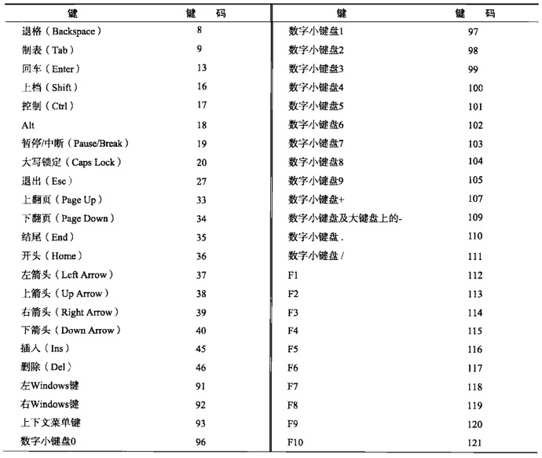

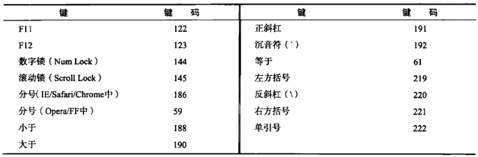

在Firefox和Opera中，按分号键时`keyCode`值为59，也就是ASCII中分号的编码；但IE和Safari返回186，即键盘中按键的键码。

#### 字符编码

发生`keypress`事件意味着按下的键会影响到屏幕中文本的显示。在所有浏览器中，按下能够插入或删除字符的键都会触发`keypress`事件；按下其他键能否触发此事件因浏览器而异。

IE9、Firefox、Chrome和Safari的`event`对象都支持一个`charCode`属性，这个属性只有在发生`keypress`事件时才包含值，而且这个值是按下的那个键所代表字符的ASCII编码。此时的`keyCode`通常等于0或者也可能等于所按键的键码。

```javascript
var EventUtil = {
  //其他代码
  
  getCharCode: function (event) {
    if (typeof event.charCode == 'number'){
      return event.charCode;
    }else {
      return event.keyCode;
    }
  }
};

EventUtil.addHandler(textbox, 'keypress', function (event) {
  event = EventUtil.getEvent(event);
  alert(EventUtil.getCharCode(event));
});
```

在取得字符编码后，就可以使用`String.fromCharCode()`将其转换成实际的字符。

#### DOM3级变化

DOM3级事件中的键盘事件不再包含`charCode`属性，而是包含了两个新属性：`key`和`char`。

其中，`key`属性是为了取代`keyCode`而增加的，它的值是一个字符串。在按下某个字符键时，`key`的值就是相应的文本字符；在按下非字符键时，`key`的值是相应键的名。而`char`属性在按下字符键时的行为与`key`相同，但在按下非字符键时值为`null`。

IE9支持`key`属性，但不支持`char`属性。Safari5和Chrome支持名为`keyIndentifier`的属性，在按下非字符键的情况下与`key`的值相同。对于字符键，`keyIndentifier`返回一个格式类似`U+0000`的字符串，表示Unicode值。

```javascript
EventUtil.addHandler(textbox, 'keypress', function (event) {
  event = EventUtil.getEvent(event);
  var identifier = event.key || event.keyIdentifier;
  if (identifier){
    alert(identifier);
  }
});
```

DOM3级事件还添加了一个名为`location`的属性，这是一个数值，表示按下了什么位置上的键：0表示默认键盘，1表示左侧位置（如左边的Alt键），2表示右侧位置（如右侧的shift键），3表示数字小键盘，4表示移动设备键盘，5表示手柄。IE9支持这个属性。Safari和Chrome支持名为`keyLocation`的等价属性，但既有bug—值始终是0，除非按下了数字键盘，否则，不会是1、2、4、5。

```javascript
EventUtil.addHandler(textbox, 'keypress', function (event) {
  event = EventUtil.getEvent(event);
  var loc = event.location || event.keyLocation;
  if (loc){
    alert(loc);
  }
});
```

最后是给`event`对象添加了`getModifierState()`方法。这个方法接受一个参数，即等于`Shift`、`Control`、`AltGraph`或`Meta`的字符串，表示要检测的修改键。如果指定的修改键是活动的（也就是处于被按下的状态），这个方法返回`true`，否则返回`false`。

```javascript
EventUtil.addHandler(textbox, 'keypress', function (event) {
  event = EventUtil.getEvent(event);
  if (event.getModifierState){
    alert(event.getModifierState('Shift'));
  }
});
```

#### textInput事件

DOM3级事件规范中引入了一个新事件，叫`textInput`。根据规范，当用户在可以编辑区域中输入字符时，就会触发这个事件。这个用于替代`keypress`的`textInput`事件的行为稍有不同。区别之一就是任何可以获得焦点的元素都可以触发`keypress`事件，但只有可编辑区域才能触发`textInput`。区别之二是`textInput`事件只会在用户按下能够输入实际字符的键时才会被触发，而`keypress`事件则在按下那些能够影响文本显示的键时也会触发（如退格键）。

由于`textInput`事件主要考虑的是字符，因此它的`event`对象中包含一个`data`属性，这个属性的值就是用户输入的字符。

```javascript
EventUtil.addHandler(textbox, 'textInput', function (event) {
  event = EventUtil.getEvent(event);
  alert(event.data);
});
```

另外，`event`对象上还有一个`inputMethod`属性，表示把文本输入到文本框中的方式：

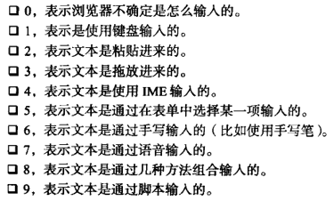

### 复合事件

复合事件是DOM3级事件中新添加的一类事件，用于处理IME的输入序列。IME（Input Method Editor，输入法编辑器）可以让用户输入在物理键盘上找不到的字符。IME通常需要同时按住多个键，但最终只输入一个字符。复合事件就是针对检测和处理这种输入而设计的。有下列三种复合事件：

* `compositionstart`：在IME的文本复合系统打开时触发，表示要开始输入了
* `compositionupdate`：在向输入字段中插入新字符时触发
* `compositionend`：在IME的文本复合系统关闭时触发，表示返回正常键盘输入状态

复合事件与文本事件再很多方面都很相似。在触发复合事件时，目标是接收文本的输入字段。但它比文本事件的事件对象多一个`data`属性，这个属性包含下列值中的一个：

* 如果在`compositionstart`事件发生时访问，包含正在编辑的文本
* 如果在`compositionupdate`事件发生时访问，包含正插入的新字符
* 如果在`compositionend`事件发生时访问，包含此次输入会话中插入的所有字符

### 变动事件

DOM2级的变动（mutation）事件能在DOM中的某一部分发生变化时给出提示。变动事件是为XML或HTML DOM设计的，并不特定于某种语言。DOM2级定义了下列变动事件：

* `DOMSubtreeModified`：在DOM结构中发生任何变化时触发。这个事件在其他任何事件触发后都会触发
* `DOMNodeInserted`：在一个节点作为子节点被插入到另一个节点中时触发
* `DOMNodeRemoved`：在节点从其父节点中被移除时触发
* `DOMNodeInsertedIntoDocument`：在一个节点被直接插入文档或通过子树间接插入文档后触发。这个事件再`DOMNodeInserted`之后触发
* `DOMNodeRemovedFromDocument`在一个节点被直接从文档中移除或通过子树间接从文档中移除之前触发。这个事件在`DOMNodeRemoved`之后触发
* `DOMAttrModified`：在特性被修改之后触发
* `DOMCharacterDataModified`：在文本节点的值发生变化时触发

由于DOM3级事件模块作废了很多变动事件，所以只介绍那些将来仍会得到支持的事件。

#### 删除节点

在使用`removeChild()`或`replaceChild()`从DOM中删除节点时，首先会触发`DOMNodeRemoved`事件。这个事件的目标（`event.target`）是被删除的节点，而`event.relatedNode`属性中包含着对目标节点父节点的引用。在这个事件触发时，节点尚未从其父节点删除，因此其`parentNode`属性仍然指向父节点（与`event.relatedNode`相同）。这个事件会冒泡，因而可以在DOM的任何层次上面处理它。

如果被移除的节点包含子节点，那么在其所有子节点以及这个被移除的节点上会相继触发`DOMNodeRemovedFromDocument`事件。但这个事件不会冒泡，所以只有直接指定给其中一个子节点的事件处理程序才会被调用。这个事件的目标是相应的子节点或者那个被移除的节点，除此之外`event`对象中不包含信息。

`DOMSubtreeModified`事件的目标是被移除节点的父节点；此时的`event`对象也不会提供与事件相关的其他信息。

```html
<!DOCTYPE html>
<html lang="en">
<head>
    <meta charset="UTF-8">
    <title>Title</title>
</head>
<body>
  <ul id="myList">
    <li>Item 1</li>
    <li>Item 2</li>
    <li>Item 3</li>
  </ul>
</body>
</html>
```

在这个例子中，假设要移除`<ul>`元素。此时，就会依次触发以下事件：

1. 在`<ul>`元素上触发`DOMNodeRemoved`事件，`relatedNode`属性等于`document.body`
2. 在`<ul>`元素上触发`DOMNodeRemovedFromDocument`事件
3. 在身为`<ul>`元素子节点的每个`<li>`元素及文本节点上触发`DOMNodeRemovedFromDocument`事件
4. 在`document.body`上触发`DOMSubtreeModified`事件，因为`<ul>`是`document.body`的直接子元素

运行下列代码可以验证上面事件发生的顺序：

```javascript
EventUtil.addHandler(window, 'load', function (event) {
  var list = document.getElementById('myList');

  EventUtil.addHandler(document, 'DOMSubtreeModified', function (event) {
    alert(event.type);
    alert(event.target);
  });

  EventUtil.addHandler(document, 'DOMNodeRemoved', function (event) {
    alert(event.type);
    alert(event.target);
    alert(event.relatedNode);
  });

  EventUtil.addHandler(list.firstChild, 'DOMNodeRemovedFromDocument', function (event) {
    alert(event.type);
    alert(event.target);
  });

  list.parentNode.removeChild(list);
});
```

#### 插入节点

在使用`appendChild()`、`replaceChild()`或`insertBefore()`向DOM中插入节点时，首先会触发`DOMNodeInsert`事件。这个事件的目标是被插入的节点，而`event.relatedNode`属性中包含一个对父节点的引用。在这个事件触发时，节点已经被插入到了新的父节点中。这个事件是冒泡的，因此可以在DOM的各个层次上处理它。

紧接着，会在新插入的节点上面触发`DOMNodeInsertedIntoDocument`事件。这个事件不冒泡，因此必须在插入节点之前为它添加这个事件处理程序。这个事件的目标是被插入的节点，除此之外`event`对象中不包含其他信息。

最后触发的事件是`DOMSubtreeModified`，触发于新插入节点的父节点。

可以通过下面代码验证上述事件的触发顺序：

```javascript
EventUtil.addHandler(window, 'load', function (event) {
  var list = document.getElementById('myList');
  var item = document.createElement('li');
  item.appendChild(document.createTextNode('Item 4'));

  EventUtil.addHandler(document, 'DOMSubtreeModified', function (event) {
    alert(event.type);
    alert(event.target);
  });

  EventUtil.addHandler(document, 'DOMNodeInsert', function (event) {
    alert(event.type);
    alert(event.target);
    alert(event.relatedNode);
  });

  EventUtil.addHandler(list.firstChild, 'DOMNodeInsertedIntoDocument', function (event) {
    alert(event.type);
    alert(event.target);
  });

  list.parentNode.removeChild(item);
});
```

### HTML5事件

#### contextmenu事件

通过单击鼠标右键可以调出上下文菜单。为了实现上下文菜单，开发人员面临的主要问题是如何确定应该显示上下文菜单，以及如何屏蔽与该操作关联的默认上下文菜单。为解决这个问题，就出现了`contextmenu`事件，用以表示何时应该显示上下文菜单，以便开发人员取消默认的上下文菜单而提供自定义的菜单。

```html
<div id="myDiv">Right click or Ctrl+click me to get a custom context menu</div>
<ul id="myMenu" style="position: absolute; visibility: hidden;background-color: silver">
    <li><a href="http://tc9011.com">tc9011</a></li>
    <li><a href="https://baidu.com">baidu</a></li>
    <li><a href="https://www.qq.com">qq</a></li>
</ul>
```

```javascript
EventUtil.addHandler(window, 'load', function (event) {
  var div = document.getElementById('myDiv');

  EventUtil.addHandler(div, 'contextmenu', function (event) {
    event = EventUtil.getEvent(event);
    EventUtil.preventDefault(event);

    var menu = document.getElementById('myMenu');
    //确定放置<ul>的位置
    menu.style.left = event.clientX + 'px';
    menu.style.top = event.clientY + 'px';
    menu.style.visibility = 'visible';
  });
  
  //以便通过单击隐藏菜单
  EventUtil.addHandler(document, 'click', function (event) {
    document.getElementById('myMenu').style.visibility = 'hidden';
  });
});
```

#### beforeunload事件

之所以有发生在`window`对象上的`beforeunload`事件，是为了让开发人员有可能在页面卸载前阻止这一操作。这个事件会在浏览器卸载页面之前触发，可以通过它来取消卸载并继续使用原有页面。但是，不能彻底取消这个事件，因为这就相当于让用户无法离开当前页面了。为此，这个事件的意图是将控制权交给用户。显示的消息会告诉用户页面将被卸载，询问用户是否要真的关闭页面，还是希望继续留下来。

为了显示这个弹出框，必须将`event.returnValue`的值设置为要显示给用户的字符串，同时作为函数的值返回：

```javascript
EventUtil.addHandler(window, 'beforeunload', function (event) {
  event = EventUtil.getEvent(event);
  var message = "I'm really going to miss you if you go.";
  event.returnValue = message;
  return message;
});
```

#### DOMContentLoaded事件

`window`的`load`事件会在页面中的一切都加载完毕时触发，但这个过程可能会因为要加载的外部资源过多而颇费周折。而`DOMContentLoaded`事件则在形成完整的DOM树之后就会触发，不理会图像、JavaScript文件、CSS文件或其他资源是否已经下载完毕。与`load`事件不同，`DOMContentLoaded`支持在页面下载的早期添加事件处理程序，这也意味着用户能够尽早地与页面进行交互。

要处理`DOMContentLoaded`事件，可以为`document`或`window`添加相应的事件处理程序（尽管这个事件会冒泡到`window`，但它的目标实际上是`document`）：

```javascript
EventUtil.addHandler(document, 'DOMContentLoaded', function (event) {
  alert('content loaded');
});
```

`DOMContentLoaded`事件对象不会提供任何额外的信息（其`target`属性是`document`）。

通常这个事件既可以添加事件处理程序，也可以执行其他DOM操作。这个事件始终都会在`load`事件之前触发。

#### readystatechange事件

IE为DOM文档中某些部分提供了`readystatechange`事件。这个事件的目的是提供与文档或元素的加载状态有关的信息，但这个事件的行为有时候也很难预料。支持`readystatechange`事件的每个对象都有一个`readyState`属性，可能包含下列5个值中的一个：

* `uninitialized`（未初始化）：对象存在但尚未初始化
* `loading`（正在加载）：对象正在加载数据
* `loaded`（加载完毕）：对象加载数据完成
* `interactive`（交互）：可以操作对象了，但还没有完全加载
* `complete`（完成）：对象已经加载完毕

这些状态看起来很直观，但并非所有对象都会经历`readyState`的这几个阶段。这意味着`readystatechange`事件经常会少于4次，而`readyState`属性的值也不总是连续的。

对于`document`而言，值为`interactive`的`readyState`会在与`DOMContentLoaded`大致相同的时刻触发`readystatechange`事件。此时，DOM树已经加载完毕，可以安全地操作它，因此就会进入交互`interactive`阶段。但与此同时，图像及其他外部文件不一定可用。

```javascript
EventUtil.addHandler(document, 'readystatechange', function (event) {
  if (document.readyState == 'interactive'){
    alert('content loaded');
  }
});
```

这个事件的`event`对象不会提供任何信息，也没有目标对象。

在与`load`事件一起使用时，无法预测两个事件触发的先后顺序。在包含较多或较大的外部资源的页面中，会在`load`事件触发之前先进入交互阶段；而在包含较少或较小的外部资源的页面中，则很难说`readystatechange`事件会发生在`load`事件前面。

让问题变得更复杂的是，交互阶段可能会早于也可能会晚于完成阶段出现，无法确保顺序。在包含较多或较大的外部资源的页面中，交互阶段更有可能早于完成阶段出现；而在页面中包含较少外部资源的情况下，完成阶段先于交互阶段出现的可能性更大。因此，为了尽可能抢到先机，有必要同时检测交互和完成阶段：

```javascript
EventUtil.addHandler(document, 'readystatechange', function (event) {
  //是否已经进入交互阶段或完成阶段，是则移除相应事件处理程序以免在其他阶段再执行
  if (document.readyState == 'interactive' || document.readyState == 'complete'){
    EventUtil.removeHandler(document, 'readystatechange', arguments.callee);
    alert('content loaded');
  }
});
```

`<script>`（在IE和Opera中）和`<link>`（仅IE中）元素也会触发`readystatechange`事件，可以用来确定外部的JavaScript和CSS文件是否已经加载完成。与其他浏览器中一样，除非把动态创建的元素添加到页面中，否则浏览器不会开始下载外部资源。基于元素触发的`readystatechange`事件也存在同样的问题，即`readyState`属性无论等于`loaded`还是`complete`都可以表示资源已经可用。有时候，`readyState`会停在`loaded`阶段而永远不会`complete`；有时候又跳过`loaded`阶段直接`complete`。于是，还需要像对待`document`一样采取相同的编码方式：

```javascript
EventUtil.addHandler(window, 'load', function () {
  var script = docuemnt.createElement('script');

  EventUtil.addHandler(script, 'readystatechange', function (event) {
    event = EventUtil.getEvent(event);
    var target = EventUtil.getTarget(event);

    if (target.readyState == 'loaded' || target.readyState == 'complete'){
      EventUtil.removeHandler(target, 'readystatechange', arguments.callee);
      alert('script loaded');
    }
  });
  script.src = 'example.js';
  docuemnt.body.appendChild(script);
});
```

最重要的是要一并检测`readyState`的两个状态，并在调用了一次事件处理程序后就将其移除。

#### pageshow和pagehide事件

Firefox和Opera有一个特性叫往返缓存（back-forward cache，或bfcache），可以在用户使用浏览器的后退和前进按钮时加快页面的转换速度。这个缓存中不仅保存着页面数据，还保存了DOM和JavaScript的状态；实际上是整个页面都保存在了内存里。如果页面位于bfcache中，那么再次打开页面就不会触发`load`事件。Firefox提供了新事件来更形象地说明bfcache的行为。

第一个事件就是`pageshow`，这个事件在页面显示时触发，无论该页面是否来自bfcache。在重新加载的页面中，`pageshow`会在`load`事件触发后触发，而在bfcache中的页面，`pageshow`会在页面状态完全恢复的那一刻触发。虽然这个事件的目标是`document`，但必须将其事件处理程序添加到`window`：

```javascript
(function () {
  var showCount = 0;

  EventUtil.addHandler(window, 'load', function () {
    alert('load fired');
  });

  EventUtil.addHandler(window, 'pageshow', function () {
    showCount++;
    alert('show has been fired ' + showCount + ' times');
  });
})();
```

这个例子使用了私有作用域，以防止变量`showCount`进入全局作用域。

除了通常的属性之外，`pageshow`事件的`event`对象还包含一个名为`persisted`的布尔值属性。如果页面被保存在了bfcache中，则这个属性为`true`，否则为`false`。

通过检测`persisted`属性，就可以根据页面在`bfcache`中的状态来确定是否需要采取其他操作。

`pagehide`事件会在浏览器卸载页面的时候触发，而且是在`unload`事件之前发生。与`pageshow`事件一样，`pagehide`在`document`上面触发，但其事件处理程序必须要添加到`window`对象。这个事件的`event`对象也包含`persisted`属性，不过用途稍有不同：

```javascript
EventUtil.addHandler(window, 'pagehide',function (event) {
  alert('hide persisted? ' + event.persisted);
});
```

有时候，可能需要在`pagehide`事件触发时根据`persisted`的值采取不同的操作。对于`pageshow`事件，如果页面是从bfcache中加载的，那么`persisted`的值就是`true`；对于`persisted`事件，如果页面在卸载之后会被保存在bfcache中，那么`persisted`的值也会被设置为`true`。因此，当第一次触发`pageshow`时，`persisted`的值一定是`false`，而在第一次触发`persisted`时，`persisted`就会变成`true`。

#### hashchange事件

HTML5新增了`hashchange`事件，以便在URL的参数列表（及URL中`#`后面的所有字符串）发生变化时通知开发人员。之所以新增这个事件，是因为在Ajax应用中，开发人员经常要利用URL参数来保存状态或导航信息。

必须要把`hashchange`事件处理程序添加给`window`对象，然后URL参数列表只要发生变化就会调用它。此时的`event`对象应该额外包含两个属性`oldURL`和`newURL`。这两个属性分别保存着参数列表变化前后的完整URL：

```javascript
EventUtil.addHandler(window, 'hashchange', function (event) {
  alert('Old URL: ' + event.oldURL + '\nNew URL: ' + event.newURL);
});
```

### 设备事件

设备事件可以让开发人员确定用户在怎样使用设备。

#### orientationchange事件

苹果公司为移动Safari添加了`orientationchange`事件，以便开发人员能够确定用户何时将设备由横向查看模式切换为纵向查看模式。移动Safari的`window.orientation`属性中可能包含3个值：`0`表示肖像模式，`90`表示向左旋转模式，`-90`表示向右旋转模式。

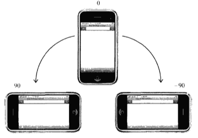

只要用户改变了设备的查看模式，就会触发`orientationchange`事件。此时的`event`对象不包含任何有价值的信息，因为唯一相关的信息可以通过`window.orientation`访问到：

```javascript
EventUtil.addHandler(window, 'load', function (event) {
  var div = document.getElementById('myDiv');
  div.innerHTML = 'current orientation is ' + window.orientation;
  EventUtil.addHandler(window, 'orientationchange', function (event) {
    div.innerHTML = 'current orientation is ' + window.orientation;
  });
});
```

#### MozOrientation事件

Firefox3.6为检测设备的方向引入了`MozOrientation`事件（前缀`Moz`表示这是特定于浏览器开发商的事件，不是标准事件。）当设备的加速计检测到了设备方向改变时，就会触发这个事件。但这个事件与iOS中的`orientationchange`事件不同，该事件只能提供一个平面的方向变化。由于`MozOrientation`事件是在`window`对象上触发的，所以可以使用下面代码来处理：

```javascript
EventUtil.addHandler(window, 'MozOrientation', function (event) {
  //响应事件
});
```

此时的`event`对象包含三个属性：`x`，`y`和`z`。这几个属性的值都介于`1`到`-1`之间，表示不同坐标轴上的方向。在静止状态下，`x`值为`0`，`y`值为`0`，`z`值为`1`（表示设备处于竖直状态）。如果设备向右倾斜，`x`值会减小；反之，向左倾斜，`x`值会增大。类似地，如果设备向远离用户的方向倾斜，`y`值会减小，向接近用户的方向倾斜，`y`值会增大。`z`轴检测垂直加速度，`1`表示静止不动，在设备移动时值会减小。（失重状态下值为0）：

```javascript
EventUtil.addHandler(window, 'MozOrientation', function (event) {
  var output = document.getElementById('output');
  output.innerHTML = 'x= ' + event.x + ', y= ' + event.y + ', z= ' + event.z;
});
```

只有带加速计的设备才支持`MozOrientation`事件，这是一个实验性API，将来可能会变。

#### deviceorientation事件

本质上，DeviceOrientation Event规范定义的`deviceorientation`事件与`MozOrientation`事件类似。它也是在加速计检测到设备方向变化时在`window`对象上触发，而且具有与`MozOrientation`事件相同的支持限制。不过`deviceorientation`事件的意图是告诉开发人员设备在空间中朝向哪儿，而不是如何移动。

设备在三维空间中是靠x、y和z轴来定位的。当设备静止放置在水平面上，这三个值都是0。x轴方向是从左往右，y轴方向是从下往上，z轴方向是从后往前。

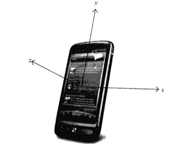

触发`deviceorientation`事件时，事件对象中包含着每个轴相对于设备静止状态下发生变化的信息。事件对象包含下面5个属性：

* `alpha`：在围绕z轴旋转时，y轴的度数差；是一个介于0到360之间的浮点数
* `beta`：在围绕x轴旋转时，z轴的度数差；是一个介于-180到180之间的浮点数
* `gamma`：在围绕y轴旋转时，z轴的度数差；是一个介于-90到90之间的浮点数
* `absolute`：布尔值，表示设备是否是返回一个绝对值
* `compassCalibrated`：布尔值，表示设备的指南针是否校准过

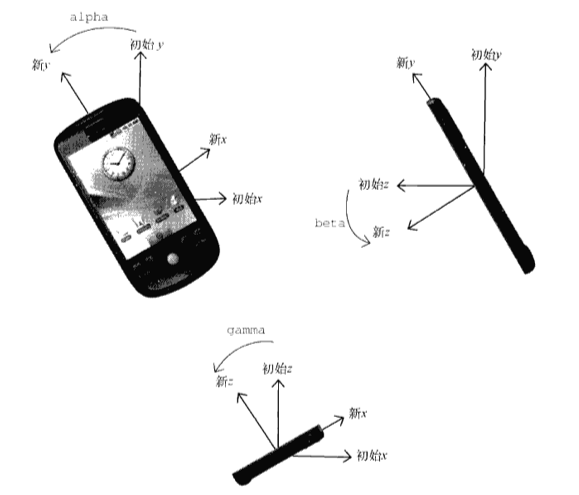

```javascript
EventUtil.addHandler(window, 'deviceorientation', function (event) {
  var output = document.getElementById('output');
  output.innerHTML = 'alpha= ' + event.alpha + ', beta= ' + event.beta + ', gamma= ' + event.gamma;
});
```

通过这些信息，可以响应设备的方向，重新排列或修改屏幕上的元素。要响应设备方向的改变而旋转元素，可以参考下面代码：

```javascript
EventUtil.addHandler(window, 'deviceorientation', function (event) {
  var arrow = document.getElementById('arrow');
  arrow.style.webkitTransform = 'rotate(' + Math.round(event.alpha) + 'deg)';
});
```

#### devicemotion事件

DeviceOrientation Event规范还定义了一个`devicemotion`事件。这个事件要告诉开发人员设备什么时候移动，而不仅仅是设备方向如何改变。例如，通过`devicemotion`能够检测到设备是不是正在往下掉，或者是不是被走着的人拿在手里。

触发`devicemotion`事件时，事件对象包含下列属性：

* `acceleration`：一个包含x，y和z属性的对象，在不考虑重力的情况下，告诉你在每个方向上的加速度
* `accelerationIncludingGravity`：一个包含x，y和z属性的对象，在考虑z轴自然重力加速度的情况下，告诉你在每个方向上的加速度
* `interval`：以毫秒表示的时间值，必须在另一个`devicemotion`事件触发前传入。这个值在每个事件中应该是一个常量
* `rotationRate`：一个包含表示方向的`alpha`、`beta`和`gamma`属性的对象。

如果读取不到`acceleration`、`accelerationIncludingGravity`和`rotationRate`值，则它们的值为`null`。因此，在使用这三个属性之前，应该先检测确定它们的值不是`null`：

```javascript
EventUtil.addHandler(window, 'devicemotion', function (event) {
  var output = document.getElementById('output');
  if (event.rotationRate != null){
    output.innerHTML = 'alpha= ' + event.rotationRate.alpha + ', beta= ' + event.rotationRate.beta + ', gamma= ' + event.rotationRate.gamma;
  }
});
```

### 触摸与手势事件

#### 触摸事件

触摸事件会在用户手指放在屏幕上面时、在屏幕上滑动时或从屏幕上移开时触发。具体来说，有以下几个触摸事件：

* `touchstart`：当手指触摸屏幕时触发；即使已经有一个手指放在了屏幕上也会触发
* `touchmove`：当手指在屏幕上滑动时连续地触发。在这个事件发生期间，调用`preventDefault()`可以阻止滚动
* `touchend`：当手指从屏幕上移开时触发
* `touchcancel`：当系统停止跟踪触摸时触发

上面几个事件都会冒泡，也都可以取消。每个触摸事件的`event`对象都提供了在鼠标中常见的属性：`bubbles`、`cancelable`、`view`、`clientX`、`clientY`、`screenX`、`screenY`、`detail`、`altKey`、`shiftKey`、`ctrlKey`和`metaKey`。

除了常见的DOM属性之外，触摸事件还包含下列三个用于跟踪触摸的属性：

* `touches`：表示当前跟踪的触摸操作的`Touch`对象的数组
* `targetTouches`：特定于事件目标的`Touch`对象数组
* `changeTouches`：表示自上次触摸以来发了什么改变的`Touch`对象的数组

每个`Touch`对象包含下列属性：

* `clientX`：触摸目标在视口中的x坐标
* `clientY`：触摸目标在视口中的y坐标
* `identifier`：标识触摸的唯一ID
* `pageX`：触摸目标在页面中的x坐标
* `pageY`：触摸目标在页面中的y坐标
* `screenX`：触摸目标在屏幕中的x坐标
* `screenY`：触摸目标在屏幕中的y坐标
* `target`：触摸的DOM节点目标

使用这些属性可以跟踪用户对屏幕的触摸操作：

```javascript
function handleTouchEvent(event) {

  //只跟踪一次触摸
  if (event.touches.length == 1){
    var output = document.getElementById('output');
    switch (event.type){
      case 'touchstart':
        output.innerHTML = 'touch started (' + event.touches[0].clientX + ',' + event.touches[0].clientY + ')';
        break;
      case 'touchend':
        output.innerHTML = '<br>touch ended (' + event.changeTouches[0].clientX + ',' + event.changeTouches[0].clientY + ')';
        break;
      case 'touchmove':
        event.preventDefault();     //阻止滚动
        output.innerHTML = '<br>touch moved (' + event.changeTouches[0].clientX + ',' + event.changeTouches[0].clientY + ')';
        break;
    }
  }
}

EventUtil.addHandler(document,'touchstart', handleTouchEvent);
EventUtil.addHandler(document, 'touchend', handleTouchEvent);
EventUtil.addHandler(document, 'touchmove', handleTouchEvent);
```

在`touchend`事件发生时，`touched`集合中就没有任何`Touch`对象了，因为不存在活动的触摸操作；此时，就必须使用`changeTouches`集合。

这些事件就会在文档的所有元素上面触发，因而可以分别操作页面的不同的部分。在触摸屏幕上的元素时，这些事件（包括鼠标事件）发生顺序如下：

1. `touchstart`
2. `mouseover`
3. `mousemove`（一次）
4. `mousedown`
5. `mouseup`
6. `click`
7. `touchend`

#### 手势事件

当两个手指触摸屏幕时就会产生手势，手势通常会改变显示项的大小，或者旋转显示项。有三个手势事件：

* `gesturestart`：当一个手指已经按在屏幕上而另一个手指又触摸屏幕时触发
* `gesturechange`：当触摸屏幕的任何一个手指的位置发生变化时触发
* `gestureend`：当任何一个手指从屏幕上面移开时触发

只有两个手指都触摸到事件的接收容器时才会触发这些事件。在一个元素上设置事件处理程序，意味着两个手指必须同时位于该元素的范围之内，才能触发手势事件（这个元素就是目标）。由于这些事件冒泡，所以将事件处理程序放在文档上也可以处理所有手势事件。此时，事件的目标就是两个手指都位于其范围内的那个元素。

触摸事件和手势事件之间存在某种关系。当一个手指放在屏幕上时，会触发`touchstart`事件。如果另一个手指又放在了屏幕上，则会先触发`gesturestart`事件，随后触发基于该手指的`touchstart`事件。如果一个或两个手指在屏幕上滑动，将会触发`gesturechange`事件。但只要有一个手指移开，就会触发`gestureend`事件，紧接着触发基于该手指的`touchend`事件。

与触摸事件一样，每个手势事件的`event`对象都包含着标准的鼠标事件属性：`bubbles`、`cancelable`、`view`、`clientX`、`clientY`、`screenX`、`screenY`、`detail`、`altKey`、`shiftKey`、`ctrlKey`和`metaKey`。此外，还包含两个额外的属性`rotation`和`scale`。其中，`rotation`属性表示手指变化引起的旋转角度，负值表示逆时针旋转，正值表示顺时针旋转（该值从0开始）。而`scale`属性表示两个手指间距离的变化情况，这个值从1开始，并随着距离拉大而增长，随距离缩短而减小：

```javascript
function handleGestureEvent(event) {
  var output = document.getElementById('output');
  switch (event.type){
    case 'gesturestart':
      output.innerHTML = 'gesture started (rotation=' + event.rotation + ',scale=' + event.scale + ')';
      break;
    case 'gestureend':
      output.innerHTML = '<br>gesture ended (rotation=' + event.rotation + ',scale=' + event.scale + ')';
      break;
    case 'gesturechange':
      output.innerHTML = '<br>gesture changed (rotation=' + event.rotation + ',scale=' + event.scale + ')';
      break;
  }
}

document.addEventListener('gesturestart', handleGestureEvent,false);
document.addEventListener('gestureend',handleGestureEvent,false);
document.addEventListener('gesturechange',handleGestureEvent,false);
```

## 内存和性能

由于事件处理程序可以为现代Web应用程序提供交互能力，因此许多开发人员会不分青红皂白地向页面中添加大量的处理程序。在JavaScript中，添加到页面上的事件处理程序数量将直接关系到页面的整体运行性能。导致这一问题的原因是多方面的。首先，每个函数都是对象，都会占用内存；内存中的对象越多，性能就越差。其次，必须事先指定所有事件处理程序而导致的DOM访问次数，会延迟整个页面的交互就绪时间。事实上，从如何利用好事件处理程序的角度出发，还是有一些方法能够提升性能的。

### 事件委托

对事件处理程序过多问题的解决方案就是事件委托。事件委托利用了事件冒泡，只指定一个事件处理程序，就可以管理某一类型的所有事件。也就是说，可以为整个页面指定一个`onclick`事件处理程序，而不必给每个可单击的元素分别添加事件处理程序。

```html
<ul id="myLinks">
    <li id="goSomewhere">Go somewhere</li>
    <li id="doSomething">Do something</li>
    <li id="sayHi">Say hi</li>
</ul>
```

如果在一个复杂的Web应用程序中，对所有可单击的元素都采用这种方式，那么结果就会有数不清的代码用于添加事件处理程序。此时，可以利用事件委托技术解决这个问题。使用事件委托，只需要在DOM数中尽量最高的层次上添加一个事件处理程序：

```javascript
var list = document.getElementById('myLinks');

EventUtil.addHandler(list, 'click', function (event) {
  event = EventUtil.getEvent(event);
  var target = EventUtil.getTarget(target);

  switch (target.id){
    case 'doSomething':
      document.title = "I changed the document's title";
      break;
    case 'goSomewhere':
      location.href = 'http://tc9011.com';
      break;
    case 'sayHi':
      alert('hi');
      break;
  }
});
```

在这段代码里，使用事件委托只为`<ul>`元素添加了一个`onclick`事件处理程序。由于所有列表项都是这个元素的子节点，而且它们的事件会冒泡，所以单击事件最终会被这个函数处理。事件目标是被单击的列表项，故而可以通过检测`id`属性来决定采取适当的操作。与前面未使用事件委托的代码一比，这段代码的事前消耗更低，因为只取得了一个DOM元素，只添加了一个事件处理程序。虽然对用户来说最终结果相同，但这种技术需要占用的内存更少。所有用到按钮的事件都适合采用事件委托技术。

如果可行的话，也可以考虑为`document`对象添加一个事件处理程序，用以处理页面上发生的某种特定类型的事件。这样做与采取传统的做法相比有下列几个优点：

* `document`对象很快就可以访问，而且可以在页面生命周期的任何时点上为它添加事件处理程序。换句话说，只要可单击的元素呈现在页面上，就可以立即具备适当的功能
* 在页面中设置事件处理程序所需的时间更少。只添加一个事件处理程序所需的DOM引用更少，所花的时间也更少
* 整个页面占用的内存空间更少，能够提升整体性能

最适合采用事件委托技术的事件包括`click`、`mousedown`、`mouseup`、`keyup`和`keypress`。虽然`mouseover`和`mouseout`事件也冒泡，但要适当处理它们并不容易，而且经常需要计算元素的位置。

### 移除事件处理程序

每当事件处理程序指定给元素时，运行中的浏览器代码与支持页面交互的JavaScript代码之间就会建立一个连接。这种连接越多，页面执行起来就越慢。可以采用事件委托技术，限制建立的连接数量。另外，在不需要的时候移除事件处理程序，也是解决这个问题的一种方案。内存中留有那些过时不用的空事件处理程序（dangling event handler），也是造成Web应用程序内存与性能问题的主要原因。

在两种情况下，可能会造成上述问题。第一种情况就是从文档中移除带有事件处理程序的元素时。这可能是通过纯粹的DOM操作，但更多地是发生在使用`innerHTML`替换页面中某一部分的时候。如果带有事件处理程序的元素被`innerHTML`删除了，那么原来添加到元素中的事件处理程序极有可能无法被当做垃圾回收：

```html
<div id="myDiv">
    <input type="button" value="click me" id="myBtn">
</div>
```

```javascript
var btn = document.getElementById('myBtn');
btn.onclick = function () {
  //先执行某些操作

  document.getElementById('myDIv').innerHTML = 'processing...'
};
```

上面代码为了避免双击，单击按钮时就将按钮移除并替换成一条消息。在`<div>`元素上设置`innerHTML`可以把按钮移走，但事件处理程序仍然与按钮保持着引用关系。有的浏览器在这种情况下不会做出恰当地处理，它们很有可能会将对元素和对事件处理程序的引用都保存在内存中。如果你知道某个元素即将被移除，那么最好手工移除事件处理程序：

```javascript
var btn = document.getElementById('myBtn');
btn.onclick = function () {
  //先执行某些操作

  btn.onclick = null;     //移除事件处理程序
  document.getElementById('myDIv').innerHTML = 'processing...'
};
```

在事件处理程序中删除按钮也能阻止事件冒泡。目标元素在文档中是事件冒泡的前提。

导致空事件处理程序的另一种情况，就是卸载页面的时候。如果页面被卸载之前没有清理干净事件处理程序，那它们会滞留在内存中。每次加载完页面再卸载页面时，内存中滞留的对象数目就会增加，因为事件处理程序占用的内存并没有被释放。

一般来说，最好的做法是在页面卸载之前，先通过`onunload`事件处理程序移除所有事件处理程序。在此，事件委托技术再次表现出它的优势，需要跟踪的事件处理程序越少，移除它们就越容易。对这种类似撤销的操作，可以把它想象成：只要是通过`onload`事件处理程序添加的东西，最后都要通过`onunload`事件处理程序将它们移除。

## 模拟事件

事件，就是网页中某个特别值得关注的瞬间。事件经常由用户操作或通过其他浏览器功能来触发。但很少人知道，可以使用JavaScript在任意时刻来触发特定的事件，而此时的事件就如同浏览器创建的事件一样。也就是说，这些事件该冒泡还会冒泡，而且照样能够导致浏览器执行已经指定的处理它们的事件处理程序。在测试Web应用程序，模拟触发事件是一种及其有用的技术。

### DOM中的事件模拟

可以在`document`对象上使用`createEvent()`方法创建`event`对象。这个方法接收一个参数，即表示要创建的事件类型的字符串。在DOM2级中，所有这些字符串都使用英文复数形式，而在DOM3级中都变成了单数。这个字符串可以是下列几个字符串之一：

* `UIEvents`：一般化的UI事件。鼠标事件和键盘事件都继承自UI事件。DOM3级中是`UIEvent`
* `MouseEvents`：一般化的鼠标事件。DOM3级中是`MouseEvent`
* `MutationEvents`：一般化的DOM变动事件。DOM3级中是`MutationEvent`
* `HTMLEvents`：一般化的HTML事件。没有对应的DOM3级事件

DOM2级事件并没有专门规定键盘事件，DOM3级事件中才正式将其作为一种事件给出规定。

在创建了`event`对象之后，还需要使用与事件有关的信息对其进行初始化。每种类型的`event`对象都有一个特殊的方法，为它传入适当的数据就可以初始化该`event`对象。不同类型的这个方法名字也不同，具体要取决于`createEvent()`中使用的参数。

模拟事件的最后一步就是触发事件。这一步需要使用`dispatchEvent()`方法，所有支持事件的DOM节点都支持这个方法。调用`dispatchEvent()`方法时，需要传入一个参数，即表示要触发事件的`event`对象。触发事件之后，该事件就跻身官方事件之列，因而能够照样冒泡并引发相应事件处理程序的执行。

#### 模拟鼠标事件

创建新的鼠标事件对象并为其指定必要的信息，就可以模拟鼠标事件。创建鼠标事件对象的方法是为`createEvent()`传入字符串`MouseEvents`。返回的对象有一个名为`initMouseEvent()`方法，这个方法接收15个参数，分别与鼠标事件中每个典型的属性一一对应：

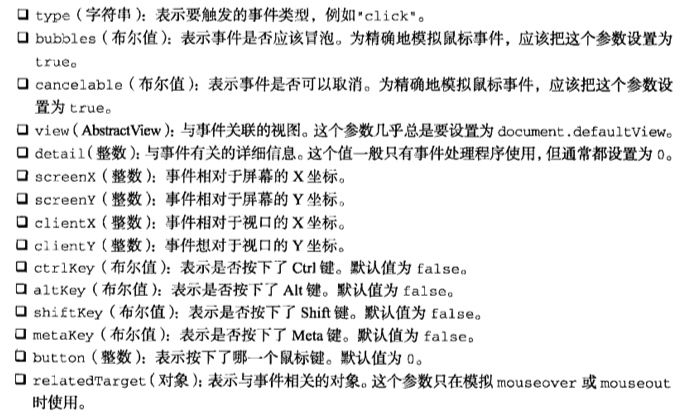

显而易见，`initMouseEvent()`方法的这些参数是与鼠标事件的`event`对象所包含的属性一一对应。其中，前4个参数对正确地激发事件至关重要，因为浏览器要用到这些参数；而剩下的所有参数只有在事件处理程序中才会用到。当把`event`对象当把`event`对象传给`dispathEvent()`方法时，这个对象d `target`属性会自动设置。

```javascript
//创建事件对象
var event = document.createEvent('MouseEvent');

//初始化事件对象
event.initMouseEvent('click', true, true, document.defaultView, 0, 0, 0, 0, 0, false, false, false, false, 0, null);

//触发事件
btn.dispatchEvent(event);
```

在兼容DOM的浏览器中，也可以通过相同的方式来模拟其他鼠标事件。

#### 模拟键盘事件

DOM2级事件中没有就键盘事件作出规定，因此模拟键盘事件并没有现成的思路可寻。

DOM3级规定，调用`createEvent()`并传入`keyboardEvent`就可以创建一个键盘事件。返回的事件对象会包含一个`initKeyEvent()`方法，这个方法接收下列参数：

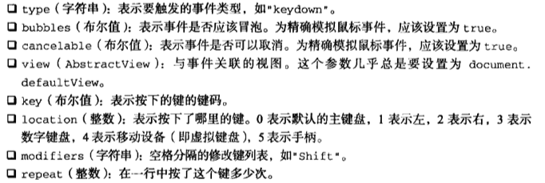

由于DOM3级不提倡使用`keypress`事件，因此只能利用这种技术类模拟`keydown`和`keyup`事件。

```javascript
var textbox = document.getElementById('myTextbox'),
    event;

//以DOM3级方式创建事件对象
if (document.implementation.hasFeature('keyboardEvents', '3.0')){
  event = document.createEventObject('keyboradEvent');

  //初始化事件对象
  event.initKeyboardEvent('keydown', true, true, document.defaultView, 'a', 0, 'shift', 0);
}

//触发事件
textbox.dispatchEvent(event);
```

这个例子模拟的是按住Shift的同时按下了A键。在使用`document.createEvent('keyboardEvent')`之前，应该先检测浏览器是否支持DOM3级事件；其他浏览器返回一个非标准的`keyboardEvent`对象。

在Firefox中，调用`createEvent()`并传入`keyEvents`就可以创建一个键盘事件。返回的事件对象包含一个`initKeyEvent()`方法，这个方法接受下列10个参数：

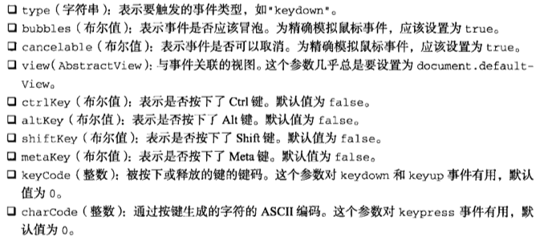

将创建的`event`对象传入到`dispatchEvent()`方法就可以触发键盘事件：

```javascript
//只适用Firefox
var textbox = document.getElementById('myTextbox');

//创建事件对象
var event = document.createEvent('KeyEvents');

//初始化事件对象
event.initKeyEvent('keypress', true, true, document.defaultView, false, false, false, false, 65, 65);

//触发事件
textbox.dispatchEvent(event);
```

在其他浏览器中，则需要创建一个通用的事件，然后再向事件对象中添加键盘事件特有的信息：

```javascript
//创建事件对象
var event = document.createEvent('Events');

//初始化事件对象
event.initEvent(type, bubbles, cancelable);
event.view = document.defaultView;
event.altKey = false;
event.ctrlKey = false;
event.shiftKey = false;
event.metaKey = false;
event.keyCode = 65;
event.charCode = 65;

//触发事件
textbox.dispatchEvent(event);
```

上面代码中必须要使用通用事件，而不能使用UI事件，因为UI事件不允许向`event`对象中再添加新属性。像这样模拟事件虽然会触发键盘事件，但却不会向文本框中写入文本，这是由于无法精确模拟键盘事件所造成的。

#### 模拟其他事件

虽然鼠标事件和键盘事件是在浏览器中最经常模拟的事件，但有时候同样需要模拟变动事件和HTML事件。要模拟变动事件，可以使用`createEvent('MutationEvents')`创建一个包含`initMutationEvent()`方法的变动事件对象。这个方法接受的参数包括`type`、`bubbles`、`cancelable`、`relatedNode`、`preValue`、`newValue`、`attrName`和`attrChange`。

```javascript
var event = document.createEvent('MutationEvents');
event.initMutationEvent('DOMNodeInserted', true, false, someNode, '', '', '', 0);
target.dispatchEvent(event);
```

要模拟HTML事件，同样需要先创建一个`event`对象----通过`createEvent('HTMLEvents')`，然后再使用这个对象的`initEvent()`方法来初始化它即可：

```javascript
var event = document.createEvent('HTMLEvents');
event.initEvent('focus', true, false);
target.dispatchEvent(event);
```

#### 自定义DOM事件

DOM3级还定义了自定义事件。自定义事件不是由DOM原生触发的，它的目的是让开发人员创建自己的事件。要创建新的自定义事件，可以调用`createEvent('CustomEvent')`。返回的对象有一个名为`initCustomEvent()`的方法，接受如下四个参数：

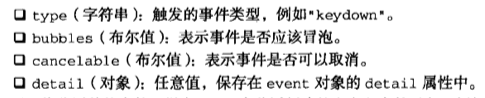

可以像分派其他事件一样在DOM中分派创建的自定义事件对象：

```javascript
var div = document.getElementById('myDiv'),
    event;

EventUtil.addHandler(div, 'myevent', function (event) {
  alert('DIV: ' + event.detail);
});

EventUtil.addHandler(document, 'myevent', function (event) {
  alert('DOCUMENT: ' + event.detail);
});

if (document.implementation.hasFeature('CustomEvents', '3.0')){
  event = document.createEvent('CustomEvent');
  event.initCustomEvent('myevent', true, false, 'hello');
  div.dispatchEvent(event);
}
```

上面代码中创建了一个冒泡事件`myevent`。而`event.detail`的值被设置成了`hello`字符串，然后在`<div>`和`document`上侦听这个事件。因为`initCustomEvent()`方法已经指定这个事件应该冒泡，所以浏览器会负责将事件向上冒泡到`document`。

<iframe src="https://www.xmind.net/embed/VQGg" width="620px" height="540px"></iframe>
