> 第十四章：表单脚本
>
> 第十五章：使用Canvas绘图
>
> 第十六章：HTML5脚本编程

<!--more-->

# 表单脚本

## 表单的基础知识

在HTML中，表单是由`<form>`元素来表示，而在JavaScript中，表单对应的则是`HTMLFormElement`类型。`HTMLFormElement`继承了`HTMLElement`，因而与其他HTML元素具有相同的默认属性。不过，`HTMLFormElement`也有自己独有的属性和方法：

* `acceptCharset`：服务器能够处理的字符集；等价于HTML中的`accept-charset`特性
* `action`：接受请求的URL；等价于HTML中的`action`特性
* `elements`：表单中所有控件的集合
* `enctype`：请求的编码类型；等价于HTML中的`enctype`特性
* `length`：表单中控件的数量
* `method`：要发送的HTTP请求类型，通常是`get`或`post`；等价于HTML的`method`特性
* `name`：表单的名称；等价于HTML的`name`特性
* `reset()`：将所有表单域重置为默认值
* `submit()`：提交表单
* `target`：用于发送请求和接收响应的窗口名称；等价于HTML的`target`特性

取得`<form>`元素引用的方式有好几种，其中最常见的方式就是将他看成与其他元素一样，并为其添加`id`特性，然后再想下面这样使用`getElementById()`方法找到它：

```javascript
var form = document.getElementById('form1');
```

其次，通过`document.forms`可以取得页面中所有的表单。这个集合中，可以通过数值索引或`name`值来取得特定的表单：

```javascript
var firstForm = document.forms[0];  	// 取得页面中的第一个表单
var myForm = document.forms['form2']; 	//取得页面中名为form2的表单
```

可以同时为表单指定`id`和`name`属性，但它们的值不一定相同。

### 提交表单

使用`<input>`或`<button>`都可以定义提交按钮，只要将其`type`特性的值设置为`submit`即可，而图像按钮则是通过将`<input>`的`type`特性设置为`image`来定义的：

```html
<!--通过提交按钮-->
<input type="submit" value="submit form">

<!--自定义提交按钮-->
<button type="submit">submit form</button>

<!--图像按钮-->
<input type="image" src="graphic.gif">
```

只要表单中存在上面列出的任何一种按钮，那么在相应表单控件拥有焦点的情况下，按回车键就可以提交该表单（`textarea`是一个例外，在文本区中回车会换行）。如果表单没有提交按钮，按回车键就不会提交表单。

以这种方式提交表单时，浏览器会在将请求发给服务器之前触发`submit`事件。这样，就有机会验证表单数据，并据以决定是否允许表单提交。阻止这个事件的默认行为就可以取消表单提交:

```javascript
EventUtil.addHandler(form, 'submit', function (event) {
  // 取得事件对象
  event = EventUtil.getEvent(event);

  // 阻止默认事件
  EventUtil.preventDefault(event);
});
```

一般来说，在表单数据无效而不能发送给服务器时，可以使用这一技术。

在JavaScript中，以编程方式调用`submit()`方法也可以提交表单。而且，这种方式无需表单包含提交按钮，任何时候都可以正常提交表单：

```javascript
form.submit();
```

在以调用`submit()`方法的形式提交表单时，不会触发`submit`事件，因此要记得在调用此方法之前先验证表单数据。

提交表单时可能出现的最大问题，就是重复提交表单。解决这一问题的办法有两个：在第一次提交表单后就禁用提交按钮，或者利用`onsubmit`事件处理程序取消后续的表单提交操作。

### 重置表单

在用户单击重置按钮时，表单会被重置。使用`type`特性值为`reset`的`<input>`或`<button>`都可以创建重置按钮：

```html
<!--通用重置按钮-->
<input type="reset" value="reset form">

<!--自定义重置按钮-->
<button type="reset">reset form</button>
```

这两个按钮都可以用来重置表单。在重置表单时，所有表单字段都会恢复到页面刚加载完时的初始值。如果某个字段的初始值为空，就会恢复为空；而带有默认值的字段，也会恢复为默认值。

用户单击重置按钮时，会触发`reset`事件。利用这个机会，可以在必要时取消重置操作：

```javascript
EventUtil.addHandler(form, 'submit', function (event) {
  // 取得事件对象
  event = EventUtil.getEvent(event);

  // 阻止默认事件
  EventUtil.preventDefault(event);
});
```

与提交表单一样，也可以通过JavaScript来重置表单：

```javascript
form.reset();
```

与调用`submit()`方法不同，调用`reset()`方法会像单击重置按钮一样触发`reset`事件。

<p id="div-border-left-yellow">事实上重置表单的需求很少见。更常见的做法是提供一个取消按钮，让用户能够返回到前一个页面，而不是不分青红皂白地重置表单中的所有值。</p>

### 表单字段

可以像访问页面中的其他元素一样，使用原生DOM方法访问表单元素。此外，每个表单都有`elements`属性，该属性是表单中所有元素的集合。这个`elements`集合是一个有序列表，其中包含着表单中的所有字段，例如`<input>`、`<textarea>`、`<button>`和`<fieldset>`。每个表单字段在`elements`集合中的顺序，与它们出现在标记中的顺序相同，可以按照位置和`name`特性来访问它们：

```javascript
// 取得表单中的第一个字段
var field1 = form.elements[0];

// 取得name为textbox1的字段
var field2 = form.elements['textbox1'];

// 取得表单中包含的字段的数量
var fieldCount = form.elements.length;
```

如果有多个表单控件都在使用一个`name`（如单选按钮），那么就会返回以该`name`命名的一个`NodeList`：

```html
<form method="post" id="myForm">
    <ul>
        <li><input type="radio" name="color" value="red">RED</li>
        <li><input type="radio" name="color" value="green">GREEN</li>
        <li><input type="radio" name="color" value="blue">BLUE</li>
    </ul>
</form>
```

```javascript
var form = document.getElementById('myForm');

var colorFields = form.elements['color'];
alert(colorFields.length);		//3

var firstColorField = colorFields[0];
var firstFormField = form.elements[0];
alert(firstColorField === firstFormField);		//true
```

#### 共有的表单字段属性

除了`<fieldset>`元素外，所有表单字段都拥有相同的一组属性。由于`<input>`类型可以表示多种表单字段，因此有些属性只适用于某些字段，但还有一些属性是所有字段所共有的。表单字段共有的属性如下：

* `disabled`：布尔值，表示当前字段是否被禁用
* `form`：指向当前字段所属表单的指针；只读
* `name`：当前字段的名称
* `readOnly`：布尔值，表示当前字段是否只读
* `tabIndex`：表示当前字段的切换（tab）序号
* `type`：当前字段的类型，如`checkbox`、`radio`等等
* `value`：当前字段将被提交给服务器的值。对文件字段来说，这个属性是只读的，包含着文件在计算机中的路径

除了`form`属性之外，可以通过JavaScript动态修改其他任何属性：

```javascript
var field = form.elements[0];

//修改value属性
field.value = 'Another Value';

//检查form属性的值
alert(field.form === form);		//true

//把焦点设置到当前字段
field.focus();

//禁用当前字段
field.disabled = true;

//修改type属性（不推荐，但对<input>来说是可行的）
field.type = 'checkbox';
```

能够动态修改表单字段属性，意味着可以在任何时候以任何方式来动态操作表单。例如在第一次单击后禁用提交按钮：

```javascript
//避免多次提交表单
EventUtil.addHandler(form, 'submit', function (event) {
  event = EventUtil.getEvent(event);
  var target = EventUtil.getTarget(event);

  //取得提交按钮
  var btn = target.elements['submit-btn'];

  //禁用它
  btn.disabled = true;
});
```

注意，不能通过`onclick`事件处理程序来实现这个功能，原因是不同浏览器之间存在"时差"：有的浏览器会在触发表单的`submit`事件之前触发`click`事件，而有的浏览器则相反。因此，最好是通过`submit`事件来禁用提交按钮。不过，这种方式不适合表单中不包含提交按钮的情况，只有在包含提交按钮的情况下，才有可能触发表单的`submit`事件。

除了`<fieldset>`之外，所有表单字段都有`type`属性。对于`<input>`元素，这个值等于HTML特性`type`的值。对于其他元素，这个`type`属性的值如下：

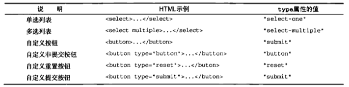

此外，`<input>`和`<button>`元素的`type`属性是可以动态修改的，而`<select>`元素的`type`属性则是只读的。

#### 共有的表单字段方法

每个表单字段都有两个方法：`focus()`和`blur()`。其中，`focus()`方法用于将浏览器的焦点设置到表单字段，即激活表单字段，使其可以响应键盘事件。使用`focus()`方法，可以将用户的注意力吸引到页面中的某个部位。为此，可以侦听页面的`load`事件，并在该事件发生时在表单的第一个字段上调用`focus()`方法：

```javascript
EventUtil.addHandler(window, 'load', function (event) {
  document.forms[0].elements[0].focus();
});
```

要注意的是，如果第一个表单字段是一个`<input>`元素，且其`type`特性的值为`hidden`，那么上面代码会导致错误。另外，如果使用CSS的`display`和`visibility`属性隐藏了该字段，同样也会导致错误。

HTML5为表单字段新增了一个`autofocus`属性。在支持这个属性的浏览器中，只要设置这个属性，不用JavaScript就能自动把焦点移动到相应字段：

```html
<input type="text" autofocus>
```

`autofocus`是一个布尔值，在支持的浏览器中它的值应该是`true`，在不支持的浏览器中，它的值是空字符串。

与`focus()`方法相对的是`blur()`方法，它的作用是从元素中移走焦点。调用`blur()`方法时，并不会把焦点转移到某个特定的元素上；仅仅是将焦点从调用这个方法的元素上面移走而已。

```javascript
document.forms[0].elements[0].blur();
```

#### 共有的表单字段事件

除了支持鼠标、键盘、更改和HTML事件之外，所有表单字段都支持下列3个事件：

* `blur`：当前字段失去焦点时触发
* `change`：对于`<input>`和`<textarea>`元素，在它们失去焦点且`value`值改变时触发；对于`<select>`元素，在其选项改变时触发
* `focus`：当前字段获得焦点时触发

当用户改变了当前字段的焦点，或者调用了`blur()`或`focus()`方法时，都可以触发`blur`和`focus`事件。这两个事件在所有表单字段中都是相同的。但是，`change`事件再不同表单控件中触发的次数会有所不同。对于`<input>`和`<textarea>`元素，当它们从获得焦点到失去焦点且`value`值改变时，才会触发`change`事件。对于`<select>`元素，只要用户选择了不同的选项，就会触发`change`事件，也就是不失去焦点也会触发`change`事件。

通常，可以使用`focus`和`blur`事件来以某种方式改变用户界面，要么是向用户给出视觉提示，要么是向界面中添加额外的功能。而`change`事件则经常用于验证用户在字段中输入的数据：

```javascript
/*
	如果文本框只允许输入数值，利用focus事件修改文本框的背景颜色，以便更清楚地表明这个字段获得了焦点。利用blur事件恢复文本框的背景颜色，利用change事件在用户输入了非数值字符时再次修改背景颜色。
*/

var textbox = document.forms[0].elements[0];

EventUtil.addHandler(textbox, 'focus', function (event) {
  event = EventUtil.getEvent(event);
  var target = EventUtil.getTarget(event);

  if (target.style.backgroundColor != 'red'){
    target.style.backgroundColor = 'yellow';
  }
});

EventUtil.addHandler(textbox, 'blur', function (event) {
  event = EventUtil.getEvent(event);
  var target = EventUtil.getTarget(event);

  if (/[^\d]/.test(target.value)){
    target.style.backgroundColor = 'red';
  }else {
    target.style.backgroundColor = '';
  }
});

EventUtil.addHandler(textbox, 'change', function (event) {
  event = EventUtil.getEvent(event);
  var target = EventUtil.getTarget(event);

  if (/[^\d]/.test(target.value)){
    target.style.backgroundColor = 'red';
  }else {
    target.style.backgroundColor = '';
  }
});
```

## 文本框脚本

在HTML中，有两种方式来表现文本框：一种是使用`<input>`元素的单行文本框，另一种是使用`<textarea>`的多行文本框。这两个控件非常相似，而且多数时候的行为也差不多。不过，它们之间仍然存在一些重要的区别。

要表现文本框，必须将`<input>`元素的`type`特性设置为`text`。而通过设置`size`特性，可以指定文本框中能够显示的字符数。通过`value`特性，可以设置文本框的初始值，而`maxlength`特性则用于指定文本框可以接受的最大字符数。

```html
<input type="text" size="25" maxlength="50" value="initial value">
```

`<textarea>`元素则始终会呈现为一个多行文本框。要指定文本框的大小，可以使用`rows`和`cols`特性。其中，`rows`特性指定的是文本框的字符行数，而`cols`特性指定的是文本框的字符列数（类似于`<input>`元素的`size`特性）。与`<input>`元素不同，`<textarea>`的初始值必须要放在`<textarea>`和`</textarea>`之间：

```html
<textarea cols="5" rows="25">initial value</textarea>
```

另一个与`<input>`的区别在于，不能在HTML中给`<textarea>`指定最大字符数。

无论这两种文本框在标记中有什么区别，但它们都会将用户输入的内容保存在`value`属性中。可以通过这个属性读取和设置文本框的值：

```javascript
var textbox = document.forms[0].elements['textbox1'];
console.log(textbox.value);

textbox.value = 'some new value';
```

建议使用`value`属性读取或设置文本框的值，不建议使用标准DOM方法，即不要使用`setAttribute()`设置`<input>`元素的`value`特性，也不要去修改`<textarea>`元素的第一个子节点。原因很简单：对`value`属性所做的修改，不一定会反应在DOM中。因此，在处理文本框的值时，最好不要使用DOM方法。

### 选择文本

上面两种文本框都支持`select()`方法，这个方法用于选择文本框中的所有文本。在调用`select()`方法时，大多数浏览器都会将焦点设置在文本框中。这个方法不接受参数，可以在任何时候被调用。

```javascript
textbox.select();

//获得焦点时选择其所有文本
EventUtil.addHandler(textbox, 'focus', function (event) {
  event = EventUtil.getEvent(event);
  var target = EventUtil.getTarget(event);

  target.select();
});
```

#### 选择（select）事件

与`select()`方法对应的是一个`select`事件。在选择了文本框中的文本时，就会触发`select`事件。不过，到底什么时候触发`select`事件，还会因浏览器而异。在IE9+、Opera、Firefox、Chrome和Safari中，只有用户选择了文本（而且要释放鼠标），才会触发`select`事件。在IE8及更早的版本中，只要用户选择了一个字母（不必释放鼠标），就会触发`select`事件。另外，调用`select()`方法时也会触发`select`事件。

```javascript
EventUtil.addHandler(textbox, 'select', function (event) {
  console.log('Text selected ' + textbox.value);
});
```

#### 取得选择的文本

虽然通过`select`事件可以知道用户什么时候选择了文本，但仍然不知道用户选择了什么文本。HTML5通过一些扩展方案解决了这个问题，以便顺利地取得选择的文本。该规范的办法是添加两个属性：`selectionStart`和`selectionEnd`。这两个属性中保存的是基于0的数值，表示所选择文本的范围（即文本选区开头和结尾的偏移量）。

```javascript
function getSelectedText(textbox) {
  return textbox.value.substring(textbox.selectionStart, textbox.selectionEnd);
}
```

因为`substring()`方法基于字符串的偏移量执行操作，所以将`selectionStart`和`selectionEnd`直接传给它就可以取得选中的文本。

#### 选择部分文本

HTML5也为选择文本框中的部分文本提供了解决方案，即`setSelectionRange()`方法。所有文本框都有一个`setSelectionRange()`方法。这个方法接收两个参数：要选择的第一个字符的索引和要选择的最后一个字符之后的字符的索引。

```javascript
textbox.value = 'hello world!';

//选择所有文本
textbox.setSelectionRange(0, textbox.value.length); //hello world!

//选择前3个字符
textbox.setSelectionRange(0, 3);    //hel

//选择第4到第6个字符
textbox.setSelectionRange(4, 7);    //o w
```

要看到选择的文本，必须在调用`setSelectionRange()`之前或之后立即将焦点设置到文本框。

### 过滤输入

#### 屏蔽字符

有时候需要用户输入的文本中包含或不包含某些字符。例如，电话号码中不能包含非数值字符。响应文本框中插入字符操作的是`keypress`事件。因此，可以通过阻止这个事件的默认行为来屏蔽此类字符。在极端的情况下，可以通过下列代码屏蔽所有按键操作：

```javascript
EventUtil.addHandler(textbox, 'keypress', function (event) {
  event = EventUtil.getEvent(event);
  EventUtil.preventDefault(event);
});
```

运行上面代码后，由于所有按键操作都将被屏蔽，结果会导致文本框变成只读。如果只想屏蔽特定的字符，则需要检测`keypress`事件对应的字符编码，然后再决定如何响应：

```javascript
EventUtil.addHandler(textbox, 'keypress', function (event) {
  event = EventUtil.getEvent(event);
  var target = EventUtil.getTarget(event);
  var charCode = EventUtil.getCharCode(event);

  if (!/\d/.test(String.fromCharCode(charCode))){
    EventUtil.preventDefault(event);
  }
});
```

虽然理论上只应该在用户按下字符键时才触发`keypress`事件，但有些浏览器也会对其他键触发此事件。Firefox和Safari（3.1版本以前）会对向上键、向下键、退格键和删除键触发`keypress`事件。这意味着，仅考虑到屏蔽不是数值的字符还不够，还要避免屏蔽这些极为常用和必要的键。在Firefox中，所有由非字符键触发的`keypress`事件对应的字符编码为0，在Safari3以前的版本中，对应的字符编码全部为8.为了让代码更通用，只要不屏蔽那些字符编码小于10的键即可：

```javascript
EventUtil.addHandler(textbox, 'keypress', function (event) {
  event = EventUtil.getEvent(event);
  var target = EventUtil.getTarget(event);
  var charCode = EventUtil.getCharCode(event);

  if (!/\d/.test(String.fromCharCode(charCode)) && charCode > 9){
    EventUtil.preventDefault(event);
  }
});
```

除此之外，复制、粘贴及其他操作还要用到ctrl键。在除IE之外的所有浏览器中，前面的代码也会屏蔽使用Ctrl的组合键。因此，最后还要添加一个检测条件，以确保用户没有按下ctrl键：

```javascript
EventUtil.addHandler(textbox, 'keypress', function (event) {
  event = EventUtil.getEvent(event);
  var target = EventUtil.getTarget(event);
  var charCode = EventUtil.getCharCode(event);

  if (!/\d/.test(String.fromCharCode(charCode)) && charCode > 9 && !event.ctrlKey){
    EventUtil.preventDefault(event);
  }
});
```

#### 操作剪贴板

IE是第一个支持与剪贴板相关事件，以及通过JavaScript访问剪贴板数据的浏览器。IE的实现成为了事实上的标准。下列就是6个剪贴板事件：

* `beforecopy`：在发生复制操作前出发
* `copy`：在发生复制操作时触发
* `beforecut`：在发生剪切操作前触发
* `cut`：在发生剪切操作时触发
* `beforepaste`：在发生粘贴操作前出发
* `paste`：在发生粘贴操作时触发

由于没有针对剪贴板操作的标准，这些事件及相关对象会因浏览器而异。在Safari、Chrome和Firefox中，`beforecopy`、`beforecut`和`beforepaste`事件只会在显示针对文本框的上下文菜单的情况下触发。但是，IE则会在触发`copy`、`cut`和`paste`事件之前先行触发这些事件。至于`copy`、`cut`、`paste`事件，只要是在上下文菜单中选择了相应选项，或者使用了相应的键盘组合键，所有浏览器都会触发它们。

在实际的事件发生之前，通过`beforecopy`、`beforecut`和`beforepaste`事件可以向剪贴板发送数据，或者从剪贴板取得数据之前修改数据。不过，取消这些事件并不会取消对剪贴板的操作，只有取消`copy`、`cut`和`paste`事件，才能阻止相应操作发生。

要访问剪贴板中的数据，可以使用`clipboardData`对象：在IE中，这个对象是`window`对象的属性；而在Firefox4+、Safari和Chrome中，这个对象是相应`event`对象的属性。但是，在Firefox、Safari和Chrome中，只有在处理剪贴板事件期间`clipboardData`对象才有效，这是为了防止对剪贴板的未授权访问；在IE中，则可以随时访问`clipboardData`对象。为了确保跨浏览器兼容性，最好只在发生剪贴板事件期间使用这个对象。

这个`clipboardData`对象有三个方法：`getData()`、`setData()`和`clearData()`。其中，`getData()`用于从剪贴板中取得数据，它接受一个参数，即要取得的数据的格式。在IE中，有两种数据格式：`text`和`URL`。在Firefox、Safari和Chrome中，这个参数是一种MIME类型；不过，可以用`text`代表`text/plain`。

类似地，`setData()`方法的第一个参数也是数据类型，第二个参数是要放在剪贴板中的文本。对于第一个参数，IE照样支持`text`和`URL`，而Safari和Chrome仍然只支持MIME类型。但是，与`getData()`方法不同的是，Safari和Chrome的`setData()`方法不能识别`text`类型。这两个浏览器在成功将文本放到剪贴板中后，都会返回`true`；否则返回`false`。

```javascript
var EventUtil = {
  
  getClipboardText: function (event) {
    var clipboardData = (event.clipboardData || window.clipboardData);
    return clipboardData.getData('text');
  },

  setClipboardText: function (event, value) {
    if (event.clipboardData){
      return event.clipboardData.setData('text/plain', value);
    }else if (window.clipboardData){
      return window.clipboardData.setData('text', value);
    }
  }
};
```

在需要确保粘贴到文本框中的文本中包含某些字符，或者符合某种格式要求时，能够访问剪贴板是非常有用的。在`paste`事件中，可以确定剪贴板中的值是否有效，如果无效，就可以取消默认行为：

```javascript
EventUtil.addHandler(textbox, 'paste', function (event) {
  event = EventUtil.getEvent(event);
  var text = EventUtil.getClipboardText(event);

  if (!/^\d*$/.test(text)){
    EventUtil.preventDefault(event);
  }
});
```

Firefox、Safari和Chrome只允许在`onpaste`事件处理程序中访问`getData()`方法。

由于并非所有浏览器都支持访问剪贴板，所以更简单的做法是屏蔽一或多个剪贴板操作。在支持`copy`、`cut`和`paste`事件的浏览器中，很容易阻止这些事件的默认行为。在Opera中，则需要阻止那些会触发这些事件的按键操作，同时还要阻止在文本框中显示上下文菜单。

### 自动切换焦点

使用JavaScript可以从多个方面增强表单字段的易用性。其中，最常见的一种方式就是在用户填写完当前字段时，自动将焦点切换到下一个字段。通常，在自动切换焦点之前，必须知道用户已经输入了既定长度的数据。

```html
<input type="text" name="tel1" id="txtTel1" maxlength="3">
<input type="text" name="tel2" id="txtTel2" maxlength="3">
<input type="text" name="tel3" id="txtTel3" maxlength="4">
```

为了增强易用性，同时加快数据输入，可以在前一个文本框中的字符达到最大数量后，自动将焦点切换到下一个文本框：

```javascript
(function () {
  function tabForward(event) {
    event = EventUtil.getEvent(event);
    var target = EventUtil.getTarget(event);

    if (target.value.length == target.maxLength){
      var form = target.form;

      for (var i = 0, len = form.elements.length; i < len; i++){
        if (form.elements[i] == target){
          if (form.elements[i+1]){
            form.elements[i+1].focus();
          }
          return;
        }
      }
    }
  }

  var textbox1 = document.getElementById('txtTel1');
  var textbox2 = document.getElementById('txtTel2');
  var textbox3 = document.getElementById('txtTel3');

  EventUtil.addHandler(textbox1, 'keyup', tabForward);
  EventUtil.addHandler(textbox2, 'keyup', tabForward);
  EventUtil.addHandler(textbox3, 'keyup', tabForward);
})();
```

### HTML5约束验证API

为了在将表单提交到服务器之前验证数据，HTML5新增了一些功能。有了这些功能，即便JavaScript被禁用或者由于种种原因未能加载，也可以确保基本的验证。这个功能只在支持HTML5这部分内容的浏览器中才有效。

#### 必填字段

第一种情况是在表单字段中指定了`required`属性：

```html
<input type="text" name="username" required>
```

任何标注有`required`的字段，在提交表单时都不能空着。这个属性适用于`<input>`、`<textarea>`和`<select>`字段。在JavaScript中，通过对应的`required`属性，可以检查某个表单字段是否为必填字段。

```javascript
var isUsernameRequired = document.forms[0].elements['username'].required;
```

另外，使用下面代码可以测试浏览器是否支持`required`属性。

```javascript
var isRequiredSupported = 'required' in document.createElement('input');
```

上面代码通过特性检测来确定新创建的`<input>`元素中是否存在`required`属性。

对于空着的必填字段，不同浏览器有不同的处理方式。Firefox4和Opera11会阻止表单提交并在相应字段下方弹出帮助框，而Safari（5之前）和Chrome（9之前）则什么也不做，而且也不阻止表单提交。

#### 其他输入类型

HTML5为`<input>`元素的`type`属性又增加了几个值。这些新的类型不仅能反映数据类型的信息，而且还能提供一些默认的验证功能。其中，`email`和`url`是两个得到支持最多的类型，各浏览器也都为它们增加了定制的验证机制：

```html
<input type="email" name="email">
<input type="url" name="homepage">
```

`email`类型要求输入的文本必须符合电子邮件地址的模式，而`url`类型要求输入的文本必须符合URL的模式。不过，浏览器在恰当匹配模式方面都存在问题。最明显的是`-@-`会被当成一个有效的电子邮件地址。

要检测浏览器是否支持这些新类型，可以在JavaScript创建一个`<input>`元素，然后将`type`属性设置为`email`或`url`，最后再检测这个属性的值。不支持它们的旧版本浏览器会自动将未知的值设置为`text`，而支持的浏览器则会返回正确的值：

```javascript
var input = document.createElement('input');
input.type = 'email';

var isEmailSupported = (input.type == 'email');
```

要注意的是，如果不给`<input>`元素设置`required`属性，那么空文本框也会验证通过。另一方面，设置特定的输入类型并不能阻止用户输入无效的值，只是应用某些默认的验证而已。

#### 数值范围

除了`email`和`url`，HTML5还定义了另外几个输入元素。这个几个元素都要求填写某种基于数字的值：`number`、`range`、`datetime`、`datetime-local`、`date`、`month`、`week`、`time`。浏览器对这几个类型的支持情况并不好。

对所有这些数值类型的输入元素，可以指定`min`属性、`max`属性和`step`属性（从`min`到`max`的两个刻度间的差值）。

```html
<input type="number" min="0" max="100" step="5" name="count">
```

以上这些属性在JavaScript中都能通过对应的元素访问（或修改）。此外，还有两个方法：`stepUp()`和`stepDown()`，都接收一个可选的参数：要在当前值基础上加上或减去的数值（默认是加或减1）。

```javascript
input.stepUp();     //加1
input.stepUp(5);    //加5
input.stepDown();   //减1
input.stepDown(10); //减10
```

#### 输入模式

HTML5为文本字段新增了`pattern`属性。这个属性的值是一个正则表达式，用于匹配文本框中的值。例如，如果只想允许在文本字段中输入数值，可以像下面的代码一样应用约束：

```html
<input type="text" pattern="\d+" name="count">
```

注意，模式的开头和结尾不用加`^`和`$`符号。这两个符号表示输入的值必须从头到尾都与模式匹配。

与其他输入类型相似，指定`pattern`也不能阻止用户输入无效的文本。这个模式应用给值，浏览器来判断值是有效还是无效。在JavaScript中可以通过`pattern`属性访问模式。

```javascript
var pattern = document.forms[0].elements['count'].pattern;
```

使用下列代码可以检测浏览器是否支持`pattern`属性：

```javascript
var isPatternSupported = 'pattern' in document.createElement('input');
```

#### 检测有效性

使用`checkValidity()`方法可以检测表单中的某个字段是否有效。所有表单字段都有个方法，如果字段的值有效，这个方法返回`true`，否则返回`false`。字段的值是否有效的判断依据是本节前面介绍过的那些约束。也就是，必填字段中如果没有值就是无效的，而字段中的值与`pattern`属性不匹配也是无效的。

```javascript
if (document.forms[0].elements[0].checkValidity()){
  // 字段有效，继续
}else {
  // 字段无效
}
```

要检测整个表单是否有效，可以在表单自身调用`checkValidity()`方法。如果所有表单字段都有效，这个方法会返回`true`，即使有一个字段无效，这个方法也会返回`false`：

```javascript
if (document.forms[0].checkValidity()){
  // 字段有效，继续
}else {
  // 字段无效
}
```

与`checkValidity()`方法简单地告诉你字段是否有效相比，`validty`属性则会告诉你为什么字段有效或无效。这个对象中包含一系列属性，每个属性会返回一个布尔值：

* `customError`：如果设置了`setCustomValidity()`，则为`true`，否则返回`false`
* `patternMismatch`：如果值与指定的`pattern`属性不匹配，返回`true`
* `rangeOverflow`：如果值比`max`大，返回`true`
* `rangeUnderflow`：如果值比`min`小，返回`true`
* `stepMismatch`：如果`min`和`max`之间的步长值不合理，返回`true`
* `tooLong`：如果值的长度超过了`maxlength`属性指定的长度，返回`true`。有的浏览器（如Firefox4）会自动约束字符数量，因此这个值可能永远返回`false`
* `typeMismatch`：如果值不少`mail`或`url`要求的格式，返回`true`
* `valid`：如果这里的其他属性都是`false`，返回`true`
* `valueMissing`：如果标注为`required`的字段中没有值，返回`true`

因此，要想得到更具体的信息，就应该使用`validity`属性来检测表单的有效性：

```javascript
if (input.validity && !input.validity.valid){
  if (input.validity.valueMissing){
    console.log('please specify a value');
  }else if (input.validity.typeMismatch){
    console.log('please enter an email address');
  }else {
    console.log('value is invalid');
  }
}
```

#### 禁用验证

通过设置`novalidate`属性，可以告诉表单不进行验证：

```html
<form method="post" action="signup.php" novalidate>
    <!--这里插入表单元素-->
</form>
```

在JavaScript中使用`novalidate`属性可以取得或设置这个值，如果这个属性存在，值为`true`，如果不存在，值为`false`。

```javascript
document.forms[0].noValidate = true;    //禁用验证
```

如果一个表单中有多个提交按钮，为了指定点击某个提交按钮不必验证表单，可以在相应的按钮上添加`formnovalidate`属性。

```html
<form method="post" action="signup.php" novalidate>
    <!--这里插入表单元素-->
    <input type="submit" value="regular submit">
    <input type="submit" formnovalidate name="btnNovalidate" value="Non-validating submit">
</form>
```

使用JavaScript也可以设置这个属性：

```javascript
// 禁用验证
document.forms[0].elements['btnNoValidate'].formNoValidate = true; 
```

## 选择框脚本

选择框是通过`<select>`和`option`元素创建的。为了方便与这个控件交互，除了所有表单字段共有的属性和方法外，HTMLSelectElement类型还提供了下列属性和方法：

* `add(newOption, relOption)`：向控件中插入新`<option>`元素，其位置在相关项`relOption`之前
* `multiple`：布尔值，表示是否允许多项选择；等价于HTML中的`multiple`特性
* `options`：控件中所有`<option>`元素的HTMLCollection
* `remove(index)`：移除给定位置的选项
* `selectedIndex`：基于0的选中项索引，如果没有选中项，则值为`-1`。对于支持多选的控件，只保存选中项中第一项的索引
* `size`：选择框中可见的行数；等价于HTML中`size`特性

选择框的`type`属性不是`select-one`，就是`select-multiple`，这取决于HTML代码中有没有`multiple`特性。选择框的`value`属性由当前选中项决定，相应规则如下：

* 如果没有选中的项，则选择框的`value`属性保存空字符串
* 如果有一个选中项，而且该项的`value`特性已经在HTML中指定，则选择框的`value`属性等于选中项的`value`特性。即使`value`特性是空字符串，也同样遵循这条规则
* 如果有一个选中项，但该项的`value`特性在HTML中未指定，则选择框的`value`属性等于该项的文本
* 如果有多个选中项，则选择框的`value`属性将依据前两条规则取得第一个选中项的值

```html
<select name="location" id="selLocation">
    <option value="Sunnyvalue, CA">Sunnyvalue</option>
    <option value="Los Angeles, CA">Los Angeles</option>
    <option value="Mountain View, CA">Mountain View</option>
    <option value="">China</option>
    <option>Australia</option>
</select>
```

在DOM中，每个`<option>`元素都有一个HTMLOptionElement对象表示。为便于访问数据，HTMLOptionElement对象添加了下列属性：

* `index`：当前选项在`options`集合中的索引
* `label`：当前选项的标签；等价于HTML中的`label`特性
* `selected`：布尔值，表示当前选项是否被选中。将这个属性设置为`true`可以选中当前选项
* `text`：选项的文本
* `value`：选项的值

其中大部分属性的目的都是为了方便对选项数据的访问。虽然可以使用常规的DOM来访问这些信息，但效率比较低：

```javascript
var selectbox = document.forms[0].elements['location'];

//不推荐
var text = selectbox.options[0].firstChild.nodeValue;
var value = selectbox.options[0].getAttribute('value');

//推荐
var text = selectbox.options[0].text;
var value = selectbox.options[0].value;
```

在操作选项时，建议最好是使用特定于选项的属性，因为所有浏览器都支持这些属性。

选择框的`change`事件与其他表单字段的`change`事件触发的条件不一样。其他表单字段的`change`事件是在值被修改且焦点离开当前字段时触发，而选择框的`change`事件只要选中了选项就会触发。

### 选择选项

对于只允许选择一项的选择框，访问选中项的最简单方式，就是使用选择框的`selectedIndex`属性：

```javascript
var selectedOption = selectbox.options[selectbox.selectedIndex];
```

取得选中项之后，可以像下面这样显示该选项的信息：

```javascript
var selectedIndex = selectbox.selectedIndex;
var selectedOption = selectbox.options['selectedIndex']；
console.log('selected index: ' + selectedIndex + '\nSelected text: ' + selectedOption.text + '\nSelected value: ' + selectedOption.value);
```

对于可以选择多项的选择框，`selectedIndex`属性就好像只允许选择一项一样。设置`selectedIndex`会导致取消以前的所有选项并选择指定的那一项，而读取`selectedIndex`则只会返回选中项第一项的索引值。

另一个选择选项的方式，就是取得对某一项的引用，然后将其`selected`属性设置为`true`：

```javascript
selectbox.options[0].selected = true;
```

与`selectedIndex`不同，在允许多选的选择框中设置选项的`selected`属性，不会取消对其他选中项的选择，因而可以动态选中任意多个项。但是，如果是在单选选择框中，修改某个选项的`selected`属性则会取消对其他选项的选择。需要注意的是，将`selected`属性设置为`false`对单选选择框没有影响。

实际上，`selected`属性的主要作用是确定用户选择了选择框中的哪一项。要取得所有选中的项，可以循环遍历选项集合，然后测试每个选项的`selected`属性。

```javascript
function getSelectedOptions(selectbox) {
  var result = new Array();
  var option = null;

  for (var i = 0, len = selectbox.options.length; i < len; i++){
    option = selectbox.options[i];
    if (option.selected){
      result.push(option);
    }
  }

  return result;
}

var selectbox = document.getElementById('selLocation');
var selectedOptions = getSelectedOptions(selectbox);
var message = '';

for (var i = 0, len = selectedOptions.length; i < len; i++){
  message += 'Selected index: ' + selectedOptions[i].index + '\nSelected text: ' + selectedOptions[i].text + '\nSelected value: ' + selectedOptions[i].value + '\n\n';
}

console.log(message);
```

### 添加选项

可以使用JavaScript动态创建选项，并将它们添加到选择框中。添加选项的方式有很多，第一种方式就是使用下面的DOM方法：

```javascript
var newOption = document.createElement('option');
newOption.appendChild(document.createTextNode('Option text'));
newOption.value = 'Option value';

selectbox.appendChild(newOption);
```

第二种方式是使用Option构造函数来创建新选项，这个构造函数是DOM出现之前就有的，一直遗留到现在。Option构造函数接受两个参数：`text`（文本）和`value`（值）；第二个参数可选。虽然这个构造函数会创建一个Object的实例，但兼容DOM的浏览器会返回一个`<option>`元素。

```javascript
var newOption = new Option('option text', 'option value');
selectbox.appendChild(newOption);   //IE8及之前版本有问题
```

第三种方式是使用选择框的`add()`方法。DOM规定这个方法接受两个参数：要添加的新选项和将位于新选项之后的选项。如果想在列表的最后添加一个选项，应该将第二个参数设为`null`。在IE对`add()`方法的实现中，第二个参数是可选的，而且如果指定，该参数必须是新选项之后选项的索引。兼容DOM的浏览器要求必须指定第二个参数，因此要想编写跨浏览器的代码，就不能只传入一个参数。这时候，为第二个参数传入`undefined`，就可以在所有浏览器中都将新选项插入到列表最好了。

```javascript
var newOption = new Option('option text', 'option value');
selectbox.add(newOption, undefined);    //最佳方案
```

### 移除选项

移除选项的方式也有很多种。首先，可以使用DOM的`removeChild()`方法，为其传入要移除的选项：

```javascript
selectbox.removeChild(selectbox.options[0]);    //移除第一个选项
```

其次，可以使用选择框的`remove()`方法。这个方法接受一个参数，即要移除选项的索引：

```javascript
selectbox.remove(0);     //移除第一个选项
```

最后一种方式，就是将相应选项设置为`null`。这种方式也是DOM出现之前浏览器的遗留机制：

```javascript
selectbox.options[0] = null;        //移除第一个选项
```

要清除选择框中所有的项，需要迭代所有选项并逐个移除它们：

```javascript
function clearSelectbox(selectbox) {
  for (var i = 0, len = selectbox.options.length; i < len; i++){
    selectbox.remove(i);
  }
}
```

### 移动和重排选项

使用DOM的`appendChild()`方法，就可以将第一个选择框中的选项直接移动到第二个选择框中。如果为`appendChild()`方法传入一个文档中已有的元素，那么就会先从该元素的父节点中移除它，再把它添加到指定的位置。

```javascript
var selectbox1 = document.getElementById('selLocation1');
var selectbox2 = document.getElementById('selLocation2');

selectbox2.appendChild(selectbox1.options[0]);
```

移动选项与移除选项有一个共同之处，即会重置每一个选项的`index`属性。

重排选项次序的过程也十分类似，最好的方式依然是使用DOM方法。要将选择框中的某一项移动到特定位置，最合适的DOM方法是`insertBerfore()`；`appendChild()`方法只适用于将选项添加到选择框的最后。要在选择框中向前移动一个选项的位置，可以这样：

```javascript
var optionToMove = selectbox.options[1];
selectbox.insertBefore(optionToMove, selectbox.options[optionToMove.index - 1]);
```

## 表单序列化

在JavaScript中，可以利用表单字段的`type`属性，连同`name`和`value`属性一起实现对表单的序列化。在编写代码之前，有必须先搞清楚在表单提交期间，浏览器是怎样将数据发送给服务器的。

* 对表单字段的名称和值进行URL编码，使用`&`分隔
* 不发送禁用的表单字段
* 只发送勾选的复选框和单选框按钮
* 不发送`type`为`reset`和`button`的按钮
* 多选选则框中的每个选中的值单独一个条目
* 在单击提交按钮提交表单的情况下，也会发送提交按钮；否则，不发送提交按钮。也包括`type`为`image`的`<input>`元素
* `<select>`元素的值，就是选中的`<option>`元素的`value`特性的值。如果`<option>`元素没有`value`特性，则是`<option>`元素的文本值

在表单序列化过程中，一般不包含任何按钮字段，因为结果字符串很可能通过其他方式提交。除此之外的其他上述规则都应该遵循。下面就是实现表单序列化的代码：

```javascript
function serialize(form) {
  var parts = [],		//保存将要创建的字符串的各个部分
      field = null,
      i,
      len,
      j,
      optLen,
      option,
      optValue;

  for (i = 0, len = form.elements.length; i < len; i++){
    field = form.elements[i];

    switch (field.type){
      case 'select-one':
      case 'select-multiple':
        if (field.name.length){
          for (j = 0, optLen = field.options.length; j < optLen; j++){
            optLen = field.options[j];
            if (option.selected){
              optValue = '';
              if (option.hasAttribute){
                optValue = (option.hasAttribute('value') ? option.value:option.text);
              }else {
                optValue = (option.attributes['value'].specified ? option.value : option.text);			//兼容IE
              }
              parts.push(encodeURIComponent(field.name) + '=' + encodeURIComponent(optValue));
            }
          }
        }
        break;

      case undefined:         //字段集
      case 'file':            //文件输入
      case 'submit':          //提交按钮
      case 'reset':           //重置按钮
      case 'button':          //自定义按钮
        break;

      case 'radio':           //单选框
      case 'checkbox':        //复选框
        if (!field.checked){
          break;
        }
        
        /*执行默认操作*/
      default:
        //不包含没有名字的表单字段
        if (field.name.length){
          parts.push(encodeURIComponent(field.name) + '=' + encodeURIComponent(field.value));
        }
    }
  }

  return parts.join('&');
}
```

## 富文本编辑

富文本编辑的本质，就是在页面中嵌入一个包含空HTML页面的iframe。通过设置`designMode`属性，这个空白的HTML页面可以被编辑，而编辑对象则是该页面`<body>`元素的HTML代码。`designMode`属性有两个可能的值：`off`（默认值）和`on`。在设置为`on`时，整个文档都会变得可以编辑。

可以给iframe指定一个非常简单的HTML页面作为其内容来源：

```html
<!DOCTYPE html>
<html lang="en">
<head>
    <meta charset="UTF-8">
    <title>Title</title>
</head>
<body>

</body>
</html>
```

这个页面在`iframe`中可以像其他页面一样被加载。要让它可以编辑，必须要将`designMode`设置为`on`，但只有在页面完全加载之后才能设置这个属性。因此，在包含页面中，需要使用`onload`事件处理程序来在恰当的时刻设置`designMode`：

```html
<iframe name="richedit" style="height: 100px;width: 100px" src="blank.html" frameborder="0"></iframe>

<script>
    EventUtil.addHandler(window, 'load', function () {
        frames['richedit'].document.designMode = 'on';
    });
</script>
```

等以上代码执行之后，就会在页面中看到一个类似文本框的可编辑区字段。这个区字段具有与其他网页相同的默认样式；不过，通过为空白页面应用CSS样式，可以修改可编辑区字段的外观。

### 使用contenteditable属性

另一种编辑富文本内容的方式是使用名为`contenteditable`的特殊属性，这个属性也是由IE最早实现的。可以把`contenteditable`属性应用给页面中的任何元素，然后用户立即就可以编辑该元素。这种方法之所以受欢迎，是因为它不需要`iframe`、空白页和JavaScript，只要为元素设置`contenteditable`属性即可：

```html
<div class="editable" id="richedit" contenteditable></div>
```

这样，元素中包含的任何文本内容就可以编辑。通过在这个元素上设置`contenteditable`属性，也能打开或关闭编辑模式：

```javascript
var richedit = document.getElementById('richedit');
richedit.contentEditable = 'true';
```

`contentEditable`属性有三个可能的值：`true`表示打开、`false`表示关闭，`inherit`表示从父元素继承。

### 操作富文本

与富文本编辑器交互的主要方式，就是使用`document.execCommand()`。这个方法可以对文档执行预定义的命令，而且可以应用大多数格式。可以为`document.execCommand()`方法传递3个参数：要执行的命令名称、表示浏览器是否应该为当前命令提供用户界面的一个布尔值和执行命令必须的一个值（如果不需要值，则传递`null`）。为了确保跨浏览器的兼容性，第二个参数应该始终设置为`false`，因为Firefox会在该参数为`true`时抛出错误。

不同浏览器支持的预定义命令也不一样。下表列出了那些被支持最多的命令：

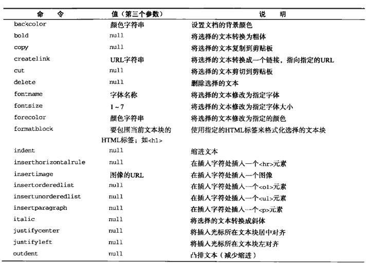

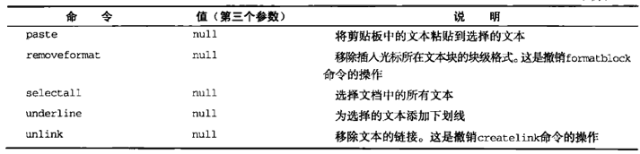

其中，与剪贴板有关的命令在不同浏览器中的差异极大。Opera根本没有实现任何剪贴板命令，而Firefox在默认情况下会禁用它们（必须修改用户的首选项来启用它们）。Safari和Chrome实现了`cut`和`copy`，但没有实现`paste`。不过，即使不能通过`document.execCommand()`来执行这些命令，但却可以通过相应的快捷键来实现同样的操作。

可以在任何时候使用这些命令来修改富文本区域的外观：

```javascript
//转换粗体文本
frames['richedit'].document.execCommand('bold', false, null);

//转换斜体文本
frames['richedit'].document.execCommand('italic', false, null);

//创建指向tc9011.com的链接
frames['richedit'].document.execCommand('createlink', false, 'http://tc9011.com');

//格式化为1级标题
frames['richedit'].document.execCommand('formatblock', false, '<h1>');
```

同样的方法也适用与页面中`contentEditable`属性为`true`的区块，只要把对框架的引用替换成当前窗口的`document`对象即可：

```javascript
//转换粗体文本
document.execCommand('bold', false, null);

//转换斜体文本
document.execCommand('italic', false, null);

//创建指向tc9011.com的链接
document.execCommand('createlink', false, 'http://tc9011.com');

//格式化为1级标题
document.execCommand('formatblock', false, '<h1>');
```

虽然所有浏览器都支持这些命令，但这些命令所产生的HTML仍然有很大不同。由于各个浏览器实现命令的方式不同，加上它们通过`innerHTML`实现转换的方式也不一样，因此不能指望富文本编辑器会产生一致的HTML。

除了命令之外，还有一些与命令相关的方法。第一个方法就是`queryCommandEnabled()`，可以用它来检测是否可以针对当前选择的文本，或者当前插入字符所在位置执行某个命令。这个方法接收一个参数，即要检测的命令。如果当前编辑区域允许执行传入的命令，这个方法返回`true`，否则返回`false`。

```javascript
var result = frames['richedit'].document.queryCommandEnabled('bold');
```

如果能够对当前选择的文本执行`bold`命令，以上代码会返回`true`。需要注意的是`queryCommandEnabled()`方法返回`true`，并不意味着实际上就可以执行相应命令，而只能说明对当前选择的文本执行相应命令是否合适。例如，Firefox在默认情况下会禁用剪切操作，但执行`queryCommandEnabled('cut')`也可能会返回`true`。

另外，`queryCommandState()`方法用于确定是否已将指定命令应用到了选择的文本：

```javascript
var isBold = frames['richedit'].document.queryCommandState('bold');
```

一些功能全面的富文本编辑器，正是利用这个方法来更新粗体、斜体等按钮状态。

最后一个方法是`queryCommandValue()`，用于取得执行命令时传入的值（即前面例子中传给`document.execCommand()`的第三个参数）。

```javascript
var fontSize = frames['richedit'].document.queryCommandValue('fontsize');
```

通过这个方法可以确定某个命令是怎样应用到选择的文本的，可以据以确定再对其应用后续命令是否合适。

### 富文本选区

在富文本编辑器中，使用`iframe`的`getSelection()`方法，可以确定实际选择的文本。这个方法是`window`对象和`document`对象的属性，调用它会返回一个表示当前选择文本的`Selection`对象。每个`Selection`对象都有下列属性：

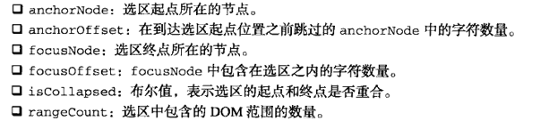

Selection对象的这些属性并没有包含多少有用的信息。好在，该对象的下列方法提供了更多信息，并支持对选区的操作：

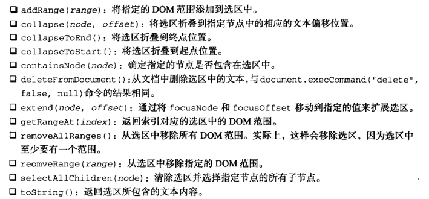

Selection对象的这些方法都极为实用，它们利用了DOM范围来管理选区。由于可以直接操作选择文本的DOM表现，因此访问DOM范围与使用`execCommand()`相比，能够对富文本编辑器进行更加细化的控制：

```javascript
var selection = frames['richedit'].getSelection();

//取得选择文本
var selectedText = selection.toString();

//取得代表选区的范围
var range = selection.getRangeAt(0);

//突出显示选择的文本
var span = frames['richedit'].document.createElement('span');
span.style.backgroundColor = 'yellow';
range.surroundContents(span);
```

以上代码会为富文本编辑器中被选中的文本添加黄色的背景。这里使用了默认选区中的DOM范围，通过`surroundContents()`方法将选区添加到了带有黄色背景的`<span>`元素中。

### 表单与富文本

由于富文本编辑是使用`iframe`而非表单控件实现，因此从技术上说，富文本编辑器并不属于表单。也就是，富文本编辑器中的HTML不会被自动提交给服务器，而需要我们手工来提取并提交HTML。为此，通常可以添加一个隐藏的表单字段，让它的值等于从`iframe`中提取的HTML。

```javascript
EventUtil.addHandler(form, 'submit', function (event) {
  event = EventUtil.getEvent(event);
  var target = EventUtil.getTarget(event);

  target.elements['comments'].value = frames['richedit'].document.body.innerHTML;
});
```

通过文档`body`的`innerHTML`属性取得了`iframe`中的HTML，然后其插入到了名为`comments`的表单字段中。这样可以确保恰好在提交表单之前填充`comments`字段。如果想在代码中通过`submit()`来手工提交表单，那么一定不要忘记事先执行上面的操作。对于`contentEditable`元素，也可以执行类似操作：

```javascript
EventUtil.addHandler(form, 'submit', function (event) {
  event = EventUtil.getEvent(event);
  var target = EventUtil.getTarget(event);

  target.elements['comments'].value = document.getElementById('richedit').innerHTML;
});
```

<iframe src="https://www.xmind.net/embed/pMjN" width="620px" height="540px"></iframe>

# 使用Canvas绘图

## 基本用法

要使用`<canvas>`元素，必须先设置其`width`和`height`属性，指定可以绘图的区域大小。出现在开始和结束标签中的内容是后备信息，如果浏览器不支持`<canvas>`元素，就会显示这些信息。

```html
<canvas id="drawing" width="200" height="200">a drawing of something.</canvas>
```

`<canvas>`元素对应的DOM元素对象也有`width`和`height`属性，可以随意修改。而且也能通过CSS为该元素添加样式，如果不添加任何样式或者不绘制任何图形，在页面中是看不到该元素的。

找`<canvas>`上绘图，需要取得绘图上下文。而取得绘图上下文对象的引用，需要调用`getContext()`方法并传入上下文的名字。传入`2d`，就可以取得2D上下文对象。

```javascript
var drawing = document.getElementById('drawing');

//确定浏览器支持<canvas>
if (drawing.getContext){
  var context = drawing.getContext('2d');
}
```

使用`toDataURL()`方法，可以导出在`<canvas>`元素上绘制的图像。这个方法接受一个参数，即图像的MIME类型格式，而且适合用于创建图像的任何上下文。比如，要取得画布中的一幅PNG格式的图像：

```javascript
var drawing = document.getElementById('drawing');

//确定浏览器支持<canvas>
if (drawing.getContext){
  //        var context = drawing.getContext('2d');

  //取得图像的数据URL
  var imgURL = drawing.toDataURL('image/png');

  //显示图像
  var image = document.createElement('img');
  img.src = imgURL;
  document.body.appendChild(image);
}
```

默认情况下，浏览器会将图像编码为PNG格式（除非另行指定）。Firefox和Opera也支持基于`image/jpeg`参数的JPEG编码格式。

## 2D上下文

使用2D绘图上下文提供的方法，可以绘制简单的2D图形。2D上下文的坐标开始于`<canvas>`元素的左上角，原点坐标是`(0,0)`。所有坐标值都基于这个原点计算，x值越大表示越靠右，y值越大表示越靠下。默认情况下，`width`和`height`表示水平和垂直两个方向上可用的像素数目。

### 填充和描边

2D上下文的两种基本绘图操作是填充和描边。填充，就是用指定的样式填充图形；描边，就是只在图形的边缘画线。大多数2D上下文操作都会细分为填充和描边两个操作，而操作的结果取决于两个属性：`fillStyle`和`strokeStyle`。

这个属性的值可以是字符串、渐变对象或模式对象，而且它们的默认值是`#000000`。如果为它们指定表示颜色的字符串值，可以使用CSS中指定颜色值的任何格式，包括颜色名、十六进制码、rgb、rgba、hsl或hsla。

```javascript
var drawing = document.getElementById('drawing');

//确定浏览器支持<canvas>
if (drawing.getContext){
  var context = drawing.getContext('2d');
  context.strokeStyle = '#FF0000';
  context.fillStyle = '#0000ff';
}
```

### 绘制矩形

矩形是唯一一种可以直接在2D上下文中绘制的形状。与矩形有关的方法包括`fillRect()`、`strokeRect()`和`clearRect()`。这三个方法都能接收4个参数：矩形的x坐标、矩形的y坐标、矩形宽度和矩形高度。这些参数的单位都是像素。

`fillRect()`方法在画布上绘制的矩形会填充指定的颜色。填充的颜色通过`fillStyle`属性指定：

```javascript
var drawing = document.getElementById('drawing');

//确定浏览器支持<canvas>
if (drawing.getContext){
  var context = drawing.getContext('2d');

  //绘制红色矩形
  context.fillStyle = '#ff0000';
  context.fillRect(10, 10, 50, 50);

  //绘制半透明的蓝色矩形
  context.fillStyle = 'rgba(0,0,255,0.5)';
  context.fillRect(30, 30, 50, 50);
}
```

`strokeRect()`方法在画布上绘制的矩形会使用指定的颜色描边。描边颜色通过`strokeStyle`属性指定：

```javascript
var drawing = document.getElementById('drawing');

//确定浏览器支持<canvas>
if (drawing.getContext){
  var context = drawing.getContext('2d');

  //绘制红色描边矩形
  context.strokeStyle = '#ff0000';
  context.strokeRect(10,10,50,50);

  //绘制半透明的蓝色描边矩形
  context.strokeStyle = 'rgba(0,0,255,0.5)';
  context.strokeRect(30,30,50,50);
}
```

描边线条的宽度由`lineWidth`属性控制，该属性的值可以是任意整数。另外，通过`lineCap`属性可以控制线条末端的形状是平头、圆头还是方头（`butt`、`round`或`square`）。通过`lineJoin`属性可以控制线条相交的方式是圆交、斜交还是斜接（`round`、`bevel`或`miter`）。

`clearRect()`方法用于清除画布上的矩形区域。本质上，这个方法可以把绘制上下文中的某一矩形区域变透明。通过绘制形状然后再清除指定区域，就可以生成有意思的效果：

```javascript
var drawing = document.getElementById('drawing');

//确定浏览器支持<canvas>
if (drawing.getContext){
  var context = drawing.getContext('2d');

  //绘制红色矩形
  context.fillStyle = '#ff0000';
  context.fillRect(10, 10, 50, 50);

  //绘制半透明的蓝色矩形
  context.fillStyle = 'rgba(0,0,255,0.5)';
  context.fillRect(30, 30, 50, 50);
  
  //在两个矩形重叠的地方清除一个小矩形
  context.clearRect(40,40,10,10);
}
```


### 绘制路径

2D绘制上下文支持很多在画布上绘制路径的方法。通过路径可以创造出复杂的形状和线条。要绘制路径，首先必须调用`beginPath()`方法，表示要开始绘制新路径。然后，再通过调用下列方法来实际地绘制路径。

* `arc(x,y,radius,startAngle,endAngle,counterclockwise)`：以`(x,y)`为圆心绘制一条弧线，弧线半径为`radius`，起始和结束角度（用弧度表示）分别为`startAngle`和`endAngle`。最后一个参数表示`startAngle`和`endAngle`是否按逆时针方向计算，值为`false`表示按顺时针方向计算
* `arcTo(x1,y1,x2,y2,radius)`：从上一点开始绘制一条弧线，到`(x2,y2)`为止，并且以给定的半径`radius`穿过`(x1,y1)`。
* `bezierCurveTo(c1x,c1y,c2x,c2y,x,y)`：从上一点开始绘制一条曲线，到`(x,y)`为止，并以`(c1x,c1y)`和`(c2x,c2y)`为控制点
* `lineTo(x,y)`：从上一点开始绘制一条直线，到`(x,y)`为止
* `moveTo(x,y)`：将绘图游标移动到`(x,y)`，不画线
* `quadraticCurveTo(cx,cy,x,y)`：从上一点开始绘制一条二次曲线，到`(x,y)`为止，并以`(cx,cy)`作为控制点
* `rect(x,y,width,height)`：从点`(x,y)`开始绘制一个矩形，宽度和高度分别由`width`和`height`指定。这个方法绘制的是矩形路径，而不是`strokeRect()`和`fillRect()`所绘制的独立形状

```javascript
var drawing = document.getElementById('drawing');

//确定浏览器支持<canvas>
if (drawing.getContext){
  var context = drawing.getContext('2d');

  //开始路径
  context.beginPath();

  //绘制外圆
  context.arc(100,100,99,0,2*Math.PI,false);

  //绘制内圆
  context.moveTo(194,100);	//必须把路径移动到外圆上某一个点，避免绘制出多余的线条
  context.arc(100,100,94,0,2*Math.PI,false);

  //绘制分针
  context.moveTo(100,100);
  context.lineTo(100,15);

  //绘制时针
  context.moveTo(100,100);
  context.lineTo(35,100);

  //描边路径
  context.stroke();
}
```

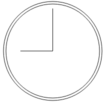

在2D绘图上下文中，路径是一种主要的绘图方式，因为路径能为要绘制的图像提供更多控制。由于路径的使用很频繁，所以就有了一个名为`isPointInPath()`的方法。这个方法接收`x`和`y`坐标作为参数，用于在路径被关闭之前确定画布上的某一点是否位于路径上：

```javascript
if (context.isPointInPath(100,100)){
  alert('point(100,100) is in the path');
}
```

### 绘制文本

绘制文本主要有两个方法：`fillText()`和`strokeText()`。这两个方法都可以接收4个参数：要绘制的文本字符串、x坐标、y坐标和可选的最大像素宽度。而且，这两个方法都以下列3个属性为基础：

* `font`：表示文本样式、大小及字体，用CSS中指定字体的格式来指定，例如`10px Arial`
* `textAlign`：表示文本对齐方式。可能的值有`start`、`end`、`left`、`right`和`center`。建议使用`start`和`end`，不要使用`left`和`right`，因为前两者的意思更稳妥，能同时适合从左到右和从右到左显示的语言
* `textBaseline`：表示文本的基线。可能的值有`top`、`hanging`、`middle`、`alphabetic`、`ideographic`和`bottom`

这几个属性都有默认值，因此没有必要每次使用它们都重新设置一遍。`fillText()`方法使用`fillStyle`属性绘制文本，而`strokeText()`方法使用`strokeStyle`属性为文本描边。相对来说，还是使用`fillText()`的时候更多，因为该方法模仿了在网页中正常显示文本：

```javascript
context.font = 'blod 14px Arial';
context.textAlign = 'center';
context.textBaseline = 'middle';
context.fillText('12', 100, 20);
```

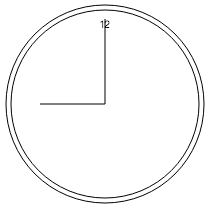

```javascript
//正常
context.font = 'blod 14px Arial';
context.textAlign = 'center';
context.textBaseline = 'middle';
context.fillText('12', 100, 20);

//起点对齐
context.textAlign = 'start';
context.fillText('12',100,40);

//终点对齐
context.textAlign = 'end';
context.fillText('12', 100, 60);
```

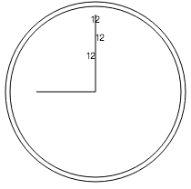

类似地，修改`textBaseline`属性的值可以调整文本的垂直对齐方式：值为`top`，y坐标表示文本顶端；值为`bottom`，y坐标表示文本底端；值为`hanging`、`alphabetic`和`ideographic`，则y坐标分别指向字体的特定基线坐标。

由于绘制文本比较复杂，特别是需要把文本控制在某一区域中的时候，2D上下文提供了辅助确定文本大小的方法`measureText()`。这个方法接收一个参数，即要绘制的文本；返回一个`textMetrics`对象。返回的对象目前只有一个`width`属性，但将来还会增加更多度量属性。

`measureText()`方法利用`font`、`textAlign`和`textBaseline`的当前值计算指定文本的大小。比如，假设你想在一个140像素宽的矩形区域中绘制文本`hello world`，下面代码从100像素的字体大小开始递减，最终会找到合适的字体大小。

```javascript
var fontSize = 100;
context.font = fontSize + 'px Arial';

while (context.measureText('hello world').width > 140){
  fontSize--;
  context.font = fontSize + 'px Arial';
}

context.fillText('hello world', 10, 10);
context.fillText('font size is ' + fontSize + 'px', 10, 50);
```

`fillText()`和`strokeText()`方法都可以接收第四个参数，也就是文本的最大像素宽度。不过，这个可选的参数尚未得到所有浏览器支持。提供这个参数后，调用`fillText()`或`strokeText()`时如果传入的字符串大于最大宽度，则绘制的文本字符的高度正确，但宽度会收缩以适应最大宽度。

### 变换

通过上下文的变换，可以把处理后的图像绘制到画布上。2D绘制上下文支持各种基本的绘制变换。创建绘制上下文时，会以默认值初始化变换矩阵，在默认的变换矩阵下，所有处理都按描述直接绘制。为绘制上下文应用变换，会导致使用不同的变换矩阵应用处理，从而产生不同的结果。

可以通过如下方法来修改变换矩阵：

* `rotate(angle)`：围绕原点旋转图像`angle`弧度
* `scale(scaleX, scaleY)`：缩放图像，在x方向乘以`scaleX`，在y方向乘以`scaleY`。`scaleX`和`scaleY`的默认值都是`1.0`
* `translate(x,y)`：将坐标原点移动到`(x,y)`。执行这个变换之后，坐标`(0,0)`会变成之前由`(x,y)`表示的点
* `transform(m1_1, m1_2, m2_2, dx, dy)`：直接修改变换矩阵，方式是乘以如下矩阵：

```javascript
m1_1    m1_2    dx
m2_1    m2_2    dy
0       0       1
```

* `setTransform(m1_1, m1_2, m2_2, dx, dy)`：将变换矩阵重置为默认状态，然后再调用`transform()`

```javascript
var drawing = document.getElementById('drawing');

//确定浏览器支持<canvas>
if (drawing.getContext){
  var context = drawing.getContext('2d');

  //开始路径
  context.beginPath();

  //绘制外圆
  context.arc(100,100,99,0,2*Math.PI,false);

  //绘制内圆
  context.moveTo(194,100);	
  context.arc(100,100,94,0,2*Math.PI,false);

  //变换原点
  context.translate(100, 100);//通过变换原点来绘制指针
  
  //绘制分针
  context.moveTo(0,0);
  context.lineTo(0,-85);

  //绘制时针
  context.moveTo(0,0);
  context.lineTo(-65,0);

  //描边路径
  context.stroke();
}
```

把原点变换到钟表的中心点`(100, 100)`后，在同一方向上绘制线条就变成了简单的数学问题，所有数学计算都基于`(0, 0)`，而不是`(100, 100)`。还可以用`rotate()`方法旋转时钟的表针：

```javascript
var drawing = document.getElementById('drawing');

//确定浏览器支持<canvas>
if (drawing.getContext){
  var context = drawing.getContext('2d');

  //开始路径
  context.beginPath();

  //绘制外圆
  context.arc(100,100,99,0,2*Math.PI,false);

  //绘制内圆
  context.moveTo(194,100);	
  context.arc(100,100,94,0,2*Math.PI,false);

  //变换原点
  context.translate(100, 100);
  
  //旋转指针
  context.rotate(1);
  
  //绘制分针
  context.moveTo(0,0);
  context.lineTo(0,-85);

  //绘制时针
  context.moveTo(0,0);
  context.lineTo(-65,0);

  //描边路径
  context.stroke();
}
```

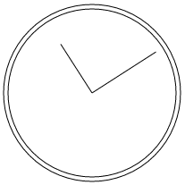

因为原点已经变换到了钟表的中心点，所以旋转也是以该点为圆心的。

无论是刚才执行的变换，还是`fillStyle`、`strokeStyle`等属性，都会在当前上下文中一直有效，除非再对上下文进行什么修改。虽然没有什么办法把上下文中的一切都重置回默认值，但有两个方法可以跟踪上下文的状态变化。如果知道将来要返回某组属性与变换的组合，可以调用`save()`方法。调用这个方法后，当时的所有设置都会进入一个栈结构，得以妥善保管。然后可以对上下文进行其他修改。等想要回到之前保存的设置时，可以调用`restore()`方法，在保存设置的栈结构中向前返回前一级，恢复之前的状态。连续调用`save()`可以把更多设置保存到栈结构中，之后再连续调用`restore()`则可以一级一级返回：

```javascript
context.fillStyle = '#ff0000';
context.save();

context.fillStyle = '#00ff00';
context.translate(100,100);
context.save();

context.fillStyle = '#0000ff';
context.fillRect(0,0,100,200);  //从点（100，100）开始绘制蓝色矩形

context.restore();
context.fillRect(10,10,100,200);    //从点（110， 110）开始绘制绿色矩形

context.restore();

context.fillRect(0, 0, 100, 200);   //从点（0，0）开始绘制红色矩形
```

`save()`方法保存的是对绘图上下文的设置和变换，不会保存绘图上下文的内容。

### 绘制图像

2D绘图上下文内置了对图像的支持。如果想把一幅图像绘制到画布上，可以使用`drawImage()`方法。根据期望的最终结果不同，调用这个方法时，可以使用三种不同的参数组合。最简单的调用方式是传入一个HTML``元素，以及绘制该图像的起点的`x`和`y`坐标：

```javascript
var image = document.images[0];
context.drawImage(image, 10, 10);
```

上面代码中绘制到画布的图像大小与原始大小一样。如果想改变绘制后图像大小，可以再多传入两个参数，分别表示目标宽度和目标高度。通过这种方式来缩放图像并不影响上下文的变换矩阵：

```javascript
context.drawImage(image, 50, 10, 20, 30);
```

此时绘制出来的图像大小会变成20*30像素。

还可以选择把图像中的某个区域绘制到上下文中。`drawImage()`方法的这种调用方式总共需要传入9个参数：要绘制的图像、源图像的`x`坐标、源图像的`y`坐标、源图像的宽度、源图像的高度、目标图像的`x`坐标、目标图像的`y`坐标、目标图像的宽度、目标图像的高度。这样调用`drawImage()`方法可以获得最多的控制：

```javascript
context.drawImage(image, 0, 10, 50, 50, 0, 100, 40, 60);
```

这行代码只会把原始图像的一部分绘制到画布上。原始图像的这一部分的起点为`(0, 10)`，宽和高都是50像素。最终绘制到上下文中的图像的起点是`(0, 100)`，而大小变成40*60像素。

除了给`drawImage()`方法传入HTML``元素外，还可以传入另一个`<canvas>`元素作为其第一个参数。这样，就可以把另一个画布内容绘制到当前画布上。

结合使用`drawImage()`和其他方法，可以对图像进行各种基本操作。而操作的结果可以通过`toDataURL()`方法获得。不过，有一个例外，**即图像不能来自其他域**。如果图像来自其他域，调用`toDataURL()`方法会抛出一个错误。

### 阴影

2D上下文会根据以下几个属性的值，自动为形状或路径绘制出阴影：

* `shadowColor`：用CSS颜色格式表示的阴影颜色，默认为黑色
* `shadowOffsetX`：形状或路径`x`轴方向的阴影偏移量，默认为`0`
* `shadowOffsetY`：形状或路径`y`轴方向的阴影偏移量，默认为`0`
* `shadowBlur`：模糊的像素数，默认为`0`，即不模糊

这些属性都可以通过`context`对象来修改。只要在绘制前为它们设置适当的值，就能自动产生阴影：

```javascript
var context = drawing.getContext('2d');

// 设置阴影
context.shadowOffsetX = 5;
context.shadowOffsetY = 5;
context.shadowBlur = 4;
context.shadowColor = 'rgba(0, 0, 0, 0.5)';

// 绘制红色矩形
context.fillStyle = '#ff0000';
context.fillRect(10, 10, 50, 50);

//绘制蓝色矩形
context.fillStyle = 'rgba(0, 0, 255, 1)';
context.fillRect(30, 30, 50, 50);
```

### 渐变

渐变由`CanvasGradient`实例表示，很容易通过2D上下文来创建和修改。要创建一个新的线性渐变，可以调用`createLinearGradient()`方法。这个方法接收4个参数：起点的`x`坐标、起点的`y`坐标、终点的`x`坐标、终点的`y`坐标。调用这个方法后，它就会创建一个指定大小的渐变，并返回`createLinearGradient`对象的实例。

创建了渐变对象后，就使用`addColorStop()`方法来指定色标。这个方法接收两个参数：色标位置和CSS颜色值。色标位置是一个`0`（开始的颜色）到`1`（结束的颜色）之间的数字：

```javascript
var gradient = context.createLinearGradient(30, 30, 70, 70);

gradient.addColorStop(0, 'white');
gradient.addColorStop(1, 'black');
```

此时，`gradient`对象表示的是一个从画布上点`(30, 30)`到点`(70, 70)`的渐变。起点的色标是白色，终点的色标是黑色。然后就可以把`fillStyle`或`strokeStyle`设置为这个对象：

```javascript
// 绘制红色矩形
context.fillStyle = '#ff0000';
context.fillRect(10, 10,  50, 50);

// 绘制渐变矩形
context.fillStyle = gradient;
context.fillRect(30, 30, 50, 50);
```


这两行代码执行后得到的矩形只有左上角稍微有一点白色。这主要是因为矩形的起点位于渐变的中间位置，而此时渐变差不多已经结束了。由于渐变不重复，所以矩形的大部分区域都是黑色。确保渐变与形状对齐非常重要，有时候可以考虑使用函数来确保坐标合适：

```javascript
function createRectLinearGradient(context, x, y, width, height) {
  return context.createLinearGradient(x, y, x + width, y + height);
}
```

这个函数基于起点的`x`和`y`坐标以及宽度和高度值来创建渐变对象，从而让我们可以在`fillRect()`使用相同的值：

```javascript
var gradient = createRectLinearGradient(context, 30, 30, 50, 50);

gradient.addColorStop(0, 'white');
gradient.addColorStop(1, 'black');

// 绘制渐变矩形
context.fillStyle = gradient;
context.fillRect(30, 30, 50, 50);
```


要创建径向渐变，可以使用`createRadialGradient()`方法。这个方法接收6个参数，对应着两个圆的圆心和半径。前三个参数指定的是起点圆的圆心（`x`和`y`）及半径，后三个参数指定的是终点圆的圆心和半径。

如果想从某个形状的中心点开始创建一个向外扩散的径向渐变效果，就要将两个圆定义为同心圆：

```javascript
var gradient = context.createRadialGradient(55, 55, 10, 55, 55, 30);

gradient.addColorStop(0, 'white');
gradient.addColorStop(1, 'black');

// 绘制红色矩形
context.fillStyle = '#ff0000';
context.fillRect(10, 10,  50, 50);

// 绘制渐变矩形
context.fillStyle = gradient;
context.fillRect(30, 30, 50, 50);
```


### 模式

模式其实就是重复图像，可以用来填充或描边图形。要创建一个新模式，可以调用`createPattern()`方法并传入两个参数：一个HTML``元素和一个表示如何重复图像的字符串。其中，第二个参数的值与CSS的`background-repeat`属性值相同，包括`repeat`、`repeat-x`、`repeat-y`和`no-repeat`：

```javascript
var image = document.images[0];
var pattern = context.createPattern(image, 'repeat');

// 绘制矩形
context.fillStyle = pattern;
context.fillRect(10, 10, 960, 960);
```


需要注意的是，模式和渐变一样，都是从画布的原点`(0, 0)`开始的。将填充样式`fillStyle`设置为模式对象，只表示在某个特定的区域类显示重复的图像，而不是要从某个位置开始绘制重复的图像。

`createPattern()`方法的第一个参数也可以是一个`<video>`元素，或者另一个`<canvas>`元素。

### 使用图像数据

2D上下文的一个明显的长处是可以通过`getImageData()`取得原始图像数据。这个方法接收4个参数：要取得其数据的画面区域的`x`和`y`坐标以及该区域的像素宽度和高度：

```javascript
var imageData = context.getImageData(10, 5, 50, 50);	//取得左上角坐标为(10, 5)、大小为50*50像素的区域的图像数据
```

这里返回的对象是`ImageData`的实例。每个`ImageData`对象都有三个属性：`width`、`height`和`data`。其中`data`属性是一个数组，保存着图像中每一个像素的数据。在`data`数组中，每一个像素用4个元素来保存，分别表示红、绿、蓝和透明度值。

```javascript
var data = imageData.data,
    red = data[0],
    green = data[1],
    blue = data[2],
    alpha = data[3];
```

数组中每个元素的值都介于0到255之间。能够直接访问到原始图像数据，就能够以各种方式来操作这些数据。例如，通过修改图像数据，可以像下面一样创建一个简单的灰阶过滤器：

```javascript
var drawing = document.getElementById('drawing');

// 确定浏览器支持<canvas>元素
if (drawing.getContext){
  var context = drawing.getContext('2d'),
      image = document.images[0],
      imageData, data,
      i, len, average,
      red, green, blue, alpha;

  // 绘制原始图像
  context.drawImage(image, 0, 0);

  // 取得图像数据
  imageData = context.getImageData(0, 0, image.width, image.height);
  data = imageData.data;

  for (i = 0, len = data.length; i < len; i+=4){
    red = data[i];
    green = data[i + 1];
    blue = data[i + 2];
    alpha = data[i + 3];

    // 求得rgb平均值
    average = Math.floor((red + green + blue) / 3);

    // 设置颜色值， 透明度不变
    data[i] = average;
    data[i + 1] = average;
    data[i + 2] = average;

  }

  // 回写图像数据并显示结果
  imageData.data = data;
  context.putImageData(imageData, 0, 0);
}
```

### 合成

还有两个会应用到2D上下文中所有绘制操作的属性：`globalAlpha`和`globalCompositionOperation`。其中，`globalAlpha`是一个介于`0`到`1`之间的值（包括`0`和`1`），用于指定所有绘制的透明度。默认值为`0`。如果所有后续操作都要基于相同的透明度，就可以先把`globalAlpha`设置为适当值，然后绘制，最后再把它设置回默认值`0`：

```javascript
// 绘制红色矩形
context.fillStyle = '#ff0000';
context.fillRect(10, 10, 50, 50);

// 修改全局透明度
context.globalAlpha = 0.5;

// 绘制蓝色矩形
context.fillStyle = 'rgba(0, 0, 255, 1)';
context.fillRect(30, 30, 50, 50);

// 重置全局透明度
context.globalAlpha = 0;
```

`globalCompositionOperation`表示后绘制的图形怎样与先绘制的图形结合。这个属性的值是字符串，可能的值如下：

* `source-over`（默认值）：后绘制的图形位于先绘制的图形上方
* `source-in`：后绘制的图形与先绘制的图形重叠的部分可见，两者其他部分完全透明
* `source-out`：后绘制的图形与先绘制的图形不重叠的部分可见，先绘制的图形完全透明
* `source-atop`：后绘制的图与先绘制的图形重叠的部分可见，先绘制图形不受影响
* `destination-over`：后绘制的图形位于先绘制的图形下方，只有之前透明像素下的部分才可见
* `destination-in`：后绘制的图形位于先绘制的图形下方，两者不重叠的部分完全透明
* `destination-out`：后绘制的图形擦除与先绘制的图形重叠的部分
* `destination-atop`：后绘制的图形位于先绘制的图形下方，在两者不重叠的地方，先绘制的图形会变透明
* `lighter`：后绘制的图形与先绘制的图形重叠部分的值相加，使该部分变亮
* `copy`：后绘制的图形完全代替与之重叠的先绘制图形
* `xor`：后绘制的图形与先绘制的图形重叠部分执行`异或`操作

```javascript
// 绘制红色矩形
context.fillStyle = '#ff0000';
context.fillRect(10, 10, 50, 50);

// 设置合成操作
context.globalCompositeOperation = 'destination-over';

// 绘制蓝色矩形
context.fillStyle = 'rgba(0, 0, 255, 1)';
context.fillRect(30, 30, 50, 50);
```

## WebGL

### 类型化数组

WebGL涉及的复杂计算所需提前知道数值的精度，因此引入了一个概念，叫类型化数组（`typed arrays`）。类型化数组也是数组，只不过其元素被设置为特定类型的值。

类型化数组的核心就是一个名为`ArrayBuffer`的类型。每个`ArrayBuffer`对象表示的只是内存中指定的字节数，但不会指定这些字节用于保存什么类型的数据。通过`ArrayBuffer`所能做的，就是为了将来使用而分配一定数量的字节。例如，下面代码会在内存中分配20B：

```javascript
var buffer = new ArrayBuffer(20);
```

创建了`ArrayBuffer`对象后，能够通过该对象获得的信息只有它包含的字节数，方法是访问其`byteLength`属性：

```javascript
var bytes = buffer.byteLength;
```

##### 视图

使用`ArrayBuffer`（数组缓冲器类型）的一种特别的方式就是用它来创建数组缓冲器视图。其中，最常见的视图是`DataView`，通过它可以选择`ArrayBuffer`中一小段字节。为此，可以创建`DataView`实例的时候传入一个`ArrayBuffer`、一个可选的字节偏移量（从该字节开始选择）和一个可选的要选择的字节数：

```javascript
// 基于整个缓冲器创建一个新视图
var view = new DataView(buffer);

// 创建一个开始于字节9的新视图
var view = new DataView(buffer, 9);

// 创建一个从字节9开始到字节18的新视图
var view = new DataView(buffer, 9, 10);
```

实例化以后，`DataView`对象会把字节偏移量以及字节长度信息分别保存在`byteOffset`和`byteLength`属性中。

```javascript
console.log(view.byteOffset);
console.log(view.byteLength);
```

通过这两个属性可以在以后方便地了解视图的状态。另外，通过其`buffer`属性也可以取得数组缓冲器。

读取和写入`DataView`的时候，要根据实际操作的数据类型，选择相应的`getter`和`setter`方法。下表列出了`DataView`支持的数据类型以及相应的读写方法：

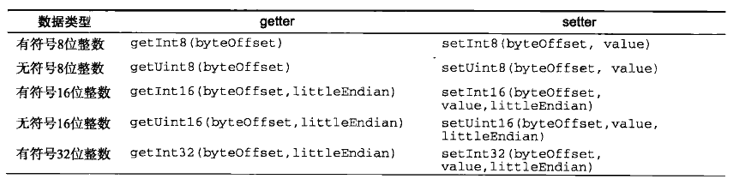

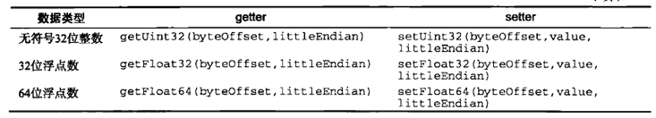

所有这些方法的第一个参数都是第一个字节偏移量，表示要从哪个字节开始读取或写入。要保存有些数据类型的数据，可能需要不止1B。比如，无符号8位整数要用1B，而32位浮点数则要用4B。使用`DataView`，要明确知道自己的数据需要多少字节，并选择正确的读写方法：

```javascript
var buffer = new ArrayBuffer(20);
var view = new DataView(buffer);
var value;

view.setUint16(0, 25);
view.setUint16(2, 50);  // 不能从字节1开始，因为16位整数要用2B
value = view.getUint16(0);
```

以上代码把两个无符号16位整数保存到了数组缓冲器中。因为每个16位整数要用2B，所以保存第一个数的字节偏移量为`0`，而保存第二个数的字节偏移量为`2`。

用于读写16位或更大数值的方法都有一个可选的参数`littleEndian`。这个参数是一个布尔值，表示读写数值时是否采用小端字节序（即将数据的最低有效位保存在低内存地址中），而不是大端字节序（即将数据的最低有效位保存在高内存地址中）。如果不确定使用哪种字节序，就采用默认的大端字节序方式保存即可。

因为这里使用的是字节偏移量，而非数组元素数，所以可以通过几种不同的方式来访问同一字节：

```javascript
var buffer = new ArrayBuffer(20);
var view = new DataView(buffer);
var value;

view.setUint16(0, 25);
value = view.getInt8(0);
console.log(value); // 0
```

上面代码中，数值25以16位无符号整数的形式被写入，字节偏移量为0.然后，再以8位有符号整数的方式读取该数据，得到的结果是0。这是因为25的二进制形式的前八位全部是0：

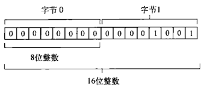


##### 类型化视图

类型化视图一般也被称为类型化数组，因为它们除了元素必须是某种特定的数据类型外，与常规的数组无异。类型化视图也分为几种，而且它们都继承了`DataView`。

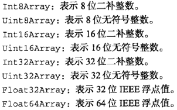

每种视图类型都以不同的方式表示数据，而同一数据视选择的类型不同有可能占用一或多字节。例如，20B的`ArrayBuffer`可以保存20个`Int8Array`或`Uint8Array`，或者10个`Int16Array`或`Uint16Array`，或者5个`Int32Array`、`Uint32Array`或`Float32Array`，或者2个`Float64Array`。

由于这些视图都继承自`DataView`，因而可以使用相同的构造函数参数类实例化。第一个参数是要使用`ArrayBuffer`对象，第二个参数是作为起点的字节偏移量（默认为0），第三个参数是要包含的字节数。三个参数中只有第一个是必须的：

```javascript
// 创建一个新数组，使用整个缓冲器
var int8s = new Int8Array(buffer);

// 只使用从字节9开始的缓冲器
var  int16s = new Int16Array(buffer, 9);

// 只使用从字节9到字节18的缓冲器
var uint16s = new Uint16Array(buffer, 9, 10);
```

能够指定缓冲器中可用的字节段，意味着能在同一个缓冲器中保存不同类型的数值。比如，下面代码就是在缓冲器的开头保存8位整数，而在其他字节中保存16位整数：

```javascript
// 使用缓冲器的一部分保存8位整数，而在其他字节中保存16位整数
var int8s = new Int8Array(buffer, 0, 10);
var uint16s = new Uint16Array(buffer, 11, 10);
```

每个视图构造函数都有一个名为`BYTES_PER_ELEMENT`的属性，表示类型化数组的每个元素需要多少字节。因此，`Uint8Array.BYTES_PER_ELEMENT`就是1，而`Float32Array.BYTES_PER_ELEMENT`则为4。可以利用这个属性来辅助初始化：

```javascript
// 需要10个元素空间
var int8s = new Int8Array(buffer, 0, 10 * Int8Array.BYTES_PER_ELEMENT);

// 需要5个元素空间
var uint16s = new Uint16Array(buffer, int8s.byteOffset + int8s.byteLength, 5 * BYTES_PER_ELEMENT);
```

以上代码基于同一个数组缓冲器创建了两个视图。缓冲器的前10B用于保存8位整数，而其他字节用于保存无符号16位整数。在初始化`Uint16Array`的时候，使用了`Int8Array`的`byteOffset`和`byteLength`属性，以确保`uint16s`开始于8位数据之后。

类型化视图的目的在于简化对二进制数据的操作。除了前面看到的优点之外，创建类型化视图还可以不用首先创建`ArrayBuffer`对象。只要传入希望数组保存的元素数，相应的构造函数就可以自动创建一个包含足够字节数的`ArrayBuffer`对象：

```javascript
// 创建一个数组保存10个8位整数（10字节）
var int8s = new Int8Array(10);

// 创建一个数组保存10个16位整数（20字节）
var int16s = new Int16Array(10);
```

还可以把常规数组转换为类型化视图，只要把常规数组传入类型化视图的构造函数既可：

```javascript
// 创建一个数组保存5个8位整数（10字节）
var int8s = new Int8Array([10, 20, 30, 40, 50]);
```

这是用默认值来初始化类型化视图的最佳方式，也是WebGL项目中最常用的方式。

使用类型化视图时，可以通过方括号语法访问每一个数据成员，可以通过`length`属性确定数组中有多少元素：

```javascript
for (var i = 0, len = int8s.length; i < len; i++){
  console.log('Value at position ' + i + ' is ' + int8s[i]);
}

// Value at position 0 is 10
// Value at position 1 is 20
// Value at position 2 is 30
// Value at position 3 is 40
// Value at position 4 is 50
```

当然也可以使用方括号语法为类型化视图的元素赋值。如果为相应元素指定的字节数放不下相应的值，则实际保存的值是最大可能值的模。例如，无符号16位整数所能表示的最大数值是65535，如果你想保存65536，那实际保存的值是0；如果想保存66537，那实际保存的值是1，依次类推。

数据类型不匹配时不会抛出错误，所以必须自己保证所赋得值不会超过相应元素的字节限制。

类型化视图还有一个方法，即`subarray()`，使用这个方法可以基于底层数组缓冲器的子集创建一个新视图。这个方法接收两个参数：开始元素的索引和可选的结束元素的索引。返回的类型与调用该方法的视图类型相同：

```javascript
var uint16s = new Uint16Array(10),
    sub = uint16s.subarray(2, 5);
```

在以上代码中，`sub`也是`Uint16Array`的一个实例，而且底层与`uint16s`都基于同一个`ArrayBuffer`。通过大视图创建小视图的主要好处是，在操作大数组中的一部分元素时，无需担心意外修改了其他元素。

### WebGL上下文

如果浏览器不支持WebGL，取得该上下文时会返回`null`：

```javascript
var drawing = document.getElementById('drawing');

// 确定浏览器支持<canvas>元素
if (drawing.getContext){
  var gl = drawing.getContext('webgl');		//一般都把WebGL上下文对象命名为gl
  if (gl){
    // 使用WebGL
  }
}
```

WebGL是OpenGL ES2.0的Web版本。

通过给`getContext()`传递第二个参数，可以为WebGL上下文设置一些选项。这个参数本身就是一个对象，可以包含下列属性：

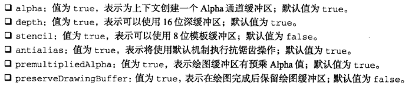

建议确实有必要的情况下再开启这个值，因为可能影响性能。

```javascript
var drawing = document.getElementById('drawing');

// 确定浏览器支持<canvas>元素
if (drawing.getContext){
  var gl = drawing.getContext('webgl', {alpha: false});
  if (gl){
    // 使用WebGL
  }
}
```

大多数时候，各选项默认值就能满足我们的要求。

如果`getContext()`无法创建WebGL上下文，有的浏览器会抛出错误。为此，最好把调用封装到一个`try-catch`块中：

```javascript
var drawing = document.getElementById('drawing');

// 确定浏览器支持<canvas>元素
if (drawing.getContext){
  try {
    var gl = drawing.getContext('webgl');
  }catch (ex) {
    // 什么也不做
  }
  if (gl){
    // 使用WebGL
  }else {
    console.log('webgl context could not be created');
  }
}
```

#### 常量

OpenGL中的常量都带有`GL_`前缀。在WebGL中，保存在上下文对象中的这些常量都没有`GL_`前缀。

#### 方法命名

方法名的后缀会包含参数个数和接收的数据类型（`f`表示浮点数，`i`表示整数）。例如，`gl.uniform4f`意味着要接收4个浮点数。

也有很多方法接收数组参数，这样的方法名字中会包含字母`v`。

#### 准备绘图

在实际操作WebGL上下文之前，一般都要使用某种实色清除`<canvas>`，为绘图做好准备。为此，首先必须使用`clearColor()`方法来指定要使用的颜色值，该方法接收4个参数：红、绿、蓝和透明度。每个参数必须是一个`0`到`1`之间的数值，表示每种分量在最终颜色中的强度：

```javascript
gl.clearColor(0, 0, 0, 1);  // black
gl.clear(gl.COLOR_BUFFER_BIT);
```

以上代码把清理颜色缓冲区的值设置为黑色，然后调用`clear()`方法，这个方法与OpenGL中的`glClear()`等价。传入的参数`gl.COLOR_BUFFER_BIT`告诉WebGL使用之前定义的颜色来填充相应区域。

#### 视口与坐标

开始绘图之前，通常要先定义WebGL的视口。默认情况下，视口可以使用整个`<canvas>`区域。要改变视口大小，可以调用`viewport()`方法并传入4个参数：（视口相对于`<canvas>`元素的）`x`坐标、`y`坐标、宽度和高度：

```javascript
 gl.viewport(0, 0, drawing.width, drawing.height);
```

视口坐标的原点`(0, 0)`在`<canvas>`元素的左下角，`x`轴和`y`轴的正方向分别是向右和向上，最大可以定义为`(width-1, height-1)`。

```javascript
// 视口是<canvas>左下角的四分之一区域
gl.viewport(0, 0, drawing.width/2, drawing.height/2);

// 视口是<canvas>左上角的四分之一区域
gl.viewport(0, drawing.height/2, drawing.width/2, drawing.height/2);

// 视口是<canvas>右下角的四分之一区域
gl.viewport(drawing.width/2, 0, drawing.width/2, drawing.height/2);
```

视口内部的坐标系与视口的坐标系不一样，在视口内部，坐标原点`(0, 0)`是视口的中心点，因此视口左下角坐标为`(-1, -1)`，而左上角坐标为`(1, 1)`。

如果在视口内部是用视口外部的坐标，结果可能会被视口剪切。

#### 缓冲区

顶点信息保存在JavaScript的类型化数组中，使用之前必须转换到WebGL的缓冲区。要创建缓冲区，可以调用`gl.createBuffer()`，然后使用`bindBuffer()`绑定到WebGL上下文。这两步做完之后，就可以用数据来填充缓冲区：

```javascript
var buffer = gl.createBuffer();
gl.bindBuffer(gl.ARRAY_BUFFER, buffer);
gl.bufferData(gl.ARRAY_BUFFER, new Float32Array([0, 0.5, 1]), gl.STATIC_DRAW);
```

调用`gl.bindBuffer()`可以将`buffer`设置为上下文的当前缓冲区。此后，所有缓冲区操作都直接在`buffer`中执行。因此，调用`gl.bindBuffer()`时不需要明确传入`buffer`也没有问题。最后一行代码使用`Float32Array`中的数据初始化了`buffer`。如果想使用`drawElements()`输出缓冲区的内容，也可以传入`gl.ELEMENT_ARRAY_BUFFER`。

`gl.bufferData()`的最后一个参数用于指定使用缓冲区的方式，取值范围是如下几个常量。

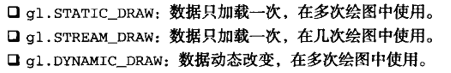

多数情况下，将缓冲区使用方式设置为`gl.STATIC_DRAW`即可。

在包含缓冲区的页面重载之前，缓冲区始终保留在内存中。如果不想要某个缓冲区，直接调用`gl.deleteBuffer()`释放内存。

#### 错误

为了知道是否有错误发生，必须在调用某个可能出错的方法后，手工调用`gl.getError()`方法。这个方法返回一个表示错误类型的常量：

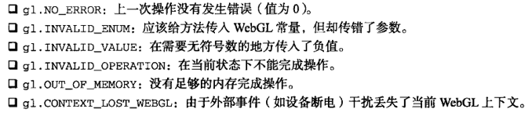

每次调用`gl.getError()`方法返回一个错误值。第一次调用后，后续对`gl.getError()`的调用可能会返回另一个错误值。如果发生多个错误，需要反复调用`gl.getError()`直至它返回`gl.NO_ERROR`。在执行了很多操作的情况下，最好通过一个循环来调用`getError()`：

```javascript
var errorCode = gl.getError();
while (errorCode){
  console.log("error occurred: " + errorCode);
  errorCode = gl.getError();
}
```

#### 着色器

WebGL中有两种着色器：顶点着色器和片段着色器。顶点着色器用于将3D顶点转换为需要渲染的2D点。片段着色器用于准确计算要绘制的每个像素的颜色。这些着色器是使用GLSL写的，是一种与C和JavaScript完全不同的语言。

#### 编写着色器

每个着色器都有一个`main()`方法，该方法在绘图期间会重复执行。为着色器传递数据的方式有两种：`Attribute`和`Uniform`。通过`Attribute`可以向顶点着色器中传入顶点信息，通过`Uniform`可以向任何着色器传入常量值。`Attribute`和`Uniform`在`main()`方法外部定义，分别使用关键字`attribute`和`uniform`。在这两个值类型关键字之后，是数据类型和变量名：

```javascript
// OpenGL着色语言
// 顶点着色器
attribute vec2 aVertexPosition;

void main(){
  gl_Position = vec4(aVertexPosition, 0.0, 1.0);
}

// 片段着色器
uniform vec4 uColor;

void main(){
  gl_FragColor = uColor;
}
```

#### 编写着色器程序

浏览器不能理解GLSL程序，通常是把着色器包含在`<script>`标签内，并为该标签指定一个自定义的`type`属性。由于无法识别`type`属性值，浏览器不会解析`<script>`标签中的内容，但不影响读写其中的代码：

```html
<script type="x-webgl/x-vertex-shader" id="vertexShader">
    attribute vec2 aVertexPosition;

    void main(){
      gl_Position = vec4(aVertexPosition, 0.0, 1.0);
    }
</script>
<script type="x-webgl/x-fragment-shader" id="fragmentShader">
    uniform vec4 uColor;

    void main(){
        gl_FragColor = uColor;
    }
</script>
```

然后通过`text`属性提取出`<script>`元素的内容：

```javascript
var vertexGlsl = document.getElementById('vertexShader').text,
    fragmentGlsl = document.getElementById('fragmentShader').text;
```

复杂一些WebGL应用可能会通过Ajax动态加载着色器。而使用着色器的关键是要有字符串形式的GLSL程序。

取得了GLSL字符串之后，接下来就是创建着色器对象。要创建着色器对象，可以调用`gl.createShader()`方法并传入要创建的着色器类型（`gl.VERTEX_SHADER`或`gl.FRAGMENT_SHADER`）。编译着色器使用的是`gl.compileShader()`：

```javascript
var vertexShader = gl.createShader(gl.VERTEX_SHADER);
gl.shaderSource(vertexShader, vertexGlsl);
gl.compileShader(vertexShader);

var framentShader = gl.createShader(gl.FRAGMENT_SHADER);
gl.shaderSource(framentShader, fragmentGlsl);
gl.compileShader(framentShader);
```

上面代码创建了两个着色器。使用下列代码，可以把这两个对象链接到着色器程序中：

```javascript
var program = gl.createProgram();
gl.attachShader(program, vertexShader);
gl.attachShader(program, framentShader);
gl.linkProgram(program);	// 把两个着色器封装到program变量中

gl.useProgram(program);		// 调用后，所有后续的绘图操作都将使用这个程序
```

#### 为着色器传入值

前面定义的着色器都必须接受一个值才能工作。为了给着色器传入这个值，必须先找到要接受这个值的变量。对于`Uniform`变量，可以使用`gl.getUniformLocation()`，这个方法返回一个对象，表示`Uniform`变量在内存中的位置。然后可以基于变量的位置来赋值：

```javascript
var uColor = gl.getUniformLocation(program, 'uColor');	// 从program中找到Uniform变量uColor，反悔了它在内存中的位置
gl.uniform4fv(uColor, [0, 0, 0, 1]);	// 给uColor赋值
```

`Attribute`变量可以调用`gl.getAttribLocation()`：

```javascript
var aVertexPosition = gl.getAttribLocation(program, 'aVertexPosition');
gl.enableVertexAttribArray(aVertexPosition);
gl.vertexAttribPointer(aVertexPosition, itemSize, gl.FLOAT, false, 0, 0);	//创建了指向gl.bindBuffer()指定的缓冲区的指针，并将其保存在aVertexPosition
```

#### 调试着色器和程序

对于着色器，可以在操作之后调用`gl.getShaderParameter()`，取得着色器的编译状态：

```javascript
if (!gl.getShaderParameter(vertexShader, gl.COMPILE_STATUS)){
  console.log(gl.getShaderInfoLog(vertexShader));
}
```

程序失败最有可能发生在链接过程，要检测链接错误，可以使用下列代码：

```javascript
if (!gl.getProgramParameter(program, gl.LINK_STATUS)){
  console.log(gl.getProgramInfoLog(program));
}
```

#### 绘图

WebGL只能绘制三种形状：点、线和三角。

执行绘图操作要调用`gl.drawArrays()`或`gl.drawElements()`方法，前者用于数组缓冲区，后者用于元素数组缓冲区。

`gl.drawArrays()`或`gl.drawElements()`的第一个参数都是一个常量，表示要绘制的形状。可取值的常量范围包括：

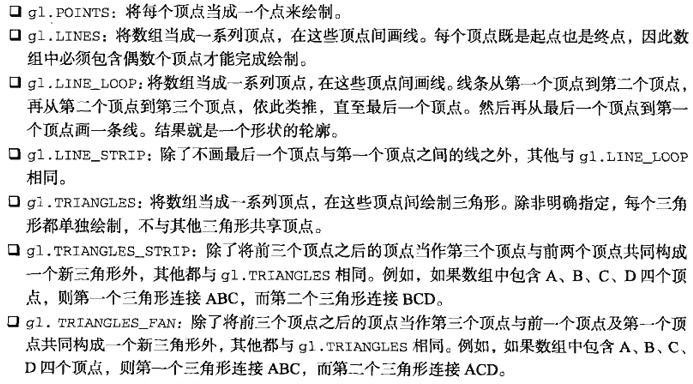

`gl.drawArray()`方法接收上面列出的常量中的一个作为第一个参数，接收数组缓冲区中的起始索引作为第二个参数，接收数组缓冲区中包含的定点数（点的集合数）作为第三个参数：

```javascript
// 假设已经使用前面定义的着色器清楚了视口
// 定义三个顶点以及每个顶点的x和y坐标

var vertices = new Float32Array([0, 1, 1, -1, -1, -1]),
    buffer = gl.createBuffer(),
    vertexSetSize = 2,
    vertexSetCount = vertices.length/vertexSetSize,
    uColor, aVertexPosition;

// 把数据放到缓冲区
gl.bindBuffer(gl.ARRAY_BUFFER, buffer);
gl.bufferData(gl.ARRAY_BUFFER, vertices, gl.STATIC_DRAW);

// 为片段着色器传入颜色值
uColor = gl.getUniformLocation(program, 'uColor');
gl.uniform4fv(uColor, [0, 0, 0, 1]);

// 为着色器传入顶点信息
aVertexPosition = gl.getAttribLocation(program, 'aVertexPosition');
gl.vertexAttribPointer(aVertexPosition, vertexSetSize, gl.FLOAT, false, 0, 0);

// 绘制三角形
gl.drawArrays(gl.TRIANGLES, 0, vertexSetCount);
```

#### 纹理

WebGL的纹理可以使用DOM中的图像。要创建一个新纹理，可以调用`gl.createTexture()`，然后再将一幅图像绑定到该纹理。如果图像尚未加载到内存中，可能需要创建一个`Image`对象的实例，以便动态加载图像。图像加载完成之前，纹理不会初始化，因此，必须在`load`事件触发后才能设置纹理：

```javascript
var image = new Image(),
    texture;
image.src = 'smile.gif';
image.onload = function () {
  texture = gl.createTexture();
  gl.bindTexture(gl.TEXTURE_2D, texture);
  gl.pixelStorei(gl.UNPACK_FLIP_Y_WEBGL, true);

  gl.texImage2D(gl.TEXTURE_2D, 0, gl.RGBA, gl.RGBA, gl.UNSIGNED_BYTE, image);
  gl.texParameteri(gl.TEXTURE_2D, gl.TEXTURE_MAG_FILTER, gl.NEAREST);
  gl.texParameteri(gl.TEXTURE_2D, gl.TEXTURE_MIN_FILTER,gl.NEAREST);
  
  // 清除当前纹理
  gl.bindTexture(gl.TEXTURE_2D, null);
```

`gl.UNPACK_FLIP_Y_WEBGL`是WebGL中独有的常量，在加载Web中的图像时，多数情况下必须使用这个常量。这主要是因为GIF、JPEG和PNG图像与WebGL使用的坐标系不一样，如果没有这个标志，解析图像时就会发生混乱。

用作纹理的图像必须与包含页面来自同一个域，或者保存在启用了CORS的服务器上。

#### 读取像素

读取像素值的方法`readPixels()`与OpenGL中的同名方法只有一点不同，即最后一个参数必须是类型化数组。像素信息是从帧缓冲区读取的，然后保存在类型化数组中。`readPixels()`方法的参数有：`x`、`y`、宽度、高度、图像格式、数据类型和类型化数组。前4个参数指定读取哪个区域中的像素。图像格式参数几乎总是`gl.RGBA`。数据类型参数用于指定保存在类型化数组中的数据类型，但有一下限制：

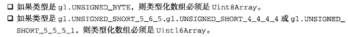

```javascript
var pixels = new Uint8Array(25*25);
gl.readPixels(0, 0, 25, 25, gl.RGBA, gl.UNSIGNED_BYTE, pixels);
```

在浏览器绘制更新的WebGL图像之前调用`readPixels()`不会有什么意外。绘制发生后，帧缓冲区会恢复原始的干净状态，而调用`readPixels()`返回的像素数据反映的就是清除缓冲区后的状态。如果想在绘制发生后读取像素数据，那在初始化WebGL上下文时必须传入适当的`preserveDrawingBuffer`选项。

```javascript
var gl = drawing.getContext('experimental-webgl', {preserveDrawingBuffer: true});
```

设置这个标志的意思是让帧缓冲区在下一次绘制之前，保留其最后的状态。这个选项会导致性能损失，因此能不用最好不用。

## HTML5脚本编程

## 跨文档消息传递

跨文档消息传送（XDM）指的是在来自不同域的页面间传递消息。例如，www.tc9011.com域中的页面与位于一个内嵌框架中的test.tc9011.com域中的页面通信。

XDM的核心就是`postMessage()`方法。在HTML5规范中，除了XDM部分之外的其他部分也会提到这个方法名，但都是为了一个目的：向另一个地方传递数据。对于XDM而言，另一个地方指的是包含在当前页面中的`<iframe>`元素，或者由当前页面弹出的窗口。

`postMessage()`方法接收两个参数：一条消息和一个表示消息接收方来自哪个域的字符串。第二个参数对保障安全通信非常重要，可以防止浏览器把消息发送到不安全的地方：

```javascript
// 注意：所有支持XDM的浏览器也支持iframe的contentWindow属性                      
var iframeWindow = document.getElementById('myframe').contentWin
iframeWindow.postMessage('A secret', 'http://www.tc9011.com');  
```

接收到XDM消息时，会触发`window`对象的`message`事件。这个事件是以异步形式触发的，因此从发送消息到接收消息可能要经过一段时间的延迟。触发`message`事件后，传递给`onmessage`处理程序的事件对象包含以下三方面的重要信息：

* `data`：作为`postMessage()`第一个参数传入的字符串数据
* `origin`：发送消息的文档所在的域
* `source`：发送消息的文档的`window`对象的代理。这个代理对象主要用于在发送上一条消息的窗口中调用`postMessage()`方法。如果发送消息的窗口来自同一个域，那这个对象就是`window`


接收到消息后验证发送窗口的来源是至关重要的。就像给`postMessage()`方法指定第二个参数，以确保浏览器不会把消息发送给未知页面一样。在`onmessage`处理程序中检测消息来源可以确保传入的消息来自已知的页面。

```javascript
EventUtil.addHandler(window, 'message', function (event) {
  // 确保发送消息的域是已知的域
  if (event.origin == 'http://www.tc9011.com'){
    // 处理接收到的数据
    processMessage(event.data);

    // 可选：向来源窗口发送回执
    event.source.postMessage('received', 'http://test.tc9011.com');
  }
});
```

`event.source`大多数情况下只是`window`对象的代理，并非实际的`window`对象，不能通过这个代理对象访问`window`对象的其他任何信息，只能通过这个代理去调用`postMessage()`。

`postMessage()`第一个参数最好只传字符串，如果想传入结构化数据，最好先使用`JSON.stringfy()`，再通过`postMessage()`传入得到字符串，然后再在`onmessage`事件处理程序中调用`JSON.parse()`。

## 原生拖放

### 拖放事件

拖动某个元素时，将依次触发下列事件：

1. `dragstart`
2. `drag`
3. `dragend`

按下鼠标键并开始移动鼠标时，会在被拖放的元素上触发`dragstart`。此时光标变成不能放符号（圆环中有一条反斜杠线），表示不能把元素放到自己上面。拖动开始时，可以通过`ondragstart`事件处理程序来运行JavaScript代码。

触发`dragstart`事件后，随即会触发`drag`事件，而且在元素被拖动期间会持续触发该事件。这个事件与`mousemove`事件相似，在鼠标移动过程中，`mousemove`事件也会持续发生。当拖动停止时，会触发`dragend`事件。

上述三个事件的目标都是被拖动的元素。默认情况下，浏览器不会再拖动期间改变被拖动元素的外观，但你可以自己修改。不过，大多数浏览器会为正被拖动的元素创建一个半透明的副本，这个副本始终跟着光标移动。

当某个元素被拖动到一个有效的放置目标上时，下列事件会一次发生：

1. `dragenter`
2. `dragover`
3. `dragleave`或者`drop`

只要有元素被拖动到放置目标上，就会触发`dragenter`事件。紧随其后的是`dragover`事件，而且被拖动的元素还在放置目标的范围内移动时，就会持续触发该事件。如果元素被放到了放置目标中，则会触发`drop`事件而不是`dragleave`事件。上述三个事件的目标都是作为放置目标的元素。

### 自定义放置目标

在拖动元素经过某些无效放置目标时，可以看到一种特殊的光标，表示不能放置。虽然所有元素都支持放置目标事件，但这些元素默认是不允许放置的。如果拖动元素经过不允许放置的元素，无论用户如何操作，都不会发生`drop`事件。不过，可以把任何元素变成有效的放置目标，方法是重写`dragenter`和`dragover`事件的默认行为。

```html
<div id="droptarget"></div>
```

```javascript
var droptarget = document.getElementById('droptarget');

EventUtil.addHandler(droptarget, 'dropover', function (event) {
  EventUtil.preventDefault(event);
});

EventUtil.addHandler(droptarget, 'dragenter', function (event) {
  EventUtil.preventDefault(event)
});
```

在FIrefox3.5+中，放置事件的默认行为是打开被放到放置目标上的URL。换句话说，如果是把图像拖放到放置目标上，页面就会转向图像文件；而如果是把文本拖放到放置目标上，则会导致无效URL错误。为了让FIrefox支持正常拖放，还要取消`drop`事件的默认行为，阻止它打开URL：

```javascript
EventUtil.addHandler(droptarget, 'drop', function (event) {
  EventUtil.preventDefault(event);
});
```

### dataTransfer对象

为了在拖放操作时实现数据交换，引入了`dataTransfer`对象，它是事件对象的一个属性，用于从被拖动元素向放置目标传递字符串格式的数据。因为它是事件对象的属性，所以只能在拖放事件处理程序中访问`dataTransfer`对象。在事件处理程序中，可以使用这个对象的属性和方法来完善拖放功能。

`dataTransfer`对象有两个主要方法：`getData()`和`setData()`。`getData()`方法可以取得由`setData()`方法保存的值。`setData()`方法的第一个参数，也是`getData()`方法唯一的一个参数，是一个字符串，表示保存的数据类型，取值为各种MIME类型：

```javascript
// 设置和接收文本数据
event.dataTransfer.setData('text/plain', 'some text');
var text = event.dataTransfer.getData('text');

// 设置和接收URL
event.dataTransfer.setData('text/uri-list', 'http:// wwww.tc9011.com/');
var url = event.dataTransfer.getData('URL');
```

保存在`dataTransfer`对象中的数据只能在`drop`事件处理程序中读取。如果`ondrop`处理程序中没有读到数据，那就是`dataTransfer`对象已经被销毁，数据也丢失了。

在拖动文本框中的文本时，浏览器会调用`setData()`方法，将拖动的文本以text格式保存在`dataTransfer`对象中。类似地，在拖放链接或图像时，会调用`setData()`方法并保存URL。然后，在这些元素被拖放到放置目标时，就可以通过`getData()`读到这些数据。当然，作为开发人员，也可以在`datastart`事件处理程序中调用`setData()`，手工保存自己要传输的数据，以便将来使用。

将数据保存为文本和保存为URL是有区别的。如果将数据保存为文本格式，那么数据不会得到任何特殊处理。而如果将数据保存为URL，浏览器会将其当成网页中的链接，如果你把它放置到另一个浏览器窗口中，浏览器会打开该URL。

### dropEffect和effectAllowed

利用`dataTransfer`对象，不关能传输数据，还能通过它来确定被拖动元素以及作为放置目标的元素能够接收什么操作。为此，需要访问`dataTransfer`对象的两个属性：`dropEffect`和`effectAllowed`。

通过`dropEffect`属性可以知道被拖动元素能够执行哪种放置行为。这个属性有下列4个值：

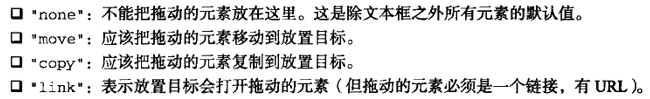

在把元素拖动到放置目标上时，以上每个值都会导致光标显示为不同的符号，然而，要怎么样实现光标所指示的动作完全取决于你。要使用`dropEffect`属性，必须在`ondragenter`事件处理程序中针对放置目标来设置它。

`dropEffect`属性只有搭配`effectAllowed`属性才有用。`effectAllowed`属性表示允许拖动元素的哪种`dropEffect`，`effectAllowed`属性可能的值如下：

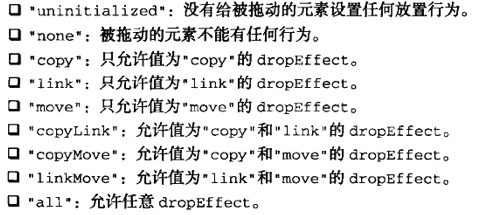

必须在`ondragstart`事件处理程序中设置`effectAllowed`属性。

假设你想允许用户把文本框中的文本拖放到一个`<div>`元素中。首先，必须将`dropEffect`和`effectAllowed`设置为`move`。但是，由于`<div>`元素的放置事件的默认行为是什么也不做，所以文本不可能自动移动。重写整个默认行为，就能从文本框中移走文本。然后就可以自己编写代码将文本插入到`<div>`中。如果将`dropEffect`和`effectAllowed`设置为`copy`，那就不会自动移走文本框中的文本。

### 可拖动

默认情况下，图像、链接和文本是可以拖动的。文本只有在被选中的情况下才能拖动，而图像和链接在任何时候都可以拖动。

让其他元素可以拖动也是可能的。HTML5为所有HTML元素规定了一个`draggable`属性，表示元素是否可以拖动。图像和链接的`draggable`属性自动被设置成了`true`，而其他元素这个属性的默认值都是`false`。

```html
<!--让这个图像不可以拖动-->


<!--让这个元素可以拖动-->
<div draggable="true">...</div>
```

### 其他成员

HTML5规定`dataTransfer`对象还应该包含下列方法和属性：

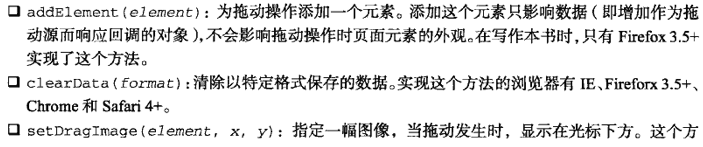

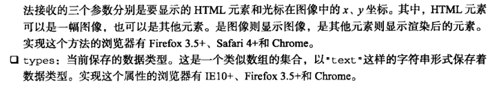

## 媒体元素

`<video>`和`<audio>`除了能让开发人员方便地嵌入媒体文件之外，都提供了用于实现正常功能的JavaScript API，允许为媒体创建自定义的控件：

```html
<!--嵌入视频-->
<video src="test.mp4" id="myVideo">Video player not available.</video>

<!--嵌入音频-->
<audio src="test.mp3" id="myAudio">Audio player not available.</audio>
```

使用这两个元素时，至少要在标签中包含`src`属性，指向要加载的媒体文件。还可以设置`width`和`height`属性以指定视频播放器的大小，而为`poster`属性指定图像的URL可以在加载视频内容期间显示一幅图像。另外，如果标签中有controls属性，则意味着浏览器应该显示UI控件，以便用户直接操作媒体。位于开始和结束标签之间的任何内容都将作为后备内容，在浏览器不支持这两个媒体元素的情况下显示。

因为并非所有浏览器都支持所有媒体格式，所以可以指定多个不同的媒体来源。为此，不用在标签中指定`src`属性，而是要像下面这样使用一或多个`<source>`元素。

```html
<!--嵌入视频-->
<video id="myVideo">
  <source src="test.webm" type="video/webm; codecs='vp8, vorbis'">
  <source src="test.ogv" type="video/ogg; codecs='theora, vorbis'">
  <source src="test.mpg">
  Video player not available.
</video>

<!--嵌入音频-->
<audio id="myAudio">
  <source src="test.ogg" type="audio/ogg">
  <source src="test.mp3" type="audio/mpeg">
  Audio player not available.
</audio>
```

### 属性

`<video>`和`<audio>`元素都提供了完善的JavaScript接口。下表列出了两个元素共有的属性：

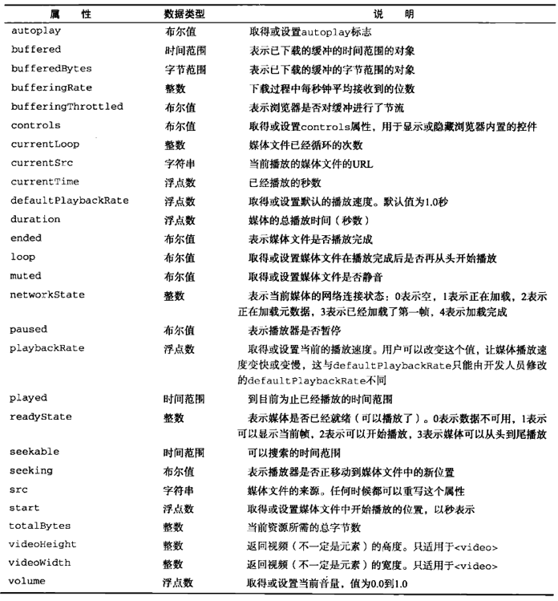

### 事件

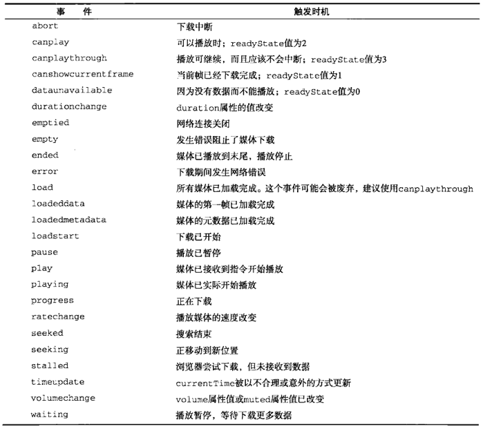

### 自定义媒体播放器

使用`<audio>`和`<video>`元素的`play()`和`pause()`方法，可以手工控制媒体文件的播放。组合使用属性、事件和这两个方法，很容易创建一个自定义的媒体播放器：

```html
<div class="mediaplayer">
  <div class="video">
    <video id="player" src="movie.mov" poster="mymovie.jpg" width="300" height="200">
      video player not available.
    </video>
  </div>
  <div class="controls">
    <input type="button" value="play" id="video-btn">
    <span id="curtime">0</span>/<span id="duration">0</span>
  </div>
</div>
```

```javascript
// 取得元素的引用
var player = document.getElementById('player'),
    btn = document.getElementById('video-btn'),
    curtime = document.getElementById('curtime'),
    duration = document.getElementById('duration');

// 更新播放时间
duration.innerHTML = player.duration;

// 为按钮添加事件处理程序

EventUtil.addHandler(btn, 'click', function (event) {
  if (player.paused){
    player.play();
    btn.value = 'Pause';
  }else {
    player.pause();
    btn.value = 'Play';
  }
});

// 定时更新当前时间
setInterval(function () {
  curtime.innerHTML = player.currentTime;
}, 250);
```

### 检测编解码器的支持情况

`<audio>`和`<video>`元素都有一个`canPlayType()`方法，该方法接收一种格式/编解码器字符串，返回`probably`、`maybe`或`''`(空字符串)。空字符串是假值，因此可以像下面这样在`if`语句中使用`canPlayType()`：

```javascript
if (audio.canPlayType('audio/mpeg')){
  // 进一步处理
}
```

如果给`canPlayType()`传入了一种MIME类型，则返回值很可能是`maybe`或空字符串。这是因为媒体文件本身只不过是音频或视频的一个容器，而真正决定文件能否播放的还是编码的格式。在同时传入MIME类型和编解码器的情况下，可能性就会增加，返回的字符串会变成`probably`。

```javascript
var audio = document.getElementById('audio-player');

// 很可能maybe
if (audio.canPlayType('audio/mpeg')) {
  // 进一步处理
}

// 很可能是probably
if (audio.canPlayType('audio/ogg; codecs="vorbis"')) {
  // 进一步处理
}
```

下面列出了已知的已得到支持的音频/视频格式和其编解码器：

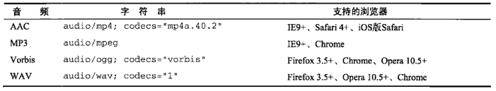

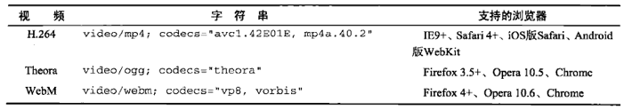

### Audio类型

`<audio>`元素还有一个原生的JavaScript构造函数`Audio`，可以在任何时候播放音频。从同为DOM元素的角度来看，`Audio`和`Image`很相似，但`Audio`不像`Image`那样必须插入到文档中。只要创建一个新实例，并传入音频源文件即可：

```javascript
var audio = new Audio('test.mp3');
EventUtil.addHandler(audio, 'canplaythrough', function (event) {
  audio.play();
});
```

在iOS中，调用`play()`时会弹出一个对话框，得到用户的许可后才能播放声音。如果想在一段音频播放后再播放另一段音频，必须在`onfinish`事件处理程序中调用`play()`方法。

## 历史状态管理

HTML5通过更新`history`对象为管理历史状态提供了方便。通过`hashchange`事件，可以知道URL的参数什么时候发生了变化，即什么时候该有所反应。而通过状态管理API，能够在不加载新页面的情况下改变浏览器的URL。为此，需要使用`history.pushState()`方法，该方法可以接收三个参数：状态对象、新状态的标题和可选的相对URL。

```javascript
history.pushState({name: 'TangCheng'}, "tc's page", 'tc.html');
```

执行`pushState()`方法后，新的状态信息就会被加入历史状态栈，而浏览器地址栏也会变成新的相对URL。但是，浏览器并不会真的向服务器发送请求，即使状态改变之后查询`location.href`也会返回与地址栏中相同的地址。第一个参数应该尽可能提供初始化页面状态所需要的各种信息。

因为`pushState()`会创建新的历史状态，所以后退按钮也能使用。按下后退按钮，会触发`window`对象的`popstate`事件（`popstate`事件发生后，事件对象中的状态对象`event.state`是当前状态）。`popstate`事件的事件对象有一个`state`属性，这个属性就包含着当初第一个参数传递给`pushState()`的状态对象。

```javascript
EventUtil.addHandler(window, 'popstate', function (event) {
  var state = event.state;
  if (state){     // 第一个页面加载时state为空
    processState(state);
  }
});
```

得到这个状态对象后，必须把页面重置为状态对象中的数据表示的状态。浏览器加载的第一个页面没有状态，因此单击后退按钮返回浏览器加载的第一个页面时，`event.state`值为`null`。

要更新当前状态，可以调用`replaceState()`，传入的参数与`pushState()`的前两个参数相同。调用这个方法不会在历史状态栈中创建新的状态，只会重写当前状态。

```javascript
history.replaceState({name: 'www'}, "www'spage");
```

