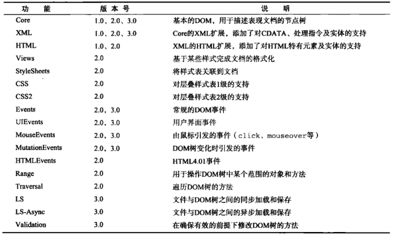
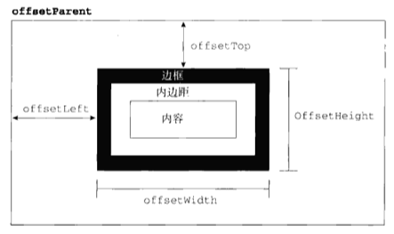
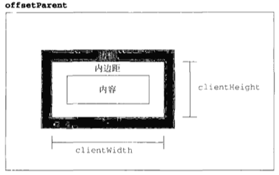
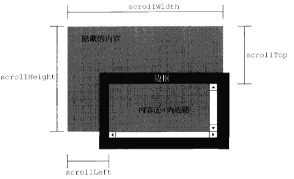
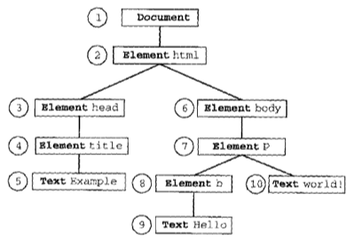
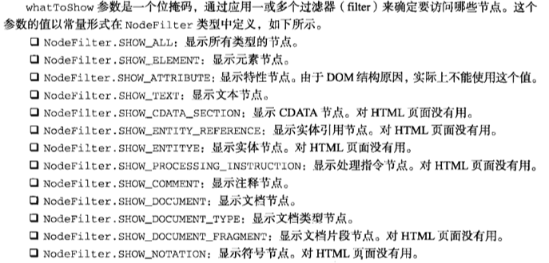
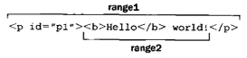
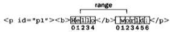
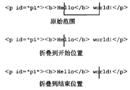
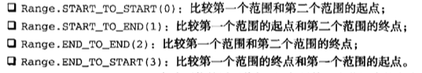

> 第十章：DOM 
>
> 第十一章：DOM扩展
>
> 第十二章：DOM2和DOM3

<!--more-->

# DOM

DOM是针对HTML和XML文档的一个API。DOM描绘了一个层次化的节点树，允许开发人员添加、移除和修改页面的某一部分。

## 节点层次

DOM可以将任何HTML或XML文档描绘成一个由多层节点构成的结构。节点分为几种不同的类型，每种类型分别表示文档中不同的信息及标记。每个节点都拥有各自的特点、数据和方法，另外也与其他节点存在某种关系。节点之间的关系构成了层次，而所有页面标记则表现为一个以特定节点为根节点的树形结构。

文档（Document）节点是每个文档的根节点。文档节点下`<html>`元素称为文档元素。文档元素是文档的最外层元素，文档中的其他所有元素都包含在文档元素中。每个文档只能有一个文档元素。在HTML页面中，文档元素始终是`<html>`元素。在XML中，没有预定义的元素，因此任何元素都可能成为文档元素。

每一段标记都可以通过树中的一个节点来表示：HTML元素通过元素节点表示，特性（attribute）通过特性节点表示，文档类型通过文档类型节点表示，注释通过注释节点表示。总共有12种节点类型，这些类型都继承自一个基类型。

### Node类型

DOM1级定义了一个Node接口，该接口由DOM中的所有节点类型实现。这个Node接口在JavaScript中是作为Node类型实现。除了IE之外，在其他浏览器中都可以访问到这个类型。JavaScript中所有节点类型都继承自Node类型，因此所有节点类型都共享着相同的基本属性和方法。

每个节点都有一个`nodeType`属性，用于表明节点的类型。节点类型由在Node类型中定义的下列12个数值常量来表示，任何节点类型必居其一：

* `Node.ELEMENT_NODE`（1）---表示元素节点
* `Node.ATTRIBUTE_NODE`（2）---表示属性节点
* `Node.TEXT_NODE`（3）---表示文本节点
* `Node.CDATA_SECTION_NODE`（4）---表示文档中的 CDATA 部分（不会由解析器解析的文本）
* `Node.ENTITY_REFERENCE_NODE`（5）---表示实体引用
* `Node.ENTITY_NODE`（6）---表示实体
* `Node.PROCESSING_INSTRUCTION_NODE`（7）---表示处理指令
* `Node.COMMENT_NODE`（8）---表示注释
* `Node.DOCUMENT_NODE`（9）---表示整个文档（DOM 树的根节点）
* `Node.DOCUMENT_TYPE_NODE`（10）---表示向为文档定义的实体提供接口
* `Node.DOCUMENT_FRAGMENT_NODE`（11）---表示代表轻量级的 Document 对象，能够容纳文档的某个部分
* `Node.NOTATION_NODE`（12）---表示DTD 中声明的符号

通过比较上面这些常量可以很容易地确定节点的类型。然而由于IE中没有公开Node类型的构造函数，因此最好还是将`nodeType`属性与数字值进行比较：

```javascript
if (someNode.nodeType == 1) {
  console.log('Node is an element');
}
```

#### nodeName和nodeValue属性

用`nodeName`和`nodeValue`属性可以了解节点的具体信息，其值完全取决于节点的类型。在使用这两个值之前，最好像下面这样先检测一下节点类型：

```javascript
if (someNode.nodeType == 1) {
  value = someNode.nodeName;		//nodeName的值是元素的标签名
}
```

对于元素节点，`nodeName`中保存的始终都是元素的标签名，而`nodeValue`的值则始终为`null`。

#### 节点关系

每个节点都有一个`childNodes`属性，其中保存着一个`NodeList`对象。`NodeList`是一种类数组对象，用于保存一组有序的节点，可以通过位置来访问这些节点。

虽然可以用方括号语法来访问`NodeList`的值，而且这个对象也有`length`属性，但它并不是`Array`的实例。

`NodeList`对象的独特之处在于，它实际上是基于DOM结构动态执行查询的结果，因此DOM结构的变化能够自动反映在`NodeList`对象中。

可以通过方括号或者`item()`方法访问保存在`NodeList`中的节点：

```javascript
var firstChild = someNode.childNodes[0];
var secondChild = someNode.childNodes.item(1);
```

`length`属性表示的是访问`NodeList`的那一刻，其中包含的节点数量。

对`arguments`对象使用`Array.prototype.slice()`方法可以将其转换为数组。采用同样的方法，也可以将`NodeList`对象转换为数组：

```javascript
//在IE8及之前版本中无效
var arrayOfNodes = Array.prototype.slice.call(someNode.children,0);
```

每个节点都有一个`parentNode`属性，该属性指向文档树中的父节点。在包含`childNodes`列表中的所有节点都具有相同的父节点，因此它们的`parentNode`属性都指向同一个节点。列表中第一个节点的`previousSibling`属性值为`null`，而列表中最后一个节点的`nextSibling`属性的值同样也为`null`。

父节点的`firstChild`和`lastChild`属性分别指向列表中的第一个和最后一个节点，`someNode.firstChild`的值和`someNode.childNodes[0]`始终相等，`someNode.lastChild`的值和`someNode.childNodes[someNode.childNodes.length-1]`的值始终相等。在只有一个子节点的情况下，`firstChild`和`lastChild`指向同一个节点，如果没有子节点，`firstChild`和`lastChild`的值均为`null`。

`hasChildNodes()`方法在节点包含一或多个子节点的情况下返回`true`。

所有节点都有一个`ownerDocument`属性，该属性指向整个文档的文档节点。这种关系表示的是任何节点都属于它所在的文档，任何节点都不能同时存在于两个或更多个文档中。通过这个属性，可以直接访问文档节点，而不必在节点层次中通过层层回溯到达顶端。

#### 操作节点

* `appendChild()`方法用于向`childNodes`列表的末尾添加一个节点。添加节点后，`childNodes`的新增节点、父节点以及以前的最后一个子节点的关系指针都会相应地得到更新。更新完成后，`appendChild()`返回新增的节点：

```javascript
var returnedNode = someNode.appendChild(newNode);
console.log(returnedNode == newNode);			//true
console.log(someNode.lastChild == newNode);		//true
```

如果传入到`appendChild()`中的节点已经是文档的一部分，那结果就是将该节点从原来的位置转移到新位置。即使可以将DOM树看成由一系列指针连接起来，但任何DOM节点也不能同时出现在文档中的多个位置上。因此，如果在调用`appendChild()`时传入了父节点的第一个子节点，那么该节点就会成为父节点的最后一个子节点：

```javascript
//someNode有多个子节点
var returnedNode = someNode.appendChild(someNode.firstChild);
console.log(returnedNode == someNode.firstChild);   //false
console.log(returnedNode == someNode.lastChild);    //true
```

* `insertBefore()`方法可以把节点放在`childNodes`列表中某个特定的位置上。这个方法接收两个参数：要插入的节点和作为参照的节点。插入节点后，被插入的节点会变成参照节点的前一个同胞节点（`previousSibling`），同时被方法返回。如果参照节点是`null`，则`insertBefore()`与`appendChild()`执行相同的操作：

```javascript
//插入后成为最后一个子节点
returnedNode = someNode.insertBefore(newNode,null);
console.log(newNode == someNode.lastChild);		//true

//插入后成为第一个子节点
var returnedNode = someNode.insertBerfore(newNode,smeNode.firstChild);
console.log(returnedNode == newNode);			//true
console.log(newNode == someNode.firstChild);	//true

//插入到最后一个子节点前面
returnedNode == someNode.insertBefore(newNode,someNode.lastChild);
console.log(newNode == someNode.childNodes[someNode.childNodes.length-2]);	//true
```

* `replaceChild()`方法接受两个参数：要插入的节点和要替换的节点。要替换的节点将由这个方法返回并从文档树中被移除，同时由要插入的节点占据其位置。

使用`replaceChild()`插入一个节点时，该节点的所有关系指针都会从被它替换的节点复制过来。尽管从技术上将，被替换的节点仍然还在文档中，但它在文档中已经没有了自己的位置。

* `removeChild()`方法接受一个参数，即要移除的节点。被移除的节点将成为方法的返回值。通过`removeChild()`移除的节点仍然为文档所有，只不过在文档中已经没有了自己的位置。

上面这些方法都必须先取得父节点。另外，并不是所有类型的节点都有子节点，如果在不支持子节点的节点上调用了这些方法，将会导致错误发生。

#### 其他方法

`cloneNode()`方法用于创建调用这个方法的节点的一个完全相同的副本，它接收一个布尔值参数，表示是否执行深复制。在参数为`true`的情况下，执行深复制，也就是复制节点及整个子节点树；在参数为`false`的情况下，执行浅复制，即只复制节点本身。复制后返回的节点副本属于文档所有，但并没有为它指定父节点，因此，这个节点副本就成了一个孤儿，除非通过`appendChild()`、`insertBerfore()`或`replaceChild()`将它添加到文档中。

```html
<ul>
  <li>item 1</li>
  <li>item 2</li>
  <li>item 3</li>
</ul>
```

```javascript
var myList = document.getElementsByTagName('ul');
var deepList = myList.cloneNode(true);
console.log(deepList.childNodes.length);	//3（IE<9）或7（其他浏览器）

var shallowList = myList.cloneNode(false);
console.log(shallowList.childNodes.length)	//0
```

`cloneNode()`方法不会复制添加到DOM节点中的JavaScript属性，这个方法只会复制特性、（在明确指定的情况下也复制）子节点。

`normalize()`方法用于处理文档树中的文本节点。由于解析器的实现或DOM操作等原因，可能会出现文本节点不包含文本，或者接连出现两个文本节点的情况。当在某个节点上调用这个方法时，就会在该节点的后代节点中查找上述两种情况。如果找到了空文本节点，则删除它，如果找到相邻的文本节点，则将它们合并为一个文本节点。

### Document类型

JavaScript通过Document类型表示文档。在浏览器中，`document`对象是`HTMLDocument`（继承自Document类型）的一个实例，表示整个HTML页面。而且，`document`对象是`window`对象的一个属性，因此可以将其作为全局对象来访问。

Document节点具有下列特征：

* `nodeType`的值为9
* `nodeName`的值为`#document`
* `nodeValue`的值为`null`
* `parentNode`的值为`null`
* `ownerDocument`的值`null`
* 其子节点可能是一个DocumentType（最多一个）、Element（最多一个）、ProcessingInstruction或Comment

Document类型可以表示HTML页面或者其他基于XML的文档。最常见的应用是作为HTMLDocument实例的`document`对象。通过这个文档对象，不仅可以获得与页面相关的信息，而且还能操作页面的外观及其底层结构。

#### 文档的子节点

`documentElement`属性始终指向HTML页面中的`<html>`元素。

通过`childNodes`列表可以访问文档元素。

`document.documentElement`、`document.firstChild`和`document.childNodes[0]`的值相同，都指向`<html>`元素。

作为HTMLDocument的实例，`document`对象还有一个`body`属性，直接指向`<body>`元素。

所有浏览器都支持`document.documentElement`和`document.body`属性。

通常将`<!DOCTYPE>`标签看成一个与文档其他部分不同的实体，可以通过`doctype`（在浏览器中是`document.doctype`）属性来访问它的信息。

#### 文档信息

作为HTMLDocument的一个实例，`document`对象还有一些标准的`Document`对象所没有的属性。这些属性提供了`document`对象所表现的网页的一些信息。

其中第一个属性就是`title`，包含着`<title>`元素中的文本。通过这个属性可以取得当前页面的标题，也可以修改当前页面的标题并反映在浏览器的标题栏中。

```javascript
//取得文档标题
var originalTitle = document.title;

//设置文档标题
document.title = 'new title';
```

接下来三个属性都与对网页的请求有关，它们是`URL`、`domain`和`referrer`。`URL`属性中包含页面完整的URL；`domain`属性中只包含页面的域名；`referrer`属性中保存着链接到当前页面的那个页面的URL，在没有来源页面的情况下，`referrer`属性中可能会包含空字符串。所有这些信息都存在于请求的HTTP头部，只不过这些属性让我们能够在JavaScript中访问它们而已。

```javascript
//取得完整的URL
var url = document.URL;

//取得域名
var domain = document.domain;

//取得来源页面的URL
var referrer = document.referrer;
```

这三个属性中，只有`domain`是可以设置的。但由于安全方面的限制，也并非可以给`domain`设置任何值。如果URL中包含一个子域名，例如p2p.wrox.com，那么就只能将`domain`设置为wrox.com。不能将这个属性设置为URL中不包含的域。

当页面中包含来自其他子域的框架或内嵌框架时，能够设置`document.domain`就非常方便。由于跨域安全限制，来自不同子域的页面无法通过JavaScript通信。而通过将每个页面的`document.domain`设置为相同的值，这些页面就可以互相访问对方包含的JavaScript对象。

浏览器对`domain`属性还有一个限制，即如果域名一开始是松散的（loose），那么不能将它再设置为紧绷的（tight）。也就是说，在将`document.domain`设置为`wrox.com`之后，就不能再将其设置回`p2p.wrox.com`，否则将会导致错误。在所有浏览器中都存在这个限制。

```javascript
//假设页面来自于p2p.wrox.com域
document.domain = 'wrox.com';			//松散的(成功)
document.domain = 'p2p.wrox.com';		//紧绷的(出错)
```

#### 查找元素

`getElementById()`方法接收一个参数：要取得的元素的ID。如果找到相应的元素则返回该元素，如果不存在则返回`null`。这里的ID必须与页面中的`id`特性（attribute）严格匹配。

如果页面中多个元素的ID值相同，`getElementById()`只返回文档中第一次出现的元素。

`getElementsByTagName()`方法接收一个参数：即要取得元素的标签名，返回的是包含零或多个元素的`NodeList`。在HTML文档中，这个方法会返回一个`HTMLCollection`对象，作为一个动态集合，该对象与`NodeList`非常相似。可以使用方括号语法或`item()`方法来访问`HTMLCollection`对象中的项。这个对象中元素的数量则可以通过其`length`属性取得。

`HTMLCollection`对象还有一个方法叫`namedItem()`，使用这个方法可以通过元素的`name`特性取得集合中的项。

```html

```

```javascript
var images = document.getElementsByTagName('img');
var myImage = images.namedItem('myImage');
```

在提供索引访问的基础上，`HTMLCollection`还支持按名称访问项，对命名的项也可以使用方括号语法来访问，可以向方括号中传入数值或字符串形式的索引值，在后台，对数值索引就会调用`item()`，对字符索引就会调用`namedIten()`：

```javascript
var myImage = images['myImage'];
```

要想取得文档中所有元素，可以向`getElementsByTagName()`中传入`*`。在JavaScript及CSS中，`*`通常表示全部。

`getElementsByName()`方法是只有HTMLDocument类型才有的方法。这个方法会返回带有给定`name`特性的所有元素。最常使用`getElementsBuName()`方法的情况是取得单选按钮，为了确保发送给浏览器的值准确无误，所有单选按钮必须具有相同的`name`特性：

```html
<div>
  <p>which color do you prefer?</p>
  <ul>
    <li><input type='radio' value='red' name='color' id='colorRed'><label for='colorRed'>Red</label></li>
    <li><input type='radio' value='green' name='color' id='colorGreen'><label for='colorGreen'>Green</label></li>
    <li><input type='radio' value='blue' name='color' id='colorBlue'><label for='colorBlue'>Blue</label></li>
  </ul>
</div>
```

```javascript
var radio = document.getElementsByName('color');
```

`getElementsByName()`方法也会返回一个HTMLCollection。但对这里的单选按钮来说，`nameItem()`方法只会取得第一项（因为每一项的`name`特性都相同）。

#### 特殊集合

`document`对象还有一些特殊的集合，这些集合都是HTMLCollection对象，为访问文档常用的部分提供了快捷方式：

* `document.anchors`：包含文档中所有带`name`特性的`<a>`元素
* `document.forms`：包含文档中所有的`<form>`元素
* `document.images`：包含所有的``元素
* `document.links`：包含文档中所有带`href`特性的`<a>`元素

这个特殊集合始终都可以通过HTMLDocument对象访问到，而且，与HTMLCollection对象类似，集合中的项也会随着当前文档内容的更新而更新。

#### DOM一致性检测

由于DOM分为多个级别，也包含多个部分，因此检测浏览器实现了DOM的哪些部分就十分必要。`document.implementation`属性就是为此提供相应信息和功能的对象，与浏览器对DOM的实现直接对应。

DOM1级只为`document.implementation`规定了一个方法：`hasFeature()`。这个方法接收两个参数：要检测的DOM功能的名称及版本号。如果浏览器支持给定名称和版本功能，则该方法返回`true`：

```javascript
var hasXmlDom = document.implementation.hasFeature('XML','1.0');
```

下边列出了可以检测的不同的值和版本号：



`hasFeature()`返回`true`有时候不意味着实现与规范一致，建议在使用DOM某些特殊的功能之前，最好除了检测`hasFeature()`之外，还同时使用能力检测。

#### 文档写入

`write()`、`writeln()`、`open()`和`close()`方法将输出流写入到网页中。

`write()`和`writeln()`方法都接受一个字符串参数，即要写入到输出流中的文本。`write()`会原样写入，`writeln()`会在字符串的末尾添加一个换行符`\n`。在页面被加载过程中，可以使用这两个方法向页面中动态地加入内容。

使用`write()`和`writeln()`方法可以动态地包含外部资源。在包含JavaScript文件时，必须注意不能直接包含字符串`</script>`，这会导致字符串被解释为脚本块的结束，它后面的代码将无法执行。为了避免这个问题，只要把这个字符串分开写即可：

```html
<script>
	document.write('<script src="file.js">' + '<\/script>');
</script>
```

字符串`<\/script>`不会被当作外部`<script>`标签的关闭标签。

如果在文档加载结束后再调用`document.write()`，那么输出的内容将会重写整个页面：

```html
<html>
<head>
	<title>example</title>  
</head>
<body>
  <p>this is some content that you won't get to see because it will be overwritten.</p>
  <script>
  	window.onload = function(){
      document.write('hello world');
  	}
  </script>
</body>
</html>
```

`open()`和`close()`方法分别用于打开和关闭网页的输出流。如果页面加载期间使用`write()`或`writeln()`方法，则不需要用到这两个方法。

### Element类型

Element类型用于表现XML或HTML元素，提供了对元素标签名、子节点及特性的访问。Element节点具有以下特征：

* `nodeType`的值为1
* `nodeName`的值为元素的标签名
* `nodeValue`的值为`null`
* `parentNode`可能是`Document`或`Element`
* 其子节点可能是`Element`、`Text`、`Comment`、`ProcessingInstruction`、`CDATASection`或`EntityReference`

要访问元素的标签名，可以使用`nodeName`属性，也可以使用`tagName`属性，这两个属性会返回相同的值：

```html
<div id='myDiv'></div>
```

```javascript
var div = document.getElementById('myDiv');
console.log(div.tagName);					//DIV
console.log(div.tagName == div.nodeName);	//true
```

在HTML中，标签名始终都以全部大写表示，在XML中，标签名始终会与源码中的保持一致。最好在比较之前将标签名转换为相同的大小写形式。

#### HTML元素

所有HTML元素都由HTMLElement类型表示，不是直接通过这个类型，也是通过它的子类型来表示。HTMLElement类型直接继承自Element并添加了一些属性。添加的这些属性分别对应于每个HTML元素中都存在的下列标准特性：

* `id`：元素在文档中的唯一标识符
* `title`：有关元素的附加说明信息，一般通过工具提示条显示出来
* `lang`：元素内容的语言代码，很少使用
* `dir`：语言的方向，值为`ltr`（left-to-right，从左至右）或`rtl`（right-to-left，从右至左）
* `className`：与元素的`class`特性对应，即为元素指定的CSS类。

上述这些属性都可以用来取得或修改相应的特性值：

```html
<div id='myDiv' class='bd' title='Body text' lang='en' dir='ltr'></div>
```

```javascript
var div = document.getElementById('myDiv');
console.log(div.id);			//myDiv
console.log(div.title);			//Body text
console.log(div.lang);			//en
console.log(div.dir);			//ltr
console.log(div.className);		//bd
```

#### 取得特性

每个元素都有一或多个特性，这些特性的用途是给出相应元素或其内容的附加信息。操作特性的DOM方法主要有三个，分别是`getAttribute()`、`setAttribute()`和`removeAttribute()`。这三个方法可以针对任何特性使用，包括那些以HTMLElement类型属性的形式定义的特性：

```javascript
var div = document.getElementById('myDiv');
console.log(div.getAttribute('id'));			//myDiv
console.log(div.getAttribute('title'));			//Body text
console.log(div.getAttribute('lang'));			//en
console.log(div.getAttribute('dir'));			//ltr
console.log(div.getAttribute('class'));			//bd
```

通过`getAttribute()`方法也可以取得自定义特性的值：

```html
<div id="myDiv" my_special_attribute="hello"></div>
```

```javascript
var value = div.getAttribute('my_special_attribute');
```

特性（attribute）的名称是不区分大小写的，`ID`和`id`代表的都是同一个特性。

根据HTML5规范，自定义特性应该加上`data-`前缀以便验证。

任何元素的所有特性，也都可以通过DOM元素本身的属性来访问。不过，只有公认的（非自定义的）特性才会以属性的形式添加到DOM对象中：

```html
<div id="myDiv" align='left' my_special_attribute="hello"></div>
```

```javascript
console.log(div.id);							//myDiv
console.log(div.my_special_attribute);			//undefined(IE除外)
console,log(div.align);							//left
```

有两类特殊的特性，它们虽然有对应的属性名，但属性的值与通过`getAttribute()`返回的值并不相同：

* 第一类特性就是`style`，用于通过CSS为元素指定样式。在通过`getAttribute()`访问时，返回的`style`特性值中包含的是CSS文本，而通过属性来访问它则会返回一个对象。由于`style`属性是以编程方式访问元素样式，因此并没有直接映射到`style`特性。
* 第二类特性是`onclick`这样的事件处理程序。当在元素上使用时，`onclick`特性中包含的是JavaScript代码，如果通过`getAttribute()`访问，则会返回相应代码的字符串。而在访问`onclick`属性时，则会返回一个JavaScript函数（如果未在元素中指定相应特性，则返回`null`）。这是因为`onclick`及其他事件处理程序属性本身就应该被赋予函数值。

由于存在这些差别，在通过JavaScript以编程方式操作DOM时，开发人员经常不使用`getAttribute()`，而是使用对象的属性，只有在取得自定义特性值的情况下，才会使用`getAttribute()`方法。

#### 设置特性

`setAttribute()`方法接受两个参数：要设置的特性名和值。

如果特性已经存在，`setAttribute()`会以指定的值替换现有的值；如果特性不存在，`setAttribute()`则创建该属性并设置相应的值：

```javascript
div.setAttribute('id','someOtherId');
div.setAttribute('class','ft');
div.setAttribute('title','Some other text');
div.setAttribute('lang','fr');
div.setAttribute('dir','rtl');
```

通过`setAttribute()`方法既可以操作HTML特性也可以操作自定义特性。通过这个方法设置的特性名会被统一转换为小写形式。

因为所有特性都是属性，所以直接给属性赋值可以设置特性的值。

不过像下面这样为DOM元素添加一个自定义属性，该属性不会自动成为元素的特性：

```javascript
div.mycolor = 'red';
console.log(div.getAttribute('mycolor'));	//null(IE除外)
```

`removeAttribute()`方法用于彻底删除元素的特性。调用这个方法不仅会清除特性的值，而且也会从元素中完全删除特性。

#### attribute属性

Element类型是使用`attributes`属性的唯一一个DOM节点类型。`attrubutes`属性中包含一个`NamedNodeMap`，与`NodeList`类似，也是一个动态的集合。元素的每一个特性都由一个`Attr`节点表示，每个节点都保存在`NamedNodeMap`对象中。`NamedNodeMap`对象拥有下列方法：

* `getNamedItem(name)`：返回`nodeName`属性等于`name`的节点
* `removeNamedItem(name)`：从列表中移除`nodeName`属性等于`name`的节点
* `setNamedItem(node)`：向列表中添加节点，以节点的`nodeName`属性为索引
* `item(pos)`：返回位于数字`pos`位置处的节点

`attributes`属性中包含一系列节点，每个节点的`nodeName`就是特性的名称，而节点的`nodeValue`就是特性的值。要取得元素的`id`特性，可以使用下面代码：

```javascript
var id = element.attributes.getNamedItem('id').nodeValue;
```

下面是使用方括号语法通过特性名称访问节点的简写方式：

```javascript
var id = element.attributes['id'].nodeValue;
```

也可以使用下面这种语法来设置特性的值，即先取得特性节点，然后再将其`nodeValue`设置为新值：

```javascript
element.attributes['id'].nodeValue = 'someOtherId';
```

调用`removeNamedItem()`方法与在元素上调用`removeAttribute()`方法的效果相同：直接删除具有给定名称的特性。两个方法唯一的区别就是`removeNamedItem()`会返回表示被删除特性的`Attr`节点。

`setNamedItem()`是一个不常用的方法，通过这个方法可以为元素添加一个新特性，为此需要为它传入一个特性节点。

一般来说，`attributes`方法不够方便，因此开发人员会更多的使用`getAttribute()`、`removeAttribute()`和`setAttribute()`方法。

如果想要遍历元素的特性，`attributes`属性倒是可以派上用场。在需要将DOM结构序列化为XML或HTML字符串时，多数会涉及遍历元素特性。下面代码迭代元素的每个特性，然后将它们构造成`name='value' name='value'`这样的字符串格式：

```javascript
function outputAttributes(element){
  var pairs = new Array(),
      attrName,
      attrValue,
      i,
      len;
  
  for (i = 0, len = element.attributes.length; i < len; i++){
    attrName = element.attributes[i].nodeName;
    attrValue = element.attributes[i].nodeValue;
    pairs.push(attrName + '="' + attrValue + '"');
  }
  return pairs.join(" ");
}
```

针对`attributes`对象中的特性，不同浏览器返回的顺序不同。这些特性在XML或HTML代码中出现的先后顺序，不一定与它们出现在`attributes`对象中的顺序一致。

#### 创建元素

使用`document.createElement()`方法可以创建新元素。这个方法只接受一个参数，即要创建元素的标签名。这个标签名在HTML文档中不区分大小写，而在XML文档中，则是区分大小写的。

在使用`createElement()`方法创建新元素的同时，也为新元素设置了`ownerDocument`属性。此时，还可以操作元素的特性，为它添加更多子节点以及执行其他操作：

```javascript
var div = document.createElement('div');
div.id = 'myNewDiv';
div.className = 'box';
```

在新元素上设置这些特性只是给它们赋予了相应的信息。由于新元素尚未被添加到文档树中，因此设置这些特性不会影响浏览器的显示。要把新元素添加到文档树中，可以使用`appendChild()`、`insertBefore()`或`replaceChild()`方法。

一旦将元素添加到文档树中，浏览器就会立刻呈现该元素。

#### 元素的子节点

`childNodes`属性中包含了元素的所有子节点，这些子节点可能是元素、文本节点、注释或处理指令。不同浏览器在看待这些节点方面存在显著的不同。以下面代码为例：

```html
<ul id='myList'>
  <li>Item 1</li>
  <li>Item 2</li>
  <li>Item 3</li>
</ul>
```

如果IE来解析上面代码，那么`<ul>`元素会有3个子节点，分别是3个`<li>`元素。但如果是在其他浏览器中，`<ul>`元素都会有7个元素，包括3个`<li>`元素和4个文本节点（表示`<li>`元素之间的空白符）。如果需要通过`childNodes`属性遍历子节点，一定不要忘记浏览器间的这一差别。这意味着在执行某项操作以前，通常都要先检查一下`nodeType`属性：

```javascript
for (var i = 0; len = element.childNodes.length; i < len; i++){
  if (element.childNodes[i].nodeType == 1) {
    //执行某些操作
  }
}
```

元素也支持`getElementsByTagName()`方法。在通过元素来调用这个方法时，除了搜索起点是当前元素之外，其他方面都跟通过`document`调用这个方法相同，因此结果只会返回当前元素的后代。

### Text类型

文本节点由Text类型表示，包含的是可以照字面解释的纯文本内容。纯文本中可以包含转义后的HTML字符，但不能包含HTML代码。Text节点具有以下特征：

* `nodeType`的值为3
* `nodeName`的值为`#text`
* `nodeValue`的值为节点所包含的文本
* `parentNode`是一个Element
* 不支持子节点

可以通过`nodeValue`属性或`data`属性访问Text节点中包含的文本，这两个属性中包含的值相同。对`nodeValue`的修改也会通过`data`反映出来，反之亦然。使用下列方法可以操作节点中的文本：

* `appendData(text)`：将text添加到节点的末尾
* `deleteData(offset, count)`：从`offset`指定的位置开始删除`count`个字符
* `insertData(offset, text)`：在`offset`指定的位置插入`text`
* `replaceData(offset, count, text)`：用`text`替换从`offset`指定的位置开始到`offset+count`为止处的文本
* `splitText(offset)`：从`offset`指定的位置将当前文本节点分成两个文本节点
* `substringData(offset, count)`：提取从`offset`指定的位置开始到`offset+count`为止处的字符串

除了这些方法以外，文本节点还有一个`length`属性，保存着节点中字符的数目。而且`nodeValue.length`和`data.length`中也保存着同样的值。

在默认情况下，每个可以包含内容的元素最多只能有一个文本节点，而且必须确实有内容存在。

在修改文本节点时，字符串会经过HTML（或XML）编码。也就是，小于号、大于号或引号都会像下面一样被转义：

```javascript
//输出结果 'some &lt;strong&gt;other&lt;/strong&gt; message'
div.firstChild.nodeValue = 'some <strong>other</strong> message'
```

#### 创建文本节点

`document.createTextNode()`方法可以创建新文本节点，这个方法接受一个参数：要插入节点中的文本。与设置已有文本节点的值一样，作为参数的文本也将按照HTML或XML的格式进行编码。

创建新文本节点的同时，也会为其设置`ownerDocument`属性。不过，除非把新节点添加到文档树中已经存在的节点中，否则不会再浏览器窗口中看到新节点：

```javascript
var element = document.createElement('div');
element.className = 'message';

var textNode = document.createTextNode('hello world');
element.appendChild(textNode);

document.body.appendChild(element);
```

一般情况下，每个元素只有一个文本子节点，不过，在某些情况下也可能包含多个文本子节点：

```javascript
var element = document.createElement('div');
element.className = 'message';

var textNode = document.createTextNode('hello world');
element.appendChild(textNode);

var anotherTextNode = document.createTextNode('yippee');
element.appendChild(anotherTextNode);

document.body.appendChild(element);
```

如果两个文本节点是相邻的同胞节点，那么这两个节点中的文本就会连起来显示，中间不会有空格。

#### 规范化文本节点

DOM文档中存在相邻的同胞文本节点很容易刀子混乱，因为分不清哪个文本节点表示哪个字符串。`normalize()`方法可以将相邻文本节点合并，这个方法由Node类型定义的（因而在所有节点类型中都存在）。如果在一个包含两个或多个文本节点的父元素上调用`normalize()`方法，则会将所有文本节点合并成一个节点，结果节点的`nodeValue`等于将合并前每个文本节点的`nodeValue`值拼接起来的值：

```javascript
var element = document.createElement('div');
element.className = 'message';

var textNode = document.createTextNode('hello world');
element.appendChild(textNode);

var anotherTextNode = document.createTextNode('yippee');
element.appendChild(anotherTextNode);

document.body.appendChild(element);

console.log(element.childNodes.length);		//2
element.normalize();
console.log(element.childNodes.length);		//1
console.log(element.firstChild.nodeValue);	//hello worldyippee
```

#### 分割文本节点

Text类型提供了一个作用与`normalize()`相反的方法：`splitText()`。这个方法将一个文本节点分成两个文本节点，即按照指定的位置分割`nodeValue`值。原来的文本节点将包含从开始带指定位置之前的内容，新文本节点将包含剩下的文本。这个方法将会返回一个新文本节点，该节点与原节点的`parentNode`相同：

```javascript
var element = document.createElement('div');
element.className = 'message';

var textNode = document.createTextNode('hello world');
element.appendChild(textNode);

document.body.appendChild(element);

var newNode = element.firstChild.splitText(5);
console.log(element.firstChild.nodeValue);	//'hello'
console.log(newNode.nodeValue);				//' world'
console.log(element.childNodes.length);		//2
```

### Comment类型

注释在DOM中是通过Comment类型来表示的。Comment节点具有以下特征：

* `nodeType`的值为8
* `nodeName`的值为`#comment`
* `nodeValue`的值是注释的内容
* `parentNode`可能是Document或Element
* 不支持子节点

Comment类型与Text类型继承自相同的基类，因此它拥有除`splitText()`之外的所有字符串操作方法。与Text类型相似，也可以通过`nodeValue`或`data`属性来取得注释的内容。

注释节点可以通过其父节点访问：

```html
<div id='myDiv'>
  <!-- A comment -->
</div>
```

```javascript
var div = document.getElementById('myDiv');
var comment = div.firsrChild;
console.log(comment.data);	//A comment
```

使用`createComment()`方法可以创建注释节点。

### CDATASection类型

CDATASection类型只针对基于XML的文档，表示的是CDATA区域。与Comment类似，CDATASection类型继承自Text类型，因此拥有除`splitText()`之外的所有字符串操作方法。CDATASection节点具有以下特征：

* `nodeType`的值为4
* `nodeName`的值为`#cdata-section`
* `nodeValue`的值是CDATA区域中的内容
* `parentNode`可能是Document或Element
* 不支持子节点

CDATA区域只会出现在XML文档中，因此多数浏览器会把CDATA区域错误地解析为Comment或Element。

在真正的XML文档中，可以使用`document.createCDataSection()`来创建CDATA区域。

### DocumentType类型

DocumentType类型在web浏览器中并不常用。DocumentType包含着与文档的`doctype`有关的所有信息，它具有下列特征：

* `nodeType`的值为10
* `nodeName`的值为`doctype`的名称
* `nodeValue`的值为`null`
* `parentNode`是Document
* 不支持子节点

在DOM1级中，DocumentType对象不能动态创建，只能通过解析文档代码的方式来创建。支持它的浏览器会把DocumentType对象保存在`document.doctype`中。DOM1级描述了DocumentType对象的3个属性：`name`、`entities`和`notations`。其中，`name`表示文档类型的名称；`entities`是由文档类型描述的实体的`NamedNodeMap`对象；`notations`是由文档类型描述的符号的`NamedNodeMap`对象。通常，浏览器中的文档使用的都是HTML或XHTML文档类型，因而`entities`和`notations`都是空列表（列表中的项来自行内文档类型声明）。`name`属性保存着文档类型的名称，也就是出现在`<!DOCTYPE`之后的文本。

### DocumentFragment类型

在所有节点类型中，只有DocumentFragment在文档中没有对应的标记。DOM规定文档片段（document fragment）是一种轻量级的文档，可以包含和控制节点，但不会像完整的文档那样占用额外的资源。DocumentFragment节点具有以下特征：

* `nodeType`的值为11
* `nodeName`的值为`#document-fragment`
* `nodeValue`的值为`null`
* `parentNode`的值为`null`
* 子节点可以是Element、ProcessInstruction、Comment、Text、CDATASection或EntityReference。

虽然不能把文档片段直接添加到文档中，但可以将它作为一个仓库来使用，即可以在里面保存将来可能会添加到文档中的节点。要创建文档片段，可以使用`document.createDocumentFragment()`方法。

文档片段继承了Node的所有方法，通常用于执行那些针对文档的DOM操作。如果将文档中的节点添加到文档片段中，就会从文档树中移除该节点，也不会从浏览器中再看到该节点。添加到文档片段中的新节点同样也不属于文档树。可以通过`appendChild()`或`insertBefore()`将文档片段中内容添加到文档中。在将文档片段作为参数传递给这两个方法时，实际上只会将文档片段的所有子节点添加到相应位置上；文档片段本身永远不会成为文档树的一部分。

### Attr类型

元素的特性在DOM中以Attr类型来表示。在所有浏览器中，都可以访问Attr类型的构造函数和原型。从技术角度讲，特性就是存在与元素`attributes`属性中的节点。特性节点具有下列特征：

* `nodeType`的值为11
* `nodeName`的值是特性的名称
* `nodeValue`的值是特性的值
* `parentNode`的值为`null`
* 在HTML中不支持子节点
* 在XML中子节点可以是Text或EntityReference

尽管它们也是节点，但特性却不被认为是DOM文档树的一部分。开发人员一般很少直接引用特性节点。

Attr对象有3个属性：`name`、`value`和`specified`。其中，`name`是特性名称（与`nodeName`的值相同），`value`是特性的值（与`nodeValue`的值相同），`specified`是一个布尔值，用于区别特性是在代码中指定的，还是默认的。

使用`document.createAttribute()`并传入特性的名称可以创建新的特性节点。

<p style="border-left: 4px solid yellow; padding: 10px;">并不建议直接访问特性节点。使用`getAttribute()`、`setAttribute()`和`removeAttribute()`方法远比操作特性节点更为方便。</p>

## DOM操作技术

### 动态脚本

使用`<script>`元素可以向页面中插入JavaScript代码，一种方式是通过其`src`特性包含外部文件，另一种方式就是用这个元素本身来包含代码。

跟操作HTML元素一样，创建动态脚本也有两种方式：插入外部文件和直接插入JavaScript代码。

```javascript
//插入外部文件
function loadScript(url){
  var script = document.createElement('script');
  script.type = 'text/javascript';
  script.src = url;
  document.body.appendChild(script);
}

loadScript('xxx.js');

//直接插入JavaScript代码
function loadScriptString(code){
  var script = document.createElement('script');
  script.type = 'text/javascript';
  try {
    script.appendChild(document.createTextNode(code));
  }catch (ex) {				//抛错说明是IE
    script.text = code;
  }
  document.body.appendChild(script);
}

loadScriptString('function sayHi(){ console.log("hi")}');
```

### 动态样式

能够把CSS样式包含到HTML页面中的元素有两个：`<link>`元素用于包含来自外部的文件；`<style>`元素用于指定嵌入的样式。

与动态脚本类似，所谓动态样式指在页面刚加载时不存在的样式；动态样式是在页面加载完成后动态添加到页面中的。

```javascript
//<link>元素用于包含来自外部的文件
function loadStyles(url) {
  var link = document.createElement('link');
  link.rel = 'stylesheet';
  link.type = 'text/css';
  link.href = url;
  var head = document.getElementByTagName('head')[0];
  head.appendChild(link);
}

loadStyles('xxx.css');

//<style>元素用于指定嵌入的样式
function loadStyleString(css){
  var style = document.createElement('style');
  style.type = 'text/css';
  try {
    style.appendChild(document.createTextNode(css));
  } catch (ex) {					//抛错说明是IE
    style.styleSheet.cssText = css;
  }
  var head = document.getElementsByTagName('head')[0];
  head.appendChild(style);
}

loadStyleString('body{color: red}');
```

### 操作表格

为了方便构件表格，HTMLDOM还为`<table>`、`<tbody>`和`<tr>`元素添加了一些属性和方法。

为`<table>`元素添加的属性和方法如下：

* `caption`：保存着对`<caption>`元素的指针
* `tBodies`：是一个`<tbody>`元素的HTMLCollection
* `tFoot`：保存着对`<tfoot>`元素的指针
* `tHead`：保存着对`<thead>`元素的指针
* `rows`：是一个表格中所有行的HTMLCollection
* `createTHead()`：创建`<thead>`元素，将其放到表格中，返回引用
* `createTFoot()`：创建`<tfoot>`元素，将其放到表格中，返回引用
* `createCaption()`：创建`<caption>`元素，将其放到表格中，返回引用
* `deleteTHead()`：删除`<thead>`元素
* `deleteTFoot()`：删除`<tfoot>`元素
* `deleteCaption()`：删除`<caption>`元素
* `deleteRow(pos)`：删除指定位置的行
* `insertRow(pos)`：向`rows`集合中的指定位置插入一行。

为`<tbody>`元素添加的属性和方法如下：

* `rows`：保存着`<tbody>`元素中行的HTMLCollection
* `deleteRow(pos)`：删除指定位置的行
* `insertRow(pos)`：向`rows`集合中的位置插入一行，返回对新插入行的引用

为`<tr>`元素添加的属性和方法如下：

* `cells`：保存着`<tr>`元素中单元格的HTMLCollection
* `deleteCell(pos)`：删除指定位置的单元格
* `insertCell(pos)`：向`cells`集合中的指定位置插入一个单元格，返回对新插入单元格的引用

使用这些属性和方法可以大大减少创建表格所需的代码数量。比如创建下面这样的HTML表格：

```html
<table border='1' width='100%'>
  <tbody>
  	<tr>
    	<td>Cell 1,1</td>
      	<td>Cell 2,1</td>
    </tr>
    <tr>
    	<td>Cell 1,2</td>
      	<td>Cell 2,2</td>
    </tr>
  </tbody>
</table>
```

```javascript
//创建table
var table = document.createElement('table');
table.border = 1;
table.width = '100%';

//创建tbody
var tbody = document.createElement('tbody');
table.appendChild(tbody);

//创建第一行
tbody.insertRow(0);
tbody.rows[0].insertCell(0);
tbody.rows[0].cells[0].appendChild(dcument.createTextNode('Cell 1,1'));
tbody.rows[0].insertCell(1);
tbody.rows[0].cells[1].appendChild(dcument.createTextNode('Cell 2,1'));

//创建第二行
tbody.insertRow(1);
tbody.rows[1].insertCell(0);
tbody.rows[1].cells[0].appendChild(dcument.createTextNode('Cell 1,2'));
tbody.rows[1].insertCell(1);
tbody.rows[1].cells[1].appendChild(dcument.createTextNode('Cell 2,2'));

//将表格添加到文档主体中
document.body.appendChild(table);
```

### 使用NodeList

`NodeList`、`NamedNodeMap`和`HTMLCollection`这三个集合都是动态的，每当文档结构发生变化时，它们都会得到更新。

从本质上说，所有`NodeList`对象都是在访问DOM文档时实时运行的查询。

```javascript
//下面代码会导致死循环
var divs = document.getElementsByTagName('div'),
    i,
    div;

for(i = 0; i < divs.length; i++){
  div = document.createElement('div');
  document.body.appendChild(div);
}

//如果要迭代一个NodeList，最好使用length属性初始化第二个变量，然后将迭代器与该变量进行比较
var divs = document.getElementsByTagName('div'),
    i,
    len,
    div;

for(i = 0, len = divs.length; i < len; i++){
  div = document.createElement('div');
  document.body.appendChild(div);
}
```

一般来说，应该尽量减少访问NodeList的次数，因为每次访问NodeList，都会运行一次基于文档查询。所以可以考虑将从NodeList中取得的值缓存起来。

<iframe src="https://www.xmind.net/embed/Fcvg" width="620px" height="540px"></iframe>

# DOM扩展

## 选择符API

Selectors API是由W3C发起制定的一个标准，致力于让浏览器原生支持CSS查询。所有实现这一功能的JavaScript库都会写一个基础的CSS解析器，然后再使用已有的DOM方法查询文档并找到匹配的节点。

Selectors API Level1的核心方法是两个方法：`querySelector()`和`querySelectorAll()`。在兼容的浏览器中，可以通过`document`和`element`类型的实例调用它们。

### querySelector()方法

`querySelector()`方法接收一个CSS选择符，返回与该模式匹配的**第一个元素**，如果没有找到匹配的元素，返回`null`。

```javascript
//取得body元素
var body = document.querySelector('body');

//取得ID为‘myDiv’的元素
var body = document.querySelector('#myDiv');

//取得类为‘selected’的第一个元素
var selected = document.querySelector('.selected');

//取得类为‘button’的第一个图像元素
var img = document.body.querySelector('img.button');
```

### querySelectorAll()方法

`querySelectorAll()`方法接收的参数与`querySelector()`方法一样，都是一个CSS选择符。但是返回的是所有匹配的元素而不仅仅是一个元素。这个方法返回的是一个`NodeList`的实例。

具体来说，返回的值实际上是带有所有属性和方法的`NodeList`，而底层实现则类似于一组元素的快照，而非不断对文档进行搜索的动态查询。这样实现可以避免使用`NodeList`对象通常会引起的大多数性能问题。

只要传给`querySelectorAll()`方法的CSS选择符有效，该方法都会返回一个`NodeList`对象，而且不管找到多少匹配的元素。如果没有找到匹配的元素，`NodeList`就是空。

能调用`querySelectorAll()`方法的类型包括`Document`、`DocumentFragment`和`Element`。

```javascript
//取得某<div>中所有<em>元素
var ems = document.getElementById('myDiv').querySelectorAll('em');

//取得类为selected的所有元素
var selecteds = document.querySelectorAll('.selected');

//取得<p>元素中的所有<strong>元素
var strongs =document.querySelectorAll('p strong');
```

要取得返回的`NodeList`中的每一个元素，可以使用`item()`方法，也可以使用方括号语法：

```javascript
var i, len, strong;
for (i = 0, len = strong.length; i < len; i++){
  strong = strong[i];     //或者strong。item(i)
  strong.className = 'important';
}
```

### matchesSelector()方法

Selectors API Level2规范为Element类型新增了一个`matchesSelector()`方法。这个方法接收一个参数，即CSS选择符，如果调用元素与该选择符匹配，返回`true`；否则，返回`false`。

```javascript
if (document.body.matchesSelector('body.page1')){
  //true
}
```

在取得某个元素引用的情况下，使用这个方法能够方便地检测它是否会被`querySelector()`或`querySelectorAll()`方法返回。

IE9+通过`msMatchesSelector()`支持该方法，Firefox3.6+通过`mozMatchesSelector()`支持该方法，Safari5+和Chrome通过`webkitMatchesSelector()`支持该方法。所以可以使用下面的包装函数：

```javascript
function matchesSelector(element, selector) {
  if (element.matchesSelector){
    return element.matchesSelector(selector);
  } else if (element.msMatchesSelector){
    return element.msMatchesSelector(selector);
  } else if (element.mozMatchesSelector){
    return element.mozMatchesSelector(selector);
  } else if (element.webkitMatchesSelector){
    return element.webkitMatchesSelector(selector);
  } else {
    throw new Error('Not supported');
  }
}

if (matchesSelector(document.body, 'body.page1')){
  //执行操作
}
```

## 元素遍历

对于元素间的空格，IE9及之前版本不会返回文本节点，而其他浏览器都会返回文本节点。这样，导致了在使用`childNodes`和`firstChild`等属性时的行为不一致。为了弥补这一差异，同时又保持DOM规范不变，Element Traversal规范新定义了一组属性。

Element Traversal API为DOM元素添加了以下5个属性：

* `childElementCount`：返回子元素（不包括文本节点和注释）的个数
* `firstElementChild`：返回第一个子元素；`firstChild`的元素版
* `lastElementChild`：返回最后一个子元素；`lastChild`的元素版
* `previousElementSibling`：指向前一个同辈元素；`previousSibling`的元素版
* `nextElementSibling`：指向后一个同辈元素；`nextSibling`的元素版

支持的浏览器为DOM元素添加了这些属性，利用这些元素不必担心空白文本节点，从而可以更方便地查找DOM元素。

```javascript
//不用Element Traversal新增元素遍历所有子元素
var i, len, child = element.firstChild;
while (child != element.lastChild) {
  if (child.nodeType == 1) {      //检查是不是元素
    processChild(child);
  }
  child = child.nextSibling;
}

//用Element Traversal新增元素遍历所有子元素
var i, len, child = element.firstChild;
while (child != element.lastElementChild) {
  processChild(child);        //已知其是元素
  child = child.nextElementSibling;
}
```

## HTML5

### 与类相关的扩充

#### getElementsByClassName()方法

`getElementsByClassName()`方法可以通过`document`对象及所有HTML元素调用该方法。

`getElementsByClassName()`方法接收一个参数，即一个包含一或多个类名的字符串，返回带有指定类的所有元素的`NodeList`。传入多个类名时，类名的先后顺序不重要。

```javascript
// 取得所有类中包含username和current的元素，类名先后顺序无所谓
var allCurrentUsernames = document.getElementsByClassName('username current');
// 取得ID为myDiv的元素中带有类名selected的所有元素
var selected = document.getElementById('myDiv').getElementsByClassName('selected');
```

调用这个方法时，只有位于调用元素子树中的元素才会返回。在`document`对象上调用`document`对象上调用会返回与类名匹配的所有元素，在元素上调用该方法，只会返回后代元素中匹配的元素。

因为返回对象是`NodeList`，所有使用这个方法与使用`getElementsByTagName()`以及其他返回`NodeList`的DOM方法都具有同样的性能问题。

#### classList属性

在操作类名时，需要通过`className`属性添加、删除和替换类名。因为`className`中是一个字符串，所以即使只修改字符串一部分，也必须每次都设置整个字符串的值。

```html
<div class="bd user disabled"></div>
```

```javascript
// 删除user类
// 首先取得类名字字符串并拆分成数组
var classNames = div.className.split(/\s+/);

// 找到要删的类名
var pos = 1,
    i,
    len;
for (i = 0, len = classNames.length; i < len; i++){
  if (classNames[i] == 'user'){
    pos = i;
    break;
  }
}

// 删除类名
classNames.splice(i, 1);

// 把剩下的类名拼成字符串并重新设置
div.className = classNames.join(' ');
```

HTML5新增了一种操作类名的方式，可以让操作更简单也更安全，那就是为所有元素添加`classList`属性。这个`classList`属性是新集合类型DOMTokenList的实例。与其他DOM集合类似，DOMTokenList有一个表示自己包含多少元素的`length`属性，而要取得每个元素可以使用`item()`方法，也可以使用方括号语法。此外，这个新类型还定义如下方法：

* `add(value)`：将给定的字符串值添加到列表中。如果值已经存在，就不添加。
* `contains(value)`：表示列表中是否存在给定的值，如果存在则返回`true`，否则返回`false`。
* `remove(value)`：从列表中删除给定的字符串。
* `toggle(value)`：如果列表中已经存在给定的值，删除它；如果列表中没有给定的值，添加它。

```javascript
// 删除disabled类
div.classList.remove('disabled');

//添加current类
div.classList.add('current');

//切换user类
div.classList.toggle('user');

//确定元素中是否包含既定的类名
if (div.classList.contains('bd') && !div.classList.contains('disabled') ) {
  // 执行操作
}

// 迭代类名
for (var i = 0, len = div.classList.length; i < len; i++){
  doSomething(div.classList[i]);
}
```

有了`classList`属性，除非你需要全部删除所有类名，或者完全重写元素的`class`属性，否则也就用不到`className`属性。

### 焦点管理

HTML5也添加了辅助管理DOM焦点的功能。首先是`document.activeElement`属性，这个属性始终会引用DOM中当前获得了焦点的元素。元素获得焦点的方式有页面加载、用户输入（通常是通过按Tab键）和在代码中调用`focus()`方法。

```javascript
var button = document.getElementById('myButton');
button.focus();
alert(document.activeElement === button); // true
```

默认情况下，文档刚刚加载完成，`document.activeElement`中保存的是`document.body`元素的引用。文档加载期间，`document.activeElement`的值为`null`。

另外就是新增了`document.hasFocus()`方法，这个方法用于确定文档是否获得了焦点。

```javascript
var button = document.getElementById('myButton');
button.focus();
alert(document.hasFocus());		// true
```

通过检测文档是否获得了焦点，可以知道用户是不是正在与页面交互。

查询文档获知哪个元素获得了焦点，以及确定文档是否获得了焦点，这两个功能最重要的用途是提高Web应用的无障碍性。无障碍Web应用的一个主要标志就是恰当的焦点管理，而确切地知道哪个元素获得了焦点是一个极大的进步，至少我们不用再像过去那样靠猜测。

### HTMLDocument的变化

#### readyState属性

Document的`readyState`属性有两个可能的值：

* `loading`：正在加载文档
* `complete`：已经加载完文档

使用`document.readyState`的最恰当方式，就是通过它来实现一个指示文档已经加载完成的指示器。在这个属性得到广泛支持之前，要实现这样一个指示器，必须借助`onload`事件处理程序设置一个标签，表明文档已经加载完毕。`document.readyState`属性的基本用法如下。

```javascript
if (documen.readyState == 'complete') {
  //执行操作
}
```

#### 兼容模式

IE为`document`添加了一个名为`compatMode`的属性，这个属性是为了告诉开发人员浏览器采用了哪种渲染模式。

在标准模式下，`document.compatMode`的值等于`CSS1Compat`，而在混杂模式下，`document.compatMode`的值等于`BackCompat`。

```javascript
if (document.compatMode == 'CSS1Compat') {
  alert('Standars mode');
} else {
  alert('Quirks mode');
}
```

最终，HTML5把这个属性纳入标准，对其实现做出了明确规定。

#### head属性

作为对`document.body`引用文档的`<body>`元素的补充，HTML5新增了`document.head`属性，引用文档的`<head>`元素。

### 字符集属性

HTML5新增了几个与文档字符集有关的属性。其中，`charset`属性表示文档中实际使用的字符集，也可以用来指定新字符集。默认情况下，这个属性的值为`UTF-16`，但可以通过`<meta>`元素、响应头部或直接设置`charset`属性修改这个值。

```javascript
alert(document.charset); 	//'UTF-16'
document.charset = 'UTF-8';
```

另一个属性是`defaultCharset`，表示根据默认浏览器及操作系统的设置，当前文档默认的字符集应该是什么。如果文档没有使用默认的字符集，那`charset`和`defaultCharset`属性的值可能会不一样：

```javascript
if (document.charset != document.defaultCharset) {
  alert('Custom character set being used');
}
```

通过这两个属性可以得到文档使用的字符编码的具体信息，也能对字符编码进行准确地控制。

### 自定义数据属性

HTML5规定可以为元素添加非标准的属性，但要添加`data-`前缀，目的是为元素提供与渲染无关的信息，或者提供语义信息。这些属性可以任意添加、随便命名，只要以`data-`开头即可。

```html
<div id='myDiv' data-appId='12345' data-myname='tangcheng'></div>
```

添加了自定义属性之后，可以通过元素的`dataset`属性来访问自定属性的值。`dataset`属性的值是DOMStringMap的一个实例，也就是一个名值对的映射。

在这个映射中，每个`data-name`形式的属性都会有一个对应的属性，只不过属性名没有`data-`前缀：

```javascript
var div = document.getElementById('myDiv');

//取得自定义属性的值
var appId = div.dataset.appId;
var myName = div.dataset.myname;

//设置值
div.dataset.appId = 23456;
div.dataset.myname = 'tc';

//有没有myname值呢
if (div.dataset.myname) {
  alert('hello, ' + div.dataset.myname);
}
```

如果需要给元素添加一些不可见的数据以便进行其他处理，那就要用到自定义数据属性。在跟踪链接或混搭应用中，通过自定义数据属性能方便地知道点击来自页面中的哪个部分。

### 插入标记

#### innerHTML属性

在读模式下，`innerHTML`属性返回与调用元素的所有子节点（包括元素、注释和文本节点）对应的HTML标记。

在写模式下，`innerHTML`会根据指定的值创建新的DOM树，然后用这个DOM树完全替换调用元素原先的所有子节点。

不同浏览器返回的文本格式会有所不同。IE和Opera会将所有标签转换为大写形式，而Safari、Chrome和Firefox则会原原本本地按照原先文档中的格式返回HTML，包括空格和缩进。

在写模式下，`innerHTML`的值会被解析为DOM子树，替换调用元素原来的所有子节点。因为它的值被认为是HTML，所以其中的所有标签都会按照浏览器处理HTML的标准方式转换为元素。如果设置的值仅是文本而没有HTML标签，那么结果就是设置纯文本。

为`innerHTML`设置的包含HTML的字符串值与解析后`innerHTML`的值大不相同：

```javascript
div.innerHTML = 'Hello & welcome, <b>\"reader\"!</b>';

//得到结果如下
<div id='content'>Hello &amp; welcome, <b>&quot;reader&quot;!</b></div>
```

设置了`innerHTML`之后，可以像访问文档中的其他节点一样访问新创建的节点。

使用`innerHTML`属性也有一些限制。比如，在大多数浏览器中，通过`innerHTML`插入`<script>`元素并不会执行其中的脚本。IE8及更早版本是唯一能在这种情况下执行脚本的浏览器，但必须满足一些条件：

* 必须为`<script>`指定`defer`属性
* `<script>`元素必须位于（微软所谓的）`有作用域的元素`（scoped element）之后。

`<script>`元素被认为是`无作用域的元素`，也就是在页面中看不到的元素，与`<style>`元素或注释类似。如果通过`innerHTML`插入的字符串开头就是一个`无作用域的元素`，那么IE会在解析这个字符串前先删除该元素。

大多数浏览器都支持以直观的方式通过`innerHTML`插入`<style>`元素。

并不是所有元素都支持`innerHTML`属性。不支持`innerHTML`的元素有：`<col>`、`<colgroup>`、`<frameset>`、`<head>`、`<html>`、`<style>`、`<table>`、`<tbody>`、`<thead>`、`<tfoot>`和`<tr>`。

无论什么时候，只要使用`innerHTML`从外部插入HTML，都应该首先以可靠的方式处理HTML。

#### outerHTML属性

在读模式下，`outerHTML`返回调用它的元素及所有子节点的HTML标签。

在写模式下，`outerHTML`会根据指定的HTML字符串创建新的DOM子树，然后用这个DOM子树完全替换调用元素。


```html
<div id="content">
  <p>this is a <strong>paragraph</strong> with a list following it.</p>
  <ul>
    <li>item 1</li>
    <li>item 2</li>
    <li>item 3</li>
  </ul>
</div>
```

如果在`<div>`元素上调用`outerHTML`，会返回与上面相同的代码，包括`<div>`本身。不过，由于浏览器解析和解释HTML标记的不同，结果也会有所不同。

使用`outerHTML`属性以下面这种方式设置值：

```javascript
div.outerHTML = '<p>This is a paragraph</p>';
```

结果就是新创建的`<p>`元素会取代DOM树中的`<div>`元素。

#### insertAdjacentHTML()方法

插入标记的最后一个新增方式是`insertAdjacentHTML()`方法。它接收两个参数：插入位置和要插入的HTML文本。第一个参数必须是下列值之一：

* `beforebegin`：在当前元素之前插入一个紧邻的同辈元素
* `afterbegin`：在当前元素之下插入一个新的子元素或在第一个子元素之前再插入新的子元素
* `beforeend`：在当前元素之下插入一个新的子元素或在最后一个子元素之后再插入新的子元素
* `afterend`：在当前元素之后插入一个紧邻的同辈元素

注意，这些值都必须是小写形式。第二个参数是一个HTML字符串，如果浏览器无法解析该字符串，就会抛出错误。

```javascript
//作为前一个同辈元素插入
element.insertAdjacentHTML('beforebegin','<p>hello</p>');

//作为第一个子元素插入
element.insertAdjacentHTML('afterbegin','<p>hello</p>');

//作为最后一个子元素插入
element.insertAdjacentHTML('beforeend','<p>hello</p>');

//作为后一个同辈元素插入
element.insertAdjacentHTML('afterend','<p>hello</p>');
```

#### 内存与性能问题

使用本节介绍的方法替换子节点可能会导致浏览器的内存占用问题，尤其是在IE中。在删除带有事件处理程序或引用其他JavaScript对象子树时，就有可能导致内存占用问题。假设某个元素有一个事件处理程序（或者引用了一个JavaScript对象作为属性），在使用前述某个属性将该元素从文档树中删除后，元素与事件处理程序之间的绑定关系在内存中并没有一并删除。如果这种情况频繁出现，页面占用的内存数量就会明显增加，因此，在使用`innerHTML`、`outerHTML`属性和`insertAdjacentHTML()`方法时，最好先手工删除要被替换的元素的所有事件处理程序和JavaScript对象属性。

不过，使用这几个属性---特别是使用`innerHTML`属性与通过多次DOM操作先创建节点再指定它们之间的关系相比，效率要高很多。这是因为在设置`innerHTML`或`outerHTML`时，就会创建一个HTML解析器。这个解析器是在浏览器级别的代码基础上运行的，因此比执行JavaScript快得多。不可避免地，创建和销毁HTML解析器也会带来性能损失，所以最好能够将设置`innerHTML`或`outerHTML`的次数控制在合理的范围内。

```javascript
// 避免下面这样频繁操作
for (var i = 0, len = values.length; i < len; i++){
  ul.innerHTML += '<li>' + values[i] + '</li>';	//每次循环访问两次innerHTML
}

// 更改
var itemsHtml = '';
for (var i = 0, len = values.length; i < len; i++){
  itemsHtml += '<li>' + values[i] + '</li>';
}
ul.innerHTML = itemsHtml;
```

### scrollIntoView()方法

`scrollIntoView()`可以在所有HTML元素上调用，通过滚动浏览器窗口或某个容器元素，调用元素就可以出现在视口中。如果给这个方法传入`true`作为参数，或者不传入任何参数，那么窗口滚动之后会让调用元素的顶部与视口顶部尽可能平齐。如果传入`false`作为参数，调用元素会尽可能全部出现在视口中，（可能的话，调用元素的底部会与视口顶部平齐）不过顶部不一定平齐。

```javascript
//让元素可见
document.forms[0].scrollIntoView();
```

当页面发生变化时，一般会用这个方法来吸引用户的注意力。实际上，为某个元素设置焦点也会导致浏览器滚动并显示出获得焦点的元素。

## 专有扩展

### 文档模式

IE8引入了一个新的概念叫文档模式。页面的文档模式决定了可以使用什么功能。也就是说，文档模式决定了你可以使用哪个级别的CSS，可以在JavaScript中使用哪些API，以及如何对待文档类型（doctype）。到了IE9，总共有4种文档模式。

* IE5：以混杂模式渲染页面。IE8及更高版本中的新功能都无法使用。
* IE7：以IE7标准模式渲染页面。IE8及更高版本中的新功能都无法使用。
* IE8：以IE8标准模式渲染页面。IE8中的新功能都可以使用，因此可以使用Selectors API、更多CSS2级选择符和某些CSS3功能，还有一些HTML5的功能。不过IE9中的新功能无法使用。
* IE9：以IE9标准模式渲染页面。IE9中的新功能都可以使用，比如ECMAScript5、完整的CSS3以及更多HTML5功能。这个文档模式是最高级的模式。

要理解IE8及更高版本的工作原理，必须理解文档模式。

要强制浏览器以某种模式渲染页面，可以使用HTTP头部信息`X-UA-Compatible`，或通过等价的`<meta>`标签来设置：

```html
<meta http-equiv='X-UA-Compatible' content='IE-IEVersion'>
```

注意，这里`IEVersion`有以下不同的值，而且这些值不一定与上述4种文档模式对应：

* `Edge`：始终以最新的文档模式来渲染页面。忽略文档类型声明。对于IE8，始终保持以IE8标准模式渲染页面。对于IE9，则以IE9标准模式渲染页面。
* `EmulateIE9`：如果有文档类型声明，则以IE9标准模式渲染页面，否则文档模式设置为IE5。
* `EmulateIE8`：如果有文档类型声明，则以IE8标准模式渲染页面，否则文档模式设置为IE5。
* `EmulateIE7`：如果有文档类型声明，则以IE7标准模式渲染页面，否则文档模式设置为IE5。
* `9`：强制以IE9标准模式渲染页面，忽略文档类型声明。
* `8`：强制以IE8标准模式渲染页面，忽略文档类型声明。
* `7`：强制以IE7标准模式渲染页面，忽略文档类型声明。
* `5`：强制将文档模式设置为IE5，忽略文档类型声明。

默认情况下，浏览器会通过文档类型声明来确定是使用最佳的可用文档模式，还是使用混杂模式。

通过`document.documentMode`属性可以知道给定页面使用的是什么文档模式。

### children属性

由于IE9之前的版本与其他浏览器在处理文本节点中的空白符时有差异，因此就出现了`children`属性。这个属性是HTMLCollection的实例，只包含元素中同样还是元素的子节点。

### contains()方法

在实际开发中，经常需要知道某个节点是不是另一个节点的后代。IE为此率先引入了`contains()`方法，以便不通过在DOM文档树中查找即可获得这个信息。调用`contains()`方法的应该是祖先节点，也就是搜索开始的节点，这个方法接收一个参数，即要检测的后代节点。如果被检测的节点是后代节点，该方法返回`true`；否则，返回`false`。

```javascript
console.log(document.documentElement.contains(document.body));	//true
```

使用DOM Level3 `compareDocumentPosition()`也能够确定节点间的关系，它返回一个表示该关系的位掩码（bitmask）。下表列出了这个位掩码的值：

|  掩码  |          节点关系           |
| :--: | :---------------------: |
|  1   |    无关（给定的节点不在当前文档中）     |
|  2   | 居前（给定的节点在DOM树中位于参考节点之前） |
|  4   | 居后（给定的节点在DOM树中位于参考节点之后） |
|  8   |    包含（给定的节点是参考节点的祖先）    |
|  16  |   被包含（给定的节点是参考节点的后代）    |

为模仿`contains()`方法，应该关注的是掩码16.可以对`compareDocumentPosition()`的结果执行按位与，以确定参考节点（调用`compareDocumentPosition()`方法的当前节点）是否包含给定的节点（传入的节点）：

```javascript
var result = document.documentElement.compareDocumentPosition(document.body);
console.log(!!(result & 16));	//true
```

上面代码中`result & 16`结果是20（表示居后的4加上表示被包含的16），两个逻辑非操作符会将该数值转换成布尔值。

使用一些浏览器及能力检测，就可以写出如下所示的一个通用的`contains`函数：

```javascript
function contains(refNode, otherNode) {
  if (typeof refNode.contains == 'function' && (!client.engine.webkit || client.engine.webkit >= 522)) {
    return refNode.contains(otherNode);
  }else if (typeof refNode.compareDocumentPosition == 'function'){
    return !!(refNode.compareDocumentPosition(otherNode) & 16);
  }else {
    var node = otherNode.parentNode;
    do {
      if (node === refNode){
        return true;
      }else {
        node = node.parentNode;
      }
    } while (node !== null);
    return false;
  }
}
```

### 插入文本

另外还有两个插入文本的专有属性没有被纳入HTML5规范。

#### innerText属性

通过`innerText`属性可以操作元素中包含的所有文本内容，包括子文档树中的文本。

在通过`innerText`读取值时，它会安装由浅入深的顺序，将子文档树中的所有文本拼接起来。

在通过`innerText`写入值时，结果会删除元素的所有子节点，插入包含相应文本值的文本节点。

```html
<div id="content">
  <p>this is a <strong>paragraph</strong> with a list following it.</p>
  <ul>
    <li>item 1</li>
    <li>item 2</li>
    <li>item 3</li>
  </ul>
</div>
```

对于上面代码中的`<div>`来说，其`innerText`属性会返回下列字符串：

```html
this is a paragraph with a list following it.

item 1
item 2
item 3
```

由于不同浏览器处理空白符的方式不同，因此输出的文本可能会也可能不会包含原始HTML代码中的缩进。

使用`innerText`属性设置这个`<div>`元素的内容，则只需一行代码：

```javascript
div.innerText = 'hello world';
```

执行这行代码后，页面的HTML代码就会变成如下所示：

```html
<div id='content'>hello world</div>
```

Firefox虽然不支持`innerText`，但支持作用类似的`textContent`属性。`textContent`是DOM Level3规定的一个属性。为了确保跨浏览器兼容，有必要编写一个类似于下面的函数来检测可以使用哪个属性。

```javascript
function getInnerText(element) {
  return (typeof element.textContent == 'string') ? element.textContent : element.innerText;
}

function setInnerText(element, text){
  if (typeof element.textContent == 'string') {
    element.textConten = text;
  } else {
    element.innerText = text;
  }
}
```

#### outerText属性

除了作用范围扩大到了包含调节它的节点之外，`outerText`与`innerText`基本上没有多大区别。

在读取文本值时，`outerText`与`innerText`的结果完全一样。

在写模式下，`outerText`就完全不同，`outerText`不只是替换调用它的元素的子节点，而是会替换整个元素（包括子节点）。

本质上，新的文本节点会完全取代调用`outerText`的元素。此后，该元素就从文档中被删除，无法访问。

由于这个属性会导致调用它的元素不存在，建议尽可能不要使用这个属性。

### 滚动

还有其他几个页面滚动专有方法可以在不同浏览器中使用。下面列出的几个方法（Safari和Chrome适用）都是对`HTMLElement`类型的扩展，因此在所有元素中都可以调用。

* `scrollIntoViewIfNeeded(alignCenter)`：只在当前元素在视口中不可见的情况下，才滚动浏览器窗口或容器元素，最终让它可见。如果当前元素在视口中可见，这个方法什么也不做。如果将可选的`alignCenter`参数设置为`true`，则表示尽量将元素显示在视口中部（垂直方向）。
* `scrollByLines(lineCount)`：将元素的内容滚动指定的行高，`lineCount`值可以是正值，也可以是负值。
* `scrollByPages(pageCount)`：将元素的内容滚动指定的页面高度，具体高度由元素的高度决定。

需要注意的是，`scrollIntoView()`和`scrollIntoViewIfNeeded()`的作用对象是元素的容器，而`scrollByLined()`和`scrollByPages()`影响的则是元素自身。

```javascript
// 将页面主题滚动5行
document.body.scrollByLines(5);

// 在当前元素不可见的时候，让它进入浏览器的视口
document.images[0].scrollIntoViewIfNeeded();

// 将页面主体往回滚动1页
document.body.scrollByPages(-1);
```

由于`scrollIntoView()`是唯一一个所有浏览器都支持的方法，因此这个方法最常用。

<iframe src="https://www.xmind.net/embed/6hkm" width="620px" height="540px"></iframe>

# DOM2和DOM3

DOM1级主要定义的是HTML和XML文档的底层结构。DOM2和DOM3级则在这个结构的基础上引入了更多的交互能力，也支持更高级的XML特性。为此DOM2和DOM3级分为许多模块，分别描述了DOM的某个非常具体的子集：

* DOM2级核心（DOM Level 2 Core）：在1级核心的基础上构建，为节点添加了更多方法和属性
* DOM2级视图（DOM Level 2 Views）：为文档定义了基于样式信息的不同视图
* DOM2级事件（DOM Level 2 Events）：说明了如何使用事件与DOM文档交互
* DOM2级样式（DOM Level 2 Style）：定义了如何以编程方式来访问和改变CSS样式信息
* DOM2级遍历和范围（DOM Level 2 Traversal and Range）：引入了遍历DOM文档和选择其特定部分的新接口
* DOM2级HTML（DOM Level 2 HTML）：在1级HTML基础上构建，添加了更多属性、方法和新接口

## DOM变化

DOM2级核心没有引入新类型，它只是在DOM1级的基础上通过增加新方法和新属性来增强既有类型。DOM3级核心同样增强了既有类型，但也引入了一些新类型。

类似地，DOM2级视图和DOM2级HTML模块也增强了DOM接口，提供了新的属性和方法。

可以通过下列代码来确定浏览器是否支持这些DOM模块：

```javascript
var supportsDOM2Core = document.implementation.hasFeature('Core','2.0');
var supportsDOM3Core = document.implementation.hasFeature('Core','3.0');
var supportsDOM2HTML = document.implementation.hasFeature('HTML','2.0');
var supportsDOM2Views = document.implementation.hasFeature('Views','2.0');
var supportsDOM2XML = document.implementation.hasFeature('XML','2.0');
```

### 针对XML命名空间的变化

有了XML命名空间，不同XML文档的元素就可以混合在一起，共同构成格式良好的文档，而不必担心发生命名冲突。从技术上讲，HTML不支持XML命名空间，但XHTML支持XML命名空间。因此，本节给出的都是XHTML的示例。

命名空间要使用`xmlns`特性来指定。XHTML的命名空间是`http://www.w3.org/1999/xhtml`，在任何格式良好XHTML页面中，都应该将其包含在`<html>`元素中：

```html
<html xmlns='http://www.w3.org/1999/xhtml'>
  <head>
  	<title>example xhtml page</title>
  </head>
  <body>
    hello 
  </body>
</html>
```

上面代码中，所有元素默认都被视为XHTML命名空间中的元素。要想明确地为XML命名空间创建前缀，可以使用xmlns后跟冒号，再跟前缀：

```html
<xhtml:html xmlns:xhtml='http://www.w3.org/1999/xhtml'>
  <xhtml:head>
  	<xhtml:title>example xhtml page</xhtml:title>
  </xhtml:head>
  <xhtml:body>
    hello 
  </xhtml:body>
</xhtml:html>
```

这里为XHTML的命名空间定义了一个名为xhtml的前缀，并要求所有XHTML元素都以该前缀开头。有时候为了避免不同语言间的冲突，也需要使用命名空间来限定特性：

```html
<xhtml:html xmlns:xhtml='http://www.w3.org/1999/xhtml'>
  <xhtml:head>
  	<xhtml:title>example xhtml page</xhtml:title>
  </xhtml:head>
  <xhtml:body xhtml:class='home'>	<!--clas带有xhtml前缀-->
    hello 
  </xhtml:body>
</xhtml:html>
```

在基于一种语言编写XML文档的情况下，命名空间实际上也没有什么用。不过，在混合使用两种语言的情况下，命名空间的用处就非常大了。下面是混合了XHTML和SVG语言的文档：

```html
<html xmlns='http://www.w3.org/1999/xhtml'>
  <head>
  	<title>example xhtml page</title>
  </head>
  <body>
    <svg xmlns='http://www.w3.org/2000/svg' version='1.1' viewBox='0 0 100 100' style='width:100%; height:100%'>
    	<rect x='0' y='0' width='100' height='100' style='fill:red'/>
    </svg>
  </body>
</html>
```

即使这个文档从技术上说是一个XHTML文档，但因为有了命名空间，其中的SVG代码仍然有效。

对于类似这样的文档来说，最有意思的事发生在调用方法操作文档节点的情况下。例如，在创建一个元素时，这个元素属于哪个命名空间？在查询一个特殊标签名时，应该将结果包含在哪个命名空间中？DOM2级核心通过为大多数DOM1级方法提供特定于命名空间的版本解决了这个问题。

#### node类型的变化

在DOM2级中，Node类型包含下列特定于命名空间的属性。

* `localName`：不带命名空间前缀的节点名称
* `namespaceURI`：命名空间URI或者（在未指定的情况下是）`null`
* `prefix`：命名空间前缀或者（在未指定的情况下是）`null`

当节点使用了命名空间前缀时，其`nodeName`等于`prefix+":"+localName`。

```html
<html xmlns='http://www.w3.org/1999/xhtml'>
  <head>
  	<title>example xhtml page</title>
  </head>
  <body>
    <s:svg xmlns:s='http://www.w3.org/2000/svg' version='1.1' viewBox='0 0 100 100' style='width:100%; height:100%'>
    	<s:rect x='0' y='0' width='100' height='100' style='fill:red'/>
    </s:svg>
  </body>
</html>
```

对于`<html>`元素来说，它的`localName`和`tagName`是`html`，`namespaceURI`是`http://www.w3.org/1999/xhtml`，而`prefix`是`null`。对于`<s:svg>`元素而言，它的`localName`是`svg`，`tagName`是`s:svg`，`namespaceURI`是`http://www.w3.org/2000/svg`，而`prefix`是`s`。

DOM3级在此基础上更进一步，又引入了下列与命名空间有关的方法：

* `isDefaultNamespace(namespaceURI)`：在指定的`namespaceURI`是当前节点的默认命名空间的情况下返回`true`
* `lookupNamespaceURI(prefix)`：返回给定`prefix`的命名空间
* `lookupPrefix(namespaceURI)`：返回给定`namespaceURI`的前缀

在前面的例子，可以执行下列代码：

```javascript
console.log(document.body.isDefaultNamespace('http://www.w3.org/1999/xhtml'));		//true
```

#### Document类型的变化

DOM2级中的Document类型也发生了变化，包含下列与命名空间有关的方法：

* `createElementNS(namespaceURI, tagName)`：使用给定的`tagName`创建一个属于命名空间`namespaceURI`的新元素
* `createAttributeNS(namespaceURI, attributeName)`：使用给定的`attributeName`创建一个属于命名空间`namespaceURI`的新特性
* `getElementsByTagNameNS(namespaceURI, tagName)`：返回属于命名空间`namespaceURI`的`tagName`元素的`NodeList`

#### Element类型的变化

DOM2级核心有关`Element`的变化，主要涉及操作特性。新增方法如下：

* `getAttributeNS(namespaceURI, localName)`：取得属于命名空间`namespaceURI`且名为`localName`的特性
* `getAttributeNodeNS(namespaceURI, localName)`：取得属于命名空间`namespaceURI`且名为`localName`的特性节点
* `getElementsByTagNameNS(namespaceURI, tagName)`：返回属于命名空间`namespaceURI`的`tagName`元素的`NodeList`
* `hasAttributeNS(namespaceURI, localName)`：确定当前元素是否有一个为`localName`的特性，而且该特性的命名空间是`namespaceURI`。注意，DOM2级核心也增加了一个`hasAttribute()`方法，用于不考虑命名空间的情况
* `removeAttributeNS(namespaceURI, localName)`：删除属于命名空间`namespaceURI`且名为`localName`的特性
* `setAttributeNS(namespaceURI, qualifiedName, value)`：设置属于命名空间`namespaceURI`且名为`qualifiedName`的特性的值为`value`
* `setAttributeNodeNS(attNode)`：设置属于命名空间`namespaceURI`的特性节点

#### NamedNodeMap类型的变化

`NamedNodeMap`类型也新增了下列与命名空间有关的方法。由于特性是通过`NamedNodeMap`表示的，因此这些方法多数情况下只针对特性使用。

* `getNamedItemNS(namespaceURI, localName)`：取得属于命名空间`namespaceURI`且名为`localName`的项

* `removeNamedItemNS(namespaceURI, localName)`：移除属于命名空间`namespaceURI`且名为`localName`的项

* `setNamedItemNS(node)`：添加`node`，这个节点已经事先指定了命名空间信息

  由于一般都是用过元素访问特性，所以这些方法很少使用。

### 其他方面的变化

DOM的其他部分在DOM2级核心中也发生了一些变化。这些变化与XML命名空间无关，而是更倾向于确保API的可靠性及完整性。

#### DocumentType类型的变化

DocumentType类型新增了3个属性：`publicId`、`systemId`和`internalSubset`。其中，前两个属性表示的是文档类型声明中的两个信息段，这两个信息段在DOM1级中是没有办法访问到的。以下面的HTML文档类型声明为例：

```html
<!DOCTYPE HTML PUBLIC '-//W3C//DTD HTML 4.01//EN' 'http://www.w3.org/TR/html4/strict.dtd'>
```

对这个文档类型声明而言，`publicId`是`-//W3C//DTD HTML 4.01//EN`，而`systemId`是`http://www.w3.org/TR/html4/strict.dtd`。在支持DOM2级的浏览器中，可以运行：

```javascript
console.log(document.doctype.publicId);
console.log(document.doctype.systemId);
```

实际上，很少需要在网页中访问此类信息。

`internalSubset`属性用于访问包含在文档类型声明中的额外定义，比如：

```html
<!DOCTYPE HTML PUBLIC '-//W3C//DTD XHTML 1.0 Strict//EN' 'http://www.w3.org/TR/xhtml1/DTD/xhtml1-strict.dtd' [<!ELEMENT name (#PCDATA)>]>
```

访问`document.doctype.internalSubset`将得到`<!ELEMENT name (#PCDATA)>`。这种内部子集在HTML中极少用到，在XML中可能会更常见一些。

#### Document类型的变化

Document类型的变化中唯一与命名空间无关的方法是`importNode()`。这个方法的用途是从一个文档中取得一个节点，然后将其导入到另一个文档，使其成为这个文档结构的一部分。需要注意的是，每个节点都有一个`ownerDocument`属性，表示所属的文档。如果调用`appendChild()`时传入的节点属于不同的文档（`ownerDocument`属性的值不一样），则会导致错误。但在调用`importNode()`时传入不同文档的节点则会返回一个新节点，这个新节点所有权归当前文档所有。

`importNode()`方法与`Element`的`cloneNode()`方法非常相似，它接受两个参数：要复制的节点和一个表示是否复制子节点的布尔值。返回的结果是原来节点的副本，但能够在当前文档中使用。

```javascript
var newNode = document.importNode(oldNode, true);	//导入节点及其所有子节点
document.body.appendChild(newNode);
```

这个方法在HTML文档中并不常用，在XML文档中用得比较多。

DOM2级视图模块添加了一个名为`defaultView`的属性，其中保存着一个指针。指向拥有给定文档的窗口。除此之外，视图规范没有提供什么时候其他视图可用的信息，因而这是唯一一个新增的属性。除IE之外所有浏览器都支持`defaultFView`属性。在IE中有一个等价的属性名叫`parentWindow`。

除了上述一个方法和一个属性之外，DOM2级核心还为`document.implementation`对象规定了两个新方法：`createDocumentType()`和`createDocument()`。

`createDocumentType()`用于创建一个新的`DocumentType`节点，接收3个参数：文档类型名称、`publicId`、`systemId`。由于既有文档的文档类型不能改变，因此`createDocumentType()`只在创建新文档时有用。

`createDocument()`用于创建新文档，它接收3个参数：针对文档中元素的`namespaceURI`、文档元素的标签名、新文档的文档类型。

DOM2级HTML模块也为`document.implementation`新增了一个`createHTMLDocument()`方法。这个方法的用途是创建一个完整的HTML文档，包括`<html>`、`<head>`、`<title>`和`<body>`元素。这个方法只接受一个参数，即新创建文档的标题（放在`<title>`元素中的字符串），返回新的HTML文档。通过`createHTMLDocument()`创建的文档是HTMLDocument类型的实例，因而具有该类型的所有属性和方法，包括`title`和`body`属性。

#### Node类型的变化

Node类型中唯一与命名空间无关的变化，就是添加了`isSupported()`方法。与`document.implementation`引入的`hasFeature()`方法类似，`isSupported()`方法用于确定当前节点具有什么能力。这个方法也接受相同的两个参数：特性名和特性版本号。如果浏览器实现了相应特性，而且能够基于给定节点执行该特性，`isSupported()`就返回`true`。建议在确定某个特性是否可用时，最好还是使用能力检测。

DOM3级引入了两个辅助比较节点的方法：`isSameNode()`和`isEqualNode()`。这两个方法都接受一个节点参数，并在传入节点与引用节点相同或相等时返回`true`。所谓相同，指的是两个节点引用的是同一个对象。所谓相等，指的是两个节点是相同的类型，具有相等的属性，而且它们的`attributes`和`childNodes`属性也相等。

DOM3级还针对为DOM节点添加额外数据引入了新方法。其中`setUserData()`方法会将数据指定给节点，它接受3个参数：要设置的健、实际的数据（可以说任何数据类型）和处理函数。使用`getUserData()`并传入相同的健，就可以取得该数据。

```javascript
document.body.setUserData('name', 'tc', function () {});
var value = document.body.getUserData('name');
```

传入`setUserData()`中的处理函数会在带有数据的节点被复制、删除、重命名或引入一个文档时调用，因而可以事先决定在上述操作发生时如何处理用户数据。处理函数接收5个参数：表示操作类型的数值（1表示复制，2表示导入，3表示删除，4表示重命名）、数据键、数据值、源节点和目标节点。在删除节点时，源节点是`null`，在复制节点时，目标节点时`null`。在函数内部，可以决定如何存储数据：

```javascript
var div = document.createElement('div');
div.setUserData('name', 'tc', function (operation, key, value, src, dest) {
  if (operation == 1){
    dest.setUserData(key, value, function () {});
  }
});
var newDiv = div.cloneNode(true);
console.log(newDiv.getUserData('name'));
```

#### 框架的变化

框架和内嵌框架分别用`HTMLFrameElement`和`HTMLFrameElement`表示，它们在DOM2级中都有一个新属性，叫`contentDocument`。这个属性包含一个指针，指向表示框架内容的文档对象。

由于`contentDocument`属性是`Document`类型的实例，因此可以像使用其他HTML文档一样使用它，包括所有属性和方法。

## 样式

在HTML中定义样式的方式有3种：

* 通过`<link>`元素包含外部样式表文件
* 使用`<style>`元素定义嵌入式样式
* 使用`style`特性定义针对特定元素的样式

DOM2级样式模块围绕这个3种应用样式的机制提供了一套API。要确定浏览器是否支持DOM2级定义的CSS能力，可以使用下列代码：

```javascript
var supportsDOM2CSS = document.implementation.hasFeature('CSS','2.0');
var supportsDOM2CSS2 = document.implementation.hasFeature('CSS2','2.0');
```

### 访问元素的样式

任何支持`style`特性的HTML元素在JavaScript中都有一个对应的`style`属性。这个`style`对象是`CSSStyleDeclaration`的实例，包含着通过HTML的`style`特性指定的所有样式信息，但不包含与外部样式表或嵌入样式表经层叠而来的样式。在`style`特性中指定的任何CSS属性都将表现为这个`style`对象的相应属性。对于使用短划线（如background-image等）的CSS属性名，必须将其转换成驼峰大小写形式，才能通过JavaScript来访问。

多数情况下，都可以通过简单地转换属性名的格式来实现转换。其中一个不能直接转换的CSS属性就是`float`。由于`float`是JavaScript中的保留字，因此不能用作属性名。DOM2级样式规范规定样式对象上相应的属性名应该是`cssFloat`；Firefox、Safari、Opera和Chrome都支持这个属性，而IE支持的则是`styleFloat`。

只要取得一个有效的DOM元素的引用，就可以随时使用JavaScript为其设置样式。以这种方式改变样式时，元素的外观会自动被更新。在时间中最好始终都指定度量单位。

通过`style`对象同样可以取得在`style`特性中指定的样式。如果没有为元素设置`style`特性，那么`style`对象中可能会包含一些默认的值，但这些值并不能准确地反映该元素的样式信息。

#### DOM样式属性和方法

DOM2级样式规范还为`style`对象定义了一些属性和方法。这些属性和方法在提供元素的`style`特性值的同时，也可以修改样式：

* `cssText`：通过它能够访问到`style`特性中的CSS代码
* `length`：应用给元素的CSS属性的数量
* `parentRule`：表示CSS信息的CSSRule对象
* `getPropertyCSSValue(propertyName)`：返回包含给定属性值的CSSValue对象
* `getPropertyPriority(propertyName)`：如果给定的属性使用了`!important`设置，则返回`important`；否则，返回空字符串
* `getPropertyValue(propertyName)`：返回给定属性的字符串值
* `item(index)`：返回给定位置的CSS属性的名称
* `removeProperty(propertyName)`：从样式中删除给定属性
* `setProperty(propertyName,value,priority)`：将给定属性设置为相应的值，并加上优先权标志（`important`或者一个空字符串）

通过`cssText`属性可以访问`style`特性中的CSS代码。在读取模式下，`cssText`返回浏览器对`style`特性中CSS代码的内部表示。在写入模式下，赋给`cssText`的值会重写整个`style`特性的值；也就是说，以前通过`style`特性指定的样式都将丢失，比如，如果通过`style`特性为元素设置了边框，然后再以不包含边框的规则重写`cssText`，那么就会抹去元素上的边框。

```javascript
myDiv.style.cssText = 'width: 25px; height: 100px; background: red;';
console.log(myDiv.style.cssText);
```

设置`cssText`是为元素应用多项变化最快捷的方式，因为可以一次性地应用所有变化。

设计`length`属性的目的，就是将其与`item()`方法配套使用，以便迭代在元素中定义的CSS属性。使用`length`和`item()`时，`style`对象实际上就相当于一个集合，都可以使用方括号语法来代替`item()`来取得给定位置的CSS属性。

```javascript
for (var i = 0, len = myDiv.style.length; i < len; i++){
  console.log(myDiv.style[i]); //或者myDiv.style.item(i);
}
```

无论是使用方括号语法还是使用`item()`方法，都可以取得CSS属性名（`background-color`，不是`backgroundColor`）。然后，就可以在`getPropertyValue()`中使用了取得的属性名进一步取得的属性的值：

```javascript
var prop, value, i, len;
for (i = 0, len = myDiv.style.length; i < len; i++){
  prop = myDiv.style[i];
  value = myDiv.style.getPropertyValue(prop);
  console.log(prop + ':' + value);
}
```

`getPropertyValue()`方法取得的始终都是CSS属性值的字符串表示。如果你需要更多信息，可以使用`getPropertyCSSValue()`方法，它返回一个包含两个属性的`CSSValue`对象，这两个属性分别是`cssText`和`cssValueType`。其中`cssText`属性的值与`getPropertyValue()`返回的值相同，而`cssValueType`属性则是一个数值常量，表示值的类型：0表示继承的值，1表示基本的值，2表示值列表，3表示自定义的值。

```javascript
var prop, value, i, len;
for (i = 0, len = myDiv.style.length; i < len; i++){
  prop = myDiv.style[i];
  value = myDiv.style.getPropertyCSSValue(prop);
  console.log(prop + ':' + value.cssText + '(' + value.cssValueType + ')');
}
```

要从元素的样式中移除某个CSS属性，需要使用`removeProperty()`方法。使用这个方法移除一个属性，意味着将会为该属性应用默认的样式（从其他样式表经层叠而来）。在不确定某个给定的CSS属性拥有什么默认值的情况下，就可以使用这个方法。只要移除相应的属性，就可以为元素应用默认值。

#### 计算的样式

虽然`style`对象能够提供支持`style`特性的任何元素的样式信息，但它不包含那些从其他样式表层叠而来并影响到当前元素的样式信息。DOM2级样式增强了`document.defaultView`，提供了`getComputedStyle()`方法。这个方法接受两个参数：要取得计算样式的元素和一个伪元素字符串（例如`:after`）。如果不需要伪元素信息，第二个参数可以是`null`。`getComputedStyle()`方法返回一个`CSSStyleDeclaration`对象，其中包含当前元素的所有计算的样式。

```html
<!DOCTYPE html>
<html lang="en">
  <head>
    <meta charset="UTF-8">
    <title>Title</title>
    <style>
      #myDiv{
        background-color: blue;
        width: 100px;
        height: 200px;
      }
    </style>
  </head>
  <body>
    <div id="myDiv" style="background-color: red; border: 1px solid black"></div>
  </body>
</html>
```

以下代码可以获得这个元素计算后的样式：

```javascript
var myDiv = document.getElementById('myDiv');
var computedStyle = document.defaultView.getComputedStyle(myDiv, null);

console.log(computedStyle.background);		//red
console.log(computedStyle.width);			//100px
console.log(computedStyle.height);			//200px
console.log(computedStyle.border);			//在某些浏览器中是1px solid black
```

边框属性可能会也可能不会返回样式表中实际的`border`规则（Opera会返回，其他浏览器不会）。存在这个差别的原因是不同浏览器解释综合（rollup）属性（如`border`）的方式不同，因为设置这种属性实际上会涉及很多其他属性。在设置`border`时，实际上是设置了四个边的边框宽度、颜色、样式属性。因此，即使`computedStyle.border`不会在所有浏览器中都返回值，但`computedStyle.borderLeftWidth`则会返回值。

IE不支持`getComputedStyle()`方法，但它有一种类似的概念。在IE中，每个具有`style`属性的元素还有一个`currentStyle`属性。这个属性是`CSSStyleDeclaration`的实例，包含当前元素全部计算后的样式。取得这些样式的方式也差不多。

```javascript
var myDiv = document.getElementById('myDiv');
var computedStyle = myDiv.currentStyle;

console.log(computedStyle.background);		//red
console.log(computedStyle.width);			//100px
console.log(computedStyle.height);			//200px
console.log(computedStyle.border);			//在某些浏览器中是1px solid black
```

无论在哪个浏览器中，最重要的一条是要记住所有计算的样式都是只读的；不能修改计算后样式对象中的CSS属性。此外，计算后的样式也包含属于浏览器内部样式表的样式信息，因此任何具有默认值的CSS属性都会表现在计算后的样式中。

### 操作样式表

`CSSStyleSheet`类型表示的是样式表，包括通过`<link>`元素包含的样式表和在`style`元素中定义的样式表。这两个元素本身分别由`HTMLLinkElement`和`HTMLStyleElement`类型表示的。但是，`CSSStyleSheet`类型相对更加通用一些，它只表示样式表，而不管这些样式表在HTML中是如何定义的。此外，上述两个针对元素的类型允许修改HTML特性，但`CSSStyleSheet`对象则是一套只读的接口（有一个属性例外）。使用下面代码可以确定浏览器是否支持DOM2级样式表：

```javascript
var supportsDOM2StyleSheets = document.implementation.hasFeature('StyleSheets','2.0');
```

`CSSStyleSheet`继承自`StyleSheet`，后者可以作为一个基础接口来定义非CSS样式表。从`StyleSheet`接口继承而来的属性如下：

* `disabled`：表示样式表是否被禁用的布尔值。这个属性是可读写的，将这个值设置为`true`可以禁用样式表
* `href`：如果样式表是通过`<link>`包含的，则是样式表的URL；否则，是`null`
* `media`：当前样式表支持的所有媒体类型的集合。与所有DOM集合一样，这个集合也有一个`length`属性和`item()`方法。也可以使用方括号语法取得集合中特定的项。如果集合是空列表，表示样式表适用于所有媒体。在IE中，`media`是一个反应`<link>`和`<style>`元素`media`特性值的字符串
* `ownerNode`：指向拥有当前样式表的节点指针，样式表可能是在HTML中通过`<link>`或`<style>`引入的。如果当前样式表是其他样式表通过`@import`导入的，则这个属性值为`null`。IE不支持这个属性
* `parentStyleSheet`：在当前样式表是通过`@import`导入的情况下，这个属性是一个指向导入它的样式表的指针
* `title`：`ownerNode`中`title`属性的值
* `type`：表示样式表类型的字符串。对CSS样式表而言，这个字符串是`type/css`

除`disabled`属性之外，其他属性都是只读。在支持以上所有这些属性的基础上，`CSSStyleSheet`类型还支持下列属性和方法：

* `cssRules`：样式表中包含的样式规则的合集。IE不支持这个属性，但有一个类似的`rules`属性。
* `ownerRule`：如果样式表是通过`@import`导入的，这个属性就是一个指针，指向表示导入的规则，否则，值为`null`。IE不支持这个属性
* `deleteRule(index)`：删除`cssRules`集合中指定位置的规则。IE不支持这个方法，但支持一个类似的`removeRule()`方法
* `insertRule(rule,index)`：向`cssRules`集合中指定的位置插入`rule`字符串。IE不支持这个方法，但支持一个类似的`addRule()`方法

应用于文档的所有样式表是通过`document.styleSheets`集合来表示的。通过这个集合的`length`属性可以获知文档中样式表的数量，而通过方括号语法或`item()`方法可以访问每一个样式表。

```javascript
var sheet = null;
for (var i = 0, len =document.styleSheets.length; i < len; i++){
  sheet = document.styleSheets[i];
  console.log(sheet.href);		//输出每一个样式表的href属性(<style>元素包含的样式表没有href属性)
}
```

不同浏览器的`document.styleSheets`返回的样式表也不同。所有浏览器都会包含`<style>`元素和`rel`特性被设置为`styleSheet`的`<link>`元素引入的样式表。IE和Opera也包含`rel`特性被设置为`alternate stylesheet`的`<link>`元素引入的样式表。

也可以直接通过`<link>`或`style`元素取得`CSSStyleSheet`对象。DOM规定了一个包含`CSSStyleSheet`对象的属性，名叫`sheet`；除了IE，其他浏览器都支持这个属性。IE支持的是`styleSheet`属性。要想在不同浏览器中都能取得样式表对象，可以使用下列代码：

```javascript
function getStyleSheet(element) {
  return element.sheet || element.styleSheet;
}

//取得第一个<link/>元素引入的样式表
var link = document.getElementsByTagName('link')[0];
var sheet = getStyleSheet(link);
```

#### CSS规则

`CSSRule`对象表示样式表中的每一条规则。实际上，`CSSRule`是一个供其他多种类型继承的基类型，其中最常见的就是`CSSStyleRule`类型，表示样式信息（其他规则还有`@import`、`@font-face`、`@page`和`@charset`，但这些规则很少有必要通过脚本来访问）。`CSSStyleRule`对象包含下列属性：

* `cssText`：返回整条规则对应的文本。由于浏览器对样式表的内部处理方式不同，返回的文本可能会与样式表中实际的文本不一样；Safari始终都会将文本转换成全部小写。IE不支持这个属性
* `parentRule`：如果当前规则是导入的规则，这个属性引用的就是导入规则；否则，这个值为`null`。IE不支持这个属性
* `parentStyleSheet`：当前规则所属的样式表。IE不支持这个属性
* `selectorText`：返回当前规则的选择符文本。由于浏览器对样式表的内部处理方式不同，返回的文本可能会与样式表中实际的文本不一样。在Firefox、Safari、Chrome和IE中 这个属性是只读。Opera允许修改`selectorText`
* `style`：一个`CSSStyleDeclaration`对象，可以通过它设置和去的规则中特定的样式值
* `type`：表示规则类型的常量值。对于样式规则，这个值是1。IE不支持这个属性

其中三个最常用的属性是`cssText`、`selectorText`和`style`。`cssText`属性与`style.cssText`属性类似，但并不相同。前者包含选择符文本和围绕样式信息的花括号，后者只包含样式信息。此外，`cssText`是只读的，而`style.cssText`也可以被重写。

大多数情况下，仅使用`style`属性就可以满足所有操作样式规则的需求了。这个对象就像每个元素上的`style`属性一样，可以通过它读取和修改规则中的样式信息。

```css
div.box{
  background-color: blue;
  width: 100px;
  height: 200px;
}
```

```javascript
var sheet = document.styleSheets[0];	
var rules = sheet.cssRules || sheet.rules;	//取得规则列表
var rule = rules[0];						//取得第一条规则
console.log(rule.selectorText);				//div.box
console.log(rule.style.cssText);			//完整的CSS代码
console.log(rule.style.backgroundColor);	//blue
console.log(rule.style.width);				//100px
console.log(rule.style.height);				//200px
```

使用这种方式，可以像确定元素的行内样式信息一样，确定与规则相关的样式信息。与使用元素的方式一样，在这种方式下也可以修改样式信息：

```javascript
var sheet = document.styleSheets[0];
var rules = sheet.cssRules || sheet.rules;
var rule = rules[0];
rule.style.backgroundColor = 'red'
```

必须要注意的是，以这种方式修改规则会影响页面中适用于该规则的所有元素。换句话说，如果有两个带有`box`类的`<div>`元素，那么这两个元素都会应用修改后的样式。

#### 创建规则

DOM规定，要向现有样式表中添加新规则，需要使用`insertRule()`方法。这个方法接受两个参数：规则文本和表示在哪里插入规则的索引。

```javascript
sheet.insertRule('body {background-color: red;}', 0);
```

上面例子中，插入的规则会成为样式表中的第一条规则。

IE8及更早版本支持一个类似的方法，名叫`addRule()`，也接受两个必选参数：选择符文本和CSS样式信息；还有一个可选参数：插入规则的位置。

```javascript
sheet.addRule('body','background-color:silver',0);
```

有关这个方法的规定中说，最多可以使用`addRule()`添加4095条样式规则。

要以跨浏览器 的方式向样式表中插入规则，可以使用下面的函数。这个函数接受4个参数：要向其中添加规则的样式表以及与`addRule()`相同的3个参数：

```javascript
function insertRule(sheet, selectorText, cssText, position) {
  if (sheet.insertRule) {
    sheet.insertRule(selectorText + '{' + cssText + '}', position);
  } else if (sheet.addRule){
    sheet.addRule(selectorText, cssText, position);
  }
}
```

如果要添加的规则非常多，建议还是采用第十章中的动态加载样式表的技术。

#### 删除规则

从样式表中删除规则的方法是`deleteRule()`，这个方法接受一个参数：要删除的规则的位置。

```javascript
sheet.deleteRule(0);
```

IE支持类似的方法叫`removeRule()`：

```javascript
sheet.removeRule(0);
```

删除规则可能会影响CSS层叠的效果，因此谨慎使用。

### 元素大小

这部分内容并不属于DOM2级样式规范，但与HTML元素的样式息息相关。所有浏览器都支持这些属性。

#### 偏移量

首先要介绍的属性涉及偏移量，包括元素在屏幕上占用的所有可见空间。元素的可见大小由其高度和宽度决定，包括所有内边距、滚动条和边框大小（注意，**不包括外边距**）。通过下列4个属性可以取得元素的偏移量：

* `offsetHeight`：元素在垂直方向上占用的空间大小，以像素计。包括元素的高度、（可见的）水平滚动条的高度、上下边框的高度
* `offsetWidth`：元素在水平方向上占用的空间大小，以像素计。包括元素的宽度、（可见的）垂直滚动条的宽度、左右边框的宽度
* `offsetLeft`：元素的左外边框至包含元素的左内边框之间的像素距离
* `offsetTop`：元素的上边框至包含元素的上内边框之间的像素距离

其中`offsetLeft`和`offsetTop`属性与包含元素有关，包含元素的引用保存在`offsetParent`属性中。`offsetParent`属性不一定与`parentNode`的值相等。



要想知道某个元素在页面上的偏移量，将这个元素的`offsetLeft`和`offsetTop`与其`offsetParent`的相同属性相加，如此循环直至根元素，就可以得到一个基本准确的值。

```javascript
function getElementLeft(element) {
  var actualLeft = elemnet.offsetLeft;
  var current = element.offsetParent;

  while (current != null){
    actualLeft += current.offsetLeft;
    current = current.offsetParent;
  }

  return actualLeft;
}


function getElementTop(element) {
  var actualTop = element.offsetTop;
  var current = element.offsetParent;
  while (current !== null){
    actualTop += current.offsetTop;
    current = current.offsetParent;
  }

  return actualTop;
}
```

所有这些偏移量属性都是只读，而且每次访问它们都需要重新计算。因此，应该尽量避免重复访问这些属性。

#### 客户区大小

元素的客户区大小，指的是元素内容及其内边距所占据的空间大小。有关客户区大小的属性有两个：`clientWidth`和`clientHeight`。其中，`clientWidth`属性是元素内容区宽度加上左右内边距宽度；`clientHeight`属性是元素内容区高度加上上下内边距的高度。



客户区大小就是元素内部的空间大小，因此滚动条占用的空间不计算在内。最常用到这些属性的情况，就是像第八章讨论的确定浏览器视口大小的时候。

```javascript
function getViewport() {
  if (document.compatMode == 'BackCompat'){
    return {
      width: document.body.clientWidth,
      heigth: document.body.clientHeight
    };
  } else {
    return {
      width: document.documentElement.clientWidth,
      height: document.documentElement.clientHeight
    };
  }
}
```

客户区大小也是只读的，也是每次访问都要重新计算的。

#### 滚动大小

滚动大小指的是包含滚动内容的元素的大小。有些元素（`<html>`），即使没有执行任何代码也能自动地添加滚动条；但另一些元素，则需要通过CSS的`overflow`属性进行设置才能滚动。下面是4个与滚动大小相关的属性：

* `scrollHeight`：在没有滚动条的情况下，元素内容的总高度
* `scrollWidth`：在没有滚动条的情况下，元素内容的总宽度
* `scrollLeft`：被隐藏在内容区域左侧的像素数。通过设置这个属性可以改变元素的滚动位置
* `scrollTop`：被隐藏在内容区域上方的像素数。通过设置这个属性可以改变元素的滚动位置



在确定文档的总高度时，必须取得`scrollWidth`/`clientWidth`和`scrollHeight`/`clientHeight`中的最大值，才能保证在跨浏览器的环境下得到精确的结果：

```javascript
var docHeight = Math.max(document.documentElement.scrollHeight,document.documentElement.clientHeight);
var docWidth = Math.max(document.documentElement.scrollWidth,document.documentElement.clientWidth);
```

通过`scrollLeft`和`scrollTop`属性既可以确定元素当前的滚动状态，也可以设置元素的滚动位置。在元素尚未被滚动时，这两个属性的值都等于0。如果元素被垂直滚动了，那么`scrollTop`的值会大于0，且表示元素上方不可见内容的像素高度。如果元素被水平滚动了，那么`scrollLeft`的值会大于0，且表示元素上方不可见内容的像素宽度。这两个属性都可以设置，因此将`scrollLeft`和`scrollTop`设置为0，就可以重置滚动位置。

```javascript
// 检测元素是否位于顶部，如果不是滚到顶部
function scrollToTop(element) {
  if (element.screenTop != 0){
    element.screenTop = 0;
  }
}
```

#### 确定元素大小

IE、Firefox3+、Safari4+、Opera9.5及Chrome为每个元素都提供了一个`getBoundingClientRect()`方法。这个方法会返回一个矩形对象，包含4个属性：`left`、`top`·、`right`和`bottom`。这些属性给出了元素在页面中相对于视口的位置。但是，浏览器的实现稍有不同。IE8及更早版本认为文档的左上角坐标是`(2,2)`，而其他浏览器包括IE9则将传统的`(0,0)`作为七点坐标。因此，就需要在一开始检查一下位于`(0,0)`处的元素的位置，在IE8及更早版本中，会返回`(2,2)`，而在其他浏览器中会返回`(0,0)`。

```javascript
function getBoundingClientRect(element) {
  if (typeof arguments.callee.offset != 'number'){
    var scrollTop = document.documentElement.scrollTop;
    var temp = document.createElement('div');
    temp.style.cssText = 'position: absolute; left: 0; top: 0;';
    document.body.appendChild(temp);
    arguments.callee.offset = -temp.getBoundingClientRect().top - scrollTop;
    document.body.removeChild(temp);
    temp = null;
  }

  var rect = element.getBoundingClientRect();
  var offset = arguments.callee.offset();

  return {
    left: rect.left + offset,
    right: rect.right + offset,
    top: rect.top + offset,
    bottom: rect.bottom + offset
  };
}
```

这个函数使用了它自身的属性来确定是否要对坐标进行调整。第一步是检测属性是否有定义，如果没有定义就定义一个。最终的`offset`会被设置为新元素上坐标的负值，实际上就是在IE中设置为`-2`，在Firefox和Opera中设置为`-0`。为此需要创建一个临时的元素，将其位置设置在`(0,0)`，然后再调用其`getBoundingClientRect()`。而之所以要减去视口的`scrollTop`，是为了防止调用这个函数时窗口被滚动了。这样编写代码，就无需每次调用这个函数都执行两次`getBoundingClientRect()`。接下来，再在传入的元素上调用这个方法并基于新的计算公式创建一个对象。

对于不支持`getBoundingClientRect()`的浏览器，可以通过其他手段取得相同的信息。一般来说，`right`和`left`的差值与`offsetWidth`的值相等，而`bottom`和`top`的差值与`offsetHeight`相等。而且`left`和`top`属性大致等于使用本章前面定义的`getElementLeft()`和`getElementTop()`函数取得的值。综上就可以创建下面这个跨浏览器的函数：

```javascript
function getBoundingClientRect(element) {
  var scrollTop = document.documentElement.scrollTop;
  var scrollLeft = document.documentElement.scrollLeft;

  if (element.getBoundingClientRect){
    if (typeof arguments.callee.offset != 'number'){
      var scrollTop = document.documentElement.scrollTop;
      var temp = document.createElement('div');
      temp.style.cssText = 'position: absolute; left: 0; top: 0;';
      document.body.appendChild(temp);
      arguments.callee.offset = -temp.getBoundingClientRect().top - scrollTop;
      document.body.removeChild(temp);
      temp = null;
    }

    var rect = element.getBoundingClientRect();
    var offset = arguments.callee.offset();

    return {
      left: rect.left + offset,
      right: rect.right + offset,
      top: rect.top + offset,
      bottom: rect.bottom + offset
    };
  }else {
    var actualLeft = getElementLeft(element);
    var actualTop = getElementTop(element);

    return {
      left: actualLeft - scrollLeft,
      right: actualLeft + element.offsetWidth - scrollLeft,
      top: actualTop - scrollTop,
      bottom: actualTop + element.offsetHeight - scrollTop
    }
  }
}
```

## 遍历

DOM2级遍历和范围模块定义了两个用于辅助完成顺序遍历DOM结构的类型：`NodeIterator`和`TreeWalker`。这两个类型能够基于给定的起点对DOM结构执行深度优先的遍历操作。IE不支持DOM遍历，使用下列代码可以检测浏览器对DOM2级遍历能力的支持情况。

```javascript
var supportsTraversals = document.implementation.hasFeature('Traversal', '2.0');
var supportsNodeIterator = (typeof document.createNodeIterator == 'function');
var supportsTreeWalker = (typeof document.createTreeWalker == 'function');
```

DOM遍历是深度优先的DOM结构遍历，也就是说，移动的方向至少有两个。遍历以给定节点为根，不可能向上超出DOM树的根节点。

```html
<!DOCTYPE html>
<html lang="en">
<head>
    <meta charset="UTF-8">
    <title>Title</title>
</head>
<body>
  <p><b>hello</b>world</p>
</body>
</html>
```



任何节点都可以作为遍历的根节点。如果假设`<body>`元素为根节点，那么遍历的第一步就是访问`<p>`元素，然后再访问同为`<body>`元素后代的两个文本节点。不过，这次遍历永远不会到达`<html>`、`<head>`元素，也不会到达不属于`<body>`元素子树的任何节点。而以`document`为根节点的遍历则可以访问到文档中的全部节点。上图展示了对以`document`为根节点的DOM树进行深度优先遍历的先后顺序。`NodeIterator`和`TreeWalker`都以这种方式进行遍历。

### NodeIterator

`NodeIterator`类型是两者中比较简单的一个，可以使用`document.createNodeIterator()`方法创建它的新实例。这个方法接受下列4个参数：

* `root`：想要作为搜索起点的树中节点
* `whatToShow`：表示要访问哪些节点的数字代码



* `filter`：是一个`NodeFilter`对象，或者一个表示应该接受还是拒绝某种特定节点的函数
* `entityReferenceExpansion`：布尔值，表示是否要扩展实体引用。这个参数在HTML页面中没有用，因为其中的实体引用不能扩展

可以通过`createNodeIterator()`方法的`filter`参数来指定自定义的`NodeFilter`对象，或者指定一个功能类似节点过滤器的函数。每个`NodeFilter`对象只有一个方法，即`acceptNode()`；如果应该访问给定的节点，该方法返回`NodeFilter.FILTER_ACCEPT`，如果不应该访问给定的节点，该方法返回`NodeFilter.FILTER_SKIP`。由于`NodeFilter`是一个抽象的类型，因此不能直接创建它的实例。在必要时，只要创建一个包含`acceptNode()`方法的对象，然后将这个对象传入`createNodeIterator()`中即可。

```javascript
var filter = {
  acceptNode: function (node) {
    return node.tagName.toLowerCase() == 'p' ?
      NodeFilter.FIlter_ACCEPT:
    NodeFilter.FILTER_SKIP;
  }
};

var iterator = document.createNodeIterator(root, NodeFilter.SHOW_ELEMENT, filter, false);
```

`NodeIterator`类型的主要两个方法是`nextNode()`和`previousNode()`。在深度优先的DOM子树遍历中，`nextNode()`方法用于向前前进一步，而`previousNode()`用于向后后退一步。在刚刚创建的`NodeIterator`对象中，有一个内部指针指向根节点，因此第一次调用`nextNode()`会返回根节点。当遍历到DOM子树的最后一个节点，且`previousNode()`返回根节点之后，再次调用它就会返回`null`。

```html
<div id="div1">
  <p><b>hello</b> world</p>
  <ul>
    <li>list item1</li>
    <li>list item2</li>
    <li>list item3</li>
  </ul>
</div>
```

```javascript
var div = document.getElementById('div1');
var iterator = document.createNodeIterator(div, NodeFilter.SHOW_ELEMENT, null, false);
var node = iterator.nextNode();
while (node != null){
  console.log(node.tagName);
  /*DIV
   	P
   	B
   	UL
   	LI
   	LI
   	LI*/
  node = iterator.nextNode();
}

------------分割线------------

var div = document.getElementById('div1');
var filter = function(node){
    return node.tagName.toLowerCase() == 'li' ?
      NodeFilter.FILTER_ACCEPT :
      NodeFilter.FILTER_SKIP;
}
var iterator = document.createNodeIterator(div, NodeFilter.SHOW_ELEMENT, filter, false);
var node = iterator.nextNode();
while (node != null){
  console.log(node.tagName);
  /*LI
   	LI
   	LI*/
  node = iterator.nextNode();
}
```

### TreeWalker

`TreeWalker`是`NodeIterator`的一个更高级的版本。除了`nextNode()`和`previousNode()`在内的相同的功能之外，这个类型还提供了下列用于在不同方向上遍历DOM结构的方法。

* `parentNode()`：遍历到当前节点的父节点
* `firstChild()`：遍历到当前节点的第一个子节点
* `lastChild()`：遍历到当前节点的最后一个子节点
* `nextSibling()`：遍历到当前节点的下一个同辈节点
* `previousSibling()`：遍历到当前节点的上一个同辈节点

创建`TreeWalker`对象要使用`document.createTreeWalker()`方法，这个方法接收的4个参数与`document.createNodeIterator()`方法相同：作为遍历起点的根节点、要显示的节点类型、过滤器和一个表示是否扩展实体引用的布尔值。由于这两个创建方法很相似，所以很容易用`TreeWalker`来代替`NodeIterator`。

```javascript
var div = document.getElementById('div1');
var filter = function (node) {
  return node.tagName.toLowerCase() == 'li' ?
    NodeFilter.FILTER_ACCEPT :
  	NodeFilter.FILTER_SKIP;
};

var walker = document.createTreeWalker(div, NodeFilter.SHOW_ELEMENT, filter, false);

var node = iterator.nextNode();
while (node != null){
  console.log(node.tagName);
  node = iterator.nextNode();
}
```

`filter`可以返回的值有所不同。除了`NodeFilter.FILTER_ACCEPT`和`NodeFilter.FILTER_SKIP`之外，还可以使用`NodeFilter.FILTER_REJECT`。在使用`NodeIterator`对象时，` NodeFilter.FILTER_SKIP`和`NodeFilter.FILTER_REJECT`的作用相同：跳过指定的节点。但在使用`TreeWalker`对象时，`NodeFilter.FILTER_SKIP`会跳过相应节点继续前进到子树中的下一个节点，而`NodeFilter.FILTER_REJECT`则会跳过相应节点及该节点的整个子树。

`TreeWalker`真正强大的地方在于能够在DOM结构中沿任何方向移动。使用`TreeWalker`遍历DOM树，即使不定义过滤器，也可以取得所有`<li>`元素：

```javascript
var div = document.getElementById('div1');
var walker = document.createTreeWalker(div, NodeFilter.SHOW_ELEMENT, null, false);

walker.firstChild();    // 转到<p>
walker.nextSibling();   // 转到<ul>

var node = walker.firstChild(); // 转到第一个<li>
while (node !== null){
  console.log(node.tagName);
  node = walker.nextSibling();
}
```

`TreeWalker`类型还有一个属性，叫`currentNode`，表示任何遍历方法在上一次遍历中返回的节点。通过设置这个属性也可以修改遍历继续进行的起点：

```javascript
var node = walker.nextNode();
console.log(node === walker.currentNode);   //true
walker.currentNode = document.body;         //修改起点
```

由于IE中没有对应的类型和方法，所以使用遍历的跨浏览器解决方案非常少见。

## 范围

为了让开发人员更方便地控制页面，DOM2级遍历和范围模块定义了范围接口。通过范围可以选择文档中的一个区域，而不必考虑节点的界限。

### DOM中的范围

DOM2级在`Document`类型中定义了`createRange()`方法。在兼容DOM的浏览器中，这个方法属于`document`对象。使用`hasFeature()`或者直接检测该方法，都可以确定浏览器是否支持范围。

```javascript
var supportsRange = document.implementation.hasFeature('Range', '2.0');
var alsoSupportsRange = (typeof document.createRange == 'function');
```

如果浏览器支持范围，就可以使用`createRange()`来创建DOM范围。

```javascript
var range = document.createRange();
```

与节点类似，新创建的范围也直接与创建它的文档关联在一起，不能用于其他文档。创建了范围之后，接下来就可以使用它在后台选择文档中的特定部分。而创建范围并设置了其他位置之后，还可以针对范围的内容执行很多操作，从而实现对底层DOM树的更精细的控制。

每个范围由一个`Range`类型的实例表示，这个实例拥有很多属性和方法。下列属性提供了当前范围在文档中的位置信息。

* `startContainer`：包含范围起点的节点（即选区中第一个节点的父节点）
* `startOffset`：范围在`startContainer`中起点的偏移量。如果`startContainer`是文本节点、注释节点或CDATA节点，那么`startOffset`就是范围起点之前跳过的字符数量。否则，`startOffset`就是范围中第一个子节点的索引
* `endContainer`：包含范围终点的节点（即选区中最后一个节点的父节点）
* `endOffset`：范围在`endContainer`中终点的偏移量（与`startContainer`遵循相同的取值规则）
* `commonAncestorContainer`：`startContainer`和`endContainer`共同的祖先节点在文档树中位置最深的那个

在把范围放到文档中特定的位置时，这些属性都会被赋值。

#### 用DOM范围实现简单选择

要使用范围来选择文档中的一部分，最简单的方式就是使用`selectNode()`或`selectNodeContents()`。这两个方法都接收一个参数，即一个DOM节点，然后使用该节点中的信息来填充范围。其中，`selectNode()`方法选择整个节点，包括子节点，而`selectNodeContent()`方法则只选择节点的子节点。

```html
<!DOCTYPE html>
<html lang="en">
<body>
	<p id="p1"><b>hello</b>world</p>
</body>
</html>
```

```javascript
var range1 = document.createRange(),
    range2 = document.createRange(),
    p1 = document.getElementById('p1');
range1.selectNode(p1);
range2.selectNodeContents(p1);
```



在调用`selectNode()`时，`startContainer`、`endContainer`和`commonAncestorContainer`都等于传入节点的父节点。而`startOffset`属性等于给定节点在其父节点d `childNodes`集合中的索引，`endOffset`等于`startOffset`加`1`。

在调用`selectNodeContents()`时，`startContainer`、`endContainer`和`commonAncestorContainer`等于传入的节点。而`startOffset`属性始终等于`0`，因为范围从给定节点的第一个子节点开始。最后，`endOffset`等于子节点的数量（`node.childNodes.length`），在这个例子中是`2`。

此外，为了更精细地控制将哪些节点包含在范围内，还可以使用下列方法：

* `setStartBefore(refNode)`：将范围的起点设置在`refNode`之前，因此`refNode`也就是范围选区中的第一个子节点。同时会将`startContainer`属性设置为`refNode.parentNode`，将`startOffset`属性设置为`refNode`在其父节点的`childNodes`集合中的索引
* `setStartAfter(refNode)`：将范围的起点设置在`refNode`之后，因此`refNode`也就不在范围之内了，其下一个同辈节点才是范围选区中的第一个子节点。同时会将`startContainer`属性设置为`refNode.parentNode`，将`startOffset`设置为`refNode`在其父节点的`childNodes`集合中的索引加`1`
* `setEndBefore(refNode)`：将范围的终点设置在`refNode`之前，因此`refNode`也就不在范围之内了，其上一个同辈节点才是范围选区中的最后一个子节点。同时会将`endContainer`属性设置为`refNode.parentNode`，将`endOffset`属性设置为`refNode`在其父节点的`childNodes`集合中的索引
* `setEndAfter(refNode)`：将范围的终点设置在`refNode`之后，因此`refNode`也就是范围选区中的最后一个子节点。同时会将`endContainer`属性设置为`refNode.parentNode`，将`endOffset`属性设置为`refNode`在其父节点的`childNodes`集合中的索引加`1`

在调用这些方法时，所有属性都会自动为你设置好。不过，想要创建复杂的范围选区，也可以直接指定这些属性的值。

#### 用DOM范围实现复杂选择

要创建复杂的范围就得使用`setStart()`和`setEnd()`方法。这两个方法都接受两个参数：一个参照节点和一个偏移量。

对`setStart()`来说，参照节点会变成`startContainer`，而偏移量会变成`endOffset`。

对`setEnd()`来说，参照节点会变成`endContainer`，而偏移量值会变成`endOffset`。

模仿`selectNode()`和`setNodeContents()`并不是`setStart()`和`setEnd()`主要用途，它们更胜一筹的地方在于能够选择节点的一部分。

```html
<!DOCTYPE html>
<html lang="en">
<body>
	<p id="p1"><b>hello</b>world</p>
</body>
</html>
```

```javascript
var p1 = document.getElementById('p1'),
    helloNode = p1.firstChild.firstChild,	//取得'hello'
    worldNode = p1.lastChild;				//取得'world'

var range = document.createRange();
range.setStart(helloNode, 2);				
range.setEnd(worldNode, 3);					
```



#### 操作DOM范围中的内容

在创建范围时，内部会为了这个范围创建一个文档片段，范围所属的全部节点都被添加到了这个文档片段中。为了创建这个文档片段，范围内容的格式必须正确。前面例子中，创建的选区分别开始和结束于两个文本节点的内部，因此不能算是格式良好的DOM结构，也就无法通过DOM来表示。但是，范围知道自身缺少哪些开标签和闭标签，它能够重新构建有效的DOM结构以便进行操作。

创建范围后，就可以使用各种方法对范围的内容进行操作了。

* `deleteContents()`：从文档中删除范围包含的内容

```javascript
var p1 = document.getElementById('p1'),	//<p id="p1"><b>hello</b>world</p>
    helloNode = p1.firstChild.firstChild,
    worldNode = p1.lastChild;

var range = document.createRange();
range.setStart(helloNode, 2);
range.setEnd(worldNode, 3);

range.deleteContents();	//<p><b>he</b>rld</p>
```

* `extractContents()`：返回范围内的文档片段。利用这个返回值，可以将范围的内容插入到文档中的其他地方。

```javascript
var fragment = range.extractContents();
p1.parentNode.appendChild(fragment);
// <p><b>he</b>rld</p>
// <b>llo</b> wo
```

* `cloneContents()`：创建范围对象的一个副本。返回文档片断，和`extractContents()`不同的是，`cloneContents()`返回的文档片断包含的是范围中节点的副本，而不是实际节点。

```javascript
var fragment = range.cloneContents();
p1.parentNode.appendChild(fragment);
// <p><b>hello</b> world</p>
// <b>llo</b> wo
```

调用上面方法之前，拆分的节点并不会产生格式良好的文档片断，原始的HTML在DOM被修改之前会始终保持不变。

#### 插入DOM范围中的内容

使用`insertNode()`方法可以向范围选区的开始处插入一个节点。

```javascript
var span = document.createElement('span');
span.style.color = 'red';
span.appendChild(document.createTextNode('Inserted text'));
range.insertNode(span);
// <p><b>he<span style="color: red">Inserted text</span>llo</b>world</p>
```

`<span>`正好被插入到了`hello`中的`llo`前面，而该位置就是范围选区的开始位置。这里原始的HTML并没有添加或删除`<b>`元素。

除了向范围内部插入内容之外，还可以环绕范围插入内容，此时就要使用`surroundContents()`方法。这个方法接受一个参数，即环绕范围内容的节点。在环绕范围插入内容时，后台会执行下列步骤：

1. 提取出范围中的内容
2. 将给定节点插入到文档中原来范围所在的位置上
3. 将文档片段的内容添加到给定节点中

可以使用这种技术来突显网页中某些词句：

```javascript
range.selectNode(helloNode);
var span = document.createElement('span');
span.style.backgroundColor = 'yellow';
range.surroundContents(span);
// <p><b>he</b><span style="background-color: yellow"><b>llo</b> wo</span>rld</p>
```

#### 折叠DOM范围

所谓折叠范围，就是指范围中未选择文档的任何部分。可以用文本框来描述折叠范围的过程。假设文本框中有一行文本，你用鼠标选择了其中一个完整的单词。然后，单击鼠标左键，选区消失，而光标则落在了其中两个字母之间。同样，在折叠范围时，其位置会落在文档中的两个部分之间，可能是范围选区的开始位置，也可能是结束位置。



使用`collapse()`方法来折叠范围，这个方法接受一个参数，一个布尔值，表示要折叠到范围的哪一端。参数`true`表示折叠到范围的起点，参数`false`表示折叠到范围的终点。要确定范围已经折叠完毕，可以检查`collapsed`属性。

```javascript
range.collapse(true);           //折叠到起点
console.log(range.collapsed);   //输出true
```

检测某个范围是否处于折叠状态，可以帮我们确定范围中的两个节点是否紧密相邻。

#### 比较DOM范围

在有多个范围的情况下，可以使用`compareBoundaryPoints()`方法来确定这些范围是否有公共的边界。这个方法接受两个参数：表示比较方式的常量值和要比较的范围。表示比较方式的常量值如下所示：



`compareBoundaryPoints()`方法可能的返回值如下：如果第一个范围中的点位于第二个范围中的点之前，返回`-1`；如果两个点相等，返回`0`；如果第一个范围中的点位于第二个范围中的点之后，返回`1`。

#### 复制DOM范围

可以使用`cloneRange()`方法复制范围。这个方法会创建调用它的范围的一个副本。

```javascript
var newRange = range.cloneRange();
```

新建的范围与原来的范围包含相同的属性，而修改它的端点不会影响原来的范围。

#### 清理DOM范围

在使用完范围之后，最好是调用`detach()`方法，以便从创建范围的文档中分离出该范围。调用`detach()`之后，就可以放心地解除对范围的引用，从而让垃圾回收机制回收其内存。

```javascript
range.detach();
range = null;
```

在使用范围的最后再执行这两个步骤是比较推荐的方式。一旦分离范围，就不能再恢复使用了。

<iframe src="https://www.xmind.net/embed/BDgS" width="620px" height="540px"></iframe>
