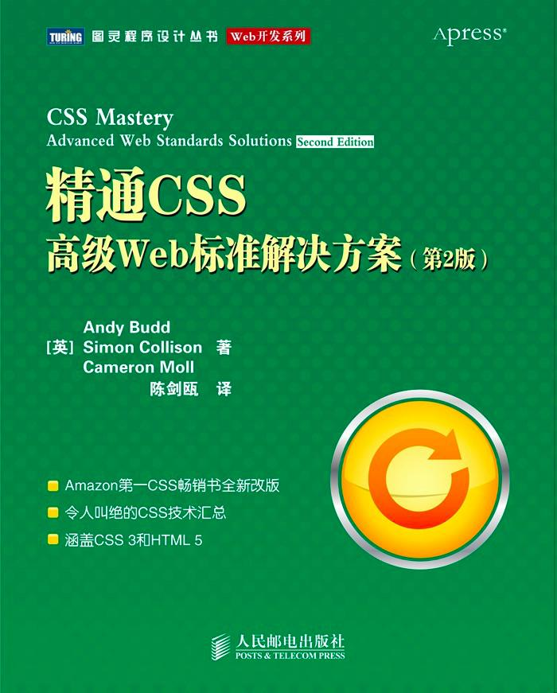

<!--more-->

# 基础知识

## 设计代码的结构

### 标记简史

* 有意义的标记的重要性
* ID和类名

ID可以用于标识页面上的特定元素（比如站点导航），或者用来标识持久的结构性元素，例如主导航或内容区域，还可以用来标识一次性元素，例如某个链接或表单元素。

类非常适合标识内容的类型或其他相似条目。

*  为元素命名

根据“它们是什么”来为元素命名，而不应该根据“它们外观如何”来命名。

* ID还是类

一般原则是：类应该应用于概念上相似的元素，这些元素可以出现在同一页面上的多个位置，而ID应该是应用于不同的唯一的元素，只有绝对确定某个元素只会出现一次的情况下才可以使用。

不需要给每个元素用类来标识，可以给某个容器赋予一个类名，然后用层叠（即利用层叠的优先级顺序）来识别其中的一些内容。

* `div`和`span`

`div`实际上代表部分（division），它可以将文档分割为几个有意义的区域。为了避免不必要的标记，应该只在没有元素能够实现区域分割的情况下使用`div`元素。

`div`可以用来对块级元素进行分组，而`span`用来对行内元素进行分组或标识。

* 微格式

一套标准的命名约定和标记模式来表示人、地点或日期等类型的信息，基于vCard和iCalendar等现有数据格式。

目前有9个正式的微格式：用于日期、日历和事件的hCalendar；用于人和组织的hCard；用于人之间的关系的XFN；用于产品说明的hProduct；用于原料和烹饪步骤的hRecipe；用于产品和事件审查的hReview；用于博客帖子等片段式内容的hAtom。

* 不同的HTML和CSS版本

### 文档类型和DOCTYPE

DTD（文档类型定义）是一组机器可读的规则，定义了XML或者HTML的特定版本中允许有什么，不允许有什么。

DOCTYPE描述了使用哪个DTD。

DOCTYPE有两种风格，严格和过渡。严格模式不允许使用已废弃的元素。

### 浏览器模式和DOCTYPE切换

浏览器模式主要包括混杂模式和标准模式。标准模式浏览器根据规范呈现页面；混杂模式页面以向后兼容的方式呈现，通常模拟老式浏览器的行为以防止老站点无法工作。

根据DOCTYPE是否存在呈现模式，被称为DOCTYPE切换。浏览器根据DOCTYPE是否存在以及使用哪种DTD来选择要使用的呈现方法。

# 为样式找到应用目标

## 常用的选择器

* 类型选择器

类型选择器用来寻找特定类型的元素，只需指定希望应用样式的元素的名称。比如：

```css
p{color: black;}
```

* 后代选择器

后代选择器用来寻找特定元素或元素组的后代。后代选择器由其他两个选择器之间的空格表示。比如：

```css
h1 p{padding-left: 2em;}
```

* ID选择器

ID选择器寻找具有特定ID的元素。ID选择器由`#`字符表示。比如：

```css
#intro {font-weight: bold;}
```

* 类选择器

类选择器寻找具有特定类名的元素。类选择器有`.`表示。比如：

```css
.date-posted{color: #ccc;}
```

不要随意给元素指定不同的类，而应该将一个类或ID应用于祖先元素，然后尽可能先用后代选择器定位不同的元素。

### 伪类

`:linked`和`:visited`称为链接伪类，只能应用于锚元素。

`:hover`、`:active`和`:focus`称为动态伪类，理论上可以应用于任何元素。

## 通用选择器

通用选择器由`*`表示，它可以作用于所有可用元素，一般用来对页面上的所有元素应用样式。

## 高级选择器

### 子选择器和相邻同胞选择器

子选择器用`>`表示，它只选择元素的直接后代（即子元素）。IE7中如果父元素和子元素之间有注释，子选择器会有问题。

```html
li{
	color: red;
}
#nav>li{
	color: yellow;
}

<ul id="nav">
    <li><a href="#">1</a></li>
    <li><a href="#">2</a></li>
    <li><a href="#">3</a>
        <ul>
            <li><a href="#">1</a></li>
            <li><a href="#">2</a></li>
            <li><a href="#">3</a></li>
        </ul>
    </li>
</ul>
```


相邻同胞选择器用`+`表示，可用于定位一个父元素下某个元素之后的元素。IE7总目标元素之间有注释会出问题。

```html
h1{
	color: red;
}
h1+p{
	color: yellow;
}

<h1>h1</h1>
<p>p</p>
<p>p</p>
```


### 属性选择器

属性选择器可以根据某个属性是否存在或属性的值来寻找元素。

```css
/*给有title属性的abbr标签赋样式*/
abbr[title]{
  border-bottom: 1px dotted #999;
}
abbr[title]:hover,abbr[title]:focus{
  cursor: help;
}

/*给rel属性值为"nofollow"的a标签赋样式*/
a[rel="nofollow"]{
  padding-right: 20px;
}

/*给rel属性值中有"cool"的a标签赋样式*/
a[rel~="cool"]{
  background: red;
}
<a rel="met cool">a</a>
<a rel="met">a</a>
```

### 层叠和特殊性

同一元素可能有2个或更多规则。CSS通过层叠的过程处理冲突。层叠给每个规则分配一个重要度。

层叠采用以下重要度次序：

1. 标有`!important`的用户样式
2. 标有`!important`的作者样式
3. 作者样式
4. 用户样式
5. 浏览器或者用户代理应用的样式

<p style="border-left: 4px solid yellow; padding: 10px;">层叠的重要度只是层叠规则的一部分，CSS2.1中的层叠规则如下：

1. 找出所有相关的规则，这些规则都包含与一个给定元素匹配的选择器。
2. 按显示权重对应用到的所有声明排序。标志`!important`的规则的权重高于没有`!important`标志的规则。
3. 按来源对应用到给定元素的所有声明排序。共有三种来源：创作人员、读者、用户代理。正常情况下，创作人员的样式要胜过读者的样式。有`!important`标示的读者样式要强于所有其他样式。创作人员样式和读者样式都比用户代理的默认样式要强。
4. 按特殊性对应用到给定元素的所有声明排序。有较高特殊性的元素权重大于有较低特殊性的元素。
5. 按出现顺序对应用到给定元素的所有声明排序。一个声明在样式表或文档中越后出现，它的权重就越大。如果样式表中有导入的样式表，一般认为出现在导入样式表中的声明在前，主样式表中的所有声明在后。</p>

#### 特殊性

为了确保非常特殊的选择器（比如ID选择器）不会被大量一般选择器（比如类型选择器）超越，特殊性的计算采用一个比10更高的未指定的基数。但是为了简化，如果在一个特定选择器中的选择器数量少于10个，那么可以以10为基数计算特殊性：

* 行内样式，特殊性加1000
* 每有一个ID选择器，特殊性加100
* 每有一个类、伪类或者属性选择器，特殊性加10
* 每有一个类型选择器或伪元素选择器，特殊性加1

#### 在样式表中使用特殊性

对一般元素应用一般样式，然后在更特殊的元素上覆盖它们。

尽量保持一般性样式非常一般，特殊性样式尽可能特殊。

### 继承

应用样式的元素的后代会继承样式的某些属性。

继承而来的样式的特殊性为0。

## 规划、组织和维护样式表

### 对文档应用样式

导入外部样式表的两种方法：

1. `<link href="/css/basic.css" rel ="stylesheet" type="text/css"/>`
2. `<style>@import url(/css/basic.css);<style>`

用`@import`方法还可以从一个样式表钟导入另一个样式表，但是和`<link>`相比导入速度慢。

#### 设计代码的结构

为了便于维护，最好把样式表划分为几大块。

* 一般样式
  * 主体样式
  * reset样式
  * 链接
  * 标题
  * 其他元素


* 辅助样式
  * 表单
  * 通知和错误
  * 一致的条目


* 页面结构
  * 标题、页脚和导航
  * 布局
  * 其他页面结构元素


* 页面组件
  * 各个页面


* 覆盖

#### 删除注释和优化样式表

注释会使CSS文件显著加大。

减小文件大小的最好方法可能是启用服务器端压缩，比如Apache服务器中用mod_gzip或者mod_deflate进行GZIP压缩。

# 可视化格式模型

## 盒模型概述


盒模型指定元素如何显示以及（在某种程度上）如何相互交互，它由元素的内容、内边距 、边框和外边距组成。

<p style="border-left: 4px solid yellow; padding: 10px;">CSS2.1还包括了`outline`属性，它的轮廓绘制在元素边框之上，不影响元素的大小和定位。</p>

在CSS中，`width`和`height`指的是内容区域的宽度和高度。增加内边距、边框和外边距不会影响内容区域的尺寸，但是会增加元素框的总尺寸。

### IE和盒模型

IE6及更早的IE版本在混杂模式中使用了非标准盒模型，`width`属性不是内容的宽度，而是内容、内边距和边框的宽度总和。

<p style="border-left: 4px solid yellow; padding: 10px;">用CSS3的`box-sizing`属性可以定义使用哪种盒模型。</p>

### 外边距叠加

* 当两个或者更多垂直外边距相遇时，它们将形成一个外边距，这个外边距的高度等于两个发生叠加的外边距的高度重的较大者。


* 当一个元素包含在另一个元素中时，它们的顶或底外边距也会发生叠加。叠加后的外边距如果碰到另一个元素的外边距，它还会发生叠加。


只有**普通文档流中块框（块级元素）**的垂直外边距才会发生外边距叠加。行内框（行内元素）、浮动框或绝对定位框之间的外边距不会叠加。

## 定位概述

### 可视化格式模型

CSS中三种基本的定位机制：普通流、浮动和绝对定位。

块级元素从上到下一个接一个排列，元素之间的垂直距离由元素的垂直外边距计算出来。

行内元素在一行中水平排列，可以使用水平内边距、边框和外边距调整行内元素之间的**水平间距**，但是垂直内边距、边框和外边距不影响行内的高度。

行内元素不能设置宽度或高度，修改行内元素尺寸的唯一办法是修改行高或者水平边框、内边距、外边距。


`display: inline-block`可以让元素像行内元素一样水平排列，并且元素可以设置宽度、高度、垂直外边距和内边距。

### 相对定位

如果对一个元素进行相对定位，它将出现在它所在的位置上。然后可以通过设置水平或者垂直位置，让这个元素“相对于”它的起点移动。

```css
#mybox{
  position: relative;
  left: 20px;
  top:20px;
}
```


在使用相对定位时，无论是否移动，元素仍然占据原来的空间。

相对定位实际上被看做普通流定位模型的一部分，因为元素的位置是相对于它在普通流中的位置。

### 绝对定位

绝对定位使元素的位置与文档流无关，因此不占据空间。普通文档流中其他元素的布局就像绝对定位元素不存在一样。


绝对定位元素的位置是相对于距离它最近的那个已定位的祖先元素确定的。如果没有已定位的祖先元素，那么它的位置是相对于初始包含块的。

绝对定位不仅可以覆盖页面上的其他元素，还可以设置`z-index`属性来控制元素的叠放次序。

#### 固定定位

固定定位（`position: fixed`）是绝对定位的一种，差异在于固定元素的包含块是视口，这使得能够创建总是出现在窗口中相同位置的浮动元素。

### 浮动

浮动的元素可以左右移动，直到它的外边缘碰到包含元素或另一个浮动元素的边缘。

浮动元素不在普通文档流中，所以普通文档流中的块级元素表现得就像浮动元素不存在一样。


#### 行框和清理

浮动的元素后面有一个文档流中的元素，那么这个元素会表现得就像浮动元素不存在一样，但是元素内的文本内容会受到浮动元素的影响，会移动以留出空间。也就是浮动元素旁边的行框被缩短，从而给浮动元素留出空间。


比如：

```html
<style>
  .test{
    background: yellow;
    float: left;
  }
  .test1{
    background: red;
  }
</style>

<div class="test1">
    <p class="test">content</p>
    contentcontentcontentcontentcontentcontentcontent
    contentcontentcontentcontentcontentcontentcontentcontentcontentcontentcontent
    contentcontentcontentcontentcontentcontentcontentcontentcontentcontent
    contentcontentcontentcontentcontentcontentcontentcontentcontentconten
    tcontentcontentcontentcontentcontentcontentcontentcontentcontentcontent
</div>
```


想要阻止行框围绕在浮动框的外边，需要对包含这些行框的元素应用`clear`属性。

`clear`属性可以是`left`、`right`、`both`或`none`。它表示框的哪边不应该挨着浮动框。

在清理元素时，浏览器在元素顶上添加足够的外边距，使元素的顶边缘垂直下降到浮动框下面，本质上是为元素留出了垂直空间来达到清理浮动的目的。


#### 浮动和清理示例

```html
<style>
  .news{
    background: gray;
    border: 1px solid black;
  }
  .news img{
    float: left;
  }
  .news p{
    float: right;
  }
</style>

<div class="news">
    
    <p>
        contentcontentcontentcontentcontentcontentcontent
        contentcontentcontentcontentcontentcontentcontentcontentcontentcontentcontent
        contentcontentcontentcontentcontentcontentcontentcontentcontentcontent
        contentcontentcontentcontentcontentcontentcontentcontentcontentconten
        tcontentcontentcontentcontentcontentcontentcontentcontentcontentcontent
    </p>
</div>
```


通过应用`clear`属性，使包围元素在视觉上包围浮动元素。

```html
<style>
  .news{
    background: gray;
    border: 1px solid black;
  }
  .news img{
    float: left;
  }
  .news p{
    float: right;
  }
  .clear{
    clear:both;
  }
</style>

<div class="news">
    
    <p>
        contentcontentcontentcontentcontentcontentcontent
        contentcontentcontentcontentcontentcontentcontentcontentcontentcontentcontent
        contentcontentcontentcontentcontentcontentcontentcontentcontentcontent
        contentcontentcontentcontentcontentcontentcontentcontentcontentconten
        tcontentcontentcontentcontentcontentcontentcontentcontentcontentcontent
    </p>
    <br class="clear"/>
</div>
```


这种方法需要添加不必要的HTML代码。

还可以选择浮动容器div的方法实现同样效果：

```html
<style>
  .news{
    background: gray;
    border: 1px solid black;
    float:left;
  }
  .news img{
    float: left;
  }
  .news p{
    float: right;
  }
</style>

<div class="news">
    
    <p>
        contentcontentcontentcontentcontentcontentcontent
        contentcontentcontentcontentcontentcontentcontentcontentcontentcontentcontent
        contentcontentcontentcontentcontentcontentcontentcontentcontentcontent
        contentcontentcontentcontentcontentcontentcontentcontentcontentconten
        tcontentcontentcontentcontentcontentcontentcontentcontentcontentcontent
    </p>
</div>
```

但是下一个元素会受到这个浮动元素的影响。

应用值为`hidden`或者`auto`的`overflow`属性有一个副作用，会自动清理包含的任何浮动元素。这种方法在某些情况下会产生滚动条或截断内容。

结合使用`:after`伪类和内容声明在指定的现有内容的末尾添加新的内容：

```html
<style>
  .news{
    background: gray;
    border: 1px solid black;
  }
  .news img{
    float: left;
  }
  .news p{
    float: right;
  }
  .clear:after{
    content: '';
    height: 0;
    visibility: hidden;
    display: block;
    clear: both;
  }
</style>
<div class="news clear">
    
    <p>
        contentcontentcontentcontentcontentcontentcontent
        contentcontentcontentcontentcontentcontentcontentcontentcontentcontentcontent
        contentcontentcontentcontentcontentcontentcontentcontentcontentcontent
        contentcontentcontentcontentcontentcontentcontentcontentcontentconten
        tcontentcontentcontentcontentcontentcontentcontentcontentcontentcontent
    </p>
</div>
```

# 背景图像效果

## 背景图像基础

默认情况下，浏览器水平和垂直地重复显示背景图像，让图像平铺在整个页面上。

`background-position`不仅可以使用例如`left`、`right`、`center`等关键字设置背景图像的位置，还可以使用像素或百分数等单位设置背景图像的位置。

`background-position`使用像素为单位设置背景图像的位置时，是图像左上角到元素左上角的距离为指定像素。而使用百分数为单位时，是图像上距离图像左上角的指定百分数的点到父元素上距离父元素左上角为指定百分数距离的位置。


最好不要混合使用单位和关键字。

## 圆角框

### 山顶角

`border-image`工作原理是把图片分成9块，然后把他们应用到元素边框的边和角。

```css
.box{
  /*border-image里面参数分别 对应background-image-source、border-image-slice、border-image-width、border-image-outset、border-image-repeat五个参数*/
  border-image: url(image.png) 25% 25% 25% 25% /25px round round;
}
```

<p style="border-left: 4px solid yellow; padding: 10px;">`border-image-slice`规定图像边框的向内偏移，从而可以精确地把图片划分成9块。


`border-image-width`可以定义划分边框的宽度。

`border-image-outset`可以定义在边框外部绘制`border-image-area`的数量</p>

## 不透明度

* css不透明度

css不透明度除了对背景生效之外，应用它的元素的内容也会继承它。

```css
.alert{
  background: #000;
  border-radius: 2em;
  opacity: 0.8;
  filter: alpha(opacity=80); /*IE适配*/
}
```

* RGBa

RGBa是一种同时设置颜色和不透明度的机制。RGB代表红色、绿色和蓝色，a代表alpha透明度。

上面的例子可以写成：

```css
.alert{
  background: rgba(0,0,0,0.8);/*0.8表示不透明度是80%，也就是透明度是20%*/
  border-radius: 2em;
}
```

* PNG透明度

PNG文件格式支持alpha透明度。

## 图像替换

图像替换（image replacement）可以像平常一样将文本添加到文档中，然后使用CSS隐藏文本并在它的位置上显示一个背景图像，这样搜索引擎仍然可以搜索HTML文本，而且如果禁用CSS，文本仍然会显示。

### FIR

FIR（Fahrner图像替换）是最早的图像替换技术。但这个方法有一些严重的可访问性问题，应该避免使用。

```html
<style>
  h2{
    background: url("image.png") no-repeat;
    width: 150px;
    height: 35px;
  }
  span{
    display: none;
  }
</style>

<h2>
    <span>Hello</span>
</h2>
```

`display`值为`none`或`visibility`为`hidden`的元素会被屏幕阅读器忽略。

### Phark

```html
</style>
h3{
	text-indent: -5000px;
	background: url("image.png") no-repeat;
	width: 150px;
	height: 35px;
}
</style>

<h3>hello</h3>
```

### sIFR

用JavaScript搜索文档，找到特定元素或者具有特定类名的元素中的所有文本。然后，JavaScript把文本替换为Flash文件。

# 对链接应用样式

## 简单的链接样式

`:link`伪类选择器用来寻找没有被访问过的链接，`:visited`伪类选择器用来寻找被访问过的链接。

`:hover`动态伪类选择器用来寻找鼠标悬停处的元素，`:active`动态伪类选择器用来寻找被激活的元素（对于链接来说，激活发生在链接被单击时）。

在定义鼠标悬停状态时，最好添加上`:focus`伪类，这样再通过键盘移动到链接上时，这让链接显示的样式与鼠标悬停时相同。

为了确保后定义的伪类覆盖之前定义的伪类，应用链接样式的顺序为：`a:link`、`a:visited`、`a:hover`、`a:focus`、`a:active`（可以记为LVHFA）。

## 为链接目标设置样式

用`:target`伪类为目标元素设置样式。

```html
<style>
:target
{
border: 2px solid #D4D4D4;
background-color: #e5eecc;
}
</style>

<p><a href="#news1">跳转至内容 1</a></p>
<p><a href="#news2">跳转至内容 2</a></p>

<p>请点击上面的链接，:target 选择器会突出显示当前活动的 HTML 锚。</p>

<p id="news1"><b>内容 1...</b></p>
<p id="news2"><b>内容 2...</b></p>
```


## 突出显示不同类型链接

用`[att^=val]`属性选择器寻找以文本`http:`开头的所有链接：

```css
a[href^="http:"]{
  /*样式*/
}
```

### 突出显示可下载的文档和提要

使用`[att$=val]`属性选择器寻找以特定值结尾的属性：

```css
a[href$=".pdf"]{
  /*样式*/
}
```

## 创建类似按钮的链接

```css
a{
  display: block;
  width: 6.6em;
  line-height: 1.4;/*垂直居中，文本换行时，高度是所需高度的两倍*/
  text-align: center;
  text-decoration: none;
  background-color: #8cca12;
  color: #ffffff;
  border: 1px solid #66a300;
}
```


链接应该只用于GET请求，决不要用于POST请求。

### 简单的翻转

使用伪类创建翻转效果：

```css
a:focus{
  background-color: #f7a300;
  border: #ff7400;
}
```


### CSS  spirit

CSS spirit是包含许多不同图标、按钮或图形的单个图像，这样可以减少请求数量。

### 用CSS3实现翻转

`-webkit-box-reflect`属性可以创建对象的倒影，这个属性包含倒影的位置和距离以及蒙版图像这几个参数。可以使用`-webkit-gradient`值自动生成这个蒙版。

```css
a{
  display: block;
  width: 6.6em;
  line-height: 1.4;
  text-align: center;
  text-decoration: none;
  background-color: #8cca12;
  color: #ffffff;
  border: 1px solid #66a300;
  border-radius: 6px;
  background-image: linear-gradient(to bottom, #abe142,#67a400);
  text-shadow: 2px 2px 2px #66a300;
  box-shadow: 2px 2px 2px #ccc;
  -webkit-box-reflect: below 2px -webkit-gradient(linear, left top,left bottom,from(transparent),color-stop(0.52,transparent),to(white));
}
```


## 纯CSS工具提示

```html
<style>
a.tooltip{
  position: relative;
}
a.tooltip span{
  display: none;
}
a.tooltip:hover span,a.tooltip:focus span{
  display: block;
  position: absolute;
  top: 1em;
  left: 2em;
  padding: 0.2em 0.6em;
  border: 1px solid #996633;
  background-color: #ffff66;
  color: #000000;
}
</style>

<p>
    <a href="#" class="tooltip">aaaaa<span>bbbb</span>rrrrrr</a>
</p>
```


# 对列表应用样式和创建导航条

## 基本列表样式

用`list-style-image`属性可以添加定制的项目符号。但是，这种方法对项目符号图像的位置控制能力不强。

更常用的方法是关闭项目符号，并将定制的项目符号作为背景添加到元素上，然后可以使用背景图像的定位属性精确地控制自定义项目符号的对准方式。

```css
ul{
  margin: 0;
  padding: 0;
  list-style-type: none;
}
li{
  background: url("img.png") no-repeat 0 50%;
  padding-left: 30px;
}
```

## 创建基本的垂直导航条

```html
<style>
  ul.nav{
    /*去除默认的项目符号和内外边距*/
    margin: 0;
    padding: 0;
    list-style-type: none;
    /*设置样式*/
    width: 8em;
    background-color: #8bd400;
    border: 1px solid #486b02;
  }
  ul.nav a{
    display: block;
    color: #2b3f00;
    text-decoration: none;
    border-top: 1px solid #e4ffd3;
    border-bottom: 1px solid #486b02;
    background: url("img.png") no-repeat 5% 50%;
    padding: 0.3em 1em;
  }
  ul.nav .last a{
    /*去掉最后一个列表的底边框*/
    border-bottom: 0;
  }
  ul.nav a:hover,ul.nav a:focus,ul.nav .selected a{
    color: #e4ffd3;
    background-color: #6da203;
  }
</style>

<ul class="nav">
    <li><a href="#">aaa</a></li>
    <li><a href="#">bbb</a></li>
    <li><a href="#">ccc</a></li>
    <li><a href="#">ddd</a></li>
    <li class="last"><a href="#">eee</a></li>
</ul>
```

## 创建简单的水平导航条

```html
<style>
  ol.pagination{
    margin: 0;
    padding: 0;
    list-style-type: none;
  }
  ol.pagination li{
    float: left;
    margin-right: 0.6em;
  }
  ol.pagination a,ol.pagination a.selected{
    display: block;
    padding: 0.2em 0.5em;
    border: 1px solid #cccccc;
    text-decoration: none;
  }
  ol.pagination a:hover,ol.pagination a:focus,ol.pagination a.selected{
    color: white;
    background-color: blue;
  }
  
  /*去除prev和next的边框*/
  ol.pagination a[rel="prev"],ol.pagination a[rel="next"]{
    border: none;
  }
  
  /*添加箭头*/
  ol.pagination a[rel="prev"]:before{
    content: '\00AB';
    padding-right: 0.5em;
  }
  ol.pagination a[rel="next"]:after{
    content: '\00BB';
    padding-left: 0.5em;
  }
</style>

<ol class="pagination">
    <li><a href="#" rel="prev">Prev</a></li>
    <li><a href="#">1</a></li>
    <li><a href="#" class="selected">2</a></li>
    <li><a href="#">3</a></li>
    <li><a href="#">4</a></li>
    <li><a href="#">5</a></li>
    <li><a href="#" rel="next">Next</a></li>
</ol>
```

## 创建图形化导航条

显式的设置宽度和高度会导致可维护性问题，所以不显式的设置宽度，每个按钮的宽度由`<a>`文本的尺寸决定，而是给每个`<a>`元素的左边和右边设置`3em`的内边距，并使用行高让`<a>`元素垂直居中。

```html
<style>
  ul.nav{
    margin: 0;
    padding: 0;
    list-style: none;
    width: 72em;
    background: linear-gradient(to right, #faa819,yellow) repeat-x;
    overflow: hidden;/*清除浮动*/
  }
  ul.nav li{
    float: left;
  }
  ul.nav a{
    display: block;
    padding: 0.3em;
    line-height: 2.1em;
    text-decoration: none;
    color: #ffffff;;
  }
  ul.nav a:hover,ul.nav a:focus{
    color: #333;
  }
</style>

<ul class="nav">
    <li><a href="#" rel="prev">Prev</a></li>
    <li><a href="#">1</a></li>
    <li><a href="#" class="selected">2</a></li>
    <li><a href="#">3</a></li>
    <li><a href="#">4</a></li>
    <li><a href="#">5</a></li>
    <li><a href="#" rel="next">Next</a></li>
</ul>
```

## Suckerfish下拉菜单

```html
<style>
  ul{
    margin: 0;
    padding: 0;
    list-style: none;
    float: left;
    border: 1px solid #486b02;
    background-color: #8bd400;
  }
  ul.nav li{
    float: left;
    background: #8bd400;
  }
  ul.nav li ul{
    width: 8em;
    position: absolute;
    left: -999em;	/*把下拉菜单隐藏到屏幕左边之外*/
  }
  .nav li:hover ul{
    left: auto;	/*把下拉菜单改回正常位置*/
  }
  ul.nav a{
    display: block;
    color: #2b3f00;
    text-decoration: none;
    padding: 0.3em 1em;
    border-right: 1px solid #486b02;
    border-left: 1px solid #e4ffd3;
  }
  ul.nav li li a{
    border: 0;
    border-top: 1px solid #e4ffd3;
    border-bottom: 1px solid#486b02;
  }
  ul.nav li:last-child a{
    border-right: 0;
    border-bottom: 0;
  }
  ul a:hover,ul a:focus{
    color: #e4ffd3;
    background-color: #6da203;
  }
</style>

<ul class="nav">
    <li><a href="#">1</a></li>
    <li>
        <a href="#">2</a>
        <ul>
            <li><a href="#">1</a></li>
            <li><a href="#">2</a></li>
        </ul>
    </li>
    <li>
        <a href="#">3</a>
        <ul>
            <li><a href="#">1</a></li>
            <li><a href="#">2</a></li>
        </ul>
    </li>
    <li><a href="#">4</a></li>
    <li><a href="#">5</a></li>
</ul>
```

## CSS图像映射

```css
<style>
.imagemap{
  width: 33px;
  height: 50px;
  position: relative;
}
.imagemap ul{
  margin: 0;
  padding: 0;
}
.imagemap a{
  position: absolute;
  display: block;
  width: 10px;
  height: 20px;
  text-indent: -100em; /*通过大的负数缩进，让a元素文本从屏幕上上消失*/
}
.imagemap .rich a{
  top: 10px;
  left: 30px;
}
.imagemap .aa a{
  top: 30px;
  left: 30px;
}
.imagemap .bb a{
  top: 40px;
  left: 30px;
}
.imagemap .cc a{
  top: 70px;
  left: 30px;
}
.imagemap .dd a{
  top: 90px;
  left: 30px;
}
.imagemap a:hover,.imagemap a:focus{
  border: 1px solid #ffffff;
}
</style>

<div class="imagemap">
    
    <ul>
        <li class="rich">
            <a href="#">a</a>
        </li>
        <li class="aa">
            <a href="#">aa</a>
        </li>
        <li class="bb">
            <a href="#">bb</a>
        </li>
        <li class="cc">
            <a href="#">cc</a>
        </li>
        <li class="dd">
            <a href="#">dd</a>
        </li>
    </ul>
</div>
```

### Flickr风格的图像映射

```html
<style>
  .imagemap{
    width: 33px;
    height: 50px;
    position: relative;
  }
  .imagemap ul{
    margin: 0;
    padding: 0;
    list-style: none;
  }
  .imagemap a{
    position: absolute;
    display: block;
    width: 30px;
    height: 20px;
    color: #000000;
    border: 1px solid transparent;
  }
  .imagemap a .outer{
    display: block;
    border: 1px solid #000000;
  }
  .imagemap a .inner{
    display: block;
    width: 30px;
    height: 20px;
    border: 1px solid #ffffff;
  }
  .imagemap .rich a{
    top: 10px;
    left: 30px;
  }
  .imagemap a:hover,.imagemap a:focus{
    border: #d4d82d;		/*鼠标悬停时边框从透明变成黄色*/
  }
  .imagemap a .note{
    position: absolute;
    bottom: -3em;
    width: 7em;
    padding: 0.2em 0.5em;
    background-color: #ffc;
    text-align: center;
    left: -1000em;
    margin-left: -4em;	/*使说明在热点下面水平居中*/
  }
  .imagemap a:hover .note,.imagemap a:focus .note{
    left: 25px;
  }
</style>

<div class="imagemap">
    
    <ul>
        <li class="rich">
            <a href="#">
                <span class="outer">
                    <span class="inner">
                        <span class="note">aa</span>
                    </span>
                </span>
            </a>
        </li>
    </ul>
</div>
```

## 对于定义列表的简短说明

定义列表（`<dl>`）由两个核心组件组成：定义术语`<dt>`和一个或多个定义描述`<dd>`。

# 对表单和数据表格应用样式

## 对数据表格应用样式

### 表格特有的元素

* `summary`和`caption`

`caption`基本上用作表格的标题。

`summary`用于表格标签，用来描述表格的内容。与图像的`alt`文本相似，`summary`应该总结表格中的数据。

* `thead`、`tbody`和`tfoot`

利用`thead`、`tbody`和`tfoot`可以将表格划分为几个逻辑部分。

`thead`表示列表标题。

如果选择使用`tbody`或`tfoot`，就必须至少使用一个`tbody`。

一个表格中只能使用一个`tbody`和`tfoot`元素，但是可以使用多个`tbody`元素将复杂的表格划分为更容易管理的几部分。

行标题和列标题应该使用`th`而不是`td`标记。但是某些内容既是内容又是数据，那么应该使用`td`标记。

`th`可以设置`scope="col"`或`scope="row"`的属性来定义是列标题还是行标题。

* `col`和`colgroup`

`tr`表示整行。

`col`表示整列，`colgroup`能够使用`col`元素对一个或多个列定义和分组。

```html
<table class="cal" summary="A calendar style date picker">
    <caption>
        <a href="#" rel="prev">&lt;</a>January 2008<a href="#" rel="next">&gt;</a>
    </caption>
    <colgroup>
        <col id="sun">
        <col id="mon">
        <col id="tue">
        <col id="wed">
        <col id="thur">
        <col id="fri">
        <col id="sat">
    </colgroup>
    <thead>
        <tr>
            <th scope="col">sun</th>
            <th scope="col">mon</th>
            <th scope="col">tue</th>
            <th scope="col">wed</th>
            <th scope="col">thur</th>
            <th scope="col">fri</th>
            <th scope="col">sat</th>
        </tr>
    </thead>
    <tbody>
        <tr>
            <td class="null">30</td>
            <td class="null">31</td>
            <td><a href="#">1</a></td>
            <td><a href="#">2</a></td>
            <td><a href="#">3</a></td>
            <td><a href="#">4</a></td>
            <td><a href="#">5</a></td>
        </tr>
        <tr>
            <td><a href="#">6</a></td>
            <td><a href="#">7</a></td>
            <td class="selected"><a href="#">8</a></td>
            <td><a href="#">9</a></td>
            <td><a href="#">10</a></td>
            <td><a href="#">11</a></td>
            <td><a href="#">12</a></td>
        </tr>
    </tbody>
</table>
```

### 对表格应用样式

CSS规范有两个表格边盒模型：单独的和叠加的。

在单独模型中，在各个单元格周围有边框，而在叠加模型中，单元格共享边框。

大多数浏览器默认采用单独模型。

`border-collapse`可以用来设置表格的边盒模型，其值`seperate`表示单独模型，`collapse`表示叠加模型

`border-spacing`属性设置相邻单元格的边框间的距离（仅用于单独模型中）。

```css
table.cal{
  border-collapse: separate;
  border-spacing: 0;
  text-align: center;
  color: #333333;
}
```

### 添加视觉样式

```css
.cal th, .cal td{
  margin: 0;
  padding: 0;
}
.cal caption{	/*设置表格标题样式*/
  font-size: 1.25em;
  padding-top: 0.692em;
  padding-bottom: 0.692em;
  background-color: #d4dde6;
}
.cal caption[rel="prev"]{	/*设置前一个链接样式*/
  float: left;
  margin-left: 0.2em;
}
.cal caption[rel="next"]{	/*设置后一个链接样式*/
  float: right;
  margin-right: 0.2em;
}

.cal caption a:link,.cal caption a:visited{
  text-decoration: none;
  color: #333333;
  padding: 0 0.2em;
}

.cal caption a:hover,.cal caption a:active,.cal caption a:focus{
  background-color: #6d8ab7;
}

.cal thead th{	/*设置表格第一行样式*/
  background-color: #d4dde6;
  border-bottom: 1px solid #a9bacb;
  font-size: 0.875em;
}
.cal tbody{		/*设置表格体样式*/
  color: #a4a4a4;
  text-shadow: 1px 1px 1px white;
  background-color: #d0d9e2;
}
.cal tbody td{	/*设置表格内单元格样式*/
  border-top: 1px solid #e0e0e1;
  border-right: 1px solid #9f9fa1;
  border-bottom: 1px solid #acacad;
  border-left: 1px solid #dfdfe0;
}
.cal tbody a{	/*设置表格内锚链接样式*/
  display: block;
  text-decoration: none;
  color: #333333;
  background-color: #c0c8d2;
  font-weight: bold;
  padding: 0.385em 0.692em 0.308em 0.692em;
}

.cal tbody a:hover,.cal tbody a:focus,.cal tbody a:active,.cal tbody .selected a:link,.cal tbody .selected a:visited,.cal tbody .selected a:hover,.cal tbody .selected a:focus,.cal tbody .selected a:active{
  background-color: #6d8ab7;
  color: white;
  text-shadow: 1px 1px 2px #22456b;
}

.cal tbody td:hover,.cal tbody td.selected{
  border-top: 1px solid #2a3647;
  border-right: 1px solid #465977;
  border-bottom: 1px solid #576e92;
  border-left: 1px solid #466080;
}
```

## 简单的表单布局

### 有用的表单元素

`fieldset`用来对相关信息块进行分类。

为了识别每个`fieldset`元素的用途，可以使用`legend`元素，`legend`就像`fieldset`的标题，它常常在`fieldset`的顶部垂直居中，并且向右缩进一点。`legend`在不同浏览器有不同的默认样式。

#### 表单标签

`label`元素用来帮助添加结构和增加表单的可用性和可访问性。

标签和表单控件关联起来的方法有下面两种：

* 隐式方式：

```html
<label>email<input name="email" type="text"/></label>
```

* 显式方式：

```html
<label for="email">email</label>
<input name="email" id="email" type="text" />
```

在表单输入控件和标签之间创建关联需要`id`属性，将表单数据发送回服务器需要`name`属性。`id`和`name`不必相同，但为了保持一致，尽可能让它们相同。

### 基本布局

```html
<style>
  fieldset{
    margin: 1em 0;
    padding: 1em;
    border: 1px solid #cccccc;
    background: #f8f8f8;
  }
  legend{
    font-weight: bold;
  }
  label{
    display: block;
    cursor: pointer;
  }
  input{
    width: 20em;
  }
</style>

<fieldset>
    <legend>You Contact Details</legend>
    <div>
        <label for="author">Name:</label>
        <input name="author" id="author" type="text"/>
    </div>
    <div>
        <label for="email">Email:</label>
        <input name="email" id="email" type="text">
    </div>
    <div>
        <label for="url">Web Address</label>
        <input name="url" id="url" type="text">
    </div>
</fieldset>
```

## 复杂的表单布局

### 可访问的数据输入元素

```html
<style>
  label {
    float: left;
    width: 10em;
    cursor: pointer;
  }

  #monthOfBirthLabel,#yearOfBirthLabel{
    text-indent: -1000em;   /*隐藏标签*/
    width: 0;       /*防止标签影响布局*/
  }
  input#dateOfBirth{
    width: 3em;
    margin-right: 0.5em;
  }
  select#monthOfBirth{
    width: 10em;
    margin-right: 0.5em;
  }
  input#yearOfBirth{
    width: 5em;
  }
</style>
<div>
    <label for="dateOfBirth">Date of Birth:</label>
    <input name="dateOfBirth" id="dateOfBirth" type="text">
    <label for="monthOfBirth" id="monthOfBirthLabel">Month Of Birth</label>
    <select name="monthOfBirth" id="monthOfBirth">
        <option value="1">1月</option>
        <option value="2">2月</option>
        <option value="3">3月</option>
    </select>
    <label for="yearOfBirth" id="yearOfBirthLabel">Year Of Birth</label>
    <input name="yearOfBirth" id="yearOfBirth" type="text">
</div>
```

### 多列复选框

```html
<style>
  fieldset#favoriteColor{
    margin: 0;
    padding: 0;
    border: none;
    background: transparent;
  }
  #favoriteColor h2{     /*为了避免浏览器处理legend定位的方式不一致，将标题用作标签*/
    width: 10em;
    float: left;
    font-weight: normal;
  }
  #favoriteColor .col{
    width: 8em;
    float: left;
  }
  #favoriteColor label{
    float: none;    /*复选框不浮动*/
  }
</style>
<fieldset id="favoriteColor">
    <h2>FavoriteColor:</h2>
    <div class="col">
        <div>
            <label><input type="checkbox" class="checkbox" id="red" name="red" value="red">red</label>
        </div>
        <div>
            <label><input type="checkbox" class="checkbox" id="yellow" name="yellow" value="yellow">yellow</label>
        </div>
        <div>
            <label><input type="checkbox" class="checkbox" id="blue" name="blue" value="blue">blue</label>
        </div>
    </div>

    <div class="col">
        <div>
            <label><input type="checkbox" class="checkbox" id="green" name="green" value="green">green</label>
        </div>
        <div>
            <label><input type="checkbox" class="checkbox" id="orange" name="orange" value="orange">orange</label>
        </div>
        <div>
            <label><input type="checkbox" class="checkbox" id="other" name="other" value="other">other</label>
        </div>
    </div>
</fieldset>
```

#### 提交按钮

为了在整个操作系统中保持一致，在一些操作系统上禁止修改`input`按钮样式，但是`button`元素不受这些限制影响。`button`在IE6和IE7提交元素本身的内容，而不是`value`属性的内容（非IE6和IE7浏览器的行为）。

```html
<style>
  button{
    width: 200px;
    height: 50px;
    border: 1px solid #989898;
    border-radius: 6px;
    background: linear-gradient(to bottom,yellow,greenyellow) #c5e063 bottom left repeat-x;
    box-shadow: 2px 2px 2px #ccc;
    color: #ffffff;
    font-size: 26px;
    font-weight: bold;
    text-shadow: 1px 1px 1px #666;
  }
</style>

<p>
    <button type="submit">Book Now</button>
</p>
```

# 布局

所有CSS布局技术的根本都是3个基本概念：定位、浮动和外边距操纵。

## 计划布局

* 先把页面划分为大的结构性区域，比如容器、页眉、内容器和页脚。这些区域在整个站点中往往是一致的。
* 然后将注意力转移到内容区域本身，开始建立网格结构。设计有多少个不同的内容区域？它们有什么差异？从布局的角度来说，内容区域是确实不一样，还是可以被同等看待？大多数设计只有几个独特的内容区域，所以应该寻找共同的特征而不是视觉表现。
* 最后在各个内容区域中寻找不同的布局结构。是否需要把某些信息分为两列、三列或四列？与前面不同，这些布局结构往往非常灵活，在各个页面之间常常有变化。
* 结构设计完成之后，可以开始关注不同类型的内容。给每个内容块起一个有意义的名称，然后分析它们的关系。
* 查看每个内容块的结构，看看不同的类型中是否有共同的模式。应该尽量采用一般的类名，然后根据上下文应用样式。
* 找出模式并确定命名约定后，最好马上开始定义将使用的元素。

## 设置基本结构

```html
<style>
  .wrapper {
    width: 920px;
    margin: 0 auto;
  }
</style>

<div class="wrapper">
    <div class="header">
        headerheaderheaderheader
    </div>
    <div class="content">
        contentcontentcontent
    </div>
    <div class="footer">
        footerfooterfooterfooter
    </div>
</div>
```

## 基于浮动的布局

在基于浮动的布局中，只需要设置希望定位的元素的宽度，然后将它们向左或向右浮动。

因为浮动的元素不再占据文档流中的任何空间，它们就不再对包围它们的块框产生任何影响。为了解决这个问题，需要对布局中各个点上的浮动元素进行清理。非常常见的做法不是连续地浮动和清理元素，而是浮动几乎所有东西，然后在整个文档的“战略点”（比如页脚）上进行一次或两次清理。还可以使用`overflow: hidden;`清理某些元素的内容。

### 两列的浮动布局

在创建基于浮动的布局时，一般将两列布局向左浮动，然后使用外边距或内边距在两列之间创建一个隔离带。在使用这种方法时，列在可用空间内包得很紧。在IE上会发生打乱紧密布局，迫使一列退到另一列的下面。

<p style="border-left: 4px solid yellow; padding: 10px;">因为IE考虑元素的内容的尺寸，而不是元素本身的尺寸。在符合标准的浏览器中，如果元素的内容太大，它只会超出框之外。在IE上如果元素的内容太大，整个元素就会扩展。</p>

为了防止这种情况发生，需要避免浮动布局在包含它们的元素中太挤。可以不用水平外边距或内边距来建立隔离带，而是让一个元素向左浮动，让另一个元素向右浮动。

```html
<style>
  .wrapper {
    width: 920px;
    margin: 0 auto;
    overflow: hidden;
  }
  .content .primary{
    width: 650px;
    padding-right: 20px;
    float: right;
    display: inline;
  }
  .content .secondary{
    width: 230px;
    float: left;
    display: inline;
  }
  .content{
    overflow: hidden;
  }
</style>

<div class="wrapper">
    <div class="header">
        aaaaaaaaaaaaaaaaaaaaaaaaaaaa
    </div>
    <div class="content">
        <div class="primary">
            bbbbbbbbbbbbbbb
        </div>
        <div class="secondary">
            bbbbbbbbbbbbbbb
        </div>
    </div>
    <div class="footer">
        aaaaaaaaaaaaaaaaaaaaaaaaaaaa
    </div>
</div>
```

### 三列的浮动布局

```html
<style>
  .wrapper {
    width: 920px;
    margin: 0 auto;
    overflow: hidden;
  }
  .content .primary{
    width: 670px;
    float: right;
    display: inline;
  }
  .content .secondary{
    width: 230px;
    float: left;
    display: inline;
  }
  .content{
    overflow: hidden;
  }
  .content .primary .primary{
    width: 400px;
    float: left;
    display: inline;
  }
  .content .primary .secondary{
    width: 230px;
    float: right;
    display: inline;
    padding-left: 20px;
  }
</style>

<div class="wrapper">
    <div class="header">
        aaaaaaaaaaaaaaaaaaaaaaaaaaaa
    </div>
    <div class="content">
        <div class="primary">
            <div class="primary">
                cccccccccc
            </div>
            <div class="secondary">
                cccccccccc
            </div>
        </div>
        <div class="secondary">
            bbbbbbbbbbbbbbb
        </div>
    </div>
    <div class="footer">
        aaaaaaaaaaaaaaaaaaaaaaaaaaaa
    </div>
</div>
```

## 固定宽度、流式和弹性布局

宽度以像素为单位的布局称为固定宽度布局，它使开发人员对布局和定位有更大的控制能力，但是随着屏幕尺寸越来越大，这种设计越来越不适应灵活的web开发，而且固定宽度的布局往往适合于浏览器默认文本字号，只要文本字号增加几级，边栏就会挤满空间并且行长太短，导致阅读性差。

为了解决这些问题，可以使用流式布局或弹性布局代替固定宽度布局。

### 流式布局

使用流式布局时，尺寸是使用百分数而不是像素设置。这使得流式布局能够相对于浏览器窗口进行伸缩。但当窗口较小时，行变得非常窄，很难阅读。因此，有必要添加以像素或`em`为单位的`min-width`；从而防止布局变得太窄。但是，如果`min-width`设置得太大，流式布局也会遇到固定宽度布局相同的限制。

与之相反，如果设计横跨整个浏览器窗口，那么行就变得太长。可以采取几个措施来避免这个问题：

* 不要横跨浏览器而是让容器只跨越宽度的一部分，比如85%
* 可以考虑用百分数设置内边距和外边距。这样的话，内边距和外边距的宽度将随着窗口尺寸而变
* 对于非常严重的情况，可以选择为容器设置最大宽度，防止内容在大显示器上变得过宽

```html
<style>
  .wrapper {
    width: 76.8%;
    margin: 0 auto;
    text-align: left;
    min-width: 62em;
    max-width: 125em;
  }
  .content .primary{
    width: 72.82%;
    float: right;
    display: inline;
  }
  .content .secondary{
    width: 25%;
    float: left;
    display: inline;
  }
  .content .primary .primary{
    width: 59.7%;
    float: left;
    display: inline;
  }
  .content .primary .secondary{
    width: 34.33%;
    float: right;
    display: inline;
    padding-left: 2.63%;
  }
</style>

<div class="wrapper">
    <div class="header">
        aaaaaaaaaaaaaaaaaaaaaaaaaaaa
    </div>
    <div class="content">
        <div class="primary">
            <div class="primary">
                cccccccccc
            </div>
            <div class="secondary">
                cccccccccc
            </div>
        </div>
        <div class="secondary">
            bbbbbbbbbbbbbbb
        </div>
    </div>
    <div class="footer">
        aaaaaaaaaaaaaaaaaaaaaaaaaaaa
    </div>
</div>
```

### 弹性布局

虽然流式布局可以充分利用可用空间，但是在大分辨率显示器上，行仍然会过长。相反，在窄窗口中或在增加文本字号时，行会变得非常短，内容很零碎。这时候可以使用弹性布局。

弹性布局相对于字号来设置元素的宽度，以`em`为单位设置宽度，可以确保在字号增加时整个布局随之扩大，这可以将行长保持在可阅读的范围内。

但是弹性布局的一些问题与固定宽度布局一样，比如不能充分利用可用空间。另外，因为文本字号增加时整个布局会加大，所以弹性布局会变得比浏览器窗口宽，导致水平滚动条出现。为了防止这种情况，可能需要在容器`div`上添加`100%`的`max-width`。

将固定宽度布局转化为弹性布局要设置基字号，让`1em`大致相当于10像素。大多数浏览器上默认字号是16像素。

建议内部宽度仍然使用百分数，只以`em`为单位设置容器的宽度。这样的话，内部宽度仍然是相对于字号的，这样就可以方便地修改布局的总尺寸，不必修改每个元素的宽度，这种方案更灵活和易于维护。

```html
<style>
  body{
    font-size: 62.5%;
    text-align: center;
  }
  .wrapper {
    width: 92em;
    margin: 0 auto;
    text-align: left;
    max-width: 95%;
  }
  .content .primary{
    width: 72.82%;
    float: right;
    display: inline;
  }
  .content .secondary{
    width: 25%;
    float: left;
    display: inline;
  }
  .content .primary .primary{
    width: 59.7%;
    float: left;
    display: inline;
  }
  .content .primary .secondary{
    width: 34.33%;
    float: right;
    display: inline;
    padding-left: 2.63%;
  }
</style>

<div class="wrapper">
    <div class="header">
        aaaaaaaaaaaaaaaaaaaaaaaaaaaa
        aaaaaaaaaaaaaaaaaaaaaaaaaaaa
        aaaaaaaaaaaaaaaaaaaaaaaaaaaa
    </div>
    <div class="content">
        <div class="primary">
            <div class="primary">
                cccccccccc
                cccccccccc
                cccccccccc
            </div>
            <div class="secondary">
                cccccccccc
                cccccccccc
                cccccccccc
            </div>
        </div>
        <div class="secondary">
            bbbbbbbbbbbbbbb
            bbbbbbbbbbbbbbb
            bbbbbbbbbbbbbbb
        </div>
    </div>
    <div class="footer">
        aaaaaaaaaaaaaaaaaaaaaaaaaaaa
        aaaaaaaaaaaaaaaaaaaaaaaaaaaa
        aaaaaaaaaaaaaaaaaaaaaaaaaaaa
    </div>
</div>
```

### 流式和弹性图像

对于需要跨大区域的图像，比如站点页眉或品牌区域中的图像，可以考虑使用背景图像，而不是图像元素。

如果图像需要用作页面上的图像元素，那么将容器元素的宽度设置为`100%`并且将`overflow:hidden`。这样的话，图像右边会被截短，使它适合容器元素。而不会随着布局伸缩。

对于常规内容图像，如果希望它们垂直和水平伸缩以避免被剪切，可以将图像元素添加到没有设置任何尺寸的页面上，然后设置图像的百分数宽度，并且添加与图像宽度相同的`max-width`以避免像素失真。

## faux列

为了创建列的效果，需要创建一个伪列。方法是在一个占据布局最大高度的元素上应用重复的背景图像。

对于固定宽度的布局，只需要在容器元素上应用一个垂直重复的背景图像，其宽度与导航区域相同。

为流式布局创建faux列需要按百分比对背景图像进行定位。按百分比定位背景图像可以创建水平比例与布局相同的背景图像。

<p style="border-left: 4px solid yellow; padding: 10px;">`background-position`使用像素为单位设置背景图像的位置时，是图像左上角到元素左上角的距离为指定像素。而使用百分数为单位时，是图像上距离图像左上角的指定百分数的点到父元素上距离父元素左上角为指定百分数距离的位置。</p>

## 高度相等的列

```html
<style>
  .wrapper{
    width: 100%;
  }
  .box{
    width: 250px;
    margin-left: 20px;
    float: left;
    display: inline;
    padding: 20px;
    background: yellowgreen;
  }
</style>

<div class="wrapper">
    <div class="box">
        <h1>tangcheng</h1>
        <p>aaaaaaaaaaaaaaaaaaaaaaaa</p>
        <div class="bottom"></div>
    </div>

    <div class="box">
        <h1>tangcheng</h1>
        <p>bbbbbbbbbbbbbbbbbbbbbbbbb</p>
        <div class="bottom"></div>
    </div>

    <div class="box">
        <h1>tangcheng</h1>
        <p>ccccccccccccccccccccccccc</p>
        <div class="bottom"></div>
    </div>
</div>
```

上面代码给每个框设置大的底内边距，然后用数值相似的负外边距消除这个高度。但这会导致每个列溢出容器元素。

为了把列的底边定位在正确的位置，需要让它们与容器元素的底部对齐：

```css
.wrapper{
  width: 100%;
  overflow: hidden;
  position: relative;
}
.box{
  width: 250px;
  margin-left: 20px;
  margin-bottom: 500px;
  float: left;
  display: inline;
  padding: 20px;
  padding-bottom: 520px;
  background: yellowgreen;
}
.bottom{
  position: absolute;
  bottom: 0;
  height: 20px;
  width: 290px;
  background: yellowgreen;
  margin-left: -20px;
}
```

## CSS3列

CSS3也可以创建等高文本列，需要用到`colum-count`、`colum-width`和`colum-gap`属性：

```html
<style>
  .col{
    column-count: 3;
    column-width: 14em;
    column-gap: 2em;
    column-rule: 1px solid #ccc;
  }
</style>

<h1>aaaa</h1>
<div class="col">
    <p>bbbbbbbbb</p>
</div>
```

CSS列的有点之一是在可用空间小于已定义的宽度时的处理方式。列不会像使用浮动那样回绕，而是会减少列数。

# bug和修复bug

## 捕捉bug

### 常见的CSS问题

* 特殊性和分类次序的问题

将一个规则应用于一个元素时，如果发现没有任何效果，这时往往存在特殊性问题。

不要随便添加更特殊的选择器，因为这可能会给代码的其他部分带来特殊性问题。更好的方法往往是删除额外的选择器，让它们尽可能一般化，只在需要细粒度的控制时添加更特殊的选择器。

* 外边距叠加的问题

如果元素没有垂直边框或内边距，那么它的高度就是它包含的子元素的顶部和底部边框边缘之间的距离。

因此，包含的子元素的顶部和底部外边距就突出到容器元素的外边，有一个简单的解决方案：通过添加一个垂直边框或内边距，外边距就不再叠加了，而且元素的高度就是它包含的子元素的顶部和底部外边距边缘的距离。

```html
<style>
  #box{
    margin: 10px;
    background-color: #d5d5d5;
  }
  p{
    margin: 20px;
    background-color: #6699ff;
  }
 /*************升级*****************/
    #box{
    margin: 10px;
    background-color: #d5d5d5;
    padding: 1px;
  }
  p{
    margin: 20px;
    background-color: #6699ff;
  }
</style>

<div id="box">
    <p>mmmmmmmmmm</p>
</div>
```


升级后：


## 捕捉bug的基本知识

* 尽量一开始就避免bug

应该尽可能使用简单的代码实现所需的结果，所以要避免使用过分花哨的技术，只在绝对必要的情况下才使用hack。

* 隔离问题

通过隔离问题和识别症状，有可能查明问题的原因并修复它。隔离问题的一种方法是在相关的元素上应用边框或轮廓。

* 创建基本测试案例

要创建基本测试案例，首先应该复制出问题文件，删除多余HTML，只留下最基本的内容，然后开始注释样式表，从而查明哪些样式导致了这个问题。

* 修复问题，而不是修复症状


* 请求帮助

## 拥有布局

### 什么是布局

IE使用布局概念来控制元素的尺寸和定位。那些“拥有布局”（have layout）的元素负责本身及其子元素的尺寸设置和定位。如果一个元素“没有拥有布局”，那么它的尺寸和位置由最近的拥有布局的祖先元素控制。

IE显示引擎利用布局概念减少它的处理开销。在理想情况下，所有元素都控制自己的尺寸和定位。但是，这会在IE中导致很大的性能问题。因此，IE开发团队只将布局应用于实际需要它的元素，这样可以减少性能开销。

在默认情况下拥有布局的元素包括：

* body
* html（标准模式中）
* table
* tr、td
* img
* hr
* input、select、textarea、button
* iframe、embed、object、applet
* marquee

布局的概念是Windows上的IE特有的，而且不是CSS属性。尽管设置某些CSS属性会使元素拥有布局，但是在CSS中无法显式地设置布局。可以使用JavaScript函数`hasLayout`来查看一个元素是否拥有布局，这个函数是一个只读属性，不能进行设置值。

设置以下CSS属性会自动使元素拥有布局：

* `float: left`或`float: right`
* `display: inline-block`
* `width: 任何值`
* `height: 任何值`
* `zoom: 任何值`
* `writing-node: tb-rl`

在IE7中，以下属性也成了布局触发器：

* `overflow: hidden、scroll或auto`
* `min-width: 任何值`
* `max-width: 除none以外的任何值`

### 解决办法

* IE条件注释

条件注释是一种专有的（因此是非标准的）对常规HTML注释的Microsoft扩张。条件注释在其他所有浏览器看来是常规注释，因此本质上是无害的，所以条件注释通常被看做处理IE特有bug的最好方法。

```html
指定IE5以上所以版本中的属性
<!-- [if IE]
	<link rel="stylesheet" type="text/css" href="ie.css">
-->

指定IE6中的属性
<!-- [if IE6]
	<link rel="stylesheet" type="text/css" href="ie.css">
-->

对IE所有版本隐藏样式
<!-- [if !IE]>-->
	<link rel="stylesheet" type="text/css" href="ie.css">
<!--<![endif]-->

对IE5.X隐藏样式
<!-- [if gte IE6]><!-->
	<link rel="stylesheet" type="text/css" href="ie.css">
<!--<![endif]-->
```

* 关于hack和过滤器的一个警告

如果浏览器不理解某个选择器或者属性和值，它会忽略整个规则或声明。利用这点可以确保老式浏览器会平稳退化。

使用不被支持的CSS作为过滤机制是一种相对安全的方法，但是这些hack和过滤器常常会使你的代码失效。作为一般规则，应该使用依赖于不被支持的CSS过滤器，而不是依赖于某种浏览器bug的过滤器。最好完全避免使用过滤器。

* 明智地使用hack和过滤器

使用hack较多时，最好把它们放在自己独立的样式表中。

* 应用IE for Mac带通过滤器
* 应用星号HTML hack
* 应用子选择器hack

## 分级浏览器支持

* 首先确定一组浏览器，让站点在这些浏览器中的表现一致。对这些浏览器，希望站点的外观大体上相同，但允许一些细微差异
* 确定一组已经过时但仍然比较重要的浏览器，在这些浏览器中随机选择几个执行测试，尝试修复问题，但是即使显示效果不完美并且在浏览器之间有差异，也是可以接受的，只要不影响访问内容即可
* 最后确定一组完全不想正式支持的浏览器，可以确保内容和功能可用，表现方式无所谓。

# 实例研究：Roma Italia

* 对于各种标记（HTML元素、属性和值，CSS的选择器、属性和值），能简化就简化。
* `reset.css`可以避免和缓解HTML元素默认样式不一致的问题。
* `RGBa`不透明度和`opacity`不一样，`RGBa`不透明度可以应用于特定的属性（比如背景），它只影响这个属性。`opacity`会影响应用它的元素中的所有东西。
* 如果文本太长，在包含它的元素中放不下，`text-overflow`会截断它，使用`ellipsis`值在被截断的文本后面加上省略号。
* 对于`Ctrl+/-`和`Command+/-`命令，每种浏览器的最新版本现在默认采用页面缩放，而不是文本缩放。页面缩放直接缩放整个页面—布局、格式和文本大小。这意味着`px`是适合`font-size`的单位，因为用户分辨不出用绝对单位和用相对单位设置的文本之间的差异。
* `@font-face`可以在设计中使用任何字体显示HTML文本，而不用考虑用户的机器上是否安装了这种字体。
* AJAX通常至少包括3个部分：
  * 异步的服务器通信，通常使用XMLHttpRequest实现
  * 通过操作DOM进行动态显示和交互
  * 使用JavaScript把所有部分组合在一起

# 实例研究：Climb the Mountains

* `:first-child`伪类只选择包含元素的第一个子元素
* 相邻同胞选择器可以包含多个选择器，由`+`分隔

```css
div ul li + li + li + li{....}/*会选择第四个li元素*/
```

* 可以通过组合类（不同样式的类组合成一个你想要的效果）为元素提供更大的灵活性


<iframe src="https://www.xmind.net/embed/KhSF" width="620px" height="540px"></iframe>


