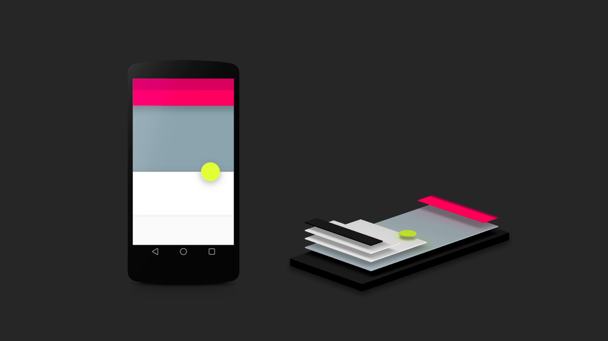
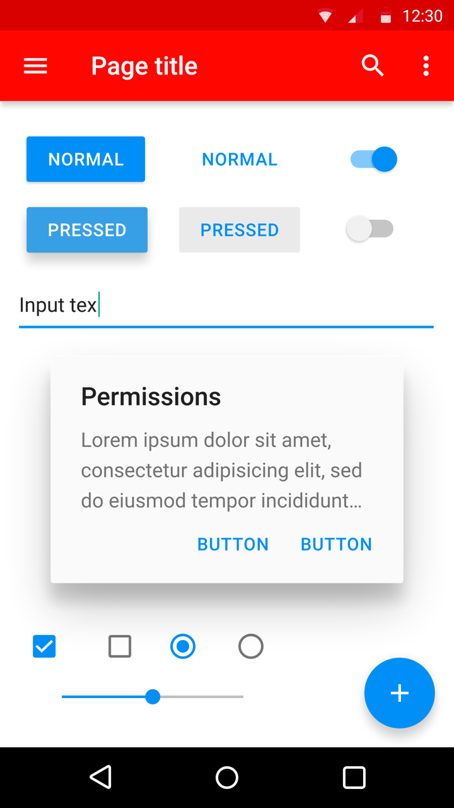

<!--more-->

上个月更新了Chrome（国内连不上Google的服务可以去[这个地址更新](https://api.shuax.com/tools/getchrome)），最新版本已经完全按照Google自己的Material Design来设计了。现在Google系的软件基本都是Material Design设计风格。

# 什么是Material Design

Material Design是Google提出来的一套设计语言，关于设计语言，我们听得比较多的是Apple的，比如之前的拟物化设计以及现在的扁平化设计（Flat Design）。

这些设计语言都带有品牌的鲜明个性，通过这些不同的设计语言，可以保证不同产品之间的设计风格和交互方式的一致性。

既然Apple推出了扁平化设计语言，Google也不敢落后，于是在2014年Google I/O 大会上推出了Material Design，Google想让Google平台上的开发者掌握这个新设计语言，从而让所有应用就有统一的外观，就像是苹果向开发者提出的设计原则一样。

Material Design的核心思想，就是把物理世界的体验带进屏幕。去掉现实中的杂质和随机性，保留其最原始纯净的形态、空间关系、变化与过渡，配合虚拟世界的灵活特性，还原最贴近真实的体验，达到简洁与直观的效果。

Material Design很重视跨平台体验，所以规范严格细致，保证它在各个平台使用体验高度一致。

# Material Design简单介绍

Material Design有一套详细的规范，D27在[他的掘金专栏](https://juejin.im/user/57b717301532bc005b8fda25)中翻译了这套规范。经过作者的授权，下面摘录了Material特性和Material动效这两章内容。

## Material特性

**Material有一套属于自身固定不变的外在特征和内在行为逻辑**。

### 物理特性

* Material的尺寸**沿x和y轴变化**（单位：dp），并且其有着**固定不变的厚度**（1dp）。

    ▼可行

​	▼不可行

* 投影的深浅效果跟Material对象之间的位置距离（z轴）相关。

  ​	▼可行

​		▼不可行

* 任何形状和颜色的内容都能在Material上面显示。添加内容不会增加Material的厚度。

* 在Material有限的范围内，内容能够随意变化。

* Material是立体的。输入事件不能穿过当前被触发的Material对象。

  ​		▼可行

​			▼不可行

* 在空间内，多个Material对象不能同时占据同一个位置。

  ​		▼可行

​			▼不可行

* 一个Material对象不能穿过另一个Material对象。举例，就好比一张纸不能穿过另一张纸一样。

  ​		▼不可行

* Material能改变形状

  ​		▼可行

* Material沿水平方向放大缩小（沿x和y轴）

  ​		▼可行

* Material不能弯曲折叠。

  ​		▼不可行

* 多个Material对象能够合并成为一个Material对象。

  ​		▼可行

* 被分裂的Material对象能够再次合并。

  ​		▼可行

* Material能够出现或消失在空间里的任何地方。

  ​		▼可行

* Material能沿任何轴向移动。

  ​		▼可行

* Z轴上发生的运动变化一般是用户与Material对象交互的反馈结果。

  ​		▼可行

## Material动效

动效向我们展示了一个应用是如何运作的，以及它能做什么。

动效的作用：

- 引导用户关注
- 当用户完成输入后暗示用户将会发生什么
- 强调组件之间的层次和空间关系
- 缓解用户等待焦虑（如内容抓取或加载下一个视图）
- 为用户带来个性、精良、愉悦的视觉感受

### Material是如何运动的？

整个Material环境的搭建灵感来源于现实世界，其中借鉴了现实中的重力和摩擦力。这些力在Material环境中主要体现在用户输入的方式对组件的影响和多个组件之间如何交互。

Material的动效具备以下特点：

* **响应**

Material是充满活力的物质。当用户触发、输入的时候它能够迅速作出响应。

在移动端上，篇幅长的动效时长在300-400ms之间。篇幅短的动效时长在150-200ms之间。动效时长如果少于或者超过以上建议时长的话，用户就会感到动效运动缓慢或者动效运动太快导致肉眼难以捕捉：

墨水逐渐扩散的动效被用于确认用户输入。同时卡片（card）高度抬起暗示用户已经触发：

* **自然**

因为参考了现实世界中力对物体的影响，所以Material的动效自然并贴近现实。

在现实世界中，一个物体运动不管加速还是减速都会受到重力和摩擦力的影响。同理，在Material Design中，对象的运动不会突然的启动和停止：

受重力影响，Material对象沿弧线运动：

Material的变化同样沿弧线变化：

* **认知**

Material具备认知周边环境（包括用户和其他Material对象）的能力。它能够联合其他Material对象一同回应用户需求。

当转场的时候，为了确定相互之间的关系，这些Material的动效按编排好的方式运动：

在拥挤的环境中变化大小，Material能够从中挤开合适的空间：

Material对象间能够相互吸引并结合：

* **目的性**

Material的动效能够引导用户在正确的时间上关注正确的点。

过渡动效有助于指导用户下一步的交互：

不同的动效可以帮助用户理解当前的活动。比如当前手势对组件是否可用：

动效可以引导用户关注他们需要关注的地方：

### 好的过渡是怎样的？

成功的动效设计具备以下特点：

* **快速、流畅**

一个快速、流畅的动效不会让用户觉得在等待时间：

​				▼可行

​				▼不可行

* **清晰、连贯**

过渡应清晰，简明和条理清楚，避免做得过多。

​				▼可行

​				▼不可行

当过渡的时候每个组件朝着不同的方向或交叉的路径变化，很容易使用户疑惑：

* **紧密、一致**

在Material Design中，动效具备统一的速度、响应能力和目的。因此在你的应用中那些自定义的动效需要保持内在的连贯一致。

图中是三个不同功能的应用，但是因它们有着看起来相似的动效，令人觉得它们之间有着某种联系：

### 动效的暗示

关于动效的好处请看下面两个例子。

通过过渡动效引导用户进入下一个视图。以生动的动效淡化数据加载带来的等待时间，能有效的减轻用户因等待而产生的焦虑感：

因为没有过渡动效发生和没有一个清晰焦点引导，所以用户不清楚上一个视图和下一个视图之间的联系。其中利用一个旋转的圆形icon代表数据加载的状态，这样做会使得等待在用户面前显得更加凸显，无疑增加了用户等待带来的焦虑感：

