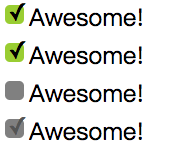

<!--more-->

## HTML

### 初级

1. 介绍一下你对浏览器内核的理解？
2. 简述一下你对HTML语义化的理解？
3. html5有哪些新特性、移除了那些元素？

### 中级

1. 页面导入样式时，使用`link`和`@import`有什么区别？
2. 为什么通常推荐将 CSS `<link>` 放置在 `<head></head>` 之间，而将 JS `<script>` 放置在 `</body>` 之前？你知道有哪些例外吗？

### 高级

1. 如何实现浏览器内多个标签页之间的通信?
2. 请描述一下 cookies，sessionStorage 和 localStorage 的区别？

## CSS

### 初级

1. css的position属性有哪些取值，它们的行为是什么？
2. css哪些属性可以继承，哪些属性不可继承？
3. 清除浮动的几种方法？
4. css居中常用的方法（垂直、水平和同时水平垂直居中）。
5. 请解释你对盒模型的理解，以及如何在 CSS 中告诉浏览器使用不同的盒模型来渲染你的布局。

### 中级

1. `px`、`em`、`rem`的区别。
2. 什么是CSS 预处理器 / 后处理器？
3. `li`与`li`之间有看不见的空白间隔是什么原因引起的？有什么解决办法？
4. `::after` 和` :after`中双冒号和单冒号有什么区别，在css3中这两个属性有什么区别？
5. 什么叫优雅降级和渐进增强？
6. 响应式设计 (responsive design) 和自适应设计 (adaptive design)有什么 不同？
7. 解释下 CSS sprites，以及你要如何在页面或网站中使用它。

### 高级

1. 用css实现多重边框，如下图所示：

   

2. 用css实现自定义复选框，如下图所示:

   

   ​

## JavaScript

### 初级

1. DOM元素的`property`与`attribute`都可以翻译成属性，那两者有什么的区别？

2. ```javascript
   var a = false;
   var b = "";
   if (a == b){			
     alert("a = b");
   }
   输出结果是什么？为什么？
   ```

3. Javascript如何实现继承？

4. 谈谈This对象的理解。

5. 什么是事件冒泡?事件冒泡有什么作用?

6. 请解释事件委托（或者事件代理）

7. 解释一下捕获型事件和冒泡型事件。

8. 什么是闭包（closure），为什么要用它？

9. javascript 代码中的”use strict”;是什么意思 ? 使用它区别是什么？

10. 请解释什么是单页应用 (single page app), 以及如何使其对搜索引擎友好 (SEO-friendly)。

### 中级

1. Javascript作用链域?

2. JavaScript原型，原型链 ? 有什么特点？

3. ```javascript
   function add(a,b){
         alert(a+b);
     }
   function sub(a,b) {
         alert(a-b);
     }
   add.call(sub,3,1);

   这个函数最后输出结果是什么？为什么？
   ```

4. ```javascript
   var v = "hello";
   (function(){
     console.log(v);
     var v = "world";
   })();
   上面两段代码分别输出什么？为什么？
   ```

5. js延迟加载的方式有哪些？

6. 你知道有哪些性能优化的方法？

7. HTTP状态码有哪些，都是什么含义？

8. Ajax 是什么? 如何创建一个Ajax？

9. 使用 Ajax 都有哪些优劣？

10. AJAX注意点及适用和不适用场景

### 高级

1. 关于Http 2.0 你知道多少？
2. 网站重构的理解？
3. AMD（Modules/Asynchronous-Definition）、CMD（Common Module Definition）规范区别？
4. Object.is() 与原来的比较操作符“ ===”、“ ==”的区别？
5. 什么是指内存泄露，哪些操作会造成内存泄漏？
6. js如何操作获取和设置cookie
7. 听说过PWA（Progressive Web App）吗？有哪些优点？


## 答案

### HTML

#### 初级

1. 主要分成两部分：渲染引擎(layout engineer或Rendering Engine)和JS引擎。
   渲染引擎：负责取得网页的内容（HTML、XML、图像等等）、整理讯息（例如加入CSS等），以及计算网页的显示方式，然后会输出至显示器或打印机。浏览器的内核的不同对于网页的语法解释会有不同，所以渲染的效果也不相同。所有网页浏览器、电子邮件客户端以及其它需要编辑、显示网络内容的应用程序都需要内核。

   JS引擎则：解析和执行javascript来实现网页的动态效果。

   最开始渲染引擎和JS引擎并没有区分的很明确，后来JS引擎越来越独立，内核就倾向于只指渲染引擎。

2. 用正确的标签做正确的事情。
   html语义化让页面的内容结构化，结构更清晰，便于对浏览器、搜索引擎解析;
   即使在没有样式CSS情况下也以一种文档格式显示，并且是容易阅读的;
   搜索引擎的爬虫也依赖于HTML标记来确定上下文和各个关键字的权重，利于SEO;
   使阅读源代码的人对网站更容易将网站分块，便于阅读维护理解。

3. HTML5 现在已经不是 SGML 的子集，主要是关于图像，位置，存储，多任务等功能的增加。

   ```
     绘画 canvas;
     用于媒介回放的 video 和 audio 元素;
     本地离线存储 localStorage 长期存储数据，浏览器关闭后数据不丢失;
     sessionStorage 的数据在浏览器关闭后自动删除;
     语意化更好的内容元素，比如 article、footer、header、nav、section;
     表单控件，calendar、date、time、email、url、search;
     新的技术webworker, websocket, Geolocation;
   ```

     移除的元素：

   ```
     纯表现的元素：basefont，big，center，font, s，strike，tt，u;
     对可用性产生负面影响的元素：frame，frameset，noframes；
   ```

#### 中级

1. link属于XHTML标签，除了加载CSS外，还能用于定义RSS, 定义rel连接属性等作用；而@import是CSS提供的，只能用于加载CSS;页面被加载的时，link会同时被加载，而@import引用的CSS会等到页面被加载完再加载;import是CSS2.1 提出的，只在IE5以上才能被识别，而link是XHTML标签，无兼容问题。

2. 浏览器从上到下依次解析html文档。将 `css` 文件放到头部， `css` 文件可以先加载。避免先加载 `body` 内容，导致页面一开始样式错乱，然后闪烁。将 `javascript` 文件放到底部是因为：若将 `javascript` 文件放到 `head` 里面，就意味着必须等到所有的 `javascript` 代码都被 **下载、解析和执行完成** 之后才开始呈现页面内容。这样就会造成呈现页面时出现明显的延迟，窗口一片空白。为避免这样的问题一般将全部 `javascript` 文件放到 `body` 元素中页面内容的后面。

   一般希望`DOM`还没加载必须需要先加载的`js`会放置在`<head>`中,有些加了`defer`、`async`的`<script>`也会放在`<head>`中。

#### 高级

1. `WebSocket`、`SharedWorker`；
   也可以调用`localstorge`、`cookies`等本地存储方式；

   `localstorge`另一个浏览上下文里被添加、修改或删除时，它都会触发一个事件，
   我们通过监听事件，控制它的值来进行页面信息通信。

2. cookie是网站为了标示用户身份而储存在用户本地终端（Client Side）上的数据（通常经过加密）。
   cookie数据始终在同源的http请求中携带（即使不需要），记会在浏览器和服务器间来回传递。
   sessionStorage和localStorage不会自动把数据发给服务器，仅在本地保存。

   存储大小：

   ```
   cookie数据大小不能超过4k。
   sessionStorage和localStorage 虽然也有存储大小的限制，但比cookie大得多，可以达到5M或更大。
   ```

   有期时间：

   ```
   localStorage    存储持久数据，浏览器关闭后数据不丢失除非主动删除数据；
   sessionStorage  数据在当前浏览器窗口关闭后自动删除。
   cookie          设置的cookie过期时间之前一直有效，即使窗口或浏览器关闭
   ```

### CSS

#### 初级

1. (这个问题的答案很基础，但是这个问题可以问的很深入，可以筛选从初级到高级前端工程师，参考：https://github.com/wintercn/blog/issues/4)

   `postision：static；`始终处于文档流给予的位置。看起来好像没有用，但它可以快速取消定位，让`top`，`right`，`bottom`，`left`的值失效。  

    `position：relative`和`absolute`都可以用于定位，区别在于前者的`div`还属于正常的文档流，后者已经是脱离了正常文档流，不占据空间位置，不会将父类撑开。定位原点`relative`是相对于它在正常流中的默认位置偏移，它原本占据的空间任然保留；`absolute`相对于第一个`position`属性值不为`static`的父类。所以设置了`position：absolute`，其父类的该属性值要注意，而且`overflow：hidden`也不能乱设置，因为不属于正常文档流，不会占据父类的高度，也就不会有滚动条。

   `fixed`旧版本IE不支持，却是很有用，定位原点相对于浏览器窗口，而且不能变。常用于`header`，`footer`，或者一些固定的悬浮div，随滚动条滚动又稳定又流畅，比JS好多了。fixed可以有很多创造性的布局和作用，兼容性是问题。

2. 可继承的样式：` font-size font-family color, text-indent`;

   不可继承的样式：`border padding margin width height` ;

3. ```
   1，额外标签，<div style="clear:both;"></div>（缺点：不过这个办法会增加额外的标签使HTML结构看起来不够简洁。）
   2，使用after伪类
   #parent:after{
       content:".";
       height:0;
       visibility:hidden;
       display:block;
       clear:both;
       }
   3,浮动外部元素
   4,设置overflow为hidden或者auto
   ```

4. 水平居中：

   ```css
   内联元素水平居中：text-align: center;
   块级元素水平居中：margin: 0 auto;同时还要设置width
   ```

   垂直居中：

   ```css
   内联元素:设置相等的上下padding，或者单行文本可以利用line-height和height相等来实现;
   块级元素：
   	1、若元素有固定高度
   	.parent { position: relative; }
   	.child {
        position: absolute; 
        top: 50%;
        height: 100px; 
        margin-top: -50px; /* 如果没有使用: border-box; 的盒子模型则需要设置这个 */
   	}
   	2、如果不知道元素高度
   	.parent { position: relative; }
   	.child {
        position: absolute; 
        top: 50%;
        transform: translateY(-50%);
   	}
   	3、用flexbox
   	 <main>
    		<div>
    			I'm ok.
   		</div>
   	 </main>

   	 body {
   		background: #f06d06;
    		font-size: 80%;
        }

   	 main {
   		 background: white;
    		 height: 300px;
   		 width: 200px;
   		 padding: 20px;
   		 margin: 20px;
   		 display: flex;
   		 flex-direction: column; 
    		 justify-content: center;
   		 resize: vertical;
    		 overflow: auto;
   	 }

   	 main div {
   		background: black;
     		color: white;
     		padding: 20px;
   		resize: vertical;
    		overflow: auto;
       }
   ```

   同时水平和垂直居中：

   ```css
   元素有固定高度和宽度：先绝对居中，然后上移和左移50%的宽度即可:
   	.parent {
         position: relative;
   	}
   	.child {
         width: 300px;
   	  height: 100px;
   	  padding: 20px;
   	  position: absolute;
         top: 50%;
         left: 50%;
         margin: -70px 0 0 -170px;
    	 }
   元素的高度和宽度未知或可变的：使用transofrm属性在两个方向都平移负50%:
   	.parent {
    		 position: relative;
       }
   	.child {
    		position: absolute;
     		top: 50%;
    		left: 50%;
    		transform: translate(-50%, -50%);
   	}
   ```

   ​

5. 盒模型包括margin、border、padding和content，W3C的标准是width和height就是content的宽和高，而IE默认盒模型的width和height是包含了border、padding和content的。

   box-sizing：content-box（w3c标准盒模型），border-box（IE类盒模型）。

#### 中级

1. Px是一个绝对字体大小，em则是基于基数（比如：1.5em）来计算出来的相对字体大小。这个基数是需要乘以当前对象从其父级遗传字体大小。rem是基于根节点（比如html）的字体大小进行计算的。

2. 预处理器例如：LESS、Sass、Stylus，用来预编译Sass或less，增强了css代码的复用性，还有层级、mixin、变量、循环、函数等，具有很方便的UI组件模块化开发能力，极大的提高工作效率。

   后处理器例如：PostCSS，通常被视为在完成的样式表中根据CSS规范处理CSS，让其更有效；目前最常做的是给CSS属性添加浏览器私有前缀，实现跨浏览器兼容性的问题。

3. 行框的排列会受到中间空白（回车\空格）等的影响，因为空格也属于字符,这些空白也会被应用样式，占据空间，所以会有间隔，把字符大小设为0，就没有空格了。

4. 单冒号`:`用于伪类，双冒号`::`用于伪元素。

   伪类是为了通过选择器找到那些不存在与DOM树中的信息以及不能被常规CSS选择器获取到的信息，伪类本质上是为了弥补常规CSS选择器的不足，以便获取到更多信息。

   伪元素在DOM树中创建了一些抽象元素，这些抽象元素是不存在于文档语言里的，伪元素本质上是创建了一个有内容的虚拟容器。

   可以同时使用多个伪类，但是一个选择器只能使用一个伪元素，并且伪元素必须处于选择器语句的最后。

5. 优雅降级：Web站点在所有新式浏览器中都能正常工作，如果用户使用的是老式浏览器，则代码会检查以确认它们是否能正常工作。由于IE独特的盒模型布局问题，针对不同版本的IE的hack实践过优雅降级了,为那些无法支持功能的浏览器增加候选方案，使之在旧式浏览器上以某种形式降级体验却不至于完全失效.

   渐进增强：从被所有浏览器支持的基本功能开始，逐步地添加那些只有新式浏览器才支持的功能,向页面增加无害于基础浏览器的额外样式和功能的。当浏览器支持时，它们会自动地呈现出来并发挥作用。

6. Responsive design (响应式设计)：建立一个网页，通过CSS Media Queries，Content－Based Breakpoint（基于内容的断点）等技术来改变网页的大小以适应不同分辨率的屏幕。

   Adaptive design (自适应设计)：为不同类别的设备建立不同的网页，检测到设备分辨率大小后调用相应的网页。目前AWD网页主要针对这几种分辨率（320，480，760，960，1200，1600）

7. CSS Sprites其实就是把网页中一些背景图片整合到一张图片文件中，再利用CSS的`background-image`，`background- repeat`，`background-position`的组合进行背景定位，`background-position`可以用数字能精确的定位出背景图片的位置。这样可以减少很多图片请求的开销，因为请求耗时比较长；请求虽然可以并发，但是也有限制，一般浏览器都是6个。对于未来而言，就不需要这样做了，因为有了`http2`。

#### 高级

1. ```css
   #div1 {
       width: 100px;
       height: 60px;
       margin: 25px;
       background: yellowgreen;
       box-shadow: 0 0 0 10px #655,
       0 0 0 15px deeppink,
       0 2px 5px 15px rgba(0,0,0,.6);
   }
   ```

2. 把`<label>`元素与复选框关联，让它起到触发开关的作用，为它添加生成性内 容（伪元素），并基于复选框的状态来为其设置样式。把真正 的复选框隐藏起来，再 把生成性内容美化一番，用来顶替原来的复选框。

```css
   input[type="checkbox"] {
     /*隐藏原始的复选框，不能使用display: none，这样会把它从tab键切换焦点的队列完全删除*/
       position: absolute;
       clip: rect(0,0,0,0);
   }

   /*设置紧邻input的label伪元素样式*/
   input[type="checkbox"] + label::before {
       content: '\a0';
       display: inline-block;
       vertical-align: .2em;
       width: .8em;
       height: .8em;
       margin-right: .2em;
       border-radius: .2em;
       background: silver;
       text-indent: .15em;
       line-height: .65;
   }

   /*设置紧邻已经勾选的input的label伪元素的样式*/
   input[type="checkbox"]:checked + label::before {
       content: '\2713';
       background: yellowgreen;
   }

   input[type="checkbox"]:focus + label::before {
       box-shadow: 0 0 .1em .1em #58a;
   }

   input[type="checkbox"]:disabled + label::before {
       background: gray;
       box-shadow: none;
       color: #555;
       cursor: not-allowed;
   }
```

```html
   <input type="checkbox" id="awesome" autofocus />
   <label for="awesome">Awesome!</label>
```


### JavaScript

#### 初级

1. `property`是DOM中的属性，是JavaScript里的对象；
   `attribute`是HTML标签上的特性，它的值只能够是字符串。`attributes`是属于`property`的一个子集，它保存了HTML标签上定义`property`。

2. 输出`true`，JavaScript中，`==`并不表示严格相等，因为`==`认为空字符串与false的含义相同。要进行严格比较，就要使用另一种等号：`===`。这个全等操作符会执行严格的比较，不仅比较值，而且会比较变量的类型。

3. JavaScript无法实现接口继承，支持实现继承，而且继承主要是依靠原型链来实现的。主要继承方式有：原型式继承、寄生式继承、寄生组合式继承。

4. this总是指向函数的直接调用者（而非间接调用者）；如果有new关键字，this指向new出来的那个对象；在事件中，this指向触发这个事件的对象，特殊的是，IE中的attachEvent中的this总是指向全局对象Window。

5. - 在一个对象上触发某类事件（比如单击onclick事件），如果此对象定义了此事件的处理程序，那么此事件就会调用这个处理程序，如果没有定义此事件处理程序或者事件返回true，那么这个事件会向这个对象的父级对象传播，从里到外，直至它被处理（父级对象所有同类事件都将被激活），或者它到达了对象层次的最顶层，即document对象（有些浏览器是window）。
   - 1. 事件冒泡允许多个操作被集中处理（把事件处理器添加到一个父级元素上，避免把事件处理器添加到多个子级元素上），它还可以让你在对象层的不同级别捕获事件。
     2. 让不同的对象同时捕获同一事件，并调用自己的专属处理程序做自己的事情，就像老板一下命令，各自员工做自己岗位上的工作去了。

6. 事件委托就是利用事件冒泡，只指定一个事件处理程序，就可以管理某一类型的所有事件。

7. 捕获型事件(event capturing)：事件从最不精确的对象(document 对象)开始触发，然后到最精确(也可以在窗口级别捕获事件，不过必须由开发人员特别指定)。

   冒泡型事件：事件按照从最特定的事件目标到最不特定的事件目标(document对象)的顺序触发。

   IE是事件冒泡、firefox同时支持两种事件模型，也就是：捕获型事件和冒泡型事件。

8. ```javascript
   闭包是指有权访问另一个函数作用域中变量的函数，创建闭包的最常见的方式就是在一个函数内创建另一个函数，通过另一个函数访问这个函数的局部变量,利用闭包可以突破作用链域，将函数内部的变量和方法传递到外部。

   闭包的特性：

   1.函数内再嵌套函数
   2.内部函数可以引用外层的参数和变量
   3.参数和变量不会被垃圾回收机制回收

   //li节点的onclick事件都能正确的弹出当前被点击的li索引
    <ul id="testUL">
       <li> index = 0</li>
       <li> index = 1</li>
       <li> index = 2</li>
       <li> index = 3</li>
   </ul>
   <script type="text/javascript">
         var nodes = document.getElementsByTagName("li");
       for(i = 0;i<nodes.length;i+= 1){
           nodes[i].onclick = (function(i){
                     return function() {
                        console.log(i);
                     } //不用闭包的话，值每次都是4
                   })(i);
       }
   </script>
   ```

9. `use strict`是一种ECMAscript 5 添加的（严格）运行模式,这种模式使得 Javascript 在更严格的条件下运行,

   使JS编码更加规范化的模式,消除Javascript语法的一些不合理、不严谨之处，减少一些怪异行为。
   默认支持的糟糕特性都会被禁用，比如不能用with，也不能在意外的情况下给全局变量赋值;
   全局变量的显示声明,函数必须声明在顶层，不允许在非函数代码块内声明函数,`arguments.callee`也不允许使用；
   消除代码运行的一些不安全之处，保证代码运行的安全,限制函数中的arguments修改，严格模式下的eval函数的行为和非严格模式的也不相同;

   提高编译器效率，增加运行速度；
   为未来新版本的Javascript标准化做铺垫。

10. 单页应用是指在浏览器中运行的应用，它们在使用期间不会重新加载页面。像所有的应用一样，它旨在帮助用户完成任务，比如“编写文档”或者“管理Web服务器”。可以认为单页应用是一种从Web服务器加载的富客户端。

   搜索引擎优化：

```
   1、注重TDK的写法
   既然页面单一，那么就更需要注重网站标题、关键词和描述的写法。标题上来说，要简单明确，包含主要关键词，一句话能概括全文;描述上来讲，一句话活一小段文字提炼出文章的精髓，内容比标题更加详细;关键词，用绝对的与内容相关的词语，多个关键词用逗号分开。
   2、外链锚文本的多样化
   在外链建设上，切忌内容单一，这样很容易造成网站的过度优化，而我们都知道，网站的过度优化对SEO而言是不利的。
   3、网站标签的运用
   合理的运用网站标签可以让搜索引擎更好的理解网站的层次内容，比如h标签，strong标签等等。
   4、符合国际标准
   这里所说的符合国际标准指的是告诉搜索引擎我的网站符合W3C标准，对任何浏览器都是兼容的。
   5、代码优化
   CSS和JS的优化，尽可能的使用外部导入，从而让网页代码更加简洁，能用CSS就尽量不用JS，毕竟JS对于搜索引擎而言并不友好。
   6、图片的优化
   这个属于老生常谈了，这里就不多说了。
   7、合理设置锚点
   有一些单页面为了展示很多产品特点，页面会拉的很长，不利于用户查看，用户体验并不好，如果在单页面网站上设置合理的锚点，用户只需要点击一下快速达到想要看到的内容区域。
   8、避免全是图片展示
   如果单页面网站为了提升视觉效果从而更多的使用图片，那么就会造成网站文字内容过少，不利于搜索引擎对网站的抓取和索引。
   9、内容为王
   之前我们就举过百度百科的例子，而作为单页面网站来讲，将用户所有的需求点尽可能完整的展现出来，从而解决用户的烦恼才是单页面网站立足的关键。
```

#### 中级

1. 全局函数无法查看局部函数的内部细节，但局部函数可以查看其上层的函数细节，直至全局细节。当需要从局部函数查找某一属性或方法时，如果当前作用域没有找到，就会上溯到上层作用域查找，直至全局函数，这种组织形式就是作用域链。

2. 每个对象都会在其内部初始化一个属性，就是`prototype(原型)`，当我们访问一个对象的属性时，
   如果这个对象内部不存在这个属性，那么他就会去`prototype`里找这个属性，这个`prototype`又会有自己的`prototype`，
   于是就这样一直找下去，也就是我们平时所说的原型链的概念。

   特点：
   JavaScript对象是通过引用来传递的，我们创建的每个新对象实体中并没有一份属于自己的原型副本。当我们修改原型时，与之相关的对象也会继承这一改变。

3. call 方法可以用来代替另一个对象调用一个方法。call 方法可将一个函数的对象上下文从初始的上下文改变为由 thisObj 指定的新对象。 这个程序中的`add` 来替换 `sub`，`add.call(sub,3,1) == add(3,1) `，所以运行结果为：`alert(4)`;

4. 输出`undefined`。

   javascript的变量声明具有变量声明提升机制，JavaScript引擎在执行的时候，会把所有变量的声明都提升到当前作用域的最前面。并且function作用域里的变量v遮盖了上层作用域变量v。这段代码相当于下面这段：

   ```javascript
   var v = "hello";
   (function(){
     var v; //declaration hoisting
     console.log(v);
     v = "world";
   })();
   ```

5. `defer`和`async`、动态创建DOM方式（创建script，插入到DOM中，加载完毕后callBack）、按需异步载入js

6. - 减少http请求次数：CSS Sprites, JS、CSS源码压缩、图片大小控制合适；网页Gzip，CDN托管，data缓存 ，图片服务器。
   - 前端模板 JS+数据，减少由于HTML标签导致的带宽浪费，前端用变量保存AJAX请求结果，每次操作本地变量，不用请求，减少请求次数
   - 当需要设置的样式很多时设置className而不是直接操作style。
   - 少用全局变量、缓存DOM节点查找的结果。减少IO读取操作。
   - 避免使用CSS Expression（css表达式)又称Dynamic properties(动态属性)。
   - 图片预加载，将样式表放在顶部，将脚本放在底部  加上时间戳。

7. ```javascript
   100  Continue  继续，一般在发送post请求时，已发送了http header之后服务端将返回此信息，表示确认，之后发送具体参数信息
   200  OK   正常返回信息
   201  Created  请求成功并且服务器创建了新的资源
   202  Accepted  服务器已接受请求，但尚未处理
   301  Moved Permanently  请求的网页已永久移动到新位置。
   302 Found  临时性重定向。
   303 See Other  临时性重定向，且总是使用 GET 请求新的 URI。
   304  Not Modified  自从上次请求后，请求的网页未修改过。

   400 Bad Request  服务器无法理解请求的格式，客户端不应当尝试再次使用相同的内容发起请求。
   401 Unauthorized  请求未授权。
   403 Forbidden  禁止访问。
   404 Not Found  找不到如何与 URI 相匹配的资源。

   500 Internal Server Error  最常见的服务器端错误。
   503 Service Unavailable 服务器端暂时无法处理请求（可能是过载或维护）。
   ```

8. ajax的全称：Asynchronous Javascript And XML。
   异步传输+js+xml。
   所谓异步，在这里简单地解释就是：向服务器发送请求的时候，我们不必等待结果，而是可以同时做其他的事情，等到有了结果它自己会根据设定进行后续操作，与此同时，页面是不会发生整页刷新的，提高了用户体验。

   创建一个Ajax：

   1. 创建XMLHttpRequest对象,也就是创建一个异步调用对象
   2. 创建一个新的HTTP请求,并指定该HTTP请求的方法、URL及验证信息
   3. 设置响应HTTP请求状态变化的函数
   4. 发送HTTP请求
   5. 获取异步调用返回的数据
   6. 使用JavaScript和DOM实现局部刷新

9. 优点：

   - 无刷新更新数据。
   - 异步与服务器通信。
   - 前端和后端负载平衡。
   - 基于标准被广泛支持。
   - 界面与应用分离。

   缺点：

   - AJAX干掉了Back和History功能，即对浏览器机制的破坏。
   - 安全问题 AJAX暴露了与服务器交互的细节。
   - 对搜索引擎支持较弱。
   - 破坏程序的异常处理机制。
   - 违背URL和资源定位的初衷。
   - AJAX不能很好支持移动设备。
   - 客户端过肥，太多客户端代码造成开发上的成本。
   - 不容易调试。

10. 注意点：
   Ajax开发时，网络延迟——即用户发出请求到服务器发出响应之间的间隔——需要慎重考虑。不给予用户明确的回应，没有恰当的预读数据，或者对XMLHttpRequest的不恰当处理，都会使用户感到延迟，这是用户不希望看到的，也是他们无法理解的。通常的解决方案是，使用一个可视化的组件来告诉用户系统正在进行后台操作并且正在读取数据和内容。

   Ajax适用场景：

1. 表单驱动的交互

2. 深层次的树的导航

   1. 快速的用户与用户间的交流响应
   2. 类似投票、yes/no等无关痛痒的场景
   3. 对数据进行过滤和操纵相关数据的场景
   4. 普通的文本输入提示和自动完成的场景

   Ajax不适用场景：

   1. 部分简单的表单
   2. 搜索
   3. 基本的导航
   4. 替换大量的文本
   5. 对呈现的操纵


#### 高级

1. `HTTP/2`引入了“服务端推（serverpush）”的概念，它允许服务端在客户端需要数据之前就主动地将数据发送到客户端缓存中，从而提高性能。 `HTTP/2`提供更多的加密支持 `HTTP/2`使用多路技术，允许多个消息在一个连接上同时交差。 它增加了头压缩（header compression），因此即使非常小的请求，其请求和响应的`header`都只会占用很小比例的带宽。

2. 网站重构：在不改变外部行为的前提下，简化结构、添加可读性，而在网站前端保持一致的行为。也就是说是在不改变UI的情况下，对网站进行优化，在扩展的同时保持一致的UI。

   对于传统的网站来说重构通常是：

   表格(table)布局改为DIV+CSS
   使网站前端兼容于现代浏览器(针对于不合规范的CSS、如对IE6有效的)
   对于移动平台的优化
   针对于SEO进行优化
   深层次的网站重构应该考虑的方面

   减少代码间的耦合
   让代码保持弹性
   严格按规范编写代码
   设计可扩展的API
   代替旧有的框架、语言(如VB)
   增强用户体验
   通常来说对于速度的优化也包含在重构中

   压缩JS、CSS、image等前端资源(通常是由服务器来解决)
   程序的性能优化(如数据读写)
   采用CDN来加速资源加载
   对于JS DOM的优化
   HTTP服务器的文件缓存

3. ```javascript
   Asynchronous Module Definition，异步模块定义，所有的模块将被异步加载，模块加载不影响后面语句运行。所有依赖某些模块的语句均放置在回调函数中。

    区别：

   1. 对于依赖的模块，AMD 是提前执行，CMD 是延迟执行。不过 RequireJS 从 2.0 开始，也改成可以延迟执行（根据写法不同，处理方式不同）。CMD 推崇 as lazy as possible.
   2. CMD 推崇依赖就近，AMD 推崇依赖前置。看代码：
     // CMD
      define(function(require, exports, module) {

          var a = require('./a')
          a.doSomething()
          // 此处略去 100 行
          var b = require('./b') // 依赖可以就近书写
          b.doSomething()
          // ...
      })
      
      // AMD 默认推荐
      define(['./a', './b'], function(a, b) { // 依赖必须一开始就写好

          a.doSomething()
          // 此处略去 100 行
          b.doSomething()
          // ...
      })
   ```

4. 两等号判等，会在比较时进行类型转换；
   三等号判等(判断严格)，比较时不进行隐式类型转换,（类型不同则会返回false）；

   `Object.is`在三等号判等的基础上特别处理了`NaN`、`-0 `和` +0` ，保证 `-0 `和` +0 `不再相同，
   但` Object.is(NaN, NaN) `会返回 `true`.

   `Object.is `应被认为有其特殊的用途，而不能用它认为它比其它的相等对比更宽松或严格。

5. 内存泄漏指任何对象在您不再拥有或需要它之后仍然存在。
      垃圾回收器定期扫描对象，并计算引用了每个对象的其他对象的数量。如果一个对象的引用数量为 0（没有其他对象引用过该对象），或对该对象的惟一引用是循环的，那么该对象的内存即可回收。

   setTimeout 的第一个参数使用字符串而非函数的话，会引发内存泄漏。
   闭包、控制台日志、循环（在两个对象彼此引用且彼此保留时，就会产生一个循环）

6. ​

```
//创建cookie
   function setCookie(name, value, expires, path, domain, secure) {
   	var cookieText = encodeURIComponent(name) + '=' + encodeURIComponent(value);
   	if (expires instanceof Date) {
   		cookieText += '; expires=' + expires;
   	}
   	if (path) {
   		cookieText += '; expires=' + expires;
   	}
   	if (domain) {
   		cookieText += '; domain=' + domain;
   	}
   	if (secure) {
   		cookieText += '; secure';
   	}
   	document.cookie = cookieText;
   }

   //获取cookie
   function getCookie(name) {
   	var cookieName = encodeURIComponent(name) + '=';
   	var cookieStart = document.cookie.indexOf(cookieName);
   	var cookieValue = null;
   	if (cookieStart > -1) {
   		var cookieEnd = document.cookie.indexOf(';', cookieStart);
   		if (cookieEnd == -1) {
   			cookieEnd = document.cookie.length;
   		}
   		cookieValue = decodeURIComponent(document.cookie.substring(cookieStart + cookieName.length, cookieEnd));
   	}
   	return cookieValue;
   }

   //删除cookie
   function unsetCookie(name) {
   	document.cookie = name + "= ; expires=" + new Date(0);
   }
```

1. Progressive Web App是一个利用现代浏览器的能力来达到类似APP的用户体验的技术，由Google开发，让浏览器打开的网址像APP一样运行在手机上。让Web App和Native App之间的差距更小。

   优点：

   - Installability （可安装性）
   - App Shell：第一次渲染渲个壳、等异步数据来了再填充
   - Offline （离线能力）
   - Re-engageable：推送通知的能力

   缺点：

   - 门槛不低（要求 HTTPS；Service Worker也需要学习）；
   - 浏览器支持（主要是Safari不愿意支持，只是在5年计划里提了一下）；
   - 用户习惯（让用户习惯于网页可以离线工作真不是短期可以达到的）。


