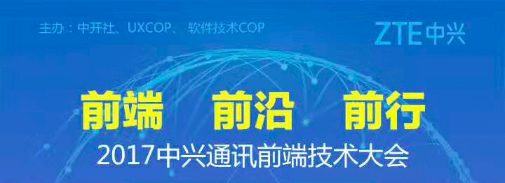
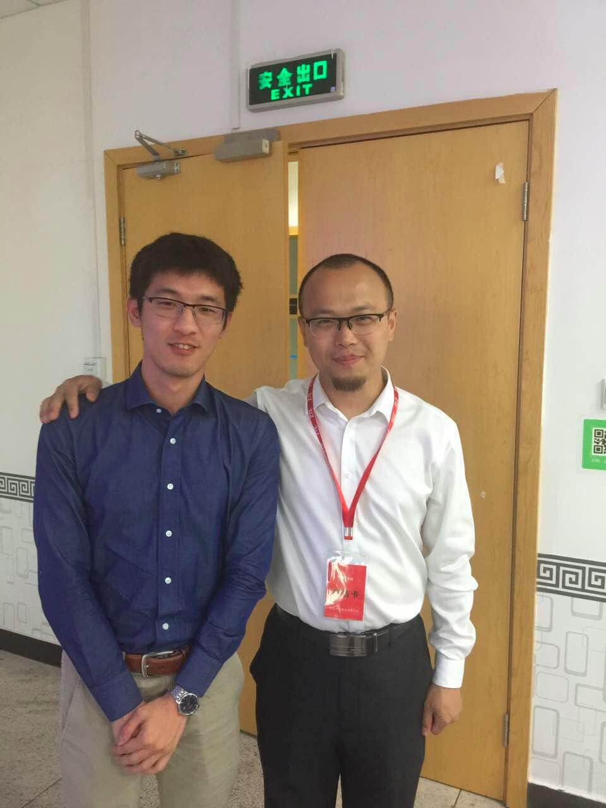
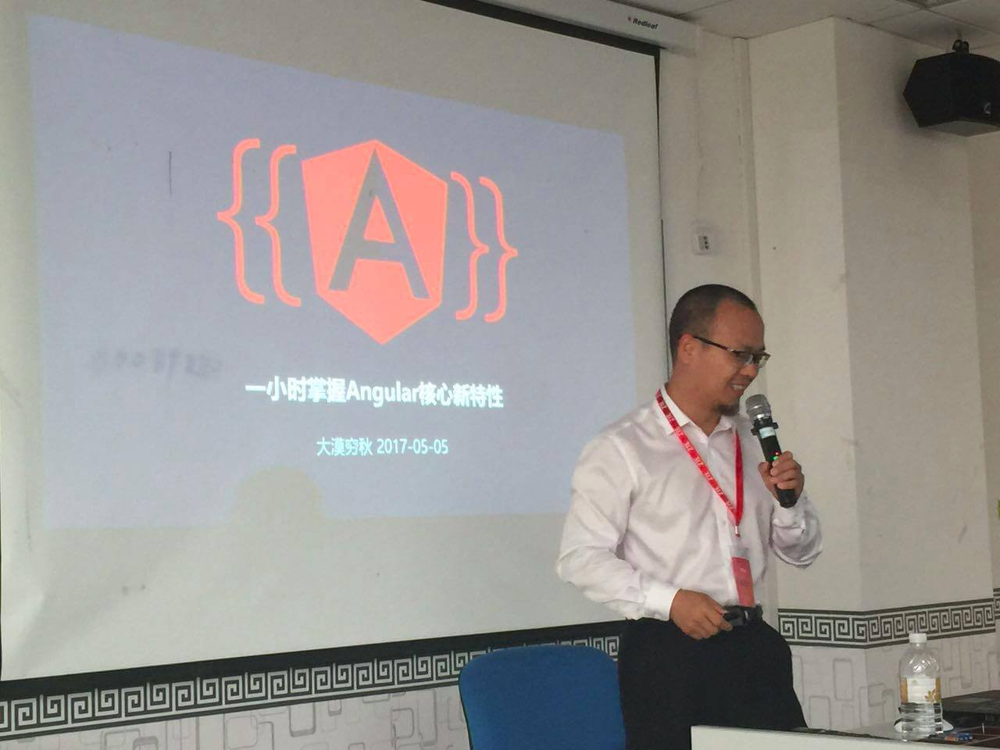

<!--more-->

今天公司层面举办了一次前端大会，请了公司内部重量级的前端大咖和UX大咖以及大漠穷秋（章小飞）老师。忘了以后还有幸和大漠穷秋老师一起吃了一顿饭，感觉还是很开心的。

大漠穷秋老师以前是中兴软创的，现在是Google Angular项目组在中国的开发者PM，出版过《Ext江湖》、《ActionScript3.0游戏设计基础（第二 版）》、《用AngularJS开发下一代WEB应用》等书籍，录制过[《AngularJS实战》](http://imooc.com/view/156)和[《Angular2.0视频教程》](https://my.oschina.net/mumu/blog/834254)等视频教程。

此处应该有大漠穷秋老师和我的合影一张（不要脸状o(*////▽////*)q）

公司内部的前端大咖和UX大咖们主要讲了内部的一些组件库的介绍以及一些web缓存、web安全之类的介绍，因为涉及到公司的一些东西，这里就不多说了。

大漠穷秋老师主要介绍了前端发展史、Angular-CLI、angular（angularJS指的是angular1，而angular指的是2及其以上版本）中核心的三个概念（component、module、route），Angular核心架构思想（组件化、依赖注入、数据绑定），其实内容主要基于[Angular2.0视频教程来了！](https://my.oschina.net/mumu/blog/834254)这篇博客，大家也可以自己上去看。

其实我对Angular-CLI这个东西还是很有好感的，大漠老师也是在这个章节介绍了前端的发展历史和历史上用过的工具后引出了Angular-CLI这个东西，用ppt上的话就是`Angular-CLI is more than a tool,it is a PLATFORM!`。其实他底层集成webpack、karma等一些东西，包括像Angular中AOT和摇树优化仅仅只需要在ng命令后添加一句话就行，而不是像官网一样做一大堆配置，并且使用这个工具可以得到一个更清晰的项目结构。所以可以把Angular-CLI理解成一个为Angular服务的平台，更加快速方便的进行开发。

在提问环节中，因为我们团队有前端测试的需求，大漠穷秋老师给出的回答是这样的，前端的测试建议在产品发布之前进行测试，不然需要维护很多测试用例，特别是前端界面一改，测试用例就需要变，维护成本太高。

对于有的团队有ng1升级到ng2的想法，大漠穷秋老师给出的答案是直接用ng2重写，因为ng1升级到ng2是破坏性的升级，升级耗费的时间还不如重写。而对于ng2到ng4的升级则是比较平滑的，没有break change，所以可以放心升级。我已经把我们项目从ng2升级到了ng4，暂时没有什么毛病，升级教程可以参考[Angular4.0.0正式发布，附新特性及升级指南](https://zhuanlan.zhihu.com/p/26001925)。

最后，感谢王博腾出一天时间让我们去参加这次大会，收货还是蛮大的，最后还带我去和大漠穷秋老师吃了一次饭，第一次和大咖们一起吃饭，好激动，以至于啥都没问，就顾着听大咖们讲了，哈哈哈。

