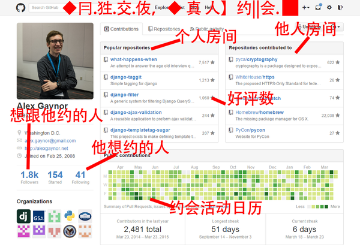

<!--more-->

# Git和Github简介

Git是由 Linux 之父 Linus Tovalds 创立的代码版本控制系统。你可以简单地把Git理解为管理代码历史记录的工具。比如，以前我管理需要反复修改的文档时，一般都是手动以日期加版本号来备份文档，有了git以后，我只需要一份文档，随时查看更改的内容，如果写错了，可以随时回退到之前的任意版本，即使删除了，也可以恢复。

而Github是基于Git的项目托管平台。Github现在已经是全球最大的社交编程及代码托管平台，经常被人调侃成全球最大的同性交友网站，简称Gayhub。

下面是[知乎](https://www.zhihu.com/question/28976652/answer/42804737)上关于Github界面的一张经典图片：

基于Github，你可以做很多事情，比如写书、搭建博客、多人协作翻译、项目管理，政府文件管理（日本政府已经把[宪法](https://github.com/gitlaw-jp/japanese-law)放上去了，英国政府也在上面提供了很多[政府项目的源代码或者设计原则之类的东西](https://github.com/alphagov?page=1)。）、科研项目和数据管理等等。

# 基于Github的敏捷开发

发现这个技巧是在翻Angular仓库的时候发现的，熟悉基于JIRA的Scrum敏捷开发的人应该对下面几张截图比较熟悉：

参考Angular团队，就可以利用Github进行个人项目的敏捷开发或者学习。

关于敏捷开发：

一般敏捷开发以两周为一个周期，称为一个迭代。在一个迭代中快速完成预估的工作量。我们团队的Scrum敏捷开发的步骤如下：

1.需求澄清会：搞清楚用户需求。

2.迭代会：提炼出核心需求，把每个工作分解，并估算完成点数（人数×天数），开完会后录入Jira中管理。

3.站会：每天早上开一个短会，每个人讲一下昨天做了什么、今天要做什么、遇到了什么困难。根据站会的内容，同步Jira中对应任务的进度。

4.回顾会：让领导对这个迭代内做的产品进行评估，提出问题，同时每个人说一下这个迭代收获或者需要改进的地方。

## 一个简单的案例

比如我现在Github上有一个叫[Professional-JavaScript-Demo](https://github.com/tc9011/Professional-JavaScript-Demo)的仓库，这是我用来学习《JavaScript高级程序设计》的，这本书有25章节，共730页。假设现在我把每一章算作是一个迭代（也就是两周）任务，这个任务又分成读完整章和整理整章的知识点两部分。基于这个前提，下面我们就利用Github进行敏捷学习。

首先，在`Projects`标签页中创建一个项目：

创建完后就可以看到这个界面：

此时点击`Add column`，创建三个列：准备，进行中和完成：

创建完了以后如下图所示，是不是感觉有点像jira了，哈哈哈。

接下来就是要创建卡片任务了，点击`准备`一列中右上角的`+`号，创建卡片任务，创建完了，点击卡片右上角的下拉符号，选择`convert to issue`，创建关联的`issue`。

这时候在`issue`标签页中就能看到关联的`issue`了，如下图所示。按照同样的步骤，创建一个叫`第六章知识点整理`的卡片。

在上图鼠标的上方有个`Milestones`按钮，没错，这相当于Jira里面的里程碑，在里程碑中，我们把`第六章知识点整理`和`读完第六章`作为一个里程碑，表示整个第六章完成了。

首先点击创建里程碑：

然后在这边可以选择里程碑结束日期，比如我选16号：

创建完如图所示：

然后我们需要把两个issue和这个里程碑关联起来，点击进入之前创建的issue，在右边栏中关联里程碑：

这时候类似于Jira的敏捷开发的管理工具就创建完成了。

假设我已经读完第六章了，也就是完成了卡片任务中的一个，这时候你可以在`projects`中把`读完第六章`的卡片拖到完成：

然后在`issue`中，点击下方白色的`close issue`按钮，把`读完第六章`这个issue关闭：

这时候你的里程碑会自动同步进度：

以上就是基于Github的敏捷开发流程的一个简单例子。

# 参考文章

1. [怎样使用 GitHub？](https://www.zhihu.com/question/20070065)
2. [基于JIRA的Scrum敏捷开发的项目管理](http://blog.csdn.net/jamenew/article/details/54864440)
