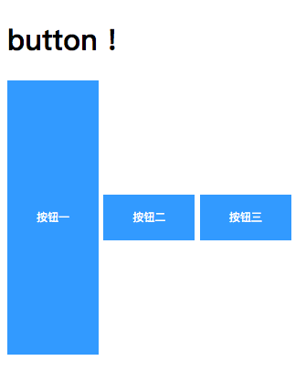
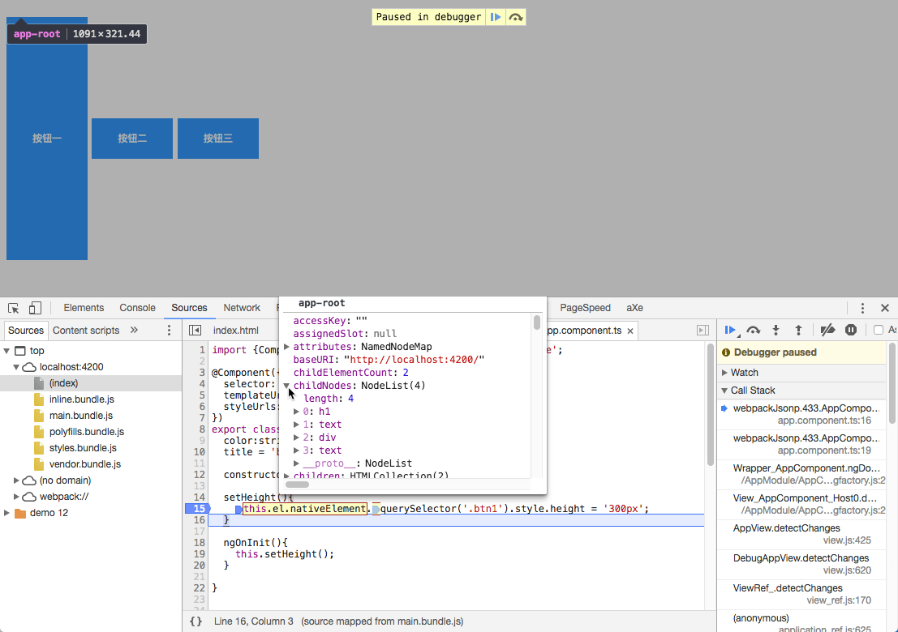
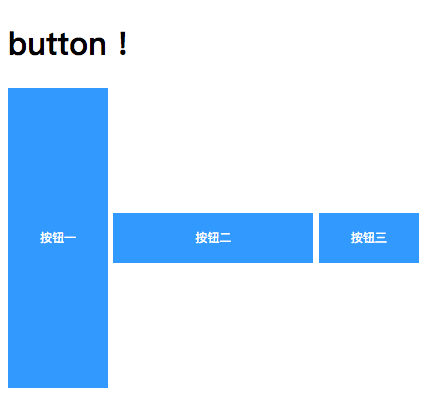

<!--more-->

在使用Angular2+中，经常会想快速的去选择DOM上的某个元素，如果是刚上手Angular，有可能直接就使用原生DOM操作或者导入jQuery再进行DOM操作，既然都使用了Angular了，有没有更好的方法呢？答案是肯定的。

# 通过ElementRef

先上代码：

```typescript
import {Component, ElementRef, OnInit} from '@angular/core';

@Component({
  selector: 'app-root',
  templateUrl: './app.component.html',
  styleUrls: ['./app.component.css']
})
export class AppComponent implements OnInit{
  color:string;
  title = 'button !';

  constructor(private el:ElementRef){}

  setHeight(){
    this.el.nativeElement.querySelector('.btn1').style.height = '300px';
  }

  ngOnInit(){
    this.setHeight();
  }

}
```

```html
<h1>
  {{title}}
</h1>
<div>
<button myHighlight class="btn btn1">按钮一</button>
<button myHighlight class="btn">按钮二</button>
<button myHighlight class="btn">按钮三</button>
</div>
```

效果是这样：



上述代码中的`nativeElement`其实包含的是**组件**中所有的DOM元素，如下图所示：



通过调用`querySelector`API就能获取页面元素，需要注意的是`querySelector`只返回第一个元素，当你需要选择多个元素的时候可以使用`querySelectorAll`。

# 通过@viewChild

```html
<h1>
  {{title}}
</h1>
<div>
<button myHighlight class="btn btn1">按钮一</button>
<button myHighlight class="btn" #btn>按钮二</button> <!--增加一个变量-->
<button myHighlight class="btn">按钮三</button>
</div>
```

```typescript
import {Component, ElementRef, OnInit, ViewChild} from '@angular/core';

@Component({
  selector: 'app-root',
  templateUrl: './app.component.html',
  styleUrls: ['./app.component.css']
})
export class AppComponent implements OnInit{
  @ViewChild('btn') btn:ElementRef;//通过@ViewChild获取元素

  color:string;
  title = 'button !';

  constructor(private el:ElementRef){}

  setHeight(){
    this.el.nativeElement.querySelector('.btn1').style.height = '300px';
  }

  setWidth(){
    this.btn.nativeElement.style.width = '200px';//定义宽度
  }

  ngOnInit(){
    this.setHeight();
    this.setWidth();
  }

}
```

效果如下：



如果多个HTML元素都定义了相同的变量，使用`@viewChild`时只能选择到第一个元素。

更好的方法是配合`renderer2`对象提供的API去实现同样的效果，这样减少应用层与渲染层之间强耦合关系：

```typescript
import {Component, ElementRef, OnInit, Renderer2, ViewChild} from '@angular/core';

@Component({
  selector: 'app-root',
  templateUrl: './app.component.html',
  styleUrls: ['./app.component.css']
})
export class AppComponent implements OnInit{
  @ViewChild('btn') btn:ElementRef;

  color:string;
  title = 'button !';

   //初始化renderer2
  constructor(private el:ElementRef,private renderer2: Renderer2){}

  setHeight(){
    this.el.nativeElement.querySelector('.btn1').style.height = '300px';
  }

  setWidth(){
    // this.btn.nativeElement.style.width = '200px';
    
    //使用renderer2的setStyle方法设置宽度
    this.renderer2.setStyle(this.btn.nativeElement,'width','200px')
  }

  ngOnInit(){
    this.setHeight();
    this.setWidth();
  }

}
```

参考文章中都提到了`@viewChild`配合`renderer`选择元素，但是在Angular4中`renderer`已经废弃掉了，变成了`renderer2`。

`renderer2`API中还有其他的一些方法可以用来进行一些DOM操作：

```typescript
class Renderer2 {
  data : {[key: string]: any}
  destroy() : void
  createElement(name: string, namespace?: string) : any
  createComment(value: string) : any
  createText(value: string) : any
  destroyNode : (node: any) => void |
  appendChild(parent: any, newChild: any) : void
  insertBefore(parent: any, newChild: any, refChild: any) : void
  removeChild(parent: any, oldChild: any) : void
  selectRootElement(selectorOrNode: string|any) : any
  parentNode(node: any) : any
  nextSibling(node: any) : any
  setAttribute(el: any, name: string, value: string, namespace?: string) : void
  removeAttribute(el: any, name: string, namespace?: string) : void
  addClass(el: any, name: string) : void
  removeClass(el: any, name: string) : void
  setStyle(el: any, style: string, value: any, flags?: RendererStyleFlags2) : void
  removeStyle(el: any, style: string, flags?: RendererStyleFlags2) : void
  setProperty(el: any, name: string, value: any) : void
  setValue(node: any, value: string) : void
  listen(target: 'window'|'document'|'body'|any, eventName: string, callback: (event: any) => boolean | void) : () => void
}
```

# 参考文章

1. [[译]Angular2新人常犯的5个错误](http://www.open-open.com/lib/view/open1461113267205.html#articleHeader1)；
2. [Angular 2 ElementRef](https://segmentfault.com/a/1190000008653690)
3. [Angular Renderer2](https://angular.cn/docs/ts/latest/api/core/index/Renderer2-class.html)
