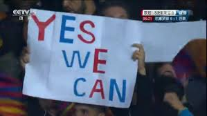
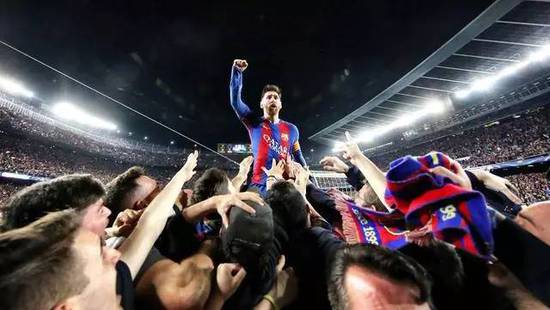

<!--more-->

今天凌晨看完球到现在久久不能平静，虽然加午休只睡了5个小时，但是到现在仍然竟然一点都不困，仍然处于亢奋状态，我想这就是足球的魅力吧。

看比赛前我觉得已巴萨这几场比赛的状态，我觉得打巴黎个4比0是不成问题的，毕竟大巴黎没了大奉先后，实力根本和巴萨不是一个档次的。

恩里克也排出了3-3-4阵型，我也是第一次在欧冠上看到一上来就是4前锋的阵型，巴萨全队看来是众志成城。

上半场理所当然的压着大巴黎，运气也在巴萨这边，小白造的乌龙球球真的是当时久攻不下的强心剂。当时我就想似乎按照这样下去巴萨有可能踢个4比0打加时，或者5比0直接晋级，当然这场被称为欧冠有史以来最伟大的逆转（没有之一）不可能这么简单就称为伟大。

下半场卡瓦尼的进球似乎想钉子一样把巴萨钉在了出局名单上，我承认当时我是绝望的。就好比巴黎的4比0捅了巴萨一刀，但是巴萨没死，挣扎着站起来的时候，大巴黎又捅了巴萨一刀。这放在哪个队都是直接放弃比赛，缴枪投降的。但是这是巴萨，苏亚雷斯没有放弃，他一次次冲击禁区，哪怕球出了底线也奋力追；梅西没有放弃，他一次次回撤组织进攻、不停跑位；内马尔也没有放弃，一次次不停突破、传中...

然而奇迹真的出现了，先是内马尔的任意球，划过美丽的弧线直奔死角；然后苏亚雷斯突破造点。此时已经是91分钟了，留给巴萨的时间真的不多了，要么被淘汰、要么再进一个逆转。

还是内马尔，一个轻盈的挑传，罗伯托像鬼魅般冒了出来，出现在正确的时间、正确的地点，用正确的方式把球捅进去。若不是怕影响舍友睡觉，此时我应该已经疯了吧，我狠狠地拍了拍枕头，“真TM牛逼！”

这样的球队你怎么能不爱，大巴黎连捅两刀，巴萨只要没死，就继续战斗，直到打败对手，这种逆转把足球乃至竞技体育的精神体现得淋漓尽致。

就像标题图片中球迷打出的标语：“Yes！We Can！”，是的，我们真的做到了，赛前连欧足联官方给出的比赛预测，巴萨晋级概率都是0，就这样，我萨还是做到了。

感谢巴萨，感谢这场世纪逆转，

让我们领略足球世界中的非凡魅力和无限可能性，

让我们重拾对生活的热爱，与对梦想的渴望追寻。

人生真是充满了阳光啊！

最后以煤老板的霸气庆祝图结尾，我心红蓝！

