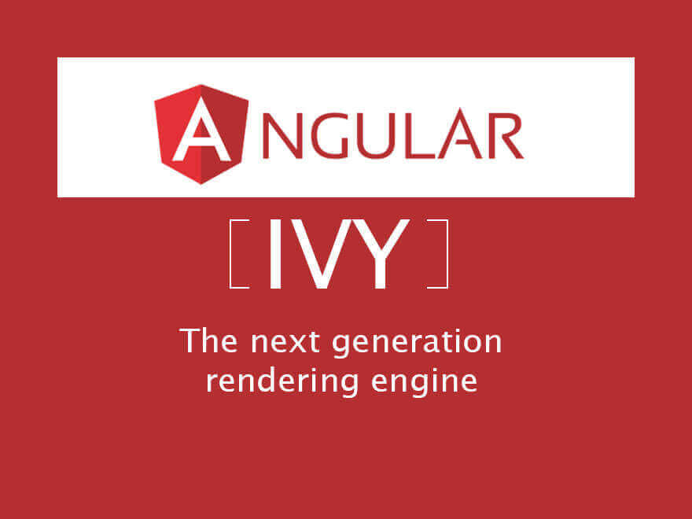

<!--more-->

> 截止到2018年11月30号，根据[is-angular-ivy-ready](https://is-angular-ivy-ready.firebaseapp.com/#/status)显示，Angular Ivy 已经完成了93.46%，基本上接近完工。但是国内对 Ivy 介绍却很少，这次把今年4月ng-conf2018中关于 Angular Ivy 的PPT翻译一下，希望让更多人了解到和 Angular Ivy 有关的一些信息。
>
> 点击可以查看[PPT](https://docs.google.com/presentation/d/1zgpjyVkDgUPfGKuxOcU0lLusCiMSfLZZjYHWrFvl71I/edit#slide=id.g26d86d3325_0_0)

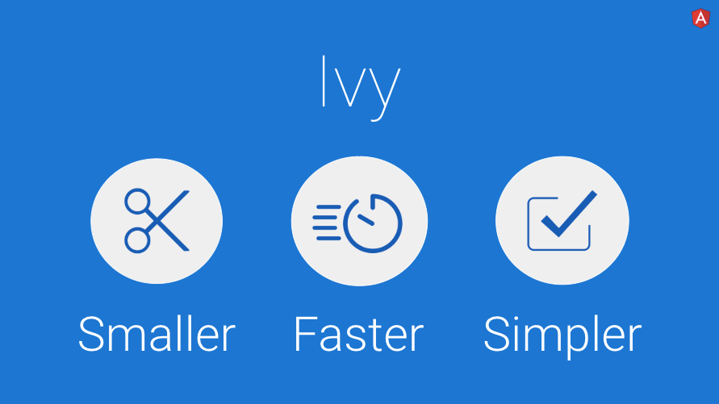

正如 Brad 先前提到的，Angular 的价值观以我们的用户，开发者和社区为中心。 Ivy 的目标是为 Angular 的价值观服务。

 -  Ivy 专注于用户，通过让浏览器下载更少的资源，使应用程序启动更快，来提高用户体验。
 -  它通过简化 API 和构建系统来帮助开发人员。
 -  最后，它通过使编译管道更友好来帮助社区，从而为第三方贡献提供了可能性。

这些目标要求我们对编写代码的方式有不同的看法，并且我们希望与你分享这将为你的应用程序带来的结果和好处。

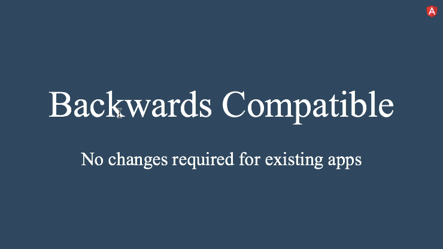

但首先，不要害怕！ 我们在这里所做的工作是100％向后兼容的，因此你不必对你的应用程序进行任何更改。 你的升级体验将与你对 Angular 团队的期望一样顺畅。 升级版本后，你将获得新的好处，并且你的应用程序仍然能很好的工作。 升级到 Ivy 意味着你的应用程序将继续工作而不会进行任何更改。 将有新的 API让你可以利用 Ivy 的一些更高级的功能。

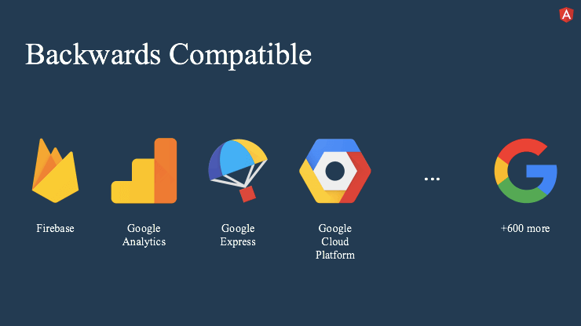

现在，当我说Ivy向后兼容时，我真的想要强调它的重要性。 在谷歌，我们现在有超过600个应用程序，它们都是构建在新的Angular之上。 我们还有一个版本政策，这意味着我们不允许在旧版本的Angular上保留现有的应用程序。 因为我们每天都在将Angular同步到Google，所以所有应用程序都需要每次同步之后继续工作。 我们几乎不可能做出一个破坏性的改变。 因此，当你获得代码时，你可以确信它已被现实世界的应用程序充分验证过。

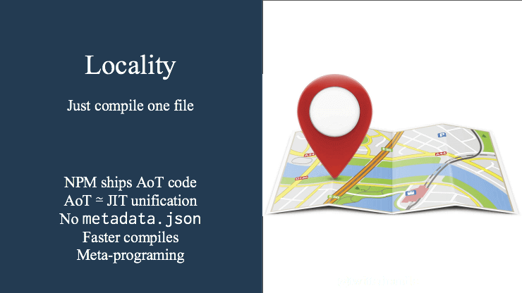

Ivy 有很多东西，但 Ivy 背后的一个重要思想就是我们所谓的 “locality”。简而言之，这意味着当编译器翻译模板时，只允许使用对它来说 “local” 的信息。local 意味着只有与组件描述直接关联的信息。这与当前 Angular 渲染管道的全局优化方法形成对比。那么让我们来谈谈 locality 给 Angular 带来的一些好处：

* Locality 允许第三方库将预编译模板发送到 NPM。这很重要，因为对于使用这些库的应用程序来说，它将极大地简化和加速编译。
* 有了 locality ，AoT / JIT的区别变得很小，几乎消失了。允许一个人自由地混合使用两者，例如在测试和开发中。对于生产，我们仍然只推荐 AoT。
* Locality 不再需要`Metadata.json`文件。这极大地简化了第三方库的发布和开发以及与现有工具链的互用性。
* Locality 大大修剪了编译图。这允许简化构建工具并更快地重建大型项目。
* 而我个人的最爱：Locality 支持元编程。今天，无法在运行时创建组件，Ivy 将成为可能。一个元编程的例子是高阶组件。 （不仅仅是为了让HOC成为可能而倡导HOC。）

Locality 只是我们对 Ivy 坚持的一个原则。还有其他原则，但我们没有时间在这里讨论它们。

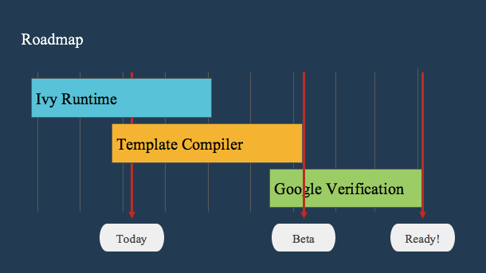

> “today”是指2018年4月18日。
>
> 你可以看到Ivy开始于runtime，与模板编译器的工作重叠。一旦完成这些，beta版将开始进行Google的内部验证流程。此验证过程包括确保Ivy不会对使用Angular的600多个内部应用程序进行重大更改。这确保了在Ivy发布之前将完全向后兼容。
>
> 下面是 Ivy 核心开发者 Kara Erickson 的PPT介绍

Ivy 那么改变了什么？除了 Locality 之外，主要的变化是新系统的设计考虑了 tree-shaking。换句话说，渲染器代码的重写方式使得你未使用的任何 Angular 代码都可以简单地在构建步骤中被 tree-shaking 掉。这真的令人兴奋，因为这意味着你将留下一个更小的bundle。

我们正在进行的更改都在幕后 - 所以作为 Angular 开发人员 - 你实际上不必更改你正在编写的代码。但我会花一些时间来解释这个新设计是如何工作的，因为它实际上非常酷，我真的希望你理解为什么你会看到，使用 Ivy 后比用现在版本的 Angular 会得到更好的结果。

让我们先谈谈 tree-shaking。

如果你还没有听说过 tree-shaking，那么它本质上是一个构建优化步骤，可确保未使用的代码不会最终出现在你发送到浏览器的最终包中。通常，未使用的代码来自第三方库。

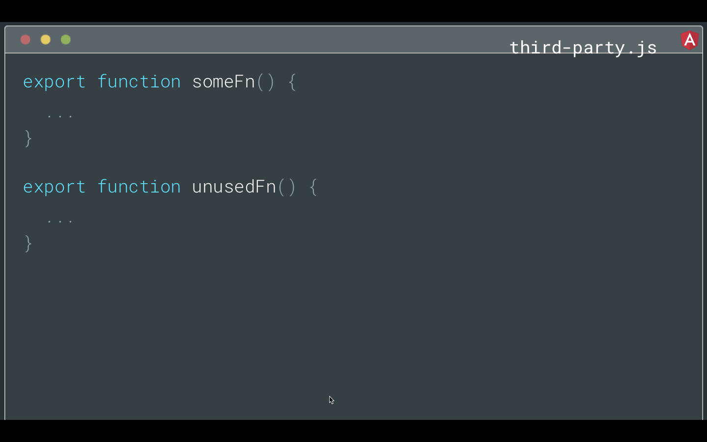

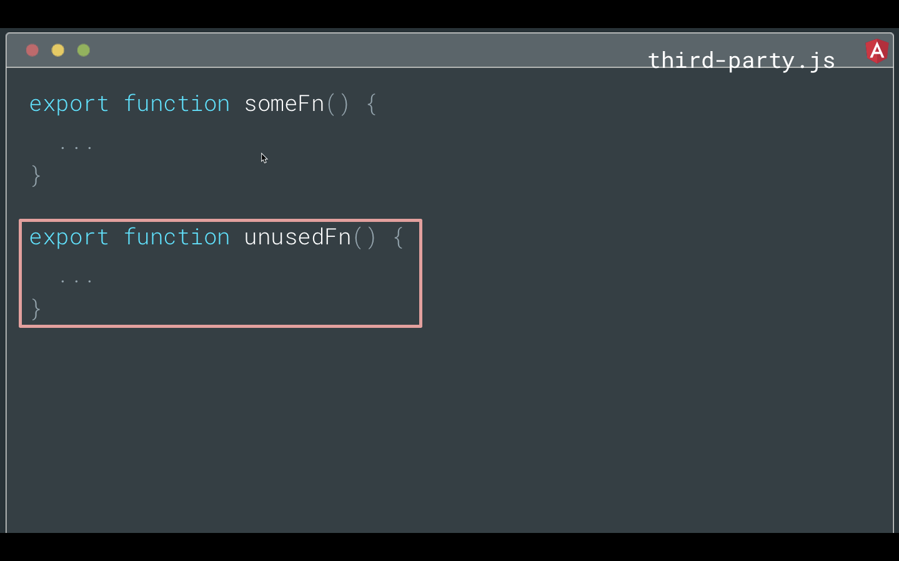

举一个简单的例子，如果你在第三方库中使用`someFn`，但是在这里没有使用过`unusedFn`，一个 tree-shaking 工具可以确保`unusedFn`不会在你最终的 bundle 中。

有一些工具可以做到这一点，比如：

* rollup，它使用 live code inclusion 来确保未使用的代码不会添加到你的 bundle 中 
* Uglify，它分析已经打包的代码并尝试从中删除没有的代码

无论你选择哪种工具，它们的功效取决于你编写代码的方式。 我会告诉你我的意思。

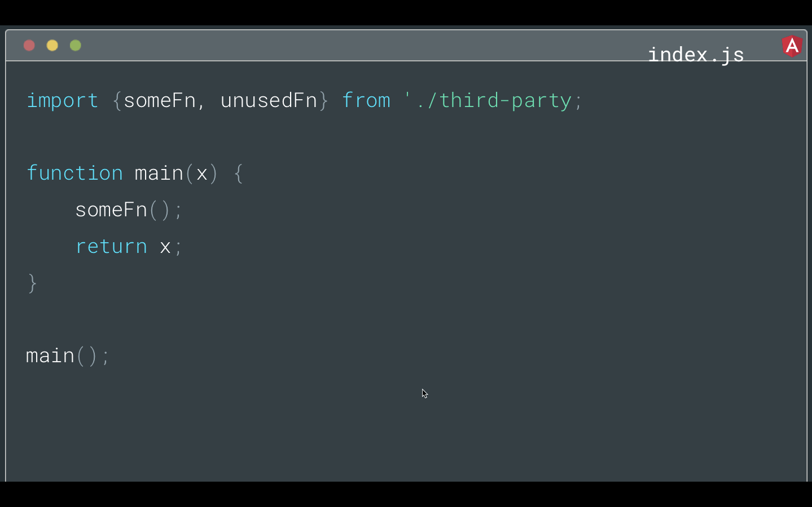

例如，假设你有一个从第三方导入的`someFn`，它在你的`main`函数中使用。

tree-shaking 通常使用引用的静态分析来确定要在 bundle 中保留哪些代码。

因为`someFn`在`main`函数中被引用，所以它将保留在 bundle 中。 `UnusedFn`不是，所以它不会在最终的 bundle 中。

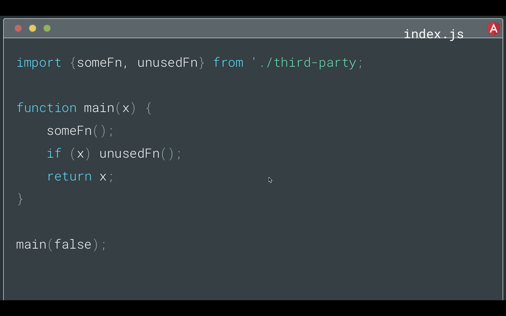

但是我们换一个场景，如果只有条件检查通过，你才能使用`unusedFn`。

当你运行代码时，条件将最终为`false`，因此你仍然不需要`unusedFn`。 它会从 bundle 中删除吗？

答案是否定的，因为在`main`中引用了`unUsedFn`。 请记住，tree-shaking 通常使用引用的静态分析。 它将尝试在不实际运行程序的情况下找出所需内容，并且存在限制。 通常，它必须假设最坏的情况以确保生成的程序是正确的，因此在这种情况下，它不确定该值在运行时将是什么，所以将保留`unusedFn`。

因此，当我们编写框架代码时，我们必须考虑避免这种情况。

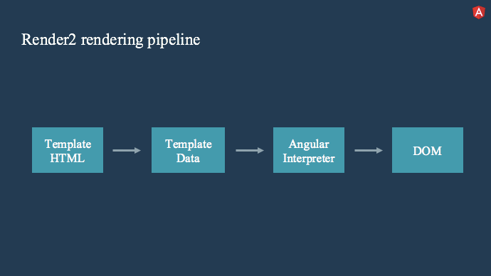

Ok，有了上面的铺垫，让我们回到渲染管道以及它是如何被重构的。 首先，快速概述当前渲染器的工作原理。

目前，你编写的模板 HTML 通过 Angular 编译器运行，并生成代表模板结构的高度优化的JS 代码。 在运行时，此数据结构将传递给 Angular 解释器，Angular 解释器使用数据来确定如何创建DOM。

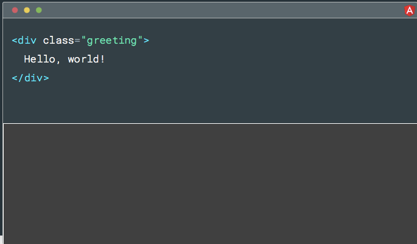

在实践中，它看起来像这样。 假设你有一个`hello world`模板，它只是一个带有`class`的`div`。

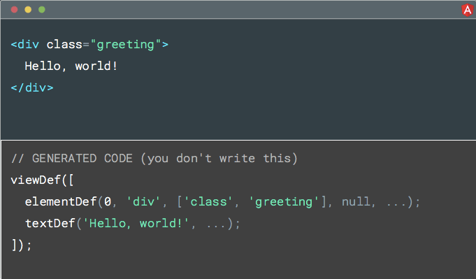

当前，编译器可能生成类似这样的东西，一些`defs`代表模板的结构。 例如，`viewDef` 包含`div`的`elementDef`和`hello world`的`textDef`。

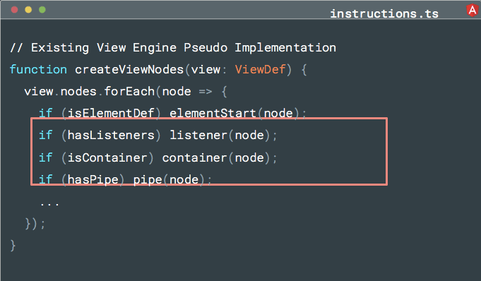

然后在运行时将此定义传递给 Angular 解释器，Angular 使用该`def`来确定要运行哪些操作以正确生成DOM。

这非常有效。 唯一的问题是每个Angular模板都经过相同的代码路径，因此解释器不会提前知道它将看到哪种模板。 因此，它需要检查是否需要为其提供的模板执行每个操作。

正如我们之前所述，因为静态分析的工作方式，这些条件检查在运行时的值是什么并不重要，这里引用的所有函数都将保留在最终的 bundle 中，即使在代码路径中是没用过。

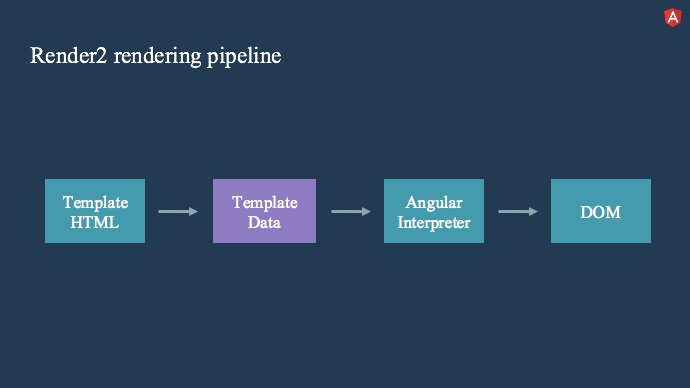

当我们设计 Ivy 时，我们考虑到了这个问题。 当我们不能提前知道你的模板长什么样子时，我们如何确保未运行的代码不包含在 bundle 中？

这里有一个聪明的解决方案。 不生成模板数据并将其传递给解释器，然后解释运行哪些操作。

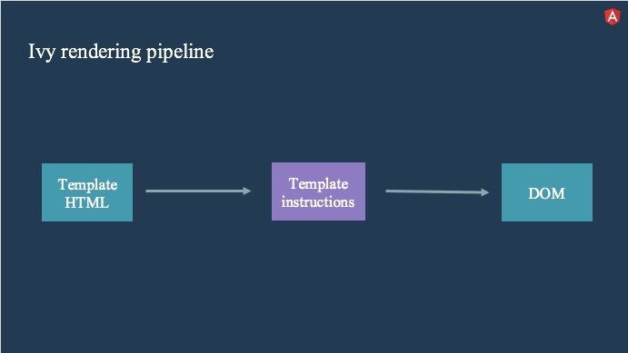

我们直接生成一组模板指令。 这些指令将完成自己正确创建DOM的工作。 因此，我们不再需要一个解释器来检查是否需要每个操作，并且引用未使用的函数。

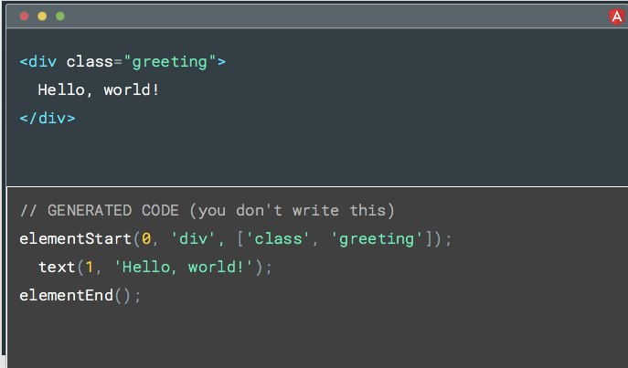

对于和之前相同的模板，我们可能会生成这样的东西。 有三个指令：

- elementStart  - 它将在DOM中创建元素
- text - 将在DOM中创建文本节点
- elementEnd  - 基本上会执行一些内部处理

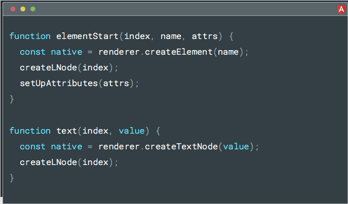

所以现在如果你看一下Angular代码，我们不需要进行任何条件检查。 我们只有原子函数来转换DOM，并根据你编写的模板生成。

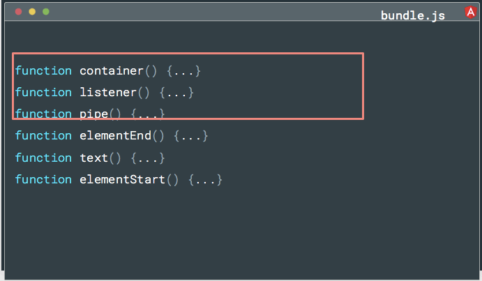

因此，如果你没有使用某些Angular功能，例如`container`或`listener`或`pipe`......他们的指令就不会从你编写的模板中生成。 因为它们尚未生成，所以不会有引用，并且可以通过 tree-shaking 安全地删除它们。

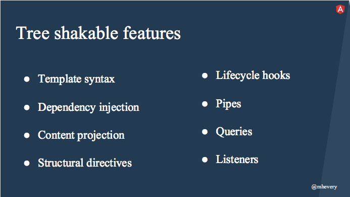

我们已经将这个策略用于我们可以想到的每个功能。因此，如果你不使用`queries `或结构指令或生命周期钩子，那么可以通过 tree-shaking 工具删除该代码。

这真的很酷，因为这意味着你只需要关注实际使用的 Angular 特性，同时你的 bundle 大小可以显着缩小。 这反过来可以提高你的应用程序的启动性能，我知道很多人都在关注。

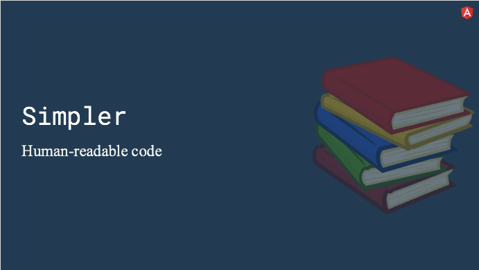

生成指令的另一个好处是 Ivy 生成的代码更容易阅读和理解。 为什么这很重要？

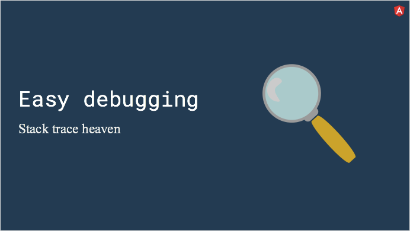

如果你能够理解并完成框架对代码执行的操作，则可以更轻松地调试 Angular 应用程序。

> 在2018 ng-conf 上 Angular团队给出了一个 ivy 的 todo 应用的 demo :[ivy-todo-list](https://ivy-todo-mvc.firebaseapp.com/)，这个应用的 bundle 大小是12.2kb，这个 todo app 的 demo 就在github angular 的仓库中，地址：https://github.com/angular/angular/tree/master/packages/core/test/bundling/todo；
>
> 这个todo 在本地跑起来需要安装 Bazel ， 然后通过 bazel 去运行这个app。 

你喜欢这些演示吗？ 所以非常神奇的东西正在为 Ivy 而来。 我对 Ivy 的承诺感到非常兴奋，这是我们最重要的事情。

在我们将这个演示文稿包起来之前，我想解决一下我们与 Brad 一起做的旧赌注。 早在2016年5月，是两年前 Brad 向你们所有人做出了这个承诺。

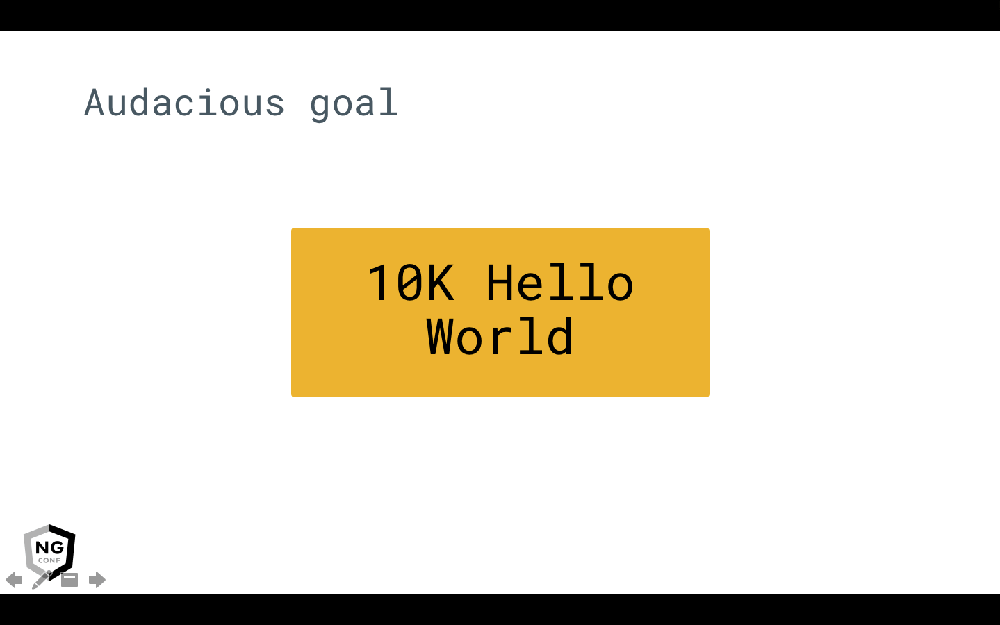

有些人可能还记得这张幻灯片。 是的，如果我们得到10Kb以下的Angular Hello World，Brad就会答应一块蛋糕。 布拉德没有说明它是 minified 还是压缩后的数字，但可以肯定地说我们击败了两者。

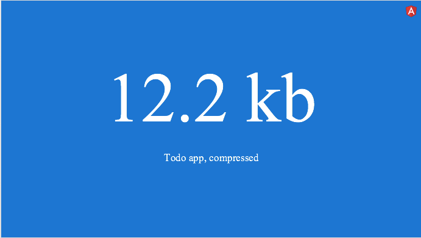

这个 Todo 应用压缩后12.2 Kb。 

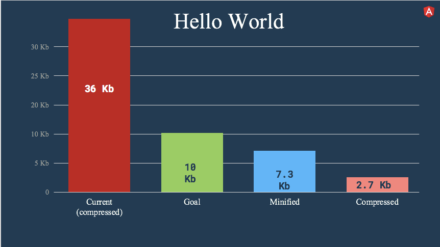

在当前的Angular中，压缩的Hello World大约为36 Kb，而Kara已经发现我们的hello world 最小化后 7.3kb，压缩后 2.7kb。 所以 Ivy 成功地击败了10KB的门槛。 我们不仅仅是刚刚跨过这个门槛，而是大幅度地超过这个门槛。
