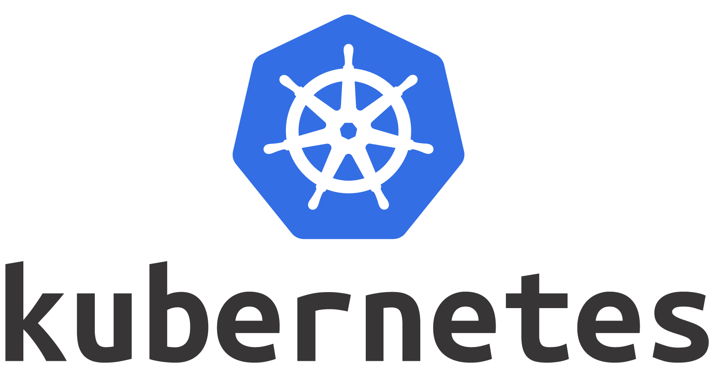

<!--more-->

最近沉迷在 Kubernetes 和 ceph 部署中不能自拔，作为初学者，基本上把可能踩的坑都踩了一遍，先分享一下怎么部署 Kubernetes 集群，过段时间再把 ceph 集群部署和 ceph fs 部署的不完全指南分享一下。

首先，我们要知道 Kubernetes 是什么：

> Kubernetes简称为k8s，它是 Google 开源的容器集群管理系统。在 Docker 技术的基础上，为容器化的应用提供部署运行、资源调度、服务发现和动态伸缩等一系列完整功能，提高了大规模容器集群管理的便捷性。
>
> K8s 是一个完备的分布式系统支撑平台，具有完备的集群管理能力，多层次的安全防护和准入机制、多租户应用支撑能力、透明的服务注册和发现机制、內建负载均衡器、强大的故障发现和自我修复能力、服务滚动升级和在线扩容能力、可扩展的资源自动调度机制以及多粒度的资源配额管理能力。同时 K8s 提供完善的管理工具，涵盖了包括开发、部署测试、运维监控在内的各个环节。

如果你想更加详细了解 k8s ，可以去看看[IBM的视频](https://developer.ibm.com/cn/tv/2018/opentec-k8s/)，讲的还可以。

这个教程是对三台阿里云机器进行 k8s 部署，系统是Ubuntu 16.04.4 LTS。其中一台是 master ，其他两台是 worker。

## 安装 git

```bash
$ sudo apt-get update
$ sudo apt-get install git
```

这步主要为后面部署 ceph 服务。

## 安装 Docker

添加使用 HTTPS 传输的软件包以及 CA 证书

```bash
$ sudo apt-get update
$ sudo apt-get install \
    apt-transport-https \
    ca-certificates \
    curl \
    software-properties-common
```

添加软件源的 `GPG` 密钥

```bash
$ curl -fsSL https://download.docker.com/linux/ubuntu/gpg | sudo apt-key add -
```

向 `source.list` 中添加 Docker 软件源

```bash
$ sudo add-apt-repository \
   "deb [arch=amd64] https://download.docker.com/linux/ubuntu \
   $(lsb_release -cs) \
   stable"
```

更新 apt 软件包缓存，并安装 `docker-ce`

```bash
$ sudo apt-get update
$ sudo apt-get install docker-ce
```

在测试或开发环境中 Docker 官方为了简化安装流程，提供了一套便捷的安装脚本，Ubuntu 系统上可以使用这套脚本安装：

```bash
$ curl -fsSL get.docker.com -o get-docker.sh
$ sudo sh get-docker.sh --mirror Aliyun
```

测试是否安装正确：

```bash
$ docker run hello-world

Unable to find image 'hello-world:latest' locally
latest: Pulling from library/hello-world
d1725b59e92d: Pull complete
Digest: sha256:0add3ace90ecb4adbf7777e9aacf18357296e799f81cabc9fde470971e499788
Status: Downloaded newer image for hello-world:latest

Hello from Docker!
This message shows that your installation appears to be working correctly.

To generate this message, Docker took the following steps:
 1. The Docker client contacted the Docker daemon.
 2. The Docker daemon pulled the "hello-world" image from the Docker Hub.
    (amd64)
 3. The Docker daemon created a new container from that image which runs the
    executable that produces the output you are currently reading.
 4. The Docker daemon streamed that output to the Docker client, which sent it
    to your terminal.

To try something more ambitious, you can run an Ubuntu container with:
 $ docker run -it ubuntu bash

Share images, automate workflows, and more with a free Docker ID:
 https://hub.docker.com/

For more examples and ideas, visit:
 https://docs.docker.com/get-started/
```

## 安装 kubeadm, kubelet 和 kubectl

因为某些你懂的原因，要更换阿里源，并安装kubelet kubeadm kubectl：

```bash
$ apt-get update && apt-get install -y apt-transport-https curl
$ curl -s http://packages.faasx.com/google/apt/doc/apt-key.gpg | sudo apt-key add -
$ cat <<EOF > /etc/apt/sources.list.d/kubernetes.list
deb http://mirrors.ustc.edu.cn/kubernetes/apt kubernetes-xenial main
EOF
$ apt-get update
$ apt-get install -y kubelet kubeadm kubectl
$ apt-mark hold kubelet kubeadm kubectl
```

如果遇到`gpg: no valid OpenPGP data found.`问题，参考[这篇文章](https://jaychang.iteye.com/blog/2427522)

## 使用kubeadm创建一个集群 

使用 kubeadm 创建 k8s 集群其实还蛮简单，最大的困难是那堵墙，当我费了一整天把那堵墙问题解决后，发现 1.13.0 版本居然提供了中国特供的一个功能，所以把两种方法都写出来，供大家参考。

### 1.13.0 版本之前

首先查询下当前版本需要哪些docker image：

```bash
$ kubeadm config images list --kubernetes-version v1.13.0
```

必须要指定版本，这样kubeadm才不会去连k8s.io。

新建一个`pull_k8s_images.sh`，根据查询到需要哪些镜像填写下面内容，以1.13.0为例：

```shell
K8S_VERSION=v1.13.0
ETCD_VERSION=3.2.24
DASHBOARD_VERSION=v1.8.3
FLANNEL_VERSION=v0.10.0-amd64
DNS_VERSION=1.2.6
PAUSE_VERSION=3.1

docker pull registry.cn-hangzhou.aliyuncs.com/google_containers/kube-apiserver:$K8S_VERSION
docker pull registry.cn-hangzhou.aliyuncs.com/google_containers/kube-controller-manager:$K8S_VERSION
docker pull registry.cn-hangzhou.aliyuncs.com/google_containers/kube-scheduler:$K8S_VERSION
docker pull registry.cn-hangzhou.aliyuncs.com/google_containers/kube-proxy:$K8S_VERSION
docker pull registry.cn-hangzhou.aliyuncs.com/google_containers/etcd:$ETCD_VERSION
docker pull registry.cn-hangzhou.aliyuncs.com/google_containers/pause:$PAUSE_VERSION
docker pull registry.cn-hangzhou.aliyuncs.com/google_containers/coredns:$DNS_VERSION

docker tag registry.cn-hangzhou.aliyuncs.com/google_containers/kube-apiserver:$K8S_VERSION k8s.gcr.io/kube-apiserver:$K8S_VERSION
docker tag registry.cn-hangzhou.aliyuncs.com/google_containers/kube-controller-manager:$K8S_VERSION k8s.gcr.io/kube-controller-manager:$K8S_VERSION
docker tag registry.cn-hangzhou.aliyuncs.com/google_containers/kube-scheduler:$K8S_VERSION k8s.gcr.io/kube-scheduler:$K8S_VERSION
docker tag registry.cn-hangzhou.aliyuncs.com/google_containers/kube-proxy:$K8S_VERSION k8s.gcr.io/kube-proxy:$K8S_VERSION
docker tag registry.cn-hangzhou.aliyuncs.com/google_containers/etcd:$ETCD_VERSION k8s.gcr.io/etcd:$ETCD_VERSION
docker tag registry.cn-hangzhou.aliyuncs.com/google_containers/pause:$PAUSE_VERSION k8s.gcr.io/pause:$PAUSE_VERSION
docker tag registry.cn-hangzhou.aliyuncs.com/google_containers/coredns:$DNS_VERSION k8s.gcr.io/coredns:$DNS_VERSION

docker rmi registry.cn-hangzhou.aliyuncs.com/google_containers/kube-apiserver:$K8S_VERSION
docker rmi registry.cn-hangzhou.aliyuncs.com/google_containers/kube-controller-manager:$K8S_VERSION
docker rmi registry.cn-hangzhou.aliyuncs.com/google_containers/kube-scheduler:$K8S_VERSION
docker rmi registry.cn-hangzhou.aliyuncs.com/google_containers/kube-proxy:$K8S_VERSION
docker rmi registry.cn-hangzhou.aliyuncs.com/google_containers/etcd:$ETCD_VERSION
docker rmi registry.cn-hangzhou.aliyuncs.com/google_containers/pause:$PAUSE_VERSION
docker rmi registry.cn-hangzhou.aliyuncs.com/google_containers/coredns:$DNS_VERSION
```

运行脚本：

```bash
$ ./pull_k8s_images.sh
```

然后用 kubeadm 进行初始化：

```bash
$ kubeadm init \
    --pod-network-cidr=192.168.0.0/16 \
    --ignore-preflight-errors=cri \
    --kubernetes-version=1.13.0
    
[init] Using Kubernetes version: v1.13.0
[preflight] Running pre-flight checks
[WARNING SystemVerification]: this Docker version is not on the list of validated versions: 18.09.0. Latest validated version: 18.06
[preflight] Pulling images required for setting up a Kubernetes cluster
[preflight] This might take a minute or two, depending on the speed of your internet connection
[preflight] You can also perform this action in beforehand using 'kubeadm config images pull'
[kubelet-start] Writing kubelet environment file with flags to file "/var/lib/kubelet/kubeadm-flags.env"
[kubelet-start] Writing kubelet configuration to file "/var/lib/kubelet/config.yaml"
[kubelet-start] Activating the kubelet service
[certs] Using certificateDir folder "/etc/kubernetes/pki"
[certs] Generating "etcd/ca" certificate and key
[certs] Generating "etcd/server" certificate and key
[certs] etcd/server serving cert is signed for DNS names [izuf6e4bl8eavupeu7q9a1z localhost] and IPs [172.19.217.71 127.0.0.1 ::1]
[certs] Generating "etcd/healthcheck-client" certificate and key
[certs] Generating "etcd/peer" certificate and key
[certs] etcd/peer serving cert is signed for DNS names [izuf6e4bl8eavupeu7q9a1z localhost] and IPs [172.19.217.71 127.0.0.1 ::1]
[certs] Generating "apiserver-etcd-client" certificate and key
[certs] Generating "ca" certificate and key
[certs] Generating "apiserver" certificate and key
[certs] apiserver serving cert is signed for DNS names [izuf6e4bl8eavupeu7q9a1z kubernetes kubernetes.default kubernetes.default.svc kubernetes.default.svc.cluster.local] and IPs [10.96.0.1 172.19.217.71]
[certs] Generating "apiserver-kubelet-client" certificate and key
[certs] Generating "front-proxy-ca" certificate and key
[certs] Generating "front-proxy-client" certificate and key
[certs] Generating "sa" key and public key
[kubeconfig] Using kubeconfig folder "/etc/kubernetes"
[kubeconfig] Writing "admin.conf" kubeconfig file
[kubeconfig] Writing "kubelet.conf" kubeconfig file
[kubeconfig] Writing "controller-manager.conf" kubeconfig file
[kubeconfig] Writing "scheduler.conf" kubeconfig file
[control-plane] Using manifest folder "/etc/kubernetes/manifests"
[control-plane] Creating static Pod manifest for "kube-apiserver"
[control-plane] Creating static Pod manifest for "kube-controller-manager"
[control-plane] Creating static Pod manifest for "kube-scheduler"
[etcd] Creating static Pod manifest for local etcd in "/etc/kubernetes/manifests"
[wait-control-plane] Waiting for the kubelet to boot up the control plane as static Pods from directory "/etc/kubernetes/manifests". This can take up to 4m0s
[apiclient] All control plane components are healthy after 18.001547 seconds
[uploadconfig] storing the configuration used in ConfigMap "kubeadm-config" in the "kube-system" Namespace
[kubelet] Creating a ConfigMap "kubelet-config-1.13" in namespace kube-system with the configuration for the kubelets in the cluster
[patchnode] Uploading the CRI Socket information "/var/run/dockershim.sock" to the Node API object "izuf6e4bl8eavupeu7q9a1z" as an annotation
[mark-control-plane] Marking the node izuf6e4bl8eavupeu7q9a1z as control-plane by adding the label "node-role.kubernetes.io/master=''"
[mark-control-plane] Marking the node izuf6e4bl8eavupeu7q9a1z as control-plane by adding the taints [node-role.kubernetes.io/master:NoSchedule]
[bootstrap-token] Using token: awsx8h.d8atejb2a1eyrab7
[bootstrap-token] Configuring bootstrap tokens, cluster-info ConfigMap, RBAC Roles
[bootstraptoken] configured RBAC rules to allow Node Bootstrap tokens to post CSRs in order for nodes to get long term certificate credentials
[bootstraptoken] configured RBAC rules to allow the csrapprover controller automatically approve CSRs from a Node Bootstrap Token
[bootstraptoken] configured RBAC rules to allow certificate rotation for all node client certificates in the cluster
[bootstraptoken] creating the "cluster-info" ConfigMap in the "kube-public" namespace
[addons] Applied essential addon: CoreDNS
[addons] Applied essential addon: kube-proxy

Your Kubernetes master has initialized successfully!

To start using your cluster, you need to run the following as a regular user:

  mkdir -p $HOME/.kube
  sudo cp -i /etc/kubernetes/admin.conf $HOME/.kube/config
  sudo chown $(id -u):$(id -g) $HOME/.kube/config

You should now deploy a pod network to the cluster.
Run "kubectl apply -f [podnetwork].yaml" with one of the options listed at:
  https://kubernetes.io/docs/concepts/cluster-administration/addons/

You can now join any number of machines by running the following on each node
as root:

  kubeadm join --token <token> <master-ip>:<master-port> --discovery-token-ca-cert-hash sha256:<hash>
```

### 1.13.0版本之后

Kubenetes默认Registries地址是`k8s.gcr.io`，很明显，在国内并不能访问gcr.io，因此在kubeadm v1.13之前的版本，安装起来非常麻烦，但是在`1.13`版本中终于解决了国内的痛点，其增加了一个`--image-repository`参数，默认值是`k8s.gcr.io`，我们将其指定为国内镜像地址：`registry.aliyuncs.com/google_containers`，其它的就可以完全按照官方文档来愉快的玩耍了。

运行：

```bash
$ kubeadm init \
	--image-repository registry.aliyuncs.com/google_containers \
    --pod-network-cidr=192.168.0.0/16 \
    --ignore-preflight-errors=cri \
    --kubernetes-version=1.13.0
    
[init] Using Kubernetes version: v1.13.0
[preflight] Running pre-flight checks
	[WARNING SystemVerification]: this Docker version is not on the list of validated versions: 18.09.0. Latest validated version: 18.06
[preflight] Pulling images required for setting up a Kubernetes cluster
[preflight] This might take a minute or two, depending on the speed of your internet connection
[preflight] You can also perform this action in beforehand using 'kubeadm config images pull'
[kubelet-start] Writing kubelet environment file with flags to file "/var/lib/kubelet/kubeadm-flags.env"
[kubelet-start] Writing kubelet configuration to file "/var/lib/kubelet/config.yaml"
[kubelet-start] Activating the kubelet service
[certs] Using certificateDir folder "/etc/kubernetes/pki"
[certs] Generating "etcd/ca" certificate and key
[certs] Generating "etcd/server" certificate and key
[certs] etcd/server serving cert is signed for DNS names [izuf6e4bl8eavupeu7q9a1z localhost] and IPs [172.19.217.71 127.0.0.1 ::1]
[certs] Generating "etcd/healthcheck-client" certificate and key
[certs] Generating "etcd/peer" certificate and key
[certs] etcd/peer serving cert is signed for DNS names [izuf6e4bl8eavupeu7q9a1z localhost] and IPs [172.19.217.71 127.0.0.1 ::1]
[certs] Generating "apiserver-etcd-client" certificate and key
[certs] Generating "ca" certificate and key
[certs] Generating "apiserver" certificate and key
[certs] apiserver serving cert is signed for DNS names [izuf6e4bl8eavupeu7q9a1z kubernetes kubernetes.default kubernetes.default.svc kubernetes.default.svc.cluster.local] and IPs [10.96.0.1 172.19.217.71]
[certs] Generating "apiserver-kubelet-client" certificate and key
[certs] Generating "front-proxy-ca" certificate and key
[certs] Generating "front-proxy-client" certificate and key
[certs] Generating "sa" key and public key
[kubeconfig] Using kubeconfig folder "/etc/kubernetes"
[kubeconfig] Writing "admin.conf" kubeconfig file
[kubeconfig] Writing "kubelet.conf" kubeconfig file
[kubeconfig] Writing "controller-manager.conf" kubeconfig file
[kubeconfig] Writing "scheduler.conf" kubeconfig file
[control-plane] Using manifest folder "/etc/kubernetes/manifests"
[control-plane] Creating static Pod manifest for "kube-apiserver"
[control-plane] Creating static Pod manifest for "kube-controller-manager"
[control-plane] Creating static Pod manifest for "kube-scheduler"
[etcd] Creating static Pod manifest for local etcd in "/etc/kubernetes/manifests"
[wait-control-plane] Waiting for the kubelet to boot up the control plane as static Pods from directory "/etc/kubernetes/manifests". This can take up to 4m0s
[apiclient] All control plane components are healthy after 18.001547 seconds
[uploadconfig] storing the configuration used in ConfigMap "kubeadm-config" in the "kube-system" Namespace
[kubelet] Creating a ConfigMap "kubelet-config-1.13" in namespace kube-system with the configuration for the kubelets in the cluster
[patchnode] Uploading the CRI Socket information "/var/run/dockershim.sock" to the Node API object "izuf6e4bl8eavupeu7q9a1z" as an annotation
[mark-control-plane] Marking the node izuf6e4bl8eavupeu7q9a1z as control-plane by adding the label "node-role.kubernetes.io/master=''"
[mark-control-plane] Marking the node izuf6e4bl8eavupeu7q9a1z as control-plane by adding the taints [node-role.kubernetes.io/master:NoSchedule]
[bootstrap-token] Using token: awsx8h.d8atejb2a1eyrab7
[bootstrap-token] Configuring bootstrap tokens, cluster-info ConfigMap, RBAC Roles
[bootstraptoken] configured RBAC rules to allow Node Bootstrap tokens to post CSRs in order for nodes to get long term certificate credentials
[bootstraptoken] configured RBAC rules to allow the csrapprover controller automatically approve CSRs from a Node Bootstrap Token
[bootstraptoken] configured RBAC rules to allow certificate rotation for all node client certificates in the cluster
[bootstraptoken] creating the "cluster-info" ConfigMap in the "kube-public" namespace
[addons] Applied essential addon: CoreDNS
[addons] Applied essential addon: kube-proxy

Your Kubernetes master has initialized successfully!

To start using your cluster, you need to run the following as a regular user:

  mkdir -p $HOME/.kube
  sudo cp -i /etc/kubernetes/admin.conf $HOME/.kube/config
  sudo chown $(id -u):$(id -g) $HOME/.kube/config

You should now deploy a pod network to the cluster.
Run "kubectl apply -f [podnetwork].yaml" with one of the options listed at:
  https://kubernetes.io/docs/concepts/cluster-administration/addons/

You can now join any number of machines by running the following on each node
as root:

  kubeadm join --token <token> <master-ip>:<master-port> --discovery-token-ca-cert-hash sha256:<hash>
```

如果我们想使用非root用户操作`kubectl`，可以使用以下命令，这也是`kubeadm init`运行后输出的一部分：

```bash
$ mkdir -p $HOME/.kube
$ sudo cp -i /etc/kubernetes/admin.conf $HOME/.kube/config
$ sudo chown $(id -u):$(id -g) $HOME/.kube/config
```

如果用`kubeadm init`初始化失败了，用下面命令清理环境重新`kubeadm init`：

```bash
$ kubeadm reset
```

 使用下面命令查看当前 pods 的状态：

```bash
$ kubectl get pods --all-namespaces
NAMESPACE     NAME                                              READY   STATUS    RESTARTS   AGE
kube-system   coredns-78d4cf999f-7rt56                          0/1     Pending   0          3m59s
kube-system   coredns-78d4cf999f-kx2vg                          0/1     Pending   0          3m59s
kube-system   etcd-izuf6e4bl8eavupeu7q9a1z                      1/1     Running   0          3m10s
kube-system   kube-apiserver-izuf6e4bl8eavupeu7q9a1z            1/1     Running   0          3m19s
kube-system   kube-controller-manager-izuf6e4bl8eavupeu7q9a1z   1/1     Running   0          3m21s
kube-system   kube-proxy-m7wnw                                  1/1     Running   0          3m59s
kube-system   kube-scheduler-izuf6e4bl8eavupeu7q9a1z            1/1     Running   0          3m10s
```

如果遇到下面错误：

```bash
Unable to connect to the server: x509: certificate signed by unknown authority (possibly because of "crypto/rsa: verification error" while trying to verify candidate authority certificate "kubernetes")
```

运行下面命令解决证书问题后再查看：

```bash
$ mv  $HOME/.kube $HOME/.kube.bak
$ mkdir -p $HOME/.kube
$ sudo cp -i /etc/kubernetes/admin.conf $HOME/.kube/config
$ sudo chown $(id -u):$(id -g) $HOME/.kube/config
```

通过上面 pods 状态可以看到**CoreDND**的状态是`Pending`，就是因为我们还没有安装网络插件。使用下面命令安装`calico`网络插件：

```bash
$ kubectl apply -f https://docs.projectcalico.org/v3.3/getting-started/kubernetes/installation/hosted/rbac-kdd.yaml
$ kubectl apply -f https://docs.projectcalico.org/v3.3/getting-started/kubernetes/installation/hosted/kubernetes-datastore/calico-networking/1.7/calico.yaml
```

这时候再查看 pods 的状态：

```bash
$ kubectl get pods --all-namespaces
NAMESPACE     NAME                                              READY   STATUS    RESTARTS   AGE
kube-system   calico-node-ph4gd                                 2/2     Running   0          83s
kube-system   coredns-78d4cf999f-7rt56                          1/1     Running   0          22m
kube-system   coredns-78d4cf999f-kx2vg                          1/1     Running   0          22m
kube-system   etcd-izuf6e4bl8eavupeu7q9a1z                      1/1     Running   0          21m
kube-system   kube-apiserver-izuf6e4bl8eavupeu7q9a1z            1/1     Running   0          21m
kube-system   kube-controller-manager-izuf6e4bl8eavupeu7q9a1z   1/1     Running   0          21m
kube-system   kube-proxy-m7wnw                                  1/1     Running   0          22m
kube-system   kube-scheduler-izuf6e4bl8eavupeu7q9a1z            1/1     Running   0          21m
```

可以看到STATUS全部变为了`Running`，表示安装成功，接下来就可以加入其他节点以及部署应用了。

### Master 隔离

默认情况下，由于安全原因，集群并不会将pods部署在Master节点上。但是在开发环境下，我们可能就只有一个Master节点，这时可以使用下面的命令来解除这个限制：

```bash
$ kubectl taint nodes --all node-role.kubernetes.io/master-
```

### 加入工作节点

SSH到其他机器上，成为 root 用户（如：`sudo su -`），安装 kubeadm, kubelet and kubectl。

然后复制上面的运行`kubeadm init`命令时最后一句输出，并运行它的：

```bash
$ kubeadm join --token <token> <master-ip>:<master-port> --discovery-token-ca-cert-hash sha256:<hash>
```

这时候回到master 节点服务器，运行下面命令查看节点状态：

```bash
$ kubectl get nodes
NAME                      STATUS   ROLES    AGE   VERSION
izuf6e4bl8eavupeu7q9a0z   Ready    <none>   98s   v1.13.0
izuf6e4bl8eavupeu7q9a1z   Ready    master   75m   v1.13.0
```

如果我们忘记了Master节点的加入token，可以使用如下命令来查看：

```bash
$ kubeadm token list
```

默认情况下，token的有效期是24小时，如果我们的token已经过期的话，可以使用以下命令重新生成：

```bash
$ kubeadm token create
```

如果我们也没有`--discovery-token-ca-cert-hash`的值，可以使用以下命令生成:

```bash
$ openssl x509 -pubkey -in /etc/kubernetes/pki/ca.crt | openssl rsa -pubin -outform der 2>/dev/null | openssl dgst -sha256 -hex | sed 's/^.* //'
```

至此一个简单的 k8s 集群部署就差不多了。

### Tips

查看k8s日志：

```bash
$ journalctl -f -u kubelet
```

查看节点信息：

```bash
$ kubectl describe node izuf6e4bl8eavupeu7q9a0z
```

用`kubeadm reset`重新部署 k8s 时记得把`./kube`下面的文件也一起删掉:

```bash
$ rm -rf $HOME/.kube

#其他节点
$ kubeadm reset
$ iptables -P FORWARD ACCEPT
$ iptables -F && iptables -t nat -F && iptables -t mangle -F && iptables -X
```

## 总结

最后，k8s 部署最大的坑是墙~
